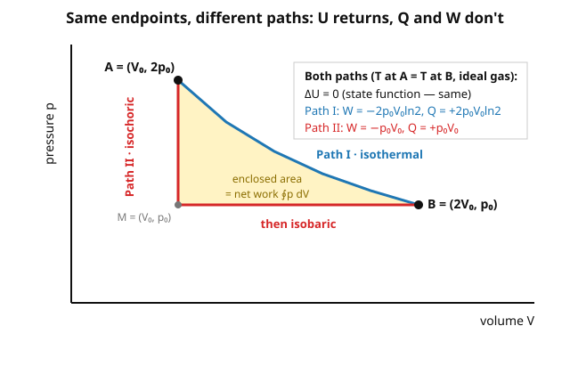

# Statistical Mechanics · Lesson 2.1: The laws of thermodynamics

> ⏱ ~15 min · Module 2: Thermodynamics — the macroscopic laws · Builds on: [1.3 Entropy and the microcanonical ensemble](#/lesson/stat-mech/01-03-entropy-microcanonical.md), [1.4 Temperature, pressure, chemical potential](#/lesson/stat-mech/01-04-temperature-pressure-chemical-potential.md) · Unlocks: 2.2 Entropy, engines, and the Carnot bound

## Why this matters

In Module 1 we *built* thermodynamics from the bottom up: entropy is $S=k_B\ln\Omega$, temperature is $1/T=\partial S/\partial E$, and the second law is just the statement that $\Omega$ overwhelmingly prefers to grow. But a century before anyone counted a microstate, engineers and chemists had already distilled the same physics into four laws stated entirely in macroscopic variables — pressure, volume, heat, work. This module is the **target** statistical mechanics has to hit: whatever $\ln Z$ eventually spits out must reproduce these laws exactly. Getting fluent in the macroscopic language now — especially the razor-sharp distinction between *state functions* and *process quantities* — is what lets you check your microscopic answers and, later, run the whole machine backwards through Legendre transforms and Maxwell relations.

## The idea

Two ideas carry the entire module. First: **some quantities belong to the system, others belong to the trip.** Where a gas sits — its energy, temperature, pressure, volume, entropy — depends only on its current condition, not on how it got there. These are *state functions*: like your altitude on a mountain, fixed by where you stand. But *heat* and *work* are not properties the gas "has"; they are energy in transit, tallied along the journey. Two hikers reaching the same summit from the same base can burn wildly different amounts of energy depending on the trail. Change the path, and heat and work change — even though the endpoints, and therefore the energy, don't.

Second: **the four laws are bookkeeping rules for that energy.** The Zeroth law says "in equilibrium with" is a consistent relation, so a thermometer reading (temperature) is meaningful at all. The First law says energy is conserved once you count heat as a form of energy transfer. The Second law says one bookkeeping entry — entropy — can only be added to, never subtracted, in an isolated system, which is why time has a direction. The Third law pins the entropy scale at absolute zero so the ledger has an origin. That's it. Everything else in thermodynamics is these four rules plus calculus.

## The formal version

**Zeroth law.** If $A$ is in thermal equilibrium with $C$, and $B$ is in thermal equilibrium with $C$, then $A$ is in thermal equilibrium with $B$. *In words:* thermal equilibrium is **transitive**, so all mutually equilibrated systems share one number — call it **temperature** $T$. Without this, a thermometer would measure nothing.

**First law.** For any process,
$$dU = \delta Q + \delta W, \qquad \delta W = -p\,dV.$$
*In words:* the change in a system's **internal energy** $U$ equals the heat $\delta Q$ added **to** it plus the work $\delta W$ done **on** it. We use the "work done on the gas" convention: compressing it ($dV<0$) does positive work $\delta W=-p\,dV>0$, raising $U$. The heat $\delta Q$ is likewise positive when energy flows *in*. Because $U$ is a state function, over any closed cycle $\oint dU = 0$: the energy always comes home.

> **Sign-convention warning.** Many chemistry and engineering texts write $dU=\delta Q-\delta W$ with $\delta W=+p\,dV$ being work done *by* the gas. Same physics, opposite sign on $W$. We commit to **work done ON the gas, $\delta W=-p\,dV$**, for the whole course — it makes $U$'s ledger a plain sum and matches the statistical-mechanics literature (Kardar).

**Second law.** For an **isolated** system, $\Delta S \ge 0$, with equality only for a reversible process. Equivalently (Clausius): *no process has as its sole effect the transfer of heat from a colder body to a hotter one.* *In words:* left alone, entropy never decreases; heat flows downhill in temperature unless you pay for it elsewhere. This is exactly the $\Omega$-maximization of [1.3](#/lesson/stat-mech/01-03-entropy-microcanonical.md) — $S=k_B\ln\Omega$ grows because the system drifts toward the macrostate realized by the most microstates.

**Third law (Nernst).** As $T\to 0$, the entropy approaches a constant $S_0$ independent of the other parameters (for a perfect crystal, $S_0=0$). *In words:* at absolute zero a system settles into its unique ground state, $\Omega\to 1$, so $S=k_B\ln 1=0$ — the microscopic picture makes this almost obvious.

**State functions vs process quantities.** $U,S,T,p,V$ are **state functions**: they have **exact** differentials, and $\oint dU=0$. Their changes depend only on endpoints. $Q$ and $W$ are **process quantities**: they have **inexact** differentials, written with $\delta$ (not $d$) precisely because there is no function $Q(p,V)$ to differentiate. Their totals depend on the path. *In words:* you can't ask "how much heat does this gas contain" — only "how much heat crossed the boundary on *this* trip."

**Reversible vs quasi-static, and $\delta Q = T\,dS$.** A **quasi-static** process is slow enough that the system stays arbitrarily close to equilibrium throughout. A **reversible** process is quasi-static *and* dissipation-free (no friction, no finite-temperature-gap heat flow), so it can be run backward retracing every state. For a reversible process only,
$$\delta Q_\text{rev} = T\,dS.$$
*In words:* dividing the inexact $\delta Q_\text{rev}$ by the temperature turns it into the exact differential of a state function, entropy. That division by $T$ is the whole trick — $1/T$ is the **integrating factor** that converts path-dependent heat into a path-independent quantity (you'll prove this in Problem 2). Combined with the first law for reversible changes:
$$\boxed{\,dU = T\,dS - p\,dV\,}$$
the **fundamental thermodynamic relation** — every potential in Lesson 2.3 is a rearrangement of this one line.

## Picture

The blue isotherm and the red two-leg path connect the *same* points $A$ and $B$, chosen so both endpoints sit at the same temperature ($p_AV_A = p_BV_B$). For the ideal gas that forces $\Delta U=0$ on both — $U$ is a state function. But the work is the (signed) area under each path in the $p$–$V$ plane, and the two areas plainly differ; the shaded region between them is the net work $\oint p\,dV$ you'd extract by going out one path and back the other. Heat, forced by the first law to be $Q=\Delta U - W$, differs right along with it.

## Worked examples

**Example 1 (mechanical — an exact differential closes; an inexact one doesn't).** Take one mole of monatomic ideal gas, $U=\tfrac32 pV$ and $pV=RT$. Run the cycle $A\to B\to A$ where $A=(V_0,2p_0)$, out along the isotherm to $B=(2V_0,p_0)$, back along the red two-leg path. Around the *whole loop*,
$$\oint dU = 0 \quad(\text{state function}),\qquad \oint \delta Q = -\oint\delta W = \oint p\,dV \ne 0.$$
The heat absorbed over the cycle is nonzero (that's what an engine lives on), yet $U$ returns exactly to its start. An exact differential integrates to zero around any loop; an inexact one need not. *This single fact — $\oint \delta Q\neq0$ but $\oint dU=0$ — is the reason heat engines exist.*

**Example 2 (why you'd care — heat flow has a direction, and entropy enforces it).** Drop a hot stone ($T_H$) into a cold lake ($T_C$), transferring a small heat $\delta Q$ from stone to lake. The stone loses $\delta Q$ at $T_H$, the lake gains it at $T_C$, so the universe's entropy changes by
$$dS_\text{univ} = -\frac{\delta Q}{T_H} + \frac{\delta Q}{T_C} = \delta Q\left(\frac{1}{T_C}-\frac{1}{T_H}\right) > 0 \quad\text{since } T_C<T_H.$$
Positive — allowed. Run it backward (heat from cold lake to hot stone) and $dS_\text{univ}<0$ — **forbidden** by the second law, which is Clausius's statement made quantitative. Nothing in the *first* law objects to heat flowing uphill; energy would still be conserved. It's the second law, and underneath it the microstate count of [1.3](#/lesson/stat-mech/01-03-entropy-microcanonical.md), that gives the process an arrow.

## Watch out

- You might think heat and work are things a system *stores*, so you'd write $dQ$ and $dW$. **Actually** there is no state function $Q$ or $W$ — that's why we write $\delta$. A gas contains internal energy $U$, never "an amount of heat." Heat is a *transfer*, defined only along a process.
- You might think $\delta Q=T\,dS$ always. **Actually** it holds only for **reversible** processes. For an irreversible one (free expansion, heat across a finite gap) $dS > \delta Q/T$ — the Clausius *inequality*, the engine of Lesson 2.2. Entropy still changes; it's just no longer equal to the heat divided by $T$.
- You might think the second law forbids *any* entropy decrease. **Actually** it forbids it only for an **isolated** system. Your refrigerator lowers its contents' entropy every second — by dumping more than that into the kitchen, so $\Delta S_\text{univ}\ge 0$ still holds. Always ask "entropy of *what*?"
- You might mix sign conventions mid-problem. **Actually** pick one and never switch: we use $\delta W=-p\,dV$ (work on the gas). If you import a formula written for work *by* the gas, flip the sign of $W$ first.

## One-liner

> State functions ($U,S,T,p,V$) care only where you are; process quantities ($Q,W$) care how you got there — and dividing reversible heat by $T$ turns the second kind into the first.

## Problems

**P1 (🟢)** One mole of monatomic ideal gas ($U=\tfrac32 RT=\tfrac32 pV$) goes from $A=(V_0,\,2p_0)$ to $B=(2V_0,\,p_0)$. Compute $\Delta U$, $Q$, and $W$ (work on the gas, $\delta W=-p\,dV$) along **(i)** the isotherm and **(ii)** the two-leg path $A\to(V_0,p_0)\to B$ (drop pressure at fixed volume, then expand at fixed pressure). Confirm $\Delta U$ is path-independent while $Q$ and $W$ are not.

**P2 (🟡)** For the ideal gas, $\delta Q = C_V\,dT + \dfrac{RT}{V}\,dV$ (one mole, $C_V$ constant). Using the exactness test — a differential $M\,dT+N\,dV$ is exact iff $\partial M/\partial V=\partial N/\partial T$ — show $\delta Q$ is **not** exact, but $\delta Q/T$ **is**. Then integrate $\delta Q/T$ to read off $S(T,V)$. This exhibits $1/T$ as the integrating factor promised in the text.

**P3 (🔴, optional)** Two identical solid blocks, each with constant heat capacity $C$, start at temperatures $T_1$ and $T_2$ ($T_1\neq T_2$) and are placed in thermal contact inside an isolated box. **(a)** Use energy conservation (first law) to find the final temperature $T_f$. **(b)** Compute $\Delta S_\text{univ}$ and prove it is strictly positive, so the process obeys the second law. **(c)** Show that *maximizing* the total entropy at fixed total energy independently picks the same $T_f$ — the microscopic $\Omega$-maximization of [1.3](#/lesson/stat-mech/01-03-entropy-microcanonical.md) and the macroscopic second law agreeing.

Solutions

**P1** First note $p_AV_A = 2p_0V_0 = p_BV_B$, so $T_A=T_B$ and $\Delta U = \tfrac32 R\,\Delta T = 0$ on **both** paths. Good — that's the point. Now heat and work, with $\delta W=-p\,dV$ and $Q=\Delta U - W$.

*(i) Isotherm.* Here $pV=2p_0V_0\equiv RT$ is constant, so
$$W_\text{iso} = -\int_{V_0}^{2V_0} p\,dV = -\int_{V_0}^{2V_0}\frac{2p_0V_0}{V}\,dV = -2p_0V_0\ln\frac{2V_0}{V_0} = -2p_0V_0\ln 2.$$
Then $Q_\text{iso} = \Delta U - W_\text{iso} = 0 -(-2p_0V_0\ln2) = +2p_0V_0\ln 2$.

*(ii) Two-leg path.* Leg 1, isochoric $A\to M=(V_0,p_0)$: $dV=0\Rightarrow W_1=0$. The energy drops, $\Delta U_1=\tfrac32(p_0V_0 - 2p_0V_0)=-\tfrac32 p_0V_0$, so $Q_1=\Delta U_1 - W_1 = -\tfrac32 p_0V_0$. Leg 2, isobaric $M\to B$ at $p=p_0$: $W_2=-p_0(2V_0-V_0)=-p_0V_0$, and $\Delta U_2=\tfrac32(2p_0V_0-p_0V_0)=+\tfrac32 p_0V_0$, so $Q_2=\Delta U_2-W_2=\tfrac32 p_0V_0-(-p_0V_0)=+\tfrac52 p_0V_0$. Totals:
$$W_\text{2-leg}=-p_0V_0,\qquad Q_\text{2-leg}=-\tfrac32 p_0V_0+\tfrac52 p_0V_0=+p_0V_0,\qquad \Delta U = 0.\ \checkmark$$

**Verdict.** $\Delta U=0$ both ways (state function). But $W$: $-2p_0V_0\ln2\approx-1.39\,p_0V_0$ vs $-p_0V_0$, and $Q$: $+1.39\,p_0V_0$ vs $+p_0V_0$ — path-dependent, exactly as inexact differentials must be. (First-law check on each path: $Q+W=0=\Delta U$. ✓)

**P2** Write $\delta Q = M\,dT + N\,dV$ with $M=C_V$ (constant) and $N=RT/V$.
$$\frac{\partial M}{\partial V}=0,\qquad \frac{\partial N}{\partial T}=\frac{R}{V}\neq 0.$$
Unequal ⇒ $\delta Q$ is **not exact** (no state function "heat"). Now divide by $T$: $\dfrac{\delta Q}{T}=\dfrac{C_V}{T}\,dT+\dfrac{R}{V}\,dV$, so $\tilde M=C_V/T$, $\tilde N=R/V$, and
$$\frac{\partial \tilde M}{\partial V}=0=\frac{\partial \tilde N}{\partial T}.$$
Equal ⇒ **exact**. So $dS=\delta Q/T$ is a perfect differential; integrating each piece,
$$S(T,V)=C_V\ln T + R\ln V + \text{const}.$$
(Check: $\partial S/\partial T=C_V/T$ and $\partial S/\partial V=R/V$ reproduce the integrand.) The factor $1/T$ converted a path-dependent $\delta Q$ into the path-independent $dS$ — the promised integrating factor. This $S$ is one term short of the [Sackur–Tetrode entropy](#/lesson/stat-mech/01-05-ideal-gas-sackur-tetrode.md); the missing $N$-dependence is what fixes the Gibbs paradox.

**P3** Let block 1 have $T_1$, block 2 have $T_2$; both have heat capacity $C$, and the box is isolated so all heat lost by one is gained by the other.

*(a)* Energy conservation: $C(T_f-T_1)+C(T_f-T_2)=0 \Rightarrow \boxed{T_f=\tfrac12(T_1+T_2)}$ — the arithmetic mean, because the capacities are equal.

*(b)* Each block's entropy change is $\displaystyle\int \frac{\delta Q}{T}=\int_{T_i}^{T_f}\frac{C\,dT}{T}=C\ln\frac{T_f}{T_i}$ (heating is done reversibly for the entropy accounting — entropy is a state function, so we may compute along any reversible path with the same endpoints). Summing,
$$\Delta S_\text{univ}=C\ln\frac{T_f}{T_1}+C\ln\frac{T_f}{T_2}=C\ln\frac{T_f^2}{T_1T_2}=C\ln\frac{\big(\tfrac{T_1+T_2}{2}\big)^2}{T_1T_2}.$$
By the AM–GM inequality $\tfrac12(T_1+T_2)\ge\sqrt{T_1T_2}$, with equality **iff** $T_1=T_2$. Squaring, the fraction inside the log exceeds $1$ whenever $T_1\neq T_2$, so $\Delta S_\text{univ}>0$. The second law is satisfied, and it is what forbids the blocks from spontaneously drifting apart in temperature.

*(c)* Fix total energy $E=C\,T_1'+C\,T_2'$ (constant), let the split vary, and maximize $S_\text{tot}=C\ln T_1' + C\ln T_2' + \text{const}$. With $T_2'=E/C - T_1'$,
$$\frac{dS_\text{tot}}{dT_1'}=\frac{C}{T_1'}-\frac{C}{T_2'}=0 \ \Rightarrow\ T_1'=T_2'.$$
Equal final temperatures — which, with energy conservation, is again $T_f=\tfrac12(T_1+T_2)$. The condition "$\partial S/\partial E$ equal on both sides" is exactly the [1.4](#/lesson/stat-mech/01-04-temperature-pressure-chemical-potential.md) definition $1/T=\partial S/\partial E$ setting the two temperatures equal at equilibrium. Macroscopic second law and microscopic $\Omega$-maximization land on the identical endpoint.

## Flashback

**From Lesson 1.4 (Temperature from entropy):** A system's entropy as a function of its energy is $S(E)=a\sqrt{E}$, with $a>0$ a constant. Find its temperature $T(E)$ and its heat capacity $C=dE/dT$. Does the system get *hotter* as you add energy?

Solution

Temperature comes from the microcanonical definition $\dfrac{1}{T}=\dfrac{\partial S}{\partial E}$:
$$\frac{1}{T}=\frac{d}{dE}\big(a\sqrt E\big)=\frac{a}{2\sqrt E}\ \Rightarrow\ T=\frac{2\sqrt E}{a}.$$
Invert for $E(T)$: $\sqrt E = aT/2$, so $E=\tfrac{a^2}{4}T^2$, and
$$C=\frac{dE}{dT}=\frac{a^2}{2}\,T > 0.$$
Yes — $T=2\sqrt E/a$ increases with $E$, so adding energy raises the temperature (positive heat capacity), as any stable everyday system does. This is the same move as Problem 3(c): temperature is *defined* as an entropy derivative, and it's monotonic in $E$ precisely when $S(E)$ is concave.

## Connections

- **Backward:** the second law here *is* the $\Omega$-maximization of [1.3](#/lesson/stat-mech/01-03-entropy-microcanonical.md), and $1/T=\partial S/\partial E$ from [1.4](#/lesson/stat-mech/01-04-temperature-pressure-chemical-potential.md) is what makes "$A$ in equilibrium with $B$" (the Zeroth law) mean "same $T$." Thermodynamic entropy and statistical entropy are one object, $S=k_B\ln\Omega$.
- **Forward:** the fundamental relation $dU=T\,dS-p\,dV$ is the seed of everything downstream — [2.2](#/lesson/stat-mech/02-02-entropy-engines-carnot.md) turns the Clausius inequality into the Carnot efficiency bound, [2.3](#/lesson/stat-mech/02-03-thermodynamic-potentials-legendre.md) Legendre-transforms it into $F,H,G$, and [2.4](#/lesson/stat-mech/02-04-maxwell-relations-stability.md) reads Maxwell relations off its exactness. In Module 3 the canonical [free energy](#/lesson/stat-mech/03-02-partition-function.md) $F=-k_BT\ln Z$ hands you $S$ and $U$ back automatically.
- **Sideways (mechanics & math):** exact-vs-inexact differentials are the same objects as closed-vs-exact 1-forms — an inexact $\delta Q$ has $\oint\delta Q\neq0$, a state function has vanishing loop integral, exactly the [phase-space](#/lesson/analytical-mechanics/03-02-phase-space-liouville.md) integral-invariant bookkeeping from analytical mechanics. The integrating-factor trick (a 1-form times $1/T$ becomes exact) is Pfaffian-form theory wearing a physicist's hat.
