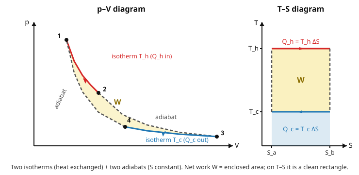

# Statistical Mechanics · Lesson 2.2: Entropy, engines, and the Carnot bound

> ⏱ ~15 min · Module 2: Thermodynamics — the macroscopic laws · Builds on: [2.1 The laws of thermodynamics](#/lesson/stat-mech/02-01-laws-of-thermodynamics.md), [1.3 Entropy and the microcanonical ensemble](#/lesson/stat-mech/01-03-entropy-microcanonical.md) · Unlocks: 2.3 Thermodynamic potentials and Legendre transforms

## Why this matters

The first law says energy is conserved, so heat and work are freely interconvertible — bookkeeping-wise. But everyone who has watched a hot coffee cool knows the universe has a *preference*: work turns fully into heat (stir the coffee, it warms), while heat refuses to turn fully back into work. Engines — everything from a steam turbine to your car to a power plant — live exactly on this asymmetry, and there is a hard ceiling on how well they can do it that no amount of engineering can breach. That ceiling, discovered by a 28-year-old Carnot in 1824 *before anyone knew what heat was*, is what forces the existence of **entropy** as a genuine state function. This lesson is where the vague "second law" of 2.1 becomes a sharp, computable inequality.

## The idea

Picture an engine as a middleman between two reservoirs: a hot one at temperature $T_h$ and a cold one at $T_c$. Heat $Q_h$ flows in from the hot side, the engine skims off some work $W$, and it must dump the rest, $Q_c$, into the cold side. It *cannot* skim everything — a cyclic engine that took heat from one reservoir and turned it entirely into work, dumping nothing, is exactly the perpetual-motion machine the second law forbids. So its efficiency

$$\eta = \frac{W}{Q_h} = \frac{Q_h - Q_c}{Q_h} = 1 - \frac{Q_c}{Q_h}$$

is always less than 1, because $Q_c > 0$ is mandatory.

Here is the deep part. Why can't $Q_c$ be zero? Because heat carries **entropy** — $\delta Q$ at temperature $T$ carries entropy $\delta Q/T$ — and every cycle must return the engine to its starting state, so its entropy comes back to where it began. The entropy that rode in on $Q_h$ (namely $Q_h/T_h$) has to leave somehow, and the only exit is the cold reservoir. But the same entropy leaves as $Q_c/T_c$, and because $T_c < T_h$, carrying that entropy out at low temperature takes *less heat per unit entropy* than it took to bring it in — the leftover heat, $W$, is yours to keep. Low temperature is what makes heat "cheap" to dump. **Temperature is the exchange rate between heat and entropy, and it is the whole game.**

The best you can possibly do is waste no entropy of your own — run every step **reversibly**. That ideal is the **Carnot cycle**, and it caps every real engine.

## The formal version

**Efficiency.** For any engine running a cycle between two reservoirs,

$$\eta = 1 - \frac{Q_c}{Q_h}, \qquad Q_h,\,Q_c > 0.$$

In words: efficiency is one minus the fraction of the input heat you're forced to throw away.

**The Carnot cycle.** A reversible cycle built from four strokes on an ideal gas (all quasi-static): isothermal expansion at $T_h$ (absorb $Q_h$), adiabatic expansion ($T_h \to T_c$, no heat), isothermal compression at $T_c$ (reject $Q_c$), adiabatic compression ($T_c \to T_h$). Two isotherms, two adiabats — nothing else.

**Carnot's theorem (from the second law).** No engine operating between reservoirs at $T_h$ and $T_c$ can beat the Carnot engine, and *all* reversible engines between them share the same efficiency:

$$\boxed{\;\eta_{\text{Carnot}} = 1 - \frac{T_c}{T_h}\;}$$

In words: the maximum efficiency depends *only* on the two temperatures — not the working substance, not the design. Reversibility is the ceiling; irreversibility is the only thing that pushes you below it.

**The Clausius inequality.** For any cyclic process,

$$\oint \frac{\delta Q}{T} \le 0, \qquad \text{with equality iff the cycle is reversible.}$$

In words: sum up (heat absorbed)/(temperature it was absorbed at) around any loop, and you never get a positive number; you hit exactly zero only if nothing was wasted.

**Entropy as a state function.** Because $\oint \delta Q_{\text{rev}}/T = 0$, the quantity $\delta Q_{\text{rev}}/T$ is an **exact differential** — its integral between two states is path-independent. That *defines* entropy:

$$dS = \frac{\delta Q_{\text{rev}}}{T}, \qquad \Delta S = \int_i^f \frac{\delta Q_{\text{rev}}}{T}.$$

In words: heat $\delta Q$ is path-dependent (an inexact differential, the "$\delta$"), but dividing by $T$ launders it into an honest state function $S$ that only cares about the endpoints. And for a *real* (possibly irreversible) process, Clausius gives the working form of the second law:

$$\Delta S \ge \int_i^f \frac{\delta Q}{T}, \qquad \text{(} = \text{ for reversible)}.$$

For a thermally isolated system ($\delta Q = 0$): $\Delta S \ge 0$. Entropy never decreases.

**Reversed engines.** Run a Carnot engine backwards and it becomes a **refrigerator / heat pump**: put in work $W$ to pump heat $Q_c$ out of the cold reservoir into the hot one. Rated by a *coefficient of performance* (COP), not efficiency:

$$\text{COP}_{\text{fridge}} = \frac{Q_c}{W} = \frac{T_c}{T_h - T_c}, \qquad \text{COP}_{\text{heat pump}} = \frac{Q_h}{W} = \frac{T_h}{T_h - T_c}.$$

In words: a fridge's payoff is heat *removed* per work paid; a heat pump's is heat *delivered*. Both blow up as $T_h \to T_c$ — moving heat across a tiny temperature gap is nearly free.

## Picture

The two panels say the same thing in two coordinate systems. On **$p$–$V$**, the net work is the messy area enclosed by the loop. On **$T$–$S$**, the cycle is a *rectangle*: the two isotherms are horizontal (constant $T$), the two adiabats are vertical (constant $S$, since $dS = \delta Q_{\text{rev}}/T = 0$ when $\delta Q = 0$). Heat absorbed $Q_h = T_h\,\Delta S$ is the area under the top edge; heat rejected $Q_c = T_c\,\Delta S$ is the area under the bottom; the net work $W = (T_h - T_c)\,\Delta S$ is the enclosed rectangle. Read off $\eta = W/Q_h = (T_h - T_c)/T_h = 1 - T_c/T_h$ *by eye* — no calculus. This is why thermodynamicists love the $T$–$S$ plane.

## Worked examples

**Example 1 (mechanical — the derivation of the bound).** Compute $Q_h$ and $Q_c$ for the ideal-gas Carnot cycle and watch the volume ratios cancel. Label the four corners $1\to2\to3\to4$ as in the figure.

*Isothermal expansion $1\to2$ at $T_h$.* An ideal gas has $U = U(T)$ only, so $\Delta U = 0$ and the first law gives $Q_h = W_{12} = \int_{V_1}^{V_2} p\,dV = \int_{V_1}^{V_2}\frac{nRT_h}{V}\,dV = nRT_h \ln\!\frac{V_2}{V_1} > 0.$

*Isothermal compression $3\to4$ at $T_c$.* Same move; the heat *rejected* is $Q_c = nRT_c \ln\!\frac{V_3}{V_4} > 0.$

*The two adiabats.* Along an adiabat, $TV^{\gamma-1} = \text{const}$ (from $\delta Q = 0$ plus the ideal-gas law). So

$$T_h V_2^{\gamma-1} = T_c V_3^{\gamma-1} \quad(2\to3), \qquad T_h V_1^{\gamma-1} = T_c V_4^{\gamma-1} \quad(4\to1).$$

Divide the first by the second: $\left(\frac{V_2}{V_1}\right)^{\gamma-1} = \left(\frac{V_3}{V_4}\right)^{\gamma-1}$, hence $\dfrac{V_2}{V_1} = \dfrac{V_3}{V_4}$. The two logarithms are equal. Therefore

$$\eta = 1 - \frac{Q_c}{Q_h} = 1 - \frac{nRT_c \ln(V_3/V_4)}{nRT_h \ln(V_2/V_1)} = 1 - \frac{T_c}{T_h}.$$

The working substance dropped out entirely — that's Carnot's theorem in your hands.

**Example 2 (why you'd care — a real power plant, and a fridge).** A steam plant runs a boiler at $T_h = 810\ \text{K}$ and rejects to a river at $T_c = 300\ \text{K}$. The Carnot ceiling is

$$\eta_{\text{Carnot}} = 1 - \frac{300}{810} = 0.63 = 63\%.$$

Real plants hit $\sim 40\%$ — the gap is irreversibility (friction, finite-rate heat flow, turbulence), each bit of which makes $\oint \delta Q/T < 0$ and drags $\eta$ below the ceiling. Notice the lever: to raise the ceiling you want $T_h$ *high*, which is why engineers chase ever-hotter turbines.

Now reverse it into a kitchen fridge keeping food at $T_c = 275\ \text{K}$ in a $T_h = 300\ \text{K}$ room:

$$\text{COP} = \frac{T_c}{T_h - T_c} = \frac{275}{25} = 11.$$

Ideally 11 joules of heat pumped out per joule of electricity — because the temperature gap is small. Try to freeze something to $77\ \text{K}$ from the same room and the COP collapses to $77/223 \approx 0.35$: cold is *expensive*, and it gets exponentially worse the deeper you go. Same physics that will govern the reachability of low temperatures in later lessons.

## Watch out

- You might think efficiency and COP are "the same number for a reversed engine." They're reciprocal-ish but **defined against different denominators** — $\eta = W/Q_h$ (work out per heat in), $\text{COP}_{\text{fridge}} = Q_c/W$ (heat moved per work in). COP routinely exceeds 1; efficiency never can. Don't mix them.
- You might think $\Delta S = \int \delta Q/T$ always. It's $\Delta S \ge \int \delta Q/T$, with equality *only* for reversible paths. To compute $\Delta S$ for an irreversible process (free expansion, say), you must invent a **reversible path between the same two states** and integrate along *that* — $S$ is a state function, so the answer is the same, but the actual irreversible heat integral would undercount it.
- You might think "adiabatic" means "constant temperature." Adiabatic means $\delta Q = 0$ (no heat exchanged) — temperature *changes* as the gas does work. It's the *isothermal* legs that hold $T$ fixed. On the $T$–$S$ rectangle: isotherms horizontal, adiabats vertical. Swapping these is the single most common Carnot mistake.
- You might think a Carnot engine is a good *real* engine. It's uselessly slow — reversibility requires quasi-static steps, i.e. zero power output. It's the *bound*, an idealization, not a blueprint.

## One-liner

> Temperature is the price of dumping entropy: an engine keeps only the heat left over after paying $Q_h/T_h = Q_c/T_c$ worth of entropy out the cold end, capping efficiency at $1 - T_c/T_h$.

## Problems

**P1 (🟢)** A Carnot engine runs between $T_h = 500\ \text{K}$ and $T_c = 300\ \text{K}$, absorbing $Q_h = 1200\ \text{J}$ of heat per cycle. Find (a) its efficiency, (b) the work $W$ per cycle, and (c) the heat $Q_c$ rejected per cycle. Check that $Q_h/T_h = Q_c/T_c$.

**P2 (🟡)** Prove $\eta_{\text{Carnot}} = 1 - T_c/T_h$ from scratch for the ideal-gas Carnot cycle: compute $Q_h$ and $Q_c$ on the two isotherms and use the adiabatic relation $TV^{\gamma-1} = \text{const}$ on the two adiabats to show the volume-ratio logarithms cancel. State clearly where $\Delta U = 0$ is used.

**P3 (🔴, optional)** *(Carnot's theorem by reductio.)* Suppose a "super-engine" $X$ had efficiency $\eta_X > \eta_{\text{Carnot}}$ between the same two reservoirs. Couple it to an ordinary Carnot engine run *backwards* as a refrigerator, arranging that the refrigerator's work input is supplied entirely by $X$ and that the refrigerator returns exactly $Q_h$ to the hot reservoir. Show the combined device is a cyclic machine whose *only* net effect is to extract heat from the cold reservoir and deliver it as work to the hot reservoir — violating the second law. Conclude $\eta_X \le \eta_{\text{Carnot}}$. (This is the argument that makes the bound *universal*, independent of what $X$ is made of — the same logic recurs when we argue all reversible engines share one efficiency.)

Solutions

**P1** (a) $\eta = 1 - T_c/T_h = 1 - 300/500 = 0.40 = 40\%.$
(b) $W = \eta\,Q_h = 0.40 \times 1200 = 480\ \text{J}.$
(c) $Q_c = Q_h - W = 1200 - 480 = 720\ \text{J}.$
Entropy check: $Q_h/T_h = 1200/500 = 2.4\ \text{J/K}$ and $Q_c/T_c = 720/300 = 2.4\ \text{J/K}$. Equal — the entropy that entered on $Q_h$ left on $Q_c$, exactly, so $\oint \delta Q/T = 0$: this cycle is reversible, as a Carnot engine must be.

**P2** Label corners $1\to2\to3\to4$: isothermal expansion at $T_h$, adiabatic expansion, isothermal compression at $T_c$, adiabatic compression.

*Isotherms.* For an ideal gas $U$ depends on $T$ alone, so on any isotherm $\Delta U = 0$ **(this is the key step)**, and the first law $\delta Q = dU + p\,dV$ reduces to $\delta Q = p\,dV$. Thus
$$Q_h = \int_{V_1}^{V_2}\frac{nRT_h}{V}\,dV = nRT_h\ln\frac{V_2}{V_1}, \qquad Q_c = nRT_c\ln\frac{V_3}{V_4}$$
(the latter is heat rejected, taken positive: on $3\to4$ the gas is compressed, $V_3>V_4$, so $\ln(V_3/V_4)>0$).

*Adiabats.* With $\delta Q=0$, the first law $nC_V\,dT = -p\,dV = -nRT\,dV/V$ integrates to $TV^{\gamma-1}=\text{const}$ (using $\gamma = C_p/C_V$, $R = C_p - C_V$). Applying it to each adiabat:
$$T_h V_2^{\gamma-1} = T_c V_3^{\gamma-1}, \qquad T_h V_1^{\gamma-1} = T_c V_4^{\gamma-1}.$$
Dividing, $(V_2/V_1)^{\gamma-1} = (V_3/V_4)^{\gamma-1}$, so $V_2/V_1 = V_3/V_4$ and $\ln(V_2/V_1) = \ln(V_3/V_4)$.

*Combine.*
$$\eta = 1 - \frac{Q_c}{Q_h} = 1 - \frac{nRT_c\ln(V_3/V_4)}{nRT_h\ln(V_2/V_1)} = 1 - \frac{T_c}{T_h}. \qquad\blacksquare$$
Everything about the gas ($n$, $\gamma$, the volumes) cancels — only the two temperatures survive.

**P3** Let $X$ absorb $Q_h'$ from the hot reservoir and produce work $W_X = \eta_X Q_h'$, rejecting $Q_c' = Q_h' - W_X$ to the cold reservoir. Run a Carnot refrigerator that *delivers* exactly $Q_h$ to the hot reservoir; being reversible it requires work $W_C = Q_h(1 - T_c/T_h) = \eta_{\text{Carnot}}\,Q_h$ and it extracts $Q_c = Q_h - W_C$ from the cold reservoir.

Now **choose the sizing** so the hot reservoir sees no net change: set $Q_h' = Q_h \equiv Q$. Then over one combined cycle the hot reservoir gives up $Q$ to $X$ and receives $Q$ back from the fridge — net zero. Both devices return to their initial states (cyclic). The net work produced is
$$W_{\text{net}} = W_X - W_C = \eta_X Q - \eta_{\text{Carnot}} Q = (\eta_X - \eta_{\text{Carnot}})\,Q > 0$$
by the assumption $\eta_X > \eta_{\text{Carnot}}$. Where does this work's energy come from? Energy conservation on the cold reservoir: it delivered $Q_c$ to the fridge and received $Q_c'$ from $X$, a net loss of $Q_c - Q_c' = (Q - W_C) - (Q - W_X) = W_X - W_C = W_{\text{net}}$.

So the *sole* net effect of the combined cyclic machine is: extract $W_{\text{net}} > 0$ from the cold reservoir and convert it entirely to work, with no other change anywhere. That is a Kelvin–Planck-forbidden perpetual-motion machine of the second kind (equivalently, it *lowers* total entropy: the cold reservoir lost entropy $W_{\text{net}}/T_c$ and nothing gained any). Contradiction. Hence no such $X$ exists and $\eta_X \le \eta_{\text{Carnot}}$ for every engine. Running $X$ itself reversibly makes it a Carnot engine and gives equality — so all reversible engines between the two reservoirs share the one efficiency $1 - T_c/T_h$. $\qquad\blacksquare$

## Flashback

**From Lesson 1.3 (Entropy and the microcanonical ensemble):** $N$ molecules of ideal gas occupy volume $V_i$; a partition is removed and they freely expand into total volume $V_f = 2V_i$ with no heat added and no work done (free expansion into vacuum). (a) Using $S = k_B \ln \Omega$ with single-particle phase-space volume $\propto V$, find $\Delta S$ from *counting*. (b) Show the same $\Delta S$ comes from integrating $\delta Q_{\text{rev}}/T$ along a *reversible isothermal* path between the same two states — even though the actual free expansion exchanged no heat at all.

Solution

(a) With each particle's accessible phase-space volume $\propto V$ and $N$ independent particles, $\Omega \propto V^N$, so $S = k_B\ln\Omega = Nk_B\ln V + \text{const}$. Hence
$$\Delta S = Nk_B\ln\frac{V_f}{V_i} = Nk_B\ln 2 > 0.$$

(b) $S$ is a **state function**, so $\Delta S$ depends only on the endpoints — replace the irreversible free expansion by a reversible isothermal expansion at temperature $T$ from $V_i$ to $V_f$ (same $T$, since free expansion of an ideal gas keeps $U$, hence $T$, fixed). On that path $\Delta U = 0$ so $\delta Q_{\text{rev}} = p\,dV = nRT\,dV/V$, and
$$\Delta S = \int \frac{\delta Q_{\text{rev}}}{T} = \frac{1}{T}\int_{V_i}^{V_f}\frac{nRT}{V}\,dV = nR\ln\frac{V_f}{V_i} = nR\ln 2.$$
Since $nR = Nk_B$, this is exactly $Nk_B\ln 2$ — the counting answer. The lesson: the *actual* process had $\int\delta Q/T = 0 < \Delta S$ (irreversible, strict inequality in Clausius), but the state function $S$ still rose by $Nk_B\ln 2$, computed via a reversible detour. Micro-counting and macro-thermodynamics agree.

## Connections

- **Backward:** this turns the qualitative second law of [2.1](#/lesson/stat-mech/02-01-laws-of-thermodynamics.md) into the sharp Clausius inequality, and it explains *why* $S$ from [1.3](#/lesson/stat-mech/01-03-entropy-microcanonical.md)'s microstate count $S = k_B\ln\Omega$ deserves the name "entropy" — the two definitions give the same $\Delta S$ (the Flashback proves it in one case). The $\delta Q$ vs $dS$ distinction is 2.1's inexact-vs-exact differential idea made to pay off.
- **Forward:** knowing $S$ is a state function with $dU = T\,dS - p\,dV$ is the launchpad for [2.3](#/lesson/stat-mech/02-03-thermodynamic-potentials-legendre.md), where Legendre transforms swap $S$ for $T$ to build $F, H, G$; and the reversible-cycle machinery reappears as the [2.4](#/lesson/stat-mech/02-04-maxwell-relations-stability.md) stability conditions. When the canonical ensemble arrives, $F = -k_BT\ln Z$ will reproduce this same entropy from the partition function.
- **Sideways (arrow of time / information):** $\Delta S \ge 0$ is the only law of physics that distinguishes past from future — the thread picked up in 6.2 (entropy, information, and Maxwell's demon), where the "cost of dumping entropy" here becomes Landauer's cost of *erasing information*. The impossibility of the P3 super-engine is the thermodynamic ancestor of "you can't get something for nothing."
