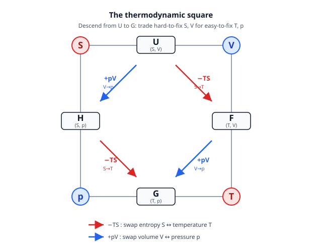

# Statistical Mechanics · Lesson 2.3: Thermodynamic potentials and Legendre transforms

> ⏱ ~15 min · Module 2: Thermodynamics — the macroscopic laws · Builds on: [2.1 The laws of thermodynamics](#/lesson/stat-mech/02-01-laws-of-thermodynamics.md), [2.2 Entropy, engines, and the Carnot bound](#/lesson/stat-mech/02-02-entropy-engines-carnot.md) · Unlocks: 2.4 (Maxwell relations and stability); the free energies reappear everywhere in Modules 3–5

## Why this matters

Internal energy $U(S,V,N)$ is the "true" energy, but its natural variables are a lab nightmare: nobody holds **entropy** fixed — you can't clamp it, read it off a gauge, or dial it in. What you actually control is **temperature** (set by a water bath) and **pressure** (set by the atmosphere or a piston). So you want an energy-like function whose *free variables are the knobs you turn*. That is the entire point of $F$, $H$, $G$, and $\Omega$: each is $U$ re-expressed so that its natural variables are the ones you can fix, and each comes with its own minimum principle telling you where equilibrium sits. The tool that swaps a variable for the thing you can control is one you already own — the **Legendre transform** from mechanics.

## The idea

Equilibrium is where a potential is stationary — but *which* potential depends on *what you hold fixed*. An isolated box maximizes entropy $S$. A system in a thermostat at fixed $T,V$ instead minimizes the **Helmholtz free energy** $F$; a beaker open to the atmosphere at fixed $T,p$ minimizes the **Gibbs free energy** $G$. Same physics, different bookkeeping, because the reservoir you're coupled to eats part of the entropy budget.

The trick to build these is the Legendre transform. Recall from mechanics: to trade velocity $\dot q$ for momentum $p=\partial L/\partial\dot q$, you don't just substitute — you form $H=p\dot q-L$, which *swaps the variable for its conjugate slope and loses no information* ([analytical-mechanics 3.1](#/lesson/analytical-mechanics/03-01-legendre-hamiltons-equations.md)). Thermodynamics runs the identical machine. In $dU=T\,dS-p\,dV+\mu\,dN$, the slope of $U$ along $S$ is $T$ (that's $T=\partial U/\partial S$), and the slope along $V$ is $-p$. To make $T$ a *free variable* instead of $S$, subtract off the product $TS$ — exactly $H=p\dot q-L$ wearing thermodynamic clothes. Each subtraction flips one hard-to-control extensive variable ($S$ or $V$) into its easy-to-control intensive partner ($T$ or $p$).

The payoff is a rule you can lean on: **for each potential, its first derivatives hand you the conjugate variables for free.** Know $F(T,V,N)$ and you know $S=-\partial F/\partial T$, $p=-\partial F/\partial V$, $\mu=\partial F/\partial N$ — all of thermodynamics falls out of one function.

## The formal version

Start from **internal energy** with its fundamental differential (from 2.1, first law + $dS=\delta Q/T$ reversibly):

$$dU = T\,dS - p\,dV + \mu\,dN,\qquad T=\frac{\partial U}{\partial S},\ \ -p=\frac{\partial U}{\partial V},\ \ \mu=\frac{\partial U}{\partial N}.$$

In words: $U$'s natural variables are $(S,V,N)$ — the extensive ones — and its slopes along them are the intensive variables $T,-p,\mu$. Now build the others by Legendre transform. Each subtracts (or adds) a conjugate product and, by a one-line differential cancellation, gains the intensive variable as its new free variable.

**Helmholtz free energy** — swap $S\to T$:

$$F \equiv U - TS,\qquad dF = dU - T\,dS - S\,dT = -S\,dT - p\,dV + \mu\,dN.$$

Natural variables $(T,V,N)$; read off $S=-\partial F/\partial T$, $p=-\partial F/\partial V$, $\mu=\partial F/\partial N$. **In words:** $F$ is the energy for a system held at fixed temperature and volume. Its extremum principle: **at fixed $T,V,N$, equilibrium minimizes $F$** (proved in P2). And $F$ has teeth — at constant $T$, the maximum work a process can extract equals the drop in $F$, $W_{\max}=-\Delta F$ (that's why it's called *free*: the part of $U$ actually available as work, once the $TS$ tax owed to entropy is paid).

**Enthalpy** — swap $V\to p$:

$$H \equiv U + pV,\qquad dH = dU + p\,dV + V\,dp = T\,dS + V\,dp + \mu\,dN.$$

Natural variables $(S,p,N)$; $T=\partial H/\partial S$, $V=\partial H/\partial p$, $\mu=\partial H/\partial N$. **In words:** $H$ is the energy for a process at fixed pressure (and entropy). At constant $p$, $dH=\delta Q$ — enthalpy change *is* the heat absorbed, which is why reaction and phase-change heats are tabulated as enthalpies. Minimized at fixed $S,p,N$.

**Gibbs free energy** — swap both, $S\to T$ *and* $V\to p$:

$$G \equiv U - TS + pV = F + pV = H - TS,\qquad dG = -S\,dT + V\,dp + \mu\,dN.$$

Natural variables $(T,p,N)$ — *both* knobs are now free. Read off $S=-\partial G/\partial T$, $V=\partial G/\partial p$, $\mu=\partial G/\partial N$. **In words:** $G$ is the chemist's potential, because $T$ and $p$ are exactly what a beaker on a bench holds fixed. Its principle: **at fixed $T,p,N$, equilibrium minimizes $G$**, which is what governs **phase equilibrium** — two phases coexist when they share the same $T$, $p$, and (per particle) $G$. For a single component, $G=\mu N$ (proved in P3), so $\mu$ *is* the Gibbs energy per particle.

**Grand potential** — swap $N\to\mu$ on top of $F$:

$$\Omega \equiv F - \mu N = U - TS - \mu N,\qquad d\Omega = -S\,dT - p\,dV - N\,d\mu.$$

Natural variables $(T,V,\mu)$; $S=-\partial\Omega/\partial T$, $p=-\partial\Omega/\partial V$, $N=-\partial\Omega/\partial\mu$. **In words:** $\Omega$ is the potential for an **open system** that exchanges *particles* with a reservoir at fixed chemical potential $\mu$ — the natural language of the grand canonical ensemble. For a single component, $G=\mu N$ (P3) means $F=G-pV=\mu N-pV$, so $\Omega=F-\mu N=-pV$: the strikingly simple **$\Omega=-pV$**. This is the object [3.5 The grand canonical ensemble](#/lesson/stat-mech/03-05-grand-canonical-ensemble.md) generates directly from $\Omega=-k_BT\ln\mathcal Z$.

The unifying statement: **each potential is the right energy for its control variables**, obtained by Legendre-transforming away every variable you can't fix, and its first derivatives regenerate the conjugates you traded off.

## Picture

The **thermodynamic square** packs all four potentials into one picture. Each potential sits between its two natural variables (the corners it touches): $U$ between $S,V$; $F$ between $T,V$; $G$ between $T,p$; $H$ between $S,p$. A red arrow is the $-TS$ transform that swaps entropy $S$ for temperature $T$; a blue arrow is the $+pV$ transform that swaps volume $V$ for pressure $p$. Descending from $U$ (both variables hard to fix) to $G$ (both easy) is exactly the move from "true energy" to "the bench chemist's energy." (The square's *diagonals* also encode the Maxwell relations — the subject of [2.4](#/lesson/stat-mech/02-04-maxwell-relations-stability.md).)

## Worked examples

**Example 1 (mechanical — a potential is only as good as its variables).** Suppose someone hands you $F$ but writes it in the *wrong* variables, $F(S,V)$. Useless: $-\partial F/\partial T$ is meaningless if $T$ isn't a variable. The natural-variable bookkeeping is not pedantry. Concretely, take an ideal gas, for which one can show $F(T,V,N)=-Nk_BT\big[\ln(V/N)+\tfrac32\ln T + c\big]$ for a constant $c$. Then

$$p=-\frac{\partial F}{\partial V}=\frac{Nk_BT}{V}\ \Rightarrow\ pV=Nk_BT,\qquad S=-\frac{\partial F}{\partial T}=Nk_B\big[\ln(V/N)+\tfrac32\ln T+c+\tfrac32\big].$$

One function $F(T,V,N)$, differentiated, delivers the equation of state *and* the entropy. That is the leverage of choosing the potential whose free variables you control.

**Example 2 (why you'd care — why ice melts at fixed $T,p$).** A glass of ice water sits in a room: fixed $T=0^\circ$C, fixed $p=1$ atm. Which phase wins? The one with lower **molar Gibbs energy** $g=G/N=\mu$. Since $dg=-s\,dT+v\,dp$ at fixed $T,p$ both phases feel the same conditions, and coexistence requires $g_{\text{ice}}=g_{\text{water}}$ — that equality *is* the melting point. Warm the room slightly: $\partial g/\partial T=-s$, and liquid water has the larger entropy $s$, so its $g$ falls faster and water becomes the minimizer — the ice melts. Minimizing $G$ at fixed $T,p$, with $\mu$ as the per-particle referee, is the whole engine of phase transitions (Module 5). Contrast: had the system been *isolated*, we'd maximize $S$ instead — the reservoir is what turns "maximize $S$" into "minimize $G$."

## Watch out

- **You might think** you form $F$ just by substituting $S=S(T)$ into $U$. **Actually** you must subtract the product: $F=U-TS$, not "$U$ with $S$ eliminated." Plain substitution loses information (the same reason a curve isn't determined by its slopes alone) — the $-TS$ term is what makes $dF$ collapse to $-S\,dT-\ldots$ and makes $T$ a genuine free variable. This is the exact lesson of $H=p\dot q-L$ vs. naive substitution in mechanics.
- **You might think** every equilibrium is "minimum energy" or "maximum entropy." **Actually** the correct variational quantity depends on the constraints: isolated $\to$ maximize $S$; fixed $T,V \to$ minimize $F$; fixed $T,p \to$ minimize $G$; fixed $S,p \to$ minimize $H$. Use the wrong one and you'll predict the wrong equilibrium.
- **You might think** the signs are arbitrary. **Actually** they're forced by which slope is which: $T=+\partial U/\partial S$ but $p=-\partial U/\partial V$, so you *subtract* $TS$ (to free $T$) and *add* $pV$ (to free $p$). Memorize the square's red/blue arrows, not eight separate formulas.
- **You might think** $\Omega=-pV$ is a definition. **Actually** it's a *consequence* of extensivity (Euler relation, P3) valid for a single component; the definition is $\Omega=F-\mu N$.

## One-liner

> Each thermodynamic potential is internal energy Legendre-transformed so its free variables are the ones you actually control ($T$ for $S$, $p$ for $V$, $\mu$ for $N$) — and its first derivatives hand back everything you traded away.

## Problems

**P1 (🟢)** A system has internal energy $U(S,V)=a\,S^2/V$ for a positive constant $a$ (ignore $N$).
(a) Compute $T=\partial U/\partial S$ and $-p=\partial U/\partial V$, and write $dU$.
(b) Form the Helmholtz free energy $F=U-TS$ and the enthalpy $H=U+pV$ as Legendre transforms, and write $dF$ and $dH$. From $dF$ read off $S$ and $p$ as derivatives of $F$; from $dH$ read off $T$ and $V$.

**P2 (🟡)** Prove the Helmholtz minimum principle. A system is held at fixed volume $V$ and in thermal contact with a reservoir at temperature $T$; it can exchange only heat. Starting from the second law $dS_{\text{total}}=dS_{\text{sys}}+dS_{\text{res}}\ge 0$ and the reservoir relation $dS_{\text{res}}=-\delta Q/T$ (heat $\delta Q$ flows *into* the system), show that any spontaneous change has $dF_{\text{sys}}\le 0$ — so $F$ decreases until equilibrium, where it is minimized. (Cross-link: this is the thermodynamic ancestor of $F=-k_BT\ln Z$ in [3.2](#/lesson/stat-mech/03-02-partition-function.md), which the canonical ensemble *minimizes* automatically.)

**P3 (🔴, optional)** Show that for a single-component system $G=\mu N$, and hence $\Omega=-pV$.
(a) Use extensivity: $U(\lambda S,\lambda V,\lambda N)=\lambda\,U(S,V,N)$ (doubling the system doubles $U$). Apply Euler's theorem for first-order homogeneous functions to derive the **Euler relation** $U=TS-pV+\mu N$.
(b) Conclude $G=U-TS+pV=\mu N$ and $\Omega=F-\mu N=-pV$. Interpret $\mu$ in one sentence, and differentiate $G=\mu N$ to extract the **Gibbs–Duhem relation** $N\,d\mu=-S\,dT+V\,dp$.

Solutions

**P1** (a) With $U=aS^2/V$:
$$T=\frac{\partial U}{\partial S}=\frac{2aS}{V},\qquad -p=\frac{\partial U}{\partial V}=-\frac{aS^2}{V^2}\ \Rightarrow\ p=\frac{aS^2}{V^2},\qquad dU=T\,dS-p\,dV=\frac{2aS}{V}dS-\frac{aS^2}{V^2}dV.$$

(b) *Helmholtz.* $F=U-TS=\dfrac{aS^2}{V}-\dfrac{2aS}{V}\cdot S=-\dfrac{aS^2}{V}$. Its differential (the algebra, or just $dF=dU-T\,dS-S\,dT$):
$$dF=-S\,dT-p\,dV=-S\,dT-\frac{aS^2}{V^2}dV,$$
so indeed $S=-\dfrac{\partial F}{\partial T}$ and $p=-\dfrac{\partial F}{\partial V}$. (Here $F$'s natural variables are $(T,V)$; since $T=2aS/V$ one could eliminate $S=TV/2a$ to write $F=-aS^2/V=-T^2V/4a$, and then $-\partial F/\partial T=TV/2a=S$ ✓ and $-\partial F/\partial V=T^2/4a=aS^2/V^2=p$ ✓.)

*Enthalpy.* $H=U+pV=\dfrac{aS^2}{V}+\dfrac{aS^2}{V^2}\cdot V=\dfrac{2aS^2}{V}$, with
$$dH=T\,dS+V\,dp=\frac{2aS}{V}dS+V\,dp,$$
so $T=\dfrac{\partial H}{\partial S}$ and $V=\dfrac{\partial H}{\partial p}$. (Check with natural variables $(S,p)$: $p=aS^2/V^2\Rightarrow V=S\sqrt{a/p}$, so $H=2aS^2/V=2S\sqrt{ap}$; then $\partial H/\partial S=2\sqrt{ap}=2\sqrt{a\cdot aS^2/V^2}=2aS/V=T$ ✓ and $\partial H/\partial p=2S\cdot\tfrac12\sqrt{a/p}=S\sqrt{a/p}=V$ ✓.)

**P2** At fixed $V$ the system does no $p\,dV$ work, so the first law gives $dU_{\text{sys}}=\delta Q$ (all energy in as heat). The reservoir is large, so its exchange is reversible: $dS_{\text{res}}=-\delta Q/T=-dU_{\text{sys}}/T$. The second law:
$$dS_{\text{total}}=dS_{\text{sys}}-\frac{dU_{\text{sys}}}{T}\ge 0\ \Longrightarrow\ dU_{\text{sys}}-T\,dS_{\text{sys}}\le 0.$$
Because the reservoir fixes $T$ constant, $T\,dS_{\text{sys}}=d(TS_{\text{sys}})$, hence
$$d\big(U_{\text{sys}}-TS_{\text{sys}}\big)=dF_{\text{sys}}\le 0.$$
So $F$ can only decrease under spontaneous change and is stationary (minimized) at equilibrium. **Reading:** maximizing *total* entropy, once the reservoir's share is folded in, is identical to minimizing the system's Helmholtz free energy — the reservoir converts "max $S$" into "min $F$." (Add $-p\,dV$ back and hold $p$ fixed instead and the same argument yields $dG\le 0$.)

**P3** (a) $U$ is first-order homogeneous: $U(\lambda S,\lambda V,\lambda N)=\lambda U(S,V,N)$. Differentiate both sides in $\lambda$ and set $\lambda=1$ (Euler's theorem):
$$S\frac{\partial U}{\partial S}+V\frac{\partial U}{\partial V}+N\frac{\partial U}{\partial N}=U\ \Longrightarrow\ TS+(-p)V+\mu N=U,$$
i.e. the **Euler relation** $U=TS-pV+\mu N$.

(b) Then
$$G=U-TS+pV=(TS-pV+\mu N)-TS+pV=\mu N,$$
and
$$\Omega=F-\mu N=(U-TS)-\mu N=(TS-pV+\mu N)-TS-\mu N=-pV.$$
**Interpretation:** $\mu=G/N$ is the Gibbs free energy *per particle* — the energetic cost of adding one particle at fixed $T,p$; equality of $\mu$ across phases or subsystems is the condition for diffusive/phase equilibrium.
**Gibbs–Duhem:** differentiate $G=\mu N$: $dG=\mu\,dN+N\,d\mu$. But also $dG=-S\,dT+V\,dp+\mu\,dN$. Subtract:
$$N\,d\mu=-S\,dT+V\,dp.$$
This says the three intensive variables $T,p,\mu$ are *not* independent — for one component, fixing two fixes the third, which is why a single-phase region is a 2-D surface and coexistence a 1-D curve in the phase diagram.

## Flashback

**From Lesson 1.4 (Temperature, pressure, and chemical potential):** A gas has entropy $S(E,V)=\tfrac32 Nk_B\ln E + Nk_B\ln V + \text{const}$ (with $N$ fixed). Using the microcanonical definitions $\dfrac{1}{T}=\dfrac{\partial S}{\partial E}$ and $\dfrac{p}{T}=\dfrac{\partial S}{\partial V}$, recover the caloric equation of state $E(T)$ and the mechanical equation of state $p(T,V)$.

Solution

$$\frac{1}{T}=\frac{\partial S}{\partial E}=\frac{3Nk_B}{2E}\ \Longrightarrow\ E=\tfrac32 Nk_BT,$$
the equipartition result: $\tfrac12 k_BT$ per translational degree of freedom, three per particle.
$$\frac{p}{T}=\frac{\partial S}{\partial V}=\frac{Nk_B}{V}\ \Longrightarrow\ pV=Nk_BT,$$
the ideal-gas law. Two derivatives of one entropy function give both equations of state — the same "one function generates everything" leverage that 2.3 now exploits with $F$, $G$, and $\Omega$ instead of $S$. (Note $\partial S/\partial E>0$, so $T>0$; and $S$ increasing in both $E$ and $V$ is what makes these intensive variables positive.)

## Connections

- **Backward:** the fundamental relation $dU=T\,dS-p\,dV+\mu\,dN$ is 2.1's first law fused with 2.2's $dS=\delta Q_{\text{rev}}/T$; the intensive slopes $T,p,\mu$ are precisely the entropy derivatives derived microcanonically in [1.4](#/lesson/stat-mech/01-04-temperature-pressure-chemical-potential.md).
- **Forward:** [2.4](#/lesson/stat-mech/02-04-maxwell-relations-stability.md) equates the mixed second derivatives of these potentials (the square's diagonals) to get the Maxwell relations; [3.2](#/lesson/stat-mech/03-02-partition-function.md) computes $F=-k_BT\ln Z$ directly from microscopics, and [3.5](#/lesson/stat-mech/03-05-grand-canonical-ensemble.md) computes $\Omega=-k_BT\ln\mathcal Z$ — so the ensembles *hand you* the potential whose minimum you proved here. $G$ and $\mu$ run all of Module 5's phase transitions.
- **Sideways (mechanics):** the $U\!\to\!F,H,G$ construction is the *same* Legendre transform that sent $L(q,\dot q)\to H(q,p)$ in [analytical-mechanics 3.1](#/lesson/analytical-mechanics/03-01-legendre-hamiltons-equations.md) — swap a variable for its conjugate slope, lose nothing. In microeconomics the identical duality links a cost function to a profit function; the machine is universal, only the labels change.
