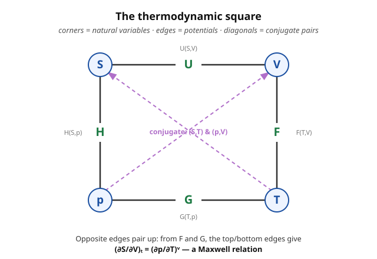

# Statistical Mechanics · Lesson 2.4: Maxwell relations and stability

> ⏱ ~15 min · Module 2: Thermodynamics — the macroscopic laws · Builds on: [2.3 Thermodynamic potentials and Legendre transforms](#/lesson/stat-mech/02-03-thermodynamic-potentials-legendre.md), [2.1 The laws of thermodynamics](#/lesson/stat-mech/02-01-laws-of-thermodynamics.md) · Unlocks: Module 3 (the partition function will *generate* all of these) and the van der Waals coexistence region (5.1)

## Why this matters

Some thermodynamic derivatives you can measure by turning a knob in the lab: heat a substance and watch it expand, squeeze it and watch the pressure climb. Others — like "how does entropy change when I change the volume at fixed temperature?" — you cannot measure directly, because there is no entropy meter. **Maxwell relations are the exchange rate between the two.** They let you replace an unmeasurable entropy derivative with a perfectly ordinary mechanical one, using nothing deeper than the fact that mixed second partial derivatives commute. The same commuting-partials logic, pushed one step further into *second* derivatives of a potential, gives the **stability conditions** — the reason a chunk of matter sits still instead of spontaneously collapsing or exploding, and the first hint of what goes wrong at a phase transition. This lesson is the toolkit for Boss Problem 2.

## The idea

In [2.3](#/lesson/stat-mech/02-03-thermodynamic-potentials-legendre.md) we built four potentials — $U, F, H, G$ — each a genuine *state function*: its value depends only on where you are in state space, not how you got there. That single fact has a sharp mathematical consequence. If $\Phi$ is a state function of two variables, then differentiating it in one order or the other gives the same answer:

$$\frac{\partial}{\partial x}\frac{\partial \Phi}{\partial y} = \frac{\partial}{\partial y}\frac{\partial \Phi}{\partial x}.$$

Each first derivative of a potential *is* one of the thermodynamic variables (that's what "$dU = T\,dS - p\,dV$" says: $\partial U/\partial S = T$, $\partial U/\partial V = -p$). So "the two mixed partials agree" becomes a statement relating **two different physical variables' derivatives** — a Maxwell relation. Four potentials, four relations. No new physics, just the geometry of a well-defined surface.

Push to second derivatives of the *same* variable and you get curvature. Equilibrium is where a potential is extremal — entropy at a **maximum**, free energy at a **minimum**. A minimum isn't just flat; it curves *upward*. That upward curvature (convexity) is not decoration: it forces the heat capacity and compressibility to be positive. A substance with negative compressibility would push back *less* the harder you squeezed it — it would implode. Stable matter is convex matter.

## The formal version

**Maxwell relations.** Take each potential, read off its two first derivatives, and set the cross-derivatives equal.

From $dF = -S\,dT - p\,dV$ (natural variables $T,V$), so $-S = (\partial F/\partial T)_V$ and $-p = (\partial F/\partial V)_T$:

$$\boxed{\left(\frac{\partial S}{\partial V}\right)_T = \left(\frac{\partial p}{\partial T}\right)_V}$$

*In words:* the (unmeasurable) way entropy responds to volume equals the (trivially measurable) way pressure responds to temperature at fixed volume.

From $dG = -S\,dT + V\,dp$ (variables $T,p$):

$$\boxed{\left(\frac{\partial S}{\partial p}\right)_T = -\left(\frac{\partial V}{\partial T}\right)_p}$$

*In words:* squeeze at fixed $T$ and entropy drops exactly as fast as the volume grows when you heat at fixed $p$ — note the minus sign.

From $dU = T\,dS - p\,dV$ (variables $S,V$) and $dH = T\,dS + V\,dp$ (variables $S,p$):

$$\left(\frac{\partial T}{\partial V}\right)_S = -\left(\frac{\partial p}{\partial S}\right)_V, \qquad \left(\frac{\partial T}{\partial p}\right)_S = \left(\frac{\partial V}{\partial S}\right)_p.$$

*In words:* these two govern **adiabatic** (constant-$S$) processes — how temperature moves when you change volume or pressure without letting heat in.

**Response functions.** These are the second derivatives you actually measure — how a system responds to a poke:

$$C_V = T\left(\frac{\partial S}{\partial T}\right)_V, \quad C_p = T\left(\frac{\partial S}{\partial T}\right)_p, \quad \kappa_T = -\frac{1}{V}\left(\frac{\partial V}{\partial p}\right)_T, \quad \alpha = \frac{1}{V}\left(\frac{\partial V}{\partial T}\right)_p.$$

*In words:* $C_V, C_p$ are heat capacities (heat needed per degree, at fixed volume or fixed pressure); $\kappa_T$ is isothermal compressibility (fractional shrink per unit pressure); $\alpha$ is thermal expansion (fractional growth per degree). Using $C_V = (\partial U/\partial T)_V$ and $C_p=(\partial H/\partial T)_p$ they are equivalently the heat-capacity forms most textbooks quote.

A Maxwell relation glues these together into one general identity, true for *any* substance (derived in P2, and it is Boss Problem 2's target):

$$\boxed{C_p - C_V = \frac{TV\alpha^2}{\kappa_T}}$$

*In words:* heating at constant pressure always costs more than at constant volume, because the substance also does expansion work — and the gap is set entirely by measurable mechanical response.

**Stability (convexity).** Equilibrium maximizes total entropy at fixed energy, equivalently minimizes the relevant free energy at fixed temperature. A minimum requires non-negative curvature. Applied to $U(S,V)$ and $F(T,V)$:

$$\left(\frac{\partial^2 U}{\partial S^2}\right)_V = \left(\frac{\partial T}{\partial S}\right)_V = \frac{T}{C_V} \ge 0 \;\Rightarrow\; C_V \ge 0, \qquad \left(\frac{\partial^2 F}{\partial V^2}\right)_T = -\left(\frac{\partial p}{\partial V}\right)_T = \frac{1}{V\kappa_T} \ge 0 \;\Rightarrow\; \kappa_T \ge 0.$$

*In words:* **thermal stability** ($C_V \ge 0$) means adding heat raises the temperature; **mechanical stability** ($\kappa_T \ge 0$) means compressing raises the pressure. Violate either and the homogeneous state is not a real equilibrium — it must break apart. That is exactly what happens inside the van der Waals loop in [5.1](#/lesson/stat-mech/05-01-virial-van-der-waals.md), where $(\partial p/\partial V)_T > 0$ signals that a single phase is unstable and the system splits into coexisting liquid and gas.

## Picture

The square is a memory aid: each potential ($U,F,G,H$) sits on the edge between its two natural variables, and the diagonals connect the conjugate pairs $(S,T)$ and $(p,V)$. Reading opposite edges reproduces the Maxwell relations. But treat it as a mnemonic only — the relations are *derived* from the potentials above, which is the source you can always trust.

## Worked examples

**Example 1 (mechanical — turning entropy into pressure).** Compute $(\partial U/\partial V)_T$, "how internal energy changes with volume at fixed temperature," for a general substance. Start from $dU = T\,dS - p\,dV$ and hold $T$ fixed (divide by $dV$ at constant $T$):

$$\left(\frac{\partial U}{\partial V}\right)_T = T\left(\frac{\partial S}{\partial V}\right)_T - p.$$

The first term has that unmeasurable entropy derivative — kill it with the $F$-Maxwell relation $(\partial S/\partial V)_T = (\partial p/\partial T)_V$:

$$\left(\frac{\partial U}{\partial V}\right)_T = T\left(\frac{\partial p}{\partial T}\right)_V - p.$$

This is the **thermodynamic equation of state**: it expresses a purely caloric quantity (energy) entirely through the mechanical equation of state $p(T,V)$. That is the whole point of Maxwell relations — measure $p(T,V)$, get the energetics for free. (P1 feeds the ideal gas into this and gets a famous zero.)

**Example 2 (why you'd care — adiabatic cooling).** When a gas expands adiabatically (no heat exchanged, $S$ fixed) it cools — this is how clouds form as air rises and how a refrigerator's expansion valve works. Quantify it with $(\partial T/\partial V)_S$. It has an awkward constant-$S$ constraint, so use the cyclic (triple-product) rule to swap $S$ out:

$$\left(\frac{\partial T}{\partial V}\right)_S = -\frac{(\partial S/\partial V)_T}{(\partial S/\partial T)_V}.$$

The denominator is $(\partial S/\partial T)_V = C_V/T$. The numerator is the $F$-Maxwell relation again, $(\partial S/\partial V)_T = (\partial p/\partial T)_V = \alpha/\kappa_T$ (that last step is the cyclic rule on $p,V,T$; see P2). So

$$\left(\frac{\partial T}{\partial V}\right)_S = -\frac{T\alpha}{C_V\,\kappa_T}.$$

Since $T, C_V, \kappa_T > 0$, the sign is the sign of $\alpha$. For any normal substance $\alpha > 0$, so expanding ($dV>0$) means $dT<0$: **adiabatic expansion cools.** (Curiosity: liquid water below $4^\circ$C has $\alpha < 0$, so it would *warm* on adiabatic expansion — the same anomaly that floats ice.)

## Watch out

- You might think the $G$-relation looks just like the $F$-relation without the sign. It doesn't: $(\partial S/\partial p)_T = -(\partial V/\partial T)_p$ **carries a minus sign** while $(\partial S/\partial V)_T = +(\partial p/\partial T)_V$ does not. The sign is dictated by which first derivative in $dG = -S\,dT + V\,dp$ is negative; drop it and every downstream result flips.
- You might think $(\partial S/\partial V)_T$ and $(\partial S/\partial V)_p$ are "basically the same derivative." They are different physical quantities — **what you hold fixed is half the definition.** A partial derivative with an ambiguous subscript is meaningless in thermodynamics.
- You might think stability is a fussy technicality. It's the load-bearing assumption: $\kappa_T \ge 0$ is *why* $C_p - C_V = TV\alpha^2/\kappa_T \ge 0$ has a positive right side, and its failure is not an error — it's the mathematical fingerprint of a phase transition (5.1).

## One-liner

> A potential's mixed partials commute, so every "hard" entropy derivative equals an "easy" mechanical one — and the upward curvature that makes the potential a minimum is exactly what forces $C_V \ge 0$ and $\kappa_T \ge 0$.

## Problems

**P1 (🟢)** Use a Maxwell relation to show that for an ideal gas ($pV = Nk_BT$), the internal energy is independent of volume: $(\partial U/\partial V)_T = 0$. (This is Joule's law — internal energy depends on temperature alone.)

**P2 (🟡)** Derive $C_p - C_V = TV\alpha^2/\kappa_T$ for a general substance. *Hint:* write $S = S(T,V)$, differentiate along a constant-pressure path to relate $C_p$ to $C_V$, apply the $F$-Maxwell relation, and use the cyclic rule to convert $(\partial p/\partial T)_V$ into $\alpha/\kappa_T$.

**P3 (🔴, optional)** Prove the stability chain $C_p \ge C_V \ge 0$ for any stable substance. Then, for a monatomic ideal gas ($C_V = \tfrac{3}{2}Nk_B$), evaluate $C_p - C_V$ explicitly and confirm it recovers the familiar $C_p - C_V = Nk_B$.

Solutions

**P1** From Example 1, the thermodynamic equation of state gives, for any substance,

$$\left(\frac{\partial U}{\partial V}\right)_T = T\left(\frac{\partial p}{\partial T}\right)_V - p.$$

For an ideal gas $p = \dfrac{Nk_BT}{V}$, so at fixed $V$, $\left(\dfrac{\partial p}{\partial T}\right)_V = \dfrac{Nk_B}{V} = \dfrac{p}{T}$. Substituting:

$$\left(\frac{\partial U}{\partial V}\right)_T = T\cdot\frac{p}{T} - p = p - p = 0. \checkmark$$

Isolate the gas and let it expand into vacuum at fixed energy — its temperature doesn't change, because energy never depended on volume in the first place. The hidden Maxwell relation was $(\partial S/\partial V)_T = (\partial p/\partial T)_V$; the entropy *does* rise on expansion, but the $T\,dS$ heat exactly cancels the $-p\,dV$ work.

**P2** Write entropy as a function of the two variables $T,V$:

$$dS = \left(\frac{\partial S}{\partial T}\right)_V dT + \left(\frac{\partial S}{\partial V}\right)_T dV.$$

Now travel along a **constant-pressure** path — divide by $dT$ holding $p$ fixed:

$$\left(\frac{\partial S}{\partial T}\right)_p = \left(\frac{\partial S}{\partial T}\right)_V + \left(\frac{\partial S}{\partial V}\right)_T\left(\frac{\partial V}{\partial T}\right)_p.$$

Multiply through by $T$ and use $C_p = T(\partial S/\partial T)_p$, $C_V = T(\partial S/\partial T)_V$:

$$C_p = C_V + T\left(\frac{\partial S}{\partial V}\right)_T\left(\frac{\partial V}{\partial T}\right)_p.$$

Kill the entropy derivative with the $F$-Maxwell relation $(\partial S/\partial V)_T = (\partial p/\partial T)_V$:

$$C_p - C_V = T\left(\frac{\partial p}{\partial T}\right)_V\left(\frac{\partial V}{\partial T}\right)_p.$$

The second factor is $(\partial V/\partial T)_p = V\alpha$. For the first, apply the cyclic rule to $p,V,T$:

$$\left(\frac{\partial p}{\partial T}\right)_V\left(\frac{\partial T}{\partial V}\right)_p\left(\frac{\partial V}{\partial p}\right)_T = -1 \;\Rightarrow\; \left(\frac{\partial p}{\partial T}\right)_V = -\frac{(\partial V/\partial T)_p}{(\partial V/\partial p)_T} = -\frac{V\alpha}{-V\kappa_T} = \frac{\alpha}{\kappa_T},$$

using $(\partial V/\partial p)_T = -V\kappa_T$. Assemble:

$$C_p - C_V = T\cdot\frac{\alpha}{\kappa_T}\cdot V\alpha = \frac{TV\alpha^2}{\kappa_T}. \checkmark$$

**P3** Every factor in $C_p - C_V = TV\alpha^2/\kappa_T$ is non-negative: $T>0$, $V>0$, $\alpha^2 \ge 0$, and $\kappa_T > 0$ by mechanical stability. Hence $C_p - C_V \ge 0$, i.e. $C_p \ge C_V$. And $C_V \ge 0$ is thermal stability itself (curvature of $U(S,V)$: $C_V = T/(\partial T/\partial S)_V = T/(\partial^2 U/\partial S^2)_V \ge 0$). Chain them: $C_p \ge C_V \ge 0$. $\checkmark$ Both response functions are pinned non-negative by the same convexity, and $C_p$ is the larger because expansion work adds to the heat bill.

For the monatomic ideal gas: $\alpha = \frac{1}{V}(\partial V/\partial T)_p = \frac{1}{V}\cdot\frac{Nk_B}{p} = \frac{1}{T}$ (from $V = Nk_BT/p$), and $\kappa_T = -\frac{1}{V}(\partial V/\partial p)_T = -\frac{1}{V}\cdot\left(-\frac{Nk_BT}{p^2}\right) = \frac{1}{p}$. Then

$$C_p - C_V = \frac{TV\alpha^2}{\kappa_T} = \frac{T\,V\,(1/T)^2}{1/p} = \frac{pV}{T} = Nk_B. \checkmark$$

So $C_p = \tfrac{3}{2}Nk_B + Nk_B = \tfrac{5}{2}Nk_B$, and $\gamma = C_p/C_V = 5/3$ — the standard monatomic result, recovered from the general identity with zero gas-specific input beyond the equation of state.

## Flashback

**From Lesson 2.1 (exact vs inexact differentials):** For a monatomic ideal gas, an infinitesimal heat input can be written $\bar{d}Q = C_V\,dT + p\,dV$ with $p = Nk_BT/V$ and $C_V$ constant. (a) Show $\bar{d}Q$ is **not** an exact differential — so heat is not a state function. (b) Show that dividing by $T$ *fixes* this: $dS = \bar{d}Q/T$ **is** exact. Why does this matter for everything in today's lesson?

Solution

A differential $M\,dT + N\,dV$ is exact iff $(\partial M/\partial V)_T = (\partial N/\partial T)_V$ — the same commuting-partials test that powers Maxwell relations.

(a) Here $M = C_V$ (constant) and $N = p = Nk_BT/V$:

$$\left(\frac{\partial M}{\partial V}\right)_T = 0, \qquad \left(\frac{\partial N}{\partial T}\right)_V = \frac{Nk_B}{V} \ne 0.$$

Not equal, so $\bar{d}Q$ is **inexact**: the heat absorbed depends on the *path* through state space, not just the endpoints. There is no "heat content" function $Q$.

(b) Divide by $T$: $dS = \dfrac{C_V}{T}\,dT + \dfrac{Nk_B}{V}\,dV$, so now $M = C_V/T$ and $N = Nk_B/V$:

$$\left(\frac{\partial M}{\partial V}\right)_T = 0, \qquad \left(\frac{\partial N}{\partial T}\right)_V = 0.$$

Equal — $dS$ is **exact**. The factor $1/T$ is an integrating factor, and its existence is precisely the content of the second law: entropy is a state function even though heat is not.

Why it matters: today's entire lesson rests on $U,F,H,G$ being *state* functions with exact differentials. That exactness is what lets their mixed partials commute, which is what a Maxwell relation *is*. The Flashback shows the machinery from the ground floor: exact $\Rightarrow$ state function $\Rightarrow$ commuting mixed partials $\Rightarrow$ Maxwell relation.

## Connections

- **Backward:** this is [2.3](#/lesson/stat-mech/02-03-thermodynamic-potentials-legendre.md)'s four potentials read one derivative deeper. The Legendre transform that *built* $F,H,G$ is the same operation that turns Hamilton's mechanics from velocities to momenta in [analytical mechanics](#/lesson/analytical-mechanics/03-01-legendre-hamiltons-equations.md) — and convex stability here is the thermodynamic echo of the convexity that makes a Legendre transform well-defined there.
- **Forward:** in Module 3 you won't *postulate* these relations — the partition function $Z$ will generate $F = -k_BT\ln Z$, and every Maxwell relation and response function falls out of derivatives of $\ln Z$ automatically. In particular [3.3](#/lesson/stat-mech/03-03-fluctuations-ensemble-equivalence.md) shows $C_V = \mathrm{Var}(E)/k_BT^2$, making $C_V \ge 0$ *manifest* (a variance is never negative) — the statistical origin of thermal stability.
- **Sideways (phase transitions):** the stability conditions are the gatekeepers of [5.1](#/lesson/stat-mech/05-01-virial-van-der-waals.md). Where the van der Waals isotherm develops a region with $\kappa_T < 0$, no homogeneous phase can exist, and the Maxwell *construction* (an equal-area rule, not to be confused with today's Maxwell *relations*) replaces it with liquid–gas coexistence.
