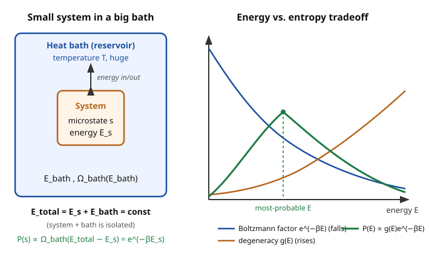

# Statistical Mechanics · Lesson 3.1: The canonical ensemble and the Boltzmann factor

> ⏱ ~15 min · Module 3: The canonical and grand canonical ensembles · Builds on: [1.3 Entropy and the microcanonical ensemble](#/lesson/stat-mech/01-03-entropy-microcanonical.md), [1.4 Temperature, pressure, chemical potential](#/lesson/stat-mech/01-04-temperature-pressure-chemical-potential.md) · Unlocks: 3.2 The partition function — extracting all of thermodynamics from $\ln Z$

## Why this matters

Almost nothing you care about is truly isolated. A protein in a cell, a gas in a lab flask, a spin in a magnet — each sits in contact with a vast surrounding at some fixed temperature, freely trading energy back and forth. The microcanonical ensemble of Module 1 fixed the energy $E$ and counted; but in the lab you fix the *temperature* $T$ and let the energy fluctuate. This lesson makes that switch, and the payoff is the single most-used formula in all of statistical mechanics: the probability of a microstate depends on nothing but its energy and the temperature, $P(s)\propto e^{-\beta E_s}$. Once you have it, computing thermodynamics turns into computing one sum.

## The idea

Put a small system in a huge tank of stuff — a **heat bath** — and let energy flow between them until they settle. The bath is so large that dumping a little energy into the system barely dents it: the bath's temperature $T$ stays pinned. The system's energy, though, now jitters around.

Here's the whole trick. The system-plus-bath *together* is isolated, so Module 1 applies to the pair: every joint microstate is equally likely (the fundamental postulate). Ask for the probability that the system sits in one specific microstate $s$ of energy $E_s$. Fixing the system's microstate leaves the bath to soak up the remaining energy $E_\text{total}-E_s$, and the bath can do that in $\Omega_\text{bath}(E_\text{total}-E_s)$ different ways. More ways means more likely — so $P(s)$ is proportional to that bath count.

Now, taking energy $E_s$ *away* from the bath lowers how many ways it has to arrange itself, and it does so by a factor that turns out to be a clean exponential in $E_s$. That exponential is the Boltzmann factor. The upshot: low-energy microstates are exponentially favored, high-energy ones exponentially suppressed, and the rate of suppression is set entirely by the bath's temperature.

## The formal version

Let the total (system + bath) be isolated with energy $E_\text{total}$. For a fixed system microstate $s$ of energy $E_s$, the number of accessible joint microstates is $1\times \Omega_\text{bath}(E_\text{total}-E_s)$ — one for the pinned system, times the bath's count. By the equal-a-priori-probability postulate,

$$P(s)\;\propto\;\Omega_\text{bath}(E_\text{total}-E_s)\;=\;\exp\!\big[\ln\Omega_\text{bath}(E_\text{total}-E_s)\big].$$

*In words:* a system microstate is likely in exact proportion to how many ways the bath can hold the leftover energy.

Since the bath is enormous, $E_s\ll E_\text{total}$, so Taylor-expand the **slowly varying** $\ln\Omega_\text{bath}$ (not $\Omega_\text{bath}$ itself — the count is astronomically steep, its log is gentle) about $E_\text{total}$:

$$\ln\Omega_\text{bath}(E_\text{total}-E_s)\;\approx\;\ln\Omega_\text{bath}(E_\text{total})\;-\;E_s\left.\frac{\partial \ln\Omega_\text{bath}}{\partial E}\right|_{E_\text{total}}+\;\underbrace{\cdots}_{\to\,0}.$$

Define the coefficient of $-E_s$ as $\beta$:

$$\beta\;\equiv\;\frac{\partial \ln\Omega_\text{bath}}{\partial E}\;=\;\frac{1}{k_B}\frac{\partial S_\text{bath}}{\partial E}\;=\;\frac{1}{k_B T},$$

which is exactly the temperature identity $1/T=\partial S/\partial E$ from [1.4](#/lesson/stat-mech/01-04-temperature-pressure-chemical-potential.md), with $S=k_B\ln\Omega$. *In words:* $\beta$ is the bath's inverse temperature, and because the bath is huge its higher derivatives (the $\cdots$) scale like $1/N_\text{bath}\to 0$ — the linear term is exact in the thermodynamic limit.

The first term $\ln\Omega_\text{bath}(E_\text{total})$ is a constant (no $s$), so it only rescales the proportionality:

$$\boxed{\,P(s)\;\propto\;e^{-\beta E_s}\,}\qquad\text{the Boltzmann factor.}$$

Fix the normalization by demanding $\sum_s P(s)=1$. The normalizer gets its own name, the **partition function**:

$$Z\;\equiv\;\sum_{s}e^{-\beta E_s},\qquad P(s)=\frac{e^{-\beta E_s}}{Z}.$$

*In words:* $P(s)$ depends on the microstate only through its energy $E_s$ — two microstates with the same energy are equally likely, no matter how different they look. This collection of probabilities is the **canonical ensemble**.

**Microstates vs. energy levels.** The sum in $Z$ runs over *microstates* $s$. If instead you group microstates by energy, letting $g(E)$ = number of microstates with energy $E$ (the **degeneracy**), then

$$Z=\sum_{\text{levels }E}g(E)\,e^{-\beta E},\qquad P(\text{energy }E)=\frac{g(E)\,e^{-\beta E}}{Z}.$$

*In words:* the probability of *being at energy $E$* is the per-microstate Boltzmann factor times how many microstates share that energy. Don't conflate the two sums — forgetting $g(E)$ is the classic error.

## Picture

The right panel is the moral of the chapter: a *single* microstate is most likely at $E=0$ (blue), but there are hardly any low-energy microstates and vastly more high-energy ones (orange, $g(E)$ rising). The observed energy is set by the product (green) — energy pulls down, entropy/degeneracy pulls up, and the system lives at the compromise peak.

## Worked examples

**Example 1 (mechanical — one spin in a field).** A magnetic moment in field $B$ has two microstates: aligned, energy $-\mu B$, and anti-aligned, energy $+\mu B$. Then

$$Z=e^{+\beta\mu B}+e^{-\beta\mu B}=2\cosh(\beta\mu B),\qquad P(\text{aligned})=\frac{e^{\beta\mu B}}{2\cosh(\beta\mu B)}.$$

At low $T$ ($\beta$ large) the aligned state dominates; at high $T$ both approach $1/2$. This one $\cosh$ already contains all the thermodynamics of a paramagnet — Module 5's Ising model is just $N$ of these talking to each other.

**Example 2 (why you'd care — why cold gases don't glow).** Consider an atom with a ground state at $E=0$ and an excited state at $E=\epsilon$. The population ratio is pure Boltzmann factor:

$$\frac{P(\epsilon)}{P(0)}=\frac{e^{-\beta\epsilon}}{e^{0}}=e^{-\epsilon/k_BT}.$$

For an optical transition $\epsilon\approx 2\ \text{eV}$ and room temperature $k_BT\approx 0.025\ \text{eV}$, the exponent is $-80$: the excited state is occupied about $e^{-80}\sim 10^{-35}$ of the time. That exponential is *why* matter at everyday temperatures sits quietly in its ground state and why you need thousands of kelvin (or a laser) to light it up. The competition is decided almost entirely by the ratio $\epsilon/k_BT$.

## Watch out

- You might think you should Taylor-expand $\Omega_\text{bath}$ itself. **Expand $\ln\Omega_\text{bath}$.** The multiplicity is a monstrously steep function ($\sim E^{N}$), so its own Taylor series is useless, but its *logarithm* is smooth and nearly linear over the tiny window $E_s$ — that's the whole reason entropy ($\propto\ln\Omega$) is the right variable.
- You might think a higher energy is always less probable. That's true for a single *microstate*, but *not* for an energy *level*: $P(E)=g(E)e^{-\beta E}$ can rise with $E$ when the degeneracy $g(E)$ grows faster than $e^{-\beta E}$ falls. The most-probable energy is the balance point, not zero.
- You might think $\beta$ is the *system's* temperature. $\beta=1/k_BT$ is the **bath's** — the system doesn't have a sharp energy, but in equilibrium it inherits the bath's $T$. Temperature is a property the reservoir imposes.
- $Z$ is not a probability and has no direct physical value of its own here; it's a normalizer. Its real power (Lesson 3.2) is that *derivatives of $\ln Z$* hand you energy, entropy, and free energy.

## One-liner

> In a heat bath, the probability of a microstate is $e^{-\beta E_s}/Z$ — energy alone decides likelihood, temperature alone sets how fast high energies are punished.

## Problems

**P1 (🟢)** A two-level system has energies $0$ and $\epsilon>0$ (one microstate each). Write $Z$, $P(0)$, $P(\epsilon)$, and the average energy $\langle E\rangle(T)$. Evaluate the limits $T\to 0$ and $T\to\infty$, and describe the shape of $\langle E\rangle$ vs. $T$.

**P2 (🟡)** Derive $P(s)\propto e^{-\beta E_s}$ from scratch by the reservoir argument: start from the postulate, write $P(s)\propto\Omega_\text{bath}(E_\text{total}-E_s)$, Taylor-expand $\ln\Omega_\text{bath}$, and identify $\beta$. State explicitly why the quadratic term is dropped.

**P3 (🔴, optional)** A quantum harmonic oscillator has energy levels $E_n=n\hbar\omega$, $n=0,1,2,\dots$ (each non-degenerate). Compute $Z$, then $\langle E\rangle=\sum_n E_n P(n)$ in closed form. Identify the temperature scale at which the excited states "turn on," and give $\langle E\rangle$ in the low- and high-temperature limits. (These oscillator levels are the ones you solved for in `quantum-mechanics` — [3.1 The harmonic oscillator](#/lesson/quantum-mechanics/03-01-harmonic-oscillator-analytic.md).)

Solutions

**P1** Two microstates, so $Z=e^{0}+e^{-\beta\epsilon}=1+e^{-\beta\epsilon}$. Then

$$P(0)=\frac{1}{1+e^{-\beta\epsilon}},\qquad P(\epsilon)=\frac{e^{-\beta\epsilon}}{1+e^{-\beta\epsilon}}.$$

Average energy:

$$\langle E\rangle=0\cdot P(0)+\epsilon\cdot P(\epsilon)=\frac{\epsilon\,e^{-\beta\epsilon}}{1+e^{-\beta\epsilon}}=\frac{\epsilon}{e^{\beta\epsilon}+1}.$$

Limits: as $T\to 0$, $\beta\to\infty$, $e^{\beta\epsilon}\to\infty$, so $\langle E\rangle\to 0$ — the system freezes into the ground state. As $T\to\infty$, $\beta\to 0$, $e^{\beta\epsilon}\to 1$, so $\langle E\rangle\to\epsilon/2$ — both states equally populated, energy saturates at the average of the two levels. Shape: $\langle E\rangle$ starts at $0$, is flat (exponentially small) until $k_BT\sim\epsilon$, rises through an inflection, and plateaus at $\epsilon/2$ — an S-shaped curve. (The bump in its *derivative* $C=d\langle E\rangle/dT$ is the Schottky anomaly.)

**P2** By the fundamental postulate applied to the isolated total, every joint microstate is equally likely, so the probability of system microstate $s$ is proportional to the number of ways the bath completes it:

$$P(s)\propto\Omega_\text{bath}(E_\text{total}-E_s)=e^{\ln\Omega_\text{bath}(E_\text{total}-E_s)}.$$

Because the bath is huge, $E_s\ll E_\text{total}$; expand the smooth function $\ln\Omega_\text{bath}$ about $E_\text{total}$:

$$\ln\Omega_\text{bath}(E_\text{total}-E_s)=\ln\Omega_\text{bath}(E_\text{total})-E_s\frac{\partial\ln\Omega_\text{bath}}{\partial E}+\frac{1}{2}E_s^2\frac{\partial^2\ln\Omega_\text{bath}}{\partial E^2}-\cdots$$

Identify $\beta\equiv\partial\ln\Omega_\text{bath}/\partial E=(1/k_B)\,\partial S_\text{bath}/\partial E=1/k_BT$. The quadratic term is negligible because $\partial\beta/\partial E=\partial^2\ln\Omega_\text{bath}/\partial E^2$ scales like $1/N_\text{bath}$ (the bath's temperature barely changes when it absorbs a system-sized energy), so the term is smaller than the linear one by a factor $\sim E_s/E_\text{total}\to 0$ in the thermodynamic limit. Exponentiating and absorbing the constant $\Omega_\text{bath}(E_\text{total})$:

$$P(s)\propto e^{-\beta E_s}.\qquad\blacksquare$$

**P3** Geometric series. With $x\equiv e^{-\beta\hbar\omega}<1$,

$$Z=\sum_{n=0}^{\infty}e^{-\beta n\hbar\omega}=\sum_{n=0}^{\infty}x^{n}=\frac{1}{1-x}=\frac{1}{1-e^{-\beta\hbar\omega}}.$$

For the mean energy, use $\sum_{n\ge0}n\,x^{n}=x/(1-x)^2$:

$$\langle E\rangle=\frac{1}{Z}\sum_{n=0}^{\infty}(n\hbar\omega)x^{n}=\hbar\omega(1-x)\cdot\frac{x}{(1-x)^2}=\frac{\hbar\omega\,x}{1-x}=\frac{\hbar\omega}{e^{\beta\hbar\omega}-1}.$$

(Equivalently $\langle E\rangle=-\partial_\beta\ln Z$ — the shortcut we install in Lesson 3.2 — gives the same answer.) The energy scale is $k_BT\sim\hbar\omega$, i.e. $T\sim\hbar\omega/k_B$: below it the oscillator is frozen, above it it's classical.

- **Low $T$** ($k_BT\ll\hbar\omega$, $\beta\hbar\omega\gg1$): $e^{\beta\hbar\omega}\gg1$, so $\langle E\rangle\approx\hbar\omega\,e^{-\beta\hbar\omega}\to 0$ — exponentially frozen; the level spacing $\hbar\omega$ is too big to reach, so excited states are essentially never occupied.
- **High $T$** ($k_BT\gg\hbar\omega$, $\beta\hbar\omega\ll1$): expand $e^{\beta\hbar\omega}-1\approx\beta\hbar\omega$, giving $\langle E\rangle\approx\hbar\omega/(\beta\hbar\omega)=k_BT$ — the classical equipartition value ($k_BT$ per oscillator: $\tfrac12k_BT$ kinetic $+\tfrac12k_BT$ potential). This frozen-to-classical crossover, summed over $3N$ oscillators, is the Einstein solid of Boss Problem 3 and the resolution of the heat-capacity puzzle equipartition alone can't explain.

## Flashback

**From Lesson 1.4 (Temperature, pressure, and chemical potential):** A monatomic ideal gas has microcanonical multiplicity $\Omega(E)=C\,E^{3N/2}$ for a constant $C$ (large $N$). Compute $\beta=\partial\ln\Omega/\partial E$ and hence $T$, and solve for $\langle E\rangle$ as a function of $T$.

Solution

$\ln\Omega=\ln C+\tfrac{3N}{2}\ln E$, so

$$\beta=\frac{\partial\ln\Omega}{\partial E}=\frac{3N}{2E}.$$

Since $\beta=1/k_BT$, this gives $\dfrac{3N}{2E}=\dfrac{1}{k_BT}$, i.e.

$$E=\frac{3}{2}Nk_BT.$$

This is exactly the quantity $\beta$ that the canonical derivation Taylor-expands out of the bath — and it reproduces the equipartition result $\tfrac32 k_BT$ per atom ($\tfrac12k_BT$ for each of three translational directions), previewing Lesson 3.4. The microcanonical temperature and the canonical $\beta$ are the same object seen from two ensembles.

## Connections

- **Backward:** the entire derivation is just the fundamental postulate of [1.2](#/lesson/stat-mech/01-02-microstates-macrostates-postulate.md)/[1.3](#/lesson/stat-mech/01-03-entropy-microcanonical.md) applied to system + bath, plus the temperature identity $1/T=\partial S/\partial E$ from [1.4](#/lesson/stat-mech/01-04-temperature-pressure-chemical-potential.md). We didn't add a new axiom — we changed which variable is fixed (energy → temperature).
- **Forward:** Lesson [3.2](#/lesson/stat-mech/03-02-partition-function.md) shows that $Z$ is not just a normalizer — $\langle E\rangle=-\partial_\beta\ln Z$ and $F=-k_BT\ln Z$ generate *all* thermodynamics. The P3 harmonic oscillator seeds the Einstein solid (Boss 3) and the quantum-gas machinery of Module 4.
- **Sideways (probability):** $P(s)=e^{-\beta E_s}/Z$ is the maximum-entropy (Gibbs) distribution subject to a fixed mean energy — the same exponential-family object that appears whenever you know an average and nothing more. The suppression of high-energy states is why the observed energy is so sharply peaked, which the law of large numbers and CLT in `probability-theory` make quantitative (Lesson 3.3).
- **Sideways (chemistry/biology):** the ratio $e^{-\Delta E/k_BT}$ is the Arrhenius/activation factor behind reaction rates and the occupancy of molecular states — this lesson's Example 2 wearing a lab coat.
