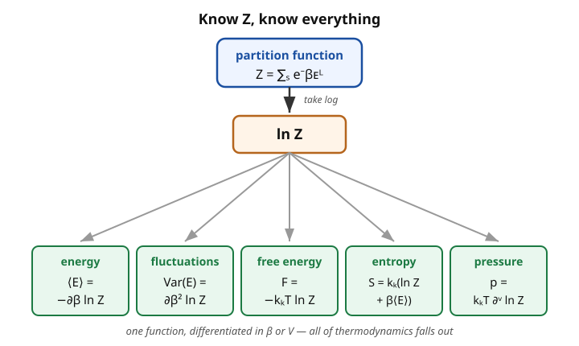

# Statistical Mechanics · Lesson 3.2: The partition function

> ⏱ ~15 min · Module 3: The canonical and grand canonical ensembles · Builds on: [3.1 The canonical ensemble and the Boltzmann factor](#/lesson/stat-mech/03-01-canonical-ensemble-boltzmann-factor.md) · Unlocks: 3.3 Fluctuations & ensemble equivalence, 3.4 Equipartition

## Why this matters

In [3.1](#/lesson/stat-mech/03-01-canonical-ensemble-boltzmann-factor.md) you learned that a system in a heat bath sits in state $s$ with probability $P_s = e^{-\beta E_s}/Z$, and the normalizer was $Z = \sum_s e^{-\beta E_s}$ — a bookkeeping constant, easily dismissed. It is not bookkeeping. That single sum is the most valuable object in the subject: **differentiate $\ln Z$ and every thermodynamic quantity — energy, entropy, free energy, pressure, heat capacity — falls out.** Microcanonically (Module 1) you had to *count* microstates at fixed energy, a brutal combinatorial problem for almost any real system. The canonical partition function replaces counting with a sum you can often do in closed form, then hands you all of thermodynamics by taking derivatives. Master this one move and the rest of the course is applications of it.

## The idea

Think of $Z$ as a **generating function**. In probability you meet the moment-generating function: one function whose derivatives spit out the mean, the variance, every moment of a distribution. $Z(\beta)$ plays exactly that role for a thermal system. The variable you differentiate with respect to is $\beta = 1/k_BT$ — the "coldness." Wiggle $\beta$ and watch how $\ln Z$ responds:

- its **slope** in $\beta$ is (minus) the average energy;
- its **curvature** in $\beta$ is the energy's variance — how much the energy jitters;
- $\ln Z$ itself, scaled by $-k_BT$, is the **free energy** $F$, the master thermodynamic potential from which entropy and pressure come by more differentiation.

So the whole strategy of canonical statistical mechanics is: (1) write down the energy levels, (2) sum $e^{-\beta E_s}$ to get $Z$, (3) take the log, (4) differentiate. Steps 1–2 are physics and cleverness; steps 3–4 are calculus. Everything thermodynamic is downstream of $\ln Z$.

And one structural gift makes step 2 tractable: for **independent** pieces, $Z$ **factorizes**. If a system splits into parts that don't interact, its partition function is the *product* of the parts' partition functions — because $\ln Z$ then *adds*, and additivity of $\ln Z$ is exactly the extensivity ($\propto N$) that thermodynamics demands. That is how we go from one particle to $10^{23}$ in one line.

## The formal version

**Definition.** For a system with energy levels $\{E_s\}$ in contact with a bath at inverse temperature $\beta = 1/k_BT$,

$$Z(\beta, V, N) = \sum_s e^{-\beta E_s}.$$

In words: add up one Boltzmann factor per microstate; states far above the thermal energy $k_BT$ contribute almost nothing, so $Z$ counts the *effectively accessible* states.

**Average energy.** Since $\partial_\beta e^{-\beta E_s} = -E_s e^{-\beta E_s}$,

$$\langle E\rangle = \sum_s E_s P_s = \frac{1}{Z}\sum_s E_s e^{-\beta E_s} = -\frac{1}{Z}\frac{\partial Z}{\partial\beta} = -\frac{\partial \ln Z}{\partial\beta}.$$

In words: the mean energy is the slope of $\ln Z$ against coldness. (Derived in full in P3.)

**Energy variance / heat capacity.** One more derivative gives the fluctuations (proved in P3, exploited in [3.3](#/lesson/stat-mech/03-03-fluctuations-ensemble-equivalence.md)):

$$\mathrm{Var}(E) = \langle E^2\rangle - \langle E\rangle^2 = \frac{\partial^2 \ln Z}{\partial\beta^2} = -\frac{\partial\langle E\rangle}{\partial\beta} = k_BT^2\,C_V.$$

In words: the curvature of $\ln Z$ measures how much the energy jitters — and that jitter *is* the heat capacity.

**Helmholtz free energy — the central bridge.**

$$\boxed{\,F = -k_BT\ln Z\,}$$

In words: the log of $Z$, weighted by $-k_BT$, is the free energy — the thermodynamic potential natural to fixed $(T,V,N)$. From thermodynamics, $dF = -S\,dT - p\,dV + \mu\,dN$, so $S$ and $p$ are just partial derivatives of $F$:

$$S = -\frac{\partial F}{\partial T}, \qquad p = -\frac{\partial F}{\partial V}.$$

**Entropy from $Z$.** Compute $S = -\partial F/\partial T$ directly. Using $\partial/\partial T = -k_B\beta^2\,\partial/\partial\beta$ (from $\beta=1/k_BT$),

$$S = -\frac{\partial}{\partial T}\big(-k_BT\ln Z\big) = k_B\ln Z + k_BT\frac{\partial\ln Z}{\partial T} = k_B\ln Z + \frac{\langle E\rangle}{T},$$

since $k_BT\,\partial_T\ln Z = k_BT\cdot\frac{\langle E\rangle}{k_BT^2}=\langle E\rangle/T$. Writing $1/T = k_B\beta$,

$$\boxed{\,S = k_B\big(\ln Z + \beta\langle E\rangle\big).\,}$$

In words: entropy is $k_B\ln Z$ plus a temperature-weighted energy correction. **Consistency check** with $F=\langle E\rangle - TS$ (the definition of the Helmholtz potential, with $U=\langle E\rangle$):

$$\langle E\rangle - TS = \langle E\rangle - Tk_B\big(\ln Z + \beta\langle E\rangle\big) = \langle E\rangle - k_BT\ln Z - \langle E\rangle = -k_BT\ln Z = F.\ \checkmark$$

(Used $k_BT\beta = 1$.) The three formulas $F=-k_BT\ln Z$, $\langle E\rangle=-\partial_\beta\ln Z$, $S=k_B(\ln Z+\beta\langle E\rangle)$ are mutually consistent — pick any two, the third follows.

**Pressure.**

$$p = -\frac{\partial F}{\partial V} = k_BT\frac{\partial\ln Z}{\partial V}.$$

In words: the volume-dependence of $\ln Z$ is (per $k_BT$) the pressure — the mechanical equation of state, straight from the sum.

**Factorization.** If the system is composed of independent parts with additive energy $E_s = E^{(1)}_{s_1} + E^{(2)}_{s_2} + \cdots$, then the sum over joint states factors:

$$Z = \sum_{s_1,s_2,\dots} e^{-\beta(E^{(1)}_{s_1}+E^{(2)}_{s_2}+\cdots)} = \Big(\sum_{s_1}e^{-\beta E^{(1)}_{s_1}}\Big)\Big(\sum_{s_2}e^{-\beta E^{(2)}_{s_2}}\Big)\cdots = Z_1 Z_2\cdots.$$

In words: independent subsystems multiply their $Z$'s, so their $\ln Z$'s (hence $F$, $S$, $\langle E\rangle$) simply add — extensivity, for free. For $N$ **identical distinguishable** subsystems, $Z = Z_1^{\,N}$. For $N$ **indistinguishable classical** particles you must not overcount permutations of identical particles, so you divide by $N!$ — the same **Gibbs factor** that fixed the Sackur–Tetrode entropy in [1.5](#/lesson/stat-mech/01-05-ideal-gas-sackur-tetrode.md):

$$Z_{\text{dist}} = Z_1^{\,N}, \qquad Z_{\text{indist}} = \frac{Z_1^{\,N}}{N!}.$$

**Classical continuum form.** For a classical system with Hamiltonian $H(q,p)$ in $3N$-dimensional configuration and momentum space, the sum over states becomes a phase-space integral, with $h^{3N}$ setting the size of one quantum "cell" (so $Z$ is dimensionless) and $N!$ the Gibbs factor:

$$Z = \frac{1}{h^{3N}N!}\int e^{-\beta H(q,p)}\,d^{3N}q\,d^{3N}p.$$

This is the bridge from the discrete definition to real gases — and it ties directly to the phase-space volume and Liouville measure from [analytical mechanics](#/lesson/analytical-mechanics/03-02-phase-space-liouville.md).

## Picture

## Worked examples

**Example 1 (mechanical — factorization does the work: the ideal gas).** A single free particle of mass $m$ in a box of volume $V$ has $H = \mathbf p^2/2m$ (no potential inside the box). Its one-particle partition function, from the continuum form with $N=1$:

$$Z_1 = \frac{1}{h^3}\int_V d^3q\int e^{-\beta p^2/2m}\,d^3p = \frac{V}{h^3}\left(\int_{-\infty}^{\infty}e^{-\beta p_x^2/2m}\,dp_x\right)^{\!3}.$$

The spatial integral gave $V$ (nothing depends on position). Each Gaussian momentum integral is $\int e^{-\beta p_x^2/2m}dp_x = \sqrt{2\pi m/\beta} = \sqrt{2\pi m k_BT}$. Therefore

$$Z_1 = \frac{V}{h^3}\big(2\pi m k_BT\big)^{3/2} = \frac{V}{\lambda^3}, \qquad \lambda \equiv \frac{h}{\sqrt{2\pi m k_BT}},$$

where $\lambda$ is the **thermal de Broglie wavelength** — the quantum "size" of a particle at temperature $T$. Read $Z_1 = V/\lambda^3$ as: the number of thermal-wavelength-sized cells that fit in the box. Now stack $N$ indistinguishable particles by factorizing and applying the Gibbs factor:

$$Z = \frac{Z_1^{\,N}}{N!} = \frac{1}{N!}\left(\frac{V}{\lambda^3}\right)^{\!N}.$$

Extract thermodynamics. With Stirling $\ln N! \approx N\ln N - N$,

$$\ln Z = N\ln\frac{V}{\lambda^3} - \ln N! \approx N\ln\frac{V}{N\lambda^3} + N.$$

*Pressure* (only the $\ln V$ term survives $\partial_V$):

$$p = k_BT\frac{\partial\ln Z}{\partial V} = k_BT\cdot\frac{N}{V} \;\Longrightarrow\; \boxed{pV = Nk_BT.}$$

The ideal gas law, out of a Gaussian integral. *Energy*: since $\lambda \propto \beta^{1/2}$, we have $\lambda^3\propto\beta^{3/2}$, so $\ln Z = -\tfrac{3N}{2}\ln\beta + (\beta\text{-independent})$, giving

$$\langle E\rangle = -\frac{\partial\ln Z}{\partial\beta} = \frac{3N}{2\beta} = \boxed{\tfrac{3}{2}Nk_BT.}$$

Three quadratic momentum modes per particle, each carrying $\tfrac12 k_BT$ — a preview of equipartition ([3.4](#/lesson/stat-mech/03-04-equipartition-theorem.md)).

**Example 2 (why you'd care — the free energy is the master key).** Continuing the gas, the Helmholtz free energy is

$$F = -k_BT\ln Z = -Nk_BT\left[\ln\frac{V}{N\lambda^3} + 1\right].$$

From this *one* expression, every equilibrium property follows by a derivative: $p=-\partial_V F$ regenerates $pV=Nk_BT$; $S = -\partial_T F$ regenerates the Sackur–Tetrode entropy from [1.5](#/lesson/stat-mech/01-05-ideal-gas-sackur-tetrode.md) (note $\lambda\propto T^{-1/2}$ carries the $T$-dependence, giving the $\ln T$ term). The point: microcanonically we *counted* to get $S$, then *differentiated* $S$ to get $T$ and $p$ — hard, then harder. Canonically we *summed* to get $Z$, then differentiate one potential $F$ for everything. Same physics, vastly easier machine.

## Watch out

- You might think $Z$ "is just the normalization, so its value doesn't matter." Its *value* barely matters; its *dependence on $\beta$ and $V$* is everything. A constant $Z$ would give zero energy, zero pressure — all the physics lives in the derivatives of $\ln Z$.
- You might think you can drop the $N!$ because it's "just a constant." It's a constant in $\beta$ and $V$, so it doesn't touch $\langle E\rangle$ or $p$ — but it depends on $N$, so it *does* change $F$, $S$, and $\mu$. Omitting it breaks extensivity and resurrects the Gibbs paradox ([1.5](#/lesson/stat-mech/01-05-ideal-gas-sackur-tetrode.md)).
- You might think factorization $Z=Z_1^N$ always holds. It holds only for **independent** (non-interacting) subsystems. Turn on interactions and the energy no longer splits additively, the sum no longer factors — that's exactly why interacting systems (Module 5) are hard.
- Careful with the sign and the variable: $\langle E\rangle = -\partial_\beta\ln Z$ (derivative in $\beta$, with a minus), while $C_V = \partial_T\langle E\rangle$ (derivative in $T$, no minus). Mixing up $\beta$- and $T$-derivatives is the most common slip; the conversion is $\partial_\beta = -k_BT^2\,\partial_T$.

## One-liner

> Sum $e^{-\beta E_s}$ once to get $Z$; then $-\partial_\beta\ln Z$ is the energy, $-k_BT\ln Z$ is the free energy, and every other thermodynamic quantity is a derivative away — know $Z$, know everything.

## Problems

**P1 (🟢)** A single two-level system (from [3.1](#/lesson/stat-mech/03-01-canonical-ensemble-boltzmann-factor.md)) has a ground state of energy $0$ and an excited state of energy $\epsilon>0$. (a) Write $Z$. (b) Use the $Z$-formulas to get $F$, $\langle E\rangle$, $S$, and the heat capacity $C=\partial\langle E\rangle/\partial T$. (c) Sanity-check the $T\to 0$ and $T\to\infty$ limits of $\langle E\rangle$ and $S$.

**P2 (🟡)** For a monatomic ideal gas, rederive $Z_1 = V/\lambda^3$ with $\lambda = h/\sqrt{2\pi m k_BT}$ from the continuum form (state each integral), then obtain $F$ for $N$ indistinguishable particles and confirm $p = Nk_BT/V$. Where exactly does the $1/V$-to-$k_BT N/V$ come from?

**P3 (🔴, optional)** Prove the two generating-function identities. (a) Show $\langle E\rangle = -\partial_\beta\ln Z$ directly from $\langle E\rangle = \frac1Z\sum_s E_s e^{-\beta E_s}$. (b) Show $\partial_\beta^2\ln Z = \langle E^2\rangle - \langle E\rangle^2 = \mathrm{Var}(E)$, and hence $\mathrm{Var}(E) = -\partial_\beta\langle E\rangle = k_BT^2 C_V$. (This is the fluctuation–response link that opens [3.3](#/lesson/stat-mech/03-03-fluctuations-ensemble-equivalence.md).)

Solutions

**P1.**
(a) Two states, energies $0$ and $\epsilon$:
$$Z = e^{0} + e^{-\beta\epsilon} = 1 + e^{-\beta\epsilon}.$$

(b) *Free energy:* $F = -k_BT\ln Z = -k_BT\ln\!\big(1+e^{-\beta\epsilon}\big)$.

*Energy:* $\displaystyle \langle E\rangle = -\frac{\partial\ln Z}{\partial\beta} = -\frac{-\epsilon e^{-\beta\epsilon}}{1+e^{-\beta\epsilon}} = \frac{\epsilon\,e^{-\beta\epsilon}}{1+e^{-\beta\epsilon}} = \frac{\epsilon}{e^{\beta\epsilon}+1}.$

*Entropy:* $\displaystyle S = k_B\big(\ln Z + \beta\langle E\rangle\big) = k_B\!\left[\ln\!\big(1+e^{-\beta\epsilon}\big) + \frac{\beta\epsilon}{e^{\beta\epsilon}+1}\right].$

*Heat capacity:* differentiate $\langle E\rangle$ in $T$ via $\partial_T = -k_B\beta^2\,\partial_\beta$. First
$$\frac{\partial\langle E\rangle}{\partial\beta} = \epsilon\cdot\frac{-\epsilon e^{\beta\epsilon}}{(e^{\beta\epsilon}+1)^2} = -\frac{\epsilon^2 e^{\beta\epsilon}}{(e^{\beta\epsilon}+1)^2},$$
so
$$C = \frac{\partial\langle E\rangle}{\partial T} = -k_B\beta^2\frac{\partial\langle E\rangle}{\partial\beta} = k_B(\beta\epsilon)^2\frac{e^{\beta\epsilon}}{(e^{\beta\epsilon}+1)^2} = \frac{k_B(\beta\epsilon)^2}{4\cosh^2(\beta\epsilon/2)}.$$
This bump — zero at both temperature extremes, peaked near $k_BT\sim\epsilon$ — is the **Schottky anomaly**.

(c) *Limits.* As $T\to0$ ($\beta\to\infty$): $\langle E\rangle\to \epsilon/(e^{\infty}+1)\to 0$ (system frozen in the ground state) and $S\to k_B(\ln 1 + 0)=0$ (one accessible state — third law). As $T\to\infty$ ($\beta\to0$): $\langle E\rangle\to\epsilon/(1+1)=\epsilon/2$ (both levels equally likely, mean of $0$ and $\epsilon$) and $S\to k_B\ln 2$ (two states equally probable — maximal ignorance). Both limits are exactly what physical sense demands. ✓

**P2.** Continuum form with $N=1$, $H=\mathbf p^2/2m$:
$$Z_1 = \frac{1}{h^3}\int_V d^3q\int_{\mathbb R^3} e^{-\beta p^2/2m}\,d^3p.$$
The position integral gives $\int_V d^3q = V$ (integrand is position-independent). The momentum integral factors into three identical Gaussians; each is $\int_{-\infty}^\infty e^{-\beta p_x^2/2m}\,dp_x = \sqrt{2\pi m/\beta} = \sqrt{2\pi m k_BT}$. Hence
$$Z_1 = \frac{V}{h^3}\big(2\pi m k_BT\big)^{3/2} = \frac{V}{\lambda^3}, \qquad \lambda = \frac{h}{\sqrt{2\pi m k_BT}}.$$
For $N$ indistinguishable particles, $Z = Z_1^N/N!$, so with Stirling
$$F = -k_BT\ln Z = -k_BT\big[N\ln(V/\lambda^3) - \ln N!\big] = -Nk_BT\Big[\ln\tfrac{V}{N\lambda^3}+1\Big].$$
Pressure:
$$p = -\frac{\partial F}{\partial V} = Nk_BT\frac{\partial}{\partial V}\ln V = \frac{Nk_BT}{V} \;\Longrightarrow\; pV=Nk_BT.\ \checkmark$$
*Where the $1/V$ comes from:* only the $\ln V$ piece of $F$ depends on $V$ ($\lambda$ and $N$ don't), and $\partial_V(\ln V)=1/V$; the prefactor $Nk_BT$ rides along, giving $p=Nk_BT/V$. Pressure is entirely the entropy's appetite for volume — more room means more accessible position states.

**P3.**
(a) $Z=\sum_s e^{-\beta E_s}$, so $\partial_\beta Z = \sum_s(-E_s)e^{-\beta E_s} = -\sum_s E_s e^{-\beta E_s}$. Therefore
$$-\frac{\partial\ln Z}{\partial\beta} = -\frac{1}{Z}\frac{\partial Z}{\partial\beta} = \frac{1}{Z}\sum_s E_s e^{-\beta E_s} = \sum_s E_s P_s = \langle E\rangle.\ \checkmark$$

(b) Write $Z'=\partial_\beta Z$, $Z''=\partial_\beta^2 Z$. Then $Z' = -\sum_s E_s e^{-\beta E_s} = -Z\langle E\rangle$ and $Z'' = \sum_s E_s^2 e^{-\beta E_s} = Z\langle E^2\rangle$. Differentiate $\partial_\beta\ln Z = Z'/Z$ once more:
$$\frac{\partial^2\ln Z}{\partial\beta^2} = \frac{Z''}{Z} - \left(\frac{Z'}{Z}\right)^2 = \langle E^2\rangle - \langle E\rangle^2 = \mathrm{Var}(E).\ \checkmark$$
Since $\partial_\beta\ln Z = -\langle E\rangle$, differentiating again gives $\partial_\beta^2\ln Z = -\partial_\beta\langle E\rangle$, so $\mathrm{Var}(E) = -\partial_\beta\langle E\rangle$. Converting to a $T$-derivative with $\partial_\beta = -k_BT^2\partial_T$:
$$\mathrm{Var}(E) = -\partial_\beta\langle E\rangle = k_BT^2\,\partial_T\langle E\rangle = k_BT^2\,C_V.$$
The variance of the energy — a pure *fluctuation* — equals the heat capacity — a pure *response* to heating. That energy fluctuations and heat capacity are the same object is the first fluctuation–dissipation relation, and [3.3](#/lesson/stat-mech/03-03-fluctuations-ensemble-equivalence.md) uses it to show relative fluctuations scale as $N^{-1/2}$, vanishing in the thermodynamic limit. ✓

## Flashback

**From Lesson 3.1 (The canonical ensemble and the Boltzmann factor):** A system has a ground state and one excited state separated by a gap $\Delta$. Using *only* the Boltzmann factor (no partition-function machinery), find the temperature at which the excited state is exactly half as probable as the ground state.

Solution

The ratio of canonical probabilities depends only on the energy difference (the $Z$'s cancel):
$$\frac{P_{\text{excited}}}{P_{\text{ground}}} = \frac{e^{-\beta E_{\text{ex}}}}{e^{-\beta E_{\text{gr}}}} = e^{-\beta\Delta}.$$
Set this to $\tfrac12$: $e^{-\beta\Delta} = \tfrac12 \Rightarrow \beta\Delta = \ln 2 \Rightarrow \frac{\Delta}{k_BT} = \ln 2$, so
$$T = \frac{\Delta}{k_B\ln 2}.$$
Sanity: hotter than this and the gap looks "small" so occupation approaches equality; colder and the excited state empties out toward the ground state. The Boltzmann factor alone fixes all relative populations — $Z$ is only needed to turn ratios into absolute probabilities.

## Connections

- **Backward:** this is the canonical distribution of [3.1](#/lesson/stat-mech/03-01-canonical-ensemble-boltzmann-factor.md) put to work — $Z$ was the normalizer there, the generator here. The Gibbs $1/N!$ and the ideal-gas thermodynamics recover [1.5](#/lesson/stat-mech/01-05-ideal-gas-sackur-tetrode.md)'s Sackur–Tetrode result without counting microstates, and $F$ slots into the potential/Legendre framework of [2.3](#/lesson/stat-mech/02-03-thermodynamic-potentials-legendre.md).
- **Forward:** the variance identity $\mathrm{Var}(E)=k_BT^2C_V$ (P3) is the engine of [3.3](#/lesson/stat-mech/03-03-fluctuations-ensemble-equivalence.md); factorization drives [3.4](#/lesson/stat-mech/03-04-equipartition-theorem.md)'s equipartition and the Einstein-solid boss problem; letting $N$ fluctuate upgrades $Z$ to the grand partition function of [3.5](#/lesson/stat-mech/03-05-grand-canonical-ensemble.md); and every quantum gas in Module 4 begins by writing a $Z$.
- **Sideways (probability):** $Z(\beta)$ is a moment/cumulant generating function — $\ln Z$ is the cumulant generator, so its first cumulant is $\langle E\rangle$ and its second is $\mathrm{Var}(E)$, exactly the structure from [probability theory](#/lesson/probability-theory/04-05-central-limit-theorem.md). The classical continuum $Z$ integrates $e^{-\beta H}$ over the phase space and Liouville measure of [analytical mechanics](#/lesson/analytical-mechanics/03-02-phase-space-liouville.md).
