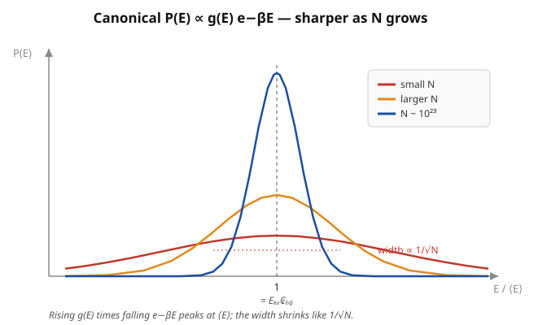

# Statistical Mechanics · Lesson 3.3: Fluctuations and the equivalence of ensembles

> ⏱ ~15 min · Module 3: The canonical and grand canonical ensembles · Builds on: [3.1 The canonical ensemble & the Boltzmann factor](#/lesson/stat-mech/03-01-canonical-ensemble-boltzmann-factor.md), [3.2 The partition function](#/lesson/stat-mech/03-02-partition-function.md) · Unlocks: 3.4 the equipartition theorem

## Why this matters

We built two different pictures of the same physics and never checked they agree. The **microcanonical** ensemble (Module 1) fixes the energy exactly and counts microstates. The **canonical** ensemble ([3.1](#/lesson/stat-mech/03-01-canonical-ensemble-boltzmann-factor.md), [3.2](#/lesson/stat-mech/03-02-partition-function.md)) lets energy *flow* to and from a heat bath, so $E$ is a fluctuating random variable — the system does not have one definite energy. These sound like genuinely different descriptions. This lesson shows they give **identical thermodynamics** for macroscopic systems, and the reason is one clean fact: canonical energy fluctuations are tiny, of relative size $1/\sqrt N$. Along the way we get a small jewel — the size of the fluctuations is fixed by the heat capacity, $\operatorname{Var}(E)=k_BT^2C_V$. A fluctuation (how much $E$ jitters) is tied to a response (how much $\langle E\rangle$ moves when you heat the system). That is the first appearance of the fluctuation–dissipation idea that runs through [6.1](#/lesson/stat-mech/06-01-brownian-langevin.md).

## The idea

In the canonical ensemble the system trades energy with the bath, so if you photographed it at random instants you'd catch it at slightly different energies each time. How wide is that spread?

Two competing forces set the answer. The **Boltzmann factor** $e^{-\beta E}$ pushes toward *low* energy — high-energy states are exponentially rare. But the **number of microstates** $g(E)$ (the density of states) explodes with energy — there are vastly more ways to be highly excited. Their product $g(E)e^{-\beta E}$ is therefore sharply *peaked*: a steeply rising factor times a steeply falling one. The peak sits at the energy where the two tendencies balance — and that turns out to be exactly the microcanonical energy at the bath's temperature.

Now the punchline. Both $g(E)$'s growth and the position of the peak are driven by $\sim N$ particles, so the peak sits at an energy $\langle E\rangle \propto N$. But the *width* of the peak grows only like $\sqrt N$ (it's a sum of $\sim N$ near-independent contributions — variances add, so the standard deviation goes like $\sqrt N$). The **relative** width is width/position $\sim \sqrt N / N = 1/\sqrt N$. For $N\sim10^{23}$ that's a few parts in $10^{12}$: the energy is, for every practical purpose, a fixed number. Fixing $E$ exactly (microcanonical) versus letting it float within one part in $10^{12}$ (canonical) cannot possibly matter for thermodynamics. **That** is why the ensembles agree. It is the [law of large numbers](#/lesson/probability-theory/04-02-laws-of-large-numbers.md) wearing a physicist's hat — the same $1/\sqrt N$ that made thermodynamics sharp back in [1.1](#/lesson/stat-mech/01-01-mechanics-to-statistics.md).

## The formal version

**Energy is a random variable with a computable variance.** In the canonical ensemble, $\langle E\rangle = -\partial_\beta \ln Z$ ([3.2](#/lesson/stat-mech/03-02-partition-function.md)). Its variance is the *next* $\beta$-derivative:

$$\operatorname{Var}(E) \;=\; \langle E^2\rangle - \langle E\rangle^2 \;=\; \frac{\partial^2 \ln Z}{\partial \beta^2} \;=\; -\frac{\partial \langle E\rangle}{\partial \beta}.$$

*In words:* the same generating function $\ln Z$ that spits out the mean energy on one derivative spits out the energy's spread on the second — variance is curvature of $\ln Z$ in $\beta$.

**The fluctuation–response relation.** Converting the $\beta$-derivative to a temperature derivative (using $\beta = 1/k_BT$, so $\partial_\beta = -k_BT^2\,\partial_T$) and recognizing $C_V = \partial\langle E\rangle/\partial T$:

$$\boxed{\;\operatorname{Var}(E) \;=\; k_B T^2\, C_V\;}$$

*In words:* the mean-square energy fluctuation equals $k_BT^2$ times the heat capacity. A **fluctuation** on the left, a **response function** on the right — how hard the energy jitters at equilibrium is set by how readily the system soaks up heat. (It also forces $C_V \ge 0$: a variance can't be negative. That's the thermodynamic stability condition from [2.4](#/lesson/stat-mech/02-04-maxwell-relations-stability.md), re-derived from statistics.)

**Relative fluctuations vanish in the thermodynamic limit.** For a normal system both $C_V$ and $\langle E\rangle$ are **extensive** ($\propto N$). Hence

$$\frac{\sigma_E}{\langle E\rangle} \;=\; \frac{\sqrt{k_B T^2 C_V}}{\langle E\rangle} \;\sim\; \frac{\sqrt{N}}{N} \;=\; \frac{1}{\sqrt N} \;\xrightarrow[N\to\infty]{}\; 0.$$

*In words:* absolute fluctuations grow (like $\sqrt N$), but relative to the total energy they shrink to nothing. The canonical energy distribution collapses onto a single value.

**Ensemble equivalence.** Because $P(E) \propto g(E)e^{-\beta E}$ is a narrow Gaussian peaked at $E^{*}$, and $E^{*}$ is precisely the microcanonical energy whose temperature equals the bath's, the two ensembles give the same $\langle E\rangle$, the same entropy, and the same equation of state to leading order in $N$. *In words:* fixing energy exactly and fixing temperature exactly are two routes to the identical thermodynamics — they differ only in $O(1/\sqrt N)$ fluctuations that macroscopic measurements never see. **The catch:** this rests on $C_V$ being finite and extensive. It **fails** when $C_V$ diverges (at a continuous phase transition — fluctuations become macroscopic, the whole subject of [Module 5](#/lesson/stat-mech/05-04-critical-exponents-universality.md)) or when energy is *not* extensive (long-range forces like gravity, where the ensembles genuinely disagree).

## Picture

The product of a steeply rising density of states $g(E)$ and the falling Boltzmann factor $e^{-\beta E}$ is a peak at $\langle E\rangle$ (the dashed line — also the microcanonical energy). As $N$ grows the peak keeps its position but its *relative* width shrinks like $1/\sqrt N$: the broad red curve (small $N$) sharpens to the spike (blue, $N\sim10^{23}$). In the thermodynamic limit the distribution is a delta function — the system "has" a definite energy after all.

## Worked examples

**Example 1 (mechanical — fluctuations from $\ln Z$).** A system has partition function $Z(\beta)$ with $\ln Z = a\,\beta^{-3/2}$ for a constant $a>0$ (this is the monatomic ideal gas, up to volume/particle factors — recall $Z\propto T^{3N/2}\propto\beta^{-3N/2}$ from [3.2](#/lesson/stat-mech/03-02-partition-function.md), here scaled). Find $\langle E\rangle$ and $\operatorname{Var}(E)$.

$$\langle E\rangle = -\frac{\partial \ln Z}{\partial\beta} = -a\left(-\tfrac32\right)\beta^{-5/2} = \tfrac32\,a\,\beta^{-5/2},$$

$$\operatorname{Var}(E) = \frac{\partial^2\ln Z}{\partial\beta^2} = \tfrac32\,a\left(-\tfrac52\right)\beta^{-7/2}\cdot(-1)= \tfrac{15}{4}\,a\,\beta^{-7/2}.$$

(The middle sign: $\partial_\beta[\tfrac32 a\beta^{-5/2}] = \tfrac32 a\cdot(-\tfrac52)\beta^{-7/2}$, and $\operatorname{Var}(E)=-\partial_\beta\langle E\rangle$ flips it positive.) The ratio $\sigma_E/\langle E\rangle = \sqrt{\tfrac{15}{4}a\beta^{-7/2}} \,/\, (\tfrac32 a\beta^{-5/2}) = \tfrac{\sqrt{15}}{3}\,a^{-1/2}\,\beta^{3/4}$, which shrinks as $a\propto N$ grows — the $1/\sqrt N$ law in disguise.

**Example 2 (why you'd care — reading fluctuations off a thermometer).** Suppose you measure a solid's heat capacity near room temperature to be $C_V = 3Nk_B$ (the Dulong–Petit value; you'll derive it from equipartition in [3.4](#/lesson/stat-mech/03-04-equipartition-theorem.md)). How big are its energy fluctuations, and how big *relative* to its energy?

Absolute: $\sigma_E = \sqrt{k_BT^2 C_V} = \sqrt{3N}\,k_B T$. With $\langle E\rangle \approx 3Nk_BT$,

$$\frac{\sigma_E}{\langle E\rangle} = \frac{\sqrt{3N}\,k_BT}{3Nk_BT} = \frac{1}{\sqrt{3N}}.$$

For a visible crystal, $N\sim10^{22}$, so $\sigma_E/\langle E\rangle \sim 10^{-11}$. You could never detect it. But the *same* $C_V$ that told you this crystal barely fluctuates is a directly measurable quantity — heat it and watch $\langle E\rangle$ rise. Fluctuation and response are two faces of one number: this is the seed of the fluctuation–dissipation theorem, where the tiny thermal jitter of a Brownian particle and the friction it feels are locked together by exactly this logic ([6.1](#/lesson/stat-mech/06-01-brownian-langevin.md)).

## Watch out

- You might think a *bigger* system has *bigger* fluctuations, so large systems are "noisier." Backwards: absolute fluctuations do grow ($\sigma_E\propto\sqrt N$), but the meaningful quantity is the *relative* fluctuation $\sigma_E/\langle E\rangle\propto 1/\sqrt N$, which *shrinks*. Large systems are sharper, not noisier.
- You might think $\operatorname{Var}(E)=k_BT^2C_V$ is just a formula. It's a genuine physical constraint: since a variance is $\ge 0$, it *proves* $C_V\ge 0$. A material with negative heat capacity would be thermodynamically unstable — the canonical ensemble literally cannot describe one (and the equivalence with the microcanonical ensemble breaks there, which is real for self-gravitating systems).
- You might think ensemble equivalence is automatic. It relies on energy being **extensive** and $C_V$ **finite**. At a critical point $C_V$ diverges and fluctuations swell to macroscopic size; with long-range interactions energy isn't extensive. In both cases the ensembles give *different* answers — equivalence is a theorem about short-range systems away from criticality, not a law of nature.

## One-liner

> Canonical energy fluctuates, but only by $1/\sqrt N$ — so for macroscopic $N$ its distribution is a razor-thin Gaussian pinned to the microcanonical energy, and its width is set by the heat capacity: $\operatorname{Var}(E)=k_BT^2C_V$.

## Problems

**P1 (🟢)** For a monatomic ideal gas, $\langle E\rangle = \tfrac32 Nk_BT$.
(a) Show $C_V=\tfrac32 Nk_B$ and hence $\operatorname{Var}(E)=\tfrac32 N(k_BT)^2$.
(b) Compute the relative fluctuation $\sigma_E/\langle E\rangle$ and show it equals $\sqrt{2/(3N)}\propto 1/\sqrt N$.
(c) Evaluate it for $N=10^{23}$.

**P2 (🟡)** Starting only from $Z=\sum_s e^{-\beta E_s}$, prove the two identities
$$\langle E\rangle = -\frac{\partial\ln Z}{\partial\beta}, \qquad \operatorname{Var}(E)=\frac{\partial^2\ln Z}{\partial\beta^2},$$
and then convert the second to $\operatorname{Var}(E)=k_BT^2C_V$. (Everything follows from differentiating $Z$ twice.)

**P3 (🔴, optional)** Show the canonical energy distribution is Gaussian near its peak. The probability of energy $E$ is $P(E)\propto g(E)e^{-\beta E}=e^{\phi(E)}$ with $\phi(E)=\ln g(E)-\beta E$. Using $\ln g(E)=S(E)/k_B$ (microcanonical entropy) and $\partial S/\partial E = 1/T$:
(a) Find the peak energy $E^{*}$ and show it is exactly the microcanonical energy whose temperature equals the bath temperature $T$.
(b) Taylor-expand $\phi$ to second order about $E^{*}$ and show $P(E)\propto\exp\!\big[-(E-E^{*})^2/(2k_BT^2C_V)\big]$ — a Gaussian of variance $k_BT^2C_V$, matching P2. (Use $\partial(1/T)/\partial E = -1/(T^2C_V)$.)

Solutions

**P1** (a) $C_V=\partial\langle E\rangle/\partial T = \partial_T(\tfrac32 Nk_BT)=\tfrac32 Nk_B$. Then
$$\operatorname{Var}(E)=k_BT^2C_V = k_BT^2\cdot\tfrac32 Nk_B = \tfrac32 N(k_BT)^2.$$
(b) $\sigma_E=\sqrt{\tfrac32 N}\,k_BT$, and dividing by $\langle E\rangle=\tfrac32 Nk_BT$:
$$\frac{\sigma_E}{\langle E\rangle}=\frac{\sqrt{\tfrac32 N}\,k_BT}{\tfrac32 Nk_BT}=\frac{\sqrt{\tfrac32 N}}{\tfrac32 N}=\frac{1}{\sqrt{\tfrac32 N}}=\sqrt{\frac{2}{3N}}.$$
This is $\propto 1/\sqrt N$. (c) For $N=10^{23}$: $\sqrt{2/(3\times10^{23})}=\sqrt{6.7\times10^{-24}}\approx 2.6\times10^{-12}$. A few parts in a trillion — undetectable, so the gas's energy is effectively sharp and the canonical description reproduces the microcanonical one.

**P2** Write $Z=\sum_s e^{-\beta E_s}$. Differentiate once:
$$\frac{\partial Z}{\partial\beta}=-\sum_s E_s e^{-\beta E_s}=-Z\langle E\rangle \;\Rightarrow\; \langle E\rangle = -\frac{1}{Z}\frac{\partial Z}{\partial\beta}=-\frac{\partial\ln Z}{\partial\beta}.$$
Differentiate $\langle E\rangle=-\partial_\beta\ln Z$ once more, i.e. take $\partial_\beta$ of $-(1/Z)\partial_\beta Z$:
$$\frac{\partial^2\ln Z}{\partial\beta^2}=\frac{\partial}{\partial\beta}\!\left(\frac{1}{Z}\frac{\partial Z}{\partial\beta}\right)=\frac{1}{Z}\frac{\partial^2 Z}{\partial\beta^2}-\left(\frac{1}{Z}\frac{\partial Z}{\partial\beta}\right)^{\!2}.$$
Now $\tfrac1Z\partial_\beta^2 Z=\tfrac1Z\sum_s E_s^2 e^{-\beta E_s}=\langle E^2\rangle$ and $\big(\tfrac1Z\partial_\beta Z\big)^2=\langle E\rangle^2$, so
$$\frac{\partial^2\ln Z}{\partial\beta^2}=\langle E^2\rangle-\langle E\rangle^2=\operatorname{Var}(E).$$
Finally, $\operatorname{Var}(E)=\partial^2_\beta\ln Z=-\partial_\beta\langle E\rangle$. With $\beta=1/k_BT$, $\dfrac{\partial}{\partial\beta}=\dfrac{dT}{d\beta}\dfrac{\partial}{\partial T}=-k_BT^2\dfrac{\partial}{\partial T}$, so
$$\operatorname{Var}(E)=-\frac{\partial\langle E\rangle}{\partial\beta}=k_BT^2\frac{\partial\langle E\rangle}{\partial T}=k_BT^2C_V.\qquad\blacksquare$$

**P3** (a) $\phi(E)=\dfrac{S(E)}{k_B}-\beta E$. Set $\phi'(E)=0$:
$$\phi'(E)=\frac{1}{k_B}\frac{\partial S}{\partial E}-\beta=\frac{1}{k_B}\frac{1}{T(E)}-\frac{1}{k_BT}=0 \;\Rightarrow\; T(E^{*})=T.$$
So the peak $E^{*}$ is the energy at which the system's *own* (microcanonical) temperature $T(E)=(\partial S/\partial E)^{-1}$ equals the bath temperature $T$ — i.e. exactly the microcanonical energy at temperature $T$. This is ensemble equivalence made pointwise: the canonical distribution piles up at the microcanonical energy.

(b) Expand $\phi$ about $E^{*}$; the linear term vanishes since $\phi'(E^{*})=0$:
$$\phi(E)\approx\phi(E^{*})+\tfrac12\phi''(E^{*})(E-E^{*})^2.$$
Compute the curvature: $\phi''(E)=\dfrac{1}{k_B}\dfrac{\partial}{\partial E}\!\left(\dfrac{1}{T}\right)=\dfrac{1}{k_B}\left(-\dfrac{1}{T^2C_V}\right)=-\dfrac{1}{k_BT^2C_V}$, using $\partial(1/T)/\partial E=-\dfrac{1}{T^2}\dfrac{\partial T}{\partial E}=-\dfrac{1}{T^2}\dfrac{1}{C_V}$ (since $\partial E/\partial T=C_V$). Therefore
$$P(E)\propto e^{\phi(E)}\propto\exp\!\left[-\frac{(E-E^{*})^2}{2k_BT^2C_V}\right],$$
a Gaussian centered at $E^{*}$ with variance $\sigma^2=k_BT^2C_V$ — identical to the P2 result, now derived as a *shape*, not just a moment. Since $E^{*}\propto N$ and $\sigma\propto\sqrt{C_V}\propto\sqrt N$, the relative width is $\sigma/E^{*}\propto1/\sqrt N$. Note the peak is a genuine maximum ($\phi''<0$) only because $C_V>0$: stability and the Gaussian's existence are the same statement, and both break where $C_V$ diverges (criticality). This is the [central limit theorem](#/lesson/probability-theory/04-05-central-limit-theorem.md) in action — $E$ is a sum of $\sim N$ near-independent contributions, so its distribution is Gaussian with width $\propto\sqrt N$.

## Flashback

**From Lesson 3.2 (The partition function):** A single localized particle sits in one of two energy levels, $0$ and $\epsilon>0$. Write its partition function $Z(\beta)$ and use $\langle E\rangle=-\partial_\beta\ln Z$ to find its mean energy. What is $\langle E\rangle$ as $T\to0$ and as $T\to\infty$?

Solution

Two terms in the sum over states:
$$Z=e^{-\beta\cdot 0}+e^{-\beta\epsilon}=1+e^{-\beta\epsilon}.$$
Then $\ln Z=\ln(1+e^{-\beta\epsilon})$ and
$$\langle E\rangle=-\frac{\partial\ln Z}{\partial\beta}=-\frac{-\epsilon e^{-\beta\epsilon}}{1+e^{-\beta\epsilon}}=\frac{\epsilon\,e^{-\beta\epsilon}}{1+e^{-\beta\epsilon}}=\frac{\epsilon}{e^{\beta\epsilon}+1}.$$
Limits: as $T\to0$ ($\beta\to\infty$), $e^{\beta\epsilon}\to\infty$ so $\langle E\rangle\to0$ — the particle freezes into the ground state. As $T\to\infty$ ($\beta\to0$), $e^{\beta\epsilon}\to1$ so $\langle E\rangle\to\epsilon/2$ — both levels equally likely, energy saturates at the average of $0$ and $\epsilon$. (Take one more $\beta$-derivative of this and you'd get $\operatorname{Var}(E)$ and the Schottky heat-capacity bump — exactly the machine this lesson is built on.)

## Connections

- **Backward:** this is the second $\beta$-derivative of the same $\ln Z$ that gave $\langle E\rangle$ in [3.2](#/lesson/stat-mech/03-02-partition-function.md) — mean then variance, first then second derivative. The $1/\sqrt N$ sharpening is the [law of large numbers](#/lesson/probability-theory/04-02-laws-of-large-numbers.md) promised back in [1.1](#/lesson/stat-mech/01-01-mechanics-to-statistics.md), now made quantitative; the stability bound $C_V\ge 0$ is the statistical proof of the convexity condition from [2.4](#/lesson/stat-mech/02-04-maxwell-relations-stability.md).
- **Forward:** ensemble equivalence licenses everything ahead — we'll compute in whichever ensemble is easiest ([3.5](#/lesson/stat-mech/03-05-grand-canonical-ensemble.md) lets *particle number* fluctuate by the identical logic) trusting the answers agree. The failure at diverging $C_V$ is the doorway to critical phenomena in [Module 5](#/lesson/stat-mech/05-04-critical-exponents-universality.md).
- **Sideways (probability):** P3 is the [central limit theorem](#/lesson/probability-theory/04-05-central-limit-theorem.md) applied to energy — a sum of $\sim N$ near-independent terms is Gaussian with relative width $1/\sqrt N$. The fluctuation–response link $\operatorname{Var}(E)=k_BT^2C_V$ is the first instance of the fluctuation–dissipation theorem, the centerpiece of [6.1](#/lesson/stat-mech/06-01-brownian-langevin.md).
