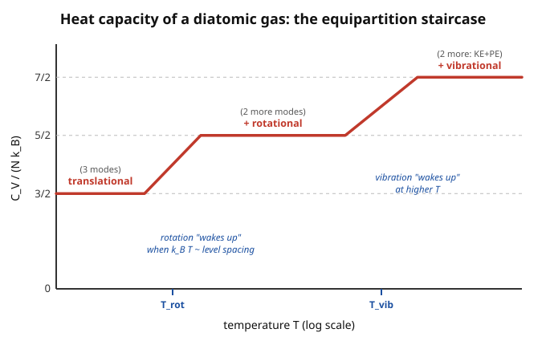

# Statistical Mechanics · Lesson 3.4: The equipartition theorem

> ⏱ ~15 min · Module 3: The canonical and grand canonical ensembles · Builds on: [3.2 The partition function](#/lesson/stat-mech/03-02-partition-function.md), [3.1 The canonical ensemble & the Boltzmann factor](#/lesson/stat-mech/03-01-canonical-ensemble-boltzmann-factor.md) · Unlocks: 3.5 grand canonical ensemble; Module 4 quantum statistics (where equipartition breaks and the Einstein solid fixes it)

## Why this matters

Here is a rule you can apply in ten seconds, before writing down a single partition function: **count the squared terms in the energy, multiply by $\tfrac12 k_B T$, and you have the average energy.** That is the equipartition theorem, and it hands you the heat capacity of a gas, a solid, a vibrating molecule — right off the Hamiltonian, no integrals visible. It explains the two-century-old Dulong–Petit law (every solid has molar heat capacity $\approx 3R$) and the crisp ratios $\tfrac32 R, \tfrac52 R$ for gases. But its real value is the place it *fails*: watch heat capacities fall as you cool a gas, and you are watching classical physics die and quantum mechanics take over. Equipartition is both a workhorse and the tripwire that led to quantum theory — the same tripwire that produced the ultraviolet catastrophe in blackbody radiation.

## The idea

Thermal energy is democratic. Throw a system into a heat bath at temperature $T$ and every independent "way to store energy" — every mode — grabs the same average share. The catch is *which* modes qualify. Equipartition is picky: a mode counts only if its energy is a **quadratic** function of some coordinate or momentum, a term shaped like $\tfrac12 a\, x^2$. Kinetic energy $\tfrac{p^2}{2m}$ qualifies (quadratic in $p$). A spring's potential $\tfrac12 kx^2$ qualifies. Each such term, in equilibrium, carries exactly

$$\left\langle \tfrac12 a\,x^2\right\rangle = \tfrac12 k_B T.$$

Why $\tfrac12 k_B T$ and nothing else? Because in the canonical ensemble a quadratic coordinate is Boltzmann-weighted by $e^{-\beta a x^2/2}$ — a **Gaussian**. And a Gaussian's spread is set entirely by temperature: hotter bath, wider bell, more energy stored, in a proportion that a single Gaussian integral pins to $\tfrac12 k_B T$ regardless of the stiffness $a$. The stiffness cancels. That cancellation is the whole magic: a floppy mode and a stiff mode store the *same* thermal energy, because the floppy one ranges far while the stiff one ranges little, and the two effects exactly trade off.

So the recipe: **count quadratic degrees of freedom, multiply by $\tfrac12 k_B T$.** A gas atom free to move in 3D has 3 quadratic momentum terms $\to \tfrac32 k_B T$. Add a spring and you add a potential term. That count *is* the physics.

## The formal version

**Setup.** A system in contact with a heat bath at temperature $T$ has, for any phase-space function $A$, the canonical average
$$\langle A\rangle = \frac{\displaystyle\int A\,e^{-\beta H}\,d\Gamma}{\displaystyle\int e^{-\beta H}\,d\Gamma},\qquad \beta = \frac{1}{k_B T},$$
where $H$ is the Hamiltonian and $d\Gamma$ the phase-space measure (from [3.1](#/lesson/stat-mech/03-01-canonical-ensemble-boltzmann-factor.md)).

**Quadratic equipartition.** Suppose one term of $H$ is $\tfrac12 a\,x^2$ for a coordinate or momentum $x$ ranging over $(-\infty,\infty)$, additive and independent of the rest. Then
$$\boxed{\;\left\langle \tfrac12 a\,x^2\right\rangle = \tfrac12 k_B T\;}$$
*In words:* every squared slot in the energy holds, on average, $\tfrac12 k_B T$ — independent of the coefficient $a$, the mass, the spring constant, anything. Temperature alone fixes the share.

**The generalized theorem (the one line that proves it).** For any phase-space variables $x_i, x_j$,
$$\left\langle x_i\,\frac{\partial H}{\partial x_j}\right\rangle = \delta_{ij}\,k_B T.$$
*In words:* multiply a variable by its own conjugate "force" $\partial H/\partial x_j$ and the thermal average is $k_B T$ (and zero for mismatched indices). The proof is one integration by parts. Since $\partial_{x_j}e^{-\beta H} = -\beta\,(\partial_{x_j}H)\,e^{-\beta H}$,
$$\left\langle x_i\frac{\partial H}{\partial x_j}\right\rangle = \frac{\int x_i\,(\partial_{x_j}H)\,e^{-\beta H}\,d\Gamma}{\int e^{-\beta H}\,d\Gamma} = \frac{-\frac1\beta\int x_i\,\partial_{x_j}\!\big(e^{-\beta H}\big)\,d\Gamma}{\int e^{-\beta H}\,d\Gamma} \overset{\text{by parts}}{=} \frac{\frac1\beta\int \delta_{ij}\,e^{-\beta H}\,d\Gamma}{\int e^{-\beta H}\,d\Gamma} = \frac{\delta_{ij}}{\beta}.$$
The boundary term dies because $e^{-\beta H}\to 0$ as $|x_j|\to\infty$ (any physical energy grows without bound). Specialize to a quadratic term $H \supset \tfrac12 a\,x^2$: then $x\,\partial_x H = x\,(a x) = a x^2$, so $\langle a x^2\rangle = k_B T$, i.e. $\langle \tfrac12 a x^2\rangle = \tfrac12 k_B T$. $\blacksquare$

**Equipartition rule.** If $H$ splits into $f$ independent quadratic terms, then
$$\langle E\rangle = \frac{f}{2}\,k_B T, \qquad C_V = \frac{\partial \langle E\rangle}{\partial T} = \frac{f}{2}\,k_B \ \text{(per particle)}.$$
*In words:* count the squared terms $f$, and both energy and heat capacity follow immediately — $C_V$ is a pure count of active modes times $\tfrac12 k_B$, with **no dependence on $T$**. That flatness is exactly what breaks at low temperature.

**The catalog** (per molecule; multiply by $N$ for the whole system):

| System | Quadratic terms $f$ | $\langle E\rangle$ | $C_V$ |
|---|---|---|---|
| Monatomic gas | $3$ trans ($p_x^2,p_y^2,p_z^2$) | $\tfrac32 k_B T$ | $\tfrac32 N k_B$ |
| Diatomic gas (mid-$T$) | $3$ trans $+\,2$ rot | $\tfrac52 k_B T$ | $\tfrac52 N k_B$ |
| Diatomic gas (high-$T$) | $+\,2$ vib (KE $+$ PE) $=7$ | $\tfrac72 k_B T$ | $\tfrac72 N k_B$ |
| Classical solid | $3$ KE $+\,3$ PE $=6$ | $3 k_B T$ | $3 N k_B$ |
| 1D harmonic oscillator | $1$ KE $+\,1$ PE $=2$ | $k_B T$ | $k_B$ |

The solid line is the **Dulong–Petit law**: molar heat capacity $C = 3N_A k_B = 3R \approx 24.9\ \mathrm{J\,mol^{-1}K^{-1}}$, the same for every simple crystal — copper, aluminium, lead — because every atom is three springs and each spring is two quadratic slots.

## Picture

Equipartition alone predicts a flat line — pick your plateau and stay there. Reality is a **staircase**: as you heat the gas, new modes switch on one at a time. Below $T_{\text{rot}}$ the molecule can't rotate (no thermal energy reaches the first rotational level), so only translation counts: $C_V=\tfrac32 Nk_B$. Cross $T_{\text{rot}}$ and rotation "wakes up," lifting $C_V$ to $\tfrac52 Nk_B$. Cross the much higher $T_{\text{vib}}$ and vibration joins, heading for $\tfrac72 Nk_B$. Each riser is a **quantum freeze-out** boundary — a mode becoming accessible when $k_B T$ finally exceeds its level spacing. Classical equipartition is what you get *on the flat parts*, after every relevant mode has already switched on.

## Worked examples

**Example 1 (mechanical — heat capacity from a glance).** Predict $C_V$ for helium (monatomic) and for nitrogen $\mathrm{N_2}$ (diatomic) at room temperature, in units of $R$ per mole.

Helium: a structureless point, 3 translational momentum terms, $f=3$. So $C_V = \tfrac32 R \approx 12.5\ \mathrm{J\,mol^{-1}K^{-1}}$. Measured: $12.5$. Exact.

Nitrogen at $300$ K: translation ($3$) plus two rotational axes ($2$) — the third axis, spinning about the bond, has a tiny moment of inertia and its levels are unreachably high, so it does **not** count. Vibration is also frozen ($T_{\text{vib}}\sim 3400$ K for $\mathrm{N_2}$). So $f=5$, $C_V = \tfrac52 R \approx 20.8\ \mathrm{J\,mol^{-1}K^{-1}}$. Measured: $20.8$. Equipartition nails it — *because room temperature happens to sit on the $\tfrac52$ plateau.*

**Example 2 (why you'd care — the classical solid and its cliff).** A crystal is $N$ atoms, each tethered by springs in three directions: $H = \sum_{i=1}^{N}\big(\tfrac{\mathbf p_i^2}{2m} + \tfrac12 m\omega^2 \mathbf r_i^2\big)$. Per atom that is $3$ kinetic $+\,3$ potential $=6$ quadratic terms, so $\langle E\rangle = 6\cdot\tfrac12 k_B T = 3k_B T$, giving
$$U = 3N k_B T,\qquad C = 3N k_B = 3R\ \text{per mole}.$$
This is Dulong–Petit, and at room temperature it works for most solids to within a few percent. But cool the crystal and $C$ does **not** stay at $3R$ — it collapses toward zero, empirically like $T^3$. Equipartition has no knob that could produce that: $3Nk_B$ is a constant. The failure is total and it is a *low-temperature* failure. The fix — quantize each oscillator so it can't absorb energy in arbitrarily small amounts — is the **Einstein solid** (Boss Problem 3, and Module 4). There, $\langle E\rangle$ per mode becomes $\hbar\omega/(e^{\beta\hbar\omega}-1)$, which reduces to $k_B T$ when $k_B T \gg \hbar\omega$ (recovering Dulong–Petit) but is exponentially suppressed when $k_B T \ll \hbar\omega$ (the modes freeze, $C\to 0$). Equipartition is the high-temperature limit of the correct quantum answer.

## Watch out

- You might think **every** degree of freedom gets $\tfrac12 k_B T$. Only **quadratic** ones do. A term linear in a coordinate, or a hard-wall potential, or a term like $|x|$ or $x^4$ does *not* give $\tfrac12 k_B T$ — the clean result is special to Gaussians. (Redo the by-parts proof for $H\supset b|x|$ and you get $k_B T$ for $\langle x\,\partial_x H\rangle = \langle b|x|\rangle$, hence $\langle b|x|\rangle = k_B T$, not $\tfrac12$.) And note the vibrational mode counts **twice** (kinetic *and* potential), which is why the vibrational plateau adds $2\cdot\tfrac12 = 1$ full $k_B$ to $C_V$, not $\tfrac12$.
- You might think equipartition is just wrong and quantum mechanics replaces it. No — it is the **high-temperature limit** of the exact result, correct whenever $k_B T$ dwarfs every relevant level spacing. Use it freely on the plateaus; distrust it near a riser.
- You might think a heat capacity that falls at low $T$ is some exotic effect. It is the generic behavior of *every* real system, and its universality is the tell: whenever $k_B T$ drops below a mode's quantum spacing, that mode stops absorbing energy and $C_V$ steps down. The same arithmetic applied to electromagnetic field modes — where high-frequency modes have arbitrarily large spacing — is what saves blackbody radiation from the **ultraviolet catastrophe**: classically each field mode would claim its $k_B T$ and the total energy would diverge; quantization freezes the high-frequency modes out. That is the photon-gas story in [4.3](#/lesson/stat-mech/04-03-photon-gas-blackbody.md).

## One-liner

> Count the squared terms in the energy, give each $\tfrac12 k_B T$ — and remember the count is only honest once $k_B T$ has climbed above every quantum level spacing, which is why heat capacities fall when you cool.

## Problems

**P1 (🟢)** Using equipartition, predict the molar heat capacity $C_V$ (in units of $R$) for (a) monatomic argon gas, (b) diatomic oxygen $\mathrm{O_2}$ at room temperature (rotation active, vibration frozen), and (c) solid copper. Then state the Dulong–Petit law and say which of your three answers it is.

**P2 (🟡)** Derive $\big\langle \tfrac12 m v_x^2\big\rangle = \tfrac12 k_B T$ directly by doing the Gaussian integral, *without* invoking the equipartition theorem. In the canonical ensemble the one-component velocity $v_x$ is distributed with weight $\propto e^{-\beta m v_x^2/2}$. Compute $\big\langle \tfrac12 m v_x^2\big\rangle = \tfrac12 m \langle v_x^2\rangle$ from that weight, using $\int_{-\infty}^{\infty} e^{-\alpha v^2}dv = \sqrt{\pi/\alpha}$.

**P3 (🔴, optional)** A diatomic molecule's rotational energy levels are $E_J = \dfrac{\hbar^2}{2I}J(J+1)$, $J=0,1,2,\dots$, so the gap from the ground state to the first excited rotational state is of order $\dfrac{\hbar^2}{2I}$. Define the rotational "freeze-out" temperature $T_{\text{rot}}$ by $k_B T_{\text{rot}} = \dfrac{\hbar^2}{2I}$.
(a) For $\mathrm{H_2}$, estimate $T_{\text{rot}}$. Use bond length $r \approx 0.74\ \text{Å} = 7.4\times10^{-11}$ m and reduced mass $\mu = m_H/2 \approx 8.4\times10^{-28}$ kg, so $I=\mu r^2$. Take $\hbar = 1.05\times10^{-34}\ \mathrm{J\,s}$, $k_B = 1.38\times10^{-23}\ \mathrm{J\,K^{-1}}$.
(b) Explain, using your number, why $\mathrm{H_2}$'s molar $C_V$ drops from $\tfrac52 R$ toward $\tfrac32 R$ as it is cooled below room temperature — and why hydrogen is essentially the *only* common gas for which this rotational drop is observable before the gas liquefies.

Solutions

**P1** Count quadratic degrees of freedom $f$ per particle; molar $C_V = \tfrac{f}{2}R$.

(a) Argon (monatomic): $f=3$ (translation only) $\Rightarrow C_V = \tfrac32 R \approx 12.5\ \mathrm{J\,mol^{-1}K^{-1}}$.

(b) $\mathrm{O_2}$ at room $T$: $3$ translational $+\,2$ rotational $=5$ (vibration frozen, $T_{\text{vib}}\sim 2300$ K) $\Rightarrow C_V = \tfrac52 R \approx 20.8\ \mathrm{J\,mol^{-1}K^{-1}}$.

(c) Solid copper: each atom is $3$ kinetic $+\,3$ potential $=6$ quadratic terms $\Rightarrow C_V = 3R \approx 24.9\ \mathrm{J\,mol^{-1}K^{-1}}$.

**Dulong–Petit law:** the molar heat capacity of a simple solid is $3R$, independent of the material. That is answer (c).

**P2** With weight $w(v_x)\propto e^{-\beta m v_x^2/2}$, write $\alpha = \beta m/2$ so $w \propto e^{-\alpha v_x^2}$. Then
$$\langle v_x^2\rangle = \frac{\displaystyle\int_{-\infty}^{\infty} v_x^2\,e^{-\alpha v_x^2}\,dv_x}{\displaystyle\int_{-\infty}^{\infty} e^{-\alpha v_x^2}\,dv_x}.$$
The denominator is $\sqrt{\pi/\alpha}$. For the numerator, differentiate the given integral with respect to $\alpha$:
$$\int_{-\infty}^{\infty} v^2 e^{-\alpha v^2}\,dv = -\frac{d}{d\alpha}\int_{-\infty}^{\infty} e^{-\alpha v^2}\,dv = -\frac{d}{d\alpha}\big(\sqrt{\pi}\,\alpha^{-1/2}\big) = \tfrac12\sqrt{\pi}\,\alpha^{-3/2}.$$
Divide:
$$\langle v_x^2\rangle = \frac{\tfrac12\sqrt{\pi}\,\alpha^{-3/2}}{\sqrt{\pi}\,\alpha^{-1/2}} = \frac{1}{2\alpha} = \frac{1}{2\cdot(\beta m/2)} = \frac{1}{\beta m} = \frac{k_B T}{m}.$$
Therefore
$$\left\langle \tfrac12 m v_x^2\right\rangle = \tfrac12 m\cdot\frac{k_B T}{m} = \tfrac12 k_B T,$$
the equipartition value for one quadratic momentum slot, obtained from scratch. (Summing the three components gives $\langle \tfrac12 m v^2\rangle = \tfrac32 k_B T$, the mean kinetic energy of a gas atom.)

**P3** (a) Moment of inertia: $I = \mu r^2 = (8.4\times10^{-28})(7.4\times10^{-11})^2 = (8.4\times10^{-28})(5.48\times10^{-21}) \approx 4.6\times10^{-48}\ \mathrm{kg\,m^2}$.
Energy scale: $\dfrac{\hbar^2}{2I} = \dfrac{(1.05\times10^{-34})^2}{2(4.6\times10^{-48})} = \dfrac{1.10\times10^{-68}}{9.2\times10^{-48}} \approx 1.20\times10^{-21}\ \mathrm{J}$.
Temperature: $T_{\text{rot}} = \dfrac{1.20\times10^{-21}}{1.38\times10^{-23}} \approx 87\ \mathrm{K}$.

(b) At room temperature ($300$ K $\gg T_{\text{rot}}\approx 87$ K) many rotational levels are thermally populated, the spectrum looks effectively continuous, and equipartition applies: the $2$ rotational modes are fully active, $C_V = \tfrac52 R$. As $\mathrm{H_2}$ is cooled toward and below $T_{\text{rot}}$, $k_B T$ falls below the rotational level spacing; thermal kicks can no longer promote molecules out of $J=0$, so rotation freezes out and stops absorbing energy. The two rotational modes switch off and $C_V$ steps down from $\tfrac52 R$ to $\tfrac32 R$ — the translational-only value. Hydrogen is special because it is the **lightest** molecule: smallest reduced mass $\mu$ and shortest bond give the smallest $I$, hence the **largest** $T_{\text{rot}}$ ($\sim 87$ K) of any common gas. For heavier molecules ($\mathrm{N_2}$: $T_{\text{rot}}\approx 2.9$ K; $\mathrm{O_2}$: $\approx 2.1$ K) the freeze-out temperature lies below the boiling point, so the gas liquefies before rotation can freeze — the drop is unobservable. $\mathrm{H_2}$ boils at $20$ K, comfortably below $87$ K, leaving a window in which the rotational staircase step is measurable. (This is exactly the middle riser of the Picture, brought down to a real, checkable temperature.)

## Flashback

**From Lesson 3.2 (The partition function):** A classical one-dimensional harmonic oscillator has $H = \dfrac{p^2}{2m} + \dfrac12 m\omega^2 x^2$, and its single-particle partition function works out to $Z = \dfrac{k_B T}{\hbar\omega}$ (i.e. $Z \propto \beta^{-1}$). Without doing any phase-space integral, use the master formula $\langle E\rangle = -\dfrac{\partial \ln Z}{\partial \beta}$ to find $\langle E\rangle$, and confirm it matches what equipartition predicts for this oscillator.

Solution

Write $Z = C\,\beta^{-1}$ with $C = 1/\hbar\omega$ a $\beta$-independent constant (since $k_B T = 1/\beta$). Then $\ln Z = \ln C - \ln\beta$, so
$$\langle E\rangle = -\frac{\partial \ln Z}{\partial\beta} = -\left(-\frac{1}{\beta}\right) = \frac{1}{\beta} = k_B T.$$
Equipartition agrees: the oscillator has two quadratic terms (one in $p$, one in $x$), so $\langle E\rangle = 2\cdot\tfrac12 k_B T = k_B T$. ✓ The two routes — differentiating $\ln Z$ from [3.2](#/lesson/stat-mech/03-02-partition-function.md) versus counting squared slots — give the same answer, as they must, because both are the same Gaussian integral in disguise. (Contrast the *quantum* oscillator, whose $Z = 1/(e^{\beta\hbar\omega/2}-e^{-\beta\hbar\omega/2})$ gives $\langle E\rangle = \tfrac{\hbar\omega}{2} + \tfrac{\hbar\omega}{e^{\beta\hbar\omega}-1}\to k_B T$ only when $k_B T\gg\hbar\omega$ — the Einstein-solid result.)

## Connections

- **Backward:** this is the canonical machinery of [3.1](#/lesson/stat-mech/03-01-canonical-ensemble-boltzmann-factor.md)–[3.2](#/lesson/stat-mech/03-02-partition-function.md) evaluated on the special case of quadratic Hamiltonians, where the Gaussian integral is exact and universal. The energy variance from [3.3](#/lesson/stat-mech/03-03-fluctuations-ensemble-equivalence.md), $\operatorname{Var}(E)=k_B T^2 C_V$, combines with the $C_V=\tfrac{f}{2}Nk_B$ found here to give the relative energy fluctuation $\sim 1/\sqrt N$ once more.
- **Forward:** the *failure* of equipartition is the doorway to Module 4. Boss Problem 3's **Einstein solid** quantizes the oscillators and recovers Dulong–Petit at high $T$ while explaining its low-$T$ collapse; [4.3](#/lesson/stat-mech/04-03-photon-gas-blackbody.md) applies the same freeze-out to field modes to defuse the ultraviolet catastrophe and derive Planck's law. Both are "equipartition, but with the modes that quantum mechanics won't let you excite removed."
- **Sideways (quantum mechanics):** the level spacings that set every freeze-out temperature are the quantized energies of [quantum-mechanics 3.1 (the harmonic oscillator)](#/lesson/quantum-mechanics/03-01-harmonic-oscillator-analytic.md) and the rigid rotor; the historical collision between equipartition's predictions and measured heat capacities and blackbody spectra is precisely [why quantum mechanics was needed](#/lesson/quantum-mechanics/01-01-why-quantum.md).
