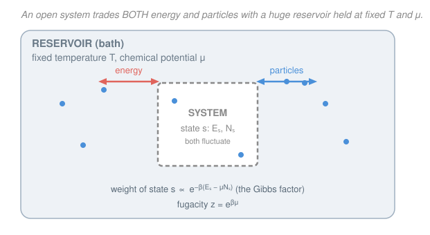

# Statistical Mechanics · Lesson 3.5: The grand canonical ensemble

> ⏱ ~15 min · Module 3: The canonical and grand canonical ensembles · Builds on: [3.1 The canonical ensemble and the Boltzmann factor](#/lesson/stat-mech/03-01-canonical-ensemble-boltzmann-factor.md), [3.2 The partition function](#/lesson/stat-mech/03-02-partition-function.md), [3.3 Fluctuations and the equivalence of ensembles](#/lesson/stat-mech/03-03-fluctuations-ensemble-equivalence.md) · Unlocks: Module 4 — quantum statistics, where each single-particle mode becomes its own tiny grand-canonical system (Bose–Einstein & Fermi–Dirac)

## Why this matters

The canonical ensemble let energy leak across the wall but bolted the particle count shut. That bolt is a problem. Real open systems — a patch of gas inside a larger gas, electrons in a metal in contact with a lead, a single quantum mode that any number of photons can pour into — swap *particles* as freely as they swap energy. And there's a deeper payoff hiding here: once you let $N$ float, a gas of indistinguishable quantum particles decouples into **independent single-mode problems**, each mode its own microscopic open system. That decoupling is the entire engine of Module 4 — Fermi–Dirac, Bose–Einstein, Planck radiation all fall out of one grand-canonical mode. This lesson builds the third and most powerful ensemble, and hands you the object — the grand partition function — that makes quantum gases tractable.

## The idea

You already know the move. In [3.1](#/lesson/stat-mech/03-01-canonical-ensemble-boltzmann-factor.md) we put a small system against a huge heat bath, let them share energy, and Taylor-expanded the reservoir's entropy in the tiny energy the system borrowed. Out popped the Boltzmann factor $e^{-\beta E_s}$: a state costs probability in proportion to the energy it drains from the bath.

Now punch a second hole in the wall — a permeable one — so **particles** cross too. The reservoir is now a bath of both energy and matter, characterized by a temperature $T$ (how willing it is to give up energy) and a **chemical potential** $\mu$ (how willing it is to give up particles). Run the exact same expansion, but in *two* directions at once: a system state that borrows energy $E_s$ *and* pulls $N_s$ particles out of the bath is penalized on both counts. The result is the **Gibbs factor** $e^{-\beta(E_s - \mu N_s)}$. The $-\mu N_s$ is a discount: if the bath is eager to shed particles (high $\mu$), grabbing them is cheap, and states with more particles get *rewarded*. Chemical potential is the "price of a particle," set by the reservoir, exactly as temperature is the price of energy.

## The formal version

**The setup.** A system exchanges energy and particles with a reservoir; the total energy $E_{\text{tot}}$ and total particle number $N_{\text{tot}}$ are fixed, but the system's share $(E_s, N_s)$ fluctuates. As before, the system's probability of sitting in microstate $s$ is proportional to the *number of reservoir microstates* left over, $\Omega_R = e^{S_R/k_B}$.

**The Gibbs factor.** Expand the reservoir entropy $S_R(E_{\text{tot}}-E_s,\, N_{\text{tot}}-N_s)$ to first order in the small amounts $E_s, N_s$:
$$S_R \approx S_R(E_{\text{tot}}, N_{\text{tot}}) - E_s\frac{\partial S_R}{\partial E} - N_s\frac{\partial S_R}{\partial N} = \text{const} - \frac{E_s}{T} + \frac{\mu N_s}{T},$$
using the thermodynamic identities $\partial S/\partial E = 1/T$ and $\partial S/\partial N = -\mu/T$ from [1.4](#/lesson/stat-mech/01-04-temperature-pressure-chemical-potential.md). Exponentiating,
$$\boxed{\,P(s) = \frac{1}{\mathcal{Z}}\,e^{-\beta(E_s - \mu N_s)}\,},\qquad \beta = \frac{1}{k_B T}.$$
*In words:* the probability of a microstate is set by how much energy **and** how many particles it withdraws from the bath — energy taxed by $\beta$, particles refunded at rate $\beta\mu$.

**The grand partition function.** Normalization demands
$$\mathcal{Z}(T,V,\mu) = \sum_s e^{-\beta(E_s - \mu N_s)} = \sum_{N=0}^{\infty} e^{\beta\mu N}\!\!\sum_{s:\,N_s = N}\!\! e^{-\beta E_s} = \sum_{N=0}^{\infty} z^N\, Z(N,V,T),$$
where the sum was reorganized by first fixing the particle number $N$ (the inner sum is just the canonical partition function $Z(N,V,T)$ of that $N$-particle system) and then summing over $N$, weighted by the **fugacity**
$$z \equiv e^{\beta\mu}.$$
*In words:* $\mathcal{Z}$ is a fugacity-weighted stack of *all* the canonical partition functions, one for each possible particle number — it packages every $N$-sector at once.

**The grand potential.** Define
$$\Omega(T,V,\mu) = -k_B T \ln \mathcal{Z} = -pV,\qquad d\Omega = -S\,dT - p\,dV - N\,d\mu.$$
*In words:* $\Omega$ is to the grand ensemble what the free energy $F=-k_BT\ln Z$ was to the canonical one — the log of the partition function, promoted to a thermodynamic potential whose natural variables are $(T,V,\mu)$. (That $\Omega = -pV$ is proved in **P2**.)

**Extraction formulas.** Every average is a derivative of $\ln\mathcal{Z}$:
$$\langle N\rangle = k_B T\,\frac{\partial \ln\mathcal{Z}}{\partial \mu} = -\frac{\partial \Omega}{\partial \mu},\qquad \langle E\rangle = -\left(\frac{\partial \ln\mathcal{Z}}{\partial \beta}\right)_{\!z},\qquad p = -\frac{\partial\Omega}{\partial V} = -\frac{\Omega}{V}.$$
The mean particle number is the cleanest: differentiating $\ln\mathcal{Z}$ with respect to $\mu$ pulls down a factor $\beta N_s$ inside the average, giving $\langle N\rangle$. *In words:* $\ln\mathcal{Z}$ is a generating function — slope in $\mu$ gives $\langle N\rangle$, slope in $\beta$ gives the energy, slope in $V$ gives the pressure.

**Particle-number fluctuations.** One more $\mu$-derivative turns the mean into the variance:
$$\operatorname{Var}(N) = \langle N^2\rangle - \langle N\rangle^2 = k_B T\,\frac{\partial \langle N\rangle}{\partial \mu}.$$
*In words:* just as energy fluctuations in [3.3](#/lesson/stat-mech/03-03-fluctuations-ensemble-equivalence.md) measured the heat capacity, particle-number fluctuations measure how easily the system soaks up particles — which is the **compressibility** (P3). And because $\operatorname{Var}(N)\propto\langle N\rangle$, the *relative* spread $\sqrt{\operatorname{Var}(N)}/\langle N\rangle \sim 1/\sqrt{\langle N\rangle}$ vanishes in the thermodynamic limit: fixing $\mu$ pins $N$ just as tightly as if you'd bolted it down. **Ensemble equivalence, one more time** — grand canonical, canonical, and microcanonical all agree on macroscopic quantities.

## Picture

## Worked examples

**Example 1 (mechanical — an adsorption site).** A surface site can be empty or hold one gas molecule of binding energy $\epsilon$; the gas is a reservoir at $T,\mu$. Two microstates: empty $(E=0,N=0)$ and occupied $(E=\epsilon, N=1)$. Then
$$\mathcal{Z} = e^{-\beta(0-0)} + e^{-\beta(\epsilon - \mu)} = 1 + z\,e^{-\beta\epsilon},$$
and the occupation probability is
$$\langle N\rangle = \frac{0\cdot 1 + 1\cdot e^{-\beta(\epsilon-\mu)}}{\mathcal{Z}} = \frac{1}{e^{\beta(\epsilon-\mu)} + 1}.$$
This is the **Langmuir isotherm** — and, as **P1** spells out, it is *literally the Fermi–Dirac distribution*. A single site that holds zero or one particle is the whole of fermionic statistics in miniature.

**Example 2 (why you'd care — decoupling a quantum gas).** In a quantum gas the many-body states are labeled by *occupation numbers*: how many particles $n_k$ sit in each single-particle mode $k$ of energy $\epsilon_k$. A state's total energy is $E = \sum_k n_k \epsilon_k$ and its particle number is $N = \sum_k n_k$. Watch the grand partition function factorize:
$$\mathcal{Z} = \sum_{\{n_k\}} e^{-\beta\sum_k (\epsilon_k - \mu) n_k} = \prod_k \left(\sum_{n_k} e^{-\beta(\epsilon_k - \mu)n_k}\right) = \prod_k \mathcal{Z}_k.$$
The total $N$-constraint that made the canonical sum a combinatorial nightmare has *dissolved*: because $\mu$ is fixed instead of $N$, the modes stop competing for a fixed particle budget and each becomes an **independent one-mode grand-canonical system** $\mathcal{Z}_k$. Fermions ($n_k\in\{0,1\}$) give the Fermi–Dirac occupation of Example 1; bosons ($n_k\in\{0,1,2,\dots\}$) give a geometric series and the Bose–Einstein occupation. This single factorization *is* Module 4.

## Watch out

- **Two meanings of $\Omega$.** In Module 1, $\Omega$ was the *multiplicity* — the count of microstates. Here $\Omega = -k_BT\ln\mathcal{Z}$ is the *grand potential*, an energy. Same letter, unrelated objects; read it from context. (Blame history, not me.)
- You might think a big $\mu$ means "lots of particles per se." $\mu$ is a *price the reservoir sets*, not a count. What it controls is the **balance point**: $\langle N\rangle$ rises with $\mu$, and the sign convention is such that particles flow from high $\mu$ to low $\mu$, just as heat flows from high $T$ to low $T$. Occupation depends on $\epsilon-\mu$, never on $\epsilon$ or $\mu$ alone.
- You might expect $\langle E\rangle = -\partial_\beta \ln\mathcal{Z}$ verbatim, as in the canonical ensemble. It isn't, because $z=e^{\beta\mu}$ secretly carries a $\beta$. Differentiate at **fixed fugacity $z$** (equivalently, hold $\beta\mu$ constant), or you'll pick up a spurious $\mu\langle N\rangle$ term. Holding $\mu$ fixed instead gives $-\partial_\beta\ln\mathcal{Z}\big|_\mu = \langle E - \mu N\rangle$.

## One-liner

> Let particles fluctuate too: weight each microstate by $e^{-\beta(E_s-\mu N_s)}$, and the grand partition function decouples a quantum gas into one independent open system per mode.

## Problems

**P1 (🟢)** A single quantum mode of energy $\epsilon$ obeys the Pauli principle: it holds either $0$ or $1$ particle. Write its grand partition function $\mathcal{Z}$, then compute the mean occupation $\langle N\rangle$ two ways — directly from the definition, and via $\langle N\rangle = k_BT\,\partial\ln\mathcal{Z}/\partial\mu$ — and confirm both give the **Fermi–Dirac distribution** $\langle N\rangle = 1/(e^{\beta(\epsilon-\mu)}+1)$. What is $\langle N\rangle$ when $\epsilon = \mu$?

**P2 (🟡)** Derive the two boxed identities of the grand potential. (a) Starting from $\Omega = -k_BT\ln\mathcal{Z}$ and $\langle N\rangle = k_BT\,\partial\ln\mathcal{Z}/\partial\mu$, show $\langle N\rangle = -\partial\Omega/\partial\mu$. (b) Using that $\Omega$ is extensive while its natural variables $T,\mu$ are intensive, argue $\Omega$ must be proportional to $V$, and combine with $p = -(\partial\Omega/\partial V)_{T,\mu}$ to conclude $\Omega = -pV$.

**P3 (🔴, optional)** (a) Show $\operatorname{Var}(N) = k_BT\,\partial\langle N\rangle/\partial\mu$ by differentiating $\langle N\rangle$ once more. (b) Hence show the relative fluctuation is $\sqrt{\operatorname{Var}(N)}/\langle N\rangle \sim 1/\sqrt{\langle N\rangle}$. (c) Using the Gibbs–Duhem relation, show $(\partial N/\partial\mu)_{T,V} = (N^2/V)\kappa_T$ where $\kappa_T = -\frac1V(\partial V/\partial p)_{T,N}$ is the isothermal compressibility, so that $\operatorname{Var}(N) = k_BT\,N^2\kappa_T/V$. Check the ideal gas, and say what happens at a critical point.

Solutions

**P1** Two microstates, $(E,N) = (0,0)$ and $(\epsilon,1)$:
$$\mathcal{Z} = e^{-\beta(0-\mu\cdot 0)} + e^{-\beta(\epsilon - \mu\cdot 1)} = 1 + e^{-\beta(\epsilon-\mu)}.$$
*Direct:* $\langle N\rangle = \sum_s N_s P(s) = \dfrac{0\cdot 1 + 1\cdot e^{-\beta(\epsilon-\mu)}}{1+e^{-\beta(\epsilon-\mu)}}$. Multiply top and bottom by $e^{\beta(\epsilon-\mu)}$:
$$\langle N\rangle = \frac{1}{e^{\beta(\epsilon-\mu)}+1}.$$
*Via the derivative:* $\ln\mathcal{Z} = \ln\!\left(1+e^{-\beta(\epsilon-\mu)}\right)$, so
$$k_BT\frac{\partial\ln\mathcal{Z}}{\partial\mu} = \frac{1}{\beta}\cdot\frac{\beta\,e^{-\beta(\epsilon-\mu)}}{1+e^{-\beta(\epsilon-\mu)}} = \frac{e^{-\beta(\epsilon-\mu)}}{1+e^{-\beta(\epsilon-\mu)}} = \frac{1}{e^{\beta(\epsilon-\mu)}+1}.$$
Both agree, and this is exactly Fermi–Dirac (foreshadowing [4.2](#/lesson/stat-mech/04-02-bose-einstein-fermi-dirac.md)). At $\epsilon = \mu$: $\langle N\rangle = 1/(e^0+1) = 1/2$ — the chemical potential is the energy at which a fermion mode is half-filled. (That's the definition of the Fermi level.)

**P2** (a) With $\Omega = -k_BT\ln\mathcal{Z}$, differentiate at fixed $T,V$:
$$\frac{\partial\Omega}{\partial\mu} = -k_BT\,\frac{\partial\ln\mathcal{Z}}{\partial\mu} = -\langle N\rangle,$$
the last step being the given extraction formula. Hence $\langle N\rangle = -\partial\Omega/\partial\mu$. ✓ (Consistent with $d\Omega = -S\,dT - p\,dV - N\,d\mu$, whose $d\mu$ coefficient is $-N$.)

(b) $\Omega(T,V,\mu)$ is extensive: double the system and $\Omega$ doubles. But of its three natural variables only $V$ is extensive — $T$ and $\mu$ are intensive, unchanged under scaling. So scaling the system by $\lambda$ gives $\Omega(T,\lambda V,\mu) = \lambda\,\Omega(T,V,\mu)$, which forces $\Omega$ to be *linear* in $V$:
$$\Omega(T,V,\mu) = V\,g(T,\mu)$$
for some intensive function $g$. From $d\Omega = -S\,dT - p\,dV - N\,d\mu$, the pressure is $p = -(\partial\Omega/\partial V)_{T,\mu} = -g(T,\mu)$. Since $g = \Omega/V$,
$$p = -\frac{\Omega}{V}\quad\Longrightarrow\quad \Omega = -pV.\ \checkmark$$
(Cross-check via the Euler relation $U = TS - pV + \mu N$: then $\Omega \equiv U - TS - \mu N = -pV$, same answer.)

**P3** (a) Write $\langle N\rangle = \mathcal{Z}^{-1}\sum_s N_s\,e^{-\beta(E_s-\mu N_s)}$ and differentiate at fixed $T,V$. Each $e^{-\beta(E_s-\mu N_s)}$ brings down $\beta N_s$, and $\partial_\mu\mathcal{Z} = \beta\langle N\rangle\mathcal{Z}$:
$$\frac{\partial\langle N\rangle}{\partial\mu} = \beta\langle N^2\rangle - \beta\langle N\rangle^2 = \beta\operatorname{Var}(N).$$
So $\operatorname{Var}(N) = k_BT\,\partial\langle N\rangle/\partial\mu$. ✓ (Structurally identical to the energy result $\operatorname{Var}(E) = k_BT^2 C_V$ from [3.3](#/lesson/stat-mech/03-03-fluctuations-ensemble-equivalence.md) — a second log-derivative gives a variance, always.)

(b) $N$ is extensive, so $\langle N\rangle\propto V$ and $\partial\langle N\rangle/\partial\mu\propto V$ as well; hence $\operatorname{Var}(N)\propto V\propto\langle N\rangle$. Then
$$\frac{\sqrt{\operatorname{Var}(N)}}{\langle N\rangle} \propto \frac{\sqrt{\langle N\rangle}}{\langle N\rangle} = \frac{1}{\sqrt{\langle N\rangle}}\ \to\ 0.$$
Fixing $\mu$ determines $N$ to a fractional precision $\sim 10^{-11}$ at $N\sim 10^{23}$ — the ensembles are equivalent.

(c) Because $\mu$ is intensive it depends only on $T$ and the density $n = N/V$, i.e. $\mu = \mu(T,n)$; likewise $p = p(T,n)$. The Gibbs–Duhem relation $S\,dT - V\,dp + N\,d\mu = 0$ at fixed $T$ gives $d\mu = (V/N)\,dp = (1/n)\,dp$, so
$$\frac{\partial\mu}{\partial n}\bigg|_T = \frac{1}{n}\frac{\partial p}{\partial n}\bigg|_T.$$
Now compute the two responses in terms of $\partial p/\partial n \equiv p'$. With $\mu = \mu(T,n)$ and $n = N/V$: $(\partial\mu/\partial N)_{T,V} = \mu'/V = p'/(nV)$, so
$$\left(\frac{\partial N}{\partial\mu}\right)_{T,V} = \frac{nV}{p'}.$$
For the compressibility, at fixed $N$ a change $dV$ gives $dn = -(n/V)\,dV$ and $dp = p'\,dn$, so $(\partial V/\partial p)_{T,N} = dV/dp = -V/(np')$ and
$$\kappa_T = -\frac1V\left(\frac{\partial V}{\partial p}\right)_{T,N} = \frac{1}{np'}\ \Longrightarrow\ p' = \frac{1}{n\kappa_T}.$$
Substitute: $(\partial N/\partial\mu)_{T,V} = nV/p' = nV\cdot n\kappa_T = n^2 V\kappa_T = (N^2/V)\kappa_T$. Therefore
$$\boxed{\ \operatorname{Var}(N) = k_BT\,\frac{N^2}{V}\,\kappa_T.\ }$$
*Ideal-gas check:* $\kappa_T = 1/p = V/(Nk_BT)$, so $\operatorname{Var}(N) = k_BT\,(N^2/V)\,V/(Nk_BT) = N$. The grand-canonical ideal gas has $\operatorname{Var}(N) = \langle N\rangle$ — a **Poisson** distribution, exactly what independent, non-interacting particles should give. *Critical point:* $\kappa_T\to\infty$ there (the substance becomes infinitely squishy), so $\operatorname{Var}(N)$ diverges — density fluctuations grow to macroscopic scale and scatter light, the phenomenon of **critical opalescence** (Module 5).

## Flashback

**From Lesson 3.3 (Fluctuations and the equivalence of ensembles):** For a *canonical* system, use the partition function $Z(\beta)$ as a generating function to show that $\langle E\rangle = -\partial_\beta \ln Z$ and $\operatorname{Var}(E) = \partial_\beta^2 \ln Z$. Then connect the variance to a measurable response function.

Solution

With $Z = \sum_s e^{-\beta E_s}$, one $\beta$-derivative brings down $-E_s$:
$$\frac{\partial\ln Z}{\partial\beta} = \frac{1}{Z}\sum_s(-E_s)e^{-\beta E_s} = -\langle E\rangle.$$
Differentiate once more (using $\partial_\beta Z = -\langle E\rangle Z$):
$$\frac{\partial^2\ln Z}{\partial\beta^2} = -\frac{\partial\langle E\rangle}{\partial\beta} = \langle E^2\rangle - \langle E\rangle^2 = \operatorname{Var}(E).$$
Since $\partial_\beta = -k_BT^2\,\partial_T$ and $C_V = \partial\langle E\rangle/\partial T$,
$$\operatorname{Var}(E) = -\frac{\partial\langle E\rangle}{\partial\beta} = k_BT^2\frac{\partial\langle E\rangle}{\partial T} = k_BT^2\,C_V \ge 0.$$
This is the exact template today's lesson reused with $\beta\to\mu$: the first log-derivative is a mean, the second is a variance, and the variance equals a thermodynamic response ($C_V$ for energy, the compressibility $\kappa_T$ for particle number).

## Connections

- **Backward:** the reservoir-expansion argument is [3.1](#/lesson/stat-mech/03-01-canonical-ensemble-boltzmann-factor.md)'s Boltzmann-factor derivation run in *two* conserved quantities at once; the identity $\partial S/\partial N = -\mu/T$ that supplies the $\mu N$ term is straight from [1.4](#/lesson/stat-mech/01-04-temperature-pressure-chemical-potential.md). The generating-function trick ($\ln\mathcal{Z}$'s derivatives give means and variances) is [3.2](#/lesson/stat-mech/03-02-partition-function.md)–[3.3](#/lesson/stat-mech/03-03-fluctuations-ensemble-equivalence.md) exactly, with $\mu$ in the role of $\beta$.
- **Forward:** Example 2's factorization $\mathcal{Z} = \prod_k\mathcal{Z}_k$ is the whole of [4.1](#/lesson/stat-mech/04-01-quantum-counting-occupation-numbers.md)–[4.2](#/lesson/stat-mech/04-02-bose-einstein-fermi-dirac.md): each mode is an independent open system, and P1's two-state site *is* the Fermi–Dirac distribution. Bosons replace it with an unbounded geometric series. The photon gas ([4.3](#/lesson/stat-mech/04-03-photon-gas-blackbody.md)) is the special case $\mu = 0$.
- **Sideways (probability & phase transitions):** the ideal-gas result $\operatorname{Var}(N) = \langle N\rangle$ is a Poisson distribution — independent particles counted in a fixed volume — the same object `probability-theory` builds from rare independent events. Push $\kappa_T\to\infty$ and those fluctuations go macroscopic: critical opalescence, the doorway to Module 5.
