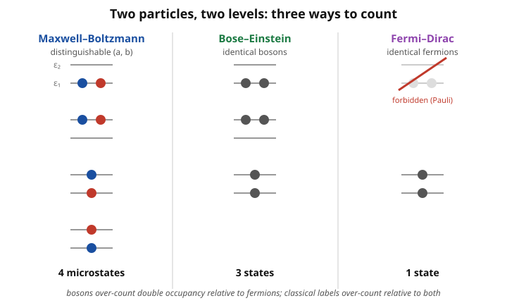

# Statistical Mechanics · Lesson 4.1: Quantum counting and occupation numbers

> ⏱ ~15 min · Module 4: Quantum statistics · Builds on: [3.5 The grand canonical ensemble](#/lesson/stat-mech/03-05-grand-canonical-ensemble.md), [3.2 The partition function](#/lesson/stat-mech/03-02-partition-function.md) · Unlocks: 4.2 Bose–Einstein and Fermi–Dirac distributions

## Why this matters

Everything you built in Module 3 quietly assumed particles carry name tags — "particle 1 here, particle 2 there" — and patched the resulting over-counting with a hand-inserted $1/N!$ (the Gibbs fudge from [1.5](#/lesson/stat-mech/01-05-ideal-gas-sackur-tetrode.md)). That patch is fine for hot, dilute gases and *wrong* for cold, dense ones. When the patch breaks, physics erupts: the Pauli pressure that holds up white dwarfs, the blackbody spectrum, superfluid helium, the electron sea in every metal. This lesson performs the reframe that unlocks all of it — **stop tracking which particle is where, and instead count how many particles sit in each mode** — and sets up the machinery (occupation numbers plus the grand ensemble's factorization) that makes the quantum gases in 4.2–4.5 solvable at all.

## The idea

Each particle in a gas isn't a point — quantum-mechanically it's a fuzzy wavepacket whose size is the **thermal de Broglie wavelength** $\lambda$, roughly the spread of a particle with thermal momentum. Two regimes:

- **Hot / dilute:** $\lambda$ is far smaller than the typical spacing between particles. The wavepackets don't touch, you can (in principle) keep them straight, and classical counting-with-a-$1/N!$-patch works.
- **Cold / dense:** $\lambda$ swells until it's comparable to the interparticle spacing. Now the wavepackets *overlap*, and there is no fact of the matter about which blob is "particle 1." Indistinguishability stops being bookkeeping and becomes physics: the many-body wavefunction must be symmetric (bosons) or antisymmetric (fermions) under swapping any two particles.

The crossover is set by a single dimensionless number, $n\lambda^3$, where $n = N/V$ is the number density. When $n\lambda^3 \ll 1$ the gas is classical; when $n\lambda^3 \gtrsim 1$ it is **quantum degenerate**.

Once labels are meaningless, the honest way to name a many-body state is by **occupation numbers** $\{n_k\}$: for each single-particle mode $k$ (a slot with energy $\epsilon_k$ — a momentum-and-spin state), record *how many* particles occupy it. Not "which," just "how many." The exchange rule from quantum mechanics (see quantum-mechanics [5.1 Identical particles](#/lesson/quantum-mechanics/05-01-identical-particles.md)) then dictates the allowed values:

- **Bosons:** $n_k = 0, 1, 2, \dots$ — pile in as many as you like.
- **Fermions:** $n_k \in \{0, 1\}$ — at most one per slot. *That is Pauli exclusion.*

And here's the master trick, the whole reason [3.5](#/lesson/stat-mech/03-05-grand-canonical-ensemble.md) exists. In the grand canonical ensemble we stop fixing the total particle number and let $\mu$ handle it. That frees the modes from the constraint $\sum_k n_k = N$ that would otherwise chain them together, so each mode fills up *independently* — and the grand partition function factorizes into one tiny, self-contained problem per mode: $\mathcal{Z} = \prod_k \mathcal{Z}_k$.

## The formal version

**Thermal de Broglie wavelength and the degeneracy parameter.**

$$\lambda = \frac{h}{\sqrt{2\pi m k_B T}}, \qquad \text{quantum degeneracy when } \; n\lambda^3 \gtrsim 1,$$

with $h$ Planck's constant, $m$ the particle mass, $T$ temperature, and $n = N/V$ the number density.

*In words:* $\lambda$ is how big a thermal particle's quantum blob is; when the blobs are packed as tightly as $\lambda^3 \sim 1/n$ (one blob per available volume), they overlap and quantum statistics takes over.

**Occupation-number representation.** Fix a complete set of single-particle modes $k = 0, 1, 2, \dots$ with energies $\epsilon_k$. A many-body basis state is specified entirely by the list $\{n_k\}$, and its total energy and particle number are

$$E(\{n_k\}) = \sum_k \epsilon_k\, n_k, \qquad N(\{n_k\}) = \sum_k n_k.$$

*In words:* the whole many-body state is just a tally of how many particles are in each slot; energy and particle number are gotten by summing over slots.

**Allowed occupations (exchange symmetry).**

$$\text{bosons: } n_k \in \{0,1,2,\dots\}, \qquad \text{fermions: } n_k \in \{0,1\}.$$

*In words:* symmetric wavefunctions let any number share a mode; antisymmetric ones forbid two particles in the same mode — the sign under exchange is the entire difference between the two quantum gases.

**Factorization in the grand ensemble.** With grand weight $e^{-\beta(E - \mu N)}$ (from [3.5](#/lesson/stat-mech/03-05-grand-canonical-ensemble.md); $\beta = 1/k_B T$, $\mu$ the chemical potential), sum over *all* occupation configurations:

$$\mathcal{Z} = \sum_{\{n_k\}} e^{-\beta \sum_k (\epsilon_k - \mu) n_k} = \sum_{\{n_k\}} \prod_k e^{-\beta(\epsilon_k - \mu) n_k} = \prod_k \left[ \sum_{n_k} e^{-\beta(\epsilon_k - \mu) n_k} \right] = \prod_k \mathcal{Z}_k.$$

The crucial step is the third equality: because the total-$N$ constraint is gone, each $n_k$ runs over its allowed set *independently of every other*, so a sum of products becomes a product of sums.

*In words:* trading fixed $N$ for fixed $\mu$ unchains the modes, so the grand partition function is a product of independent single-mode factors — each mode is its own miniature grand-canonical system.

**The single-mode partition function.** With fugacity $z = e^{\beta\mu}$, so that $e^{-\beta(\epsilon_k - \mu)} = z\,e^{-\beta\epsilon_k}$:

$$\mathcal{Z}_k^{\text{Bose}} = \sum_{n=0}^{\infty} \left(z e^{-\beta\epsilon_k}\right)^{n} = \frac{1}{1 - z e^{-\beta\epsilon_k}}, \qquad \mathcal{Z}_k^{\text{Fermi}} = \sum_{n=0}^{1} \left(z e^{-\beta\epsilon_k}\right)^{n} = 1 + z e^{-\beta\epsilon_k}.$$

*In words:* the boson factor is a geometric series (any occupation allowed) and the fermion factor is a two-term sum (only $0$ or $1$). The boson series converges only if $z\,e^{-\beta\epsilon_k} < 1$ for every mode, i.e. $\mu < \epsilon_k$ for all $k$ — the chemical potential must sit below the ground-state energy, a constraint with dramatic consequences in [4.5](#/lesson/stat-mech/04-05-ideal-bose-gas-condensation.md). We stop here at the *setup*: extracting the mean occupation $\langle n_k \rangle$ from $\mathcal{Z}_k$ is the opening move of [4.2](#/lesson/stat-mech/04-02-bose-einstein-fermi-dirac.md).

## Picture

Two particles, two levels $\epsilon_1 < \epsilon_2$. Distinguishable labels (a, b) give **4** microstates — the two "split" arrangements are different because you can tell a from b. Identical bosons give **3**: the split arrangement is now a single state, since swapping identical particles changes nothing. Identical fermions give **1**: Pauli forbids both-in-one-level, leaving only the split. Same two particles, same two boxes — three different counts, because *what counts as a distinct state* changed.

## Worked examples

**Example 1 (mechanical — the three counts, and who clusters).** Take the picture's setup: 2 particles, 2 single-particle states. Enumerate.

- **Maxwell–Boltzmann (distinguishable):** each of the 2 labeled particles independently picks a state, $2^2 = 4$ microstates: $\{a,b \text{ both in } 1\}$, $\{$both in $2\}$, $\{a\text{ in }1, b\text{ in }2\}$, $\{a\text{ in }2, b\text{ in }1\}$.
- **Bose–Einstein:** count occupations $(n_1, n_2)$ with $n_1 + n_2 = 2$: $(2,0), (0,2), (1,1)$ — **3** states.
- **Fermi–Dirac:** same, but $n_k \le 1$: only $(1,1)$ survives — **1** state.

Now the payoff. Probability that both particles share a level (assuming equally likely allowed states):

$$P_{\text{same}}^{\text{MB}} = \frac{2}{4} = \tfrac12, \qquad P_{\text{same}}^{\text{BE}} = \frac{2}{3}, \qquad P_{\text{same}}^{\text{FD}} = 0.$$

Bosons are *more* likely to bunch than classical particles ("statistical attraction" — the seed of lasers and condensates); fermions *never* bunch ("statistical repulsion" — the seed of degeneracy pressure). No force is involved; it's pure counting.

**Example 2 (why you'd care — factorization is just the distributive law).** Take two modes with energies $\epsilon_1, \epsilon_2$, and abbreviate $a = z e^{-\beta\epsilon_1}$, $b = z e^{-\beta\epsilon_2}$ (each is the grand weight of putting *one* particle in that mode).

*Fermions.* The allowed configurations $(n_1, n_2)$ and their weights $z^{n_1+n_2}e^{-\beta(\epsilon_1 n_1 + \epsilon_2 n_2)}$:

| $(n_1, n_2)$ | $(0,0)$ | $(1,0)$ | $(0,1)$ | $(1,1)$ |
|---|---|---|---|---|
| weight | $1$ | $a$ | $b$ | $ab$ |

$$\mathcal{Z} = 1 + a + b + ab = (1+a)(1+b) = \mathcal{Z}_1\,\mathcal{Z}_2. \checkmark$$

The factorization is *literally* the distributive law applied to the occupation table — summing over the full grid of $(n_1, n_2)$ is the same as choosing mode 1's occupation and mode 2's occupation independently.

*Bosons.* Now each $n_i$ runs $0 \to \infty$:

$$\mathcal{Z} = \sum_{n_1=0}^{\infty}\sum_{n_2=0}^{\infty} a^{n_1} b^{n_2} = \left(\sum_{n_1} a^{n_1}\right)\!\left(\sum_{n_2} b^{n_2}\right) = \frac{1}{1-a}\cdot\frac{1}{1-b} = \mathcal{Z}_1\,\mathcal{Z}_2. \checkmark$$

Two modes today, $10^{23}$ modes tomorrow — the mechanism is identical, and it only works because the grand ensemble removed the $\sum_k n_k = N$ constraint that would have forbidden choosing each $n_k$ freely.

## Watch out

- **You might think** indistinguishability is *just* the $1/N!$ Gibbs correction from [1.5](#/lesson/stat-mech/01-05-ideal-gas-sackur-tetrode.md). It isn't — $1/N!$ is only the *dilute-limit shadow* of true indistinguishability. It assumes every particle sits in a *different* mode (so there are exactly $N!$ relabelings to divide out); the moment two particles share a mode, $N!$ over-corrects, and only the exact occupation-number counting is right. Quantum statistics *is* the correct counting; $1/N!$ is its $n\lambda^3 \ll 1$ approximation.
- **You might think** the factorization $\mathcal{Z} = \prod_k \mathcal{Z}_k$ also works in the *canonical* ensemble. It does not. Canonical fixes total $N$, which imposes $\sum_k n_k = N$ — a constraint that couples every mode to every other, so the multi-sum will not split. Only the grand ensemble, by trading fixed $N$ for fixed $\mu$, sets the modes free. This is precisely why we needed [3.5](#/lesson/stat-mech/03-05-grand-canonical-ensemble.md) before we could touch quantum gases.
- **You might think** a "mode" $k$ is a particle. A mode is a single-particle *state* — a labeled slot (say, momentum $\mathbf{p}$ and spin) — and $n_k$ is how many particles are in it. Confusing the slot index with a particle index reintroduces exactly the labels we just worked to abolish. The particles have no index; only the slots do.

## One-liner

> Quit asking *which* particle is *where* and ask *how many* sit in each mode; in the grand ensemble the modes decouple, so $\mathcal{Z} = \prod_k \mathcal{Z}_k$ with each factor a one-line geometric (boson) or two-term (fermion) sum.

## Problems

**P1 (🟢)** Two *identical* particles are distributed over **three** single-particle states. Enumerate the allowed many-body states by occupation number $(n_1, n_2, n_3)$ and count them, (a) for bosons and (b) for fermions. (c) For contrast, how many microstates would *distinguishable* particles give? Note which count is largest and say in one line why.

**P2 (🟡)** Compute the degeneracy parameter $n\lambda^3$ and decide whether quantum statistics matters, for two cases. Use $\lambda = h/\sqrt{2\pi m k_B T}$, $h = 6.63\times10^{-34}\,\mathrm{J\,s}$, $k_B = 1.38\times10^{-23}\,\mathrm{J/K}$.
(a) **Air (N$_2$) at STP:** $T = 273\,\mathrm{K}$, number density $n = 2.7\times10^{25}\,\mathrm{m^{-3}}$, molecular mass $m = 4.7\times10^{-26}\,\mathrm{kg}$.
(b) **Conduction electrons in copper:** $T = 300\,\mathrm{K}$, $n = 8.5\times10^{28}\,\mathrm{m^{-3}}$, $m = 9.1\times10^{-31}\,\mathrm{kg}$.
Which system needs Fermi–Dirac statistics, and which is safely classical? Why the enormous difference?

**P3 (🔴, optional)** Starting from the grand weight $e^{-\beta(E-\mu N)}$ with $E = \sum_k \epsilon_k n_k$ and $N = \sum_k n_k$, carefully justify the factorization $\mathcal{Z} = \prod_k \mathcal{Z}_k$ (state exactly where fixing $\mu$ instead of $N$ is used), evaluate $\mathcal{Z}_k$ for bosons and for fermions, and write the grand potential $\Phi = -k_BT\ln\mathcal{Z}$ as a sum over modes for each statistics. (This $\Phi$ is the object 4.4 and 4.5 differentiate to get pressure and particle number.)

Solutions

**P1** (a) **Bosons:** occupations $(n_1,n_2,n_3)$ with $n_1+n_2+n_3 = 2$, each $\ge 0$. Two in one state: $(2,0,0), (0,2,0), (0,0,2)$. One in each of two states: $(1,1,0), (1,0,1), (0,1,1)$. Total $= \mathbf{6}$. (General formula: $\binom{N + M - 1}{N} = \binom{2+3-1}{2} = \binom{4}{2} = 6$, choosing $N=2$ particles among $M=3$ states with repetition.)

(b) **Fermions:** same, but each $n_i \le 1$, so no double occupancy — exactly the "one in each of two states" rows: $(1,1,0), (1,0,1), (0,1,1)$. Total $= \mathbf{3}$ $\big(=\binom{3}{2}$, choosing which 2 of the 3 states are occupied$\big)$.

(c) **Distinguishable:** each of the 2 labeled particles independently picks one of 3 states: $3^2 = \mathbf{9}$. Distinguishable is largest ($9 > 6 > 3$) because labeling counts the two "split" arrangements $a$-here/$b$-there and $a$-there/$b$-here as distinct; identical counting collapses each such pair to one, and Pauli then deletes the double-occupancy states entirely.

**P2** Compute $\lambda = h/\sqrt{2\pi m k_B T}$, then $n\lambda^3$.

(a) **Air.** $2\pi m k_B T = 2\pi (4.7\times10^{-26})(1.38\times10^{-23})(273) = 1.10\times10^{-45}$, so $\sqrt{\cdots} = 3.32\times10^{-23}$ and

$$\lambda = \frac{6.63\times10^{-34}}{3.32\times10^{-23}} = 2.0\times10^{-11}\,\mathrm{m} \approx 0.02\,\mathrm{nm}.$$

Then $\lambda^3 = 8.0\times10^{-33}\,\mathrm{m^3}$ and $n\lambda^3 = (2.7\times10^{25})(8.0\times10^{-33}) \approx 2\times10^{-7}$. Deeply classical — the $1/N!$ patch is all you need.

(b) **Electrons.** $2\pi m k_B T = 2\pi(9.1\times10^{-31})(1.38\times10^{-23})(300) = 2.37\times10^{-50}$, so $\sqrt{\cdots} = 1.54\times10^{-25}$ and

$$\lambda = \frac{6.63\times10^{-34}}{1.54\times10^{-25}} = 4.3\times10^{-9}\,\mathrm{m} \approx 4.3\,\mathrm{nm}.$$

Then $\lambda^3 = 8.0\times10^{-26}\,\mathrm{m^3}$ and $n\lambda^3 = (8.5\times10^{28})(8.0\times10^{-26}) \approx 7\times10^{3}$.

**Verdict:** electrons in copper have $n\lambda^3 \sim 10^{3}$–$10^{4} \gg 1$ — a *strongly degenerate* Fermi gas requiring Fermi–Dirac statistics at all everyday temperatures; air has $n\lambda^3 \sim 10^{-7} \ll 1$ and is safely classical. The gulf comes from two factors, both in $\lambda \propto 1/\sqrt{m}$ and packing: electrons are $\sim 10^{4}\times$ lighter than an N$_2$ molecule (bigger $\lambda$) *and* $\sim 10^{3}\times$ denser in a metal (smaller spacing). The electron blob ($4.3\,$nm) dwarfs its $\sim 0.23\,$nm interparticle spacing; the air blob ($0.02\,$nm) is $\sim 200\times$ smaller than its spacing. This is why metals need quantum statistics (lesson 4.4) while the air you breathe obeys the classical ideal gas.

**P3** Write $E - \mu N = \sum_k (\epsilon_k - \mu) n_k$. The grand partition function sums over all occupation configurations:

$$\mathcal{Z} = \sum_{\{n_k\}} e^{-\beta \sum_k (\epsilon_k - \mu)n_k} = \sum_{\{n_k\}} \prod_k e^{-\beta(\epsilon_k-\mu)n_k}.$$

**Where fixing $\mu$ matters:** the outer sum is over *all* lists $\{n_k\}$ with **no** constraint linking them — because in the grand ensemble the total number $N = \sum_k n_k$ is free (it is $\mu$, not a fixed $N$, that is held constant). Had we fixed $N$ (canonical), the sum would be restricted to lists with $\sum_k n_k = N$, coupling the modes, and the step below would fail. Unconstrained, each $n_k$ ranges over its allowed set independently, so the sum of a product becomes a product of sums:

$$\mathcal{Z} = \prod_k \left( \sum_{n_k} e^{-\beta(\epsilon_k-\mu)n_k} \right) = \prod_k \mathcal{Z}_k.$$

Evaluate each factor (let $x_k = e^{-\beta(\epsilon_k-\mu)}$):

$$\mathcal{Z}_k^{\text{Bose}} = \sum_{n=0}^\infty x_k^{\,n} = \frac{1}{1-x_k} = \frac{1}{1 - e^{-\beta(\epsilon_k-\mu)}} \quad(\text{needs } \mu < \epsilon_k), \qquad \mathcal{Z}_k^{\text{Fermi}} = \sum_{n=0}^{1} x_k^{\,n} = 1 + e^{-\beta(\epsilon_k-\mu)}.$$

Grand potential $\Phi = -k_BT\ln\mathcal{Z} = -k_BT\sum_k \ln\mathcal{Z}_k$ (the log turns the product into a sum — the grand potential is *additive over modes*):

$$\Phi_{\text{Bose}} = +k_BT \sum_k \ln\!\left(1 - e^{-\beta(\epsilon_k-\mu)}\right), \qquad \Phi_{\text{Fermi}} = -k_BT \sum_k \ln\!\left(1 + e^{-\beta(\epsilon_k-\mu)}\right).$$

Compactly, $\Phi = \pm k_BT\sum_k \ln\!\left(1 \mp e^{-\beta(\epsilon_k-\mu)}\right)$ with the upper sign for bosons, lower for fermions. Differentiating this $\Phi$ with respect to $\mu$ gives $\langle N\rangle$ and hence $\langle n_k\rangle$ (lesson 4.2); with respect to $V$ it gives the pressure (lessons 4.3–4.5).

## Flashback

**From Lesson 1.5 (The ideal gas and the Gibbs paradox):** Two containers each hold $N$ atoms of the *same* ideal gas at the same $T$ and pressure, in volume $V$; a partition between them is removed so the combined gas fills $2V$. (a) If you (wrongly) treat the atoms as distinguishable, what mixing entropy $\Delta S$ does naive counting predict, and why is that answer absurd? (b) Explain how the indistinguishability factor $1/N!$ in the partition function fixes it, giving $\Delta S = 0$ for identical gases. One line: how does this relate to today's lesson?

Solution

(a) Naive (distinguishable) counting says each gas of $N$ atoms expands from $V$ to $2V$, and each atom's accessible volume doubles, so

$$\Delta S_{\text{naive}} = 2 \times N k_B \ln\frac{2V}{V} = 2N k_B \ln 2 > 0.$$

This is absurd: removing a partition between two halves of the *same* gas at the same $T$ and pressure changes nothing measurable — reinsert the partition and you are exactly back where you started. Entropy is a state function, so a reversible do-nothing operation cannot have raised it. Predicting $\Delta S > 0$ for combining identical gases is the **Gibbs paradox**.

(b) The $1/N!$ makes the entropy *extensive*: with it, the Sackur–Tetrode entropy depends on $V$ only through the intensive ratio $V/N$, so $S(2N, 2V, T) = 2\,S(N,V,T)$ exactly. Then

$$\Delta S = S(2N, 2V, T) - 2\,S(N, V, T) = 0.$$

(Genuinely *different* gases still mix with $\Delta S = 2Nk_B\ln 2 > 0$, because interchanging an $A$ atom with a $B$ atom *is* a new microstate — correctly.) 

**Link to today:** that $1/N!$ is the dilute-gas shadow of full quantum indistinguishability. When $n\lambda^3 \ll 1$ almost every atom occupies a distinct mode, so dividing by the $N!$ relabelings is exactly right — and today's occupation-number counting is the exact statement that $1/N!$ only approximates.

## Connections

- **Backward:** this is [3.5](#/lesson/stat-mech/03-05-grand-canonical-ensemble.md) cashing in — the grand ensemble was built precisely so that dropping the fixed-$N$ constraint would let $\mathcal{Z} = \prod_k \mathcal{Z}_k$ factorize; and the $1/N!$ of [1.5](#/lesson/stat-mech/01-05-ideal-gas-sackur-tetrode.md) is revealed as the $n\lambda^3\ll1$ limit of the exact counting here.
- **Forward:** [4.2](#/lesson/stat-mech/04-02-bose-einstein-fermi-dirac.md) differentiates each $\mathcal{Z}_k$ to get the mean occupations $\langle n_k\rangle = 1/\big(e^{\beta(\epsilon_k-\mu)} \mp 1\big)$ (the Bose–Einstein and Fermi–Dirac distributions); those feed the photon gas ([4.3](#/lesson/stat-mech/04-03-photon-gas-blackbody.md)), the electron degeneracy pressure of metals and white dwarfs ([4.4](#/lesson/stat-mech/04-04-ideal-fermi-gas.md)), and Bose–Einstein condensation ([4.5](#/lesson/stat-mech/04-05-ideal-bose-gas-condensation.md)).
- **Sideways (quantum mechanics):** the boson/fermion split is the physical input imported wholesale from exchange symmetry — symmetric vs antisymmetric many-body wavefunctions in quantum-mechanics [5.1 Identical particles](#/lesson/quantum-mechanics/05-01-identical-particles.md). The bridge worth naming: **Pauli exclusion $\leftrightarrow$ fermion $n_k\in\{0,1\}$ $\leftrightarrow$ electron degeneracy pressure holding up white dwarfs** — one antisymmetry, felt from atomic shells to stellar remnants.
