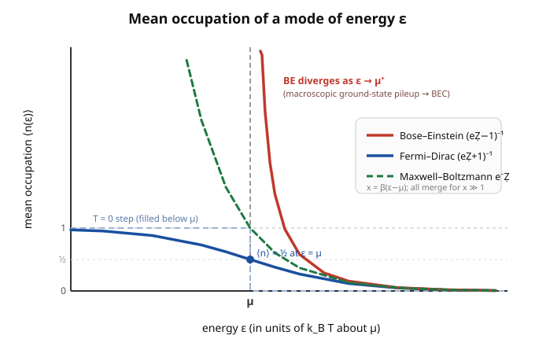

# Statistical Mechanics · Lesson 4.2: Bose–Einstein and Fermi–Dirac distributions

> ⏱ ~15 min · Module 4: Quantum statistics · Builds on: [4.1 Quantum counting and occupation numbers](#/lesson/stat-mech/04-01-quantum-counting-occupation-numbers.md), [3.5 The grand canonical ensemble](#/lesson/stat-mech/03-05-grand-canonical-ensemble.md) · Unlocks: 4.3 Photon gas & blackbody radiation, 4.4 The ideal Fermi gas

## Why this matters

Two formulas, one sign difference, and almost all of low-temperature and high-density physics falls out. Whether a metal conducts, why a white dwarf doesn't collapse, why liquid helium becomes a superfluid, what color a hot object glows — every one of these is decided by *how many indistinguishable particles are allowed to share a single quantum state*. Fermions refuse to share (at most one per state); bosons love to pile in. This lesson turns that one rule into the two occupation formulas that Module 4 spends the rest of its life applying, and shows that both quietly reduce to the familiar Boltzmann factor the moment the gas gets dilute — so classical statistics was a limiting case all along.

## The idea

In [4.1](#/lesson/stat-mech/04-01-quantum-counting-occupation-numbers.md) you stopped tracking "which particle is where" and started tracking the only thing that is physically real for indistinguishable particles: the **occupation number** $n_k$, how many particles sit in single-particle mode $k$. The masterstroke was that in the grand canonical ensemble the modes are *independent* — each mode is its own tiny system, free to exchange particles with the reservoir at chemical potential $\mu$, and the whole grand partition function factorizes, $\mathcal Z = \prod_k \mathcal Z_k$. So the entire problem shrinks to one question asked of a **single mode**: on average, how many particles live here?

The answer depends on just one thing — the list of allowed values of $n_k$. Fermions permit only $n_k \in \{0,1\}$ (Pauli exclusion). Bosons permit $n_k \in \{0,1,2,\dots\}$ (no limit). Sum a two-term list versus sum an infinite geometric list, take a derivative, and out drop two occupation curves that differ only by a $\pm$. That is the whole lesson: **the statistics of a gas is set by whether one number stops at 1 or runs to infinity.**

## The formal version

A single mode of energy $\epsilon$ is a grand-canonical subsystem. If it holds $n$ particles it has energy $n\epsilon$ and particle number $n$, so its Boltzmann–Gibbs weight is $e^{-\beta(n\epsilon - \mu n)} = e^{-\beta(\epsilon-\mu)n}$, where $\beta = 1/k_B T$. Write $x \equiv \beta(\epsilon - \mu)$ to keep the algebra clean. The single-mode grand partition function and mean occupation are

$$\mathcal Z_k = \sum_{n} e^{-x n}, \qquad \langle n\rangle = \frac{1}{\mathcal Z_k}\sum_n n\, e^{-xn} = -\frac{\partial \ln \mathcal Z_k}{\partial x}.$$

*In words:* build the sum over allowed occupations, then differentiate its log — the same $-\partial_\beta \ln Z$ trick from [3.2](#/lesson/stat-mech/03-02-partition-function.md), now pulling down $n$ instead of energy. (Equivalently $\langle n\rangle = k_B T\,\partial_\mu \ln\mathcal Z_k$; the reservoir derivative from [3.5](#/lesson/stat-mech/03-05-grand-canonical-ensemble.md).)

**Fermions** ($n \in \{0,1\}$): the sum has two terms,

$$\mathcal Z_k = 1 + e^{-x} \;\Rightarrow\; \boxed{\;\langle n\rangle = \frac{1}{e^{\beta(\epsilon-\mu)}+1}\;}\quad\text{(Fermi–Dirac).}$$

*In words:* occupancy runs smoothly between $1$ (deep below $\mu$) and $0$ (far above), crossing exactly $\tfrac12$ at $\epsilon=\mu$.

**Bosons** ($n = 0,1,2,\dots$): the sum is geometric, $\sum_{n=0}^\infty (e^{-x})^n = \dfrac{1}{1-e^{-x}}$, which **converges only if $e^{-x}<1$, i.e. $x>0$, i.e. $\epsilon>\mu$**. So for bosons $\mu$ must lie *below the lowest single-particle level* — otherwise a mode would want infinitely many particles. Then

$$\mathcal Z_k = \frac{1}{1-e^{-x}} \;\Rightarrow\; \boxed{\;\langle n\rangle = \frac{1}{e^{\beta(\epsilon-\mu)}-1}\;}\quad\text{(Bose–Einstein).}$$

**The unified statement.** Both are the same formula with a sign:

$$\langle n(\epsilon)\rangle = \frac{1}{e^{\beta(\epsilon-\mu)} \mp 1}, \qquad \begin{cases}-\ \text{(upper): Bose–Einstein}\\[2pt] +\ \text{(lower): Fermi–Dirac}\end{cases}$$

*In words:* subtract $1$ and bosons bunch; add $1$ and fermions exclude.

**The classical (Maxwell–Boltzmann) limit.** When $e^{\beta(\epsilon-\mu)} \gg 1$ — which happens at low density / high temperature, where $\mu$ sits far below every occupied level so occupations are tiny — the $\mp 1$ is negligible next to the exponential, and *both* collapse to

$$\langle n(\epsilon)\rangle \approx e^{-\beta(\epsilon-\mu)} = e^{\beta\mu}\,e^{-\beta\epsilon}.$$

That is precisely the Boltzmann factor $e^{-\beta\epsilon}$ (times the fugacity $z=e^{\beta\mu}$) from the canonical ensemble. *Classical statistics is the dilute corner of quantum statistics* — the regime where states are so sparsely occupied that "can two particles share?" never comes up.

**Two limits worth reading off the formulas.** As $T\to 0$ ($\beta\to\infty$), Fermi–Dirac becomes a **step**: $\langle n\rangle = 1$ for $\epsilon<\mu$ and $0$ for $\epsilon>\mu$. Every state below $\mu \equiv E_F$ (the **Fermi energy**) is filled, every state above is empty — a sharp Fermi surface, smeared into a soft edge of width $\sim k_B T$ at finite $T$. Meanwhile Bose–Einstein **diverges** as $\epsilon\to\mu^+$: the mode nearest $\mu$ can absorb a macroscopic number of particles — the seed of Bose–Einstein condensation ([4.5](#/lesson/stat-mech/04-05-ideal-bose-gas-condensation.md)).

**From modes to numbers: the density of states.** To get the total particle number $N$ or energy $E$ we must sum $\langle n\rangle$ over *all* modes. For a gas in a large box the levels are so dense they form a continuum, and the sum becomes an integral weighted by the **density of states** $g(\epsilon)$ — the number of single-particle modes per unit energy. For a 3D free gas of particles of mass $m$ in volume $V$ (spin degeneracy $g_s$),

$$g(\epsilon) = \frac{g_s\,V}{4\pi^2}\left(\frac{2m}{\hbar^2}\right)^{3/2}\epsilon^{1/2} \;\propto\; V\,\epsilon^{1/2},$$

so that

$$N = \int_0^\infty g(\epsilon)\,\langle n(\epsilon)\rangle\,d\epsilon, \qquad E = \int_0^\infty \epsilon\, g(\epsilon)\,\langle n(\epsilon)\rangle\,d\epsilon.$$

*In words:* the $\epsilon^{1/2}$ counts how phase-space volume grows with energy (a sphere of radius $p\propto\sqrt\epsilon$ in momentum space); multiply by how full each level is and integrate. Every quantitative result in 4.3–4.5 is one of these two integrals with the right sign in $\langle n\rangle$.

## Picture

Three curves, one axis. **Fermi–Dirac** (blue) descends smoothly through $\tfrac12$ at $\epsilon=\mu$ and would stiffen into the pale step at $T=0$. **Bose–Einstein** (red) shoots up without bound as $\epsilon\to\mu^+$ and is undefined for $\epsilon<\mu$. **Maxwell–Boltzmann** (green dashed) is a pure exponential. On the right, where $\epsilon-\mu \gg k_B T$, all three lie on top of each other — the classical limit made visible.

## Worked examples

**Example 1 (mechanical — occupations side by side).** Take a mode at $\epsilon-\mu = k_B T$, i.e. $x=1$, so $e^{x}=e\approx 2.718$:

$$\langle n\rangle_{\text{BE}} = \frac{1}{e-1}=0.582,\quad \langle n\rangle_{\text{MB}} = e^{-1}=0.368,\quad \langle n\rangle_{\text{FD}} = \frac{1}{e+1}=0.269.$$

Bosons overshoot the classical value, fermions undershoot it — the $\mp1$ pulling in opposite directions, exactly as the picture shows. Now push to $x=5$ ($e^5\approx 148$): the three read $0.00680,\ 0.00674,\ 0.00668$ — indistinguishable to three digits. The dilute tail *is* classical. And at $x\to 0^+$ the fermion mode saturates toward $\tfrac12$ while the boson mode blows up, $\langle n\rangle_{\text{BE}}\approx 1/x \to\infty$ — the two temperaments could not be more different near $\mu$.

**Example 2 (why you'd care — the zero-temperature Fermi sea).** At $T=0$ the Fermi factor is the step $\langle n\rangle = 1$ for $\epsilon<E_F$, else $0$, so both integrals truncate at $E_F$. Using $g(\epsilon)=\alpha V\epsilon^{1/2}$,

$$N = \alpha V\!\int_0^{E_F}\!\!\epsilon^{1/2}d\epsilon = \tfrac{2}{3}\alpha V E_F^{3/2}, \qquad E = \alpha V\!\int_0^{E_F}\!\!\epsilon^{3/2}d\epsilon = \tfrac{2}{5}\alpha V E_F^{5/2}.$$

Divide: $\dfrac{E}{N} = \dfrac{2/5}{2/3}\,E_F = \dfrac{3}{5}E_F$. So a fermion gas at absolute zero still carries energy $E = \tfrac{3}{5}NE_F$ — it *cannot* sit at rest, because Pauli exclusion forces most electrons into high-energy states no matter how cold it gets. That irreducible zero-point energy is what pushes back when you try to compress the gas, i.e. **degeneracy pressure** — the force holding up white dwarfs ([4.4](#/lesson/stat-mech/04-04-ideal-fermi-gas.md)). The Bose gas does the opposite: at low $T$ its particles avalanche into the single ground state instead.

## Watch out

- You might think $\mu$ is "the energy of the topmost particle." For fermions at $T=0$ that happens to be true ($\mu=E_F$), but in general $\mu$ is the reservoir's *marginal energy cost per particle*, and for bosons it must sit **below every level** ($\mu<\epsilon_{\min}$) or Bose–Einstein returns a negative or infinite occupation — a signal you have crossed into condensation, not a formula to evaluate blindly.
- You might read the classical limit as "high temperature always." It is really $e^{\beta(\epsilon-\mu)}\gg 1$, i.e. $z=e^{\beta\mu}\ll 1$ — *low occupation*. Raising $T$ helps, but so does lowering density; a dense gas can stay quantum-degenerate even when hot (electrons in a metal, $T_F\sim 10^4$–$10^5$ K).
- You might expect Fermi–Dirac to diverge somewhere the way Bose–Einstein does. It never can: $\langle n\rangle_{\text{FD}}\in[0,1]$ for every $\epsilon,\mu,T$, because the denominator $e^{x}+1\ge 1$. Adding $1$ is what enforces "at most one per state."

## One-liner

> Fermions add one and cap at a filled step; bosons subtract one and pile up without bound; dilute both and the $\mp 1$ vanishes, leaving the plain Boltzmann factor.

## Problems

**P1 (🟢)** Consider a fermionic mode of energy $\epsilon$. (a) Show directly that $\langle n\rangle = \tfrac12$ when $\epsilon=\mu$, at any temperature. (b) Evaluate $\langle n\rangle$ at $\epsilon-\mu = -k_BT,\ 0,\ +k_BT$ and confirm the values are symmetric about $\tfrac12$. (c) In the $T\to 0$ limit, what does $\langle n\rangle$ become for $\epsilon<\mu$ and for $\epsilon>\mu$, and roughly how wide (in energy) is the smeared region at finite $T$?

**P2 (🟡)** Show that both $\langle n\rangle = 1/(e^{\beta(\epsilon-\mu)}\mp 1)$ reduce to the same Maxwell–Boltzmann form $z\,e^{-\beta\epsilon}$ when the occupation is small, and state the precise condition on $z=e^{\beta\mu}$ (or equivalently on density and temperature) for this limit to hold. Why do the two curves approach from *opposite* sides?

**P3 (🔴, optional)** For the ideal Fermi gas at $T=0$ with density of states $g(\epsilon)=\alpha V\epsilon^{1/2}$: (a) fix $E_F$ by requiring the filled states to hold exactly $N$ particles, and show $E_F \propto (N/V)^{2/3}$. (b) For electrons ($g_s=2$, so $\alpha = \frac{1}{2\pi^2}(2m/\hbar^2)^{3/2}$) write the exact prefactor. This is the setup for degeneracy pressure in [4.4](#/lesson/stat-mech/04-04-ideal-fermi-gas.md).

Solutions

**P1** (a) At $\epsilon=\mu$, $\beta(\epsilon-\mu)=0$, so $\langle n\rangle = 1/(e^0+1)=1/(1+1)=\tfrac12$ — independent of $\beta$, hence of $T$. The half-filling point is pinned to $\mu$ at every temperature.

(b) Let $x=\beta(\epsilon-\mu)$.
- $x=-1$: $\langle n\rangle = 1/(e^{-1}+1)=1/(0.3679+1)=0.731$.
- $x=0$: $0.500$.
- $x=+1$: $1/(e+1)=0.269$.

Symmetry check: $0.731+0.269 = 1.000$. Indeed $\langle n(x)\rangle + \langle n(-x)\rangle = \frac{1}{e^{x}+1}+\frac{1}{e^{-x}+1}$; multiply the second term top and bottom by $e^{x}$ to get $\frac{e^{x}}{e^{x}+1}$, and the two sum to $\frac{1+e^{x}}{e^{x}+1}=1$. So the curve is antisymmetric about the point $(\mu,\tfrac12)$.

(c) As $T\to 0$, $\beta\to\infty$: for $\epsilon<\mu$, $x\to-\infty$, $e^{x}\to 0$, $\langle n\rangle\to 1$ (filled); for $\epsilon>\mu$, $x\to+\infty$, $\langle n\rangle\to 0$ (empty). The transition from $\approx 0.73$ to $\approx 0.27$ happens over $x$ from $-1$ to $+1$, i.e. an energy window of order $k_B T$ wide centered on $\mu$. Cold gas ⇒ knife-edge Fermi surface; warm gas ⇒ edge blurred by $\sim k_B T$.

**P2** Write $\langle n\rangle = \dfrac{1}{e^{\beta(\epsilon-\mu)}\mp 1} = \dfrac{e^{-\beta(\epsilon-\mu)}}{1 \mp e^{-\beta(\epsilon-\mu)}} = \dfrac{z\,e^{-\beta\epsilon}}{1\mp z\,e^{-\beta\epsilon}}$ with $z=e^{\beta\mu}$. When $z\,e^{-\beta\epsilon}\ll 1$ for all occupied $\epsilon$ — i.e. when the occupation is everywhere tiny — the denominator is $1$ to leading order and

$$\langle n\rangle \approx z\,e^{-\beta\epsilon} = e^{-\beta(\epsilon-\mu)},$$

identical for both signs. Expanding the denominator, $\langle n\rangle \approx z e^{-\beta\epsilon}(1\pm z e^{-\beta\epsilon})$: bosons get a **$+$** correction (a little *more* than classical — bunching), fermions a **$-$** correction (a little *less* — exclusion), so they approach the Boltzmann curve from opposite sides, exactly as Example 1's numbers ($0.582$ vs $0.269$ around $0.368$) show. The condition $z\ll 1$ means fugacity small, equivalently the phase-space density $n\lambda_T^3\ll 1$ (few particles per thermal-wavelength volume): dilute and/or hot. Quantum statistics matters precisely when this fails.

**P3** (a) At $T=0$ every state up to $E_F$ is singly filled and none above, so

$$N = \int_0^{E_F} g(\epsilon)\,d\epsilon = \alpha V\int_0^{E_F}\epsilon^{1/2}\,d\epsilon = \alpha V\cdot\frac{2}{3}E_F^{3/2}.$$

Solve: $E_F^{3/2} = \dfrac{3N}{2\alpha V}$, hence

$$E_F = \left(\frac{3N}{2\alpha V}\right)^{2/3} \propto \left(\frac{N}{V}\right)^{2/3}.$$

Denser gas ⇒ higher Fermi energy: squeezing electrons closer forces them into higher-momentum states (the $\tfrac23$ power is the 3D phase-space scaling).

(b) With $\alpha = \dfrac{1}{2\pi^2}\left(\dfrac{2m}{\hbar^2}\right)^{3/2}$,

$$E_F = \left(\frac{3N}{2V}\cdot 2\pi^2\left(\frac{\hbar^2}{2m}\right)^{3/2}\right)^{2/3} = \frac{\hbar^2}{2m}\left(3\pi^2\,\frac{N}{V}\right)^{2/3}.$$

This is the standard free-electron Fermi energy; combined with $E=\tfrac35 NE_F$ from Example 2 it gives the $T=0$ pressure $P = \tfrac{2}{5}\dfrac{N}{V}E_F \propto (N/V)^{5/3}$ that supports white dwarfs in [4.4](#/lesson/stat-mech/04-04-ideal-fermi-gas.md).

## Flashback

**From Lesson 4.1 (Quantum counting and occupation numbers):** For a *single fermionic mode*, starting only from its grand partition function $\mathcal Z_k = 1 + e^{-\beta(\epsilon-\mu)}$, compute the probability $P(n{=}1)$ that the mode is occupied and the variance $\mathrm{Var}(n)$ of its occupation. Express both in terms of $\langle n\rangle$.

Solution

The mode has just two states: $n=0$ with weight $1$ and $n=1$ with weight $e^{-x}$ ($x=\beta(\epsilon-\mu)$). So

$$P(n{=}1) = \frac{e^{-x}}{1+e^{-x}} = \frac{1}{e^{x}+1} = \langle n\rangle,$$

which is the Fermi–Dirac factor itself — for a two-state mode the occupancy *is* the "on" probability. For the variance, note $n\in\{0,1\}$ means $n^2=n$, so $\langle n^2\rangle = \langle n\rangle$ and

$$\mathrm{Var}(n) = \langle n^2\rangle - \langle n\rangle^2 = \langle n\rangle - \langle n\rangle^2 = \langle n\rangle\,(1-\langle n\rangle).$$

This is the Bernoulli variance: maximal ($=\tfrac14$) at half-filling $\langle n\rangle=\tfrac12$ (i.e. $\epsilon=\mu$), and vanishing when the mode is certainly empty or certainly full — fluctuations die out deep inside or far outside the Fermi sea, and are loudest right at the surface.

## Connections

- **Backward:** the single-mode $\mathcal Z_k$ and the occupation-number viewpoint come straight from [4.1](#/lesson/stat-mech/04-01-quantum-counting-occupation-numbers.md); the derivative trick $\langle n\rangle = k_BT\,\partial_\mu\ln\mathcal Z_k$ is the grand-canonical machinery of [3.5](#/lesson/stat-mech/03-05-grand-canonical-ensemble.md). The boson geometric series is the same sum that gave the harmonic-oscillator partition function in Module 3.
- **Forward:** set $\mu=0$ in Bose–Einstein and you get the Planck distribution of the photon gas ([4.3](#/lesson/stat-mech/04-03-photon-gas-blackbody.md)); integrate Fermi–Dirac against $g(\epsilon)$ for degeneracy pressure and the Sommerfeld expansion ([4.4](#/lesson/stat-mech/04-04-ideal-fermi-gas.md)); track the Bose divergence at $\epsilon\to\mu$ to the condensation transition ([4.5](#/lesson/stat-mech/04-05-ideal-bose-gas-condensation.md)).
- **Sideways (quantum mechanics):** the split $n\in\{0,1\}$ vs $n\in\{0,1,2,\dots\}$ is the statistical shadow of wavefunction symmetry — antisymmetric (fermions, Pauli exclusion) vs symmetric (bosons) — developed in `quantum-mechanics` [identical particles](#/lesson/quantum-mechanics/05-01-identical-particles.md). Statistical mechanics is where that symmetry becomes thermodynamics.
