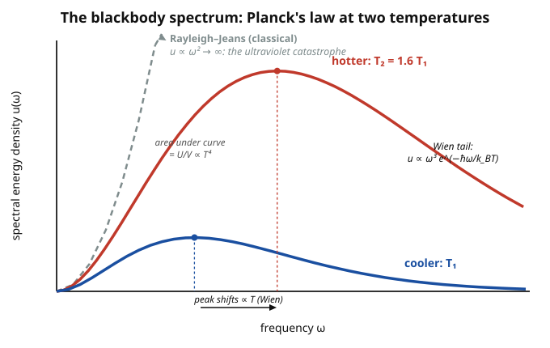

# Statistical Mechanics · Lesson 4.3: The photon gas and blackbody radiation

> ⏱ ~15 min · Module 4: Quantum statistics · Builds on: [4.1 Quantum counting](#/lesson/stat-mech/04-01-quantum-counting-occupation-numbers.md), [4.2 Bose–Einstein & Fermi–Dirac](#/lesson/stat-mech/04-02-bose-einstein-fermi-dirac.md) · Unlocks: 4.4 The ideal Fermi gas (degeneracy pressure, white dwarfs)

## Why this matters

Heat any object and it glows — a stove burner, molten iron, the Sun, the whole early universe. That glow is electromagnetic radiation in thermal equilibrium, and explaining its spectrum broke classical physics. The classical prediction diverges: it says a warm cavity holds *infinite* energy (the "ultraviolet catastrophe"). Planck's fix in 1900 — that energy comes in quanta $\hbar\omega$ — was the first crack of quantum theory, and it falls straight out of the Bose–Einstein machinery you just built. The payoff is enormous: the same law gives you the color of a star from its temperature, and it is the exact spectrum of the cosmic microwave background, the oldest light in existence.

## The idea

Trap radiation in a hot box. The walls constantly emit and absorb photons, so in equilibrium the box is filled with a **gas of photons** — massless particles, each carrying energy $\varepsilon = \hbar\omega$ and moving at speed $c$.

Two features make this gas special, and both simplify the problem:

1. **Photon number is not conserved.** A wall can absorb one photon and spit out three; nothing forbids it. The gas settles $N$ to whatever minimizes the free energy. Minimizing $F$ over $N$ means $\partial F/\partial N = 0$, and since $\partial F/\partial N = \mu$, the chemical potential of a photon gas is exactly **zero**. You get quantum statistics for free with $\mu = 0$.
2. **Photons are bosons** (spin 1), so any number can pile into the same mode. The average number of photons in a mode of frequency $\omega$ is the Bose–Einstein occupation from [4.2](#/lesson/stat-mech/04-02-bose-einstein-fermi-dirac.md), with $\mu$ set to zero.

Everything else is bookkeeping: count how many modes the box has at each frequency, multiply by the average energy per mode, and you have the spectrum. Do that count classically (each mode gets $k_B T$) and the answer explodes. Do it with Bose–Einstein and high-frequency modes *freeze out* — the explosion is cured.

## The formal version

**Chemical potential.** Because $N$ is free, equilibrium fixes
$$\mu = \left(\frac{\partial F}{\partial N}\right)_{T,V} = 0.$$
In words: photons cost nothing to create, so their chemical potential vanishes.

**Occupation per mode.** Bose–Einstein with $\mu = 0$:
$$\langle n(\omega)\rangle = \frac{1}{e^{\beta\hbar\omega} - 1}, \qquad \beta = \frac{1}{k_B T}.$$
In words: the average number of photons sharing a given mode, set purely by how $\hbar\omega$ compares to $k_B T$.

**Density of modes.** Standing electromagnetic waves in a cubic box of side $L$ have wavevectors $\mathbf{k} = (\pi/L)(n_x, n_y, n_z)$ with positive integers $n_i$, and dispersion $\omega = ck$. Counting these (see Example 1) and including the **factor 2 for the two polarizations** of light gives the number of modes with frequency in $[\omega, \omega+d\omega]$:
$$g(\omega)\,d\omega = \frac{V}{\pi^2 c^3}\,\omega^2\,d\omega, \qquad V = L^3.$$
In words: mode count grows like $\omega^2$ — there are vastly more high-frequency modes than low ones (this $\omega^2$ is the seed of the catastrophe).

**Planck's law.** Energy per unit volume per unit frequency is (energy $\hbar\omega$) $\times$ (occupation) $\times$ (mode density per volume):
$$\boxed{\,u(\omega) = \frac{\hbar}{\pi^2 c^3}\,\frac{\omega^3}{e^{\beta\hbar\omega} - 1}\,}$$
In words: the blackbody spectrum. Total energy density is $U/V = \int_0^\infty u(\omega)\,d\omega$.

**Two limits.** Let $x = \beta\hbar\omega = \hbar\omega/k_B T$.
- **Low frequency** ($x \ll 1$): $e^x - 1 \approx x$, so
$$u(\omega) \approx \frac{k_B T}{\pi^2 c^3}\,\omega^2 \quad\text{(Rayleigh–Jeans)}.$$
This is the *classical* answer — each mode carrying $k_B T$ by equipartition ([3.4](#/lesson/stat-mech/03-04-equipartition-theorem.md)). It has no peak and its integral diverges: the **ultraviolet catastrophe**.
- **High frequency** ($x \gg 1$): $e^x - 1 \approx e^x$, so
$$u(\omega) \approx \frac{\hbar}{\pi^2 c^3}\,\omega^3\,e^{-\hbar\omega/k_B T} \quad\text{(Wien tail)}.$$
The exponential kills the $\omega^3$ growth. Quantization means a mode with $\hbar\omega \gg k_B T$ is almost never excited — it freezes out. That is what tames the divergence.

**Stefan–Boltzmann law.** Integrating Planck (Problem 2), using $\int_0^\infty \frac{x^3}{e^x-1}\,dx = \frac{\pi^4}{15}$:
$$\frac{U}{V} = a\,T^4, \qquad a = \frac{\pi^2 k_B^4}{15\,\hbar^3 c^3}.$$
In words: total radiated energy density scales as $T^4$ — double the temperature, sixteenfold the energy.

**Wien displacement law.** The peak of $u(\omega)$ sits at fixed $x = \hbar\omega_{\max}/k_B T \approx 2.821$, so
$$\omega_{\max} \propto T.$$
In words: hotter bodies glow bluer; the whole spectrum slides up in frequency in proportion to $T$.

**Radiation pressure.** Because each photon has $\varepsilon = pc$ (ultrarelativistic), the momentum flux gives
$$P = \frac{U}{3V} = \frac{a}{3}\,T^4.$$
In words: radiation pushes on its container with a pressure equal to one-third of its energy density — a factor $1/3$ instead of the $2/3$ of a nonrelativistic gas, precisely because $\varepsilon \propto p$ rather than $p^2$.

## Picture

Each curve rises as $\omega^2$ (tracking the dashed classical line), peaks, then dies exponentially (Wien tail). The classical Rayleigh–Jeans curve *never* turns over — it follows the low-$\omega$ rise and shoots to infinity. Raising $T$ lifts the peak and slides it right ($\omega_{\max}\propto T$, Wien), and the total area — the energy density — grows as $T^4$ (Stefan–Boltzmann).

## Worked examples

**Example 1 (mechanical — deriving $g(\omega)$).** Count standing-wave modes with $|\mathbf{k}| \le k$. Allowed $\mathbf{k}$ sit on a lattice of spacing $\pi/L$ in the positive octant ($n_i > 0$), so each mode occupies volume $(\pi/L)^3$ in $k$-space. The number inside a sphere of radius $k$, keeping only the positive octant (factor $1/8$) and doubling for polarization, is
$$N(k) = 2 \cdot \frac{1}{8}\cdot\frac{\tfrac{4}{3}\pi k^3}{(\pi/L)^3} = \frac{V k^3}{3\pi^2}.$$
Differentiate and use $k = \omega/c$, $dk = d\omega/c$:
$$g(\omega)\,d\omega = \frac{dN}{dk}\,dk = \frac{V k^2}{\pi^2}\cdot\frac{d\omega}{c} = \frac{V}{\pi^2 c^3}\,\omega^2\,d\omega.$$ ✓
The whole spectrum hangs on this $\omega^2$ — geometry of modes in a box, nothing more.

**Example 2 (why you'd care — reading a temperature off the sky).** The cosmic microwave background is blackbody radiation at $T = 2.725$ K, released when the universe cooled enough for atoms to form. Where does it peak in wavelength? Wien's law in wavelength form is $\lambda_{\max} = b/T$ with $b = 2.898\times 10^{-3}$ m·K:
$$\lambda_{\max} = \frac{2.898\times 10^{-3}}{2.725} = 1.06\times 10^{-3}\ \text{m} \approx 1.1\ \text{mm}.$$
Microwaves — hence the name. The measured CMB spectrum matches Planck's law to extraordinary precision, which is direct evidence the early universe was in thermal equilibrium. The same law, one temperature, and you have decoded the afterglow of the Big Bang.

## Watch out

- **The peak in $\omega$ and the peak in $\lambda$ are different points.** $u(\omega)$ peaks at $x \approx 2.821$; $u(\lambda)$ peaks at $x \approx 4.965$, because converting $d\omega \to d\lambda$ drags in a Jacobian $|d\omega/d\lambda| \propto \lambda^{-2}$ that reshapes the curve. You might think "peak frequency $\leftrightarrow$ peak wavelength via $\lambda = 2\pi c/\omega$" — it doesn't. Always state which variable you peaked.
- **$\mu = 0$ is physics, not convention.** It holds *only* because photon number is unconserved. For a real Bose gas of atoms ([4.5](#/lesson/stat-mech/04-05-ideal-bose-gas-condensation.md)), $N$ is fixed and $\mu \ne 0$ — that difference is exactly what makes condensation possible there and impossible here.
- **The classical result is a genuine limit, not a mistake.** Rayleigh–Jeans is the correct $\hbar\omega \ll k_B T$ behavior; equipartition works fine for the low-frequency modes. The catastrophe comes from trusting it at *all* frequencies, where it should never have been applied.

## One-liner

> A photon gas is Bose–Einstein statistics with $\mu = 0$ and $\varepsilon = \hbar\omega$; quantization freezes out the high-frequency modes, replacing the classical infinity with Planck's finite $T^4$ glow.

## Problems

**P1 (🟢)** The Sun's surface is about $T = 5800$ K. Using Wien's law in wavelength form, $\lambda_{\max} = b/T$ with $b = 2.898\times 10^{-3}$ m·K, find the wavelength of peak emission and name its color. Comment on why sunlight looks the way it does.

**P2 (🟡)** Derive the Stefan–Boltzmann law: show $\displaystyle\frac{U}{V} = \int_0^\infty u(\omega)\,d\omega = a\,T^4$ and find $a$. Use the substitution $x = \beta\hbar\omega$ and the given integral $\int_0^\infty \frac{x^3}{e^x - 1}\,dx = \frac{\pi^4}{15}$.

**P3 (🔴, optional)** (a) Show that the low-frequency limit of Planck's law reproduces the Rayleigh–Jeans form $u(\omega) = (k_B T/\pi^2 c^3)\,\omega^2$, and rederive the same result *classically* by giving each mode energy $k_B T$ (equipartition). (b) Explain why the classical result predicts infinite total energy, and exactly which feature of the quantum occupation $\langle n(\omega)\rangle$ prevents it. (This is the ultraviolet catastrophe that launched quantum theory — see quantum-mechanics [1.1 Why quantum](#/lesson/quantum-mechanics/01-01-why-quantum.md).)

Solutions

**P1** Plug in:
$$\lambda_{\max} = \frac{2.898\times 10^{-3}\ \text{m·K}}{5800\ \text{K}} = 5.0\times 10^{-7}\ \text{m} = 500\ \text{nm}.$$
That is green–yellow, right in the middle of the visible band. The Sun's spectrum peaks in the visible not by coincidence but because our eyes evolved under it. Sunlight looks white rather than green because the blackbody curve is broad — it emits strongly across the whole visible range, and the mix reads as white.

*Subtlety (ties to the first "Watch out"):* if you instead peak in frequency, $\omega_{\max} = 2.821\,k_B T/\hbar \approx 2.1\times 10^{15}$ rad/s, which corresponds to $\lambda = 2\pi c/\omega_{\max} \approx 880$ nm (near-infrared). Same spectrum, different peak — because $u(\omega)$ and $u(\lambda)$ are different functions. The 500 nm figure is the wavelength-density peak.

**P2** Insert Planck's law and substitute $x = \beta\hbar\omega$, so $\omega = x/(\beta\hbar)$ and $d\omega = dx/(\beta\hbar)$, giving $\omega^3\,d\omega = x^3/(\beta\hbar)^4\,dx$:
$$\frac{U}{V} = \int_0^\infty \frac{\hbar}{\pi^2 c^3}\,\frac{\omega^3}{e^{\beta\hbar\omega}-1}\,d\omega = \frac{\hbar}{\pi^2 c^3}\cdot\frac{1}{(\beta\hbar)^4}\int_0^\infty \frac{x^3}{e^x-1}\,dx.$$
The prefactor is $\dfrac{\hbar}{\pi^2 c^3}\cdot\dfrac{(k_B T)^4}{\hbar^4} = \dfrac{k_B^4 T^4}{\pi^2 c^3 \hbar^3}$. Multiply by the integral $\pi^4/15$:
$$\frac{U}{V} = \frac{k_B^4 T^4}{\pi^2 c^3 \hbar^3}\cdot\frac{\pi^4}{15} = \frac{\pi^2 k_B^4}{15\,\hbar^3 c^3}\,T^4 \equiv a\,T^4,\qquad a = \frac{\pi^2 k_B^4}{15\,\hbar^3 c^3}.$$
Numerically $a \approx 7.57\times 10^{-16}\ \text{J m}^{-3}\text{K}^{-4}$. (The familiar surface-flux constant $\sigma = ac/4 \approx 5.67\times 10^{-8}\ \text{W m}^{-2}\text{K}^{-4}$ comes from letting this radiation escape a hole; the $c/4$ is a geometric flux factor.)

**P3** (a) *Quantum limit.* For $x = \beta\hbar\omega \ll 1$, expand $e^{\beta\hbar\omega} - 1 \approx \beta\hbar\omega$:
$$u(\omega) = \frac{\hbar}{\pi^2 c^3}\,\frac{\omega^3}{e^{\beta\hbar\omega}-1} \approx \frac{\hbar}{\pi^2 c^3}\,\frac{\omega^3}{\beta\hbar\omega} = \frac{\omega^2}{\pi^2 c^3 \beta} = \frac{k_B T}{\pi^2 c^3}\,\omega^2.$$ ✓
*Classical route.* The number of modes per volume in $d\omega$ is $g(\omega)/V = \omega^2/\pi^2 c^3$. Equipartition assigns each mode energy $k_B T$ (two quadratic degrees of freedom — the electric and magnetic field amplitudes, each $\tfrac12 k_B T$). So
$$u_{\text{cl}}(\omega) = \frac{k_B T}{\pi^2 c^3}\,\omega^2,$$
identical. The low-frequency modes really do behave classically.

(b) *The catastrophe.* The classical form has no cutoff, so the total energy density is
$$\frac{U}{V} = \int_0^\infty \frac{k_B T}{\pi^2 c^3}\,\omega^2\,d\omega = \frac{k_B T}{\pi^2 c^3}\left[\frac{\omega^3}{3}\right]_0^\infty = \infty.$$
Because $g(\omega)\propto\omega^2$ keeps supplying ever more modes and each is given the same fixed $k_B T$, the integral diverges at the ultraviolet (high-$\omega$) end — a warm box would hold infinite energy and radiate infinite power. *The cure:* the quantum occupation $\langle n(\omega)\rangle = 1/(e^{\beta\hbar\omega}-1)$ is not a constant. For $\hbar\omega \gg k_B T$ it decays as $e^{-\hbar\omega/k_B T}$, so the average energy per mode $\hbar\omega\,\langle n\rangle \to 0$ instead of staying at $k_B T$. High-frequency modes cost a full quantum $\hbar\omega$ to excite, and at temperature $T$ there simply isn't enough thermal energy to pay — they stay empty. Quantization of energy, not any change to the mode count, is what makes the integral converge to the finite $aT^4$.

## Flashback

**From Lesson 4.2 (Bose–Einstein & Fermi–Dirac):** A bosonic mode sits at energy $\varepsilon$ with $\varepsilon - \mu = 2k_B T$. (a) Find its average occupation. (b) Show that when $\varepsilon - \mu \gg k_B T$ the Bose–Einstein occupation collapses to the Maxwell–Boltzmann factor $e^{-(\varepsilon-\mu)/k_B T}$.

Solution

(a) With $\beta(\varepsilon-\mu) = 2$,
$$\langle n\rangle = \frac{1}{e^{\beta(\varepsilon-\mu)}-1} = \frac{1}{e^2 - 1} = \frac{1}{7.389 - 1} \approx 0.157.$$
Well below 1 — this mode is only rarely occupied, so bosonic bunching is not yet important here.

(b) When $\beta(\varepsilon-\mu) \gg 1$, the $e^{\beta(\varepsilon-\mu)}$ term dominates the denominator and the $-1$ is negligible:
$$\langle n\rangle = \frac{1}{e^{\beta(\varepsilon-\mu)}-1} \approx e^{-\beta(\varepsilon-\mu)} = e^{-(\varepsilon-\mu)/k_B T}.$$
This is the classical Maxwell–Boltzmann limit: when modes are sparsely occupied ($\langle n\rangle \ll 1$), the quantum $\mp 1$ in the denominator stops mattering and Bose, Fermi, and Boltzmann statistics all agree. It is the same $-1$-becomes-negligible move that produces the Wien tail of the photon gas at high $\omega$.

## Connections

- **Backward:** this is [4.2](#/lesson/stat-mech/04-02-bose-einstein-fermi-dirac.md)'s Bose–Einstein distribution evaluated at the special value $\mu = 0$, wrapped in the density of states $g(\omega)$; the $\mu = 0$ argument uses the free-energy/chemical-potential machinery of the grand canonical ensemble ([3.5](#/lesson/stat-mech/03-05-grand-canonical-ensemble.md)), and the occupation-number picture from [4.1](#/lesson/stat-mech/04-01-quantum-counting-occupation-numbers.md).
- **Forward:** the same "count modes, weight by a quantum occupation, integrate" recipe drives [4.4 the ideal Fermi gas](#/lesson/stat-mech/04-04-ideal-fermi-gas.md) — swap $-1$ for $+1$, restore $\mu$ (the Fermi energy), and you get degeneracy pressure and white dwarfs instead of radiation.
- **Sideways (quantum mechanics):** the ultraviolet catastrophe in Problem 3 is the historical entry point of quantum theory — quantum-mechanics [1.1 Why quantum](#/lesson/quantum-mechanics/01-01-why-quantum.md) tells the same story from the wave-mechanics side. Planck's forced quantization here is the seed of $E = \hbar\omega$ everywhere.
- **Sideways (astrophysics):** Wien's law turns a star's color into its temperature, Stefan–Boltzmann turns its temperature and size into its luminosity, and the whole Planck curve is the cosmic microwave background — stellar spectra and cosmology both read directly off this one lesson.
