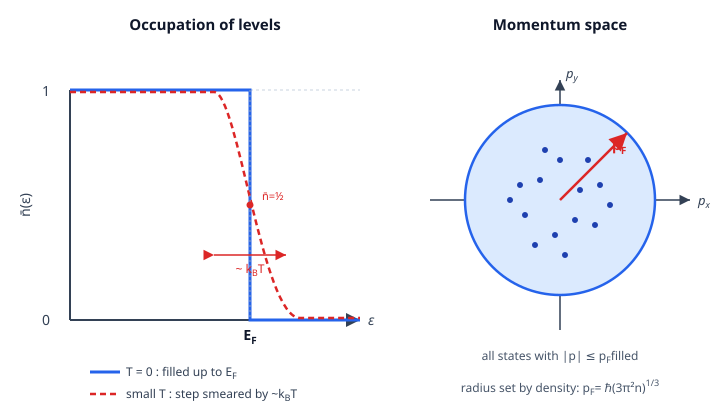

# Statistical Mechanics · Lesson 4.4: The ideal Fermi gas

> ⏱ ~15 min · Module 4: Quantum statistics · Builds on: [4.2 Bose–Einstein and Fermi–Dirac distributions](#/lesson/stat-mech/04-02-bose-einstein-fermi-dirac.md), [4.3 The photon gas and blackbody radiation](#/lesson/stat-mech/04-03-photon-gas-blackbody.md) · Unlocks: 4.5 Bose condensation, and Boss Problem 4 (white dwarfs and the Chandrasekhar mass)

## Why this matters

Squeeze a cold gas of electrons and it pushes back — hard — even at absolute zero, where nothing is moving in the classical sense. That push is **degeneracy pressure**, and it is not thermal: it comes entirely from the Pauli exclusion principle refusing to let two electrons share a state. This one fact holds up white dwarf stars against their own gravity, sets the compressibility and heat capacity of every metal, and — when the electrons get fast enough to feel relativity — springs the trap that gives stars a **maximum mass**. This lesson gets you the Fermi energy, the pressure, the tiny electronic heat capacity, and the relativistic twist that feeds directly into astrophysics.

## The idea

Take $N$ non-interacting spin-$\tfrac12$ fermions (think conduction electrons) and cool them toward $T=0$. Each of them wants the lowest energy available, but Pauli forbids doubling up: at most **two** electrons per spatial state (one spin up, one down). So they fill single-particle levels from the bottom like water filling a container — one pair per rung — until all $N$ are placed. The energy of the last, highest-filled level is the **Fermi energy** $E_F$. Below it, every state is occupied; above it, every state is empty. The occupation as a function of energy is a perfect **step**.

That is the whole story of $T=0$: not a Boltzmann tail, not a bell curve, but a filled sea with a sharp surface. The gas is *forced* to hold high-energy electrons — the ones near the surface have kinetic energy of order $E_F$ even though the temperature is zero — because all the low states are already taken. Those energetic electrons carry momentum, and momentum flux is pressure. **A pressure that exists at $T=0$, with no heat anywhere in sight.**

Turn on a small temperature $T$, and only the electrons within about $k_B T$ of the surface can find an empty state to jump into — everyone deeper is walled in by occupied neighbors. So the sharp step just gets slightly rounded, over an energy width $\sim k_B T$. That "only the surface participates" picture explains a century-old puzzle: why the electrons in a metal contribute almost nothing to its heat capacity.

## The formal version

**Density of states.** For a gas of spin-$\tfrac12$ fermions of mass $m$ in a box of volume $V$, with nonrelativistic energy $\epsilon = p^2/2m$, the number of single-particle states per unit energy (the spin factor $2$ already folded in) is

$$g(\epsilon) = \frac{V}{2\pi^2}\left(\frac{2m}{\hbar^2}\right)^{3/2}\epsilon^{1/2}.$$

*In words:* $g(\epsilon)\,d\epsilon$ counts how many orbital-plus-spin slots exist between energy $\epsilon$ and $\epsilon+d\epsilon$; higher energy means more slots (the $\epsilon^{1/2}$).

**The $T=0$ Fermi function is a step.** The Fermi–Dirac occupation $\bar n(\epsilon)=1/\!\left(e^{(\epsilon-\mu)/k_BT}+1\right)$ from [4.2](#/lesson/stat-mech/04-02-bose-einstein-fermi-dirac.md) becomes, as $T\to 0$,

$$\bar n(\epsilon) \to \begin{cases}1 & \epsilon < E_F\\[2pt] 0 & \epsilon > E_F\end{cases}, \qquad E_F \equiv \mu(T=0).$$

*In words:* at absolute zero the chemical potential *is* the Fermi energy, and every level below it is full, every level above empty.

**Fermi energy and momentum.** Fix $N$ by filling all states up to $E_F$:

$$N = \int_0^{E_F} g(\epsilon)\,d\epsilon = \frac{V}{2\pi^2}\left(\frac{2m}{\hbar^2}\right)^{3/2}\cdot\frac{2}{3}E_F^{3/2} = \frac{V}{3\pi^2}\left(\frac{2mE_F}{\hbar^2}\right)^{3/2}.$$

Solving for $E_F$ in terms of the number density $n=N/V$:

$$\boxed{\,E_F = \frac{\hbar^2}{2m}\left(3\pi^2 n\right)^{2/3},\qquad p_F = \sqrt{2mE_F} = \hbar\left(3\pi^2 n\right)^{1/3}.\,}$$

*In words:* the Fermi energy is fixed by **density alone** — pack the electrons tighter and the sea gets deeper. Temperature does not appear.

**Ground-state energy.** Sum the energies of all filled levels:

$$E = \int_0^{E_F}\epsilon\,g(\epsilon)\,d\epsilon = \frac{V}{2\pi^2}\left(\frac{2m}{\hbar^2}\right)^{3/2}\cdot\frac{2}{5}E_F^{5/2}.$$

Divide by $N$ (from the box above) and the messy constants cancel:

$$\boxed{\,E = \tfrac{3}{5}N E_F\,}\qquad\Longleftrightarrow\qquad \langle\epsilon\rangle = \tfrac{3}{5}E_F.$$

*In words:* the average electron sits at three-fifths of the way up the sea — not at the bottom, because the $\epsilon^{1/2}$ density piles most states near the top.

**Degeneracy pressure.** Since $E_F\propto (N/V)^{2/3}$, the energy is $E=\tfrac35 N E_F \propto N^{5/3}V^{-2/3}$. Pressure at $T=0$ is $P=-\left(\partial E/\partial V\right)_N$:

$$\boxed{\,P = \frac{2}{5}\,n E_F = \frac{\hbar^2}{5m}\left(3\pi^2\right)^{2/3} n^{5/3} \;\propto\; n^{5/3}.\,}$$

*In words:* the cold electron gas exerts a pressure that grows steeply with density — a purely quantum stiffness, with **no thermal origin**, present at absolute zero. (Note $P = \tfrac23 E/V$: the nonrelativistic relation, twice the radiation value.)

**Low but nonzero $T$ — the Sommerfeld idea.** Warming the gas can only excite electrons within $\sim k_B T$ of $E_F$ (deeper ones have no empty state to move to). The fraction that can play is $\sim k_B T/E_F$, and each gains energy $\sim k_B T$, so the thermal energy above the ground state scales as $\Delta E \sim N k_B T\cdot(k_B T/E_F)$. Differentiating, the **electronic heat capacity** is linear:

$$\boxed{\,C_V = \frac{\pi^2}{2}N k_B\,\frac{T}{T_F}\;\propto\; T,\qquad T_F\equiv \frac{E_F}{k_B}.\,}$$

*In words:* only the thin surface of the Fermi sea heats up, so $C_V$ is not the classical $\tfrac32 N k_B$ — it is smaller by the factor $T/T_F\sim 10^{-2}$, and it vanishes linearly as $T\to 0$. This is why the conduction electrons in a metal seem thermodynamically "missing."

**The ultrarelativistic limit.** When electrons are compressed so hard that $p_F c \gtrsim m c^2$, the dispersion switches from $\epsilon=p^2/2m$ to $\epsilon = pc$. Recounting with the same momentum-space filling gives $E=\tfrac34 N\,p_F c$ and, because a $\epsilon\propto p$ gas obeys $P=\tfrac13 E/V$,

$$\boxed{\,P = \frac{1}{4}\,n\,p_F c = \frac{\hbar c}{4}\left(3\pi^2\right)^{1/3} n^{4/3}\;\propto\; n^{4/3}.\,}$$

*In words:* relativity **softens** the pressure — the exponent drops from $5/3$ to $4/3$. That single change is what caps the mass of a white dwarf (Problem 3).

## Picture

Left: at $T=0$ the occupation $\bar n(\epsilon)$ is a step — filled below $E_F$, empty above — and a small $T$ rounds it over a width $\sim k_B T$ around the surface. Right: in momentum space, "filled below $E_F$" means every state inside a sphere of radius $p_F$ is occupied; the whole Fermi energy is just the surface of this **Fermi sphere**.

## Worked examples

**Example 1 (mechanical — where $\tfrac35 E_F$ comes from).** Verify $E=\tfrac35 N E_F$ directly from the two integrals. Write $A=\frac{V}{2\pi^2}\left(\frac{2m}{\hbar^2}\right)^{3/2}$ so $g(\epsilon)=A\,\epsilon^{1/2}$. Then

$$N=\int_0^{E_F}A\,\epsilon^{1/2}d\epsilon = A\cdot\tfrac{2}{3}E_F^{3/2},\qquad E=\int_0^{E_F}A\,\epsilon^{3/2}d\epsilon = A\cdot\tfrac{2}{5}E_F^{5/2}.$$

Divide: $\dfrac{E}{N}=\dfrac{(2/5)E_F^{5/2}}{(2/3)E_F^{3/2}}=\dfrac{3}{5}E_F.$ The constant $A$ — and all the physical clutter inside it — cancels; the answer $\tfrac35$ is pure geometry of the $\epsilon^{1/2}$ density. This is the whole nonrelativistic Fermi gas in three lines.

**Example 2 (why you'd care — are white-dwarf electrons relativistic?).** A white dwarf packs matter to $\sim 10^9\ \mathrm{kg/m^3}$; with one electron per $\sim 2$ nucleons the electron density is $n\sim 10^{36}\ \mathrm{m^{-3}}$. The Fermi momentum is

$$p_F=\hbar(3\pi^2 n)^{1/3}=(1.05\times10^{-34})\,(3\pi^2\cdot10^{36})^{1/3}\approx 3.3\times10^{-22}\ \mathrm{kg\,m/s}.$$

Compare its energy scale to the electron rest energy: $p_F c \approx 9.8\times10^{-14}\ \mathrm{J}\approx 0.61\ \mathrm{MeV}$, while $m_e c^2 = 0.511\ \mathrm{MeV}$. So $p_F c \gtrsim m_e c^2$ — the electrons at the Fermi surface are moving at a serious fraction of $c$. A real white dwarf lives right on the boundary between the $n^{5/3}$ and $n^{4/3}$ laws, which is exactly why its stability is a knife-edge and why a maximum mass exists at all.

## Watch out

- You might think pressure needs temperature — bumping molecules, thermal jostling. Degeneracy pressure has **none of that**: it survives at $T=0$ and comes purely from Pauli exclusion forcing electrons into high-momentum states. It is quantum statistics, not kinetic theory.
- You might think "degenerate gas" means the energy *levels* are degenerate. Different meaning: here **degenerate** means quantum-dominated, $T\ll T_F$, the regime where the Fermi step is sharp. A classical (Maxwell–Boltzmann) gas is the opposite limit $T\gg T_F$.
- You might expect the electrons in a metal to add $\tfrac32 N k_B$ to its heat capacity by equipartition (the [3.4](#/lesson/stat-mech/03-04-equipartition-theorem.md) rule). They don't — equipartition assumes every electron is free to absorb $k_B T$, but Pauli locks all but the $\sim k_B T/E_F$ fraction near the surface. The measured electronic $C_V$ is linear in $T$ and tiny; that suppression is the fingerprint of degeneracy.
- You might read $E_F=\tfrac{\hbar^2}{2m}(3\pi^2 n)^{2/3}$ and forget it has nothing to do with $T$. $E_F$ is set by **density**; $T_F=E_F/k_B$ is just that energy in Kelvin, a benchmark to compare the actual $T$ against — not the gas's temperature.

## One-liner

> Pauli exclusion stacks fermions into a filled sea up to $E_F$, producing a pressure $\propto n^{5/3}$ that owes nothing to heat — and when the top of the sea turns relativistic the law softens to $n^{4/3}$, capping the mass of a star.

## Problems

**P1 (🟢)** Conduction electrons in a typical metal have number density $n\approx 10^{29}\ \mathrm{m^{-3}}$. Compute the Fermi energy $E_F$ (in eV) and the Fermi temperature $T_F=E_F/k_B$. Show $T_F\gg 300\ \mathrm{K}$, and state what that means for the gas. *(Constants: $\hbar=1.05\times10^{-34}$ J·s, $m_e=9.11\times10^{-31}$ kg, $k_B=1.38\times10^{-23}$ J/K, $1\ \mathrm{eV}=1.60\times10^{-19}$ J.)*

**P2 (🟡)** Starting from $E=\tfrac35 N E_F$ with $E_F=\tfrac{\hbar^2}{2m}(3\pi^2 N/V)^{2/3}$, derive the degeneracy pressure $P=-\left(\partial E/\partial V\right)_N$ and show $P=\tfrac25 n E_F\propto n^{5/3}$.

**P3 (🔴, optional — the Chandrasekhar mass)** For an ultrarelativistic electron gas $P\propto n^{4/3}$. Model a star of mass $M$ and radius $R$ built of $N$ electrons (density $n\sim N/R^3\sim M/R^3$). Hydrostatic balance requires the degeneracy pressure to match the pressure gravity demands, which scales as $P_{\text{grav}}\sim GM^2/R^4$. Compare the nonrelativistic ($n^{5/3}$) and ultrarelativistic ($n^{4/3}$) cases: show the first gives a mass–radius relation $R\propto M^{-1/3}$, but the second makes $R$ **cancel**, leaving a single critical mass. Argue qualitatively why exceeding it means collapse.

Solutions

**P1** With $3\pi^2 n = 3\pi^2(10^{29}) = 2.96\times10^{30}\ \mathrm{m^{-3}}$,

$$E_F=\frac{\hbar^2}{2m_e}(3\pi^2 n)^{2/3}=\frac{(1.05\times10^{-34})^2}{2(9.11\times10^{-31})}\,(2.96\times10^{30})^{2/3}.$$

The prefactor is $\hbar^2/2m_e = 6.1\times10^{-39}\ \mathrm{J\,m^2}$, and $(2.96\times10^{30})^{2/3}=2.06\times10^{20}\ \mathrm{m^{-2}}$, so

$$E_F \approx 1.26\times10^{-18}\ \mathrm{J} \approx 7.9\ \mathrm{eV}.$$

Then $T_F = E_F/k_B = 1.26\times10^{-18}/1.38\times10^{-23}\approx 9.1\times10^4\ \mathrm{K}$. Since room temperature $300\ \mathrm{K}$ gives $T/T_F\approx 300/91000\approx 3\times10^{-3}\ll 1$, the electron gas is **highly degenerate**: at any ordinary temperature the Fermi step is razor-sharp, the electrons are quantum-mechanically frozen into their sea, and only a $\sim 0.3\%$ sliver near $E_F$ is thermally active. Metals are cold Fermi gases even when glowing hot.

**P2** Write $E$ as an explicit function of $V$ at fixed $N$. Since $n=N/V$,

$$E=\tfrac35 N E_F = \tfrac35 N\cdot\frac{\hbar^2}{2m}(3\pi^2)^{2/3}\left(\frac{N}{V}\right)^{2/3}=\underbrace{\tfrac35\frac{\hbar^2}{2m}(3\pi^2)^{2/3}N^{5/3}}_{\displaystyle \equiv\, K}\;V^{-2/3}.$$

Then

$$P=-\left(\frac{\partial E}{\partial V}\right)_N = -K\cdot\left(-\tfrac23\right)V^{-5/3}=\tfrac23\,K\,V^{-5/3}=\tfrac23\cdot\frac{E}{V}.$$

Substitute $E/V=\tfrac35 nE_F$: $\;P=\tfrac23\cdot\tfrac35 nE_F=\tfrac25 nE_F.$ Finally, using $E_F\propto n^{2/3}$,

$$P=\tfrac25 n E_F=\frac{\hbar^2}{5m}(3\pi^2)^{2/3}\,n^{5/3}\;\propto\;n^{5/3}.\ \checkmark$$

The relation $P=\tfrac23 E/V$ is the generic nonrelativistic result (contrast the radiation/ultrarelativistic $P=\tfrac13 E/V$).

**P3** Balance the star's own degeneracy pressure against what gravity demands, $P_{\text{grav}}\sim GM^2/R^4$, using $n\sim M/R^3$.

*Nonrelativistic.* $P\sim n^{5/3}\sim (M/R^3)^{5/3}=M^{5/3}/R^5$. Setting equal to $GM^2/R^4$:

$$\frac{M^{5/3}}{R^5}\sim \frac{GM^2}{R^4}\ \Longrightarrow\ \frac{1}{R}\sim G\,M^{1/3}\ \Longrightarrow\ \boxed{R\propto M^{-1/3}.}$$

A stable equilibrium exists for **any** mass, and heavier white dwarfs are *smaller* — pile on mass and the star shrinks, which raises $n$ and stiffens the pressure until it balances. Good.

*Ultrarelativistic.* Now $P\sim n^{4/3}\sim (M/R^3)^{4/3}=M^{4/3}/R^4$ — the **same** $R^{-4}$ dependence as gravity. Setting equal:

$$\frac{M^{4/3}}{R^4}\sim \frac{GM^2}{R^4}\ \Longrightarrow\ M^{4/3}\sim G\,M^2\ \Longrightarrow\ R\ \text{cancels},\quad M\sim G^{-3/2}\,(\text{const}).$$

Because both sides fall off as $R^{-4}$, radius drops out entirely and the balance fixes a single mass — the **Chandrasekhar mass** $M_{\text{Ch}}\sim (\hbar c/G)^{3/2}/m_N^2\approx 1.4\,M_\odot$. Physically: in the relativistic regime, compressing the star stiffens the pressure only as fast as gravity strengthens, never faster, so there is no restoring margin left. If $M<M_{\text{Ch}}$, the star expands until the electrons turn nonrelativistic and recover the stabilizing $n^{5/3}$ law; if $M>M_{\text{Ch}}$, gravity beats degeneracy at *every* radius and the electron pressure can never catch up — the core collapses (toward a neutron star or black hole). The softer $4/3$ exponent is the whole reason a maximum mass exists.

## Flashback

**From Lesson 4.2 (Bose–Einstein and Fermi–Dirac distributions):** The Fermi–Dirac occupation is $\bar n(\epsilon)=\dfrac{1}{e^{(\epsilon-\mu)/k_BT}+1}$. (a) Show it has **particle–hole symmetry**: $\bar n(\mu+\delta)+\bar n(\mu-\delta)=1$ for any energy offset $\delta$. (b) Evaluate the occupation of a state exactly one $k_BT$ above $\mu$.

Solution

Let $x=\delta/k_BT$, so $\bar n(\mu+\delta)=\dfrac{1}{e^{x}+1}$ and $\bar n(\mu-\delta)=\dfrac{1}{e^{-x}+1}$.

(a) Rewrite the second term by multiplying top and bottom by $e^{x}$: $\dfrac{1}{e^{-x}+1}=\dfrac{e^{x}}{1+e^{x}}$. Adding,

$$\bar n(\mu+\delta)+\bar n(\mu-\delta)=\frac{1}{1+e^{x}}+\frac{e^{x}}{1+e^{x}}=\frac{1+e^{x}}{1+e^{x}}=1.\ \checkmark$$

So the occupation above $\mu$ mirrors the *emptiness* below it: an electron promoted to $\mu+\delta$ leaves a hole at $\mu-\delta$, and the two probabilities are exactly complementary. This symmetry about $\mu$ is what makes the $T=0$ step land at $\bar n=\tfrac12$ right at $E_F$, and it is the reason the smeared region in the figure is symmetric around the Fermi energy.

(b) At $\delta=k_BT$, $x=1$: $\;\bar n=\dfrac{1}{e+1}=\dfrac{1}{3.718}\approx 0.27.$ A level one thermal quantum above the chemical potential is about $27\%$ full — already well down from the $\tfrac12$ at $\mu$, confirming that the step is smeared over only a few $k_BT$.

## Connections

- **Backward:** this is the [4.2](#/lesson/stat-mech/04-02-bose-einstein-fermi-dirac.md) Fermi–Dirac distribution taken to its cold limit, fed through the density of states, exactly as [4.3](#/lesson/stat-mech/04-03-photon-gas-blackbody.md) did for photons — same machinery ($\mu=0$ there, a hard step here). The pressure came out of the grand-canonical bookkeeping of [3.5](#/lesson/stat-mech/03-05-grand-canonical-ensemble.md).
- **Forward:** the mirror-image case — bosons piling into the *ground* state instead of stacking upward — is [4.5](#/lesson/stat-mech/04-05-ideal-bose-gas-condensation.md), Bose–Einstein condensation. And the $n^{5/3}$ vs $n^{4/3}$ competition here is the engine of **Boss Problem 4**: balance degeneracy against gravity to get the white-dwarf mass–radius relation and the Chandrasekhar limit.
- **Sideways (quantum mechanics):** the "two electrons per state, no more" rule filling the Fermi sea is the Pauli exclusion principle for identical fermions — the same antisymmetry developed in `quantum-mechanics` (identical particles). The atomic shell structure that gives chemistry its periodic table is this same filling, done on discrete atomic levels instead of a continuum.
- **Sideways (astrophysics):** degeneracy pressure is what a *dead* star runs on once fusion stops — white dwarfs on electron degeneracy ($n^{5/3}$), neutron stars on neutron degeneracy (same physics, swap $m_e\to m_n$). The relativistic softening to $n^{4/3}$ is the reason both have a maximum mass beyond which nothing halts the collapse.
