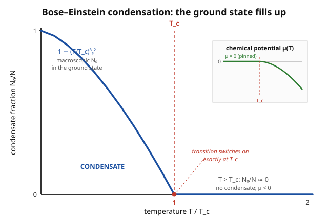

# Statistical Mechanics · Lesson 4.5: The ideal Bose gas and condensation

> ⏱ ~15 min · Module 4: Quantum statistics · Builds on: [4.2 Bose–Einstein and Fermi–Dirac](#/lesson/stat-mech/04-02-bose-einstein-fermi-dirac.md), [4.3 The photon gas and blackbody radiation](#/lesson/stat-mech/04-03-photon-gas-blackbody.md), [4.4 The ideal Fermi gas](#/lesson/stat-mech/04-04-ideal-fermi-gas.md) · Unlocks: Module 5 (interactions and phase transitions)

## Why this matters

Cool a gas of ordinary atoms — no interactions, no chemistry, just bosons — and something absurd happens below a sharp temperature: a *macroscopic* fraction of every atom in the box crowds into the single lowest-energy quantum state, all in lockstep. This is Bose–Einstein condensation, predicted by Einstein in 1925 and finally made in a lab in 1995 (Nobel 2001). It is the mechanism behind superfluid helium and the reason a laser-cooled cloud of rubidium can become a single quantum wave you can photograph. Remarkably, it is a genuine **phase transition in a gas with zero interactions** — driven by quantum statistics *alone*. This lesson finds exactly where it happens and how much condenses.

## The idea

The photon gas of 4.3 had a shortcut: photons can be created and destroyed freely, so their chemical potential is locked at $\mu=0$. Massive atoms are different — **their number $N$ is conserved**. You cannot make more rubidium by heating the box. That single constraint changes everything: $\mu$ is no longer free; it is whatever value makes the total occupation add up to exactly the $N$ atoms you put in.

Here is the tension. Each excited single-particle state holds an average of $\langle n\rangle = 1/(e^{\beta(\epsilon-\mu)}-1)$ bosons. To keep every occupation positive, $\mu$ must sit *below* the lowest energy level (the ground state at $\epsilon=0$), so $\mu \le 0$. As you cool the gas, you need to raise $\mu$ toward $0$ to keep the excited states populated enough to hold all $N$ atoms. But $\mu$ can only climb *to* zero, not past it — and once it's pinned there, the excited states have a **finite maximum capacity**. Cool further and that capacity drops below $N$. Where do the leftover atoms go? There is only one place left: the ground state, which quietly swallows a macroscopic pile of them. That pile is the condensate.

## The formal version

**Counting the atoms.** For a non-interacting gas of massive bosons in a box of volume $V$, sum the mean occupation over all single-particle states, written as an integral over energy with the density of states $g(\epsilon)$:

$$N = \int_0^\infty g(\epsilon)\,\langle n(\epsilon)\rangle\,d\epsilon, \qquad \langle n(\epsilon)\rangle=\frac{1}{e^{\beta(\epsilon-\mu)}-1}, \qquad g(\epsilon)=\frac{V}{4\pi^2}\left(\frac{2m}{\hbar^2}\right)^{3/2}\epsilon^{1/2}.$$

In words: the number equation fixes $\mu$ — turn the knob $\mu$ until the right-hand side equals the $N$ atoms you actually have. Here $m$ is the atomic mass, $\hbar$ the reduced Planck constant, $\beta=1/k_BT$, and $g(\epsilon)\propto \epsilon^{1/2}$ is the 3D free-particle density of states (spin-0 assumed).

**The constraint $\mu\le 0$.** At the ground state $\epsilon=0$, $\langle n\rangle = 1/(e^{-\beta\mu}-1)$. For this to be positive we need $e^{-\beta\mu}>1$, i.e. $\mu<0$. In words: the chemical potential must sit below every energy level, or the formula predicts a negative number of particles — nonsense. As $T$ falls, $\mu$ rises toward its ceiling $0^-$.

**The catastrophe.** Set $\mu$ to its ceiling, $\mu=0$, and ask how many atoms the *excited* states can hold. Because $g(\epsilon)\propto\epsilon^{1/2}$ vanishes at $\epsilon=0$, the integral quietly ignores the ground state and counts only the excited continuum:

$$N_{\text{exc}}(T)=\int_0^\infty g(\epsilon)\,\frac{1}{e^{\beta\epsilon}-1}\,d\epsilon = \frac{V}{4\pi^2}\left(\frac{2m}{\hbar^2}\right)^{3/2}(k_BT)^{3/2}\,\Gamma\!\left(\tfrac32\right)\zeta\!\left(\tfrac32\right)\ \propto\ T^{3/2}.$$

The value $\Gamma(3/2)\zeta(3/2)$ comes from the standard integral $\int_0^\infty \frac{x^{1/2}}{e^x-1}\,dx=\Gamma(\tfrac32)\zeta(\tfrac32)$, with $\Gamma(\tfrac32)=\tfrac{\sqrt\pi}{2}$ and $\zeta(\tfrac32)\approx 2.612$ (P3 derives this). In words: with $\mu$ maxed out, the excited states can hold **at most** $N_{\text{exc}}(T)$ atoms, and this ceiling *shrinks* as the gas cools. It is a finite number, and below some temperature it is smaller than $N$.

**The critical temperature.** $T_c$ is where the excited-state ceiling exactly equals $N$: set $N_{\text{exc}}(T_c)=N$ and solve. With $n=N/V$,

$$\boxed{\,k_BT_c=\frac{2\pi\hbar^2}{m}\left(\frac{n}{\zeta(3/2)}\right)^{2/3}\,}$$

equivalently the elegant condition $n\lambda_c^3=\zeta(3/2)\approx 2.612$, where $\lambda=\sqrt{2\pi\hbar^2/mk_BT}$ is the thermal de Broglie wavelength. In words: condensation begins when the atoms' quantum wavelengths grow until they overlap — when there is about one thermal wavelength's worth of "quantum room" per atom, statistics forces them together.

**The condensate fraction.** Below $T_c$, $\mu$ is pinned at $0$ and the excited states hold $N_{\text{exc}}(T)=N\,(T/T_c)^{3/2}$ (since $N_{\text{exc}}\propto T^{3/2}$ and equals $N$ at $T_c$). Everything left over sits in the ground state:

$$\frac{N_0}{N}=1-\left(\frac{T}{T_c}\right)^{3/2}\qquad (T<T_c).$$

In words: the ground-state occupation $N_0$ is macroscopic below $T_c$, rising smoothly from $0$ at $T_c$ to *all* $N$ atoms as $T\to 0$.

## Picture

## Worked examples

**Example 1 (mechanical — how sharp is the pinning of $\mu$?).** Below $T_c$ the ground state holds $N_0=1/(e^{-\beta\mu}-1)$ atoms. If a condensate has $N_0=10^{6}$ atoms at $T=100$ nK, how far below zero is $\mu$? For tiny $|\mu|$, expand $e^{-\beta\mu}-1\approx-\beta\mu$, so $N_0\approx -k_BT/\mu$, giving

$$\mu\approx-\frac{k_BT}{N_0}=-\frac{(1.38\times10^{-23})(10^{-7})}{10^{6}}\approx-1.4\times10^{-36}\ \text{J}.$$

That is about $10^{-13}\,k_BT$ below zero — utterly negligible. In words: $\mu$ isn't *exactly* $0$, it's a hair below, and the larger the condensate the closer to $0$ it sits. Treating $\mu=0$ below $T_c$ is exact in the thermodynamic limit.

**Example 2 (why you'd care — statistics beats the classical guess).** A classical (Maxwell–Boltzmann) ideal gas has $\langle n(\epsilon)\rangle = e^{-\beta(\epsilon-\mu)}$, which is finite and smooth for *every* $\mu$, including $\mu>0$. There is no ceiling on how many atoms the excited states can hold, so cooling never forces a pileup — the classical gas has **no condensation transition at all**. The Bose gas condenses only because the $-1$ in $e^{\beta(\epsilon-\mu)}-1$ makes the occupation blow up as $\mu\to\epsilon^-$, capping the excited-state capacity. In words: BEC is a phase transition with no interaction energy behind it — the "force" gathering the atoms is pure quantum bookkeeping. This is why helium-4 goes superfluid at its $\lambda$-transition (2.17 K) while a comparable classical gas would just keep cooling smoothly.

## Watch out

- You might think the number-equation integral counts *all* the atoms, so $N_{\text{exc}}(T)\le N$ automatically. But $g(\epsilon)\propto\epsilon^{1/2}$ silently **throws away the ground state** ($g(0)=0$). Above $T_c$ that's harmless — the ground state holds a negligible fraction. Below $T_c$ you must add the ground state back *by hand*: $N=N_0+N_{\text{exc}}$. Forgetting this is the classic error that "loses" the condensate.
- You might think $\mu$ can reach or exceed $0$. It cannot: $\mu>0$ would make the ground-state occupation negative. $\mu$ climbs to $0^-$ at $T_c$ and stays pinned there for all $T<T_c$ — it never crosses.
- You might think condensation needs the atoms to attract each other. No — this is an *ideal* gas. The pileup is forced by conservation of $N$ plus Bose statistics; interactions matter for real superfluids but are not what triggers the transition.
- Don't confuse this with the photon gas of 4.3. Photons have $\mu=0$ *always* (number not conserved), so they never "run out of room" and never condense. Massive bosons have $\mu=0$ only *below* $T_c$, as a consequence — not an assumption.

## One-liner

> Conserve $N$, pin $\mu$ at its ceiling of $0$, and the excited states run out of room at $k_BT_c=\frac{2\pi\hbar^2}{m}(n/\zeta(3/2))^{2/3}$ — below which a macroscopic $N_0/N=1-(T/T_c)^{3/2}$ collapses into the single ground state.

## Problems

**P1 (🟢)** Estimate $T_c$ for a dilute atomic gas of rubidium-87 ($m\approx 1.44\times10^{-25}$ kg) at number density $n\approx10^{20}\ \text{m}^{-3}$, using the boxed formula. Comment on why BEC experiments need laser and evaporative cooling. (Constants: $\hbar=1.055\times10^{-34}$ J·s, $k_B=1.38\times10^{-23}$ J/K, $\zeta(3/2)=2.612$.)

**P2 (🟡)** Derive the condensate fraction $N_0/N=1-(T/T_c)^{3/2}$ for $T<T_c$, given that below $T_c$ the chemical potential is pinned at $\mu=0$ and $N_{\text{exc}}(T)\propto T^{3/2}$. State clearly where the ground state enters.

**P3 (🔴, optional)** Starting from $N_{\text{exc}}=\int_0^\infty g(\epsilon)\,(e^{\beta\epsilon}-1)^{-1}\,d\epsilon$ with $g(\epsilon)=\frac{V}{4\pi^2}(2m/\hbar^2)^{3/2}\epsilon^{1/2}$ and $\mu=0$, substitute $x=\beta\epsilon$ to show $N_{\text{exc}}\propto T^{3/2}$, evaluate the constant using $\int_0^\infty \frac{x^{1/2}}{e^x-1}dx=\Gamma(\tfrac32)\zeta(\tfrac32)$, and set $N_{\text{exc}}(T_c)=N$ to recover the boxed $T_c$. (This is the same $\zeta$-function integral machinery that gave the Stefan–Boltzmann constant in 4.3 — there the exponent was $x^3$, here $x^{1/2}$.)

Solutions

**P1** Plug in. First the prefactor:

$$\frac{2\pi\hbar^2}{m}=\frac{2\pi(1.055\times10^{-34})^2}{1.44\times10^{-25}}=\frac{6.99\times10^{-68}}{1.44\times10^{-25}}\approx4.84\times10^{-43}\ \text{J·m}^2.$$

Then the density factor:

$$\left(\frac{n}{\zeta(3/2)}\right)^{2/3}=\left(\frac{10^{20}}{2.612}\right)^{2/3}=(3.83\times10^{19})^{2/3}\approx1.14\times10^{13}\ \text{m}^{-2}.$$

So $k_BT_c\approx(4.84\times10^{-43})(1.14\times10^{13})\approx5.5\times10^{-30}$ J, and

$$T_c\approx\frac{5.5\times10^{-30}}{1.38\times10^{-23}}\approx4.0\times10^{-7}\ \text{K}\approx400\ \text{nK}.$$

A few hundred **nanokelvin** — a billion times colder than room temperature (and the $T_c\propto n^{2/3}$ scaling means a ten-times-thinner cloud condenses near $\sim100$ nK). No ordinary refrigeration reaches this; you need laser cooling to microkelvin, then evaporative cooling to strip the hottest atoms and drop the rest into the nanokelvin regime. The extreme dilution is deliberate: it suppresses three-body recombination into a solid, letting the gas stay a *gas* long enough to condense.

**P2** Below $T_c$ the total splits into ground state plus excited states:

$$N=N_0+N_{\text{exc}}(T),$$

where the $\epsilon^{1/2}$ density of states counts only $N_{\text{exc}}$ (it vanishes at $\epsilon=0$), so $N_0$ — the macroscopic ground-state occupation — must be written separately. We're told $N_{\text{exc}}(T)=A\,T^{3/2}$ for some constant $A$ (with $\mu=0$). At the transition, the excited states hold everything: $N_{\text{exc}}(T_c)=A\,T_c^{3/2}=N$, which fixes $A=N/T_c^{3/2}$. Therefore, for any $T<T_c$,

$$N_{\text{exc}}(T)=N\left(\frac{T}{T_c}\right)^{3/2}\quad\Longrightarrow\quad N_0=N-N_{\text{exc}}=N\left[1-\left(\frac{T}{T_c}\right)^{3/2}\right],$$

$$\boxed{\ \frac{N_0}{N}=1-\left(\frac{T}{T_c}\right)^{3/2}\quad (T<T_c).\ }$$

At $T=T_c$ it gives $0$ (nothing condensed yet); at $T\to0$ it gives $1$ (all atoms in the ground state). The whole result hinges on adding $N_0$ back by hand — the integral alone never sees it.

**P3** Insert $\mu=0$ and $g(\epsilon)=C\,\epsilon^{1/2}$ with $C=\frac{V}{4\pi^2}(2m/\hbar^2)^{3/2}$:

$$N_{\text{exc}}=C\int_0^\infty\frac{\epsilon^{1/2}}{e^{\beta\epsilon}-1}\,d\epsilon.$$

Substitute $x=\beta\epsilon$, so $\epsilon=k_BT\,x$, $d\epsilon=k_BT\,dx$, and $\epsilon^{1/2}=(k_BT)^{1/2}x^{1/2}$:

$$N_{\text{exc}}=C\,(k_BT)^{3/2}\int_0^\infty\frac{x^{1/2}}{e^{x}-1}\,dx=C\,(k_BT)^{3/2}\,\Gamma\!\left(\tfrac32\right)\zeta\!\left(\tfrac32\right).$$

The $(k_BT)^{3/2}$ factor pulled out cleanly, so $N_{\text{exc}}\propto T^{3/2}$ — as claimed. Numerically $\Gamma(\tfrac32)\zeta(\tfrac32)=\tfrac{\sqrt\pi}{2}\cdot2.612\approx0.886\cdot2.612\approx2.315$. Now set $N_{\text{exc}}(T_c)=N$ and divide by $V$ (with $n=N/V$):

$$n=\frac{1}{4\pi^2}\left(\frac{2m}{\hbar^2}\right)^{3/2}(k_BT_c)^{3/2}\,\frac{\sqrt\pi}{2}\,\zeta\!\left(\tfrac32\right).$$

Collect the numeric constants: $\frac{1}{4\pi^2}\cdot\frac{\sqrt\pi}{2}=\frac{1}{8\pi^{3/2}}$, and factor $\left(\frac{2mk_BT_c}{\hbar^2}\right)^{3/2}=(4\pi)^{3/2}\left(\frac{mk_BT_c}{2\pi\hbar^2}\right)^{3/2}$ with $(4\pi)^{3/2}=8\pi^{3/2}$, so the $8\pi^{3/2}$ cancels the $\frac{1}{8\pi^{3/2}}$:

$$n=\zeta\!\left(\tfrac32\right)\left(\frac{mk_BT_c}{2\pi\hbar^2}\right)^{3/2}=\frac{\zeta(3/2)}{\lambda_c^3},\qquad \lambda_c=\sqrt{\frac{2\pi\hbar^2}{mk_BT_c}}.$$

So the transition condition is $n\lambda_c^3=\zeta(3/2)$. Solve for $T_c$: raise to the $2/3$ power,

$$\left(\frac{mk_BT_c}{2\pi\hbar^2}\right)=\left(\frac{n}{\zeta(3/2)}\right)^{2/3}\quad\Longrightarrow\quad k_BT_c=\frac{2\pi\hbar^2}{m}\left(\frac{n}{\zeta(3/2)}\right)^{2/3}. \checkmark$$

## Flashback

**From Lesson 4.2 (Bose–Einstein and Fermi–Dirac):** A single boson mode sits at energy $\epsilon-\mu=k_BT\ln 3$ above the chemical potential. Find its mean occupation $\langle n\rangle$, and compare it to what the Maxwell–Boltzmann (classical) formula would give at the same energy. Which is larger, and why?

Solution

Bose–Einstein: with $\beta(\epsilon-\mu)=\ln 3$, so $e^{\beta(\epsilon-\mu)}=3$,

$$\langle n\rangle_{\text{BE}}=\frac{1}{e^{\beta(\epsilon-\mu)}-1}=\frac{1}{3-1}=\frac12.$$

Maxwell–Boltzmann: $\langle n\rangle_{\text{MB}}=e^{-\beta(\epsilon-\mu)}=e^{-\ln 3}=\frac13$.

The Bose occupation ($\tfrac12$) exceeds the classical one ($\tfrac13$). The $-1$ in the denominator makes bosons **bunch** — they preferentially crowd the same low-lying states relative to a classical gas. Pushed to the extreme ($\epsilon-\mu\to0$), this bunching is exactly what fuels the macroscopic ground-state occupation of this lesson. (For fermions the sign flips to $+1$ and $\langle n\rangle_{\text{FD}}=\tfrac14<\tfrac13$: they anti-bunch.)

## Connections

- **Backward:** this is the massive-particle counterpart of the [photon gas](#/lesson/stat-mech/04-03-photon-gas-blackbody.md) — same Bose distribution and $\epsilon^{1/2}$ density of states, but *conserved* $N$ forces $\mu$ into play, which is exactly what photons ($\mu=0$ always) never had. It also mirrors the [ideal Fermi gas](#/lesson/stat-mech/04-04-ideal-fermi-gas.md): Fermi statistics *spread atoms out* (degeneracy pressure), Bose statistics *pile them up* (condensation) — opposite ends of the same occupation-number bookkeeping from 4.2.
- **Forward:** BEC is your first true phase transition, and it sets up Module 5. Unlike the [van der Waals / Ising transitions](#/lesson/stat-mech/05-03-ising-mean-field.md) driven by interactions, this one is purely statistical — a clean reference point for what "order parameter" and "critical temperature" mean before interactions complicate the story.
- **Sideways (quantum mechanics):** below $T_c$ the condensate is a single macroscopic wavefunction — the same indistinguishable-boson symmetry from `quantum-mechanics` identical-particles, now visible at the scale of a whole cloud. The 1995 rubidium and sodium condensates (Cornell–Wieman, Ketterle) are this equation photographed.
