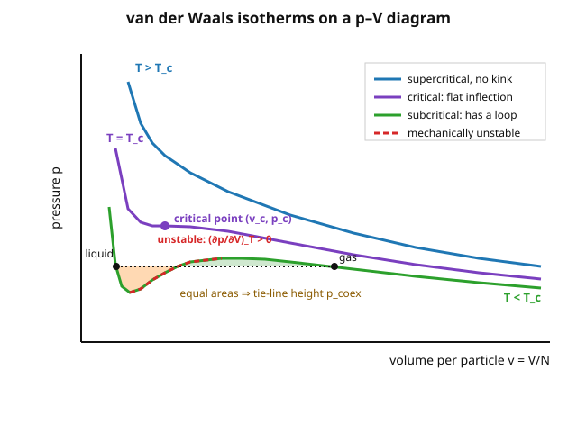

# Statistical Mechanics · Lesson 5.1: Non-ideal gases — virial expansion and van der Waals

> ⏱ ~15 min · Module 5: Interactions, phase transitions, and critical phenomena · Builds on: [1.5 The ideal gas microcanonically](#/lesson/stat-mech/01-05-ideal-gas-sackur-tetrode.md), [2.4 Maxwell relations and stability](#/lesson/stat-mech/02-04-maxwell-relations-stability.md), [3.2 The partition function](#/lesson/stat-mech/03-02-partition-function.md) · Unlocks: 5.2 Phase transitions and Clausius–Clapeyron

## Why this matters

Every gas you have met so far was ideal: point particles that ignore each other, obeying $pV=Nk_BT$ forever. But real molecules *do* interact — they repel when squeezed together and attract at a polite distance — and that single fact is the entire origin of the liquid state, of boiling, of the critical point where the distinction between liquid and gas evaporates. This lesson turns interactions on. First **perturbatively** (the virial expansion — the honest, systematic correction to $pV=Nk_BT$ in powers of density), then through the **van der Waals equation**, a crude but immortal model that, from two parameters, predicts a liquid–gas transition and a universal critical point. It is your first phase transition, and the template for everything in Module 5.

## The idea

Picture two molecules approaching each other. Far apart, they feel nothing. At a moderate separation a weak attraction pulls them together (the tail that lets gases condense). Push them closer and their electron clouds slam into a wall — a steep repulsion, effectively a hard core they cannot interpenetrate. That is the **Lennard-Jones shape**: a soft attractive dip followed by a vertical repulsive cliff.

Now ask what those two effects do to the pressure of a gas. **Repulsion** means each molecule steals volume from the others — the gas is more crowded than its size suggests, so it pushes *harder* on the walls: pressure up. **Attraction** means molecules near the wall feel an inward tug from their neighbors and strike the wall a little softer: pressure *down*. Two competing corrections, opposite signs. The whole subject is bookkeeping these two, and the beautiful surprise is that when attraction wins at low temperature, the equation of state develops a fold — and inside that fold the gas cannot exist as a uniform phase. It splits into liquid and vapor. That fold *is* the phase transition.

## The formal version

**The interaction.** Two molecules a distance $r$ apart carry a pair potential energy $u(r)$: $u\to+\infty$ as $r\to 0$ (hard core), a negative minimum at intermediate $r$ (attraction), and $u\to 0$ as $r\to\infty$. Write $\beta = 1/k_BT$.

**The virial expansion.** For a dilute gas the equation of state is a power series in the number density $n=N/V$:
$$\frac{p}{k_BT} = n + B_2(T)\,n^2 + B_3(T)\,n^3 + \cdots$$
*In words:* the ideal gas is the first term ($p=nk_BT$); each higher power of density is a correction from simultaneous encounters of 2, 3, … molecules. $B_2$ handles pairs, $B_3$ triples, and so on. At low density pairs dominate, so $B_2(T)$ carries the leading physics.

**The second virial coefficient.** Define the **Mayer $f$-function** $f(r) = e^{-\beta u(r)} - 1$ — it is zero wherever the molecules don't interact and nonzero only inside the range of $u$. Then
$$B_2(T) = -\frac{1}{2}\int \left(e^{-\beta u(r)} - 1\right)d^3r = -\frac{1}{2}\int f(r)\,d^3r.$$
*In words:* $B_2$ is (minus one-half) the total "interaction volume" weighted by how strongly a Boltzmann factor deviates from 1. Where $u>0$ (repulsion), $e^{-\beta u}<1$, so $f<0$ and $B_2$ gets a **positive** contribution — pressure up. Where $u<0$ (attraction), $e^{-\beta u}>1$, so $f>0$ and $B_2$ gets a **negative** contribution — pressure down. The sign of $B_2$ literally reads off which effect wins, and attraction weakens as $T$ rises (the $\beta$ in the exponent shrinks), so $B_2$ climbs from negative toward positive with temperature.

**The van der Waals equation.** Model the two effects with one parameter each — $b$ for the excluded volume of the hard core, $a$ for the strength of attraction:
$$\left(p + a\,n^2\right)\left(\frac{1}{n} - b\right) = k_BT, \qquad\text{equivalently}\qquad \left(p + a\frac{N^2}{V^2}\right)(V - Nb) = Nk_BT.$$
*In words:* start from $pV=Nk_BT$ and make two edits. **Excluded volume:** molecules can't be everywhere, so the volume actually available is $V-Nb$, not $V$ — this is the repulsion, and it raises $p$. **Attraction:** the inward pull lowers the measured pressure by an amount proportional to (density)$^2$ — the number of attracting pairs per unit volume — so the "true" internal pressure is $p+an^2$. Solve for $p$:
$$p = \frac{nk_BT}{1-nb} - a\,n^2 = \frac{Nk_BT}{V-Nb} - a\frac{N^2}{V^2}.$$

**vdW reproduces $B_2$.** Expand the vdW pressure at low density: $\frac{1}{1-nb} = 1 + nb + \cdots$, so
$$\frac{p}{k_BT} = n + \left(b - \frac{a}{k_BT}\right)n^2 + \cdots \;\Rightarrow\; \boxed{B_2(T) = b - \frac{a}{k_BT}.}$$
*In words:* the excluded volume $b$ is the positive (repulsive) piece of $B_2$; the attraction $a$ is the negative piece that dies off as $1/T$. This is the microscopic meaning of the two knobs — and it says $B_2$ has a zero at the **Boyle temperature** $T_B = a/(k_Bb)$, where the gas mimics an ideal one.

**The loop, instability, and the critical point.** Below a critical temperature $T_c$, the isotherm $p(V)$ at fixed $T$ is not monotone: it wiggles, with a stretch where $(\partial p/\partial V)_T > 0$ — squeeze the gas and its pressure *rises to meet you the wrong way*. Recall the mechanical **stability condition** from [2.4](#/lesson/stat-mech/02-04-maxwell-relations-stability.md): a stable phase requires $\kappa_T = -\frac{1}{V}(\partial V/\partial p)_T > 0$, i.e. $(\partial p/\partial V)_T < 0$. The loop violates it, so that region is **mechanically unstable** — no homogeneous phase can live there. Nature replaces the loop with a flat coexistence line (below). As $T$ rises the loop shrinks; at exactly $T_c$ it collapses to a single point with a **horizontal inflection**,
$$\left(\frac{\partial p}{\partial V}\right)_T = 0 \quad\text{and}\quad \left(\frac{\partial^2 p}{\partial V^2}\right)_T = 0 \quad\text{(critical point)}.$$
Solving these two equations (Problem 2) gives the critical constants in terms of $a,b$:
$$k_BT_c = \frac{8a}{27b}, \qquad v_c \equiv \frac{V_c}{N} = 3b, \qquad p_c = \frac{a}{27b^2}.$$

**Maxwell equal-area construction.** The unstable loop is unphysical, but you cannot just erase it — you replace it with a horizontal tie-line at the coexistence pressure $p_{\text{coex}}(T)$, chosen so the two lobes the line cuts off from the loop have **equal area**:
$$\oint v\,dp = 0 \quad\Longleftrightarrow\quad \int_{v_\ell}^{v_g}\!\!\big(p(v) - p_{\text{coex}}\big)\,dv = 0.$$
*In words:* the flat line sits at the height that makes the area above it equal the area below it. The reason is thermodynamic, not geometric: along the true isotherm the chemical potentials of the liquid ($v_\ell$) and gas ($v_g$) must be equal for coexistence, and $d\mu = v\,dp$ at fixed $T$, so $\mu_g-\mu_\ell=\int v\,dp$ around the loop must vanish — which is exactly the equal-area statement. Between $v_\ell$ and $v_g$ the system is a mixture of liquid and vapor at fixed pressure; that flat shelf is boiling.

**Law of corresponding states.** Measure $p,v,T$ in units of their critical values — $\tilde p = p/p_c,\ \tilde v = v/v_c,\ \tilde T = T/T_c$ — and *all* the $a$'s and $b$'s cancel:
$$\left(\tilde p + \frac{3}{\tilde v^2}\right)\left(3\tilde v - 1\right) = 8\tilde T.$$
*In words:* strip away the substance-specific constants and every van der Waals gas obeys **one** universal equation. Two different gases at the same reduced temperature and pressure occupy the same reduced volume — a first, primitive glimpse of the universality that dominates the rest of Module 5.

## Picture

Three isotherms. **Blue** ($T>T_c$): smooth and monotone, gas all the way — no phase transition. **Purple** ($T=T_c$): the loop has just shrunk to a single point of horizontal inflection, the critical point. **Green** ($T<T_c$): a full loop, whose red dashed middle branch has $(\partial p/\partial V)_T>0$ and is mechanically forbidden; the black dashed tie-line at $p_{\text{coex}}$ replaces it, with the two shaded lobes of **equal area**. Its left end $v_\ell$ is the liquid, its right end $v_g$ the vapor.

## Worked examples

**Example 1 (mechanical — sign of $B_2$ from the potential).** Take a bare "square-well" caricature: hard core $u=+\infty$ for $r<\sigma$, a constant attraction $u=-\varepsilon$ for $\sigma<r<\lambda\sigma$, and $u=0$ beyond. Split the Mayer integral at the two regions. For $r<\sigma$: $e^{-\beta u}-1 = -1$. For $\sigma<r<\lambda\sigma$: $e^{\beta\varepsilon}-1>0$. So
$$B_2 = -\frac{1}{2}\left[\int_{r<\sigma}(-1)\,d^3r + \int_{\sigma<r<\lambda\sigma}(e^{\beta\varepsilon}-1)\,d^3r\right] = \underbrace{\frac{2\pi}{3}\sigma^3}_{\text{repulsion} > 0} - \underbrace{\frac{2\pi}{3}\sigma^3(\lambda^3-1)(e^{\beta\varepsilon}-1)}_{\text{attraction} > 0}.$$
The first term is temperature-independent (a hard core doesn't care about $T$); the second dies as $T\to\infty$ (then $e^{\beta\varepsilon}-1\to 0$). So at high $T$ repulsion wins and $B_2>0$; at low $T$ the attraction blows up and $B_2<0$; in between, $B_2$ crosses zero at the Boyle temperature. Matching to vdW: $b=\frac{2\pi}{3}\sigma^3$ and $a \approx \frac{2\pi}{3}\sigma^3(\lambda^3-1)\varepsilon$ in the small-$\beta\varepsilon$ limit ($e^{\beta\varepsilon}-1\approx\beta\varepsilon$).

**Example 2 (why you'd care — how far above ideal is a real gas?).** For CO$_2$, $a = 0.366\ \mathrm{Pa\,m^6/mol^2}$ and $b=4.28\times10^{-5}\ \mathrm{m^3/mol}$ (molar form; use $R$ for $N_Ak_B$). The predicted critical temperature is
$$T_c = \frac{8a}{27bR} = \frac{8(0.366)}{27(4.28\times10^{-5})(8.314)} \approx 304\ \mathrm{K}.$$
The measured value is $304.1$ K — essentially exact, because $a,b$ were *fit* to it. The honest test is the dimensionless ratio $p_cV_c/(Nk_BT_c)$, which vdW forces to be $3/8=0.375$ for every gas (Problem 3). CO$_2$'s measured value is $0.274$ — vdW is in the right ballpark but systematically too high, the price of a two-parameter cartoon. The wonder is not that it's off by 30%; it's that a model this crude gets a critical point *and* corresponding-states universality at all.

## Watch out

- You might think a bigger $B_2$ always means stronger interactions. It means stronger *net repulsion*: $B_2$ is a **difference** of a repulsive (positive) and an attractive (negative) piece, and it can be zero at the Boyle temperature even though both molecules interact vigorously.
- You might think the unstable loop is just an artifact you delete. It is more precise than that: the loop's *outer* branches (beyond the tie-line ends) are metastable and physically real — superheated liquid and supercooled vapor. Only the middle branch with $(\partial p/\partial V)_T>0$ is truly forbidden. The Maxwell line tells you where genuine coexistence lies; the metastable arcs survive as the stuff of bubble chambers and cloud chambers.
- You might write the attraction correction as $a/V$ or $an$. It is $an^2 = a(N/V)^2$: the pressure drop scales with the *number of interacting pairs per volume*, which goes as density squared, not density. Getting this power wrong loses the entire density dependence of the transition.
- You might expect $v_c=3b$ to mean the gas is mostly empty at criticality. It does: the critical volume is three excluded-volumes per particle, so the fluid is far from close-packed — condensation is driven by attraction reaching across gaps, not by molecules touching.

## One-liner

> Turn on a hard core (raises $p$) and a weak attraction (lowers $p$), and the leading correction is $B_2=b-a/k_BT$; push $a$ hard enough at low $T$ and the equation of state folds into an unstable loop whose Maxwell tie-line *is* the liquid–gas transition, with a universal critical point at $p_cv_c/k_BT_c=3/8$.

## Problems

**P1 (🟢)** For a gas of **hard spheres** — $u(r)=\infty$ for $r<\sigma$ and $u(r)=0$ for $r>\sigma$ — compute the second virial coefficient from the Mayer integral, and show $B_2 = \frac{2\pi}{3}\sigma^3$. Verify this equals *four times* the volume of a single sphere of diameter $\sigma$, and identify it with the vdW parameter $b$.

**P2 (🟡)** Starting from $p(v)=\dfrac{k_BT}{v-b}-\dfrac{a}{v^2}$ (with $v=V/N$), impose the two critical conditions $(\partial p/\partial v)_T=0$ and $(\partial^2 p/\partial v^2)_T=0$ and solve them simultaneously for $v_c$, $T_c$, $p_c$ in terms of $a$ and $b$. (These are the inflection conditions that pinch the loop shut.)

**P3 (🔴, optional)** Using your P2 results, show the dimensionless ratio
$$\frac{p_c v_c}{k_BT_c} = \frac{3}{8}$$
is independent of $a$ and $b$ — every van der Waals gas has the same value. Real gases cluster around $0.27$–$0.31$ instead (CO$_2$: $0.274$, water: $0.229$, argon: $0.291$). In one or two sentences, say what the systematic gap tells you about the model.

Solutions

**P1** The Mayer function is $f(r)=e^{-\beta u}-1$. For $r<\sigma$, $u=\infty\Rightarrow e^{-\beta u}=0\Rightarrow f=-1$. For $r>\sigma$, $u=0\Rightarrow f=0$. So only the core contributes:
$$B_2 = -\frac{1}{2}\int f(r)\,d^3r = -\frac{1}{2}\int_{r<\sigma}(-1)\,d^3r = \frac{1}{2}\cdot\frac{4}{3}\pi\sigma^3 = \frac{2\pi}{3}\sigma^3.$$
Now compare to a single sphere. Two hard spheres of diameter $\sigma$ each have radius $\sigma/2$; a single such sphere has volume $V_{\text{sph}}=\frac{4}{3}\pi(\sigma/2)^3=\frac{\pi\sigma^3}{6}$. Then
$$4\,V_{\text{sph}} = 4\cdot\frac{\pi\sigma^3}{6} = \frac{2\pi}{3}\sigma^3 = B_2.\ \checkmark$$
The factor of 4 is geometric: two spheres cannot approach closer than center-to-center $\sigma$, so the *excluded* volume around one sphere is a sphere of radius $\sigma$ (volume $\frac{4}{3}\pi\sigma^3$, eight times $V_{\text{sph}}$); sharing it between the two particles halves it, giving $4V_{\text{sph}}$ per particle. Since a pure hard-core gas has no attraction, $a=0$ and $B_2=b$, so $b=\frac{2\pi}{3}\sigma^3$: the van der Waals excluded volume is exactly this per-particle excluded volume.

**P2** Differentiate $p=k_BT(v-b)^{-1}-a\,v^{-2}$:
$$\left(\frac{\partial p}{\partial v}\right)_T = -\frac{k_BT}{(v-b)^2}+\frac{2a}{v^3}=0, \qquad \left(\frac{\partial^2 p}{\partial v^2}\right)_T = \frac{2k_BT}{(v-b)^3}-\frac{6a}{v^4}=0.$$
From the first, $k_BT=\dfrac{2a(v-b)^2}{v^3}$. From the second, $k_BT=\dfrac{3a(v-b)^3}{v^4}$. Set them equal (the $a$ and $k_BT$ cancel):
$$\frac{2(v-b)^2}{v^3}=\frac{3(v-b)^3}{v^4}\;\Rightarrow\; 2v = 3(v-b)\;\Rightarrow\; \boxed{v_c=3b.}$$
Back-substitute into the first expression:
$$k_BT_c=\frac{2a(3b-b)^2}{(3b)^3}=\frac{2a\,(2b)^2}{27b^3}=\frac{8ab^2}{27b^3}=\boxed{\frac{8a}{27b}.}$$
And into $p(v)$:
$$p_c=\frac{k_BT_c}{v_c-b}-\frac{a}{v_c^2}=\frac{8a/27b}{2b}-\frac{a}{9b^2}=\frac{4a}{27b^2}-\frac{3a}{27b^2}=\boxed{\frac{a}{27b^2}.}$$

**P3** Assemble the ratio from P2:
$$\frac{p_c v_c}{k_BT_c}=\frac{\left(\dfrac{a}{27b^2}\right)(3b)}{\dfrac{8a}{27b}}=\frac{\dfrac{a}{9b}}{\dfrac{8a}{27b}}=\frac{a}{9b}\cdot\frac{27b}{8a}=\frac{27}{72}=\frac{3}{8}.$$
Every $a$ and $b$ cancels, so the value $0.375$ is the same for *all* van der Waals gases — a prediction with no free parameters, and the essence of the law of corresponding states.

Real gases sit near $0.27$–$0.31$, consistently *below* $3/8$. The gap is not random noise; it is a systematic bias telling you the two-parameter vdW model is too crude. In reality the repulsion is soft (not a rigid hard core) and the attraction is long-ranged and many-bodied (not a single mean-field $an^2$), so the true critical region is more compressible than vdW allows — the model overestimates $p_c$ relative to $k_BT_c$. That real gases nonetheless cluster around a *single* number is the deep vindication: corresponding-states universality survives even though vdW's specific value $3/8$ does not, foreshadowing the universality classes of [5.4](#/lesson/stat-mech/05-04-critical-exponents-universality.md).

## Flashback

**From Lesson 2.4 (Maxwell relations and stability):** A homogeneous phase is mechanically stable only if its isothermal compressibility $\kappa_T=-\frac{1}{V}\left(\frac{\partial V}{\partial p}\right)_T$ is positive. (a) Rewrite this as a condition on $(\partial p/\partial V)_T$. (b) Explain physically why a phase with $(\partial p/\partial V)_T>0$ cannot persist, and connect it to the forbidden middle branch of the van der Waals loop.

Solution

(a) Since $V>0$, the sign of $\kappa_T$ is the sign of $-(\partial V/\partial p)_T$. Requiring $\kappa_T>0$ means $(\partial V/\partial p)_T<0$, equivalently
$$\left(\frac{\partial p}{\partial V}\right)_T < 0.$$
Pressure must *fall* as volume grows at fixed $T$.

(b) Suppose instead $(\partial p/\partial V)_T>0$ somewhere. Imagine a tiny local density fluctuation: a small region compresses slightly ($\delta V<0$). With a positive slope, its pressure then *drops* below its surroundings — so the surroundings, at higher pressure, squeeze it further, which drops its pressure more, and the compression runs away. Fluctuations are amplified rather than restored: the phase is mechanically unstable and spontaneously separates. This is exactly the red dashed branch of the vdW loop: between the local minimum and maximum of $p(v)$ the slope is positive, so no uniform phase can exist there, and the system phase-separates into liquid + vapor along the Maxwell tie-line — the runaway is boiling, viewed microscopically.

## Connections

- **Backward:** the baseline $pV=Nk_BT$ being corrected is the ideal gas of [1.5](#/lesson/stat-mech/01-05-ideal-gas-sackur-tetrode.md); the whole machinery is a low-density expansion of the [3.2](#/lesson/stat-mech/03-02-partition-function.md) partition function once you keep the interaction term. The stability condition powering the Maxwell construction is the mechanical-stability inequality from [2.4](#/lesson/stat-mech/02-04-maxwell-relations-stability.md).
- **Forward:** the coexistence line you just built is a curve in the $p$–$T$ plane whose slope is fixed by latent heat — that is the Clausius–Clapeyron relation of [5.2](#/lesson/stat-mech/05-02-phase-transitions-clausius-clapeyron.md). Expanding vdW *near* $T_c$ yields the mean-field critical exponents that [5.3](#/lesson/stat-mech/05-03-ising-mean-field.md) and [5.4](#/lesson/stat-mech/05-04-critical-exponents-universality.md) will find again in a magnet — the same critical point wearing different clothes.
- **Sideways (universality):** the law of corresponding states is the first appearance of a theme that runs to the end of the course — that near a critical point the microscopic details ($a$, $b$, whether it's a fluid or a magnet) wash out, leaving a universal reduced equation. The van der Waals fluid and the mean-field Ising magnet share a *critical universality class*; the renormalization group of [5.5](#/lesson/stat-mech/05-05-renormalization-group.md) explains why.
