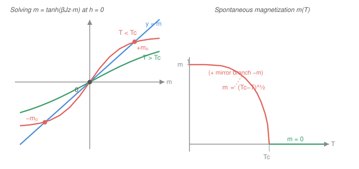

# Statistical Mechanics · Lesson 5.3: The Ising model and mean-field theory

> ⏱ ~15 min · Module 5: Interactions, phase transitions, and critical phenomena · Builds on: [5.2 Phase transitions and coexistence](#/lesson/stat-mech/05-02-phase-transitions-clausius-clapeyron.md), [3.1 The Boltzmann factor](#/lesson/stat-mech/03-01-canonical-ensemble-boltzmann-factor.md) · Unlocks: 5.4 (critical exponents & universality), 5.5 (renormalization group)

## Why this matters

A magnet has no built-in "north." Cool a piece of iron below 770 °C and it spontaneously picks a direction to magnetize — one of two equally good options, chosen for no reason. That is **spontaneous symmetry breaking**, and above the same temperature it vanishes: the magnetization is exactly zero. Somewhere in between sits a sharp **critical point** where a bulk property switches on from nothing.

The **Ising model** is the simplest system that does this, and it became *the* paradigm of statistical mechanics: the same math describes liquid–gas criticality, alloy ordering, and neural nets. We can't solve it exactly except in special cases, so we build the workhorse approximation — **mean-field theory** — that turns an impossibly coupled problem into a single self-consistent spin. It gets the *existence* of the transition right, predicts a critical temperature, and hands us our first **critical exponents**. This is the machinery behind Boss Problem 5.

## The idea

Put an arrow at every site of a grid; each arrow is either up ($+1$) or down ($-1$). Neighboring arrows lower their energy by pointing the *same* way (that's ferromagnetism). So energy alone wants a frozen, all-aligned block — perfect order. But temperature is a disorder machine: at high $T$, entropy wins and the arrows scramble to random, with equal up and down, so the average points nowhere. The fight between **energy (order)** and **entropy (disorder)** is the whole story, and a phase transition is the temperature where the winner flips.

Why is this hard? Because each spin's fate depends on its neighbors, whose fates depend on *their* neighbors — the sum over configurations doesn't factor. The **mean-field trick** cuts the knot with one bold move: stop tracking each neighbor individually and replace every neighbor by the *average* spin $m$. Now a spin no longer talks to fluctuating neighbors; it just sits in a steady **effective field** made of the crowd's average opinion. Every spin becomes independent — a lone two-state system. The catch: the average that a spin responds to must equal the average it helps produce. That consistency requirement is the equation we solve.

## The formal version

**The Ising Hamiltonian.** Spins $s_i = \pm 1$ live on a lattice; the energy of a configuration is

$$H = -J \sum_{\langle ij\rangle} s_i s_j - h\sum_i s_i, \qquad J > 0.$$

Here $\langle ij\rangle$ runs over nearest-neighbor pairs, $J$ is the coupling, and $h$ is an external field (in energy units). *In words:* aligned neighbors ($s_i s_j = +1$) cost $-J$, so alignment is favored; the field $h$ tugs every spin toward its sign. The observable we care about is the **magnetization per spin** $m = \langle s_i\rangle$, the **order parameter**: nonzero means the system has picked a direction.

**The mean-field decoupling.** Write each spin as its average plus a fluctuation, $s_j = m + \delta s_j$, and drop the product of two fluctuations $\delta s_i\,\delta s_j$ (assumed small). The interaction term collapses to a single spin in an effective field:

$$h_{\text{eff}} = h + Jz\,m,$$

where $z$ is the **coordination number** (nearest neighbors per site). *In words:* a spin no longer feels $z$ jittery neighbors — it feels one smooth field equal to the external field plus the pull of $z$ neighbors all sitting at the average $m$.

**The self-consistency equation.** Each spin is now an independent two-state system in field $h_{\text{eff}}$, so its average is $\langle s\rangle = \tanh(\beta h_{\text{eff}})$ (exactly the paramagnet of the Flashback). But $\langle s\rangle$ *is* $m$, so:

$$\boxed{\,m = \tanh\!\big(\beta(Jz\,m + h)\big)\,}, \qquad \beta = \frac{1}{k_B T}.$$

*In words:* the average opinion each spin responds to must be the average opinion it produces. $m$ appears on both sides — you solve for it, and that is where the physics hides.

**Critical temperature (at $h=0$).** Set $h=0$: $m = \tanh(\beta Jz\,m)$. There is always the trivial root $m=0$. A *nonzero* root appears exactly when the $\tanh$ curve leaves the origin steeper than the line $y=m$ — i.e. when its slope there exceeds 1:

$$\left.\frac{d}{dm}\tanh(\beta Jz\,m)\right|_{m=0} = \beta Jz > 1 \;\Longleftrightarrow\; T < T_c, \qquad \boxed{\,k_B T_c = Jz\,}.$$

*In words:* order switches on precisely when the coupling times the number of neighbors beats thermal energy. More neighbors ($z$) or stronger coupling ($J$) → higher $T_c$.

**Near $T_c$ (small $m$).** Expand $\tanh x = x - \tfrac13 x^3 + \cdots$ with $x = \beta Jz\,m = (T_c/T)m$. Writing $a \equiv \beta Jz = T_c/T$,

$$m = a\,m - \tfrac13 a^3 m^3 \;\Rightarrow\; m^2 = \frac{3(a-1)}{a^3} \approx 3\,\frac{T_c - T}{T_c}\quad(a\to 1),$$

so the order parameter turns on as

$$\boxed{\,m \approx \sqrt{3}\left(\frac{T_c - T}{T_c}\right)^{1/2}\!,\qquad \beta_{\text{exp}} = \tfrac12\,.}$$

*In words:* just below $T_c$ the magnetization grows like a square root — infinitely steeply at first, then leveling. The exponent $\beta_{\text{exp}} = \tfrac12$ is our first **critical exponent** (subscripted to avoid clashing with $\beta = 1/k_BT$).

## Picture

The self-consistency equation is a fixed-point problem: plot the line $y=m$ against the curve $y=\tanh(\beta Jz\,m)$ and read off where they cross. Above $T_c$ the curve is too shallow and the only crossing is $m=0$; below $T_c$ it steepens and two new crossings $\pm m_0$ appear — the system spontaneously magnetizes, sign chosen at random. Sweeping temperature traces the order parameter $m(T)$: zero above $T_c$, rising as $(T_c-T)^{1/2}$ below.

## Worked examples

**Example 1 (mechanical — critical temperatures and a spin just below).** For a 2D square lattice each site has $z=4$ neighbors, so $k_B T_c = 4J$; for a simple-cubic lattice $z=6$, giving $k_B T_c = 6J$. More neighbors, more peer pressure, higher $T_c$ — exactly as the formula says.

Now take the square lattice at $T = 0.96\,T_c$ and find $m$. Since we're close to $T_c$, $m$ is small and the cubic expansion applies:

$$m \approx \sqrt{3\cdot\frac{T_c - T}{T_c}} = \sqrt{3\,(0.04)} = \sqrt{0.12} \approx 0.35.$$

So a 4% drop below $T_c$ already produces a 35% magnetization — the square-root's vertical launch off $T_c$. (The exact root of $m=\tanh(a m)$ is $\approx 0.34$ here; the expansion is trustworthy only in this near-$T_c$ window.)

**Example 2 (why you'd care — the exponent is the point).** Melt the specifics: change $J$, change the lattice, change $z$ — every one of these shifts $T_c$, but none of them changes the *exponent* $\tfrac12$. Rewrite the result with the reduced temperature $t \equiv (T_c-T)/T_c$:

$$m \approx \sqrt{3}\;t^{\,1/2}.$$

The prefactor $\sqrt3$ and the location $T_c$ are non-universal (they know about $J$, $z$, the lattice). The power $\tfrac12$ is **universal within mean-field theory** — it's the same for the mean-field magnet, the mean-field liquid–gas transition (van der Waals near its critical point, [5.1](#/lesson/stat-mech/05-01-virial-van-der-waals.md)), and any other mean-field order parameter. That an exponent can be shared by microscopically unrelated systems is the seed of **universality** ([5.4](#/lesson/stat-mech/05-04-critical-exponents-universality.md)) and the reason the renormalization group ([5.5](#/lesson/stat-mech/05-05-renormalization-group.md)) exists.

## Watch out

- You might think mean-field theory is exact once $N$ is large. It isn't — it *neglects correlations* (the $\delta s_i\,\delta s_j$ term), which is precisely what dominates near $T_c$. Consequences: it **overestimates $T_c$** (real neighbors fluctuate, so they push less than a rigid average), and it gets the exponents wrong in low dimensions. The exact 2D solution (Onsager) gives $k_B T_c \approx 2.27\,J$, not the mean-field $4J$, and $\beta_{\text{exp}} = \tfrac18$, not $\tfrac12$.
- You might think every dimension has a transition. In **1D there is none** ($T_c = 0$): a single wrong bond costs only $2J$ but can sit anywhere along the chain, so entropy always destroys order at any $T>0$. Mean-field's $k_B T_c = Jz = 2J$ in 1D is simply *false* — a blunt warning that ignoring fluctuations can invent a phase transition that doesn't exist.
- You might read $m = \tanh(\beta Jz\,m)$ as "$m$ equals a function of $m$, so just iterate." Fine for finding roots, but don't forget the $m=0$ root is always present and, below $T_c$, is **unstable** — the system rolls off it to $\pm m_0$. Stability comes from minimizing the free energy, not from the self-consistency equation alone.

## One-liner

> Replace each spin's jittery neighbors by their average and every spin decouples into a two-state system in an effective field — self-consistency then gives $m=\tanh(\beta Jz\,m)$, a critical point at $k_BT_c=Jz$, and the mean-field exponents $\beta_{\text{exp}}=\tfrac12$, $\gamma=1$.

## Problems

**P1 (🟢)** (a) A triangular lattice has $z=6$ and a 2D square lattice has $z=4$. Write $k_B T_c$ for each in units of $J$. (b) For the square lattice at $T = 0.75\,T_c$, decide whether a spontaneous $m\neq 0$ exists, and say how you know *without* solving the equation numerically.

**P2 (🟡)** Starting from $m=\tanh(\beta Jz\,m)$ at $h=0$: (a) derive the condition $k_B T_c = Jz$ from the slope of $\tanh$ at the origin, and (b) use $\tanh x \approx x - \tfrac13 x^3$ to show $m \propto (T_c - T)^{1/2}$ just below $T_c$, identifying the exponent.

**P3 (🔴, optional)** The **zero-field susceptibility** is $\chi = \left.\dfrac{\partial m}{\partial h}\right|_{h=0}$. Differentiate the full self-consistency equation $m=\tanh(\beta(Jzm+h))$ with respect to $h$ and, working **above** $T_c$ (where $m=0$), show that

$$\chi = \frac{1}{k_B(T - T_c)} \propto (T-T_c)^{-1},$$

so $\chi$ diverges at the critical point with exponent $\gamma = 1$. (This divergence — the system becoming infinitely responsive at $T_c$ — is the launch point for [5.4](#/lesson/stat-mech/05-04-critical-exponents-universality.md).)

Solutions

**P1** (a) $k_B T_c = Jz$, so triangular ($z=6$): $k_B T_c = 6J$; square ($z=4$): $k_B T_c = 4J$.
(b) A nonzero root exists iff the slope of $\tanh(\beta Jz\,m)$ at the origin exceeds 1, i.e. iff $\beta Jz = T_c/T > 1$, i.e. iff $T < T_c$. At $T = 0.75\,T_c < T_c$ the slope is $T_c/T = 1.33 > 1$, so the $\tanh$ curve leaves the origin steeper than the line $y=m$ and *must* recross it at some $m_0 > 0$ (and $-m_0$). A spontaneous magnetization exists — no numerical solve needed, just the slope comparison.

**P2** (a) At $h=0$, $m=\tanh(\beta Jz\,m)$. The line $y=m$ has slope 1; the curve $y=\tanh(\beta Jz\,m)$ has slope $\left.\frac{d}{dm}\tanh(\beta Jz\,m)\right|_0 = \beta Jz\,\mathrm{sech}^2(0) = \beta Jz$. A nonzero intersection is born exactly when the curve's initial slope passes through 1: $\beta Jz = 1$, i.e. $k_B T_c = Jz$. Above that slope ($T<T_c$) the curve overshoots the line and comes back to meet it; below ($T>T_c$) it stays under and only $m=0$ survives.

(b) Let $a \equiv \beta Jz = T_c/T$. With $x = a m$,
$$m = am - \tfrac13 (am)^3.$$
For $m\neq0$ divide by $m$: $1 = a - \tfrac13 a^3 m^2 \Rightarrow m^2 = \dfrac{3(a-1)}{a^3}$. Just below $T_c$, $a = T_c/T \to 1^{+}$, so $a^3 \to 1$ and $a - 1 = \dfrac{T_c-T}{T} \approx \dfrac{T_c-T}{T_c}$. Hence
$$m^2 \approx 3\,\frac{T_c-T}{T_c} \;\Rightarrow\; m \approx \sqrt3\left(\frac{T_c-T}{T_c}\right)^{1/2},$$
a square-root onset: $m \propto (T_c-T)^{\beta_{\text{exp}}}$ with $\beta_{\text{exp}} = \tfrac12$.

**P3** Differentiate $m=\tanh(\beta(Jzm+h))$ with respect to $h$. Using $\frac{d}{du}\tanh u = \mathrm{sech}^2 u = 1-\tanh^2 u$ and $\tanh(\beta(Jzm+h)) = m$:
$$\chi = (1 - m^2)\,\beta\big(Jz\,\chi + 1\big).$$
Above $T_c$ set $m=0$:
$$\chi = \beta(Jz\,\chi + 1) \;\Rightarrow\; \chi\,(1 - \beta Jz) = \beta \;\Rightarrow\; \chi = \frac{\beta}{1-\beta Jz}.$$
Now $\beta = \frac{1}{k_B T}$ and $\beta Jz = T_c/T$, so
$$\chi = \frac{1/(k_B T)}{1 - T_c/T} = \frac{1}{k_B T\,(1 - T_c/T)} = \frac{1}{k_B (T - T_c)} \propto (T - T_c)^{-1}.$$
So $\chi \to \infty$ as $T\to T_c^{+}$ with exponent $\gamma = 1$: the magnet becomes infinitely responsive to a whisper of field at criticality. (Below $T_c$ one keeps the $1-m^2$ factor and, using $m^2 \approx 3(T_c-T)/T_c$, finds $\chi \approx \frac{1}{2k_B(T_c-T)}$ — same exponent $\gamma=1$, with the famous mean-field amplitude ratio of 2 between the two sides.)

## Flashback

**From Lesson 3.1 (The canonical ensemble and the Boltzmann factor):** A single spin $s=\pm1$ sits in a field $b$, with energy $E(s) = -b\,s$ (so aligned, $s=+1$, is favored). Using Boltzmann factors, compute the partition function $Z$ and the average $\langle s\rangle$, and state the two limits $\beta b \to 0$ and $\beta b \to \infty$.

Solution

Two states with energies $E(\pm1) = \mp b$, so
$$Z = e^{\beta b} + e^{-\beta b} = 2\cosh(\beta b).$$
The average weights each $s$ by its Boltzmann factor:
$$\langle s\rangle = \frac{(+1)e^{\beta b} + (-1)e^{-\beta b}}{Z} = \frac{e^{\beta b}-e^{-\beta b}}{e^{\beta b}+e^{-\beta b}} = \tanh(\beta b).$$
Limits: as $\beta b \to 0$ (hot / weak field), $\langle s\rangle \to 0$ — thermal disorder wins, no net alignment. As $\beta b \to \infty$ (cold / strong field), $\langle s\rangle \to 1$ — the spin locks to the field. This *is* the mean-field single spin with $b = h_{\text{eff}} = h + Jzm$; setting $\langle s\rangle = m$ closes the loop into the self-consistency equation.

## Connections

- **Backward:** the self-consistency equation is nothing but the two-state paramagnet $\langle s\rangle = \tanh(\beta b)$ from [3.1](#/lesson/stat-mech/03-01-canonical-ensemble-boltzmann-factor.md), with the external field replaced by a field the spins generate themselves. Mean-field theory turns a many-body problem back into that one solvable spin.
- **Forward:** the exponents $\beta_{\text{exp}}=\tfrac12$ (magnetization) and $\gamma=1$ (susceptibility) are the raw material of [5.4](#/lesson/stat-mech/05-04-critical-exponents-universality.md), where we ask which are universal and which are artifacts of the mean-field approximation — and [5.5](#/lesson/stat-mech/05-05-renormalization-group.md) explains *why* fluctuations (the term we threw away) reshape them below four dimensions.
- **Sideways (same idea, different system):** the van der Waals gas of [5.1](#/lesson/stat-mech/05-01-virial-van-der-waals.md) is a mean-field theory of the liquid–gas transition — each molecule feels the *average* attraction of all the others, exactly the Weiss "molecular field" here. Both give $\beta_{\text{exp}}=\tfrac12$, the first hint that a magnet and a fluid can belong to the same universality class.
