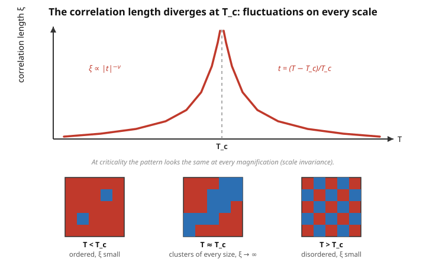

# Statistical Mechanics · Lesson 5.4: Critical exponents and universality

> ⏱ ~15 min · Module 5: Interactions, phase transitions, and critical phenomena · Builds on: [5.3 The Ising model and mean-field theory](#/lesson/stat-mech/05-03-ising-mean-field.md), [5.2 Phase transitions and coexistence](#/lesson/stat-mech/05-02-phase-transitions-clausius-clapeyron.md) · Unlocks: 5.5 The renormalization-group idea

## Why this matters

Heat water in a sealed cell to its critical point (374 °C, 221 bar) and something eerie happens: the sharp meniscus between liquid and vapor fades, and the whole cell turns milky — **critical opalescence**, scattering light like fog. Now take a completely different system — a magnet at its Curie temperature, or a brass alloy at its ordering transition — and near *its* critical point you find the *same* numbers describing how everything blows up. This is the deepest surprise in statistical mechanics: at a continuous phase transition, matter forgets what it is made of. A handful of **critical exponents** captures the whole singular behavior, and wildly different systems share them. Understanding why is the payoff of the whole module — and the reason the renormalization group ([5.5](#/lesson/stat-mech/05-05-renormalization-group.md)) had to be invented.

## The idea

Near a continuous transition, define the **reduced temperature**

$$t = \frac{T - T_c}{T_c},$$

a dimensionless measure of how far you are from criticality ($t=0$ is *at* $T_c$). The remarkable empirical fact: every thermodynamic quantity that misbehaves near $T_c$ does so as a **power law** in $t$ — a straight line on a log–log plot — and the *exponents* of those power laws are what matter, not the prefactors.

Why power laws? Because at $T_c$ the system loses its only length scale. Away from $T_c$, fluctuations are correlated over a finite distance $\xi$, the **correlation length** — beyond $\xi$, spins (or density fluctuations) don't know about each other. As $T \to T_c$, $\xi$ **diverges**: correlated patches appear on *every* length scale at once, from single atoms up to the size of the whole sample. A system with no characteristic length looks the same at every magnification — it is **scale invariant** — and the only functions that respect scale invariance are power laws (a power law is the one shape with no built-in scale: rescale $t$ and you just rescale the output). Critical opalescence is this made visible: when $\xi$ grows to the wavelength of light, the fluid scatters it strongly.

The second idea, **universality**, follows once you accept the first. If the physics at $T_c$ is controlled by fluctuations spanning millions of atoms, the microscopic details — which atom, which lattice, what the short-range forces are — get *averaged away*. What survives are only the coarsest features: the **dimensionality** $d$ of space and the **symmetry** of the order parameter (how many components it has, what it can be rotated into). Systems agreeing on those two things fall into the same **universality class** and share exponents exactly, no matter how different they look up close.

## The formal version

Let $m$ be the **order parameter** (magnetization for a magnet; density difference $\rho_{\text{liq}}-\rho_{\text{gas}}$ for a fluid), $h$ its conjugate field (magnetic field; pressure offset for the fluid), $\chi=(\partial m/\partial h)_{h\to 0}$ the **susceptibility**, $C$ the heat capacity, and $\xi$ the correlation length. Five exponents describe the approach to criticality:

$$
\begin{aligned}
\text{order parameter:} &\quad m \sim (-t)^{\beta} \quad (t<0),\\
\text{susceptibility:} &\quad \chi \sim |t|^{-\gamma},\\
\text{heat capacity:} &\quad C \sim |t|^{-\alpha},\\
\text{correlation length:} &\quad \xi \sim |t|^{-\nu},\\
\text{critical isotherm } (t=0): &\quad m \sim h^{1/\delta}.
\end{aligned}
$$

In words: as you slide toward $T_c$, the order shrinks to zero as a power $\beta$; the response $\chi$ and the correlations $\xi$ blow up (negative exponents $-\gamma$, $-\nu$); the heat capacity spikes as $-\alpha$; and *sitting exactly at* $T_c$, the order responds to a field as a fractional power $1/\delta$. The symbol "$\sim$" means "goes like, as $t\to 0$" — these are **asymptotic** statements about the leading singularity, not global fits.

**Mean-field (Landau / mean-field Ising) values.** Expanding the mean-field free energy $f(m) \approx \tfrac{1}{2}a\,t\,m^2 + \tfrac{1}{4}b\,m^4 - hm$ near $T_c$ (the Landau form you met in [5.3](#/lesson/stat-mech/05-03-ising-mean-field.md)) and minimizing gives, cleanly:

$$\boxed{\;\beta=\tfrac12,\qquad \gamma=1,\qquad \alpha=0,\qquad \nu=\tfrac12,\qquad \delta=3.\;}$$

Here $\alpha=0$ means the heat capacity does not diverge — it has a finite **jump** at $T_c$ (a discontinuity is the "zeroth power" case). Minimizing $f$: at $h=0$, $m^2 = -at/b$ so $m\sim(-t)^{1/2}$ ($\beta=\tfrac12$); at $t=0$, $bm^3=h$ so $m\sim h^{1/3}$ ($\delta=3$); and $\chi^{-1}=\partial^2 f/\partial m^2 = a t + 3bm^2 \sim |t|$, giving $\chi\sim|t|^{-1}$ ($\gamma=1$).

**Scaling relations.** The exponents are not independent. The **scaling hypothesis** posits that the singular part of the free energy density is a *generalized homogeneous function* of its two arguments $t$ and $h$:

$$f_s(t,h) = |t|^{\,2-\alpha}\,\Phi\!\left(\frac{h}{|t|^{\Delta}}\right),$$

where $\Phi$ is a universal **scaling function** and $\Delta$ (the "gap exponent") an extra exponent. In words: near criticality, $f_s$ has no independent dependence on $t$ and $h$ separately — it depends only on the single combination $h/|t|^{\Delta}$, so the whole two-variable surface collapses onto one curve $\Phi$. Differentiating this one assumption (problem P3) forces algebraic identities among the exponents. Two you should know:

$$\text{Rushbrooke:}\quad \alpha + 2\beta + \gamma = 2, \qquad\qquad \text{Widom:}\quad \gamma = \beta(\delta - 1).$$

In words: only **two** of the exponents are ever independent; give me any two and the rest are fixed. These hold for *every* universality class — mean-field or not.

## Picture

The spike is $\xi \sim |t|^{-\nu}$ — finite correlations on both sides, infinite exactly at $T_c$. The three snapshots are the physical content: away from $T_c$ the correlated patches are small (a few sites), but *at* $T_c$ you see red and blue clusters of every size nested together — the scale-invariant pattern that makes the exponents universal.

## Worked examples

**Example 1 (mechanical — mean-field exponents obey the scaling relations).** Take the boxed mean-field values and test both identities.

- Rushbrooke: $\alpha + 2\beta + \gamma = 0 + 2(\tfrac12) + 1 = 2.$ ✓
- Widom: $\beta(\delta-1) = \tfrac12(3-1) = 1 = \gamma.$ ✓

Mean field is internally consistent — it satisfies the scaling relations exactly. (It has to: the Landau free energy *is* of the homogeneous form above, with $\alpha=0$ and $\Delta = \beta\delta = \tfrac32$.) So the scaling relations alone can't tell you mean field is *wrong* — you need experiment for that.

**Example 2 (why you'd care — universality across three worlds).** The three-dimensional Ising universality class (scalar order parameter, $d=3$) contains, experimentally:

| System | Order parameter | $\beta$ | $\gamma$ |
|---|---|---|---|
| Uniaxial ferromagnet | magnetization | 0.33 | 1.24 |
| Liquid–gas critical point | $\rho_{\text{liq}}-\rho_{\text{gas}}$ | 0.33 | 1.24 |
| Binary alloy (order–disorder) | sublattice occupation | 0.33 | 1.24 |

Three systems with nothing microscopically in common — spins, molecules, atomic sites — yet the *same* two numbers, measured to two decimals. And those numbers are **not** the mean-field $\tfrac12$ and $1$. Mean field misses because it discards the very fluctuations that dominate at $T_c$; in $d=3$ those fluctuations are strong enough to shift every exponent. The measured coincidence across systems is the experimental fact that *demands* an explanation — supplied by the renormalization group. (Universality is, morally, a critical-phenomena cousin of the [central limit theorem](#/lesson/probability-theory/04-05-central-limit-theorem.md): sum enough independent things and the microscopic distribution washes out, leaving one universal shape.)

## Watch out

- **You might think $\alpha=0$ means "no singularity."** It only means "not a power-law divergence." Mean field gives a finite *jump* in $C$; the exact 2D Ising model has $\alpha=0$ realized as a *logarithmic* divergence. Both are "$\alpha=0$" — the exponent flags the leading power, and a log sits at the boundary between diverging and not.
- **You might think universality means two systems are identical near $T_c$.** No: $T_c$ itself, and the power-law *amplitudes* (prefactors), are non-universal — they depend on all the microscopic junk. Only the **exponents** and the **scaling function** $\Phi$ (and certain amplitude *ratios*) are universal. Same slope on the log–log plot, different intercept.
- **You might think mean field is just "approximate but qualitatively right."** It is exactly right — including the exponents — *above* the upper critical dimension $d\ge 4$, where fluctuations are subdominant. It is quantitatively wrong for the exponents *below* $d=4$ (so in the real $d=3$ world). The failure is dimension-dependent, not a uniform sloppiness.
- **Sign convention on $\beta$.** $m\sim(-t)^\beta$ is written with $-t$ because spontaneous order exists only *below* $T_c$ ($t<0$); above $T_c$ at $h=0$ the order parameter is simply zero. The $|t|$ in the other exponents is genuine absolute value — those quantities diverge from *both* sides.

## One-liner

> Near a critical point matter forgets its microscopic identity: a diverging correlation length makes it scale-invariant, so only dimension and symmetry survive — encoded in a few power-law exponents that scaling ties together, leaving just two free.

## Problems

**P1 (🟢)** The two-dimensional Ising model (solved exactly by Onsager) has $\beta = \tfrac18$, $\gamma = \tfrac74$, $\delta = 15$, and $\alpha = 0$ (logarithmic). Verify that these satisfy **both** the Rushbrooke relation $\alpha+2\beta+\gamma=2$ and the Widom relation $\gamma=\beta(\delta-1)$. (This is a good sanity check that the scaling relations are universality-class-independent.)

**P2 (🟡)** A Monte Carlo simulation of a three-dimensional magnet returns the spontaneous magnetization $m$ at four reduced temperatures below $T_c$:

| $-t$ | $m$ |
|---|---|
| 0.001 | 0.100 |
| 0.008 | 0.200 |
| 0.027 | 0.300 |
| 0.064 | 0.400 |

Extract the exponent $\beta$ from the log–log slope of $m$ versus $(-t)$. Is this system in the mean-field universality class? What does your answer say about whether mean field is trustworthy in $d=3$?

**P3 (🔴, optional)** Starting from the scaling form $f_s(t,h)=|t|^{2-\alpha}\,\Phi\!\big(h/|t|^{\Delta}\big)$, derive the **Rushbrooke** relation $\alpha+2\beta+\gamma=2$. (Hint: get $m=-\partial f_s/\partial h$ and $\chi=\partial m/\partial h$, evaluate each at $h=0$ using $\Phi'(0),\Phi''(0)=$ const, read off $\beta$ and $\gamma$ in terms of $\alpha$ and $\Delta$, then eliminate $\Delta$.) For extra credit, push to the critical isotherm to show the gap exponent is $\Delta=\beta\delta$ and recover Widom.

Solutions

**P1** Rushbrooke: $\alpha + 2\beta + \gamma = 0 + 2\cdot\tfrac18 + \tfrac74 = \tfrac14 + \tfrac74 = \tfrac{8}{4} = 2.$ ✓

Widom: $\beta(\delta-1) = \tfrac18(15-1) = \tfrac{14}{8} = \tfrac74 = \gamma.$ ✓

Both hold, even though these 2D exponents ($\beta=\tfrac18$, $\gamma=\tfrac74$) are nowhere near the mean-field values ($\tfrac12$, $1$) *or* the 3D values ($\approx 0.33$, $\approx1.24$). Three different universality classes, one set of scaling relations — exactly the point. (The "$\alpha=0$ logarithmic" is treated as the power-law exponent $0$ in the relation.)

**P2** Assume $m = A\,(-t)^\beta$, so $\ln m = \ln A + \beta \ln(-t)$: the log–log slope *is* $\beta$. Use the two endpoints:

$$\beta = \frac{\ln(m_4/m_1)}{\ln\!\big((-t)_4/(-t)_1\big)} = \frac{\ln(0.400/0.100)}{\ln(0.064/0.001)} = \frac{\ln 4}{\ln 64} = \frac{\ln 4}{3\ln 4} = \frac{1}{3}.$$

(Since $64 = 4^3$.) Check an interior point — $(-t)=0.008,\ m=0.200$: predicted $m = (0.008)^{1/3} = 0.2$ ✓; and $(0.027)^{1/3}=0.3$ ✓. So the data lie perfectly on a power law with

$$\beta \approx \tfrac13 \approx 0.33.$$

This is **not** the mean-field value $\beta=\tfrac12$ — it is the 3D Ising value (true value $\approx 0.326$). So the system is in the **3D Ising** class, and the takeaway is that **mean field is not trustworthy for critical exponents in $d=3$**: it predicts $m$ vanishing like $(-t)^{1/2}$, but the real order parameter dies off *more slowly*, like $(-t)^{1/3}$. Fluctuations, which mean field ignores, change the answer. (Had you run the same simulation in $d\ge 4$, you would have recovered $\beta=\tfrac12$.)

**P3** Write $x \equiv h/|t|^{\Delta}$, so $\partial x/\partial h = |t|^{-\Delta}$.

*Order parameter.* $m = -\dfrac{\partial f_s}{\partial h} = -|t|^{2-\alpha}\,\Phi'(x)\cdot|t|^{-\Delta} = -|t|^{\,2-\alpha-\Delta}\,\Phi'(x).$

At $h=0$, $x=0$, and $\Phi'(0)$ is a nonzero constant, so $m \sim |t|^{\,2-\alpha-\Delta}$. Matching to $m\sim(-t)^{\beta}$:

$$\beta = 2 - \alpha - \Delta. \qquad (\star)$$

*Susceptibility.* $\chi = \dfrac{\partial m}{\partial h} = -|t|^{\,2-\alpha-\Delta}\,\Phi''(x)\cdot|t|^{-\Delta} = -|t|^{\,2-\alpha-2\Delta}\,\Phi''(x).$

At $h=0$, $\Phi''(0)=$ const, so $\chi\sim|t|^{\,2-\alpha-2\Delta}$. Matching to $\chi\sim|t|^{-\gamma}$:

$$-\gamma = 2-\alpha-2\Delta \quad\Longrightarrow\quad \gamma = 2\Delta - 2 + \alpha. \qquad (\star\star)$$

*Eliminate $\Delta$.* From $(\star)$, $\Delta = 2-\alpha-\beta$. Substitute into $(\star\star)$:

$$\gamma = 2(2-\alpha-\beta) - 2 + \alpha = 4 - 2\alpha - 2\beta - 2 + \alpha = 2 - \alpha - 2\beta.$$

Rearranging: $\boxed{\alpha + 2\beta + \gamma = 2}$ — Rushbrooke, from the single homogeneity assumption. ✓

*Extra credit (Widom).* On the critical isotherm take $t\to 0$ at fixed $h$, so $x = h/|t|^{\Delta}\to\infty$. For $m$ to approach a finite, $t$-independent limit, $\Phi'(x)$ must grow as a power $\Phi'(x)\sim x^{\lambda}$. Then

$$m \sim |t|^{\,2-\alpha-\Delta}\big(h/|t|^{\Delta}\big)^{\lambda} = h^{\lambda}\,|t|^{\,2-\alpha-\Delta-\Delta\lambda}.$$

$t$-independence forces the exponent of $|t|$ to vanish: $2-\alpha-\Delta-\Delta\lambda = 0$, i.e. $\lambda = (2-\alpha-\Delta)/\Delta = \beta/\Delta$ using $(\star)$. But $m\sim h^{\lambda}=h^{1/\delta}$ means $\lambda = 1/\delta$, so

$$\frac{1}{\delta} = \frac{\beta}{\Delta} \quad\Longrightarrow\quad \Delta = \beta\delta.$$

Combining $\Delta=\beta\delta$ with $(\star)$ gives $\beta = 2-\alpha-\beta\delta$, i.e. $\alpha+\beta(1+\delta)=2$ (the Griffiths relation); subtracting Rushbrooke $\alpha+2\beta+\gamma=2$ leaves $\beta(\delta-1)=\gamma$ — Widom. ✓ Every scaling relation is a derivative of the one homogeneous ansatz.

## Flashback

**From Lesson 5.3 (The Ising model and mean-field theory):** In mean-field theory the magnetization satisfies the self-consistency equation $m = \tanh\!\big(\beta_{\!T} J z\, m\big)$ at zero field, where $\beta_{\!T}=1/k_BT$, $J$ is the coupling, and $z$ the number of neighbors. Show that a nonzero solution first appears when $k_B T_c = Jz$, and by expanding $\tanh$ for small $m$ just below $T_c$, recover the exponent $\beta = \tfrac12$ found in this lesson's boxed mean-field values.

Solution

Write $K \equiv \beta_{\!T} J z = Jz/k_BT$, so the equation is $m=\tanh(Km)$. Small-$m$ expansion: $\tanh(Km) = Km - \tfrac13(Km)^3 + \cdots$. A nonzero root branches off from $m=0$ exactly when the slope of the right side at the origin equals 1: $\frac{d}{dm}\tanh(Km)\big|_0 = K = 1$. So the threshold is $K=1$, i.e.

$$\frac{Jz}{k_B T_c} = 1 \quad\Longrightarrow\quad k_B T_c = Jz.$$

Just below $T_c$, keep the cubic term:

$$m = Km - \tfrac13 K^3 m^3 \;\Longrightarrow\; m\big(1 - K + \tfrac13 K^3 m^2\big)=0 \;\Longrightarrow\; m^2 = \frac{3(K-1)}{K^3}.$$

Near $T_c$, $K = T_c/T \approx 1$, and $K - 1 = \frac{T_c - T}{T} \approx -t$ (with $t=(T-T_c)/T_c$). With $K^3\to 1$,

$$m^2 \approx 3(-t) \quad\Longrightarrow\quad m \approx \sqrt{3}\,(-t)^{1/2}.$$

So $m\sim(-t)^{\beta}$ with $\beta = \tfrac12$ — matching the boxed mean-field exponent, and the value P2 showed is *wrong* in real 3D. ✓

## Connections

- **Backward:** the mean-field free energy and $T_c$ come straight from [5.3](#/lesson/stat-mech/05-03-ising-mean-field.md); the susceptibility $\chi$ is a **response function** and, by the fluctuation–response link of [3.3](#/lesson/stat-mech/03-03-fluctuations-ensemble-equivalence.md), its divergence *is* the divergence of order-parameter fluctuations — the same physics as the diverging $\xi$.
- **Forward:** [5.5 The renormalization group](#/lesson/stat-mech/05-05-renormalization-group.md) explains *why* the scaling hypothesis holds and *computes* the non-mean-field exponents by literally implementing the "look the same at every magnification" idea as a flow in coupling space, with universality classes emerging as its fixed points.
- **Sideways (fluids):** the liquid–gas critical point of the [van der Waals gas (5.1)](#/lesson/stat-mech/05-01-virial-van-der-waals.md) sits in the *same* Ising class as the uniaxial magnet — the order parameter $\rho_{\text{liq}}-\rho_{\text{gas}}$ plays the role of $m$, and van der Waals (a mean-field theory) predicts $\beta=\tfrac12$, wrong for the same reason.
- **Sideways (probability):** universality echoes the [central limit theorem](#/lesson/probability-theory/04-05-central-limit-theorem.md) — microscopic details wash out under aggregation, leaving a universal limiting form determined only by coarse features (there, finite variance; here, dimension and symmetry).
