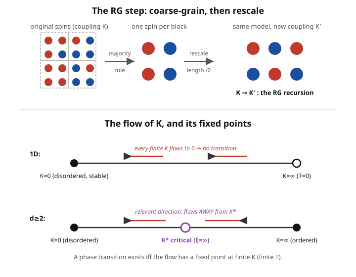

# Statistical Mechanics · Lesson 5.5: The renormalization-group idea

> ⏱ ~15 min · Module 5: Interactions, phase transitions, and critical phenomena · Builds on: [5.3 The Ising model and mean-field theory](#/lesson/stat-mech/05-03-ising-mean-field.md), [5.4 Critical exponents and universality](#/lesson/stat-mech/05-04-critical-exponents-universality.md) · Unlocks: Module 6 (Brownian motion and the arrow of time)

## Why this matters

[5.4](#/lesson/stat-mech/05-04-critical-exponents-universality.md) left you with a miracle and a wall. The miracle: **universality** — a magnet, a fluid at its liquid–gas critical point, and a binary alloy all share the *same* critical exponents, despite having nothing microscopically in common. The wall: at the critical point the correlation length $\xi$ diverges, so fluctuations exist on *every* length scale at once. There is no small parameter, no single dominant scale to expand around — ordinary perturbation theory has nothing to grab. Mean-field theory ([5.3](#/lesson/stat-mech/05-03-ising-mean-field.md)) dodges this by ignoring fluctuations, and pays for it with wrong exponents below four dimensions.

The renormalization group (RG) is Kadanoff and Wilson's answer to both at once. It doesn't try to solve all scales simultaneously — it handles them **one scale at a time**, turning "infinitely many coupled scales" into a *flow* through the space of possible theories. Universality and the exponents both drop out of the geometry of that flow. This is one of the deepest ideas in physics; we treat it conceptually, but the concept is the whole prize.

## The idea

At criticality the system looks the same at every magnification — blur a critical Ising snapshot and squint, and the blurred picture is statistically identical to the original. **Scale invariance.** RG makes that literal.

Take a spin lattice with coupling $K = \beta J$ (dimensionless "interaction strength"). Do two moves:

1. **Coarse-grain.** Group spins into blocks — say $2\times 2$ — and replace each block by a *single* effective spin, e.g. by majority rule. You've thrown away the short-wavelength detail and kept the block's net tendency.
2. **Rescale.** The blocked lattice has half the spacing removed; shrink all lengths by the block factor $b=2$ so it's a lattice just like the one you started with — same *form*, but with a **new** coupling $K'$.

Repeat. Each pass maps $K \to K' \to K'' \to \cdots$: a trajectory through coupling space, the **RG flow**. The rule $K' = R(K)$ is the **recursion relation**.

Now watch the correlation length. Measured in lattice spacings, it *shrinks* by the block factor every step: $\xi \to \xi/b$. Two special things can happen:

- If $\xi$ is **finite**, coarse-graining makes it smaller and smaller — the system flows *toward* looking totally disordered ($\xi\to 0$) or totally ordered. Details wash away.
- If $\xi = \infty$ (exactly critical), then $\xi/b = \infty$ still — the system is **unchanged** by the RG step. It sits at a **fixed point** $K^*$ of the flow, $R(K^*)=K^*$. Scale invariance *is* a fixed point.

So the critical point is a fixed point of the RG. And universality is now almost obvious: near $K^*$, most microscopic knobs are **irrelevant** — they shrink under the flow and vanish — so every system in the neighborhood is dragged to the *same* fixed point and inherits the *same* critical behavior. The junk washes out; the fixed point remembers only what matters.

## The formal version

**Recursion relation and fixed point.** Coarse-graining by factor $b$ induces a map on the couplings,

$$K' = R(K), \qquad \text{with a fixed point } K^*=R(K^*).$$

In words: RG is a discrete dynamical system on the space of coupling constants; a critical point is where that system sits still.

**Correlation length.** Lengths shrink by $b$ each step, so

$$\xi(K') = \frac{\xi(K)}{b}.$$

In words: coarse-graining literally rescales the ruler. At a fixed point this forces $\xi = \xi/b$, whose only solutions are $\xi=0$ (trivial fixed points: fully ordered or fully disordered) or $\xi=\infty$ (a **critical** fixed point).

**Linearize the flow.** Near $K^*$, write $K = K^* + \delta K$. To first order,

$$\delta K' = \lambda\,\delta K, \qquad \lambda = \left.\frac{dR}{dK}\right|_{K^*}.$$

With several couplings this becomes a matrix; diagonalize it, and each eigen-direction (a **scaling variable** $u_i$) flows independently as $u_i' = \lambda_i\, u_i$. In words: change coordinates to the flow's natural axes, and along each axis a deviation just gets multiplied by an eigenvalue every step.

**Relevant vs. irrelevant.** Classify each direction by its eigenvalue:

- $\lambda_i > 1$: **relevant** — deviations *grow*, the flow runs *away* from $K^*$. You must tune these to zero to reach criticality. (Temperature $t=(T-T_c)/T_c$ and field $h$ are the two relevant couplings of the Ising class.)
- $\lambda_i < 1$: **irrelevant** — deviations *shrink*, the flow runs *into* $K^*$. They don't affect the critical exponents at all.
- $\lambda_i = 1$: marginal (rare; gives logarithmic corrections).

In words: relevant = you have to fine-tune it to be critical; irrelevant = it forgets itself. **Universality is exactly this:** microscopic differences between systems live in irrelevant directions, flow away, and leave every system at the same fixed point with the same relevant eigenvalues.

**Exponents from eigenvalues.** Write the thermal eigenvalue as $\lambda_t = b^{\,y_t}$. Demanding consistency between $t' = \lambda_t\, t$ and $\xi' = \xi/b$ with $\xi \sim |t|^{-\nu}$ (worked in P3) gives

$$\boxed{\;\nu = \frac{1}{y_t} = \frac{\ln b}{\ln \lambda_t}\;}$$

In words: the correlation-length exponent is *computed*, not guessed — it's the ratio of two logs, set entirely by how fast the temperature direction blows up under one RG step. Every critical exponent is fixed this way by the eigenvalues at the fixed point.

## Picture

Top: one RG step — block the spins by majority rule, rescale, and read off the new coupling $K'$. Bottom: the flow of $K$. In 1D every finite coupling flows to $K=0$ (disordered), so there is no finite-$K$ fixed point and no transition. In $d\ge 2$ a nontrivial fixed point $K^*$ appears; it is *unstable* (the temperature direction is relevant, arrows flow away), and that unstable fixed point **is** the critical point.

## Worked examples

**Example 1 (the exact 1D Ising decimation — a fixed-point census).** Take the 1D chain, energy $E=-J\sum_i s_i s_{i+1}$, coupling $K=\beta J$. Instead of blocking, use the cleanest coarse-graining: **decimation** — sum out every *other* spin. The partition function is $Z=\sum_{\{s\}}\prod_i e^{K s_i s_{i+1}}$. Focus on one spin $s_2$ sitting between its neighbors $s_1$ and $s_3$; the only factors touching it are $e^{K s_1 s_2 + K s_2 s_3}$. Sum over $s_2=\pm1$:

$$\sum_{s_2=\pm 1} e^{K s_2 (s_1+s_3)} = e^{K(s_1+s_3)} + e^{-K(s_1+s_3)} = 2\cosh\!\big(K(s_1+s_3)\big).$$

Removing $s_2$ leaves a *direct* interaction between $s_1$ and $s_3$. Demand that it look like an Ising bond, $A\,e^{K' s_1 s_3}$, for both cases of $s_1 s_3$:

$$\underbrace{s_1 s_3 = +1}_{s_1+s_3=\pm 2}:\;\; A e^{K'} = 2\cosh 2K, \qquad \underbrace{s_1 s_3 = -1}_{s_1+s_3=0}:\;\; A e^{-K'} = 2\cosh 0 = 2.$$

Divide the two equations — the constant $A$ cancels:

$$e^{2K'} = \cosh 2K \quad\Longrightarrow\quad \boxed{\,K' = \tfrac12\ln\cosh 2K\,}$$

That is the exact 1D recursion. Its fixed points $K^*=\tfrac12\ln\cosh 2K^*$:

- $K^*=0$: $\cosh 0 =1$, $\ln 1 = 0$. ✓ (the disordered, infinite-temperature point).
- $K^*=\infty$: for large $K$, $\cosh 2K \approx \tfrac12 e^{2K}$, so $K' \approx K - \tfrac12\ln 2 < K$. ✓ only in the strict $T=0$ limit.

And for **every** finite $K>0$, since $\cosh 2K < e^{2K}$, we get $K' = \tfrac12\ln\cosh 2K < K$: the coupling always *decreases*. The flow slides every finite $K$ down to $K=0$. There is **no nontrivial fixed point at finite $K$** — hence **no phase transition in the 1D Ising model at any $T>0$.** Order survives only at exactly $T=0$. This is exact, and it agrees with the transfer-matrix solution: a clean, honest RG result with zero approximation.

**Example 2 (why the eigenvalue is the whole ballgame).** Suppose a *2D* block-spin scheme with $b=2$ produces, near its nontrivial fixed point, a thermal eigenvalue $\lambda_t = 2$ (so $t$ doubles each step — relevant). Then

$$\nu = \frac{\ln b}{\ln \lambda_t} = \frac{\ln 2}{\ln 2} = 1.$$

This lands exactly on the *exact* 2D Ising value $\nu = 1$. Contrast mean-field theory, which gives $\nu = \tfrac12$ (from $\xi\sim|t|^{-1/2}$) regardless of dimension and is right only for $d\ge 4$. Same physical question, two philosophies: mean field *guesses away* the fluctuations; RG *computes* the exponent from how the temperature coupling grows under rescaling. (Real approximate schemes give $\lambda_t$ near, not exactly, $2$ — the point is that a single eigenvalue delivers the exponent.)

## Watch out

- You might think a "fixed point" means the system has stopped evolving in time or frozen physically. No — it means the *couplings* are unchanged under coarse-graining, i.e. the system is **scale-invariant** ($\xi=0$ or $\xi=\infty$). It's a statement about self-similarity across magnifications, not about dynamics.
- You might think "irrelevant" means "negligible / unimportant." It only means the coupling doesn't change the **critical exponents**. An irrelevant coupling can still shift $T_c$ and matter a great deal *away* from criticality — relevant/irrelevant is strictly about the flow *near the fixed point*.
- You might flip the inequality: relevant is eigenvalue $\lambda>1$ (grows, flows away, must be tuned), irrelevant is $\lambda<1$ (shrinks, flows in). The *stable* directions of the fixed point are the irrelevant ones; the critical point is *unstable* precisely because temperature is relevant.
- You might expect a phase transition wherever spins interact. The 1D verdict says otherwise: a transition needs a fixed point at *finite* coupling, and 1D short-range Ising simply hasn't got one.

## One-liner

> Coarse-grain a system over and over: the microscopic junk (irrelevant couplings) washes out, criticality is the fixed point where the picture stops changing ($\xi=\infty$), and the critical exponents are read straight off the eigenvalues of the flow near that point — $\nu = \ln b/\ln\lambda_t$.

## Problems

**P1 (🟢)** Near a critical fixed point, four scaling variables have RG eigenvalues (with block factor $b=2$): reduced temperature $t$ has $\lambda_t = 2.5$; magnetic field $h$ has $\lambda_h = 3.2$; a next-nearest-neighbor coupling $u$ has $\lambda_u = 0.6$; a lattice-anisotropy coupling $v$ has $\lambda_v = 0.4$. (a) Classify each as relevant or irrelevant. (b) How many knobs must you tune to place the system exactly at its critical point? (c) In two sentences, explain why two magnets with *different* microscopic $u$ and $v$ nonetheless share the same critical exponents.

**P2 (🟡)** Carry out the 1D Ising decimation yourself. Starting from summing out the middle spin, $\sum_{s_2=\pm1} e^{K s_2(s_1+s_3)}$, derive the recursion $K'=\tfrac12\ln\cosh 2K$, then find *all* fixed points $K^*\ge 0$ and state, with one line of reasoning, whether the 1D chain has a phase transition at $T>0$.

**P3 (🔴, optional)** Derive the exponent relation, then use it. (a) Assume that under one RG step the temperature scales as $t' = \lambda_t\, t$ and the correlation length as $\xi' = \xi/b$. Posit the scaling form $\xi(t) \sim |t|^{-\nu}$ and demand consistency to show $\nu = \ln b/\ln\lambda_t$. (b) A $b=3$ block scheme yields $\lambda_t = 3.0$ for a certain model. Find $\nu$, and comment on how this "replaces the mean-field guess" $\nu=\tfrac12$.

Solutions

**P1** (a) Relevant means $\lambda>1$ (grows, flows away): $t$ ($2.5$) and $h$ ($3.2$) are **relevant**. Irrelevant means $\lambda<1$ (shrinks, flows in): $u$ ($0.6$) and $v$ ($0.4$) are **irrelevant**.
(b) You must tune every relevant coupling to zero to sit on the fixed point, so **two** knobs — physically, set $T=T_c$ (kill $t$) and $h=0$ (kill $h$). The critical point is the codimension-2 surface where both relevant variables vanish.
(c) The differing microscopic couplings $u,v$ are irrelevant, so under repeated coarse-graining they shrink to zero and both magnets flow to the *same* fixed point. Sharing a fixed point means sharing its relevant eigenvalues $\lambda_t,\lambda_h$ — and since the exponents are determined by those eigenvalues alone, the two magnets have identical exponents. (This is universality.)

**P2** The middle spin $s_2$ appears only through $e^{Ks_1 s_2 + K s_2 s_3}$; summing it out:

$$\sum_{s_2=\pm1} e^{K s_2(s_1+s_3)} = e^{K(s_1+s_3)}+e^{-K(s_1+s_3)} = 2\cosh\!\big(K(s_1+s_3)\big).$$

Require this to equal an effective bond $A\,e^{K' s_1 s_3}$. The two possible values of $s_1 s_3$ give

$$s_1 s_3=+1:\; A e^{K'} = 2\cosh 2K, \qquad s_1 s_3=-1:\; A e^{-K'} = 2.$$

Dividing eliminates $A$: $e^{2K'}=\cosh 2K$, hence

$$K' = \tfrac12\ln\cosh 2K.$$

Fixed points solve $K^*=\tfrac12\ln\cosh 2K^*$. At $K^*=0$: $\tfrac12\ln\cosh 0 = \tfrac12\ln 1 = 0$ ✓. At $K^*\to\infty$: $\cosh 2K\approx\tfrac12 e^{2K}$ gives $K'\approx K-\tfrac12\ln 2$, equal to $K$ only as $K\to\infty$ ✓. There are the only two. For any finite $K>0$, $\cosh 2K=\tfrac{e^{2K}+e^{-2K}}{2}<e^{2K}$, so $K'=\tfrac12\ln\cosh 2K<K$: the coupling strictly decreases and the flow carries every finite $K$ down to $0$. **No fixed point at finite $K$ ⇒ no phase transition at any $T>0$**; order exists only at $T=0$ ($K=\infty$).

**P3** (a) Iterate the temperature map $n$ times: $t^{(n)}=\lambda_t^{\,n} t$, and $\xi^{(n)} = \xi/b^{\,n}$, i.e. $\xi(t) = b^{\,n}\,\xi\big(\lambda_t^{\,n} t\big)$ for every $n$. Insert $\xi\sim|t|^{-\nu}$:

$$|t|^{-\nu} = b^{\,n}\,\big|\lambda_t^{\,n} t\big|^{-\nu} = b^{\,n}\,\lambda_t^{-n\nu}\,|t|^{-\nu}.$$

Consistency for all $n$ requires $b^{\,n}\lambda_t^{-n\nu}=1$, i.e. $b=\lambda_t^{\nu}$. Taking logs, $\ln b = \nu\ln\lambda_t$, so

$$\nu = \frac{\ln b}{\ln \lambda_t}.$$

(b) With $b=3$, $\lambda_t=3.0$: $\nu = \ln 3/\ln 3 = 1$. Interpretation: mean-field theory *asserts* $\nu=\tfrac12$ by ignoring fluctuations — a fixed guess, blind to dimension, and wrong below $d=4$. RG instead *derives* $\nu$ from a measurable feature of the flow (how fast the temperature deviation grows per rescaling); feed it a different eigenvalue and you get a different, dimension-aware exponent. The guess becomes a computation.

## Flashback

**From Lesson 5.4 (Critical exponents and universality):** Near criticality the correlation length diverges as $\xi \sim |t|^{-\nu}$, with $t=(T-T_c)/T_c$. Measurements on a magnet give $\xi = 10$ nm at $t=10^{-2}$ and $\xi = 100$ nm at $t=10^{-3}$. (a) Extract $\nu$. (b) Name the property of $\nu$ that lets the *same* value describe a completely different system, such as a fluid near its liquid–gas critical point.

Solution

(a) Take the ratio of the two measurements to cancel the unknown prefactor:

$$\frac{\xi_2}{\xi_1} = \left(\frac{t_2}{t_1}\right)^{-\nu} \;\Rightarrow\; \frac{100}{10} = \left(\frac{10^{-3}}{10^{-2}}\right)^{-\nu} = \big(10^{-1}\big)^{-\nu} = 10^{\nu}.$$

So $10 = 10^{\nu}$, giving $\nu = 1$ — the exact 2D Ising value, and exactly the number Example 2 and P3 produce from the RG eigenvalue.

(b) $\nu$ is a **universal** exponent: it depends only on the universality class (set by dimensionality and the order-parameter symmetry), not on microscopic details like the coupling strength, lattice type, or which molecule. A magnet and a liquid–gas critical point in the same class share it because — as this lesson shows — they flow to the same RG fixed point.

## Connections

- **Backward:** this closes the loop opened in [5.4](#/lesson/stat-mech/05-04-critical-exponents-universality.md) — universality was an observed miracle there; here it *is* the irrelevant couplings flowing away to a common fixed point. And it explains why the mean-field exponents of [5.3](#/lesson/stat-mech/05-03-ising-mean-field.md) were wrong in low dimensions: mean field is the flow's *Gaussian* fixed point, which stops being the relevant one below $d=4$.
- **Sideways (dynamical systems):** the RG is a discrete dynamical system on coupling space, and everything you know from phase-plane analysis transfers verbatim — fixed points, linearization about them, and eigenvalues classifying stability. "Relevant/irrelevant" is exactly "unstable/stable eigen-direction." The `ode-refresher` stability machinery is the same mathematics in different clothes.
- **Sideways (probability):** universality is not unique to physics. The [central limit theorem](#/lesson/probability-theory/04-05-central-limit-theorem.md) says wildly different microscopic distributions, once summed and rescaled, all flow to the *same* Gaussian — the Gaussian is the attracting fixed point of a rescaling map on distributions, and the distribution's fine details are its irrelevant couplings. CLT is RG for adding random variables.
- **Forward:** Module 6 turns from equilibrium criticality to time — [Brownian motion and the Langevin equation](#/lesson/stat-mech/06-01-brownian-langevin.md) — where fluctuations across scales reappear as noise, and coarse-graining reappears as the passage from microscopic kicks to macroscopic diffusion.
