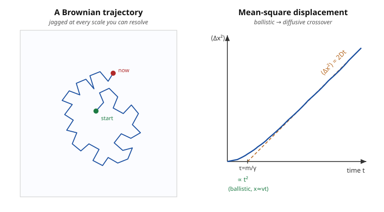

# Statistical Mechanics · Lesson 6.1: Brownian motion and the Langevin equation

> ⏱ ~15 min · Module 6: Nonequilibrium and connections · Builds on: [3.3 Fluctuations & ensemble equivalence](#/lesson/stat-mech/03-03-fluctuations-ensemble-equivalence.md), [3.4 The equipartition theorem](#/lesson/stat-mech/03-04-equipartition-theorem.md) · Unlocks: 6.2 Entropy, information & the arrow of time; Boss Problem 6

## Why this matters

Look at a pollen grain or a $1\,\mu\mathrm{m}$ plastic bead in water under a microscope and it never sits still — it jitters, endlessly, along a jagged path that never smooths out no matter how patiently you watch. In 1905 Einstein realized this visible dance is a *direct readout of invisible molecules*: the grain is being hammered by roughly $10^{21}$ water-molecule collisions per second, and the leftover imbalance shoves it around. His quantitative theory turned "atoms" from a convenient hypothesis into something you could **measure** (Perrin did, and got Avogadro's number — and a Nobel). But the deeper payoff is a principle: the very same molecular kicks that *push* the particle also *drag* on it, so noise and friction are two faces of one thing. That is the **fluctuation–dissipation theorem**, and it is one of the load-bearing ideas of modern physics — it reaches from this bead into condensed matter (electrical noise in resistors) and into finance (the stochastic calculus behind option pricing).

## The idea

You can't possibly track $10^{21}$ collisions per second. So don't. Split the water's total effect on the bead into two pieces you *can* handle:

- A **smooth, predictable part**: if the bead moves, the fluid resists — ordinary drag, pointing backward, proportional to velocity. This is *dissipation*: it bleeds the bead's energy away.
- A **jagged, unpredictable part**: even a bead sitting still gets kicked, because at any instant slightly more molecules hit one side than the other. This is *fluctuation*: a random force with no memory and no preferred direction.

Now the punchline that makes the whole subject work. These two pieces are not independent knobs. They come from *the same collisions*. Turn up the temperature and the molecules hit harder — that strengthens the random kicks, but it must *also* be consistent with the drag, because in equilibrium the bead has to end up with exactly the thermal energy equipartition assigns it, no more, no less. Requiring that self-consistency **locks the noise strength to the friction**. Friction is just the average of the kicks; the kicks are just the fluctuations around that average. One environment, one temperature, one relationship.

## The formal version

Write Newton's law for the bead (mass $m$, velocity $v$), lumping the fluid's effect into the two pieces above — this is the **Langevin equation**:

$$m\frac{dv}{dt} = -\gamma v + \xi(t).$$

*In words:* mass times acceleration equals a systematic drag $-\gamma v$ plus a random force $\xi(t)$. The **drag coefficient** $\gamma$ is set by the fluid; for a sphere of radius $a$ in a fluid of viscosity $\eta$ it is **Stokes' law**, $\gamma = 6\pi\eta a$.

The random force $\xi(t)$ is specified only by its statistics — we never know its actual value, only its averages:

$$\langle \xi(t)\rangle = 0, \qquad \langle \xi(t)\,\xi(t')\rangle = 2B\,\delta(t-t').$$

*In words:* the kicks have no preferred direction (mean zero), and no memory — a kick now tells you nothing about the kick an instant later, so the correlation is a spike at $t=t'$ (a $\delta$-function) with strength $2B$. This is **white noise**; $B$ measures how violent the kicks are. The $\delta$-function is an idealization: real collisions are correlated for the femtoseconds a molecule is in contact, but that is instantaneous next to everything the bead does.

**The fluctuation–dissipation theorem.** The drag $\gamma$ and the noise strength $B$ are not free. Demand that at long times the bead reaches thermal equilibrium — equipartition (from [3.4](#/lesson/stat-mech/03-04-equipartition-theorem.md)) fixes its kinetic energy at $\langle \tfrac12 m v^2\rangle = \tfrac12 k_B T$ — and that forces

$$\boxed{\,B = \gamma\,k_B T\,.}$$

*In words:* the strength of the fluctuations is set by the friction times the temperature. You cannot dial noise and drag separately; the same $\gamma$ that damps also drives. (We derive the boxed result in P3.) This is the paradigm of **fluctuation–response**, and it is exactly the same shape of statement as the energy-fluctuation identity $\mathrm{Var}(E) = k_B T^2 C_V$ from [3.3](#/lesson/stat-mech/03-03-fluctuations-ensemble-equivalence.md): a *fluctuation* (left side) is tied to a *response/dissipation* coefficient (right side) by a factor of temperature.

Two observables follow (derived in the worked examples and problems):

$$\langle v(0)\,v(t)\rangle = \frac{k_B T}{m}\,e^{-\gamma t/m}, \qquad \langle x^2(t)\rangle \xrightarrow{\ t\gg m/\gamma\ } 2Dt,\quad D = \frac{k_B T}{\gamma}.$$

The velocity **autocorrelation** decays on the relaxation time $\tau = m/\gamma$: the bead forgets its velocity after $\tau$. The mean-square displacement grows **linearly** in time (**diffusion**), with the **Einstein relation** $D = k_B T/\gamma$ — the diffusion constant and the friction both spring from the same $k_B T$.

## Picture

The left path is jagged at every scale you can resolve — zoom in and it looks the same (it is a random walk). The right panel is the whole story of the motion in one curve: for $t \ll \tau$ the bead hasn't been knocked off course yet, so it coasts, $x \approx vt$ and $\langle \Delta x^2\rangle \propto t^2$ (**ballistic**); for $t \gg \tau$ the velocity has been randomized many times and displacements add like a random walk, $\langle \Delta x^2\rangle = 2Dt$ (**diffusive**). The dashed diffusive asymptote, run backward, cuts the time axis at $\tau = m/\gamma$.

## Worked examples

**Example 1 (mechanical — the velocity autocorrelation).** Ignore the noise's detailed value and just solve the linear equation. With $\tau \equiv m/\gamma$, the Langevin equation $\dot v = -v/\tau + \xi/m$ integrates to

$$v(t) = v(0)\,e^{-t/\tau} + \frac{1}{m}\int_0^{t} e^{-(t-t')/\tau}\,\xi(t')\,dt'.$$

Multiply by $v(0)$ and average over the equilibrium ensemble. The bead's initial velocity $v(0)$ is uncorrelated with the *future* kicks $\xi(t')$ for $t'>0$, so $\langle v(0)\,\xi(t')\rangle = 0$ and the integral drops:

$$\langle v(0)\,v(t)\rangle = \langle v(0)^2\rangle\, e^{-t/\tau} = \frac{k_B T}{m}\,e^{-\gamma t/m},$$

using equipartition $\langle v(0)^2\rangle = k_B T/m$ at the start. *Reading it:* the bead's memory of its velocity fades exponentially over $\tau = m/\gamma$. For our $1\,\mu\mathrm{m}$ bead in water, $\tau \sim 10^{-7}\,\mathrm{s}$ — so on any timescale you can watch, the velocity is already fully scrambled and you only ever see the diffusive regime.

**Example 2 (why you'd care — diffusion from correlations).** Displacement is the time-integral of velocity, $x(t)-x(0) = \int_0^t v(s)\,ds$, so its mean square is a double integral of the autocorrelation from Example 1. At long times ($t \gg \tau$) the correlation is sharply peaked in $|s-s'|$, and the standard result (worked in P2) is

$$\langle [x(t)-x(0)]^2\rangle = 2D\big[\,t - \tau(1-e^{-t/\tau})\,\big] \xrightarrow{\ t\gg\tau\ } 2Dt, \qquad D = \frac{k_B T}{\gamma}.$$

That single formula contains *both* regimes: expand for $t \ll \tau$ and it gives $\langle \Delta x^2\rangle \approx (k_BT/m)\,t^2 = \langle v^2\rangle t^2$ (ballistic coasting); take $t \gg \tau$ and it gives $2Dt$ (diffusion) — exactly the crossover drawn in the Picture. The diffusion constant $D = k_B T/\gamma = k_B T/(6\pi\eta a)$ is a *measurable* number that contains $k_B$: watch a bead diffuse, and you weigh a molecule. That is precisely how Perrin extracted Avogadro's number.

## Watch out

- You might think the drag and the random force are independent physical effects you could tune separately. **They are the same collisions**: the drag is the *average* momentum transfer when the bead moves, the random force is the *fluctuation* around that average. The fluctuation–dissipation theorem $B=\gamma k_BT$ is the statement that they must be consistent — a viscous fluid ($\gamma \neq 0$) that produced *no* noise would violate equipartition, and is thermodynamically impossible.
- You might read $\langle \xi(t)\xi(t')\rangle = 2B\,\delta(t-t')$ and think the force is literally infinite. The $\delta$ says the *correlation time* is zero, not the force. What's physical is the integral $\int \xi\,dt$ (an impulse), which is perfectly finite — white noise only ever appears inside integrals.
- You might expect $\langle x^2\rangle \propto t^2$, "distance = speed × time." That's only the short-time ballistic answer, before the first velocity-randomization. Diffusion is *slower*: $\langle x^2\rangle \propto t$, so typical displacement grows like $\sqrt{t}$, not $t$. Doubling your patience gets you only $\sqrt{2}$ times as far.

## One-liner

> The same molecular collisions that drag on a particle also kick it, so friction and noise are locked together by $B=\gamma k_BT$ — and the leftover random walk diffuses at $D=k_BT/\gamma$.

## Problems

**P1 (🟢)** A bead of radius $a = 1\,\mu\mathrm{m}$ sits in water at $T = 300\,\mathrm{K}$ (viscosity $\eta = 1.0\times10^{-3}\,\mathrm{Pa\,s}$). Using Stokes' law $\gamma = 6\pi\eta a$ and the Einstein relation $D = k_B T/\gamma$ (take $k_B = 1.38\times10^{-23}\,\mathrm{J/K}$): (a) estimate $D$; (b) estimate the root-mean-square displacement along one axis in $1\,\mathrm{s}$ from $\langle \Delta x^2\rangle = 2Dt$. Is that visible under a microscope?

**P2 (🟡)** Starting from the *overdamped* Langevin equation (inertia negligible, so $0 = -\gamma\dot x + \xi(t)$, i.e. $\gamma\,\dot x = \xi$), derive $\langle x^2(t)\rangle = 2Dt$ and identify $D$. Use $\langle\xi(t)\xi(t')\rangle = 2B\,\delta(t-t')$ and the fluctuation–dissipation relation $B=\gamma k_BT$. (This is the fast, inertia-free route to the Einstein relation of P1.)

**P3 (🔴, optional)** Derive the fluctuation–dissipation theorem. From the full solution $v(t) = v_0 e^{-t/\tau} + \frac1m\int_0^t e^{-(t-t')/\tau}\xi(t')dt'$ (with $\tau=m/\gamma$, deterministic $v_0$), compute $\langle v(t)^2\rangle$ using the white-noise correlator, take $t\to\infty$, and show that equipartition $\langle \tfrac12 m v^2\rangle = \tfrac12 k_B T$ forces $B = \gamma k_B T$. Then confirm this reproduces the autocorrelation $\langle v(0)v(t)\rangle = (k_BT/m)e^{-\gamma t/m}$ at $t=0$.

Solutions

**P1** (a) Drag coefficient: $\gamma = 6\pi\eta a = 6\pi(1.0\times10^{-3})(1.0\times10^{-6}) = 1.885\times10^{-8}\,\mathrm{kg/s}$. Thermal energy: $k_BT = (1.38\times10^{-23})(300) = 4.14\times10^{-21}\,\mathrm{J}$. So

$$D = \frac{k_BT}{\gamma} = \frac{4.14\times10^{-21}}{1.885\times10^{-8}} \approx 2.2\times10^{-13}\ \mathrm{m^2/s} = 0.22\ \mu\mathrm{m^2/s}.$$

(b) $\langle\Delta x^2\rangle = 2Dt = 2(2.2\times10^{-13})(1) = 4.4\times10^{-13}\,\mathrm{m^2}$, so the rms displacement per axis is $\sqrt{4.4\times10^{-13}} \approx 6.6\times10^{-7}\,\mathrm{m} = 0.66\,\mu\mathrm{m}$. (In 3D, $\sqrt{6Dt}\approx 1.1\,\mu\mathrm{m}$.) In one second the bead wanders a bit less than its own diameter along each axis — easily resolved under a light microscope. This is exactly the order of magnitude Perrin measured, which is *why* the experiment could pin down $k_B$ (hence Avogadro's number).

**P2** In the overdamped limit, $\dot x = \xi(t)/\gamma$, so $x(t)-x(0) = \frac1\gamma\int_0^t \xi(t')\,dt'$. Then

$$\langle [x(t)-x(0)]^2\rangle = \frac{1}{\gamma^2}\int_0^t\!\!\int_0^t \langle \xi(t')\xi(t'')\rangle\,dt'\,dt'' = \frac{1}{\gamma^2}\int_0^t\!\!\int_0^t 2B\,\delta(t'-t'')\,dt'\,dt''.$$

The $\delta$ collapses one integral, leaving $\int_0^t dt' = t$:

$$\langle \Delta x^2\rangle = \frac{2B}{\gamma^2}\,t = \frac{2(\gamma k_BT)}{\gamma^2}\,t = \frac{2k_BT}{\gamma}\,t = 2Dt, \qquad D=\frac{k_BT}{\gamma}.$$

The Einstein relation drops out the instant you insert $B=\gamma k_BT$ — fluctuation strength $B$ over friction-squared, cleaned up by the FDT, *is* the diffusion constant.

**P3** Square the solution and average. The cross term $\propto \langle v_0\,\xi\rangle = 0$ (deterministic $v_0$, zero-mean noise), leaving

$$\langle v(t)^2\rangle = v_0^2 e^{-2t/\tau} + \frac{1}{m^2}\int_0^t\!\!\int_0^t e^{-(t-t')/\tau}e^{-(t-t'')/\tau}\langle\xi(t')\xi(t'')\rangle\,dt'\,dt''.$$

Insert $\langle\xi(t')\xi(t'')\rangle = 2B\,\delta(t'-t'')$; the $\delta$ sets $t''=t'$:

$$\langle v(t)^2\rangle = v_0^2 e^{-2t/\tau} + \frac{2B}{m^2}\int_0^t e^{-2(t-t')/\tau}\,dt' = v_0^2 e^{-2t/\tau} + \frac{2B}{m^2}\cdot\frac{\tau}{2}\big(1-e^{-2t/\tau}\big).$$

With $\tau = m/\gamma$, the second coefficient is $\frac{2B}{m^2}\cdot\frac{m}{2\gamma} = \frac{B}{m\gamma}$. As $t\to\infty$ the transient dies:

$$\langle v^2\rangle_{\infty} = \frac{B}{m\gamma}.$$

Equipartition requires $\tfrac12 m\langle v^2\rangle_\infty = \tfrac12 k_BT$, i.e. $\langle v^2\rangle_\infty = k_BT/m$. Equate:

$$\frac{B}{m\gamma} = \frac{k_BT}{m} \quad\Longrightarrow\quad \boxed{B=\gamma k_BT}.$$

So the noise strength is *not* independent — it is pinned by friction and temperature. Consistency check at $t=0$: the same machinery (Example 1) with $v_0$ drawn from equilibrium gives $\langle v(0)v(t)\rangle = \langle v^2\rangle e^{-t/\tau} = (k_BT/m)e^{-\gamma t/m}$, which at $t=0$ returns $\langle v^2\rangle = k_BT/m$ — equipartition again, self-consistently. ∎

## Flashback

**From Lesson 3.4 (The equipartition theorem):** A classical particle is trapped in a 3D isotropic harmonic potential, with energy $E = \dfrac{p_x^2+p_y^2+p_z^2}{2m} + \dfrac12 k\,(x^2+y^2+z^2)$. Using equipartition, give the mean energy $\langle E\rangle$ and the heat capacity $C_V$ for $N$ such independent particles.

Solution

Count the **quadratic** degrees of freedom in $E$: three momentum terms and three position terms — six quadratic modes. Equipartition assigns $\tfrac12 k_BT$ to each, so per particle $\langle E\rangle = 6\cdot\tfrac12 k_BT = 3k_BT$. For $N$ particles, $\langle E\rangle = 3N k_BT$, and

$$C_V = \frac{\partial \langle E\rangle}{\partial T} = 3N k_B.$$

(This is the Dulong–Petit law for a classical solid, one atom = one 3D oscillator. It's exactly the high-temperature limit of the Einstein solid from Boss Problem 3 — and just as there, it *fails* at low $T$ when the modes freeze out and equipartition no longer holds. The same equipartition input, $\langle \tfrac12 m v^2\rangle = \tfrac12 k_BT$ for the translational modes, is what fixed the noise strength in this lesson.)

## Connections

- **Backward:** the fluctuation–dissipation theorem $B=\gamma k_BT$ is the same *fluctuation ↔ response × temperature* pattern as $\mathrm{Var}(E)=k_BT^2 C_V$ from [3.3](#/lesson/stat-mech/03-03-fluctuations-ensemble-equivalence.md); the equilibrium velocity $\langle v^2\rangle = k_BT/m$ that closes every derivation here is straight equipartition from [3.4](#/lesson/stat-mech/03-04-equipartition-theorem.md). The random walk itself is the central-limit machinery of `probability-theory`: a sum of many independent kicks, so displacement is Gaussian with variance $\propto t$.
- **Forward:** this is the engine of **Boss Problem 6** (velocity autocorrelation → $\langle x^2\rangle = 2Dt$ → Einstein relation as the exemplar of fluctuation–dissipation). Next, [6.2](#/lesson/stat-mech/06-02-entropy-information-arrow.md) asks why this all runs *forward* in time — the arrow that the reversible microscopic mechanics does not by itself supply.
- **Sideways (finance & condensed matter):** the overdamped Langevin equation $\gamma\dot x = \xi$ is Brownian motion in the mathematician's sense — the $dW$ of the Itô stochastic calculus underneath the Black–Scholes option-pricing model. The identical theorem governs **Johnson–Nyquist noise**: a resistor $R$ at temperature $T$ generates voltage fluctuations $\langle V^2\rangle \propto R\,k_BT$ — same $B=\gamma k_BT$, with electrical resistance playing the role of mechanical friction.
