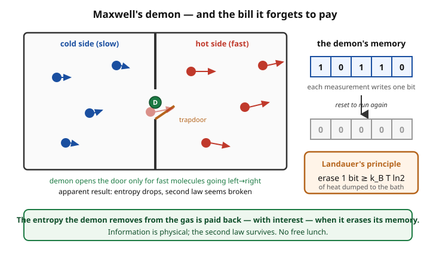

# Statistical Mechanics · Lesson 6.2: Entropy, information, and the arrow of time

> ⏱ ~15 min · Module 6: Nonequilibrium and connections · Builds on: [1.3 Entropy and the microcanonical ensemble](#/lesson/stat-mech/01-03-entropy-microcanonical.md), [3.1 The canonical ensemble and the Boltzmann factor](#/lesson/stat-mech/03-01-canonical-ensemble-boltzmann-factor.md) · Unlocks: nothing further — this is the final lesson of Statistical Mechanics.

## Why this matters

You have spent this course *computing* entropy — counting microstates, taking $\partial S/\partial E$, extracting $S$ from $\ln Z$. This lesson tells you what entropy *is*: it is missing information. The very same formula that Boltzmann carved on his tombstone is, letter for letter, the formula Shannon wrote down in 1948 to measure the number of bits you'd need to pin down a message. That coincidence is not an analogy — it is an identity, and it forces three things into the open at once. It reproduces every ensemble from a single optimization principle (Jaynes' MaxEnt). It exorcises Maxwell's 150-year-old demon, the being that seemed to break the second law, by showing that *information is physical* and erasing it costs real heat (Landauer). And it explains the deepest puzzle in physics — why time has a direction at all, when the microscopic laws don't. Entropy is where thermodynamics, information theory, and cosmology meet.

## The idea

Boltzmann's $S=k_B\ln\Omega$ assumed every accessible microstate was *equally* likely — the microcanonical world. But the canonical ensemble taught you that microstates generally *aren't* equally likely: $P(s)=e^{-\beta E_s}/Z$. So we need an entropy that works for any probability distribution over microstates, equal or not. Gibbs supplied it: $S=-k_B\sum_i p_i\ln p_i$. When all $\Omega$ probabilities are equal ($p_i=1/\Omega$), it collapses right back to $k_B\ln\Omega$ — Boltzmann is the flat special case.

Here is the reframing. Suppose I tell you the macrostate (the temperature, the volume) but not the microstate. How much do you *not* know? If only one microstate were possible, you'd know everything — zero missing information. If a million microstates were equally plausible, you'd be maximally in the dark. The quantity $-\sum p_i\ln p_i$ measures exactly that ignorance, and it's largest when the $p_i$ are spread out evenly, smallest (zero) when one outcome is certain. **Entropy is the amount of information about the microstate that the macrostate leaves out.** Heating a gas doesn't make it "messier" in some vague way; it literally increases the number of bits you'd need to specify which microstate it's in.

Once entropy is information, two paradoxes become solvable. Maxwell imagined a tiny demon sorting fast molecules from slow ones through a trapdoor, lowering entropy for free — but a sorter must *measure* and *remember*, and memory is physical stuff that eventually has to be erased, and erasure dumps heat. And the arrow of time — why entropy climbs but never falls, though $F=ma$ runs equally well backward — becomes a statement about *overwhelming probability* plus one brute fact: the universe started in a very low-entropy state.

## The formal version

**Gibbs entropy.** For a probability distribution $\{p_i\}$ over microstates,

$$\boxed{\,S=-k_B\sum_i p_i\ln p_i\,}$$

*In words:* average the "surprise" $-\ln p_i$ of each microstate, weighted by how often it occurs, and scale by Boltzmann's constant. For the uniform distribution $p_i=1/\Omega$ this is $-k_B\sum_i \tfrac1\Omega\ln\tfrac1\Omega = k_B\ln\Omega$ — **Boltzmann's formula is Gibbs' formula at equal probabilities.** Feed it the canonical $p_i=e^{-\beta E_i}/Z$ and it returns the thermodynamic entropy $S=(\langle E\rangle - F)/T$ you already know.

**MaxEnt reproduces the ensembles (Jaynes).** Turn the logic around: don't *assume* an ensemble — *derive* it by choosing the least-biased distribution consistent with what you know, i.e. the one that maximizes $S$ subject to your constraints.

- Constraint = normalization only ($\sum_i p_i=1$): maximizing $S$ gives $p_i=1/\Omega$, the **microcanonical** ensemble. *In words:* knowing nothing but "these states are accessible," the honest guess is equal odds.
- Constraint = normalization **plus** a fixed mean energy $\sum_i p_iE_i=\langle E\rangle$: a Lagrange multiplier $\beta$ appears on the energy constraint and out drops $p_i=e^{-\beta E_i}/Z$, the **canonical** ensemble (this is Problem 2). *In words:* the Boltzmann distribution is simply the maximally-noncommittal distribution with a given average energy — $\beta$ is the price of the energy constraint.

The Boltzmann factor was never an extra postulate; it is what maximal ignorance looks like once you fix an average.

**Shannon entropy — the same object in bits.** In information theory the missing information in a distribution is

$$H=-\sum_i p_i\log_2 p_i \quad[\text{bits}].$$

*In words:* $H$ is the average number of yes/no questions needed to identify the outcome — the length, in bits, of the shortest description. It is identical to the Gibbs formula up to the base of the log and the constant out front:

$$S = k_B\ln 2\;\cdot\; H,\qquad \text{so}\quad 1\ \text{bit}=k_B\ln 2,\quad 1\ \text{nat}=k_B.$$

*In words:* thermodynamic entropy and information entropy are the same quantity in different units — $k_B$ merely converts bits (or "nats," natural-log units) into joules per kelvin. Thermodynamic entropy **is** the missing information about the microstate given the macrostate.

**Landauer's principle.** Logically erasing one bit of information — resetting a memory from an unknown value to a definite $0$ — reduces the memory's state count from $2$ to $1$, i.e. lowers its entropy by $k_B\ln 2$. By the second law that entropy must go *somewhere*, so erasure dissipates at least

$$Q_{\text{erase}}\ge k_B T\ln 2$$

of heat to the environment. *In words:* forgetting is thermodynamically expensive; computation can in principle be reversible and free, but **irreversibly discarding information always costs $k_BT\ln 2$ per bit.** This is the hinge that saves the second law from Maxwell's demon (Problem 3): the demon can lower the gas's entropy, but only by filling its memory, and clearing that memory to sort again pays the debt back with interest.

**The arrow of time.** The microscopic laws are time-reversal symmetric: run any solution of Hamilton's (or Newton's, or Schrödinger's) equations backward and it is still a valid solution. Yet macroscopically entropy only rises. The resolution has two parts. (1) *Statistics:* there are overwhelmingly more high-entropy (many-microstate) macrostates than low-entropy ones, so a coarse-grained system almost certainly evolves toward larger $\Omega$ — not because reversal is forbidden, but because it is fantastically improbable (odds against are $\sim e^{-N}$ with $N\sim 10^{23}$). (2) *A boundary condition:* this only gives a *direction* because the universe began in a very special low-entropy state (the smooth early cosmos). The arrow of time is the shadow of that initial condition, unfolding through coarse-grained dynamics — not a fundamental asymmetry in the laws themselves.

## Picture

The left box is the apparent scandal: a demon watching molecules and opening the door only for the fast ones builds a temperature difference from nothing, seemingly lowering entropy without doing work. The right column is the resolution — the demon's memory fills with one bit per measurement, and to operate in a cycle it must eventually *erase* that memory, at a cost of at least $k_BT\ln 2$ per bit (Landauer). The entropy removed from the gas reappears as heat when the demon forgets. Information is physical.

## Worked examples

**Example 1 (mechanical — entropy of a two-state system, in both currencies).** A bit is unknown with probability $p$ of being $1$ and $1-p$ of being $0$. Its Shannon and Gibbs entropies are

$$H(p)=-p\log_2 p-(1-p)\log_2(1-p),\qquad S(p)=k_B\ln 2\cdot H(p).$$

At $p=\tfrac12$: $H=-\tfrac12\log_2\tfrac12-\tfrac12\log_2\tfrac12=1$ bit — maximal ignorance, exactly one yes/no question needed, and $S=k_B\ln 2$. At $p=0$ or $p=1$: $H=0$ (using $0\log 0=0$) — you already know the answer, zero missing information, $S=0$. In between, $H$ is a smooth cap peaking at the middle: a fair coin is the most informative to learn, a loaded one less so. Every two-level system in this course — a spin in a field, an atom with a ground and excited state — carries exactly this entropy with $p$ its excited-state probability.

**Example 2 (why you'd care — the price of one forgotten bit).** How much heat does erasing a single bit cost at room temperature, $T=300$ K?

$$Q_{\text{erase}}=k_BT\ln 2=(1.38\times10^{-23}\,\text{J/K})(300\,\text{K})(0.693)\approx 2.9\times10^{-21}\ \text{J}\approx 0.018\ \text{eV}.$$

Tiny — but not zero, and not optional. A laptop erasing $\sim10^{10}$ bits per second would dissipate a Landauer floor of $\sim3\times10^{-11}$ W from erasure alone; real chips run a factor $\sim10^{3}$–$10^{4}$ above this bound, but the bound is physics, not engineering, and experiments (2012 onward) have measured heat release right at $k_BT\ln 2$ when a single bit is erased. This number is also the *exact* work a Szilard engine extracts from one bit of information (Problem 3): information and $k_BT\ln 2$ of usable energy are interconvertible, and the second law is the accountant that makes the two ledgers balance.

## Watch out

- You might think Gibbs entropy $S=-k_B\sum p_i\ln p_i$ is a *different* entropy from Boltzmann's $k_B\ln\Omega$. It's the **same** entropy; Boltzmann is the special case of a flat distribution. Use Gibbs whenever the microstates aren't equally likely (any canonical or grand-canonical system).
- You might think "entropy is disorder." Prefer "entropy is missing information about the microstate given the macrostate." Disorder is a vague picture that misleads (a cold crystal and BEC are 'ordered' yet the statement that matters is how many microstates the macrostate allows); missing information is a precise, computable quantity — and it's what the formula actually measures.
- You might think Maxwell's demon really does break the second law and physics just waves its hands. The loophole is specific and quantitative: the demon is a *physical* information-processing device, its memory is a physical system, and Landauer's $k_BT\ln 2$-per-erasure closes the loophole exactly. The demon can win a round; it cannot win a cycle.
- You might think the arrow of time comes from irreversible microscopic laws. The laws are time-symmetric. The arrow comes from *coarse-graining* (you track macrostates, not microstates) **plus** the universe's low-entropy start. Fine-grained (true microstate) entropy is actually *constant* under Hamiltonian flow — that's Liouville's theorem; only the coarse-grained entropy rises.

## One-liner

> Entropy is missing information ($S=-k_B\sum p_i\ln p_i = k_B\ln 2\cdot H$): maximizing it births the ensembles, erasing it costs $k_BT\ln 2$ a bit, and its statistical climb — from a low-entropy start — is the arrow of time.

## Problems

**P1 (🟢)** Compute the Gibbs entropy $S=-k_B\sum_i p_i\ln p_i$ (and the Shannon entropy $H$ in bits) for: (a) a fair coin $p=(\tfrac12,\tfrac12)$; (b) a biased coin $p=(\tfrac34,\tfrac14)$; (c) a uniform distribution over $W$ equally likely states. Then show, by a Lagrange multiplier on the constraint $\sum_i p_i=1$, that among *all* distributions on $W$ states the uniform one maximizes $S$, with maximum value $S=k_B\ln W$.

**P2 (🟡)** Maximize $S=-k_B\sum_i p_i\ln p_i$ subject to two constraints, $\sum_i p_i=1$ and $\sum_i p_iE_i=\langle E\rangle$, using Lagrange multipliers. Show the result is the Boltzmann distribution $p_i\propto e^{-\beta E_i}$, and identify the multiplier enforcing the energy constraint as $\beta=1/k_BT$. (This is the Jaynes MaxEnt derivation of the canonical ensemble — compare it to the heat-bath derivation of [3.1](#/lesson/stat-mech/03-01-canonical-ensemble-boltzmann-factor.md).)

**P3 (🔴, optional)** *Szilard engine and Landauer.* A single gas molecule sits in a box of volume $V$ at temperature $T$, in contact with a heat bath. A demon measures which half the molecule is in — acquiring **one bit** — then inserts a frictionless piston at the midplane on the empty side and lets the molecule push it out in an isothermal expansion from $V/2$ back to $V$.
(a) Compute the work extracted. (Use the one-particle ideal gas $pV=k_BT$.)
(b) All that work came from a *single* heat bath, which seems to violate the Kelvin statement of the second law. State precisely what the demon still holds that lets the second law survive, and show that erasing it (Landauer) costs at least as much as the work gained, so the net extractable work over a full cycle is $\le 0$.

Solutions

**P1** Use $\ln$ for $S$ (nats, times $k_B$) and $\log_2$ for $H$ (bits); recall $S=k_B\ln 2\cdot H$.

(a) Fair coin:
$$H=-\tfrac12\log_2\tfrac12-\tfrac12\log_2\tfrac12=\tfrac12+\tfrac12=1\ \text{bit},\qquad S=k_B\ln 2\approx 0.693\,k_B.$$

(b) Biased coin $p=(\tfrac34,\tfrac14)$:
$$H=-\tfrac34\log_2\tfrac34-\tfrac14\log_2\tfrac14=-\tfrac34(-0.415)-\tfrac14(-2)=0.311+0.5=0.811\ \text{bits}.$$
$$S=-k_B\big[\tfrac34\ln\tfrac34+\tfrac14\ln\tfrac14\big]=-k_B[\tfrac34(-0.288)+\tfrac14(-1.386)]=0.562\,k_B.$$
Check: $k_B\ln 2\cdot H=0.693\cdot0.811\,k_B=0.562\,k_B$. ✓ The biased coin carries *less* entropy than the fair one — you already half-expect heads, so learning the outcome tells you less.

(c) Uniform over $W$ states, $p_i=1/W$:
$$S=-k_B\sum_{i=1}^{W}\tfrac1W\ln\tfrac1W=-k_B\cdot W\cdot\tfrac1W\cdot(-\ln W)=k_B\ln W,\qquad H=\log_2 W.$$
This is exactly Boltzmann's $S=k_B\ln\Omega$ with $\Omega=W$ — the uniform (microcanonical) case.

*Maximization.* Maximize $f=-k_B\sum_i p_i\ln p_i$ subject to $g=\sum_i p_i-1=0$. Form $\mathcal L=f-\lambda g$ and set $\partial\mathcal L/\partial p_i=0$:
$$\frac{\partial}{\partial p_i}\Big[-k_B\sum_j p_j\ln p_j-\lambda\big(\textstyle\sum_j p_j-1\big)\Big]=-k_B(\ln p_i+1)-\lambda=0.$$
Solving, $\ln p_i=-1-\lambda/k_B$, which is the **same constant for every $i$** — so all $p_i$ are equal, and normalization forces $p_i=1/W$. Because $-p\ln p$ is concave (its second derivative $-k_B/p_i<0$), this stationary point is a maximum. The maximal value is $S=k_B\ln W$: **the uniform distribution is the most ignorant one, and no distribution on $W$ states can carry more than $k_B\ln W$.** (This is precisely the microcanonical case of MaxEnt in P2 with no energy constraint.)

**P2** Maximize $S=-k_B\sum_i p_i\ln p_i$ subject to $\sum_i p_i=1$ and $\sum_i p_iE_i=\langle E\rangle$. Introduce a multiplier $\alpha$ for normalization and $\gamma$ for energy:
$$\mathcal L=-k_B\sum_i p_i\ln p_i-\alpha\Big(\sum_i p_i-1\Big)-\gamma\Big(\sum_i p_iE_i-\langle E\rangle\Big).$$
Stationarity in $p_i$:
$$\frac{\partial\mathcal L}{\partial p_i}=-k_B(\ln p_i+1)-\alpha-\gamma E_i=0\;\;\Longrightarrow\;\;\ln p_i=-1-\frac{\alpha}{k_B}-\frac{\gamma}{k_B}E_i.$$
Exponentiate:
$$p_i=\exp\!\Big[-1-\tfrac{\alpha}{k_B}\Big]\,\exp\!\Big[-\tfrac{\gamma}{k_B}E_i\Big]=\frac{1}{Z}\,e^{-\beta E_i},\qquad \beta\equiv\frac{\gamma}{k_B},$$
where the prefactor is fixed by normalization to be $1/Z$ with $Z=\sum_i e^{-\beta E_i}$. This is the **Boltzmann distribution**. To identify $\beta$ thermodynamically, use $S=(\langle E\rangle-F)/T$ with $F=-k_BT\ln Z$; differentiating the maximized $S$ with respect to $\langle E\rangle$ gives $\partial S/\partial\langle E\rangle=\gamma=k_B\beta$, and since $\partial S/\partial E=1/T$, we get $\beta=1/k_BT$. The energy-constraint multiplier *is* inverse temperature. The bath argument of 3.1 and this MaxEnt argument reach the identical distribution from opposite directions — one physical (contact with a reservoir), one inferential (least bias given a mean).

**P3** (a) The one molecule is an ideal gas with $N=1$: $pV=k_BT$, so $p=k_BT/V$ at volume $V$. Isothermal expansion from $V/2$ to $V$ extracts
$$W=\int_{V/2}^{V}p\,dV'=\int_{V/2}^{V}\frac{k_BT}{V'}\,dV'=k_BT\ln\frac{V}{V/2}=k_BT\ln 2.$$
Because the expansion is isothermal, internal energy is unchanged, so this work is drawn entirely as heat from the single bath: $Q_{\text{in}}=W=k_BT\ln 2$. **One bit of information has been converted into $k_BT\ln 2$ of work.**

(b) What the demon still holds is the **one bit of measurement outcome** stored in its memory (which half the molecule was in). The cycle is *not* complete: to sort again the demon must reset that memory to a standard state. Erasing one bit is a logically irreversible $2\to1$ compression of the memory's state space, lowering the memory's entropy by $k_B\ln 2$; by the second law this must be exported as heat $Q_{\text{erase}}\ge k_BT\ln 2$ (Landauer). Over the full cycle,
$$W_{\text{net}}=W_{\text{extracted}}-Q_{\text{erase}}\le k_BT\ln 2-k_BT\ln 2=0.$$
The engine extracts $k_BT\ln 2$ per bit and must spend at least $k_BT\ln 2$ per bit to forget — no net work, no perpetual motion. The Kelvin statement is saved not by forbidding the demon's measurement but by charging it for its memory: **information is a thermodynamic resource, and erasing it is where the bill comes due.**

## Flashback

**From Lesson 1.3 (Entropy and the microcanonical ensemble):** Take $N$ distinguishable two-state spins (each up or down), with exactly $M$ pointing up. The number of microstates is $\Omega=\binom{N}{M}$. Using Stirling's approximation ($\ln n!\approx n\ln n-n$), compute $S=k_B\ln\Omega$ in terms of the fraction $p=M/N$, and show it equals $N$ times the Gibbs/Shannon entropy of a *single* spin whose up-probability is $p$.

Solution

$\Omega=\dfrac{N!}{M!\,(N-M)!}$, so by Stirling (the $-n$ terms cancel because $N=M+(N-M)$):
$$\ln\Omega\approx N\ln N-M\ln M-(N-M)\ln(N-M).$$
Substitute $M=pN$ and $N-M=(1-p)N$:
$$\ln\Omega=N\ln N-pN\ln(pN)-(1-p)N\ln\big((1-p)N\big).$$
Expand each $\ln(\cdot N)=\ln(\cdot)+\ln N$; the $\ln N$ pieces sum to $N\ln N\,[p+(1-p)]=N\ln N$, cancelling the leading term:
$$\ln\Omega=-N\big[p\ln p+(1-p)\ln(1-p)\big].$$
Therefore
$$S=k_B\ln\Omega=-Nk_B\big[p\ln p+(1-p)\ln(1-p)\big]=N\cdot\Big(\!\underbrace{-k_B\big[p\ln p+(1-p)\ln(1-p)\big]}_{\text{Gibbs entropy of one spin}}\!\Big).$$
The microcanonical *counting* entropy of the whole system equals $N$ copies of the Gibbs entropy of a single spin's distribution $(p,\,1-p)$ — Boltzmann's $\ln\Omega$ and Gibbs' $-\sum p\ln p$ are literally the same number. (This is Example 1 with $p$ the up-fraction, and it maximizes at $p=\tfrac12$, giving $S=Nk_B\ln 2$ — one bit per spin, as it must.)

## Connections

- **Backward:** this closes the loop opened in [1.3](#/lesson/stat-mech/01-03-entropy-microcanonical.md) — $S=k_B\ln\Omega$ is now revealed as the flat-distribution corner of $S=-k_B\sum p_i\ln p_i$, and the Boltzmann factor of [3.1](#/lesson/stat-mech/03-01-canonical-ensemble-boltzmann-factor.md) is what MaxEnt hands you the moment you fix an average energy. The coarse-graining you first met in [1.1](#/lesson/stat-mech/01-01-mechanics-to-statistics.md) is exactly what makes entropy *rise* while Liouville's theorem keeps the fine-grained volume fixed.
- **Sideways (probability):** $-\sum p_i\ln p_i$ is the entropy of a distribution as defined in [`probability-theory`](#/course/probability-theory); the MaxEnt principle is the information-theoretic parent of the whole exponential family (Gaussian = MaxEnt at fixed variance, exponential = MaxEnt at fixed mean, Boltzmann = MaxEnt at fixed energy).
- **Sideways (mechanics):** the arrow-of-time puzzle rests on the time-reversibility of Hamilton's equations and the constancy of fine-grained phase-space volume — [Liouville's theorem](#/lesson/analytical-mechanics/03-02-phase-space-liouville.md). Reversibility of the microscopic laws is precisely why the arrow must come from *elsewhere* (statistics + a low-entropy boundary condition), not from the dynamics.
- **Forward (out of this course):** you now hold the full statistical-mechanics toolkit — you can write a partition function, extract every thermodynamic quantity from $\ln Z$, count quantum states to get Bose, Fermi, and Planck, estimate degeneracy pressures and condensation temperatures, analyze a phase transition through mean-field theory and universality, set up the Langevin equation, and read entropy as information. From here the natural next steps are quantum field theory (where the partition function becomes a path integral), nonequilibrium and transport theory (the Boltzmann equation in earnest), and condensed-matter physics (where the Ising and RG ideas of Module 5 come fully into their own). The bridge from microscopic mechanics to macroscopic thermodynamics is built — walk across it.
