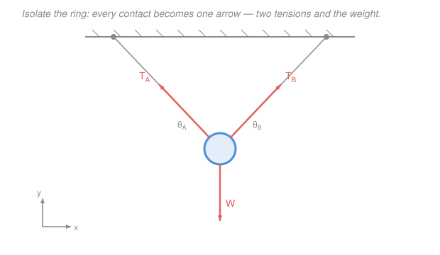

# Statics · Lesson 1.1: Forces as vectors & the free-body diagram

> ⏱ ~15 min · Module 1: Forces, moments & equilibrium · Builds on: [calc-refresher](../../calc-refresher/syllabus.md), vectors from [linalg-refresher](../../linalg-refresher/syllabus.md) · Unlocks: [1.2 Equilibrium of a particle](01-02-equilibrium-of-a-particle.md)

## Why this matters

Every statics problem you will ever solve — a shelf bracket, a crane boom, a bridge truss holding a train — starts the same way: you draw the object, alone, and mark every push and pull acting on it. Get that drawing right and the algebra is bookkeeping; get it wrong and no amount of algebra saves you. That drawing is the **free-body diagram (FBD)**, and the language it's written in is **vectors**. This lesson is the alphabet of the whole course.

## The idea

A force isn't just a number. Pushing a door with 50 N does nothing near the hinge and swings it wide at the handle, and pushing *toward* the hinge does nothing at all. So a force carries three pieces of information: **how hard** (magnitude), **which way** (direction), and **where** it acts (point of application). That's a vector, pinned to a spot — an arrow you can draw.

The one skill under everything else is **isolation**. Pick your body, mentally cut it free from the world, and ask: what is still touching it, and what is pulling on it from a distance? Every support you cut, every cable, every contact surface, gets *replaced by the force it was exerting*. Gravity, which touches nothing but acts everywhere, adds one arrow straight down: the weight. When the arrows are all drawn and nothing is left out, you have an FBD — and everything from here is $\sum \vec F = 0$.

To do arithmetic with these arrows we break each one into **components** along $x$ and $y$ (and $z$ in 3D). Adding forces then becomes adding numbers, one axis at a time — no protractor geometry, just algebra.

## The formal version

**A force as a vector.** In 2D, a force $\vec F$ of magnitude $F$ pointing at angle $\theta$ measured counterclockwise from the $+x$ axis splits into rectangular components

$$\vec F = F_x\,\hat i + F_y\,\hat j, \qquad F_x = F\cos\theta, \quad F_y = F\sin\theta,$$

where $\hat i,\hat j$ are the unit vectors along $x,y$. *In words: the shadow the arrow casts on the $x$-axis is $F\cos\theta$, on the $y$-axis is $F\sin\theta$.* Going the other way, from components back to magnitude and direction:

$$F = \sqrt{F_x^2 + F_y^2}, \qquad \theta = \arctan\!\left(\frac{F_y}{F_x}\right).$$

*In words: the magnitude is the length of the arrow (Pythagoras on its components); the angle is set by the ratio of the components* — and you must check the quadrant, since $\arctan$ can't tell $(−,−)$ from $(+,+)$.

**Adding forces.** The **resultant** of several forces is their vector sum, done component-by-component:

$$\vec R = \sum \vec F_i, \qquad R_x = \sum F_{ix}, \quad R_y = \sum F_{iy}.$$

*In words: to add arrows, add their $x$-parts to get the resultant's $x$-part, add their $y$-parts to get its $y$-part.* Then recover $R$ and its angle with the two boxed formulas above.

**3D: the position-vector method.** Often a force points *along a line* — a cable from point $A$ to point $B$ — and you're given the two endpoints, not an angle. Build the direction from the geometry. The position vector from $A$ to $B$ is

$$\vec r_{AB} = (x_B - x_A)\hat i + (y_B - y_A)\hat j + (z_B - z_A)\hat k,$$

its length is $|\vec r_{AB}| = \sqrt{(x_B-x_A)^2 + (y_B-y_A)^2 + (z_B-z_A)^2}$, and the **unit vector** along it is

$$\hat u = \frac{\vec r_{AB}}{|\vec r_{AB}|}.$$

A force of magnitude $F$ directed from $A$ toward $B$ is then

$$\boxed{\,\vec F = F\,\hat u = F\,\frac{\vec r_{AB}}{|\vec r_{AB}|}\,}$$

*In words: a unit vector is a pure direction (length 1) built by dividing a position vector by its own length; multiply it by the magnitude and you've painted the force in components without ever finding an angle.* This works in 2D too — it's just the component formulas in disguise.

## Picture

The ring (blue) is cut free of its cables. Each cable is replaced by a tension pulling the ring *toward* its anchor ($T_A$, $T_B$), and gravity adds the weight $W$ straight down. Three arrows, and the FBD is complete — that's the entire input to Lesson 1.2.

## Worked examples

**Example 1 (2D — resolve, then add).** A bracket bolt is pulled by two cables. Cable 1 exerts $F_1 = 200\,\text{N}$ at $\theta_1 = 30^\circ$ above the $+x$ axis; cable 2 exerts $F_2 = 150\,\text{N}$ at $\theta_2 = 120^\circ$. Find the resultant force on the bolt.

*Resolve each into components* ($F_x = F\cos\theta$, $F_y = F\sin\theta$):

$$\vec F_1 = 200\cos30^\circ\,\hat i + 200\sin30^\circ\,\hat j = 173.2\,\hat i + 100.0\,\hat j \ \text{N},$$
$$\vec F_2 = 150\cos120^\circ\,\hat i + 150\sin120^\circ\,\hat j = -75.0\,\hat i + 129.9\,\hat j \ \text{N}.$$

*Add component-by-component:*

$$R_x = 173.2 - 75.0 = 98.2\,\text{N}, \qquad R_y = 100.0 + 129.9 = 229.9\,\text{N}.$$

*Recover magnitude and direction:*

$$R = \sqrt{98.2^2 + 229.9^2} = \sqrt{62{,}497} \approx 250\,\text{N}, \qquad \theta = \arctan\!\frac{229.9}{98.2} \approx 66.9^\circ.$$

Both components are positive, so the resultant lands in the first quadrant — the raw $\arctan$ is already correct. The bolt feels a single $250\,\text{N}$ pull at $66.9^\circ$ above horizontal.

**Example 2 (3D — force along a cable).** A guy cable runs from the top of a pole at $A = (0, 0, 6)\,\text{m}$ down to a ground anchor at $B = (2, 3, 0)\,\text{m}$, carrying a tension of $F = 140\,\text{N}$. The cable pulls on the pole top (point $A$) *toward* $B$. Write this force as a Cartesian vector.

*Position vector from $A$ to $B$:*

$$\vec r_{AB} = (2-0)\hat i + (3-0)\hat j + (0-6)\hat k = 2\,\hat i + 3\,\hat j - 6\,\hat k \ \text{m}.$$

*Its length:*

$$|\vec r_{AB}| = \sqrt{2^2 + 3^2 + (-6)^2} = \sqrt{4 + 9 + 36} = \sqrt{49} = 7\,\text{m}.$$

*Unit vector, then the force:*

$$\hat u = \frac{1}{7}\left(2\,\hat i + 3\,\hat j - 6\,\hat k\right), \qquad \vec F = 140\,\hat u = \frac{140}{7}\left(2\,\hat i + 3\,\hat j - 6\,\hat k\right) = 40\,\hat i + 60\,\hat j - 120\,\hat k \ \text{N}.$$

The negative $\hat k$ component says the cable pulls the pole top downward, exactly as a taut guy wire should. *Check:* $\sqrt{40^2 + 60^2 + 120^2} = \sqrt{1600+3600+14400} = \sqrt{19{,}600} = 140\,\text{N}$ ✓ — the components rebuild the tension we started with.

## Watch out

- **You might think magnitude and direction fully specify a force.** For a *particle* (a point) they do. But for a body with size, *where* the force acts matters — a force at the door handle versus at the hinge does very different things. That "where" becomes the moment in Lesson 1.3; keep the point of application in your FBD even when the algebra of 1.2 ignores it.
- **You might reach for $\cos$ on the $x$-component by reflex.** $F_x = F\cos\theta$ only holds when $\theta$ is measured from the $x$-axis. If the problem hands you the angle from the *vertical*, then $F_x = F\sin\theta$ and $F_y = F\cos\theta$. Draw the angle before you write the formula.
- **You might draw forces the body exerts on the world.** An FBD shows only forces acting **on** the isolated body — the cable pulling on the ring, not the ring pulling on the cable (those are Newton's third-law partners, and they live on *different* diagrams). And never forget the weight: gravity touches nothing, so it's the arrow that's easiest to leave out.

## One-liner

> Isolate the body, replace every contact and the pull of gravity with one labeled arrow, then break each arrow into components — a free-body diagram turns a physical situation into vectors you can add.

## Problems

**P1 (🟢)** A rope drags a sled with a $250\,\text{N}$ force directed $25^\circ$ above the horizontal ground. Resolve it into a horizontal component $F_x$ and a vertical component $F_y$.

**P2 (🟡)** A cable is anchored to the ground at $B = (4, 0, 0)\,\text{m}$ and runs up to the top of a mast at $A = (0, 0, 3)\,\text{m}$, where it pulls with a tension of $200\,\text{N}$. The cable pulls on the mast top ($A$) toward $B$. Express the tension as a Cartesian vector $\vec F = F_x\hat i + F_y\hat j + F_z\hat k$, and verify its magnitude. *(This is exactly the input a 3D particle-equilibrium problem needs in [1.2](01-02-equilibrium-of-a-particle.md).)*

**P3 (🔴, optional)** A hook is pulled by two forces: $\vec F_1 = 300\,\text{N}$ along $+x$ and $\vec F_2 = 400\,\text{N}$ along $+y$. (a) Find the resultant's magnitude and direction. (b) What single force (magnitude and direction) would have to be added to hold the hook in equilibrium?

Solutions

**P1** With the angle measured from the horizontal, use $F_x = F\cos\theta$, $F_y = F\sin\theta$:

$$F_x = 250\cos25^\circ = 250(0.9063) \approx 226.6\,\text{N}, \qquad F_y = 250\sin25^\circ = 250(0.4226) \approx 105.7\,\text{N}.$$

*Check:* $\sqrt{226.6^2 + 105.7^2} = \sqrt{51{,}348 + 11{,}172} = \sqrt{62{,}520} \approx 250\,\text{N}$ ✓, and $\arctan(105.7/226.6) = 25^\circ$ ✓. The horizontal part (which actually moves the sled) is the larger of the two, as it should be for a shallow pull.

**P2** Position vector from $A$ to $B$ (pull is *toward* $B$):

$$\vec r_{AB} = (4-0)\hat i + (0-0)\hat j + (0-3)\hat k = 4\,\hat i - 3\,\hat k \ \text{m}, \qquad |\vec r_{AB}| = \sqrt{4^2 + 0^2 + (-3)^2} = \sqrt{25} = 5\,\text{m}.$$

Unit vector and force:

$$\hat u = \tfrac{1}{5}(4\,\hat i - 3\,\hat k), \qquad \vec F = 200\,\hat u = \frac{200}{5}(4\,\hat i - 3\,\hat k) = 160\,\hat i - 120\,\hat k \ \text{N}.$$

So $F_x = 160\,\text{N}$, $F_y = 0$, $F_z = -120\,\text{N}$. *Check:* $\sqrt{160^2 + 120^2} = \sqrt{25{,}600 + 14{,}400} = \sqrt{40{,}000} = 200\,\text{N}$ ✓. The $\hat j$ component is zero because both points share $y = 0$ — the cable lies in the $xz$-plane, and the vector method reports that automatically.

**P3** (a) Add components: $R_x = 300\,\text{N}$, $R_y = 400\,\text{N}$.

$$R = \sqrt{300^2 + 400^2} = \sqrt{90{,}000 + 160{,}000} = \sqrt{250{,}000} = 500\,\text{N}, \qquad \theta = \arctan\!\frac{400}{300} = 53.1^\circ \text{ above } +x.$$

(A 3-4-5 right triangle, scaled by 100.)

(b) To hold the hook still, the total force must be zero, so the added force — the **equilibrant** — must exactly cancel the resultant: same magnitude, opposite direction.

$$\vec F_3 = -\vec R = -300\,\hat i - 400\,\hat j \ \text{N}, \qquad |\vec F_3| = 500\,\text{N} \text{ at } 53.1^\circ \text{ below } -x \ (233.1^\circ \text{ from } +x).$$

This "the arrows must sum to zero" condition is the whole of Lesson [1.2](01-02-equilibrium-of-a-particle.md), and it's Newton's first law from the [mechanics-refresher](../../mechanics-refresher/syllabus.md) wearing a static uniform: no net force, no acceleration, nothing moves.

## Connections

- **Backward:** the entire toolkit here — components, magnitude via Pythagoras, unit vectors, dividing a vector by its length — is the vector algebra from [linalg-refresher](../../linalg-refresher/syllabus.md), and the trig/coordinate geometry from [calc-refresher](../../calc-refresher/syllabus.md). Statics just gives those vectors a physical job: forces.
- **Forward:** [1.2 Equilibrium of a particle](01-02-equilibrium-of-a-particle.md) sets the resultant of an FBD's forces to zero, $\sum F_x = 0$ and $\sum F_y = 0$, and solves for unknown tensions and angles. Every problem there begins with the FBD you learned to draw here.
- **Sideways (mechanics):** a force vector and the FBD are identical to the ones in the [mechanics-refresher](../../mechanics-refresher/syllabus.md) — statics is simply the special case $\sum \vec F = 0$ (Newton's second law with zero acceleration). The point of application, ignored for a particle, returns as the **moment** ($\vec M = \vec r \times \vec F$) in [1.3](01-03-moment-of-a-force.md), where the cross product from linear algebra earns its keep.
