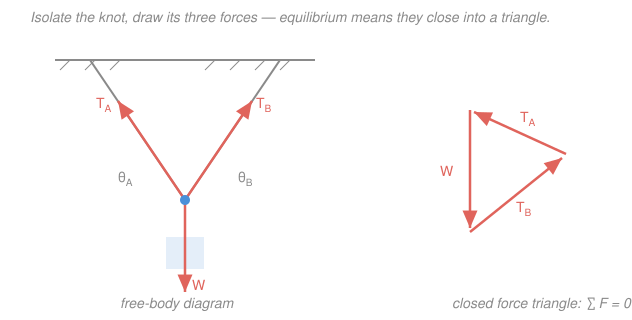

# Statics · Lesson 1.2: Equilibrium of a particle

> ⏱ ~15 min · Module 1: Forces, moments & equilibrium · Builds on: [1.1 Forces as vectors & the free-body diagram](01-01-forces-vectors-free-body-diagram.md) · Unlocks: [1.3 Moment of a force](01-03-moment-of-a-force.md)

## Why this matters

A cable holds a traffic light over an intersection; a bracket pins a shelf to a wall; three guy-wires steady a tower. In each, forces meet at a single point and — because nothing is moving — they *cancel*. That one fact, $\sum \vec F = 0$, is the entire engine of this lesson: it turns a picture of a loaded joint into two (or three) algebra equations you can solve for the tensions and angles you didn't know. Every truss you'll analyze later is just this same move repeated at every joint.

## The idea

In [1.1](01-01-forces-vectors-free-body-diagram.md) you learned to isolate a body and draw every force on it. Now add the physics: if that body is a **particle** — small enough that all forces pass through one point, so there's no twisting to worry about — and it sits still, then the forces must add up to *nothing*. Not "mostly cancel." Exactly zero.

Picture a knot with three ropes pulling on it. If the three pulls didn't cancel, there'd be a leftover net force, and the knot would accelerate off in that direction. It doesn't. So the three force vectors, laid head to tail, must return you exactly to where you started — they **close into a polygon**. Two ropes and a weight? A closed triangle. That geometric picture and the algebra "$\sum F_x = 0$ and $\sum F_y = 0$" are the same statement wearing different clothes.

Why is this *useful*? Each closed direction gives you one equation. In 2D you get two ($x$ and $y$), so you can solve for **two unknowns** — usually two tensions, or a tension and an angle. Draw the free-body diagram, resolve into components, set each sum to zero, solve. That's the whole recipe.

## The formal version

A particle is in **equilibrium** when the vector sum of all forces on it vanishes:

$$\sum \vec F = 0.$$

*In words: add up every force acting on the point, as vectors, and you must get zero.*

A vector equation is really one scalar equation per axis. Resolve each force into components (the $\hat i, \hat j, \hat k$ machinery from [1.1](01-01-forces-vectors-free-body-diagram.md)) and the single vector equation splits into:

$$\sum F_x = 0, \qquad \sum F_y = 0, \qquad (\text{and } \sum F_z = 0 \text{ in 3D}).$$

*In words: the forces balance left-right, up-down, and — in three dimensions — front-back, each independently.* Two scalar equations in 2D solve for **two** unknowns; three equations in 3D solve for three. Count your unknowns against your equations before you start — that tells you if the problem is solvable as a particle.

Two modeling facts you'll lean on constantly:

- **Cables pull, only along their length.** A cable (rope, wire, chain) can only *pull*, never push, and the pull points straight along the cable away from the body. Its magnitude is the **tension** $T \ge 0$. If your algebra returns a negative tension, the cable would have to push — impossible — so the real configuration is different.
- **A frictionless pulley just redirects a cable; the tension is the same on both sides.** Ideal pulleys and smooth rings change a cable's *direction* without changing its *tension*. One continuous cord over a frictionless pulley carries one single tension $T$ throughout — a fact that often supplies the extra equation you need.

**The closed polygon.** Because $\sum \vec F = 0$, drawing the force vectors head to tail brings you back to the start: they form a **closed force polygon** (a triangle for three forces). This is just $\sum \vec F = 0$ drawn instead of written — and for three forces it lets you use plain trigonometry (law of sines) as an alternative to components.

## Picture

The knot on the left feels three forces. Slide those same three arrows head to tail (right) and they close into a triangle — that closure *is* $\sum \vec F = 0$.

## Worked examples

**Draw the free-body diagram first — every time.** It's not a formality; it's where the sign of each component gets decided. Skip it and you'll drop a term or flip a sign.

**Example 1 (a hanging lamp — two cables, two unknowns).** A $50\,\text{kg}$ lamp hangs in equilibrium from a knot. Cable $A$ runs up-left to the ceiling at $30^\circ$ above the horizontal; cable $B$ runs up-right at $45^\circ$. Find the tensions $T_A$ and $T_B$.

*FBD of the knot.* Three forces act at the knot: tension $T_A$ up-left along cable $A$, tension $T_B$ up-right along cable $B$, and the weight $W = mg = 50 \times 9.81 = 490.5\,\text{N}$ straight down. (This is exactly the left panel of the Picture.)

*Resolve and sum.* Take $x$ positive right, $y$ positive up.

$$\sum F_x = 0:\quad -T_A\cos 30^\circ + T_B\cos 45^\circ = 0,$$
$$\sum F_y = 0:\quad \ \ T_A\sin 30^\circ + T_B\sin 45^\circ - W = 0.$$

From the $x$-equation, $T_A = T_B\,\dfrac{\cos 45^\circ}{\cos 30^\circ} = 0.8165\,T_B$. Substitute into the $y$-equation:

$$0.8165\,T_B\,(0.5) + T_B\,(0.7071) = 490.5 \;\Longrightarrow\; 1.1154\,T_B = 490.5 \;\Longrightarrow\; T_B = 440\,\text{N},$$

and then $T_A = 0.8165 \times 440 = 359\,\text{N}$.

*Check.* Horizontal: $T_A\cos30^\circ = 359(0.866) = 311\,\text{N}$ and $T_B\cos45^\circ = 440(0.707) = 311\,\text{N}$ — they match, so the knot doesn't drift sideways. ✓ And $T_B > T_A$ makes sense: cable $B$ is steeper (closer to vertical), so it shoulders more of the downward weight.

**Example 2 (a frictionless pulley finds its own angle).** A small **frictionless** pulley carries a $200\,\text{N}$ load and rides on a single cable whose two ends are anchored to a wall at the same height. Find (a) the angles the two cable segments make, and (b) the tension, given that in equilibrium each segment sags $15^\circ$ below the horizontal.

*FBD of the pulley.* Because it's one continuous cable over a *frictionless* pulley, both segments carry the **same tension** $T$. Two forces pull up-and-outward along the two segments; the $200\,\text{N}$ load pulls down. Let the left segment rise at angle $\theta_1$ and the right at $\theta_2$ above horizontal.

*(a) Horizontal balance pins the geometry.* With equal tensions $T$ on both sides:

$$\sum F_x = 0:\quad T\cos\theta_1 - T\cos\theta_2 = 0 \;\Longrightarrow\; \cos\theta_1 = \cos\theta_2 \;\Longrightarrow\; \theta_1 = \theta_2 \equiv \theta.$$

*In words: a frictionless pulley slides until both cable segments make the same angle* — it self-centers. That's why you can't hold a load off-center on a smooth pulley.

*(b) Vertical balance gives the tension.* With $\theta = 15^\circ$:

$$\sum F_y = 0:\quad 2T\sin 15^\circ - 200 = 0 \;\Longrightarrow\; T = \frac{200}{2\sin 15^\circ} = \frac{200}{0.5176} = 386\,\text{N}.$$

*Check & punchline.* $T = 386\,\text{N}$ is nearly **double** the $200\,\text{N}$ load — from a cable that only sags $15^\circ$. As the cable pulls flatter ($\theta \to 0$), $\sin\theta \to 0$ and $T \to \infty$. That's why a tightrope walker's cable, or a power line, carries enormous tension for a modest weight, and why you can never pull a clothesline perfectly straight. Small angle, huge force.

## Watch out

- **You might think you can just "balance the big forces" by eye.** But $\sum \vec F = 0$ means *each component* is zero on its own — solve $\sum F_x = 0$ and $\sum F_y = 0$ as two separate equations. A leftover in either direction means motion.
- **You might give a cable a pushing (negative) tension to make the numbers work.** Cables only pull. A negative tension is nature telling you the assumed setup is wrong (a slack cable, or a member that's really in compression) — not a valid answer.
- **You might assume the steeper-looking cable always carries less.** It's the opposite: the cable *closer to vertical* carries the larger share of a hanging weight (Example 1, $T_B > T_A$), because it lines up better with gravity. Nearly-horizontal cables carry the most tension of all (Example 2).

## One-liner

> A particle sits still exactly when its forces cancel — $\sum F_x = 0$ and $\sum F_y = 0$ — which is the same as their arrows closing into a polygon; two equations, two unknowns.

## Problems

**P1 (🟢)** A $250\,\text{N}$ traffic light hangs from a knot held by two cables that each rise $20^\circ$ above the horizontal, symmetrically (one to the left, one to the right). Find the tension in each cable.

**P2 (🟡)** A $60\,\text{kg}$ block (use $g = 9.81\,\text{m/s}^2$) hangs in equilibrium from a knot. Cable $A$ runs up-left at $60^\circ$ above the horizontal; cable $B$ runs up-right at $30^\circ$ above the horizontal. Find $T_A$ and $T_B$. *(This is exactly the calculation you'll repeat at every joint of a truss in [2.1](02-01-trusses-method-of-joints.md) — a joint is just a particle in equilibrium.)*

**P3 (🔴, optional)** A $600\,\text{N}$ chandelier hangs from three cables meeting at a ring on top of it. Viewed from above the cables are spaced $120^\circ$ apart, and each makes $40^\circ$ with the vertical. Find the tension in each cable. *(Hint: use symmetry for the horizontal directions, then $\sum F_z = 0$ vertically.)*

Solutions

**P1** Draw the FBD of the knot: two equal tensions $T$ (the setup is symmetric), each $20^\circ$ above horizontal, and the $250\,\text{N}$ weight down. Horizontal components cancel by symmetry automatically, so only the vertical equation carries information:

$$\sum F_y = 0:\quad 2T\sin 20^\circ - 250 = 0 \;\Longrightarrow\; T = \frac{250}{2\sin 20^\circ} = \frac{250}{0.6840} = 366\,\text{N}.$$

*Check.* $\sum F_x$: the left cable pulls $-T\cos20^\circ$, the right pulls $+T\cos20^\circ$ — they cancel. ✓ And $366\,\text{N} > 250\,\text{N}$: a shallow $20^\circ$ pair carries more tension than the load itself, as expected.

**P2** Weight $W = 60 \times 9.81 = 588.6\,\text{N}$. FBD of the knot: $T_A$ up-left at $60^\circ$, $T_B$ up-right at $30^\circ$, $W$ down. With $x$ right and $y$ up:

$$\sum F_x = 0:\quad -T_A\cos 60^\circ + T_B\cos 30^\circ = 0,$$
$$\sum F_y = 0:\quad \ \ T_A\sin 60^\circ + T_B\sin 30^\circ - 588.6 = 0.$$

From the $x$-equation, $T_A = T_B\,\dfrac{\cos 30^\circ}{\cos 60^\circ} = T_B\,\dfrac{0.8660}{0.5} = 1.732\,T_B$. Substitute:

$$1.732\,T_B\,(0.8660) + T_B\,(0.5) = 588.6 \;\Longrightarrow\; 1.5\,T_B + 0.5\,T_B = 588.6 \;\Longrightarrow\; 2T_B = 588.6,$$

so $T_B = 294\,\text{N}$ and $T_A = 1.732 \times 294 = 510\,\text{N}$.

*Check.* Horizontal: $T_A\cos60^\circ = 510(0.5) = 255\,\text{N}$; $T_B\cos30^\circ = 294(0.866) = 255\,\text{N}$ — balanced. ✓ Cable $A$ is steeper ($60^\circ$), so it carries the larger tension — same lesson as Example 1.

**P3** By symmetry all three tensions are equal; call each $T$. Each cable makes $40^\circ$ with the vertical, so each contributes a vertical component $T\cos 40^\circ$ (up) and a horizontal component $T\sin 40^\circ$ (inward toward the center).

*Horizontal:* the three horizontal components have equal magnitude and point $120^\circ$ apart in plan, so they sum to zero on their own — $\sum F_x = 0$ and $\sum F_y = 0$ are satisfied automatically. (Three equal vectors at $120^\circ$ always cancel.)

*Vertical* ($z$ up): the weight is shared three ways:

$$\sum F_z = 0:\quad 3\,T\cos 40^\circ - 600 = 0 \;\Longrightarrow\; T = \frac{600}{3\cos 40^\circ} = \frac{600}{3(0.7660)} = 261\,\text{N}.$$

*Check.* Total upward pull $= 3(261)(0.766) = 600\,\text{N}$, matching the load. ✓ If the cables were vertical ($0^\circ$), each would carry exactly $200\,\text{N}$; the $40^\circ$ splay raises that to $261\,\text{N}$ — spreading cables apart always costs extra tension.

## Connections

- **Backward:** this is [1.1](01-01-forces-vectors-free-body-diagram.md) put to work — the free-body diagram and the $\hat i, \hat j$ component resolution from that lesson become the two scalar equations $\sum F_x = 0$, $\sum F_y = 0$ here. No new vector machinery, just the equilibrium condition on top.
- **Forward:** [1.3 Moment of a force](01-03-moment-of-a-force.md) lets forces act at *different* points on an extended body, so they can twist as well as push — $\sum \vec F = 0$ is no longer enough and we'll add $\sum \vec M = 0$. And [2.1 Trusses & the method of joints](02-01-trusses-method-of-joints.md) is literally this lesson applied at every pin of a structure: each joint is a particle in equilibrium.
- **Sideways (mechanics):** $\sum \vec F = 0$ is just Newton's second law with zero acceleration — the equilibrium special case of the dynamics in the [mechanics-refresher](../../mechanics-refresher/syllabus.md). Splitting one vector equation into independent per-axis scalar equations is the same component reasoning you'd meet with vectors in the [linalg-refresher](../../linalg-refresher/syllabus.md).
