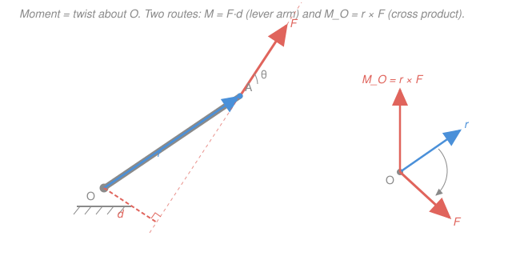

# Statics · Lesson 1.3: Moment of a force

> ⏱ ~15 min · Module 1: Forces, moments & equilibrium · Builds on: [1.1 Forces as vectors & the FBD](01-01-forces-vectors-free-body-diagram.md), [1.2 Equilibrium of a particle](01-02-equilibrium-of-a-particle.md), cross product from [`linalg-refresher`](../../linalg-refresher/syllabus.md) · Unlocks: [1.4 Couples & equivalent systems](01-04-couples-equivalent-systems.md), [1.5 Rigid-body equilibrium & supports](01-05-rigid-body-equilibrium-supports.md)

## Why this matters

A force doesn't just push a body — if the body has size, the same force also *twists* it about any point that isn't on its line of action. That twist is the **moment**, and it's why a long wrench loosens a stubborn bolt, why a door swings when you push the handle and not the hinge, and why a cantilevered balcony tries to snap off at the wall. Everything in Modules 1–4 that has size (beams, brackets, trusses) is held up by balancing twists, not just forces. Get moments right and rigid-body equilibrium ([1.5](01-05-rigid-body-equilibrium-supports.md)) becomes bookkeeping.

## The idea

Push on a door. Push right next to the hinge and nothing happens; push at the far edge and it swings easily. Same force, wildly different effect — because what turns the door is the force **times how far its line of action passes from the hinge**. That perpendicular distance is the **lever arm**. Big lever arm, big twist. Push straight *at* the hinge (zero lever arm) and there's no twist at all, no matter how hard you shove.

So a moment needs three ingredients: a force, a point you're twisting about, and the perpendicular distance between them. And it has a *sense* — clockwise or counterclockwise. In 2D we track that with a sign; in 3D the twist happens about an *axis*, and we point along that axis with the right-hand rule. The clean machine that packages all of this — magnitude, lever arm, and sense — in one stroke is the cross product $\vec r \times \vec F$ you met in [`linalg-refresher`](../../linalg-refresher/syllabus.md). This lesson is really just: *moment = cross product, wearing a mechanics uniform.*

## The formal version

**Moment about a point (scalar form).** The magnitude of the moment of a force $\vec F$ about a point $O$ is

$$M_O = F\,d,$$

where $F = |\vec F|$ is the force magnitude and $d$ is the **perpendicular** (shortest) distance from $O$ to the force's line of action — the lever arm. *In words: how hard you push times how far the push misses the pivot.* Units are newton-metres, $\text{N}\cdot\text{m}$. In 2D we attach a sign: **counterclockwise positive** (a $+\hat{k}$, out-of-page twist), clockwise negative.

**Moment about a point (vector form).** Let $\vec r$ be the position vector from $O$ to *any* point on the line of action of $\vec F$ (the point of application is the easy choice). Then

$$\vec M_O = \vec r \times \vec F.$$

*In words: cross the arm into the force and you get the twist, as a vector pointing along the axis of rotation.* Its magnitude is $|\vec M_O| = rF\sin\phi = F d$ (since $d = r\sin\phi$, with $\phi$ the angle between $\vec r$ and $\vec F$) — so the vector form contains the scalar form automatically. Its direction follows the **right-hand rule**: curl the fingers from $\vec r$ toward $\vec F$, and the thumb points along $\vec M_O$.

In components, the cross product is the determinant

$$\vec M_O = \begin{vmatrix} \hat{i} & \hat{j} & \hat{k} \\ r_x & r_y & r_z \\ F_x & F_y & F_z \end{vmatrix} = (r_yF_z - r_zF_y)\,\hat{i} + (r_zF_x - r_xF_z)\,\hat{j} + (r_xF_y - r_yF_x)\,\hat{k}.$$

In 2D ($r_z = F_z = 0$) only the last term survives:

$$M_O = r_xF_y - r_yF_x,$$

a single signed number — positive is counterclockwise. *In words: the 2D moment is just the $\hat{k}$-component of the cross product.*

**Varignon's theorem.** The moment of a force equals the sum of the moments of its components:

$$\vec M_O = \vec r \times \vec F = \vec r \times (\vec F_1 + \vec F_2) = \vec r \times \vec F_1 + \vec r \times \vec F_2.$$

*In words: you may split a force into pieces, moment each piece about $O$, and add — the total is the same.* This is nothing but the distributive law of the cross product, and it's the workhorse: instead of hunting for the perpendicular distance of an awkwardly-angled force, resolve it into $x$- and $y$-components (whose lever arms are just coordinates) and add.

**Moment about an axis (brief).** Sometimes you want only the twist about a *specific line*, not the full vector — e.g. how much a force spins a shaft about its own axis. Project $\vec M_O$ onto a unit vector $\hat u$ along that axis:

$$M_a = \hat u \cdot (\vec r \times \vec F).$$

*In words: the moment about an axis is the component of the moment vector along that axis* — a **scalar triple product**. Only the part of the twist aligned with the axis counts; the rest is resisted by the bearings.

**When to use which.** Lever-arm $M_O = Fd$ wins when the geometry is simple 2D and $d$ is obvious (a horizontal force a known height above the pivot). The cross product wins for 3D, or 2D with awkward angles where finding $d$ is a trig headache — resolve into components and let Varignon do the work.

## Picture

## Worked examples

**Example 1 (2D — a bent bracket, both ways agree).** A force $\vec F$ is applied at the tip $A$ of an L-shaped bracket bolted to a wall at $O$. The tip sits at $\vec r = 4\,\hat{i} + 3\,\hat{j}$ (metres from $O$), and the force is $\vec F = 60\,\hat{i} - 80\,\hat{j}$ (newtons), so $F = \sqrt{60^2 + 80^2} = 100\,\text{N}$. Find the moment about $O$.

*Draw the picture first:* $O$ at the wall, the bracket reaching up-and-right to $A$, the 100 N force pulling down-and-to-the-right at $A$.

*Cross-product / Varignon route.* In 2D use $M_O = r_xF_y - r_yF_x$. It's cleanest to read this as Varignon — moment the two force-components separately:

- The $60\,\hat{i}$ component acts at height $r_y = 3\,\text{m}$; a rightward push above the pivot twists **clockwise**: $r_x F_y$-style term for it is $-r_y F_x = -(3)(60) = -180\,\text{N}\cdot\text{m}$.
- The $-80\,\hat{j}$ component acts at $r_x = 4\,\text{m}$; a downward pull to the right of the pivot also twists **clockwise**: $r_x F_y = (4)(-80) = -320\,\text{N}\cdot\text{m}$.

$$M_O = r_xF_y - r_yF_x = (4)(-80) - (3)(60) = -320 - 180 = -500\,\text{N}\cdot\text{m}.$$

The minus sign says **500 $\text{N}\cdot\text{m}$ clockwise**.

*Lever-arm route.* The moment must also equal $F\,d$. Solving, $d = |M_O|/F = 500/100 = 5\,\text{m}$. That's the perpendicular distance from $O$ to the force's line of action — which for this tilted force you'd otherwise have to extract by extending the line and dropping a perpendicular (fiddly). Both routes give $|M_O| = 100 \times 5 = 500\,\text{N}\cdot\text{m}$. **They agree** — and that's exactly Varignon's point: components sidestep the awkward geometry.

**Example 2 (3D — the determinant).** A force $\vec F = 4\,\hat{i} - 2\,\hat{j} + 5\,\hat{k}$ (N) is applied at a point whose position from $O$ is $\vec r = 2\,\hat{i} + \hat{j} + 3\,\hat{k}$ (m). Find $\vec M_O$.

Expand the determinant term by term:

$$
\begin{aligned}
M_x &= r_yF_z - r_zF_y = (1)(5) - (3)(-2) = 5 + 6 = 11,\\
M_y &= r_zF_x - r_xF_z = (3)(4) - (2)(5) = 12 - 10 = 2,\\
M_z &= r_xF_y - r_yF_x = (2)(-2) - (1)(4) = -4 - 4 = -8.
\end{aligned}
$$

$$\vec M_O = 11\,\hat{i} + 2\,\hat{j} - 8\,\hat{k}\ \ \text{N}\cdot\text{m}, \qquad |\vec M_O| = \sqrt{11^2 + 2^2 + 8^2} = \sqrt{189} \approx 13.7\,\text{N}\cdot\text{m}.$$

Each component is a twist about a coordinate axis: e.g. the moment of this force about the $x$-axis is just $M_a = \hat{i}\cdot\vec M_O = 11\,\text{N}\cdot\text{m}$ — the scalar triple product collapses to reading off a component when the axis is a coordinate axis. *Sanity check:* $\vec M_O$ should be perpendicular to $\vec F$. Test $\vec M_O\cdot\vec F = (11)(4) + (2)(-2) + (-8)(5) = 44 - 4 - 40 = 0$ ✓ — as it must be, since a cross product is orthogonal to both factors.

## Watch out

- **You might use the slant distance instead of the perpendicular distance.** In $M_O = Fd$, $d$ is the *shortest* distance from $O$ to the line of action, not the distance to the point of application. If the force is angled, $d = r\sin\phi$, not $r$. When in doubt, use components (Varignon) and skip $d$ entirely.
- **You might lose the sign.** A clockwise moment is negative in the CCW-positive convention. Don't add magnitudes blindly — a downward force on the left of a pivot and one on the right twist in *opposite* senses and partly cancel. Let $M_O = r_xF_y - r_yF_x$ carry the sign for you.
- **You might swap the cross-product order.** $\vec r \times \vec F$, arm-then-force — never $\vec F \times \vec r$, which flips the sign ($\vec F \times \vec r = -\vec r \times \vec F$) and points the twist the wrong way. And $\vec r$ runs *from the pivot $O$ to the force*, not the reverse.

## One-liner

> A moment is force times perpendicular lever arm, sensed by the right-hand rule — and $\vec M_O = \vec r \times \vec F$ delivers magnitude, direction, and sign in one stroke, with Varignon letting you moment the components instead of chasing the distance.

## Problems

**P1 (🟢)** A mechanic pulls with $F = 150\,\text{N}$ at the end of a wrench handle $0.40\,\text{m}$ long, with the force directed at $70^\circ$ to the handle. Find the magnitude of the moment about the bolt. What handle angle would maximize it, and what would the moment be then?

**P2 (🟡)** A force $\vec F = -30\,\hat{i} + 40\,\hat{j}$ (N) acts at the point $\vec r = 2\,\hat{i} - \hat{j}$ (m) on a bracket, measured from the support $O$. (a) Find $M_O$ using components and state its sense. (b) Confirm by finding the perpendicular lever arm $d$ and checking $M_O = Fd$.

**P3 (🔴, optional)** A force $\vec F = -\hat{i} + 4\,\hat{j} + 2\,\hat{k}$ (N) acts at $\vec r = 3\,\hat{i} - 2\,\hat{j} + \hat{k}$ (m) from $O$. (a) Compute $\vec M_O$. (b) Find the moment of this force about the axis through $O$ in the direction $\hat{u} = \tfrac{1}{3}(2\,\hat{i} - \hat{j} + 2\,\hat{k})$. (This scalar-triple-product step is the same $\vec a\cdot(\vec b\times\vec c)$ from [`linalg-refresher`](../../linalg-refresher/syllabus.md).)

Solutions

**P1** Lever arm of an angled force: $d = L\sin\theta$, so

$$M_O = F\,L\sin\theta = (150)(0.40)\sin 70^\circ = 60 \times 0.9397 \approx 56.4\,\text{N}\cdot\text{m}.$$

The moment is largest when $\sin\theta = 1$, i.e. the force is **perpendicular to the handle** ($\theta = 90^\circ$), giving $M_O = FL = (150)(0.40) = 60\,\text{N}\cdot\text{m}$. That's why you instinctively pull square to a wrench — any other angle wastes force pulling *along* the handle, which passes through the bolt and contributes no twist.

**P2** (a) With $r_x = 2$, $r_y = -1$, $F_x = -30$, $F_y = 40$:

$$M_O = r_xF_y - r_yF_x = (2)(40) - (-1)(-30) = 80 - 30 = 50\,\text{N}\cdot\text{m}.$$

Positive, so **counterclockwise**.

(b) $F = \sqrt{30^2 + 40^2} = 50\,\text{N}$. From $M_O = Fd$, $d = |M_O|/F = 50/50 = 1\,\text{m}$. Check directly: the perpendicular distance from $O$ to a line through $\vec r$ with direction $\hat{F} = (-30,40)/50 = (-0.6, 0.8)$ is $d = |r_x\hat F_y - r_y\hat F_x| = |(2)(0.8) - (-1)(-0.6)| = |1.6 - 0.6| = 1\,\text{m}$ ✓. Both give $M_O = 50 \times 1 = 50\,\text{N}\cdot\text{m}$.

**P3** (a) Determinant expansion:

$$
\begin{aligned}
M_x &= r_yF_z - r_zF_y = (-2)(2) - (1)(4) = -4 - 4 = -8,\\
M_y &= r_zF_x - r_xF_z = (1)(-1) - (3)(2) = -1 - 6 = -7,\\
M_z &= r_xF_y - r_yF_x = (3)(4) - (-2)(-1) = 12 - 2 = 10.
\end{aligned}
$$

$$\vec M_O = -8\,\hat{i} - 7\,\hat{j} + 10\,\hat{k}\ \ \text{N}\cdot\text{m}.$$

(b) $\hat{u} = \tfrac13(2,-1,2)$ is already a unit vector ($\sqrt{4+1+4}/3 = 1$). The moment about that axis:

$$M_a = \hat{u}\cdot\vec M_O = \tfrac13\big[(2)(-8) + (-1)(-7) + (2)(10)\big] = \tfrac13(-16 + 7 + 20) = \tfrac{11}{3} \approx 3.7\,\text{N}\cdot\text{m}.$$

The positive sign means the twist about that line runs in the $+\hat{u}$ sense (right-hand rule along $\hat u$).

## Flashback

**From Lesson 1.2 (Equilibrium of a particle):** A lamp of weight $W = 300\,\text{N}$ hangs from a ring at which two cables meet. Cable $A$ runs up to the left at $40^\circ$ above the horizontal; cable $B$ runs up to the right at $60^\circ$ above the horizontal. Find the tension in each cable.

Solution

Free-body the ring: two cable tensions pulling up-and-outward, the weight $300\,\text{N}$ pulling straight down. With $A$ up-left and $B$ up-right,

$$\sum F_x = 0:\quad -T_A\cos 40^\circ + T_B\cos 60^\circ = 0 \;\Rightarrow\; T_A\cos 40^\circ = T_B\cos 60^\circ,$$
$$\sum F_y = 0:\quad T_A\sin 40^\circ + T_B\sin 60^\circ = W = 300.$$

From the $x$-equation, $T_A = T_B\dfrac{\cos 60^\circ}{\cos 40^\circ} = T_B\dfrac{0.5000}{0.7660} = 0.6527\,T_B$. Substitute into the $y$-equation:

$$0.6527\,T_B(0.6428) + T_B(0.8660) = 300 \;\Rightarrow\; (0.4196 + 0.8660)\,T_B = 300 \;\Rightarrow\; 1.2856\,T_B = 300,$$

$$\boxed{T_B \approx 233\,\text{N}, \qquad T_A = 0.6527(233) \approx 152\,\text{N}.}$$

*Check.* Horizontal balance: $T_A\cos 40^\circ = 152(0.766) \approx 117\,\text{N}$ and $T_B\cos 60^\circ = 233(0.5) \approx 117\,\text{N}$ ✓. Vertical: $152(0.643) + 233(0.866) \approx 98 + 202 = 300\,\text{N}$ ✓. The steeper cable ($B$, at $60^\circ$) carries more of the vertical load, so it's the more heavily tensioned — as it should be.

## Connections

- **Backward:** this reuses force components and free-body thinking from [1.1](01-01-forces-vectors-free-body-diagram.md), and the perpendicular distance $d = r\sin\phi$ is the same trig you resolved forces with in [1.2](01-02-equilibrium-of-a-particle.md). Varignon is literally the distributive law of the cross product from [`linalg-refresher`](../../linalg-refresher/syllabus.md).
- **Forward:** a moment with no net force is a **couple** ([1.4](01-04-couples-equivalent-systems.md)), and $\sum M_O = 0$ becomes the second half of rigid-body equilibrium in [1.5](01-05-rigid-body-equilibrium-supports.md) — the equation that pins down reactions a force balance alone can't. It returns for internal bending moments in Module 4.
- **Sideways:** $\vec M_O = \vec r \times \vec F$ **is** the linear-algebra cross product, and moment-about-an-axis is the scalar triple product $\hat u\cdot(\vec r\times\vec F)$. In `engineering-dynamics` the very same $\vec r\times\vec F$ is **torque**, the thing that produces angular acceleration ($\vec\tau = I\vec\alpha$) — here it's balanced to zero; there it drives the motion.
