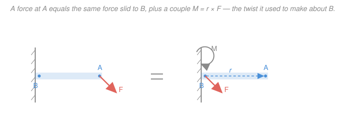

# Statics · Lesson 1.4: Couples & equivalent systems

> ⏱ ~15 min · Module 1: Forces, moments & equilibrium · Builds on: [1.3 Moment of a force](01-03-moment-of-a-force.md) · Unlocks: [1.5 Rigid-body equilibrium & supports](01-05-rigid-body-equilibrium-supports.md), [3.1 Distributed loads & resultants](03-01-distributed-loads-resultants.md)

## Why this matters

Real loads never land where the math is convenient. A cable pulls on the corner of a bracket, wind pushes on the top of a sign, a wrench grabs a bolt off to one side. Before you can write equilibrium equations, you want every load referred to *one* handy point — usually a support. This lesson is the legal move that lets you do that: slide a force to a new point without lying about what it does to the structure, at the cost of bookkeeping one extra twist. Every free-body diagram you draw from here on quietly uses it, and the whole business of replacing a distributed load with a single arrow ([3.1](03-01-distributed-loads-resultants.md)) is this idea in bulk.

## The idea

Take two forces that are **equal in size, opposite in direction, and not on the same line** — like your two hands turning a steering wheel, one pushing up on the right, the other down on the left. The forces cancel as far as *pushing the wheel across the road* goes: net force is zero. But they obviously do something — they **spin** it. That pure spin, with no leftover push, is a **couple**. Its whole personality is a single number: how hard it twists.

Here's the surprising part. A single force applied off to one side both **pushes** *and* **twists** about any reference point you pick. So if you want to move that force to a more convenient point, you can't just pick it up and set it down — you'd throw away the twist. The fix: move the force, then glue on a couple equal to exactly the twist you just erased. The push is unchanged (same force), the twist is restored (the couple), so the rigid body can't tell the difference. That trade — one off-center force $\Leftrightarrow$ one centered force plus one couple — is the **force-couple system**, and it's the most-used sleight of hand in statics.

## The formal version

**Couple.** Two forces $\vec F$ and $-\vec F$ whose lines of action are parallel and a perpendicular distance $d$ apart. Their net force is $\vec F + (-\vec F) = \vec 0$, and their combined moment has magnitude

$$M = Fd,$$

with $F = |\vec F|$ and $d$ the perpendicular distance between the two lines (meters). *In words: a couple exerts zero net force but a pure twist of size force times separation.*

**A couple's moment is a free vector.** Compute the moment of the pair about *any* point $O$. With the forces at positions $\vec r_1$ and $\vec r_2$,

$$\vec M = \vec r_1 \times \vec F + \vec r_2 \times (-\vec F) = (\vec r_1 - \vec r_2)\times \vec F.$$

The point $O$ dropped out — only the *relative* position $\vec r_1 - \vec r_2$ survives. *In words: a couple produces the same moment about every point in space, so you can draw its curved arrow anywhere on the body — it has a magnitude and a sense but no location.* (Contrast the moment of a *single* force from [1.3](01-03-moment-of-a-force.md), which very much depends on which point you take it about.)

**Transmissibility.** Sliding a single force *along its own line of action* changes nothing about a rigid body. Reason: the offset you moved it by is parallel to $\vec F$, so $\vec r \times \vec F = \vec 0$ — no couple needed. *In words: a force can be slid forward or back along its line for free; it's only sliding it sideways that costs a couple.*

**Force–couple replacement (the main move).** A force $\vec F$ applied at point $A$ is equivalent, for a rigid body, to the same force $\vec F$ applied at any other point $B$ **plus** a couple

$$\vec M_B = \vec r_{B\to A}\times \vec F,$$

where $\vec r_{B\to A}$ points from $B$ to the original point $A$. *In words: to move a force to $B$, keep the force and add a couple equal to the moment that force used to make about $B$.* (Derivation: at $B$ add nothing physical — a canceling pair $+\vec F$ and $-\vec F$. The original $\vec F$ at $A$ together with the new $-\vec F$ at $B$ form a couple of moment $\vec r_{B\to A}\times \vec F$; the leftover $+\vec F$ sits at $B$.)

**Reducing a whole force system.** Apply that move to every load and pile the results at one chosen point $O$: all the forces add to a single **resultant force** $\vec R = \sum \vec F_i$, and all the couples (including those generated by the shifts) add to a single **resultant couple** $\vec M_O = \sum \vec r_{O\to i}\times \vec F_i$. *In words: any tangle of forces on a rigid body is equivalent to one resultant force plus one couple at a point of your choosing.* Two special outcomes:

- If $\vec R = \vec 0$ but $\vec M_O \neq \vec 0$, the system is a **pure couple** (no net push, just twist).
- If $\vec R \neq \vec 0$, you can slide $\vec R$ sideways to a special line where it makes exactly $\vec M_O$ on its own — collapsing the system to a **single resultant force** with no couple. In 2D (all forces in a plane) this is *always* possible; the leftover couple just tells you how far to shift $\vec R$.

## Picture

The left bracket carries force $\vec F$ at its tip $A$. The right bracket is the *same* physical situation retold at the root $B$: identical force $\vec F$, plus a couple $\vec M = \vec r\times \vec F$ (grey curved arrow) accounting for the twist the tip force made about $B$. The blue offset $\vec r$ points from $B$ to $A$.

## Worked examples

**Example 1 — a couple's moment is the same about every point.** Two equal, opposite vertical forces of $40\,\text{N}$ act on a plate: $\vec F_1 = 40\,\hat j\ \text{N}$ at the point $(2,0)\,\text{m}$ and $\vec F_2 = -40\,\hat j\ \text{N}$ at the origin $(0,0)$. They're $d = 2\,\text{m}$ apart, so the couple magnitude is $M = Fd = 40\times 2 = 80\,\text{N}\cdot\text{m}$. Let's confirm it's location-independent by taking moments about two different points. Use the 2D shortcut $M_z = x F_y - y F_x$ from [1.3](01-03-moment-of-a-force.md).

*About $O=(0,0)$:*

$$M_z = \underbrace{(2)(40) - (0)(0)}_{\vec F_1} + \underbrace{(0)(-40) - (0)(0)}_{\vec F_2} = 80 + 0 = 80\,\text{N}\cdot\text{m}.$$

*About $Q=(5,5)$* (shift each position by $-Q$, so $\vec F_1$ acts at $(-3,-5)$ and $\vec F_2$ at $(-5,-5)$):

$$M_z = \underbrace{(-3)(40) - (-5)(0)}_{\vec F_1} + \underbrace{(-5)(-40) - (-5)(0)}_{\vec F_2} = -120 + 200 = 80\,\text{N}\cdot\text{m}.$$

Same $+80\,\text{N}\cdot\text{m}$ (counterclockwise) — as promised, the couple doesn't care what point you measure from.

**Example 2 — replace an off-center force with a force-couple system.** A cable pulls on a wall bracket at point $A$ with force $500\,\text{N}$ directed $30^\circ$ below the horizontal (down and to the right). $A$ sits $0.20\,\text{m}$ to the right of and $0.15\,\text{m}$ above the bolt hole $B$. Replace this load with an equivalent force–couple system at $B$ (the natural place, since that's where the bracket is fixed).

**Step 1 — draw and resolve the force.** Components of $\vec F$ (right is $+x$, up is $+y$):

$$F_x = 500\cos 30^\circ = 433\,\text{N}, \qquad F_y = -500\sin 30^\circ = -250\,\text{N}.$$

So $\vec F = (433\,\hat i - 250\,\hat j)\,\text{N}$ — and this *same* force is what acts at $B$ in the equivalent system.

**Step 2 — the couple is the moment about $B$.** With $\vec r_{B\to A} = (0.20\,\hat i + 0.15\,\hat j)\,\text{m}$,

$$M_B = x F_y - y F_x = (0.20)(-250) - (0.15)(433) = -50 - 65 = -115\,\text{N}\cdot\text{m}.$$

**Answer.** At $B$: a force $\vec F = (433\,\hat i - 250\,\hat j)\,\text{N}$ (magnitude $500\,\text{N}$, unchanged) plus a couple $M_B \approx 115\,\text{N}\cdot\text{m}$ **clockwise**. That clockwise couple is the overturning twist the bolt must resist — precisely the quantity [1.5](01-05-rigid-body-equilibrium-supports.md) will balance against a support reaction.

## Watch out

- **You might think a couple's moment depends on where you take moments** — it doesn't. A *single* force's moment changes point to point; a *couple's* is one fixed free vector. That's exactly why it's safe to slide it anywhere on the body.
- **You might slide a force sideways for free.** Only sliding *along its line of action* (transmissibility) is free. Any sideways shift erases a moment you must restore with a couple $\vec r\times\vec F$ — forget it and your equilibrium is silently wrong.
- **You might use the wrong $\vec r$.** In $\vec M_B = \vec r_{B\to A}\times \vec F$, the vector runs **from the new point $B$ to the original point $A$**, not the reverse. Flip it and you flip the sign of the couple.

## One-liner

> To move a force, keep the force and add the moment it used to make about the new home — one off-center push equals one centered push plus one pure twist.

## Problems

**P1 (🟢)** You turn a steering wheel of radius $0.18\,\text{m}$ with both hands on the rim, one hand pushing up with $25\,\text{N}$ on the right edge and the other pushing down with $25\,\text{N}$ on the left edge (the two hands are one diameter apart). Find the couple moment on the wheel and its sense. Would the answer change if you measured the moment about the top of the wheel instead of the center?

**P2 (🟡)** A vertical signpost is bolted to the ground at $O$. A horizontal wind force of $150\,\text{N}$ pushes on the sign, acting $3.5\,\text{m}$ above $O$. Replace this force with an equivalent force–couple system at the base $O$, giving the force and the couple (magnitude and sense).

**P3 (🔴, optional)** Two parallel downward forces act on a horizontal beam: $100\,\text{N}$ at $x = 1\,\text{m}$ and $300\,\text{N}$ at $x = 4\,\text{m}$ (measured from the left end $O$). Reduce them to a single resultant force: give its magnitude, direction, and the location $\bar x$ where its line of action crosses the beam. Why does this system collapse to a single force with *no* leftover couple, while the two forces of a couple never do? (This is the seed of distributed-load reduction in [3.1](03-01-distributed-loads-resultants.md).)

Solutions

**P1** The two hands are equal, opposite, and offset by the wheel's diameter $d = 2\times 0.18 = 0.36\,\text{m}$, so they form a couple:

$$M = Fd = 25 \times 0.36 = 9\,\text{N}\cdot\text{m}.$$

Right edge pushed up, left edge pushed down $\Rightarrow$ the wheel spins **counterclockwise**. Because a couple's moment is a free vector, measuring about the top of the wheel — or any other point — gives the identical $9\,\text{N}\cdot\text{m}$ counterclockwise. *Check:* taking moments about the center directly, each $25\,\text{N}$ force has lever arm $0.18\,\text{m}$ and both twist the same way, so $M = 2\times(25\times 0.18) = 9\,\text{N}\cdot\text{m}$ ✓.

**P2** The equivalent force at $O$ is the *same* force: $150\,\text{N}$ horizontal (unchanged in size and direction). The couple is the moment the wind made about $O$. Taking the horizontal force $F_x = 150\,\text{N}$ acting at height $y = 3.5\,\text{m}$ (with $x = 0$, $F_y = 0$):

$$M_O = x F_y - y F_x = (0)(0) - (3.5)(150) = -525\,\text{N}\cdot\text{m}.$$

**Answer:** at $O$, a $150\,\text{N}$ horizontal force plus a couple of $525\,\text{N}\cdot\text{m}$ **clockwise** (the wind tips the post over, top going downwind). *Check* by lever arm: force $150\,\text{N}$, perpendicular distance $3.5\,\text{m}$, so $M = 150\times 3.5 = 525\,\text{N}\cdot\text{m}$, sense clockwise ✓.

**P3** Net force (down is negative $y$, but we'll track magnitudes and keep "down"):

$$R = 100 + 300 = 400\,\text{N}\ \text{downward}.$$

Locate its line of action by demanding the single resultant make the *same* moment about $O$ as the original pair. Taking clockwise-from-downward-forces as our bookkeeping, moment of the originals about $O$:

$$M_O = 100(1) + 300(4) = 1300\,\text{N}\cdot\text{m}.$$

Set $R\,\bar x = M_O$:

$$\bar x = \frac{1300}{400} = 3.25\,\text{m}\ \text{from } O.$$

So the two forces are equivalent to a single $400\,\text{N}$ downward force acting $3.25\,\text{m}$ from the left end — no couple needed. **Why no leftover couple?** Because the net force $R = 400\,\text{N}$ is *nonzero*, we can slide it sideways to the one line where it reproduces $M_O$ all by itself. A couple is the degenerate case where $R = 0$: with no net force to relocate, there's nothing to slide, so the twist can never be absorbed into a single force — it stays a pure couple. *Check:* $\bar x = 3.25\,\text{m}$ lies between the two loads and is pulled toward the heavier $300\,\text{N}$ force, as a weighted average should be ✓.

## Flashback

**From Lesson 1.3 (Moment of a force):** A mechanic pushes with $120\,\text{N}$ on the end of a wrench $0.25\,\text{m}$ long, but the push makes a $60^\circ$ angle with the handle (not a clean perpendicular). Find the magnitude of the moment about the bolt, both by the perpendicular lever arm and by $rF\sin\theta$.

Solution

The two routes are the same calculation seen two ways. The perpendicular distance from the bolt to the force's line of action is $d = L\sin\theta = 0.25\sin 60^\circ = 0.25\times 0.866 = 0.2165\,\text{m}$, so

$$M = Fd = 120 \times 0.2165 \approx 26\,\text{N}\cdot\text{m}.$$

Equivalently, $M = rF\sin\theta = 0.25\times 120 \times \sin 60^\circ = 30\times 0.866 \approx 26\,\text{N}\cdot\text{m}$ — identical. *Check:* only the perpendicular component of the push, $F\sin\theta$, twists; the component along the handle, $F\cos\theta$, just tries to pull the wrench off the bolt and contributes zero moment ✓. A perpendicular push ($\theta = 90^\circ$) would give the maximum $30\,\text{N}\cdot\text{m}$.

## Connections

- **Backward:** the couple's moment is built straight from the moment of a force in [1.3](01-03-moment-of-a-force.md) — take two of them, opposite and offset, and the reference point cancels out. Transmissibility is just $\vec r\times\vec F = \vec 0$ when $\vec r \parallel \vec F$.
- **Forward:** [1.5 Rigid-body equilibrium & supports](01-05-rigid-body-equilibrium-supports.md) uses the force-couple move constantly — you'll slide every load onto a support so that $\sum \vec F = 0$ and $\sum \vec M = 0$ can be written at one point. Reducing many forces to one resultant is exactly how [3.1 Distributed loads & resultants](03-01-distributed-loads-resultants.md) replaces a pressure with a single arrow.
- **Sideways (linear algebra):** the couple $\vec M = \vec r\times\vec F$ is the cross product from your vector toolkit ([`linalg-refresher`](../../linalg-refresher/syllabus.md)) — its "point-independence" is the statement that $(\vec r_1-\vec r_2)\times\vec F$ ignores the origin. In [`mechanics-refresher`](../../mechanics-refresher/syllabus.md), the same couple is what changes a rigid body's angular momentum (torque), the rotational partner of Newton's second law.
