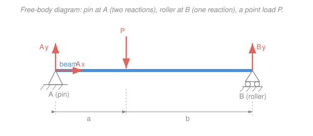
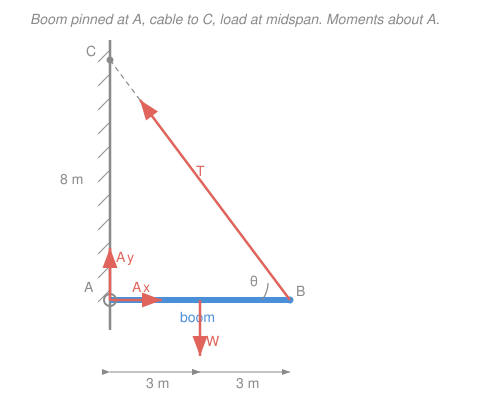

# Statics · Lesson 1.5: Rigid-body equilibrium & supports

> ⏱ ~15 min · Module 1: Forces, moments & equilibrium · Builds on: [1.4 Couples & equivalent systems](01-04-couples-equivalent-systems.md), [1.3 Moment of a force](01-03-moment-of-a-force.md), [1.2 Equilibrium of a particle](01-02-equilibrium-of-a-particle.md) · Unlocks: [2.1 Trusses & the method of joints](02-01-trusses-method-of-joints.md)

## Why this matters

Every bracket, balcony, crane boom, and bridge is held up by *supports* — a bolt here, a bearing there — and the first thing an engineer must know is how hard each support pushes back. Get the reactions wrong and every stress calculation downstream is wrong. This lesson is where the whole course pays off: you finally let a body have *size*, so forces act at different places and can twist it, and you learn to solve for every support reaction using just two rules. It's also the payoff for Module 1 — the boss problem (a signboard on a pinned boom) is exactly this machinery.

## The idea

A particle only had to worry about *sliding away* — all forces passed through one point, so [1.2](01-02-equilibrium-of-a-particle.md)'s single rule $\sum\vec F=0$ was enough. Give the body size and a new failure mode appears: even with the forces perfectly balanced, an off-center push can still *spin* it. Picture a wrench floating in space with two equal, opposite forces on its two ends — no net force, but it whirls. So a body at rest needs **two** guarantees, not one: it must neither drift **nor** rotate.

That's the entire content of rigid-body equilibrium. "Forces cancel" kills the drift; "moments cancel" (from [1.3](01-03-moment-of-a-force.md)) kills the spin. In flat 2D problems those two vector rules become **three** scalar equations — balance left–right, balance up–down, balance the twist — so you can pin down at most three unknown reactions. The art is reading each support to see how many unknowns it hides, and choosing *where* to sum moments so the algebra collapses.

## The formal version

A rigid body is in equilibrium when both of these hold:

$$\sum \vec F = 0, \qquad \sum \vec M_O = 0 \ \text{(about any point } O).$$

*In words: the forces add to nothing (no drifting) and the moments add to nothing (no spinning) — and if moments balance about one point, they balance about every point.*

In 2D (all forces in the $xy$-plane, all moments about the $z$-axis) this is **three scalar equations**:

$$\sum F_x = 0, \qquad \sum F_y = 0, \qquad \sum M_O = 0.$$

*In words: nothing left-right, nothing up-down, no net twist about your chosen point $O$.* Three equations solve for **three unknowns** — no more.

**Reading the supports.** Each support is a menu of reactions, one unknown per motion it blocks:

| Support | Blocks | Reactions (unknowns) |
|---|---|---|
| **Roller / smooth surface / cable** | motion $\perp$ to the surface (cable: along its line) | **1** force, direction known |
| **Pin / hinge** | translation in both directions | **2** force components $A_x, A_y$ |
| **Fixed / built-in (cantilever)** | translation **and** rotation | **2** forces + **1** couple $M_A$ |

*In words: a support supplies a reaction for every way it refuses to let the body move. A roller only stops you sinking into the surface, so one reaction; a pin stops sliding both ways but lets you rotate, so two; a wall that grips you also stops rotation, so it adds a reaction moment.*

**The moment trick.** You may sum moments about **any** point. Choose one *on the line of action of an unknown* and that unknown drops out (its lever arm is zero). Summing moments about a pin, for instance, erases both pin components in one stroke — leaving a single equation in a single unknown.

**Statical determinacy.** Compare the number of unknown reactions to the number of equilibrium equations (3 in 2D):

- **Determinate** — unknowns $=$ equations: solvable by statics alone (a pin + a roller = $2+1 = 3$). ✔
- **Indeterminate** — unknowns $>$ equations: too many supports; statics can't finish (you need material stiffness — that's [`mechanics-of-materials`](../../mechanics-of-materials/syllabus.md)).
- **Improperly constrained** — too few supports, *or* the right count but badly arranged (all reactions parallel, or all concurrent through one point): the body can still move. Counting to 3 is necessary, not sufficient.

*In words: three good supports lock a 2D body; fewer and it moves, more and statics alone can't crack it, and even three won't do if they all point the same way or all pass through one point.*

## Picture

The pin at $A$ contributes two unknowns ($A_x, A_y$); the roller at $B$ contributes one ($B_y$). Three unknowns, three equations — statically determinate.

## Worked examples

Both examples follow the same ritual: **(1)** isolate the body and draw the FBD with every reaction; **(2)** sum moments about a smart point to get one reaction alone; **(3)** finish with $\sum F_x$ and $\sum F_y$.

**Example 1 — simply supported beam (pin + roller).** The beam above spans $L = 6\,\text{m}$: pin at $A$ (left end), roller at $B$ (right end), and a downward point load $P = 12\,\text{kN}$ at $a = 2\,\text{m}$ from $A$ (so $b = 4\,\text{m}$ from $B$). Find all three reactions.

*Smart moment point:* take moments about $A$ to kill the two pin unknowns. With counterclockwise positive, the load (down, to the right of $A$) twists clockwise; $B_y$ (up, at the far end) twists counterclockwise:

$$\sum M_A = 0:\quad B_y(6) - P(2) = 0 \;\Longrightarrow\; B_y = \frac{12 \cdot 2}{6} = 4\,\text{kN (up).}$$

Now the force sums:

$$\sum F_y = 0:\quad A_y + B_y - P = 0 \;\Longrightarrow\; A_y = 12 - 4 = 8\,\text{kN (up).}$$
$$\sum F_x = 0:\quad A_x = 0 \quad(\text{no horizontal loads).}$$

*Check* (moments about $B$, which must also vanish): $A_y(6) - P(4) = 8(6) - 12(4) = 48 - 48 = 0.$ ✔ The nearer support carries more — $A$ is twice as close to the load and takes twice the share.

**Example 2 — the boss-style boom (pin + cable).** A horizontal boom is pinned to a wall at $A$ and held by a cable running from its tip $B$ up to a point $C$ on the wall, $8\,\text{m}$ above $A$. The boom is $6\,\text{m}$ long and carries a $W = 400\,\text{N}$ load whose weight acts at the **midpoint** ($3\,\text{m}$ from $A$). Find the cable tension $T$ and both pin reactions.

*Geometry.* The cable runs from $B$ (out $6\,\text{m}$) up to $C$ (up $8\,\text{m}$), so its length is $\sqrt{6^2+8^2}=10\,\text{m}$ and it makes angle $\theta$ with the boom where

$$\cos\theta = \tfrac{6}{10} = 0.6, \qquad \sin\theta = \tfrac{8}{10} = 0.8.$$

The tension pulls the tip toward $C$: components $T\cos\theta$ (horizontal, toward the wall) and $T\sin\theta$ (vertical, up).

*Moments about $A$* (the pin — kills $A_x$ and $A_y$). The cable's **horizontal** component runs along the boom line through $A$, so its lever arm is zero; only the **vertical** component $T\sin\theta$ (at $6\,\text{m}$) and the weight $W$ (at $3\,\text{m}$) twist the boom. Counterclockwise positive:

$$\sum M_A = 0:\quad (T\sin\theta)(6) - W(3) = 0 \;\Longrightarrow\; (0.8\,T)(6) = 400(3).$$

$$4.8\,T = 1200 \;\Longrightarrow\; T = 250\,\text{N}.$$

*Force sums.* The cable pulls the boom toward the wall ($-x$), so the pin must push out:

$$\sum F_x = 0:\quad A_x - T\cos\theta = 0 \;\Longrightarrow\; A_x = 250(0.6) = 150\,\text{N (away from wall).}$$
$$\sum F_y = 0:\quad A_y + T\sin\theta - W = 0 \;\Longrightarrow\; A_y = 400 - 250(0.8) = 200\,\text{N (up).}$$

So the pin reaction is $\sqrt{150^2 + 200^2} = 250\,\text{N}$, angled $\arctan(200/150) \approx 53^\circ$ above horizontal. *Check* (moments about $B$): $W$ acts $3\,\text{m}$ left of $B$ and $A_y$ acts $6\,\text{m}$ left of $B$: $A_y(6) - W(3)$ about... more simply, plug back into $\sum M_B$: $-A_y(6) + W(3) = -200(6) + 400(3) = -1200 + 1200 = 0.$ ✔ Taking moments about the pin *first* turned a three-unknown tangle into one clean equation for $T$ — that's the whole strategy.

## Watch out

- **A pin is two unknowns, not one.** Beginners draw a single "reaction" at a hinge. A pin resists sliding in *both* directions, so it hides $A_x$ **and** $A_y$ — direction unknown. A roller is the one-reaction support (perpendicular to its surface); a fixed end is three (two forces + a moment). Miscount and your equations won't close.
- **A negative answer is not a mistake.** If $A_y$ comes out $-100\,\text{N}$, you simply guessed the arrow's direction wrong: keep the magnitude, flip the arrow, move on. Never "fix" a sign by re-summing.
- **Three reactions don't guarantee equilibrium.** If all three are parallel (three vertical rollers), a horizontal load sends the body sliding; if all three lines meet at one point, a moment about that point spins it. Proper constraint needs the reactions *non-parallel and non-concurrent* — count **and** arrangement.

## One-liner

> An extended body needs two vetoes — no net push ($\sum\vec F=0$) and no net twist ($\sum\vec M=0$) — and each support supplies exactly the reactions those vetoes demand.

## Problems

**P1 (🟢)** A simply supported beam spans $8\,\text{m}$: pin at $A$ (left), roller at $B$ (right). A $20\,\text{kN}$ downward point load sits $3\,\text{m}$ from $A$. Find $A_x$, $A_y$, and $B_y$.

**P2 (🟡)** A cantilever is built into a wall at $A$ (a *fixed* support) and sticks out $3\,\text{m}$; a $5\,\text{kN}$ downward load hangs at the free end. Find all three reactions at $A$ (two force components and the wall moment $M_A$). Then state why this beam is statically determinate.

**P3 (🔴)** A beam of length $4\,\text{m}$ has a pin at $A$ (left) and a roller at $B$ (right) that rests on a surface inclined at $45^\circ$, so the roller reaction acts at $45^\circ$ from vertical — pointing up and *toward* the wall. An $8\,\text{kN}$ vertical load acts at the midpoint. Find the roller reaction $R$ and both pin components. *(This is the same skill you'll use in [2.1 trusses](02-01-trusses-method-of-joints.md), where every support reaction comes first — and the vector resolution is the component work from [`linalg-refresher`](../../linalg-refresher/syllabus.md).)*

Solutions

**P1.** Take moments about $A$ (kills both pin components), counterclockwise positive:

$$\sum M_A = 0:\quad B_y(8) - 20(3) = 0 \;\Longrightarrow\; B_y = \frac{60}{8} = 7.5\,\text{kN (up).}$$
$$\sum F_y = 0:\quad A_y = 20 - 7.5 = 12.5\,\text{kN (up).}$$
$$\sum F_x = 0:\quad A_x = 0.$$

*Check* ($\sum M_B$): $A_y(8) - 20(5) = 12.5(8) - 100 = 100 - 100 = 0.$ ✔ The load sits closer to $A$, so $A$ carries the larger share (12.5 vs 7.5 kN).

**P2.** A fixed support supplies three reactions: $A_x$, $A_y$, and a couple $M_A$. No horizontal loads, so $A_x = 0$.

$$\sum F_y = 0:\quad A_y - 5 = 0 \;\Longrightarrow\; A_y = 5\,\text{kN (up).}$$

The $5\,\text{kN}$ load, $3\,\text{m}$ out, twists the beam **clockwise** about $A$ with moment $5(3) = 15\,\text{kN}\cdot\text{m}$; the wall must supply an equal **counterclockwise** couple. Summing moments about $A$ (CCW positive), the load contributes $-15$:

$$\sum M_A = 0:\quad M_A - 5(3) = 0 \;\Longrightarrow\; M_A = 15\,\text{kN}\cdot\text{m (counterclockwise).}$$

*Determinate?* Three unknowns ($A_x, A_y, M_A$), three equilibrium equations — they match, so statics alone solves it. ✔ (A single fixed end is the minimum that holds a cantilever: it must block sliding both ways *and* rotation.)

**P3.** The roller reaction $R$ is perpendicular to its $45^\circ$ surface, pointing up-and-toward-the-wall, so its components are $R_x = -R\sin 45^\circ = -R/\sqrt2$ (toward wall) and $R_y = +R\cos 45^\circ = +R/\sqrt2$ (up).

Moments about $A$ (CCW positive) — only $R_y$ (at $4\,\text{m}$) and the load (at $2\,\text{m}$) have lever arms; $R_x$ runs along the beam line through $A$:

$$\sum M_A = 0:\quad R_y(4) - 8(2) = 0 \;\Longrightarrow\; \frac{R}{\sqrt2}(4) = 16 \;\Longrightarrow\; \frac{R}{\sqrt2} = 4 \;\Longrightarrow\; R = 4\sqrt2 \approx 5.66\,\text{kN}.$$

So $R_x = -4\,\text{kN}$ and $R_y = +4\,\text{kN}$. Now the force sums:

$$\sum F_x = 0:\quad A_x + R_x = 0 \;\Longrightarrow\; A_x = 4\,\text{kN (away from wall).}$$
$$\sum F_y = 0:\quad A_y + R_y - 8 = 0 \;\Longrightarrow\; A_y = 8 - 4 = 4\,\text{kN (up).}$$

The pin reaction magnitude is $\sqrt{4^2 + 4^2} = 4\sqrt2 \approx 5.66\,\text{kN}$ at $45^\circ$. *Check* ($\sum M_B$, CCW positive): $-A_y(4) + 8(2) = -4(4) + 16 = 0.$ ✔ Notice the inclined roller forced a horizontal reaction at the pin — with a vertical roller, $A_x$ would have been zero.

## Flashback

**From Lesson 1.4 (force–couple systems):** A $60\,\text{N}$ horizontal force points to the right at the top of a vertical post, $0.4\,\text{m}$ above its base $O$. Replace this single force with an equivalent **force–couple system at $O$**.

Solution

An equivalent system at $O$ keeps the *same net force* and the *same net moment about $O$*. The force is unchanged: **$60\,\text{N}$ to the right, now applied at $O$**. The couple equals the moment the original force had about $O$ — perpendicular distance times force:

$$M_O = (60\,\text{N})(0.4\,\text{m}) = 24\,\text{N}\cdot\text{m}.$$

Direction: a rightward force applied *above* $O$ twists it **clockwise**, so the couple is $24\,\text{N}\cdot\text{m}$ clockwise. Equivalent system: **$60\,\text{N}$ right at $O$, plus a $24\,\text{N}\cdot\text{m}$ clockwise couple.** This is precisely how you'd slide a support load back to a joint — the machinery underneath today's reaction problems.

## Connections

- **Backward:** this fuses [1.2](01-02-equilibrium-of-a-particle.md)'s $\sum\vec F=0$ with [1.3](01-03-moment-of-a-force.md)'s moment and [1.4](01-04-couples-equivalent-systems.md)'s couple — the reaction moment at a fixed support *is* a couple, and sliding a load to a support is the force–couple replacement you just practiced in the Flashback.
- **Forward:** [2.1 trusses](02-01-trusses-method-of-joints.md) always starts by finding the support reactions with these exact three equations, then marches joint to joint; and every internal-stress calculation in [`mechanics-of-materials`](../../mechanics-of-materials/syllabus.md) begins from the reactions you find here.
- **Sideways (mechanics):** equilibrium is Newton's second law with zero acceleration — "$\sum\vec F=0$" is the statics face of [`mechanics-refresher`](../../mechanics-refresher/syllabus.md)'s $\sum\vec F = m\vec a$, and the pin reaction is the Newton's-third-law partner of the force the boom presses back on the wall. Add motion and reactions become dynamic loads — that's [`engineering-dynamics`](../../engineering-dynamics/syllabus.md).
