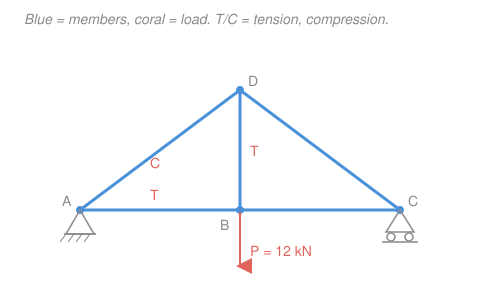
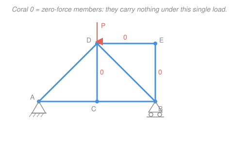

# Statics · Lesson 2.1: Trusses & the method of joints

> ⏱ ~15 min · Module 2: Trusses, frames & machines · Builds on: [1.2 Equilibrium of a particle](01-02-equilibrium-of-a-particle.md), [1.5 Rigid-body equilibrium & supports](01-05-rigid-body-equilibrium-supports.md) · Unlocks: [2.2 The method of sections](02-02-method-of-sections.md), [2.3 Frames & machines](02-03-frames-and-machines.md)

## Why this matters

Every bridge, roof, crane boom, and transmission tower you've ever seen is a **truss**: a web of straight bars pinned together at their ends. Trusses are everywhere because they are absurdly efficient — each bar does exactly one job, carrying a pull or a push straight along its length, and nothing else. If you can find that one number for every bar, you know which members to make fat (they're being crushed or stretched hard) and which to trim. This lesson gives you the workhorse method for doing it, and it's nothing more than the particle equilibrium you already know, applied one pin at a time.

## The idea

Here's the trick that makes trusses easy. We *idealize* the structure: pretend the bars are joined by frictionless pins (not welds), and pretend every load is applied only *at the joints* (never in the middle of a bar). Under those two assumptions, look at any single bar. It's connected to the rest of the world at just two points — its two end pins — and it has no load anywhere in between. A rigid body held by forces at only two points can be in equilibrium only if those two forces are **equal, opposite, and directed along the line joining the points**. So every bar is a **two-force member**: it can only pull inward on its pins (**tension**) or push outward on them (**compression**), purely along its own axis. No bending, no shear — just one number, a magnitude, plus a sign.

That collapses the whole problem. Now zoom in on a single pin. Every bar meeting there tugs or shoves it along the bar's direction, and any external load or support reaction adds its own arrow. The pin isn't going anywhere, so all those arrows must cancel: it's a **particle in equilibrium**, exactly [Lesson 1.2](01-02-equilibrium-of-a-particle.md). Write $\sum F_x = 0$ and $\sum F_y = 0$ at that pin and you get two equations. Pick a pin where only two bar-forces are unknown, solve it, and march to the next pin — the forces you just found are now known there. That's the **method of joints**.

## The formal version

**Two-force member.** In an ideal truss (pin joints, loads at joints only, weightless bars), each member carries a force $F$ directed along its axis. We adopt the universal **sign convention: assume every member is in tension.** Then:

$$F > 0 \;\Rightarrow\; \text{tension (T), member pulls its joints toward each other},$$
$$F < 0 \;\Rightarrow\; \text{compression (C), member pushes its joints apart}.$$

*In words: draw every unknown member force as if it pulls the pin toward the bar; if the algebra returns a negative number, the bar is actually pushing — it's in compression.* The beauty is you never have to guess T or C in advance; the sign tells you.

**Method of joints.** At each pin, the members and external forces form a concurrent (all lines meet at the pin) force system, so the particle-equilibrium conditions apply:

$$\sum F_x = 0, \qquad \sum F_y = 0.$$

*In words: at every joint the horizontal force components cancel and the vertical components cancel.* Two scalar equations per joint, so **start at a joint with at most two unknown member forces** — otherwise you have more unknowns than equations. Solve it, carry those forces to adjacent joints, and repeat until every member is known.

**Zero-force members.** Some members carry no force at all in a given load case — they're there for stability or to handle *other* loads. Two inspection rules catch most of them:

1. **Two non-collinear members, no load:** if only two members meet at an unloaded, unsupported joint and they aren't in a straight line, *both* are zero-force.
2. **Two collinear members plus one, no load:** if three members meet at an unloaded joint and two are collinear, the odd (non-collinear) member is zero-force.

*In words: with nothing else to balance it, a lone transverse member has no partner to push against, so it carries nothing.* Spotting these first can delete several unknowns before you write a single equation.

## Picture

## Worked examples

**Example 1 (method of joints — the full march).** Take the truss above: joints $A=(0,0)$, $B=(4,0)$, $C=(8,0)$, apex $D=(4,3)$ (meters). Members $AB$, $BC$ (bottom), $AD$, $DC$ (sloped), and the vertical $BD$. Support $A$ is a pin, $C$ a roller, and a load $P = 12\,\text{kN}$ hangs straight down at $B$. Find every member force.

*Step 1 — support reactions* (treat the whole truss as one rigid body, [Lesson 1.5](01-05-rigid-body-equilibrium-supports.md)). The roller at $C$ gives a vertical reaction $C_y$; the pin at $A$ gives $A_x, A_y$. Taking moments about $A$ (counterclockwise positive), the load's line of action is $4\,\text{m}$ to the right:

$$\sum M_A = 0:\quad C_y(8) - 12(4) = 0 \;\Rightarrow\; C_y = 6\,\text{kN}.$$
$$\sum F_y = 0:\quad A_y + 6 - 12 = 0 \;\Rightarrow\; A_y = 6\,\text{kN}, \qquad \sum F_x = 0:\quad A_x = 0.$$

*Step 2 — geometry of the sloped members.* $AD$ runs from $(0,0)$ to $(4,3)$: length $\sqrt{4^2+3^2}=5$, so its unit direction is $(\tfrac45, \tfrac35)$. A 3-4-5 triangle — cosine $\tfrac45$, sine $\tfrac35$.

*Step 3 — Joint $A$* (two unknowns: $F_{AB}$, $F_{AD}$). Assume both in tension: $AB$ pulls $A$ toward $B$ (the $+x$ direction), $AD$ pulls $A$ toward $D$ (direction $(\tfrac45,\tfrac35)$). With reaction $A_y = 6$ up:

$$\sum F_y = 0:\quad 6 + F_{AD}\left(\tfrac35\right) = 0 \;\Rightarrow\; F_{AD} = -10\,\text{kN} \;\Rightarrow\; \boxed{10\,\text{kN (C)}}.$$
$$\sum F_x = 0:\quad F_{AB} + F_{AD}\left(\tfrac45\right) = 0 \;\Rightarrow\; F_{AB} = -(-10)\left(\tfrac45\right) = +8\,\text{kN} \;\Rightarrow\; \boxed{8\,\text{kN (T)}}.$$

The negative $F_{AD}$ says $AD$ is really *pushing* on the pin — compression, as a sloping rafter should be. No guessing required; the sign did the work.

*Step 4 — Joint $B$* (unknowns $F_{BC}$, $F_{BD}$; $F_{AB}=8$ is now known). At $B$: $BA$ pulls toward $A$ ($-x$), $BC$ pulls toward $C$ ($+x$), $BD$ pulls straight up ($+y$), and the load pulls down $12\,\text{kN}$:

$$\sum F_x = 0:\quad -8 + F_{BC} = 0 \;\Rightarrow\; F_{BC} = +8\,\text{kN} \;\Rightarrow\; \boxed{8\,\text{kN (T)}}.$$
$$\sum F_y = 0:\quad F_{BD} - 12 = 0 \;\Rightarrow\; F_{BD} = +12\,\text{kN} \;\Rightarrow\; \boxed{12\,\text{kN (T)}}.$$

The vertical hanger $BD$ simply relays the load up to the apex. By the truss's left–right symmetry, $F_{DC} = F_{AD} = 10\,\text{kN (C)}$.

*Check — Joint $D$.* Keep the assume-tension bookkeeping: $F_{DA}=F_{DC}=-10$ (compression) and $F_{DB}=+12$. The unit vectors from $D$ point to $A=(-\tfrac45,-\tfrac35)$, to $C=(\tfrac45,-\tfrac35)$, and to $B=(0,-1)$:

$$\sum F_y = (-10)\left(-\tfrac35\right) + (-10)\left(-\tfrac35\right) + 12(-1) = 6 + 6 - 12 = 0. \checkmark$$

Everything closes. Final tally: bottom chord $AB=BC=8$ T, rafters $AD=DC=10$ C, hanger $BD=12$ T.

**Example 2 (zero-force members by inspection).** Consider the truss in the figure below: pin at $A=(0,0)$, roller at $B=(6,0)$, bottom-middle joint $C=(3,0)$, apex $D=(3,3)$ loaded by $P$ downward, and an extra top-right joint $E=(6,3)$. Members: $AC$, $CB$ (bottom), $AD$, $DB$ (rafters), the vertical $CD$, the top bar $DE$, and the vertical $BE$. Which members carry nothing?

- **Joint $E$:** only two members meet here, $DE$ (horizontal) and $BE$ (vertical), and $E$ has no load and no support. They aren't collinear, so by **Rule 1** each would have to balance the other with a perpendicular partner it doesn't have. Hence $F_{DE} = 0$ and $F_{BE} = 0$.
- **Joint $C$:** three members meet — $CA$ and $CB$ are collinear (both horizontal, the bottom chord) and $CD$ is the odd one out (vertical). There's no load at $C$. By **Rule 2**, the vertical has no horizontal-or-vertical partner to balance its pull, so $F_{CD} = 0$.

So $DE$, $BE$, and $CD$ are all zero-force in this load case, and the structure behaves like the bare triangle $A$–$D$–$B$ carrying $P$ at its apex. Those three "idle" members aren't useless — swing the load over to $E$, or add a horizontal wind load, and they spring to life. Deleting them *on paper* (for this load) just shrinks the joint equations you have to solve.

## Watch out

- **You might think a positive answer always means "correct direction."** With the assume-tension convention, positive means **tension** and negative means **compression** — the sign *is* the physics, not a bookkeeping error. Never flip a sign to "make it positive"; report the $-10$ as $10\,\text{kN}$ compression and move on.
- **You might start at a joint with three unknowns.** Two equations can't crack three unknowns. Always begin where at most two member forces are unknown — often a support with a known reaction, or a joint you reach after solving its neighbor. Zero-force members, spotted first, can knock a three-unknown joint down to two.
- **You might forget the reactions.** The joint march usually needs the support reactions as its starting known forces, so solve the whole-truss equilibrium *first* (Step 1). Skipping it strands you with too many unknowns everywhere.

## One-liner

> Every truss bar is a two-force member — pure push or pull along its axis — so each pin is just a particle in equilibrium: assume tension, write $\sum F_x = \sum F_y = 0$, and let the sign tell you T or C.

## Problems

**P1 (🟢)** A triangular truss has a pin at $A=(0,0)$, a roller at $B=(6,0)$, and an apex $C=(3,4)$ (meters). A load of $8\,\text{kN}$ acts straight down at $C$. Find the force in all three members ($AC$, $BC$, $AB$) and label each tension or compression.

**P2 (🟡)** For the truss in Example 2 (pin $A$, roller $B$, joints $C$, $D$, $E$, load $P$ down at $D$), a classmate insists member $AC$ is also zero-force "because it looks like the others." Using the joint rules, explain why $AC$ is *not* zero-force. (Hint: examine joint $A$ — what's different about it?)

**P3 (🔴, optional)** A Warren truss has bottom joints $A=(0,0)$ (pin), $C=(6,0)$, $E=(12,0)$ (roller) and top joints $B=(3,4)$, $D=(9,4)$. Members: bottom chord $AC$, $CE$; top chord $BD$; diagonals $AB$, $BC$, $CD$, $DE$. A single load of $8\,\text{kN}$ acts down at $C$. Find the force in the top chord $BD$ and state T or C. (Notice how many joints you must solve to get there — [2.2](02-02-method-of-sections.md) will get $BD$ in a single cut.)

Solutions

**P1** Symmetry (load centered, symmetric supports) gives the reactions immediately: $A_y = B_y = 4\,\text{kN}$, $A_x = 0$. Geometry of $AC$: from $(0,0)$ to $(3,4)$, length $\sqrt{3^2+4^2}=5$, unit direction $(\tfrac35,\tfrac45)$ — a 3-4-5 triangle.

Joint $A$ (assume tension; $AC$ pulls toward $C$, $AB$ pulls toward $B$ in $+x$):

$$\sum F_y = 0:\quad 4 + F_{AC}\left(\tfrac45\right) = 0 \;\Rightarrow\; F_{AC} = -5\,\text{kN} = 5\,\text{kN (C)}.$$
$$\sum F_x = 0:\quad F_{AB} + F_{AC}\left(\tfrac35\right) = 0 \;\Rightarrow\; F_{AB} = -(-5)\left(\tfrac35\right) = +3\,\text{kN} = 3\,\text{kN (T)}.$$

By symmetry $F_{BC} = F_{AC} = 5\,\text{kN (C)}$.

*Check — joint $C$:* the two rafters each push down with vertical component $5(\tfrac45)=4$, totaling $8$, exactly balancing the $8\,\text{kN}$ load; their horizontal components $5(\tfrac35)=3$ cancel left-against-right. ✓ Rafters in compression, bottom tie in tension — the signature of a loaded triangle.

**P2** The two inspection rules apply only at joints with **no external load and no support reaction**. Joint $A$ has a *pin support*, contributing reaction components $A_x$ and $A_y = 4\,\text{kN}$. So the members at $A$ ($AC$ horizontal, $AD$ sloped) don't have to balance only each other — they balance the reaction too. Vertical equilibrium at $A$ forces $AD$ to carry the reaction, and horizontal equilibrium then forces $AC$ to balance $AD$'s horizontal component. Concretely (from Example 1's twin geometry), $F_{AC} = +3\,\text{kN}$ (T), nonzero. The zero-force rules failed for the classmate because they ignored the support reaction — a joint with a reaction is never a candidate.

**P3** By symmetry the reactions are $A_y = E_y = 4\,\text{kN}$, $A_x = 0$. Diagonal $AB$: from $(0,0)$ to $(3,4)$, length $5$, direction $(\tfrac35,\tfrac45)$.

Joint $A$ (unknowns $F_{AB}$, $F_{AC}$):
$$\sum F_y = 0:\quad 4 + F_{AB}\left(\tfrac45\right) = 0 \;\Rightarrow\; F_{AB} = -5\,\text{kN} = 5\,\text{kN (C)}.$$
$$\sum F_x = 0:\quad F_{AC} + F_{AB}\left(\tfrac35\right) = 0 \;\Rightarrow\; F_{AC} = +3\,\text{kN (T)}.$$

Joint $B$ (unknowns $F_{BC}$, $F_{BD}$; $F_{AB}=-5$ known, no load at $B$). Unit vectors from $B=(3,4)$: to $A$ is $(-\tfrac35,-\tfrac45)$, to $C=(6,0)$ is $(\tfrac35,-\tfrac45)$, to $D=(9,4)$ is $(+1,0)$:

$$\sum F_y = 0:\quad (-5)\left(-\tfrac45\right) + F_{BC}\left(-\tfrac45\right) = 0 \;\Rightarrow\; 4 = F_{BC}\left(\tfrac45\right) \;\Rightarrow\; F_{BC} = +5\,\text{kN (T)}.$$
$$\sum F_x = 0:\quad (-5)\left(-\tfrac35\right) + F_{BC}\left(\tfrac35\right) + F_{BD} = 0 \;\Rightarrow\; 3 + 3 + F_{BD} = 0 \;\Rightarrow\; F_{BD} = -6\,\text{kN} = 6\,\text{kN (C)}.$$

So the top chord $BD$ carries $6\,\text{kN}$ **compression**. It took two joints ($A$ then $B$) to reach it — motivation for the method of sections, which slices straight to $BD$.

## Flashback

**From Lesson 1.5 (Rigid-body equilibrium & supports):** A straight horizontal beam of length $5\,\text{m}$ rests on a pin at its left end $A$ and a roller at its right end $B$. Two downward loads act on it: $8\,\text{kN}$ at $2\,\text{m}$ from $A$, and $6\,\text{kN}$ at $4\,\text{m}$ from $A$. Find the support reactions.

Solution

The pin at $A$ gives $A_x, A_y$; the roller at $B$ gives a vertical $B_y$. No horizontal loads, so $A_x = 0$. Take moments about $A$ (counterclockwise positive) so $A_x, A_y$ drop out:

$$\sum M_A = 0:\quad B_y(5) - 8(2) - 6(4) = 0 \;\Rightarrow\; 5B_y = 16 + 24 = 40 \;\Rightarrow\; B_y = 8\,\text{kN}.$$
$$\sum F_y = 0:\quad A_y + B_y - 8 - 6 = 0 \;\Rightarrow\; A_y = 14 - 8 = 6\,\text{kN}.$$

*Check.* Moments about $B$: $-A_y(5) + 8(3) + 6(1) = -30 + 24 + 6 = 0$ ✓. The heavier load sits closer to $A$, yet the load nearer $B$ ($4\,\text{m}$ out) pulls the balance so $B$ carries more — consistent with $B_y = 8 > A_y = 6$. This is exactly the whole-truss reaction step (Step 1) you'll run at the start of nearly every joints problem.

## Connections

- **Backward:** each joint is a [particle in equilibrium (1.2)](01-02-equilibrium-of-a-particle.md) — same $\sum F_x = \sum F_y = 0$ — and the opening reaction step is [rigid-body equilibrium (1.5)](01-05-rigid-body-equilibrium-supports.md) applied to the truss as a whole. The two-force-member idea is just [1.5](01-05-rigid-body-equilibrium-supports.md)'s equilibrium specialized to a body loaded at only two points.
- **Forward:** [2.2 The method of sections](02-02-method-of-sections.md) cuts through the truss to grab one deep member force without marching joint by joint, and [2.3 Frames & machines](02-03-frames-and-machines.md) drops the two-force-member luxury — members loaded in their middles carry shear and bending, so you dismember the structure instead.
- **Sideways:** the axial member forces you find here are the loads that mechanics of materials turns into stress — a member force $F$ over cross-sectional area $A$ gives axial stress $\sigma = F/A$, which decides whether the bar yields or (in compression) buckles. Tension versus compression, the sign you compute in this lesson, is the first thing a structural designer needs.
