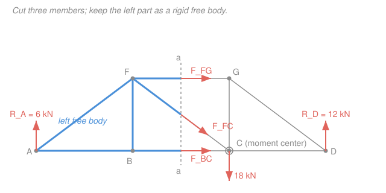

# Statics · Lesson 2.2: The method of sections

> ⏱ ~15 min · Module 2: Trusses, frames & machines · Builds on: [2.1 Trusses & the method of joints](02-01-trusses-method-of-joints.md), [1.5 Rigid-body equilibrium & supports](01-05-rigid-body-equilibrium-supports.md) · Unlocks: [2.3 Frames & machines](02-03-frames-and-machines.md)

## Why this matters

You've analyzed a 30-member bridge truss and someone asks a single question: *is that one deep diagonal in tension or compression, and how hard?* The method of joints from [2.1](02-01-trusses-method-of-joints.md) can answer it — but only after you crawl joint-by-joint halfway across the truss, solving members you don't care about just to reach the one you do. The **method of sections** cuts straight to it: one clean slice through the truss, one free-body diagram, and often a *single equation* gives you the member force you want. It's the tool every engineer reaches for when the question is "just tell me about *that* member."

## The idea

Here's the move. A truss in equilibrium isn't just balanced as a whole — *any chunk you carve out of it is also in equilibrium*, because you can't have a piece of a still object secretly accelerating. So take a saw and cut clean through the truss, right across the members you're curious about. Throw away one side. The piece you keep is a rigid body held still by two things: the real external forces on it (loads, support reactions) and the **internal forces in the members you cut**, now exposed as external pulls on your free body.

Those exposed member forces are exactly the unknowns you want. And you have three equilibrium equations for a rigid body in 2D — $\sum F_x = 0$, $\sum F_y = 0$, $\sum M = 0$ — so a cut through **three** members leaves you three unknowns and three equations. Solvable.

The genius is in the *moment* equation. You don't have to solve all three at once. If two of the three cut members both pass through some point, take moments about that point — those two contribute *zero moment* (no lever arm), and the third member drops out of the equation all by itself. One line, one answer, no simultaneous algebra. Choosing that point well is the whole art.

## The formal version

**The section principle.** Pass an imaginary cutting plane through the truss, slicing through the member(s) of interest, and isolate everything on one side as a free body. Replace each cut member with its axial force along the member's line. That piece obeys

$$\sum F_x = 0, \qquad \sum F_y = 0, \qquad \sum M_P = 0 \ \text{(about any point } P).$$

*In words: the chunk you keep is a rigid body in equilibrium, so forces balance in both directions and there's no net twist about any point you pick.*

**The three-member rule.** A single 2D section gives exactly three independent equations, so cut through **at most three members with unknown forces**. Cut four unknowns and you're one equation short — you can't finish from that section alone.

**Tension sign convention.** Draw every cut member force as if it were in **tension** — an arrow pulling the free body *toward* the removed side, along the member. Solve. A **positive** result confirms tension ($T$); a **negative** result means the member is actually in **compression** ($C$). *In words: assume everything pulls; the algebra tells you which ones actually push.*

**The moment shortcut.** To solve for one cut member directly, take moments about the point where the **other two** cut members intersect. Their lines pass through that point, so their moment arms are zero and they vanish from $\sum M_P = 0$ — leaving one equation in your one target force. Formally, if members 2 and 3 meet at $P$,

$$\sum M_P = 0 \ \Longrightarrow \ (\text{moment of loads/reactions about } P) + (\text{moment of member 1 about } P) = 0.$$

*In words: aim the moment equation at the crossing point of the two members you don't care about, and only the third one survives.* Special case: if the two unwanted members are **parallel** (e.g. the top and bottom chords of a flat truss), they meet "at infinity" — so instead use $\sum F$ perpendicular to them, which the parallel pair can't contribute to. That isolates the diagonal.

## Picture

The section $a\text{--}a$ slices three members: top chord $FG$, diagonal $FC$, bottom chord $BC$. Keep the left part. Because $BC$ and $FC$ both pass through $C$, taking moments about $C$ leaves only $F_{FG}$ in the equation.

## Worked examples

We'll use the truss in the figure throughout. Geometry: bottom joints $A(0,0)$, $B(4,0)$, $C(8,0)$, $D(12,0)$; top joints $F(4,3)$, $G(8,3)$ (meters). A single **18 kN** load hangs at joint $C$. Support $A$ is a pin, $D$ a roller. First, the reactions (from [1.5](01-05-rigid-body-equilibrium-supports.md)):

$$\sum M_A = 0:\ R_D(12) - 18(8) = 0 \ \Rightarrow\ R_D = 12\ \text{kN} \uparrow, \qquad \sum F_y = 0:\ R_A = 18 - 12 = 6\ \text{kN} \uparrow.$$

No horizontal loads, so $R_{Ax} = 0$. Cut with section $a\text{--}a$ between $B/F$ and $C/G$; it crosses $FG$, $FC$, $BC$ — three unknowns, perfect. Keep the **left** portion (joints $A$, $B$, $F$). The only external forces on it are $R_A = 6\ \text{kN}\uparrow$ and the three exposed member forces (the 18 kN load sits on the *discarded* right side, so it never enters this free body).

**Example 1 — top chord $FG$ by the moment shortcut.** The two members we *don't* want, $BC$ and $FC$, both pass through joint $C(8,0)$. So take moments about $C$; both vanish. Assume $FG$ is in tension (arrow at $F$ pointing right, toward $G$), so it's a horizontal force acting at height $y = 3$. Only $R_A$ and $F_{FG}$ survive:

$$\sum M_C = 0:\ \underbrace{R_A \,(8)}_{\text{6 kN, arm 8 m}} \ + \ \underbrace{F_{FG}\,(3)}_{\text{arm} = \text{height}} = 0.$$

Careful with signs: $R_A$ (up, 8 m left of $C$) twists the body **clockwise** about $C$; a *tension* in $FG$ (pointing $+x$ along the top) also twists **clockwise** about $C$. Same sense, so they can't cancel unless $F_{FG}$ is negative:

$$6(8) + F_{FG}(3) = 0 \ \Rightarrow\ F_{FG} = -\frac{48}{3} = -16\ \text{kN}.$$

Negative ⇒ the assumed tension was wrong: $\boxed{F_{FG} = 16\ \text{kN, compression}}$. That's the physical expectation — the top chord of a simply supported truss under downward load is squeezed. **One equation, one member force**, no simultaneous solving.

**Example 2 — diagonal $FC$, and why sections beats joints here.** Same cut, same free body. Now the two unwanted members are the chords $FG$ and $BC$ — both **horizontal**, hence parallel, meeting only at infinity. The moment shortcut degenerates, so use the perpendicular-force trick: sum forces **vertically**. The chords are horizontal and contribute nothing to $\sum F_y$, so only $R_A$ and the vertical component of $F_{FC}$ appear.

The diagonal runs $F(4,3)\to C(8,0)$: direction $(4,-3)$, length $5$, so its unit vector is $(0.8,\,-0.6)$. In tension, $F_{FC}$ pulls the free body toward $C$ — its vertical component is $-0.6\,F_{FC}$ (downward). Then

$$\sum F_y = 0:\ R_A - 0.6\,F_{FC} = 0 \ \Rightarrow\ 6 - 0.6\,F_{FC} = 0 \ \Rightarrow\ F_{FC} = 10\ \text{kN}.$$

Positive ⇒ $\boxed{F_{FC} = 10\ \text{kN, tension}}$. One equation again.

**Now count the cost of the alternative.** To get this same diagonal by the method of joints, you'd have to start at a support and walk inward: solve joint $A$ (for $AF$, $AB$), then joint $B$ (for $BF$, $BC$), *then* joint $F$ (which finally exposes $FG$ and $FC$) — three joints, six equations, five members you didn't want, all to reach one diagonal buried in the interior. The section did it in a single line. **That gap is exactly when sections wins: a deep interior member you can reach directly instead of crawling to.**

## Watch out

- **You might cut four unknown members to "get more at once" — but then you're stuck.** One 2D section is only three equations. Route the cut through at most three unknowns. (A clever exception: if extra cut members are *parallel*, a well-aimed moment equation can still isolate a non-parallel one — but never count on solving four unknowns from one cut.)
- **You might take moments about a point *on* the free body and think the center must lie inside it.** It needn't. In Example 1 the moment center $C$ sits on the *discarded* side — that's fine. The moment center is just a mathematical pivot; put it wherever kills the two members you don't want.
- **You might flip a force arrow halfway through to "fix" a negative sign.** Don't. Commit to the tension assumption for *every* cut member, solve, and read tension/compression off the signs at the end. Re-drawing mid-solve is how sign errors sneak in.

## One-liner

> One clean cut turns a whole truss into a three-equation free body — and a moment about the crossing point of the two members you don't want hands you the one you do, in a single line.

## Problems

**P1 (🟢)** Same truss and 18 kN load at $C$ as the worked examples. Using section $a\text{--}a$ and a **moment shortcut**, find the force in the bottom chord $BC$. State tension or compression. (Hint: which point do $FG$ and $FC$ share?)

**P2 (🟡)** Take the identical truss geometry, but now move the single **18 kN** downward load from joint $C$ to joint $B(4,0)$. Recompute the reactions, then use one section to find the force in the diagonal $FC$; state tension or compression. Finally, name the joints you'd have to solve, in order, to reach $FC$ by the method of joints instead — and count them.

**P3 (🔴)** In the original worked truss (18 kN at $C$), your colleague wants the force in the *vertical* member $BF$ and starts drawing a section. Talk them out of it: explain why a single section is the wrong tool for $BF$, then find $F_{BF}$ by the cleaner method in one step. (This connects back to [2.1](02-01-trusses-method-of-joints.md).)

Solutions

**P1.** The two members we don't want, $FG$ and $FC$, both pass through joint $F(4,3)$ — so take moments about $F$; both vanish, leaving only $R_A$ and $BC$. On the left free body $R_A = 6\ \text{kN}\uparrow$ at $A(0,0)$. Assume $BC$ in tension: a horizontal force at $B(4,0)$ pointing $+x$ (toward $C$), acting a distance $3$ m *below* $F$.

$$\sum M_F = 0:\ -\,R_A(4) + F_{BC}(3) = 0.$$

Signs: $R_A$ (up, 4 m left of $F$) gives a **counter-clockwise** moment about $F$ (take that as $-$ to match the arm bookkeeping below); the tension in $BC$ (pointing $+x$, 3 m below $F$) gives a **clockwise** moment. Balancing,

$$F_{BC} = \frac{R_A(4)}{3} = \frac{6 \times 4}{3} = 8\ \text{kN} > 0 \ \Rightarrow\ F_{BC} = 8\ \text{kN, tension}.$$

*Check.* The bottom chord of a sagging simply supported truss is stretched — tension is exactly right. Sanity on the moment: the 6 kN reaction pulls the bottom of the left part outward, and the bottom chord must pull back in. ✓

**P2.** Reactions with 18 kN now at $B(4,0)$:

$$\sum M_A = 0:\ R_D(12) - 18(4) = 0 \ \Rightarrow\ R_D = 6\ \text{kN}\uparrow, \qquad R_A = 18 - 6 = 12\ \text{kN}\uparrow.$$

Cut section $a\text{--}a$ (between $B/F$ and $C/G$) again; keep the **left** portion — which now contains joint $B$, so the 18 kN load *is* on this free body. Sum forces vertically (the horizontal chords $FG$, $BC$ contribute nothing); the diagonal $FC$ has unit vector $(0.8,-0.6)$, vertical component $-0.6\,F_{FC}$ in tension:

$$\sum F_y = 0:\ R_A - 18 - 0.6\,F_{FC} = 0 \ \Rightarrow\ 12 - 18 - 0.6\,F_{FC} = 0 \ \Rightarrow\ F_{FC} = \frac{-6}{0.6} = -10\ \text{kN}.$$

Negative ⇒ $F_{FC} = 10\ \text{kN, compression}$. (Moving the load onto the near side flipped the diagonal from tension to compression — a nice illustration that the *sign* of a diagonal tracks the net shear across the cut.)

By joints you'd solve, in order: **joint $A$** (gives $AF$, $AB$), **joint $B$** (gives $BF$, $BC$, using the 18 kN load), **joint $F$** (finally gives $FG$, $FC$). **Three joints, six equations** versus the section's one — the effort gap is the whole point.

*Check.* Net upward force on the left part before the diagonal is $12 - 18 = -6$ kN (net 6 kN down), so the diagonal must supply 6 kN up on the free body. A compression in $FC$ pushes joint $F$ *away* from $C$ (up-and-left), vertical component $0.6 \times 10 = 6$ kN up. ✓

**P3.** A single section can't cleanly isolate $BF$: any straight cut that severs the vertical $BF$ also slices at least two chord/diagonal members, and you'd be juggling extra unknowns for a member the method of **joints** nails instantly. Look at joint $B(4,0)$: the members there are $AB$ and $BC$ (both horizontal, collinear) and $BF$ (vertical), and in the original truss **no external load acts at $B$** (the 18 kN is at $C$). Summing forces vertically at $B$, only $BF$ has a vertical component:

$$\sum F_y = 0 \ \text{at } B:\ F_{BF} = 0.$$

So $BF$ is a **zero-force member** — two collinear members plus a third, with no load at the joint, forces the third to zero (straight from [2.1](02-01-trusses-method-of-joints.md)). The lesson: sections is powerful, but for a member hanging off a bare two-collinear joint, a one-line joint inspection wins. Pick the tool to fit the member.

## Flashback

**From Lesson 2.1 (method of joints).** At the pin support $A$ of a truss, exactly two members meet: a horizontal member $AB$ and a member $AC$ that rises at $30^\circ$ above the horizontal. The support supplies a vertical reaction of $5\ \text{kN}$ upward, and there are no other external forces at $A$. Find the forces in $AB$ and $AC$, and state tension or compression for each.

Solution

Isolate joint $A$; assume both members in tension (forces pointing *away* from $A$ along each member). $AC$ points up-and-right at $30^\circ$: components $(\cos 30^\circ,\ \sin 30^\circ) = (0.866,\ 0.5)$. $AB$ points horizontally, $+x$. The reaction is $5\ \text{kN}\uparrow$.

$$\sum F_y = 0:\ 5 + F_{AC}\sin 30^\circ = 0 \ \Rightarrow\ F_{AC} = \frac{-5}{0.5} = -10\ \text{kN} \ \Rightarrow\ 10\ \text{kN, compression}.$$

$$\sum F_x = 0:\ F_{AB} + F_{AC}\cos 30^\circ = 0 \ \Rightarrow\ F_{AB} = -(-10)(0.866) = 8.66\ \text{kN} \ \Rightarrow\ 8.66\ \text{kN, tension}.$$

*Check.* The upward reaction must be resisted by the *only* member with a vertical component, $AC$ — and a diagonal carrying load down to a support is in compression, pushing back up ($10 \times 0.5 = 5$ kN ✓). Its horizontal shove ($10 \times 0.866 = 8.66$ kN) is then balanced by tension in $AB$. Two members, two equations — the method of joints in miniature. ✓

## Connections

- **Backward:** this is [1.5 rigid-body equilibrium](01-05-rigid-body-equilibrium-supports.md) applied to a *carved-out chunk* — same $\sum F = 0$, $\sum M = 0$, just a cleverly chosen free body. The moment shortcut is the lever-arm moment from [1.3 Moment of a force](01-03-moment-of-a-force.md), used in reverse: pick the pivot that *zeroes* the terms you don't want. And it's the counterpart to [2.1 method of joints](02-01-trusses-method-of-joints.md) — joints for *every* force, sections for *one*.
- **Forward:** [2.3 Frames & machines](02-03-frames-and-machines.md) generalizes "cut it open and isolate a piece" to structures with multi-force members. The very same idea — slice a member and expose the internal force — returns in [4.1 Internal forces: N, V, M](04-01-internal-forces-normal-shear-bending.md), where you section a *beam* to read off its internal normal force, shear, and bending moment.
- **Sideways (vectors):** choosing a moment center to annihilate two unknowns is the same instinct as picking a convenient basis or projection to kill cross-terms — the coordinate-choosing skill from [linalg-refresher](../../linalg-refresher/syllabus.md). And the underlying moment is the cross product $\vec M_P = \vec r \times \vec F$; taking moments about the members' intersection makes $\vec r$ parallel to $\vec F$, so the product is zero.
