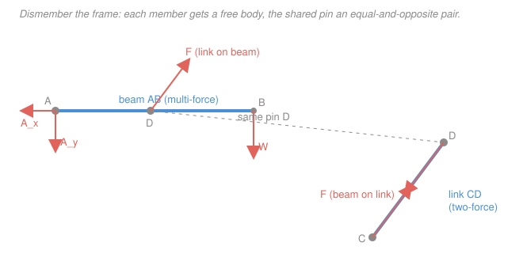
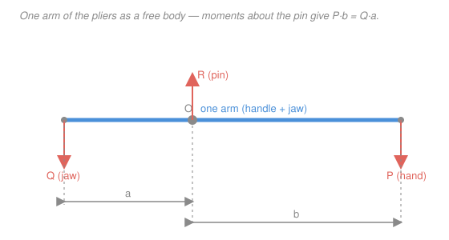

# Statics · Lesson 2.3: Frames & machines

> ⏱ ~15 min · Module 2: Trusses, frames & machines · Builds on: [2.1 Trusses & the method of joints](02-01-trusses-method-of-joints.md), [1.5 Rigid-body equilibrium & supports](01-05-rigid-body-equilibrium-supports.md) · Unlocks: Module 3 (distributed loads) and mechanics-of-materials

## Why this matters

Trusses were a tidy fantasy: every member a clean strut, carrying force only along its own length, purely in tension or compression. Real hardware isn't so polite. A shelf bracket bolted to a wall, the boom of a crane, the arm of a bike brake, a pair of pliers — their members get *bent*, not just stretched, because forces land on them at more than two spots. This lesson is the workhorse for everything that isn't a truss: take the structure apart, draw each piece alone, and let Newton's third law glue the pieces back together.

## The idea

A truss member is a two-force member — pinned at exactly two ends, loaded at exactly those two points, so the only force it can carry runs straight along the member (2.1). The moment a member feels a force at a *third* point — a load hung on its middle, or a third pin — that shortcut dies. Such a **multi-force member** carries a force that points in some slanted, off-axis direction you don't know in advance, plus it may be trying to bend. You can't read its force off a picture; you have to solve for it.

The trick is almost embarrassingly simple: **stop looking at the whole thing and look at one piece at a time.** Unbolt the structure at its pins. Each member becomes its own rigid body with its own free-body diagram, and you already know how to solve one of those (1.5): $\sum F = 0$, $\sum M = 0$. The only new rule is the bookkeeping at a pin. When member A and member B share a pin, A pushes on B with exactly the force B pushes back on A, flipped — Newton's third law. So on the two FBDs the shared-pin arrows are an equal-and-opposite pair. Draw one, negate it on the neighbour, and the pieces stay consistent.

Two words for the same method. A **frame** stays still and holds a load (the bracket, the crane boom). A **machine** has parts that move to *transmit or resize* a force — squeeze the handles of pliers a little, get a big bite at the jaw. Structurally they're identical: both are assemblies containing multi-force members, and both crack open the same way.

## The formal version

**Multi-force member.** A member with forces applied at three or more points, or with a couple applied. *In words: three or more places pushing on it, so its force is generally not along its axis and it may bend* — unlike a two-force member.

**Two-force member (the shortcut, from 2.1).** If a member has forces at exactly two points and no applied couple, then the two resultant forces are equal in magnitude, opposite in direction, and directed along the line joining the two points. *In words: a member touched in only two spots can only carry force straight along itself — one unknown (a magnitude), not two.* Spotting these first saves enormous work.

**Newton's third law at a connecting pin.** If member $A$ exerts force $\vec{F}$ on member $B$ through a shared pin, then $B$ exerts $-\vec{F}$ on $A$. *In words: cut a pin and you get a matched pair of arrows pointing opposite ways; choose unknown components $(F_x, F_y)$ on one member and the other member automatically gets $(-F_x, -F_y)$.*

**The method.**

1. **Whole-structure FBD.** Treat the assembly as one rigid body and apply $\sum F_x = 0$, $\sum F_y = 0$, $\sum M = 0$ to find the external support reactions — *this works whenever there are 3 or fewer external unknowns.* Internal pin forces don't appear here; they're internal and cancel in pairs.
2. **Spot the two-force members.** Any straight member pinned at just two points with nothing loaded in between is two-force: its force lies along the member. That collapses two unknowns to one.
3. **Dismember.** Draw a separate FBD of each member. At every connecting pin, insert an equal-and-opposite pair of unknowns (or a single axial force if the neighbour is a two-force member).
4. **Solve member by member** with $\sum F = 0$, $\sum M = 0$. *Take moments about a pin to make that pin's unknown force vanish* — choose the moment centre to isolate exactly the force you want.

*One caveat on step 1:* if both external supports are pins, the whole structure has 4 reaction unknowns and only 3 equations — you can't finish from the whole body alone. Go straight to dismembering (the internal pin supplies the extra relations), or use a two-force member to shrink one support to a single unknown.

## Picture

The beam is a multi-force member (loaded at A, D, and B); the link is a two-force member (its force runs straight along CD). At the shared pin D the two arrows are equal and opposite — that pairing is the whole game.

## Worked examples

**Example 1 — a frame: reactions, then the connecting-pin force.**

A horizontal beam $AB$ is pinned to a wall at $A=(0,0)$ and carries a hanging load $W = 1000\,\text{N}$ at its free end $B=(3,0)$ (metres). A straight rigid **link** runs from a lower wall pin $C=(0,-2)$ up to the beam's midpoint $D=(1.5,0)$. Find the force in the link (i.e. the force carried by the connecting pin at $D$) and the pin reaction at $A$.

*Step 1 — spot the two-force member.* The link is pinned only at $C$ and $D$ with nothing loaded between, so it is a two-force member: its force acts along $CD$. Length $CD = \sqrt{1.5^2 + 2^2} = 2.5$, so the unit vector from $C$ to $D$ is $(1.5, 2)/2.5 = (0.6,\, 0.8)$.

*Step 2 — FBD of the beam* (the multi-force member). Forces on it: the pin reaction $(A_x, A_y)$ at $A$; the link force at $D$ — assume the link is in compression, pushing the beam along $C\!\to\!D=(0.6,0.8)$ with magnitude $S$; and the load $(0,-1000)$ at $B$.

*Step 3 — moments about $A$* (this kills $A_x, A_y$). Using $M_z = x F_y - y F_x$:

$$\sum M_A = \underbrace{(1.5)(0.8\,S)}_{\text{link at }D} + \underbrace{(3)(-1000)}_{\text{load at }B} = 1.2\,S - 3000 = 0 \;\Longrightarrow\; S = 2500\,\text{N}.$$

$S>0$, so the assumption holds: the link is in **compression at 2500 N**, and that is the force the connecting pin at $D$ carries.

*Step 4 — reaction at $A$* from $\sum F = 0$:

$$\sum F_x: \; A_x + 0.6(2500) = 0 \;\Longrightarrow\; A_x = -1500\,\text{N}, \qquad \sum F_y: \; A_y + 0.8(2500) - 1000 = 0 \;\Longrightarrow\; A_y = -1000\,\text{N}.$$

The pin at $A$ pushes the beam left and down, magnitude $\sqrt{1500^2 + 1000^2} \approx 1803\,\text{N}$. *Check (third law):* on the link's own FBD the beam pushes back at $D$ with $-(0.6,0.8)(2500) = (-1500,-2000)\,\text{N}$, while the wall at $C$ supplies $+(0.6,0.8)(2500)$ — the link is squeezed from both ends, i.e. compression, as claimed. ✓

**Example 2 — a machine: turning a squeeze into a bite.**

A pair of pliers pivots on a single pin. You squeeze each handle with $P = 50\,\text{N}$ applied $b = 100\,\text{mm}$ from the pin; the gripped object sits $a = 20\,\text{mm}$ from the pin on the other side. Find the gripping force and the force in the hinge pin.

Isolate **one arm** (handle + jaw) — a multi-force member carrying three forces: the hand force $P$ at the handle, the workpiece reaction $Q$ at the jaw, and the pin force $R$. Take moments about the pin (this kills $R$):

$$\sum M_{\text{pin}} = 0: \quad Q\,a = P\,b \;\Longrightarrow\; Q = P\,\frac{b}{a} = 50 \cdot \frac{100}{20} = 250\,\text{N}.$$

*In words: the jaw force is the hand force scaled by the lever ratio* $b/a = 5$ — the **mechanical advantage**. The hinge pin then follows from $\sum F = 0$; here $P$ and $Q$ push the arm the same way, so the pin carries their sum:

$$R = P + Q = 50 + 250 = 300\,\text{N}.$$

A gentle 50 N squeeze becomes a 250 N bite, and the little hinge pin quietly carries 300 N — usually the most-stressed part of the tool. Compound tools (bolt cutters) chain two such levers, multiplying the ratios, so tens of newtons in becomes thousands out. And there's no free lunch: the jaw force is $5\times$ the hand force, but the jaw moves only $\tfrac15$ as far — force $\times$ distance (work) is unchanged.

## Watch out

- **You might draw the shared-pin force the same way on both members.** It must be *opposite* on the two FBDs — that's Newton's third law. Same direction on both, and your equations quietly become nonsense.
- **You might apply the two-force shortcut to a member that's actually loaded in the middle.** The shortcut needs forces at *exactly two* points and *no* couple. A "link" with even a small load hung on it is a multi-force member — its force is not along its axis.
- **You might pick a lazy moment centre.** Summing moments about a pin deletes that pin's unknown force from the equation. Point your moment centre at the pin whose force you *don't* want to see, and one equation often hands you the answer directly.

## One-liner

> When it isn't a truss, take it apart: give every member its own free body, make each shared pin an equal-and-opposite pair, and solve the pieces one at a time.

## Problems

**P1 (🟢)** You squeeze a pair of pliers with $60\,\text{N}$ on each handle, applied $90\,\text{mm}$ from the hinge pin; the wire you're cutting sits $18\,\text{mm}$ from the pin on the other side. Find the force the jaw applies to the wire and the force carried by the hinge pin.

**P2 (🟡)** Two straight members meet at an apex pin $B=(3,4)$ (metres). Member $AB$ runs down to a pin support at $A=(0,0)$; member $CB$ runs down to a pin support at $C=(6,0)$ and carries no load between its two pins. A horizontal wind load of $1200\,\text{N}$ pushes to the right at the midpoint of member $AB$. (a) Which member is a two-force member, and along what line does its force act? (b) Find the force carried by the connecting pin at $B$.

**P3 (🔴)** A symmetric toggle clamp: two equal links are pinned together at a centre pin $C$, where you push with $P = 200\,\text{N}$. The links make angle $\theta$ with the straight line joining the two outer pins; the left outer pin is fixed and the right one is a slider that presses a workpiece horizontally. (a) Show the clamping force is $Q = \tfrac12 P \cot\theta$. (b) Evaluate it at $\theta = 15^\circ$, and explain what happens as the links straighten toward $\theta \to 0$.

Solutions

**P1** One arm is a lever about the hinge pin. Moments about the pin (this removes the pin force):

$$Q\,a = P\,b \;\Longrightarrow\; Q = 60 \cdot \frac{90}{18} = 300\,\text{N}.$$

The mechanical advantage is $b/a = 90/18 = 5$. Both applied forces push the arm the same way, so the pin carries their sum:

$$R = P + Q = 60 + 300 = 360\,\text{N}.$$

*Check.* Same $5\times$ ratio as the worked example, at a larger squeeze — the wire feels 300 N and the hinge pin, as usual, carries the most (360 N). ✓

**P2** *(a)* Member $CB$ is pinned at only two points ($C$ and $B$) with nothing loaded between, so it is a **two-force member**: its force acts along the line $CB$, i.e. from $(6,0)$ to $(3,4)$. Member $AB$ is loaded at three points ($A$, the wind load at its midpoint, and $B$), so it is multi-force.

*(b)* Analyse member $AB$. The unit vector from $C$ to $B$ is $(3-6,\,4-0)/5 = (-0.6,\,0.8)$. Assume link $CB$ is in compression, pushing $AB$ at $B$ away from $C$ along $(-0.6, 0.8)$ with magnitude $S$. The wind load is $(1200, 0)$ at the midpoint $M=(1.5, 2)$. Take moments about $A$ (kills the pin reaction at $A$), using $M_z = x F_y - y F_x$:

$$\sum M_A = \underbrace{\big(3(0.8S) - 4(-0.6S)\big)}_{\text{link at }B} + \underbrace{\big(1.5(0) - 2(1200)\big)}_{\text{load at }M} = 4.8\,S - 2400 = 0 \;\Longrightarrow\; S = 500\,\text{N}.$$

$S>0$, so member $CB$ is in compression. The connecting pin at $B$ carries $500\,\text{N}$, directed along $CB$ (components $S(-0.6,0.8) = (-300,\,400)\,\text{N}$).

*Check.* The pin force is purely along the two-force member $CB$, as it must be — the multi-force member $AB$ receives exactly that force (negated) at $B$. ✓ *(Bonus: the reaction at $A$ follows from $\sum F$ on $AB$: $A_x = -(1200 - 300) = -900\,\text{N}$, $A_y = -400\,\text{N}$.)*

**P3** Analyse the centre pin $C$. Both links are two-force members, so each carries a force along its own length; by symmetry both have the same magnitude $F$. Put $C$ at the origin with the fixed pin at $(-L\cos\theta, -L\sin\theta)$ and the slider at $(L\cos\theta, -L\sin\theta)$. Each compressed link pushes $C$ back up its own line — components $(\pm\cos\theta,\, \sin\theta)F$ — and the applied push is $(0,-P)$. Horizontal equilibrium cancels by symmetry; vertical:

$$\sum F_y = 0: \quad 2F\sin\theta - P = 0 \;\Longrightarrow\; F = \frac{P}{2\sin\theta}.$$

At the slider pin, the link pushes with horizontal component $F\cos\theta$, which is the clamping force:

$$Q = F\cos\theta = \frac{P\cos\theta}{2\sin\theta} = \frac{P}{2}\cot\theta.$$

*(b)* At $\theta = 15^\circ$: $\cot 15^\circ = 3.732$, so $Q = \tfrac12(200)(3.732) \approx 373\,\text{N}$. As the links straighten ($\theta \to 0$), $\cot\theta \to \infty$, so $Q \to \infty$: the clamping force blows up near lock-up. That's exactly why toggle clamps, knee-joints, and vise-grips bite so hard just before the links align — and why they're so hard to push back open through centre. (No free lunch, again: near lock-up the pin $C$ must travel a long way to advance the slider a hair — work in equals work out.)

## Flashback

**From Lesson 2.1 (Trusses & the method of joints):** Joint $B$ is the outer corner of a wall bracket. A vertical load of $600\,\text{N}$ hangs at $B$. A horizontal member $BC$ runs left to the wall (support $C$). A diagonal member $BA$ rises up-and-left to a higher wall point $A$: for every 4 units it goes left it rises 3 (a 3-4-5 triangle). Find the force in each member and state tension or compression.

Solution

Isolate joint $B$. The unit vector from $B$ to $A$ (up-left, 3-4-5) is $(-0.8,\, 0.6)$; from $B$ to $C$ (left) it is $(-1,\, 0)$. Take tension positive (a member pulls the joint toward itself). With the $600\,\text{N}$ load pointing down:

$$\sum F_y = 0: \; 0.6\,F_{BA} - 600 = 0 \;\Longrightarrow\; F_{BA} = 1000\,\text{N (tension)}.$$

$$\sum F_x = 0: \; -0.8(1000) - F_{BC} = 0 \;\Longrightarrow\; F_{BC} = -800\,\text{N} \;\Rightarrow\; 800\,\text{N (compression)}.$$

*Check.* The diagonal tie carries the load in tension (its vertical component $0.6 \times 1000 = 600\,\text{N}$ exactly holds the weight); the horizontal member is the strut pushing the corner out, in compression — the classic wall-bracket pattern. ✓

## Connections

- **Backward:** this is [1.5 rigid-body equilibrium](01-05-rigid-body-equilibrium-supports.md) applied *repeatedly* — one FBD per member instead of one for the whole body — reusing the two-force-member idea and $\sum F, \sum M$ from [2.1 the method of joints](02-01-trusses-method-of-joints.md). Dismembering is just choosing a very small "body" to isolate.
- **Forward:** cutting a structure open to expose the force at an internal point is exactly the move behind **internal forces** (Module 4: normal force, shear, and bending moment inside a beam), and the member forces you find here become the loads that [mechanics-of-materials](../../mechanics-of-materials/syllabus.md) turns into stresses to check whether a part survives.
- **Sideways:** the equal-and-opposite pin pair *is* Newton's third law from [mechanics-refresher](../../mechanics-refresher/syllabus.md) — the same law that pairs every action with a reaction. And a machine's mechanical advantage (force up, distance down) is conservation of work/energy wearing a lever's clothes.
