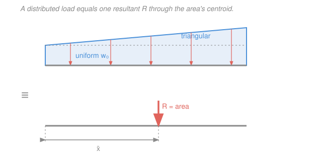

# Statics · Lesson 3.1: Distributed loads & their resultants

> ⏱ ~15 min · Module 3: Distributed forces, centroids & friction · Builds on: [1.4 Couples & equivalent systems](01-04-couples-equivalent-systems.md), integration from [`calc-refresher`](../../calc-refresher/syllabus.md) · Unlocks: [3.2 Centroids of areas](03-02-centroids-of-areas.md) and beam analysis in Module 4

## Why this matters

Real loads are almost never single arrows. Snow on a roof, water against a dam, a stack of books on a shelf, the beam's own weight — these press along a whole length, not at one point. To do equilibrium you learned in Module 1 you need *point* forces, so the first job of any beam or bracket problem is to trade the smeared-out load for one honest resultant force. Get that resultant and where it acts, and the rest is the equilibrium you already know.

## The idea

Picture a load spread along a beam, heavier here, lighter there — described by an **intensity** $w(x)$ measured in newtons per meter: how many newtons are pressing down on each meter of beam at position $x$. Multiply intensity by a tiny width $dx$ and you get a tiny force $w(x)\,dx$. Add up all those slivers and you get the **total** force. That sum is an integral, and geometrically it's just the **area under the load curve**.

But a force needs a *place* to act, not just a size. Where do you put the single equivalent arrow? At the **balance point** of the load — the spot where, if the whole area were a flat cardboard cutout, it would balance on a knife edge. That balance point is the **centroid** of the load area. Heavier regions pull the balance point toward themselves, exactly the way a see-saw balances closer to the heavier kid. So: **size = area, location = centroid of that area.** Two facts, and every distributed-load problem reduces to them.

## The formal version

Let $w(x)$ (in N/m) be the load intensity along a beam, $x$ measured from some reference (say the left end), over $0 \le x \le L$. The **equivalent resultant** is

$$R = \int_0^L w(x)\,dx.$$

*In words: the total force is the area under the load-intensity curve.*

Its **line of action** passes through the horizontal position

$$\bar x = \frac{\displaystyle\int_0^L x\,w(x)\,dx}{\displaystyle\int_0^L w(x)\,dx} = \frac{1}{R}\int_0^L x\,w(x)\,dx.$$

*In words: $\bar x$ is the load-weighted average position — the centroid of the load area.* The numerator $\int x\,w\,dx$ is the load's **moment** about the reference; dividing by the total force finds the point where a single force $R$ produces that same moment. That is precisely the equivalent-system idea from [1.4](01-04-couples-equivalent-systems.md): replace many forces with one force whose magnitude *and* moment match the original.

Two shapes cover most of what you meet, and you should know them cold instead of re-integrating:

- **Uniform load.** Constant intensity $w_0$ over length $L$: a rectangle of load. Then $R = w_0 L$, acting at the **midspan** $\bar x = L/2$.
- **Triangular load.** Intensity rising linearly from $0$ at one end to $w_0$ at the other: a triangle of load. Then $R = \tfrac12 w_0 L$, acting at $\tfrac{2}{3}$ of the length **from the zero end** (equivalently $\tfrac13$ from the peak).

*In words: a uniform load acts at its middle; a triangular load acts two-thirds of the way toward its tall end.* For a composite load (say uniform plus triangular), split it into these pieces, find each piece's $R_i$ and $\bar x_i$, then combine: $R = \sum R_i$ and $\bar x = \big(\sum R_i \bar x_i\big)/R$.

## Picture

## Worked examples

**Example 1 (composite — split into a rectangle and a triangle).** A 6 m beam carries a uniform load $w_0 = 500\,\text{N/m}$ over its whole length, and on top of that a triangular load rising from $0$ at the left end to $300\,\text{N/m}$ at the right end. Find the single resultant and where it acts, measured from the left end.

Treat the two pieces separately.

*Uniform piece.* $R_1 = w_0 L = 500 \times 6 = 3000\,\text{N}$, acting at $\bar x_1 = L/2 = 3\,\text{m}$.

*Triangular piece.* $R_2 = \tfrac12 (300)(6) = 900\,\text{N}$. It rises toward the right, so its centroid sits $\tfrac23$ of the length from the **zero (left)** end: $\bar x_2 = \tfrac23 (6) = 4\,\text{m}$.

*Combine.* Total force is the sum:

$$R = R_1 + R_2 = 3000 + 900 = 3900\,\text{N}.$$

Locate it by matching moments about the left end (force $\times$ distance):

$$\bar x = \frac{R_1\bar x_1 + R_2\bar x_2}{R} = \frac{3000(3) + 900(4)}{3900} = \frac{9000 + 3600}{3900} = \frac{12600}{3900} \approx 3.23\,\text{m}.$$

So a single $3900\,\text{N}$ force at $3.23\,\text{m}$ from the left is fully equivalent. *Check:* the triangle skews load toward the right, so $\bar x$ lands a touch right of the midspan $3\,\text{m}$ — as it must. ✓

**Example 2 (a general curve — integrate).** A load varies quadratically as $w(x) = 50x^2\,\text{N/m}$ over $0 \le x \le 3\,\text{m}$. Find $R$ and $\bar x$.

The resultant is the area:

$$R = \int_0^3 50x^2\,dx = 50\cdot\frac{x^3}{3}\Big|_0^3 = 50\cdot\frac{27}{3} = 450\,\text{N}.$$

The location is the load-weighted average:

$$\bar x = \frac{1}{R}\int_0^3 x\,(50x^2)\,dx = \frac{1}{450}\int_0^3 50x^3\,dx = \frac{1}{450}\cdot 50\cdot\frac{x^4}{4}\Big|_0^3 = \frac{1}{450}\cdot\frac{50\cdot 81}{4} = \frac{1012.5}{450} = 2.25\,\text{m}.$$

*Check:* for any power-law load $w = cx^n$ on $[0,L]$ the centroid sits at $\bar x = \frac{n+1}{n+2}L$. Here $n=2$, $L=3$, giving $\tfrac34(3) = 2.25\,\text{m}$ ✓ — and the same formula reproduces the triangle ($n=1$): $\tfrac23 L$. The load piles up toward the right, so $\bar x$ sits well past the midpoint, as expected.

## Watch out

- **You might think the resultant acts at the middle of the *beam*.** It acts at the centroid of the **load**, not the beam. Only a *uniform* load happens to act at midspan; a triangular or lopsided load does not.
- **You might put the triangular resultant $\tfrac13$ from the zero end.** It's $\tfrac13$ from the **peak**, i.e. $\tfrac23$ from the zero end. Sketch the triangle and remember the balance point sits under the heavy (tall) side.
- **You might combine two pieces by averaging their positions.** You can't average positions — you must weight by each piece's *force*: $\bar x = (\sum R_i\bar x_i)/\sum R_i$. A big rectangle drags the combined line of action toward itself far more than a small triangle does.

## One-liner

> Replace a spread-out load with one force whose size is the area under $w(x)$ and whose line of action runs through that area's centroid $\bar x = \frac{\int x\,w\,dx}{\int w\,dx}$.

## Problems

**P1 (🟢)** A triangular load rises from $0$ at the left end to $600\,\text{N/m}$ at the right end of a $5\,\text{m}$ beam. Find the equivalent resultant and its distance from the left end.

**P2 (🟡)** A simply supported beam $AB$ of length $4\,\text{m}$ (pin at $A$ on the left, roller at $B$ on the right) carries a triangular load: $0$ at $A$ rising to $900\,\text{N/m}$ at $B$. Replace the load by its resultant, then find the support reactions $A_y$ and $B_y$. *(This is exactly the first step of the beam analysis you'll do in Module 4.)*

**P3 (🔴)** A load is distributed as $w(x) = w_0\sin\!\big(\tfrac{\pi x}{L}\big)$ over $0 \le x \le L$, with $w_0 = 1000\,\text{N/m}$ and $L = 2\,\text{m}$. Find the resultant $R$, and give $\bar x$ using a symmetry argument (no second integral needed).

Solutions

**P1** Triangular shortcut. Resultant is the triangle's area:

$$R = \tfrac12 w_0 L = \tfrac12 (600)(5) = 1500\,\text{N}.$$

It acts $\tfrac23$ of the length from the zero (left) end:

$$\bar x = \tfrac23 (5) = \tfrac{10}{3} \approx 3.33\,\text{m}.$$

*Check:* the load is heaviest at the right, so the line of action sits right of midspan ($2.5\,\text{m}$) ✓.

**P2** First the resultant (same triangle shortcut): $R = \tfrac12(900)(4) = 1800\,\text{N}$, acting $\bar x = \tfrac23(4) = \tfrac83 \approx 2.667\,\text{m}$ from $A$.

Now equilibrium of the beam under this single downward $1800\,\text{N}$ force. Take moments about $A$ (counterclockwise positive), with $B_y$ upward at $4\,\text{m}$:

$$\sum M_A = 0:\quad B_y(4) - 1800\left(\tfrac83\right) = 0 \;\Rightarrow\; B_y = \frac{1800\cdot\tfrac83}{4} = \frac{4800}{4} = 1200\,\text{N}.$$

Vertical equilibrium gives the other reaction:

$$\sum F_y = 0:\quad A_y + B_y - 1800 = 0 \;\Rightarrow\; A_y = 1800 - 1200 = 600\,\text{N}.$$

*Check:* the load leans toward $B$, so $B$ carries more ($1200$ vs $600\,\text{N}$), and the two reactions sum to the total load $1800\,\text{N}$ ✓.

**P3** Resultant is the area under the half-sine:

$$R = \int_0^L w_0\sin\!\Big(\tfrac{\pi x}{L}\Big)\,dx = w_0\left[-\tfrac{L}{\pi}\cos\!\Big(\tfrac{\pi x}{L}\Big)\right]_0^L = \tfrac{w_0 L}{\pi}\big(\cos 0 - \cos\pi\big) = \tfrac{w_0 L}{\pi}(1-(-1)) = \frac{2w_0 L}{\pi}.$$

Numerically, $R = \dfrac{2(1000)(2)}{\pi} = \dfrac{4000}{\pi} \approx 1273\,\text{N}$.

For the location: $\sin(\pi x/L)$ is **symmetric about the midpoint** $x = L/2$ (it mirrors: the intensity at $L/2 + a$ equals the intensity at $L/2 - a$). A symmetric load balances at its center, so

$$\bar x = \frac{L}{2} = 1\,\text{m}.$$

*Check:* symmetry means every sliver at distance $a$ right of center is matched by an equal sliver $a$ left of center, so their moments about the midpoint cancel — the centroid must sit exactly at $L/2$ ✓.

## Flashback

**From Lesson 1.5 (Rigid-body equilibrium & supports):** A simply supported beam $AB$ of length $6\,\text{m}$ has a pin at $A$ (left) and a roller at $B$ (right). It carries an $800\,\text{N}$ downward point load $4.5\,\text{m}$ from $A$, plus a counterclockwise applied couple of $600\,\text{N}\cdot\text{m}$. Find the reactions $A_y$ and $B_y$. *(Fresh variant — a point load and a couple, no distributed load.)*

Solution

Moments about $A$ (counterclockwise positive). The upward reaction $B_y$ acts at $6\,\text{m}$; the $800\,\text{N}$ load is clockwise about $A$; the applied couple adds $+600\,\text{N}\cdot\text{m}$ wherever it sits (a couple's moment is the same about every point):

$$\sum M_A = 0:\quad B_y(6) - 800(4.5) + 600 = 0 \;\Rightarrow\; 6B_y = 3600 - 600 = 3000 \;\Rightarrow\; B_y = 500\,\text{N}.$$

Then vertical equilibrium:

$$\sum F_y = 0:\quad A_y + B_y - 800 = 0 \;\Rightarrow\; A_y = 800 - 500 = 300\,\text{N}.$$

*Check:* reactions sum to the $800\,\text{N}$ load ✓; the couple is a free vector that shifts load onto $A$ (lowering $B_y$ from what a bare point load would give), consistent with a counterclockwise couple lifting the right end.

## Connections

- **Backward:** this is the equivalent-system idea of [1.4](01-04-couples-equivalent-systems.md) applied to infinitely many tiny forces — match total force *and* total moment — and the integrals are the definite integrals from [`calc-refresher`](../../calc-refresher/syllabus.md).
- **Forward:** [3.2 Centroids of areas](03-02-centroids-of-areas.md) generalizes $\bar x$ from a load curve to a full 2D area (and adds $\bar y$); in Module 4, replacing distributed loads by resultants is the first move in drawing [shear and bending-moment diagrams](04-02-shear-bending-moment-diagrams.md).
- **Sideways:** the weighted-average integral $\bar x = \frac{\int x\,w\,dx}{\int w\,dx}$ is identical in form to the **center of mass** in the mechanics refresher and to the **mean** of a probability distribution — same machinery, different name for the weight.
