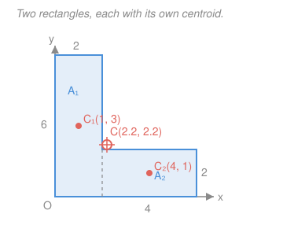

# Statics · Lesson 3.2: Centroids of areas

> ⏱ ~15 min · Module 3: Distributed forces, centroids & friction · Builds on: [3.1 Distributed loads & resultants](03-01-distributed-loads-resultants.md), integration ([`calc-refresher`](../../calc-refresher/syllabus.md)) · Unlocks: [3.3 Dry Coulomb friction](03-03-dry-coulomb-friction.md), [4.3 Second moment of area](04-03-second-moment-of-area-parallel-axis.md)

## Why this matters

In [3.1](03-01-distributed-loads-resultants.md) you replaced a spread-out load with one resultant force — but *where* does that resultant act? At the **centroid** of the load diagram. Same story for a flat plate: its whole weight pulls as if from a single point, the centroid of its area. Get that point wrong and every moment you write afterward is wrong. It's also the pivot for the two lessons ahead: whether a crate *tips* ([3.3](03-03-dry-coulomb-friction.md)) hinges on where its weight line falls, and how a beam resists *bending* ([4.3](04-03-second-moment-of-area-parallel-axis.md)) is measured about the centroid of its cross-section. Find the balance point, and the rest of statics has a place to push from.

## The idea

Cut a shape out of stiff cardboard and try to balance it on a pin. There is exactly one point where it sits level in every direction — the **centroid**. It's the shape's *average position*: take every tiny patch of area, average their locations, and weight the average by how much area sits at each spot. Regions with more area pull the balance point toward them.

You almost never integrate to find it. Real shapes are **built from simple pieces** — rectangles, triangles, circles — whose centroids you already know (a rectangle balances at its center). So you find the whole shape's centroid as a *weighted average of its pieces' centroids*, each weighted by its area. A rectangle with a hole punched in it? Treat the hole as **negative area** and subtract it. And if the shape has a line of symmetry, the centroid must sit *on* that line — often that hands you one coordinate for free.

## The formal version

For a flat region with area $A$, the centroid $(\bar x, \bar y)$ is

$$\bar x = \frac{\displaystyle\int x\,dA}{\displaystyle\int dA}, \qquad \bar y = \frac{\displaystyle\int y\,dA}{\displaystyle\int dA},$$

where $dA$ is an infinitesimal patch of area at position $(x,y)$, and $\int dA = A$. *In words: the centroid is the area-weighted average of the coordinates — where the shape would balance.*

The top integral has a name: the **first moment of area** about an axis, $Q_y = \int x\,dA = \bar x A$ (and $Q_x = \int y\,dA = \bar y A$). *In words: first moment = area times how far its centroid sits from the axis* — the exact same "force times distance" bookkeeping as a moment, with area standing in for force. (This $Q$ is the quantity that returns in [4.3](04-03-second-moment-of-area-parallel-axis.md).)

**Composite-body method.** Split the region into $n$ pieces with known areas $A_i$ and centroids $(\bar x_i, \bar y_i)$. Then

$$\boxed{\;\bar x = \frac{\sum_i \bar x_i A_i}{\sum_i A_i}, \qquad \bar y = \frac{\sum_i \bar y_i A_i}{\sum_i A_i}\;}$$

*In words: add up each piece's (area × centroid), then divide by the total area.* A **hole counts as negative area**: give it a minus sign in every sum, area and first moment alike.

**Symmetry.** If a region is symmetric about an axis, its centroid lies on that axis. *In words: fold the shape on its mirror line and the two halves land on top of each other, so the balance point can only be on the crease.* Two axes of symmetry pin the centroid to their intersection instantly.

You measure every $(\bar x_i, \bar y_i)$ from **one** shared origin. Here are the pieces you'll reuse, each measured from the corner or edge shown:

| Shape | Area | Centroid (from the marked reference) |
|---|---|---|
| Rectangle $b \times h$ | $bh$ | center: $(\tfrac b2, \tfrac h2)$ |
| Right triangle, legs $b,h$ | $\tfrac12 bh$ | $\left(\tfrac b3, \tfrac h3\right)$ from the right-angle corner |
| Triangle (any) | $\tfrac12 bh$ | $\tfrac13$ of the height up from the base |
| Circle, radius $R$ | $\pi R^2$ | its center |
| Semicircle, radius $R$ | $\tfrac12\pi R^2$ | $\tfrac{4R}{3\pi}$ from the flat diameter, on the symmetry axis |
| Quarter circle, radius $R$ | $\tfrac14\pi R^2$ | $\left(\tfrac{4R}{3\pi}, \tfrac{4R}{3\pi}\right)$ from the corner |

## Picture

The L splits along the dashed line into a tall rectangle $A_1$ (the leg) and a short one $A_2$ (the foot). Each piece balances at its center; the whole balances at $C$, pulled toward the leg because that piece carries more area. Notice $C$ still sits *inside* the material here — but for a thin enough L it can fall in the empty notch, outside the shape entirely. A centroid is a location, not necessarily a spot of material.

## Worked examples

**Example 1 — an L-section by the composite method.** Take the L in the figure: a leg $2$ wide and $6$ tall, plus a foot extending $4$ more to the right and $2$ tall, with the origin at the bottom-left corner (units in cm).

*Split into two rectangles and tabulate*, all centroids measured from that one origin:

| Piece | $A_i\ (\text{cm}^2)$ | $\bar x_i\ (\text{cm})$ | $\bar y_i\ (\text{cm})$ | $\bar x_i A_i$ | $\bar y_i A_i$ |
|---|---|---|---|---|---|
| Leg ($2\times 6$) | $12$ | $1$ | $3$ | $12$ | $36$ |
| Foot ($4\times 2$) | $8$ | $4$ | $1$ | $32$ | $8$ |
| **Sum** | $20$ | — | — | $44$ | $44$ |

Divide the moment sums by the total area:

$$\bar x = \frac{44}{20} = 2.2\ \text{cm}, \qquad \bar y = \frac{44}{20} = 2.2\ \text{cm}.$$

*Check by subtraction.* The same L is a full $6\times6$ square (area $36$, centroid $(3,3)$) with the top-right $4\times4$ corner removed (area $16$, centroid $(4,4)$, counted negative):

$$\bar x = \frac{3(36) - 4(16)}{36 - 16} = \frac{108 - 64}{20} = \frac{44}{20} = 2.2\ \text{cm}\ ✓$$

and $\bar y$ likewise. Addition and subtraction agree — that's the sign convention working.

**Example 2 — a plate with a hole (negative area).** A rectangular plate $8$ wide and $4$ tall (origin at bottom-left, cm) has a circular hole of radius $1$ drilled at $(6, 2)$. Where is the centroid?

*Draw it, list two pieces* — the solid rectangle (positive) and the hole (negative):

| Piece | $A_i\ (\text{cm}^2)$ | $\bar x_i$ | $\bar y_i$ |
|---|---|---|---|
| Rectangle $8\times4$ | $+32$ | $4$ | $2$ |
| Hole, $R=1$ | $-\pi \approx -3.14$ | $6$ | $2$ |
| **Sum** | $28.86$ | — | — |

The plate is symmetric about the horizontal line $y = 2$ (the hole is centered on it too), so $\bar y = 2$ with no arithmetic. For $\bar x$:

$$\bar x = \frac{(4)(32) - (6)(\pi)}{32 - \pi} = \frac{128 - 18.85}{28.86} = \frac{109.15}{28.86} \approx 3.78\ \text{cm}.$$

The centroid sits at $(3.78,\ 2)$ — nudged *left* of the plate's center $(4,2)$, away from the hole, exactly as intuition says: removing material on the right shifts the balance point left.

## Watch out

- **You might forget to make the hole's first moment negative too.** A hole subtracts from the *area* sum **and** from the moment sum — both terms carry the minus sign. Subtracting only the area (or only the moment) is the classic wrong answer.
- **You might read each piece's centroid in its own local frame.** Every $(\bar x_i, \bar y_i)$ must be measured from the *same* origin as the final answer. The foot's center is $(4,1)$ from the global corner, not $(2,1)$ from its own left edge.
- **You might put a triangle's centroid at its middle.** It's $\tfrac13$ of the height up from the base (so $\tfrac23$ down from the apex), not halfway. Flipping that $\tfrac13$/$\tfrac23$ is a frequent slip — and the semicircle's $\tfrac{4R}{3\pi} \approx 0.42R$ is measured from the flat edge, not the arc.

## One-liner

> A centroid is the area-weighted average position — build any shape from pieces you know, add up (area × centroid), subtract the holes, and divide by the total area.

## Problems

**P1 (🟢)** A T-section is a horizontal flange $6$ wide and $2$ tall sitting on top of a vertical web $2$ wide and $4$ tall (the web centered under the flange). Using symmetry for the horizontal position, find the height $\bar y$ of the centroid above the bottom of the web.

**P2 (🟡)** A square plate $10 \times 10$ (cm) has a circular hole of radius $2$ drilled at $(7, 5)$, origin at the bottom-left corner. Find $(\bar x, \bar y)$.

**P3 (🔴)** A rectangle $4$ wide and $3$ tall (origin at bottom-left, cm) is capped by a semicircle of radius $2$ centered on the top edge at $(2, 3)$, bulging upward. Find the centroid. (Use the semicircle entry in the table — this is the kind of composite `mechanics-of-materials` needs for a section property.)

Solutions

**P1.** The section is symmetric about its vertical centerline, so $\bar x$ sits there. For $\bar y$, measure from the bottom of the web. Two rectangles:

| Piece | $A_i$ | $\bar y_i$ | $\bar y_i A_i$ |
|---|---|---|---|
| Web $2\times4$ | $8$ | $2$ | $16$ |
| Flange $6\times2$ | $12$ | $4 + 1 = 5$ | $60$ |
| **Sum** | $20$ | — | $76$ |

The web spans $y = 0$ to $4$ (center at $2$); the flange sits from $y = 4$ to $6$ (center at $5$). Then

$$\bar y = \frac{76}{20} = 3.8\ \text{cm above the base.}$$

*Check.* The flange holds more area ($12$ vs $8$) and sits high, so the centroid should ride above the mid-height $3$ — and $3.8 > 3$ ✓. It lands right at the top of the web ($y = 4$ is the web–flange junction), sensible for a top-heavy tee.

**P2.** Solid square minus a circular hole (negative area). By symmetry about $y = 5$ (the hole is centered there), $\bar y = 5$. Areas: square $= 100$, hole $= \pi(2)^2 = 4\pi \approx 12.57$.

$$\bar x = \frac{(5)(100) - (7)(4\pi)}{100 - 4\pi} = \frac{500 - 87.96}{87.43} = \frac{412.04}{87.43} \approx 4.71\ \text{cm}.$$

So the centroid is at $(4.71,\ 5)$ — shifted left of center $(5,5)$, away from the hole on the right. ✓

**P3.** Two positive pieces: the rectangle and the semicircle. Symmetric about $x = 2$, so $\bar x = 2$. For $\bar y$, measure from the bottom.

- Rectangle: $A_1 = 4 \times 3 = 12$, centroid $\bar y_1 = 1.5$.
- Semicircle, $R = 2$: $A_2 = \tfrac12\pi R^2 = 2\pi \approx 6.28$. Its centroid is $\tfrac{4R}{3\pi} = \tfrac{8}{3\pi} \approx 0.85$ above its flat edge, which sits at $y = 3$, so $\bar y_2 = 3 + 0.85 = 3.85$.

$$\bar y = \frac{(1.5)(12) + (3.85)(6.28)}{12 + 6.28} = \frac{18 + 24.18}{18.28} = \frac{42.18}{18.28} \approx 2.31\ \text{cm}.$$

Centroid at $(2,\ 2.31)$. *Check.* Adding a cap above $y=3$ pulls the centroid up from the rectangle's own $1.5$, but the rectangle still dominates the area, so it lands modestly above mid-height — $2.31$ is between the two pieces' centroids ($1.5$ and $3.85$), as any weighted average must be. ✓

## Flashback

**From Lesson 3.1 (Distributed loads & resultants):** A cantilever beam carries a *triangular* distributed load that grows linearly from $0$ at the left end to $w_0 = 600\ \text{N/m}$ at the right end, over a span of $4\ \text{m}$. Find the magnitude of the single equivalent resultant and where along the beam it acts.

Solution

The resultant equals the **area under the load diagram** — here a triangle of base $4\ \text{m}$ and height $600\ \text{N/m}$:

$$R = \tfrac12 (4)(600) = 1200\ \text{N}.$$

It acts through the **centroid of that triangle**. A triangle's centroid sits $\tfrac13$ of the way from its wide end (the base of the load, at the right) — equivalently $\tfrac23$ of the span from the zero end:

$$x = \tfrac23 (4) = 2.67\ \text{m from the left end} \quad (\text{i.e. } 1.33\ \text{m from the loaded right end}).$$

*Check.* Same centroid idea as this whole lesson: the load piles up toward the right, so the resultant's line of action leans right of the beam's midpoint ($2\ \text{m}$) — and $2.67 > 2$ ✓.

## Connections

- **Backward:** this *is* the "where does it act" half of [3.1](03-01-distributed-loads-resultants.md) — the resultant of a distributed load passes through the centroid of the load diagram, and a plate's weight through the centroid of its area. The first moment $Q = \bar x A$ reuses the moment-arm bookkeeping from [1.3](01-03-moment-of-a-force.md).
- **Forward:** the centroid locates a body's weight line, which decides the **tip-vs-slip** contest in [3.3](03-03-dry-coulomb-friction.md); and the second moment of area in [4.3](04-03-second-moment-of-area-parallel-axis.md) is always taken *about the centroidal axis* you learn to find here, via the same composite tables.
- **Sideways (probability & statistics):** $\bar x = \int x\,dA / \int dA$ is exactly the formula for the **mean of a distribution**, $\mu = \int x\, f(x)\,dx$ — area density plays the role of a probability density. The centroid is the "expected position," and the second moment of area is a spatial cousin of the variance.
