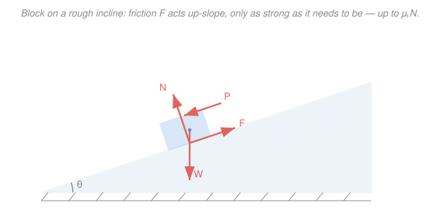
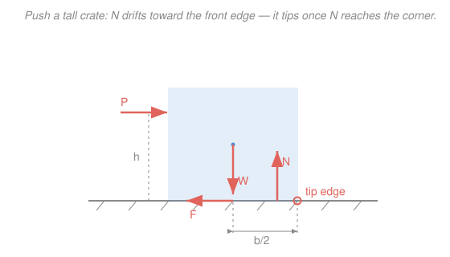

# Statics · Lesson 3.3: Dry (Coulomb) friction

> ⏱ ~15 min · Module 3: Distributed forces, centroids & friction · Builds on: [1.5 Rigid-body equilibrium & supports](01-05-rigid-body-equilibrium-supports.md), [3.2 Centroids of areas](03-02-centroids-of-areas.md) · Unlocks: [3.4 Wedges & belt friction](03-04-wedges-belt-friction.md)

## Why this matters

Nothing you have solved so far could resist a sideways push — a block on frictionless ice slides at the faintest nudge. Friction is what lets a ladder lean without skating out, a clamp grip, a car brake, a crate sit on a ramp instead of avalanching off. But friction is a *sneaky* force: unlike a cable tension you can label and solve for, it silently supplies exactly whatever it takes to keep things still — until it hits a ceiling and gives up. This lesson is about finding that ceiling, and about the second way a pushed object can fail: not by sliding, but by toppling.

## The idea

Press a heavy book flat on a table and push it gently sideways. It doesn't move — friction pushes back with an *equal and opposite* force. Push harder; it still holds, friction growing to match you. Push harder still and — suddenly — it breaks free and slides. Friction was never a fixed number: it was a **reaction that took whatever value equilibrium demanded, up to a maximum it could not exceed**. That maximum is proportional to how hard the surfaces are squeezed together (the normal force). Heavier book, harder to shove.

There is also a *second* failure mode that beginners forget. Push a tall, narrow filing cabinet near the top and it may **tip over** before it ever slides — pivoting about its front bottom edge. Push a flat, wide slab and it slides long before it would tip. Which happens first is a race between two thresholds: the push needed to overcome friction, versus the push needed to overturn the geometry. Statics lets you compute both and call the winner.

## The formal version

**Coulomb's law of dry friction.** For two dry surfaces pressed together with normal force $N$, the friction force $F$ they can exert on each other satisfies

$$F \le \mu_s N,$$

where $\mu_s$ is the **coefficient of static friction** (dimensionless, a property of the surface pair — rubber on concrete $\approx 0.8$, steel on ice $\approx 0.1$). *In words: static friction is whatever it needs to be for equilibrium, but it can never exceed $\mu_s N$.* This is an **inequality**, not an equation — the single most important fact in the lesson. As long as the friction *required* to hold the body is below $\mu_s N$, the body sits and $F$ simply equals the required amount.

**Impending motion.** At the instant slipping is about to begin, friction is maxed out and the inequality becomes an equality:

$$F = \mu_s N \qquad (\text{impending slip}).$$

*In words: right at the tipping point of sliding, friction is at its full strength $\mu_s N$.* This is the condition you impose to find the critical load or angle.

**Kinetic friction.** Once it *is* sliding, friction drops slightly to a constant

$$F_k = \mu_k N, \qquad \mu_k < \mu_s,$$

directed opposite the motion. *In words: it takes more force to start sliding than to keep it going* — which is why a shoved crate lurches once it breaks free.

**The friction angle.** Combine the normal force $N$ and the friction $F$ into a single **contact reaction** $\vec{R}$. It leans away from the surface normal by an angle $\alpha$ with $\tan\alpha = F/N$. Since $F \le \mu_s N$, this lean is capped:

$$\tan\alpha \le \mu_s, \qquad \phi_s \equiv \arctan\mu_s.$$

*In words: the total contact force can tilt at most $\phi_s$ from the normal — the surface can only "grab" within a cone of half-angle $\phi_s$ (the friction cone).* When the required lean exceeds $\phi_s$, the surface can't hold and slip begins.

## Picture

The block's weight $W$ hangs straight down from the centroid. Split it relative to the slope: a component $W\sin\theta$ *along* the surface (the sliding tendency) and $W\cos\theta$ *into* it (what sets $N$). Friction $F$ lines up along the surface, opposing whichever way motion impends.

## Worked examples

**Example 1 — angle of repose, and does a push start it? (block on an incline).**
A $20\,\text{kg}$ block sits on a plane whose tilt $\theta$ we can raise. Surfaces have $\mu_s = 0.30$. Take $g = 9.81\,\text{m/s}^2$, so $W = mg = 196.2\,\text{N}$.

*Draw the FBD* (the Picture above): weight $W$ down, normal $N$ perpendicular to the slope, friction $F$ up the slope (gravity wants to drag it down, so friction resists upward). Resolve along/perpendicular to the surface.

Perpendicular equilibrium: $\;N = W\cos\theta.$
Along the surface: $\;F = W\sin\theta$ (friction supplies exactly the down-slope pull).

**(a) At what angle does it start to slide?** Slip impends when $F = \mu_s N$:

$$W\sin\theta = \mu_s\,W\cos\theta \;\Longrightarrow\; \boxed{\tan\theta = \mu_s}.$$

The weight cancels entirely — mass never mattered. This critical tilt is the **angle of repose**, and note it equals the friction angle: $\theta_s = \arctan\mu_s = \phi_s$.

$$\theta_s = \arctan(0.30) = 16.7^\circ.$$

**(b) Now hold the plane at $\theta = 12^\circ$ (below critical, so it sits) and have a worker lean on it, pushing with force $P$ *down the slope*. How large can $P$ get before it slides?** Add $P$ to the down-slope side. Normal force is unchanged (the push is along the surface): $N = W\cos12^\circ = 196.2(0.978) = 191.9\,\text{N}$, so the friction ceiling is $\mu_s N = 0.30(191.9) = 57.6\,\text{N}$. The down-slope drive is now $W\sin12^\circ + P = 196.2(0.208) + P = 40.8 + P$. Impending slip:

$$40.8 + P = 57.6 \;\Longrightarrow\; P = 16.8\,\text{N}.$$

So it holds for any push up to $16.8\,\text{N}$ and slides beyond. Notice that *before* the push, friction was only carrying $40.8\,\text{N}$ of its available $57.6\,\text{N}$ — the inequality had slack. Friction never volunteers more than the job requires.

**Example 2 — slip or tip? (crate pushed on the flat).**
A uniform crate, weight $W = 500\,\text{N}$, base width $b = 0.6\,\text{m}$, is shoved horizontally by a force $P$ applied at height $h = 1.0\,\text{m}$. The floor has $\mu_s = 0.40$. Does it slide or topple first?

*FBD:* weight $W$ down through the centroid, push $P$ horizontal at height $h$, friction $F$ along the base opposing $P$, normal $N$ up. Vertical and horizontal equilibrium give $N = W$ and $F = P$. Two independent thresholds:

**Threshold to slide.** Slip impends when friction maxes out:

$$P_{\text{slip}} = \mu_s N = \mu_s W = 0.40(500) = 200\,\text{N}.$$

**Threshold to tip.** Here is the key idea: as $P$ grows, the normal force doesn't stay under the center — it **drifts toward the front (leading) edge**, because that's the only way $N$ can generate a moment to counter $P$'s overturning twist. Let $N$ act a distance $x$ ahead of the centerline. Take moments about the *base centerline point* (so $N$'s shift $x$ and $P$'s height $h$ are the only arms; $W$ and $F$ pass through it):

$$N x = P h \;\Longrightarrow\; x = \frac{P h}{W}.$$

Tipping impends when $N$ reaches the front corner, $x = b/2$. Setting $x = b/2$:

$$P_{\text{tip}} = \frac{W\,(b/2)}{h} = \frac{W b}{2h} = \frac{500(0.6)}{2(1.0)} = 150\,\text{N}.$$

**Verdict.** $P_{\text{tip}} = 150\,\text{N} < P_{\text{slip}} = 200\,\text{N}$, so as you ramp up the push the crate **tips first**, at $P = 150\,\text{N}$ — it never gets the chance to slide. The clean test: compare $\mu_s$ against $b/2h$. Here $b/2h = 0.6/2.0 = 0.30 < \mu_s = 0.40$, so tipping wins. Tall-and-narrow or high push ($b/2h$ small) → tips; wide-and-flat or low push ($b/2h$ large) → slides.

## Watch out

- **You might treat friction as always $\mu_s N$.** No — that's only the *maximum*, reached at impending slip. A body sitting comfortably carries whatever friction equilibrium needs, which is usually *less*. Writing $F = \mu_s N$ for a body that isn't on the verge of moving will give you a wrong (too large) friction and a false answer. First ask "is motion impending?"
- **You might forget that the normal force shifts.** In the tipping analysis $N$ is *not* under the centroid — it migrates to the leading edge. If you leave $N$ at the center you'll miss the tipping mode entirely. The shift $x = Ph/W$ is capped at $b/2$; that cap *is* the tipping condition.
- **You might pick the wrong pivot edge.** A body tips about the edge on the *far* side from the push (the front edge, in the direction it's being shoved) — the one the normal force crowds toward. Take moments there (or about the centerline, as above) and check whether $N$ would have to leave the base.

## One-liner

> Static friction is an inequality — it gives back exactly what equilibrium asks, up to $\mu_s N$ — so a pushed body fails whichever way is cheaper: sliding when $\mu_s < b/2h$, tipping when $\mu_s > b/2h$.

## Problems

**P1 (🟢)** A packing box rests on a plank with $\mu_s = 0.35$. You slowly lift one end of the plank, raising its tilt angle. At what angle $\theta$ does the box begin to slide? (Apply the angle-of-repose result.)

**P2 (🟡)** A $30\,\text{kg}$ crate sits on a $20^\circ$ ramp with $\mu_s = 0.50$. (a) Is it in equilibrium on its own? (b) If so, how much friction force is actually acting, and how much *margin* remains before slip? Use $g = 9.81\,\text{m/s}^2$.

**P3 (🔴)** A uniform cabinet weighs $W$, has base width $b = 0.5\,\text{m}$ and is pushed horizontally at height $h = 1.2\,\text{m}$; the floor has $\mu_s = 0.45$. Determine whether it slips or tips first, and express the governing push as a multiple of $W$.

Solutions

**P1** The angle of repose depends only on $\mu_s$: slip impends when $\tan\theta = \mu_s$, so

$$\theta = \arctan(0.35) = 19.3^\circ.$$

Weight and box dimensions never enter — that's the whole charm of the angle-of-repose result. *Check:* a larger $\mu_s$ would give a steeper safe angle, as expected. ✓

**P2** With $m = 30\,\text{kg}$, $W = mg = 294.3\,\text{N}$, $\theta = 20^\circ$.

Normal force: $N = W\cos20^\circ = 294.3(0.940) = 276.6\,\text{N}$.
Friction required to hold it: $F_{\text{req}} = W\sin20^\circ = 294.3(0.342) = 100.7\,\text{N}$.
Maximum friction available: $F_{\max} = \mu_s N = 0.50(276.6) = 138.3\,\text{N}$.

**(a)** Since $F_{\text{req}} = 100.7\,\text{N} \le F_{\max} = 138.3\,\text{N}$, the surface can supply enough — **it stays put.** (Equivalently: $\tan20^\circ = 0.364 < \mu_s = 0.50$, below the angle of repose $\arctan 0.5 = 26.6^\circ$.)

**(b)** The friction *actually acting* is only what equilibrium needs: $F = 100.7\,\text{N}$ — **not** $\mu_s N$. The margin before slip is $F_{\max} - F_{\text{req}} = 138.3 - 100.7 = 37.6\,\text{N}$. *Check:* the block is comfortably below its limit, matching part (a). ✓

**P3** Compare thresholds. Slip needs $P_{\text{slip}} = \mu_s W = 0.45\,W$. Tip needs

$$P_{\text{tip}} = \frac{W b}{2h} = \frac{W(0.5)}{2(1.2)} = \frac{0.5}{2.4}\,W = 0.208\,W.$$

Since $P_{\text{tip}} = 0.208\,W < P_{\text{slip}} = 0.45\,W$, it **tips first**, at $P = 0.208\,W$. Quick test confirms it: $b/2h = 0.5/2.4 = 0.208 < \mu_s = 0.45$, so tipping governs. ✓

## Flashback

**From Lesson 3.2 (Centroids of areas):** An L-shaped bracket is formed by taking a $6\,\text{cm} \times 6\,\text{cm}$ square (corner at the origin, sides along the axes) and cutting away the top-right $4\,\text{cm} \times 4\,\text{cm}$ square. Locate the centroid $(\bar x, \bar y)$ of the remaining L using the composite (negative-area) method.

Solution

Treat the L as the full square **minus** the removed corner (a negative area). Set up the two pieces with their own areas and centroids:

| Piece | Area $A_i$ (cm²) | $\bar x_i$ (cm) | $\bar y_i$ (cm) |
|---|---|---|---|
| Full $6\times6$ square | $+36$ | $3$ | $3$ |
| Removed $4\times4$ corner (from $(2,2)$ to $(6,6)$) | $-16$ | $4$ | $4$ |

Total area: $A = 36 - 16 = 20\,\text{cm}^2$.

$$\bar x = \frac{\sum A_i \bar x_i}{\sum A_i} = \frac{36(3) - 16(4)}{20} = \frac{108 - 64}{20} = \frac{44}{20} = 2.2\,\text{cm}.$$

By symmetry of the L about the line $y = x$, $\bar y = 2.2\,\text{cm}$ as well.

*Check:* the centroid $(2.2, 2.2)$ lies inside the thick part of the L (near the corner), pulled *away* from the missing chunk — exactly where the balance point of a paper L would be. ✓

## Connections

- **Backward:** friction is just one more force on a free-body diagram — everything here runs on the same $\sum F = 0$ and $\sum M = 0$ from [1.5 Rigid-body equilibrium & supports](01-05-rigid-body-equilibrium-supports.md). The tipping analysis needs the weight to act at the [3.2 centroid](03-02-centroids-of-areas.md); the boss problem of this module combines centroid location with the slip-vs-tip test on an incline.
- **Forward:** [3.4 Wedges & belt friction](03-04-wedges-belt-friction.md) stacks friction surfaces (wedges that self-lock when their angle stays inside the friction cone $\phi_s$) and wraps friction around a curve (the capstan equation), both built directly on $F \le \mu_s N$.
- **Sideways (dynamics):** the moment friction is overcome, statics hands off to Newton's second law — the leftover force $P - \mu_k N$ drives the block's acceleration in `engineering-dynamics`. Kinetic friction $\mu_k N$ opposing motion is exactly the resistive force you met analyzing damped, energy-losing systems in the mechanics refresher.
