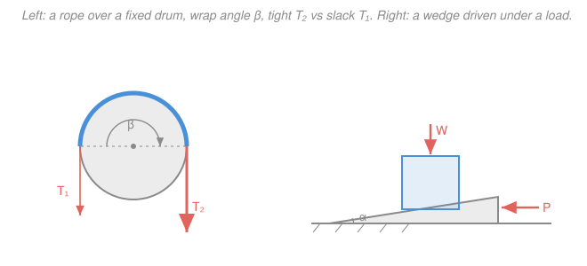
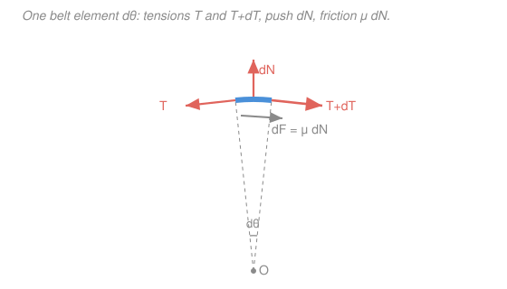

# Statics · Lesson 3.4: Wedges & belt friction

> ⏱ ~15 min · Module 3: Distributed forces, centroids & friction · Builds on: [3.3 Dry (Coulomb) friction](03-03-dry-coulomb-friction.md) · Unlocks: friction reappears in machines & motion — bridge to [`engineering-dynamics`](../../engineering-dynamics/syllabus.md)

## Why this matters

Two of the oldest machines are just friction put to work. A **wedge** — an axe head, a doorstop, a shim under a wobbly table leg — turns a modest sideways push into a huge lifting or splitting force, and then *stays where you drove it* with no one holding it. A **rope wrapped around a post** — a sailor snubbing a ferry to a bollard, a rock climber belaying, the capstan on a winch — lets a hand-sized grip hold a truck-sized load, because friction compounds around every degree of wrap. This lesson closes Module 3 by showing that both effects come straight out of the same $F \le \mu_s N$ you met in [3.3](03-03-dry-coulomb-friction.md) — you just have to draw the free bodies and, for the rope, add up friction over a curve.

## The idea

**A wedge is a portable incline.** Push it horizontally and its sloped face jacks a load upward — trading a long, easy horizontal travel for a short, hard vertical lift (the same bargain a ramp offers). The magic is that friction acts on *every* face the wedge touches, and it always fights the direction the wedge is about to move. Drive the wedge in and friction resists insertion; let go and the load tries to squirt the wedge back out — but if the face is shallow enough, friction alone jams it in place. That "stays put by itself" property is **self-locking**, and it's why a shim never spits back out.

**A rope on a post multiplies force exponentially.** Wrap a line once around a fixed drum and pull one end; friction all along the contact carries part of the load, so the far end can be much larger than the end you hold. Add more wraps and the ratio doesn't just add — it *multiplies*, because each little patch of rope hands off a fixed *fraction* of its tension to the next. Fixed fraction per unit angle is the recipe for an exponential. Three turns around a bollard can let a 50-newton hand grip anchor a several-ton boat.

## The formal version

### Wedges

There's no new law — it's [1.5](01-05-rigid-body-equilibrium-supports.md)'s $\sum F = 0$ applied to **two** free bodies (the block and the wedge), **coupled** through the force they share, with a friction force $F = \mu_s N$ on each contact face pointed *opposite the impending sliding*.

A clean, standard trick from [3.3](03-03-dry-coulomb-friction.md): bundle each contact's normal $N$ and friction $\mu_s N$ into a single **resultant** $R$. It leans away from the surface normal by the **friction angle**

$$\phi = \arctan\mu_s,$$

tilted so it opposes the slide. *In words: at impending motion, "normal plus friction" is one force cocked at angle $\phi$ off the perpendicular.* Working with $R$ and $\phi$ turns the two coupled free bodies into two little force triangles.

**Self-locking.** Remove the driving force. Will the load push the wedge back out? Treat the wedge's inclined face as a movable incline of slope angle $\alpha$: the load can only slide the wedge out if the face is steeper than the friction angle. So

$$\boxed{\;\alpha < \phi = \arctan\mu_s \;\Rightarrow\; \text{self-locking}\;}$$

*In words: if the wedge angle is smaller than the friction angle, friction holds it with no sustained force — exactly the "won't slide down on its own" condition from the block-on-an-incline in [3.3](03-03-dry-coulomb-friction.md).* (Friction on the *second* face, against the floor, only helps, so this is a safe, conservative design rule — see Watch out.)

### Belt / capstan friction

A flexible belt or rope wraps a fixed drum over a **wrap angle** $\beta$ (measured in **radians**, and it can exceed $2\pi$ — one full turn is $2\pi$). It's about to slip. Let $T_2$ be the **tight side** and $T_1$ the **slack side** ($T_2 > T_1$). Then

$$\boxed{\;T_2 = T_1\, e^{\mu\beta}\;}$$

*In words: the tension you can hold grows exponentially with how far the rope wraps and how rough the contact is* — and, strikingly, **the drum's radius doesn't appear.** A fat post and a thin post hold the same ratio; only the wrap angle counts.

**Where it comes from (differential belt element).** Look at a tiny slice of rope spanning angle $d\theta$ (figure below). Its neighbors pull it with tensions $T$ on one side and $T + dT$ on the other; the drum pushes out with a normal $dN$ and, at impending slip, rubs back with friction $\mu\,dN$.

- **Radial ($\perp$ to the surface):** the two tensions each tip inward by the half-angle $d\theta/2$, so their inward components sum to $2\cdot T\sin(d\theta/2) \approx T\,d\theta$, balanced by the outward normal:
$$dN = T\,d\theta.$$
- **Tangential (along the surface):** the tension difference is carried by friction:
$$(T + dT) - T = \mu\,dN \;\;\Rightarrow\;\; dT = \mu\,dN = \mu\,T\,d\theta.$$

Separate and integrate from the slack end ($T_1$, $\theta = 0$) to the tight end ($T_2$, $\theta = \beta$):

$$\int_{T_1}^{T_2}\frac{dT}{T} = \mu\int_0^\beta d\theta \;\;\Rightarrow\;\; \ln\frac{T_2}{T_1} = \mu\beta \;\;\Rightarrow\;\; T_2 = T_1 e^{\mu\beta}.$$

*In words: each patch adds a fixed fractional bump $\mu\,d\theta$ to the tension, and fixed-fraction growth compounds into an exponential.* (For a stationary rope not yet slipping, this gives the **maximum** ratio it can hold; the actual ratio can be anything up to $e^{\mu\beta}$.)

## Picture

The differential belt element behind the capstan equation:

## Worked examples

**Example 1 (capstan — how many wraps?).** A deckhand must snub a barge that pulls the line with $T_2 = 6000\,\text{N}$, using a hand force of only $T_1 = 150\,\text{N}$ on the slack end. The bollard has $\mu = 0.35$. How much wrap angle — and how many full turns — does that take?

Solve the capstan equation for $\beta$:

$$\frac{T_2}{T_1} = e^{\mu\beta} \;\Rightarrow\; \mu\beta = \ln\frac{T_2}{T_1} \;\Rightarrow\; \beta = \frac{1}{\mu}\ln\frac{T_2}{T_1} = \frac{1}{0.35}\ln\frac{6000}{150} = \frac{\ln 40}{0.35} = \frac{3.689}{0.35} \approx 10.5\,\text{rad}.$$

Convert to turns ($2\pi$ rad per turn):

$$n = \frac{\beta}{2\pi} = \frac{10.5}{6.283} \approx 1.68\ \text{turns.}$$

So he needs **at least 1.68 turns** — in practice **2 full wraps**. And notice the margin two wraps buy: with $\beta = 4\pi$, the holdable ratio is $e^{0.35\,(4\pi)} = e^{4.40} \approx 81$, so those two turns let a 150 N grip hold up to $81 \times 150 \approx 12{,}000\,\text{N}$ — double the barge. That runaway margin, from one extra loop, *is* the exponential.

**Example 2 (wedge — insertion force and self-locking).** A block weighing $W = 2000\,\text{N}$ is raised by driving a wedge of angle $\alpha = 8^\circ$ beneath it. The block is held by a smooth (frictionless) vertical guide, so it can only move up; the wedge slides on the floor. Static friction on **both** wedge faces is $\mu_s = 0.3$, so $\phi = \arctan 0.3 = 16.7^\circ$. Find the horizontal push $P$ to start driving the wedge in, and check self-locking.

*Draw the free bodies.* Impending motion: wedge slides in (horizontally), block rises. Replace each contact by its resultant tilted by $\phi$ against the slide.

*Block* (weight $W$ down, smooth guide gives a purely horizontal reaction, and the wedge-face resultant $R_1$). The face is inclined at $\alpha$, so $R_1$ sits at angle $\alpha + \phi$ from vertical. Vertical balance on the block:

$$R_1\cos(\alpha + \phi) = W \;\Rightarrow\; R_1 = \frac{W}{\cos(\alpha+\phi)}.$$

*Wedge* (the reaction $R_1$ pressing down-and-back, the floor resultant $R_2$ at angle $\phi$ from vertical, and the push $P$). Vertical and horizontal balance:

$$R_2\cos\phi = W, \qquad P = R_1\sin(\alpha+\phi) + R_2\sin\phi.$$

Substituting $R_1$ and $R_2$ collapses this to a tidy formula:

$$P = W\big[\tan(\alpha + \phi) + \tan\phi\big] = 2000\big[\tan 24.7^\circ + \tan 16.7^\circ\big] = 2000\,[0.460 + 0.300] \approx 1520\,\text{N}.$$

*Self-locking?* The wedge angle $\alpha = 8^\circ$ is less than the friction angle $\phi = 16.7^\circ$, so $\alpha < \phi$: **yes.** Once driven in, the wedge holds the 2000 N load with the push removed — the floor friction only adds to the safety margin. A gentle taper is what makes shims and doorstops stay.

## Watch out

- **You might think you can leave a face out of the free body.** Every surface the wedge touches carries a normal *and* a friction force, and each friction arrow points opposite that face's impending slide — miss one and the coupled equations won't close. Draw both free bodies before writing a single equation.
- **You might use degrees in $e^{\mu\beta}$.** The wrap angle $\beta$ must be in **radians**. A half-wrap is $\pi$, a full turn $2\pi$; three turns is $6\pi \approx 18.8$, not 1080.
- **You might expect the self-locking cutoff to be exactly $\phi$.** With friction on **both** wedge faces the true no-back-out threshold is more forgiving (closer to $2\phi$). Using $\alpha < \phi$ is the single-face rule — conservative and safe, which is exactly what you want when designing a wedge to *not* let go.
- **You might mix up tight and slack.** In $T_2 = T_1 e^{\mu\beta}$, $T_2$ is always the **larger** tension. The rope is about to slip *from* the tight side *toward* the slack side, and friction is what holds the difference.

## One-liner

> Friction on every wedge face jams a shallow wedge in place ($\alpha < \arctan\mu_s$), and friction compounding around a post multiplies rope tension exponentially, $T_2 = T_1 e^{\mu\beta}$ — radius be damned.

## Problems

**P1 (🟢)** A mooring line pulls a barge cleat with $5000\,\text{N}$. A dockworker wants to hold it against a bollard ($\mu = 0.3$) with a $50\,\text{N}$ grip. What wrap angle $\beta$ is required, and how many full turns is that?

**P2 (🟡)** A wedge of angle $\alpha = 6^\circ$ is driven under a $W = 1500\,\text{N}$ load; both faces have $\mu_s = 0.25$ (so $\phi = \arctan 0.25 = 14.0^\circ$). The load is guided vertically. (a) Find the horizontal force $P$ to start inserting the wedge. (b) Is it self-locking?

**P3 (🔴)** A flat belt drives a pulley of radius $r = 0.20\,\text{m}$ with wrap angle $\beta = 170^\circ$ and $\mu = 0.30$. The slack side is pretensioned to $T_1 = 200\,\text{N}$. Find the largest tight-side tension $T_2$ before the belt slips, and the maximum torque the belt can transmit to the pulley. *(This is the belt-drive that powers machinery in [`engineering-dynamics`](../../engineering-dynamics/syllabus.md).)*

Solutions

**P1.** Solve the capstan equation for the wrap angle:

$$\beta = \frac{1}{\mu}\ln\frac{T_2}{T_1} = \frac{1}{0.3}\ln\frac{5000}{50} = \frac{\ln 100}{0.3} = \frac{4.605}{0.3} \approx 15.35\,\text{rad}.$$

Number of turns:

$$n = \frac{\beta}{2\pi} = \frac{15.35}{6.283} \approx 2.44\ \text{turns.}$$

He needs at least 2.44 turns, so **3 full wraps** does it (with margin to spare).

*Check.* Three wraps ($\beta = 6\pi = 18.85$) hold a ratio $e^{0.3\cdot 18.85} = e^{5.65} \approx 285$ — a 50 N grip could then hold up to $\approx 14{,}000\,\text{N}$, comfortably above 5000 N. Units: $\ln(\cdot)$ is dimensionless and $\mu$ is dimensionless, so $\beta$ is in radians. ✓

**P2.** (a) Same routine as Example 2, $P = W[\tan(\alpha + \phi) + \tan\phi]$:

$$P = 1500\big[\tan(6^\circ + 14.0^\circ) + \tan 14.0^\circ\big] = 1500\big[\tan 20.0^\circ + 0.25\big] = 1500\,[0.364 + 0.250] \approx 921\,\text{N}.$$

(b) $\alpha = 6^\circ < \phi = 14.0^\circ$, so **yes, self-locking** — it stays under the load once inserted.

*Check.* Sanity on the formula: at $\alpha = 0$ (a flat slab, no lift), $P = W[\tan\phi + \tan\phi] = 2\mu_s W$ — just the friction on the two faces, as it must be. Here $\alpha > 0$ adds the lifting penalty $\tan(\alpha+\phi) - \tan\phi > 0$. ✓

**P3.** Convert the wrap angle to radians: $\beta = 170^\circ \times \dfrac{\pi}{180} = 2.967\,\text{rad}$, so $\mu\beta = 0.30 \times 2.967 = 0.890$.

Maximum tight-side tension before slip:

$$T_2 = T_1 e^{\mu\beta} = 200\,e^{0.890} = 200 \times 2.435 \approx 487\,\text{N}.$$

The pulley feels the *difference* in tension at its rim; the torque transmitted is that net rim force times the radius:

$$\tau = (T_2 - T_1)\,r = (487 - 200)(0.20) \approx 57\,\text{N}\cdot\text{m}.$$

*Check.* The tension ratio $e^{0.89} = 2.44$ is under 3 (a modest wrap), and the drive torque is the *slip-limited* maximum — ask for more and the belt slips, which is exactly what a belt drive does as an overload safety. This bridges to power transmission in `engineering-dynamics`. ✓

## Flashback

**From Lesson 3.3 (Dry Coulomb friction — slip vs. tip):** A uniform crate sits on a rough surface that is slowly tilted into an incline. The crate is $b = 0.5\,\text{m}$ wide and $h = 1.2\,\text{m}$ tall, with $\mu_s = 0.35$. As the incline angle $\theta$ increases, does the crate **slip** or **tip** first, and at what angle?

Solution

Two competing failures, each with its own critical angle:

- **Slip** impends when the down-slope pull equals the max friction: $W\sin\theta = \mu_s W\cos\theta \Rightarrow \tan\theta = \mu_s$.
$$\theta_{\text{slip}} = \arctan(0.35) \approx 19.3^\circ.$$
- **Tip** impends when the weight's line of action (through the centroid) reaches the lower edge: $\tan\theta = \dfrac{b/2}{h/2} = \dfrac{b}{h}$.
$$\theta_{\text{tip}} = \arctan\!\frac{0.5}{1.2} = \arctan(0.417) \approx 22.6^\circ.$$

Whichever angle is reached first wins. Since $\theta_{\text{slip}} = 19.3^\circ < \theta_{\text{tip}} = 22.6^\circ$, the crate **slips first, at about $19.3^\circ$.**

*Check.* A tall, narrow crate ($h \gg b$) tips easily (small $\theta_{\text{tip}}$); a short, wide one slides first. Here it's middling and slip barely wins — a slightly grippier surface (larger $\mu_s$) or a taller crate would flip the outcome to tipping. This slip-vs-tip test is the heart of Boss Problem 3. ✓

## Connections

- **Backward:** both effects are [3.3](03-03-dry-coulomb-friction.md)'s $F \le \mu_s N$ and its **friction angle** $\phi = \arctan\mu_s$ — the wedge is that lesson's block-on-an-incline made movable (self-locking is "won't slide down on its own"), and the capstan is Coulomb friction *integrated* around a curved contact. Setting up the coupled free bodies is the two-body equilibrium of [1.5](01-05-rigid-body-equilibrium-supports.md).
- **Forward:** friction doesn't retire when things start moving — in [`engineering-dynamics`](../../engineering-dynamics/syllabus.md) the same belt equation governs belt drives, band brakes, and clutches transmitting power, and wedge/screw self-locking sets whether a jack or fastener backs off under vibration.
- **Sideways (calculus):** $dT = \mu\,T\,d\theta$ is the archetypal linear ODE $\frac{dy}{dx} = ky$ — the *same* fixed-fraction-per-step growth behind compound interest and radioactive decay from [`calc-refresher`](../../calc-refresher/syllabus.md). The rope's tension compounds around the drum exactly as money compounds over time; $e^{\mu\beta}$ is compound interest wearing a rope.
