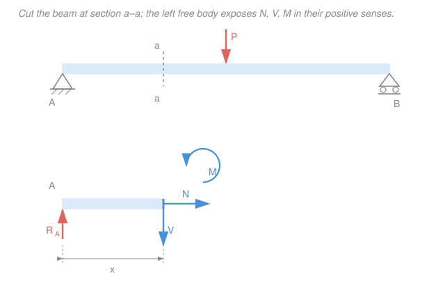

# Statics · Lesson 4.1: Internal forces — normal, shear & bending moment

> ⏱ ~15 min · Module 4: Internal forces & moments of inertia · Builds on: [1.5 Rigid-body equilibrium & supports](01-05-rigid-body-equilibrium-supports.md), [3.1 Distributed loads & resultants](03-01-distributed-loads-resultants.md) · Unlocks: [4.2 Shear & bending-moment diagrams](04-02-shear-bending-moment-diagrams.md)

## Why this matters

You can now find every *external* reaction on a beam — but the beam doesn't fail at the supports, it fails somewhere in the *middle*, where the material is quietly being stretched, sheared, and bent. To size a floor joist, a bridge girder, or a bracket, you need the forces *inside* the member at the worst cross-section. This lesson is the hinge between statics and [mechanics of materials](../../mechanics-of-materials/syllabus.md): the internal loads $N$, $V$, $M$ you extract here are exactly what turn into stresses. Miss them and you're guessing at strength.

## The idea

Here's the whole trick, and it's beautifully simple: **to see what a beam carries at some point, imagine slicing it right there.** The instant you cut, the piece you keep would fly apart — the material you removed was holding it. So whatever forces the removed part *was* exerting across that cut, you draw them back in as unknowns. Then you demand that your retained piece still balance ($\sum F = 0$, $\sum M = 0$), and those equations hand you the internal loads.

It takes exactly three quantities to describe what one face of a cut transmits to the other:

- a pull or push **along** the beam's axis — the **normal force** $N$ (this is what a rope or column carries);
- a sliding force **across** the axis, like scissors — the **shear force** $V$;
- a twist that tries to **bend** the beam — the **bending moment** $M$.

That's it. Cut, expose $N$, $V$, $M$, and balance the piece. It's the [method of sections](02-02-method-of-sections.md) from trusses, now applied to a single continuous member instead of a bar assembly.

## The formal version

At any cross-section, the material on one side exerts on the other side a resultant force and a resultant couple. Resolved relative to the beam axis, they are:

- **Normal force $N$** — the component *along* the axis. Positive $N$ = **tension** (the two faces pull away from each other).
- **Shear force $V$** — the component *perpendicular* to the axis (transverse).
- **Bending moment $M$** — the couple about the axis perpendicular to the page.

*In words: $N$ pulls, $V$ slides, $M$ bends.*

**Sign convention (memorize this).** Signs are meaningless until we fix directions, so here is the standard one, stated for the **left** free body (the piece to the *left* of the cut), on its exposed right face:

$$
\boxed{\;N>0:\ \text{tension (points away from the cut)}\quad V>0:\ \text{points down}\quad M>0:\ \text{sagging (concave up)}\;}
$$

*In words: positive $N$ stretches the beam, positive $V$ on the left piece pushes its cut face down, and positive $M$ makes the beam smile (top fibers squeezed, bottom fibers stretched).* On the **right** free body the same internal loads appear reversed (Newton's third law): $N$ still points away from the cut, but $V$ points up and the positive $M$ couple reverses — the two faces always carry equal-and-opposite loads.

**The method (four steps).**

1. **Find the external reactions** from the whole-beam FBD ($\sum F_x=0$, $\sum F_y=0$, $\sum M=0$) — the same rigid-body equilibrium as [1.5](01-05-rigid-body-equilibrium-supports.md). *(You may skip this if you cut toward a free end — see Example 2.)*
2. **Cut at the section** of interest and keep one portion.
3. **Draw the free body** of that portion with $N$, $V$, $M$ at the cut in their positive senses.
4. **Apply $\sum F_x=0,\ \sum F_y=0,\ \sum M_{\text{cut}}=0$** to the piece. Sum moments *about the cut point* so $N$ and $V$ drop out and $M$ falls straight into your lap.

## Picture

The top shows the whole beam and where we cut. The bottom is the left free body: reaction $R_A$ holds it up, and across the exposed face the removed part transmits $N$ (axial), $V$ (down = positive shear), and $M$ (counterclockwise = positive, sagging). Summing forces and moments on this one piece gives all three.

## Worked examples

**Example 1 — simply supported beam, central point load.** A beam of span $L=6\,\text{m}$ is simply supported (pin at $A$, roller at $B$) and carries a downward point load $P=12\,\text{kN}$ at midspan. Find $N$, $V$, $M$ at a section $x=2\,\text{m}$ from $A$.

*Step 1 — reactions.* By symmetry (load dead-center),

$$R_A = R_B = \frac{P}{2} = 6\,\text{kN (up).}$$

*Step 2–3 — cut at $x=2\,\text{m}$ (left of the load) and keep the left piece.* Its FBD: $R_A=6\,\text{kN}$ up at the left end, and $N$, $V$, $M$ at the right cut face (positive senses, as in the Picture).

*Step 4 — equilibrium.* No horizontal loads, so

$$\sum F_x = 0:\quad N = 0.$$

$$\sum F_y = 0:\quad R_A - V = 0 \;\Rightarrow\; V = R_A = 6\,\text{kN}.$$

Summing moments about the cut (counterclockwise positive; $R_A$ acts a distance $x$ to the left, giving a clockwise moment $R_A x$):

$$\sum M_{\text{cut}} = 0:\quad M - R_A x = 0 \;\Rightarrow\; M = R_A x = 6 \times 2 = 12\,\text{kN}\cdot\text{m}.$$

Both positive: the beam is in positive (sagging) bending here and carries $6\,\text{kN}$ of shear, no axial load. *(Sanity: at midspan $M=R_A\cdot\tfrac{L}{2}=6\times3=18\,\text{kN}\cdot\text{m}=\tfrac{PL}{4}$, the familiar peak.)*

**Example 2 — cantilever, inclined end load (all three loads at once).** A cantilever of length $L=4\,\text{m}$ is fixed to a wall at its left end. At the free right end a cable pulls with a horizontal component $H=6\,\text{kN}$ (away from the wall) and a vertical component $P=4\,\text{kN}$ (down). Find $N$, $V$, $M$ at the wall and at midspan.

*The shortcut:* cut and keep the piece toward the **free end** — it has no reactions on it, so we skip Step 1 entirely. Cut at distance $x$ from the wall; the retained right piece (length $L-x$) carries only the tip loads $H$ and $P$, plus $N$, $V$, $M$ at its left cut face.

$$\sum F_x = 0:\quad N = H = 6\,\text{kN (tension), for every }x.$$

$$\sum F_y = 0:\quad V = P = 4\,\text{kN, for every }x.$$

Moments about the cut: $H$ acts along the beam's axis, so its line of action passes through the cut — zero lever arm, no contribution. Only $P$, acting a distance $(L-x)$ out toward the tip, bends the section:

$$\sum M_{\text{cut}} = 0:\quad M = -P\,(L-x).$$

The minus sign says the cantilever **hogs** (concave down, top fibers in tension) — the opposite of Example 1's sag, and exactly what your intuition expects for a diving board. Evaluate:

$$M_{\text{wall}}\;(x=0) = -P L = -(4)(4) = -16\,\text{kN}\cdot\text{m}, \qquad M_{\text{mid}}\;(x=2) = -(4)(2) = -8\,\text{kN}\cdot\text{m}.$$

So $N=6\,\text{kN}$ and $V=4\,\text{kN}$ are constant along the beam, while $|M|$ grows from $8$ to a maximum of $16\,\text{kN}\cdot\text{m}$ **at the wall** — which is why cantilevers crack where they meet the support.

## Watch out

- **You might think you can jump straight to the cut.** For most sections you can't — the retained piece includes a support whose reaction you don't yet know, so you *must* find reactions first (Step 1). The one escape is cutting toward a *free* end, as in Example 2.
- **You might sum moments about the wrong point.** Always sum about the **cut**: that kills the unknowns $N$ and $V$ (their lines pass through the point) and isolates $M$. And only include forces on the piece you *kept* — the removed part is gone, replaced by $N,V,M$.
- **A negative answer is not a mistake.** $M<0$ just means hogging instead of sagging; $V<0$ means the shear points the other way. Report the sign — it tells the next engineer which fibers are in tension.

## One-liner

> To read what a beam carries inside, cut it: the exposed $N$, $V$, and $M$ are precisely the forces that keep the free portion in equilibrium.

## Problems

**P1 (🟢)** A simply supported beam of span $8\,\text{m}$ (pin at $A$ on the left, roller at $B$ on the right) carries a single downward point load $P=10\,\text{kN}$ located $3\,\text{m}$ from $A$. Find the reactions, then find $N$, $V$, and $M$ at a section $2\,\text{m}$ from $A$.

**P2 (🟡)** A cantilever of length $3\,\text{m}$, fixed at its left wall, carries a uniform distributed load $w=4\,\text{kN/m}$ over its entire length. Working from the free-end side, find $V$ and $M$ at the wall and at midspan. *(Hint: replace the distributed load on your retained piece by its resultant — [Lesson 3.1](03-01-distributed-loads-resultants.md).)*

**P3 (🔴, optional — bridge to mechanics of materials)** The section in P1 carries $M=12.5\,\text{kN}\cdot\text{m}$. The beam has a solid rectangular cross-section, $100\,\text{mm}$ wide and $200\,\text{mm}$ deep. Using $I=\dfrac{bh^3}{12}$ and $c=\dfrac{h}{2}$, compute the maximum bending stress $\sigma = \dfrac{Mc}{I}$.

Solutions

**P1** *Reactions.* Sum moments about $A$ (counterclockwise positive), with $R_B$ up at $8\,\text{m}$ and $P$ down at $3\,\text{m}$:

$$\sum M_A = 0:\quad R_B(8) - (10)(3) = 0 \;\Rightarrow\; R_B = \frac{30}{8} = 3.75\,\text{kN}.$$

$$\sum F_y = 0:\quad R_A + R_B - P = 0 \;\Rightarrow\; R_A = 10 - 3.75 = 6.25\,\text{kN (up).}$$

*Cut at $x=2\,\text{m}$*, which is left of the load, and keep the left piece (only $R_A$ acts on it):

$$N = 0 \quad(\text{no horizontal loads}).$$
$$\sum F_y = 0:\quad V = R_A = 6.25\,\text{kN}.$$
$$\sum M_{\text{cut}} = 0:\quad M = R_A x = 6.25 \times 2 = 12.5\,\text{kN}\cdot\text{m}\ \ (\text{sagging}).$$

*Check.* Both positive, load not yet reached, so pure sagging with the full left reaction as shear — consistent. ✓

**P2** Cut at distance $x$ from the wall and keep the **right** piece (length $3-x$); it carries only the UDL. The resultant of $w$ over that length is

$$R = w(3-x)\ \text{(down), acting at its midpoint, a distance } \tfrac{3-x}{2}\ \text{from the cut.}$$

$$V = w(3-x), \qquad M = -R\cdot\frac{3-x}{2} = -\frac{w(3-x)^2}{2}.$$

*At the wall* ($x=0$): $\;V = 4(3) = 12\,\text{kN}, \quad M = -\dfrac{4(3)^2}{2} = -18\,\text{kN}\cdot\text{m}.$

*At midspan* ($x=1.5$): $\;V = 4(1.5) = 6\,\text{kN}, \quad M = -\dfrac{4(1.5)^2}{2} = -\dfrac{4(2.25)}{2} = -4.5\,\text{kN}\cdot\text{m}.$

*Check.* Total load is $4\times3=12\,\text{kN}$, matching the wall shear; the moment hogs (negative) and is largest at the wall, as every cantilever does. ✓

**P3** With $b=0.1\,\text{m}$, $h=0.2\,\text{m}$:

$$I = \frac{bh^3}{12} = \frac{(0.1)(0.2)^3}{12} = \frac{(0.1)(0.008)}{12} = 6.67\times10^{-5}\,\text{m}^4, \qquad c = \frac{h}{2} = 0.1\,\text{m}.$$

With $M = 12.5\,\text{kN}\cdot\text{m} = 12\,500\,\text{N}\cdot\text{m}$:

$$\sigma = \frac{Mc}{I} = \frac{(12\,500)(0.1)}{6.67\times10^{-5}} = 1.875\times10^{7}\,\text{Pa} = 18.75\,\text{MPa}.$$

*Check.* Comfortably below the yield strength of structural steel (~250 MPa), so this section is fine — and this is exactly the calculation `mechanics-of-materials` opens with. The bending moment you found is the whole input. ✓

## Flashback

**From Lesson 3.1 (Distributed loads & resultants):** A beam carries a *triangular* distributed load that grows linearly from $0$ at the left end to $w_0 = 6\,\text{kN/m}$ at the right end, over a length of $4\,\text{m}$. Find the magnitude of the equivalent resultant force and its location from the left end.

Solution

The resultant equals the *area* under the load diagram — here a triangle of base $4\,\text{m}$ and height $6\,\text{kN/m}$:

$$R = \tfrac12 (4)(6) = 12\,\text{kN (down).}$$

It acts through the triangle's centroid, which sits $\tfrac{2}{3}$ of the way from the vertex (zero end) toward the base (tall end):

$$\bar{x} = \tfrac{2}{3}(4) = 2.67\,\text{m from the left end.}$$

*Check.* The resultant leans toward the heavy (right) side — past the geometric middle at $2\,\text{m}$ — as it must. This is the very move you used inside P2 to collapse a distributed load into a single force before cutting. ✓

## Connections

- **Backward:** this is [rigid-body equilibrium (1.5)](01-05-rigid-body-equilibrium-supports.md) applied to a *slice* of a beam — same $\sum F=0,\ \sum M=0$ — and P2 reuses the [distributed-load resultant (3.1)](03-01-distributed-loads-resultants.md) to handle the spread-out load on the cut piece.
- **Forward:** [4.2 Shear & bending-moment diagrams](04-02-shear-bending-moment-diagrams.md) turns the single-cut answers here into functions $V(x)$ and $M(x)$ along the whole beam, revealing the critical section — and [4.3](04-03-second-moment-of-area-parallel-axis.md) supplies the $I$ that P3 needs.
- **Sideways:** the cut-and-expose move is the [method of sections (2.2)](02-02-method-of-sections.md) generalized from a truss to a continuous member; and the equal-and-opposite loads on the two cut faces are Newton's third law — the same action–reaction bookkeeping you used for equilibrium in the mechanics refresher.
