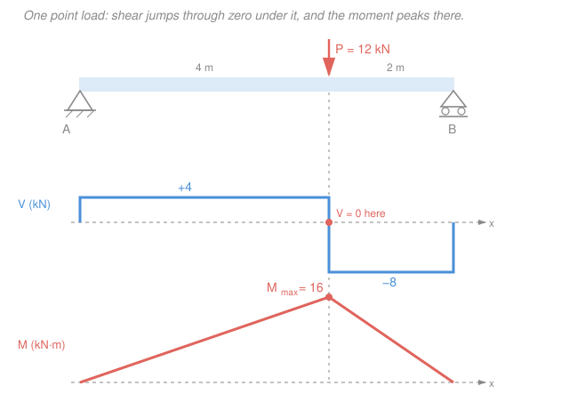
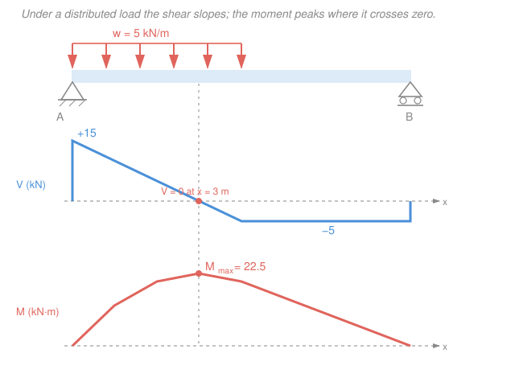

# Statics · Lesson 4.2: Shear & bending-moment diagrams

> ⏱ ~15 min · Module 4: Internal forces & moments of inertia · Builds on: [4.1 Internal forces: N, V, M](04-01-internal-forces-normal-shear-bending.md), [`calc-refresher`](../../calc-refresher/syllabus.md) (slope & area) · Unlocks: [4.3 Second moment of area & parallel-axis](04-03-second-moment-of-area-parallel-axis.md), and beam design in `mechanics-of-materials`

## Why this matters

In [4.1](04-01-internal-forces-normal-shear-bending.md) you learned to cut a beam at *one* section and read off the internal shear $V$ and bending moment $M$ there. But a designer doesn't care about one section — they care about the *worst* one. A beam fails where the bending moment is largest, and that spot is rarely where you'd guess. A **shear-force and bending-moment diagram** is a plot of $V$ and $M$ along the *whole* beam, and its job is to hand you the single number that sizes the beam: $M_{\max}$, and where it lives. Every floor joist, bridge girder, and aircraft spar is sized off this one picture.

## The idea

You could cut the beam at fifty sections and redo the [4.1](04-01-internal-forces-normal-shear-bending.md) equilibrium fifty times. Don't. There's a shortcut hiding in calculus: **as you slide the cut along the beam, $V$ and $M$ don't change randomly — they change according to the load you're walking past.**

Picture walking left-to-right along the beam, carrying a running tally of $V$ and $M$:

- **A point load** is a sudden shove. When you step past a downward point load, your shear tally instantly *drops* by that load — a vertical **jump** in the $V$ diagram.
- **A distributed load** (load spread over length, intensity $w$ in force-per-length) bleeds shear away gradually: the heavier the carpet of load, the faster $V$ falls. So $V$ *slopes*, and the slope is $-w$.
- **The moment** is the running total of shear: wherever there's positive shear, $M$ is climbing; wherever shear is negative, $M$ is falling. So $M$ **peaks exactly where the shear passes through zero** — that's the flat top of the moment curve, and the critical section for design.

That last sentence is the whole lesson. Find where $V = 0$; that's where $M$ is biggest.

## The formal version

Take a tiny slice of beam of width $dx$ carrying distributed load $w(x)$ (downward positive, units N/m). Writing $\sum F_y = 0$ and $\sum M = 0$ on that slice and shrinking it gives the two **load–shear–moment relations**:

$$\frac{dV}{dx} = -w(x), \qquad \frac{dM}{dx} = V(x).$$

*In words: the load is minus the slope of the shear, and the shear is the slope of the moment.* Read them from either end — as rates, or (integrating) as areas:

$$V_2 - V_1 = -\int_{x_1}^{x_2} w\,dx = -(\text{area under the load}), \qquad M_2 - M_1 = \int_{x_1}^{x_2} V\,dx = (\text{area under the shear}).$$

*In words: the change in shear between two points is minus the load-area between them; the change in moment is the shear-area between them.* This is just the [`calc-refresher`](../../calc-refresher/syllabus.md) fact that a function's change equals the integral of its slope — applied to beams.

Two things the smooth relations *miss*, because they involve concentrated effects:

- **A downward point load $P$** makes $V$ **jump down by $P$** at that point (an infinite $w$ over zero width). $M$ stays continuous but gets a kink (a sudden change of slope).
- **An applied couple (concentrated moment) $M_0$** makes $M$ **jump** by $M_0$ at that point; it leaves $V$ untouched.

Three consequences you'll use constantly, straight from $dM/dx = V$:

1. **No load ($w=0$):** $V$ is constant, $M$ is linear (straight line).
2. **Uniform load ($w$ constant):** $V$ is linear, $M$ is parabolic (curved).
3. **$M$ is stationary where $V = 0$.** Since $dM/dx = V$, setting $V=0$ locates every local max/min of $M$. **The design value $M_{\max}$ occurs where the shear crosses zero** (or jumps through zero under a point load).

## Picture

The three panels share one horizontal axis. The shear starts by jumping up to $+R_A$ at the left support, holds flat (no load between supports), plunges through zero at the point load, and is caught by $R_B$ at the right. The moment is the area swept under that shear — climbing while $V>0$, falling once $V<0$ — so it peaks right where $V$ flips sign, directly under the load.

## Worked examples

**Example 1 — simply supported beam, single point load.** A beam spans $L = 6\,\text{m}$ on a pin at $A$ (left) and a roller at $B$ (right), with a downward load $P = 12\,\text{kN}$ at $a = 4\,\text{m}$ from $A$. Find the $V$ and $M$ diagrams and locate $M_{\max}$.

*Reactions first* (always — the diagrams start from them). With $b = L - a = 2\,\text{m}$, take moments about $A$ (counterclockwise positive):

$$\sum M_A = 0:\quad R_B(6) - 12(4) = 0 \;\Rightarrow\; R_B = 8\,\text{kN}, \qquad \sum F_y = 0:\quad R_A = 12 - 8 = 4\,\text{kN}.$$

*Shear, walking rightward from $A$.* Start at $0$; the support $R_A$ shoves us up to $V = +4\,\text{kN}$. No load until the point load, so $V$ holds at $+4$ across $0 < x < 4$. Stepping past $P$, $V$ jumps *down* by $12$: $V = 4 - 12 = -8\,\text{kN}$, held to $B$. At $B$, $R_B = 8$ brings us back to $0$ — the check that it closes.

*Moment = area under the shear.* Starting from $M=0$ at the pin:

$$M(x) = R_A\,x = 4x \quad (0 \le x \le 4), \qquad M(4) = 16\,\text{kN}\cdot\text{m}.$$

Past the load the shear is $-8$, so $M$ falls linearly: $M(6) = 16 + (-8)(2) = 0$ at the roller — closes to zero, as it must at a simple support. The shear never *smoothly* hits zero; it jumps from $+4$ to $-8$ **through** zero at $x = 4$, so that is where $M$ peaks:

$$\boxed{M_{\max} = 16\,\text{kN}\cdot\text{m at } x = 4\,\text{m (under the load).}}$$

Sanity check against the closed form for a single load: $M_{\max} = \dfrac{Pab}{L} = \dfrac{12\cdot 4\cdot 2}{6} = 16\,\text{kN}\cdot\text{m}.$ ✓

**Example 2 — partial uniform load, finding where $V = 0$.** A beam of span $L = 8\,\text{m}$ sits on a pin at $A$ and a roller at $B$, carrying a uniform load $w = 5\,\text{kN/m}$ over only its **left half** ($0 \le x \le 4\,\text{m}$). Find $M_{\max}$. (See the figure below.)

*Reactions.* The uniform load totals $W = wL_{\text{load}} = 5 \times 4 = 20\,\text{kN}$, acting at its centroid $x = 2\,\text{m}$ (see [3.1](03-01-distributed-loads-resultants.md)):

$$\sum M_A = 0:\quad R_B(8) - 20(2) = 0 \;\Rightarrow\; R_B = 5\,\text{kN}, \qquad R_A = 20 - 5 = 15\,\text{kN}.$$

*Shear.* Start up at $R_A = +15$. Now we're under the load, so $V$ slopes with $dV/dx = -w = -5$:

$$V(x) = 15 - 5x \quad (0 \le x \le 4).$$

Here $V$ **does** cross zero smoothly. Set $V = 0$: $\;15 - 5x = 0 \Rightarrow x = 3\,\text{m}$. That is the critical section. (Past $x=4$ the load stops, so $V$ holds at $15 - 20 = -5\,\text{kN}$ until $R_B = 5$ closes it at $B$.)

*Moment at the critical section*, as area under the shear from $A$ to $x=3$ — a triangle of base $3$ and height $15$:

$$M_{\max} = \int_0^{3}(15 - 5x)\,dx = \Big[15x - \tfrac{5}{2}x^2\Big]_0^{3} = 45 - 22.5 = 22.5\,\text{kN}\cdot\text{m}.$$

$$\boxed{M_{\max} = 22.5\,\text{kN}\cdot\text{m at } x = 3\,\text{m.}}$$

Because $V$ is *linear* here, $M$ is a *parabola* — and its vertex sits at $x=3$, not at midspan. Guessing "the middle" would have missed it.

## Watch out

- **You might look for $M_{\max}$ at midspan.** It lives where **$V = 0$**, which only coincides with midspan for a symmetric load. Under an off-center point load or a partial UDL, the zero-shear point — and the peak moment — shifts (Example 2: $x=3$, not $4$).
- **You might expect $V$ to always cross zero on a slope.** Under a **point load** it *jumps* through zero (Example 1). No smooth root to solve — the peak is simply *at the load*. Only distributed load gives a sloped crossing you set to zero.
- **You might forget the diagram must close.** Walking the whole beam, $V$ must return to $0$ at the far end and $M$ must return to its end value (zero at a simple support, or the applied end moment). If it doesn't close, a reaction or a load is wrong — it's a free error-check, so always take it.

## One-liner

> Shear is the slope of the moment, so the moment peaks where the shear crosses zero — walk the beam, jump $V$ at point loads, slope it under distributed load, and read $M_{\max}$ off the zero-shear section.

## Problems

**P1 (🟢)** A simply supported beam, span $L = 10\,\text{m}$ (pin at $A$, roller at $B$), carries a single downward point load $P = 20\,\text{kN}$ at midspan. Find $R_A$, $R_B$, sketch the shear diagram (values only), and give $M_{\max}$ and where it occurs.

**P2 (🟡)** A simply supported beam of span $L = 6\,\text{m}$ carries a uniform load $w = 4\,\text{kN/m}$ over its **entire** length. Find the reactions, write $V(x)$, locate where $V = 0$, and compute $M_{\max}$. (This is the textbook case worth memorizing.)

**P3 (🔴)** A beam on a pin at $A$ ($x=0$) and a roller at $B$ ($x=4\,\text{m}$) has a $2\,\text{m}$ **overhang** to the right (free end at $x=6\,\text{m}$). It carries a uniform load $w = 3\,\text{kN/m}$ over the entire $6\,\text{m}$. Find both reactions, the location and value of the positive $M_{\max}$ in span $AB$, and the (negative) moment over support $B$. Which has the larger magnitude — i.e. what is the true critical section?

Solutions

**P1.** By symmetry $R_A = R_B = \tfrac{P}{2} = 10\,\text{kN}$. Walking from $A$: $V = +10\,\text{kN}$ from $0$ to midspan, then it jumps down by $20$ to $-10\,\text{kN}$, held to $B$, where $R_B=10$ closes it to $0$. The shear jumps through zero at midspan ($x = 5\,\text{m}$), so the moment peaks there:

$$M_{\max} = R_A \cdot \tfrac{L}{2} = 10 \times 5 = 50\,\text{kN}\cdot\text{m at } x = 5\,\text{m}.$$

*Check.* Closed form $M_{\max} = \dfrac{PL}{4} = \dfrac{20 \times 10}{4} = 50\,\text{kN}\cdot\text{m}$ ✓. Moment closes: $50 + (-10)(5) = 0$ at $B$ ✓.

**P2.** Total load $W = wL = 4 \times 6 = 24\,\text{kN}$; by symmetry $R_A = R_B = 12\,\text{kN}$. Shear:

$$V(x) = R_A - wx = 12 - 4x.$$

Set $V = 0$: $12 - 4x = 0 \Rightarrow x = 3\,\text{m}$ (midspan, as symmetry demands). Moment = area under shear from $0$ to $3$ (a triangle, base $3$, height $12$):

$$M_{\max} = \int_0^3 (12 - 4x)\,dx = \big[12x - 2x^2\big]_0^3 = 36 - 18 = 18\,\text{kN}\cdot\text{m}.$$

*Check.* The classic full-UDL result is $M_{\max} = \dfrac{wL^2}{8} = \dfrac{4 \times 6^2}{8} = 18\,\text{kN}\cdot\text{m}$ ✓ — worth committing to memory.

**P3.** Total load $W = 3 \times 6 = 18\,\text{kN}$ at centroid $x = 3\,\text{m}$. Moments about $A$:

$$\sum M_A = 0:\quad R_B(4) - 18(3) = 0 \;\Rightarrow\; R_B = 13.5\,\text{kN}, \qquad R_A = 18 - 13.5 = 4.5\,\text{kN}.$$

*Shear in span $AB$* ($0 \le x \le 4$): $V(x) = 4.5 - 3x$. Zero at $x = 1.5\,\text{m}$ — the positive-moment peak:

$$M(1.5) = \int_0^{1.5}(4.5 - 3x)\,dx = \big[4.5x - 1.5x^2\big]_0^{1.5} = 6.75 - 3.375 = 3.375\,\text{kN}\cdot\text{m}.$$

*Moment over support $B$* ($x = 4$). Easiest from the free-end side: the overhang carries $w$ over its $2\,\text{m}$, resultant $3 \times 2 = 6\,\text{kN}$ at $1\,\text{m}$ from $B$, hogging the beam:

$$M_B = -\,\tfrac{w(2)^2}{2} = -\,\tfrac{3 \times 4}{2} = -6\,\text{kN}\cdot\text{m}.$$

(Check from the left: $M_B = 4.5(4) - 3\cdot\tfrac{4^2}{2} = 18 - 24 = -6\,\text{kN}\cdot\text{m}$ ✓.) Comparing magnitudes: $|{-6}| = 6 > 3.375$. **The true critical section is over support $B$**, where the beam hogs at $6\,\text{kN}\cdot\text{m}$ — larger than the sagging peak in the span. Overhangs move the worst moment to the support; another reminder that "$M_{\max}$ at midspan" is a trap.

*Note.* At $B$ the shear passes through zero by *jumping* (from $-7.5\,\text{kN}$ just left of $B$ up by $R_B=13.5$ to $+6\,\text{kN}$), which is exactly why a moment extremum sits there too.

## Flashback

**From [Lesson 4.1](04-01-internal-forces-normal-shear-bending.md) (internal N, V, M at a section).** A cantilever of length $4\,\text{m}$ is fixed to a wall at its left end. At the free (right) end a single force of $10\,\text{kN}$ is applied, directed $30^\circ$ below the horizontal (pulling down and away from the wall, applied along the beam's axis line). Find the internal normal force $N$, shear $V$, and bending moment $M$ at a section $C$ located $1.5\,\text{m}$ from the free end.

Solution

Cut at $C$ and analyze the **right-hand (free-end) piece** — no wall reactions needed. Resolve the end force into components: horizontal $10\cos 30^\circ = 8.66\,\text{kN}$ (pulling away from the wall), vertical $10\sin 30^\circ = 5\,\text{kN}$ (down).

- **Normal force:** the only axial force on the piece is the $8.66\,\text{kN}$ horizontal component, pulling the segment away from the cut $\Rightarrow N = 8.66\,\text{kN}$ (tension).
- **Shear:** the only transverse force is the $5\,\text{kN}$ vertical component $\Rightarrow V = 5\,\text{kN}$.
- **Bending moment** about $C$: the vertical component acts $1.5\,\text{m}$ from $C$; the horizontal component acts along the axis (zero lever arm):

$$M = 5\,\text{kN} \times 1.5\,\text{m} = 7.5\,\text{kN}\cdot\text{m}.$$

*Check.* $N$, $V$, $M = 8.66\,\text{kN},\ 5\,\text{kN},\ 7.5\,\text{kN}\cdot\text{m}$. The moment grows toward the wall (at the fixed end it would reach $5 \times 4 = 20\,\text{kN}\cdot\text{m}$) — consistent with $dM/dx = V$: constant shear $\Rightarrow$ linearly varying moment, the very relation this lesson is built on.

## Connections

- **Backward:** this is [4.1](04-01-internal-forces-normal-shear-bending.md)'s single-cut $V$ and $M$ done at *every* section at once, and it leans on [3.1](03-01-distributed-loads-resultants.md) to turn distributed loads into resultants for the reactions. The "change = area under the curve" logic is the Fundamental Theorem of Calculus from [`calc-refresher`](../../calc-refresher/syllabus.md), wearing a beam's uniform.
- **Forward:** $M_{\max}$ is one of the two inputs to the bending-stress formula $\sigma = M c / I$ in `mechanics-of-materials`; the other input, $I$, is exactly what [4.3](04-03-second-moment-of-area-parallel-axis.md) computes next. Together they size the beam.
- **Sideways (calculus):** $dM/dx = V$ is a derivative and "$M$ peaks where $V=0$" is the first-derivative test for a maximum — the same optimization you use to maximize any function, here reading off a structure's worst-loaded point.
