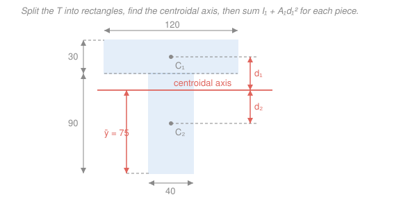

# Statics · Lesson 4.3: Second moment of area & the parallel-axis theorem

> ⏱ ~15 min · Module 4: Internal forces & moments of inertia · Builds on: [3.2 Centroids of areas](03-02-centroids-of-areas.md), [4.2 Shear & bending-moment diagrams](04-02-shear-bending-moment-diagrams.md) · Unlocks: bending stress $\sigma = My/I$ in [`mechanics-of-materials`](../../mechanics-of-materials/syllabus.md)

## Why this matters

You now know how to find the bending moment $M$ at the worst section of a beam ([4.2](04-02-shear-bending-moment-diagrams.md)). But whether that moment *breaks* the beam depends on the **shape** of its cross-section, not just its area. Lay a wooden ruler flat and it flops; stand it on edge — same wood, same area — and it's stiff. That difference is captured by a single geometric number, the **second moment of area** $I$. It's why joists stand tall, why I-beams put their material top and bottom, and it's the last piece you need before computing actual bending stress. This is the final lesson of the course — the bridge into `mechanics-of-materials`.

## The idea

Area alone doesn't tell you how well a shape resists bending — *where* the area sits does. When a beam bends, fibers far from the neutral (centroidal) axis stretch or squash the most, so they do the most work fighting the bend. Material parked far from the axis is worth far more than material near it.

"Far" should count extra, and it does: each little patch of area contributes its distance **squared**. Double a patch's distance from the axis and it fights four times as hard. That squaring is the whole story — it rewards tall, spread-out sections and it's exactly why a beam is deepest in the direction it must carry load. An I-beam is nature's optimization: shove the flanges as far from the middle as you can, connect them with a thin web, and you buy huge stiffness for little material.

Two facts make $I$ easy to compute for real sections. First, for simple shapes it's tabulated — a rectangle about its own centroid is $\frac{bh^3}{12}$, a circle is $\frac{\pi r^4}{4}$. Second, the **parallel-axis theorem** lets you take a shape's $I$ about *its own* centroid and shift it to *any* parallel axis by adding $Ad^2$. Together they turn any built-up section into: chop into rectangles, find the whole section's centroid, then add up each piece's own $I$ plus its $Ad^2$ shift.

## The formal version

**Second moment of area.** For a cross-section of area $A$, the second moment about a horizontal axis (call it $x$) through a chosen reference is

$$I_x = \int_A y^2\, dA,$$

where $y$ is the perpendicular distance from that axis to the area element $dA$. *In words: add up every scrap of area weighted by the square of its distance from the axis.* Units are length$^4$ (e.g. $\text{mm}^4$). It is purely geometric — no forces, no material — and always positive. Bigger $I$ means stiffer and stronger in bending.

**Standard results** (each about the shape's own centroidal axis, derived once by the integral):

$$I_{\text{rect}} = \frac{bh^3}{12}, \qquad I_{\text{circle}} = \frac{\pi r^4}{4}.$$

Here $b$ is the width (parallel to the axis), $h$ the height (perpendicular to it), $r$ the radius. *In words: for a rectangle, height matters cubically — depth is king — while width only scales it linearly.*

**Parallel-axis theorem.** If $I_c$ is the second moment about the axis *through the centroid*, then about any parallel axis a distance $d$ away,

$$\boxed{\,I = I_c + A\,d^2\,}$$

*In words: to move the axis off the centroid, add the area times the shift-distance squared.* The centroidal axis always gives the **smallest** $I$; every shift only adds. Note the theorem is one-way — it moves *between* a centroidal axis and a parallel one, so you must start from (or end at) the centroid.

**The composite method.** For a section built from simple pieces $i$:

1. Find the centroid $\bar y$ of the whole section first (the [3.2](03-02-centroids-of-areas.md) recipe: $\bar y = \frac{\sum A_i \bar y_i}{\sum A_i}$).
2. For each piece, get $I_{c,i}$ (from the tables) and its distance $d_i = |\bar y_i - \bar y|$ to the section's centroidal axis.
3. Sum: $\displaystyle I = \sum_i \left(I_{c,i} + A_i d_i^2\right)$.

*In words: every piece contributes its own stiffness plus a penalty for how far its center sits from the section's center.* Holes count as **negative** area (subtract their $I_{c} + Ad^2$).

## Picture

The T is cut into two rectangles. Locate the section centroid (coral axis, $\bar y = 75$ mm from the base), measure each rectangle's centroid distance $d_i$ to it, then sum $I_{c,i} + A_i d_i^2$. This is Example 2, drawn.

## Worked examples

**Example 1 — rectangle about its base (parallel-axis warm-up).** A rectangle of width $b$ and height $h$ has $I_c = \frac{bh^3}{12}$ about its own centroidal axis. What is $I$ about an axis along its **base**?

The centroid sits at mid-height, so the base is a distance $d = h/2$ away. Apply the theorem with $A = bh$:

$$I_{\text{base}} = I_c + A d^2 = \frac{bh^3}{12} + (bh)\left(\frac{h}{2}\right)^2 = \frac{bh^3}{12} + \frac{bh^3}{4} = \frac{bh^3}{12} + \frac{3bh^3}{12} = \frac{bh^3}{3}.$$

So $I_{\text{base}} = \dfrac{bh^3}{3}$ — a standard result, and note it's **four times** the centroidal value. Sanity: the base axis is farther from most of the area than the centroidal axis, so $I$ must be larger, and it is. That factor of 4 is the parallel-axis penalty doing its job.

**Example 2 — a T-section by the composite method.** Find $I$ about the centroidal axis of the T in the figure: a **flange** 120 mm wide × 30 mm thick sitting on a **web** 40 mm wide × 90 mm tall (overall height 120 mm). Measure $y$ from the base.

*Step 1 — piece areas and centroids.*

| Piece | $A_i$ (mm²) | $\bar y_i$ from base (mm) |
|---|---|---|
| Flange ($120\times30$) | $3600$ | $90 + \tfrac{30}{2} = 105$ |
| Web ($40\times90$) | $3600$ | $\tfrac{90}{2} = 45$ |

*Step 2 — section centroid.*

$$\bar y = \frac{\sum A_i \bar y_i}{\sum A_i} = \frac{3600(105) + 3600(45)}{3600 + 3600} = \frac{378000 + 162000}{7200} = \frac{540000}{7200} = 75\ \text{mm}.$$

(The two areas are equal, so the centroid lands exactly midway between $105$ and $45$ — a good check.)

*Step 3 — each piece's $I_c$ and $d_i$.* With $d_i = |\bar y_i - \bar y|$, both come out to $|105 - 75| = |45 - 75| = 30$ mm:

$$I_{\text{flange}} = \frac{120\cdot 30^3}{12} + 3600(30)^2 = 270{,}000 + 3{,}240{,}000 = 3{,}510{,}000\ \text{mm}^4,$$

$$I_{\text{web}} = \frac{40\cdot 90^3}{12} + 3600(30)^2 = 2{,}430{,}000 + 3{,}240{,}000 = 5{,}670{,}000\ \text{mm}^4.$$

*Step 4 — sum.*

$$I = 3{,}510{,}000 + 5{,}670{,}000 = 9{,}180{,}000\ \text{mm}^4 \approx 9.18\times 10^6\ \text{mm}^4.$$

Notice the web (deeper, so bigger $h^3$) carries more $I$ even though its area equals the flange's — depth wins. And most of each piece's $I$ came from the $Ad^2$ shift, not the little $\frac{bh^3}{12}$ term: spreading area away from the axis is what stiffness is made of.

## Watch out

- **You might sum each piece's $\frac{bh^3}{12}$ and stop.** That gives $I$ only if every piece is already centered on the section's axis — almost never true. You *must* add the $A_i d_i^2$ shift for each piece, or you undercount badly (here it's most of the answer).
- **You might apply the theorem from the wrong axis.** $I = I_c + Ad^2$ starts from the **centroidal** axis. You can't hop from one arbitrary axis directly to another by adding $Ad^2$ — route through the centroid (subtract back to it first if needed).
- **You might swap $b$ and $h$.** In $\frac{bh^3}{12}$, $h$ is the dimension *perpendicular to the axis* (the depth the axis "sees"), and it's cubed. For a horizontal bending axis, $h$ is the vertical height. Get this backward on a tall thin web and your $I$ is off by a large factor.

## One-liner

> Distance from the centroidal axis counts squared, so $I = \sum\left(\tfrac{bh^3}{12} + Ad^2\right)$ — find the centroid first, then reward every piece for being far from it.

## Problems

**P1 (🟢)** A solid rectangular beam is 60 mm wide and 100 mm deep. Find $I$ about its horizontal centroidal axis. Then, without recomputing from scratch, find $I$ about an axis along its bottom edge.

**P2 (🟡)** A hollow square tube has outer side 100 mm and a concentric 60 mm × 60 mm square hole. Find $I$ about the horizontal centroidal axis. (Hint: subtract the hole — both squares share the same centroid, so no $Ad^2$ terms are needed.)

**P3 (🔴, bridges to `mechanics-of-materials`)** Take the T-section from Example 2 ($I = 9.18\times10^6\ \text{mm}^4$, centroid 75 mm from the base, overall height 120 mm). If the beam carries a bending moment $M = 12\ \text{kN}\cdot\text{m}$, the bending stress at a fiber a distance $y$ from the centroidal axis is $\sigma = My/I$. Find the stress at the **top** of the flange. (This is the very formula the next course opens with.)

Solutions

**P1.** Width $b = 60$ mm, depth $h = 100$ mm. Centroidal value:

$$I_c = \frac{bh^3}{12} = \frac{60\cdot 100^3}{12} = \frac{60\cdot 10^6}{12} = 5{,}000{,}000\ \text{mm}^4 = 5.0\times10^6\ \text{mm}^4.$$

About the bottom edge, use Example 1's result $I_{\text{base}} = \frac{bh^3}{3} = 4 I_c$ (or apply the theorem with $d = h/2 = 50$: $I_c + (bh)(50)^2 = 5{,}000{,}000 + 6000\cdot 2500 = 5{,}000{,}000 + 15{,}000{,}000$):

$$I_{\text{base}} = 20{,}000{,}000\ \text{mm}^4 = 2.0\times10^7\ \text{mm}^4.$$

*Check.* Four times the centroidal value, as Example 1 predicts. ✓

**P2.** Both squares are centered on the same axis, so $I = I_{\text{outer}} - I_{\text{hole}}$ with $I_{\text{square}} = \frac{bh^3}{12} = \frac{s^4}{12}$:

$$I = \frac{100^4}{12} - \frac{60^4}{12} = \frac{100{,}000{,}000 - 12{,}960{,}000}{12} = \frac{87{,}040{,}000}{12} \approx 7.25\times10^6\ \text{mm}^4.$$

*Check.* The hole removes only $\left(\frac{60}{100}\right)^4 \approx 13\%$ of the outer $I$ despite removing 36% of the area — because the removed material sat near the axis, where it contributed little. That's the I-beam principle in reverse. ✓

**P3.** The top of the flange is at the overall height 120 mm; the centroid is 75 mm from the base, so

$$y = 120 - 75 = 45\ \text{mm} = 0.045\ \text{m}.$$

With $M = 12\ \text{kN}\cdot\text{m} = 12{,}000\ \text{N}\cdot\text{m}$ and $I = 9.18\times10^6\ \text{mm}^4 = 9.18\times10^{-6}\ \text{m}^4$:

$$\sigma = \frac{My}{I} = \frac{12{,}000 \times 0.045}{9.18\times10^{-6}} = \frac{540}{9.18\times10^{-6}} \approx 5.88\times10^{7}\ \text{Pa} \approx 58.8\ \text{MPa (compression, top fiber)}.$$

*Check.* Unit path: $\frac{(\text{N}\cdot\text{m})(\text{m})}{\text{m}^4} = \text{N/m}^2 = \text{Pa}$ ✓. Mild-steel yield is ~250 MPa, so this beam is safe — and this is precisely where `mechanics-of-materials` picks up. ✓

## Flashback

**From Lesson 3.2 (Centroids of areas).** An L-shaped bracket is made of a base plate 120 mm wide × 20 mm tall, with an upright 20 mm wide × 80 mm tall standing on its left end. Taking $y$ upward from the bottom of the base, find the vertical centroid $\bar y$ of the whole L. (Fresh variant — and exactly the "find the centroid first" step $I$ demands.)

Solution

Split into two rectangles. Base: $A_1 = 120\times20 = 2400\ \text{mm}^2$, centroid $\bar y_1 = 10$ mm. Upright: $A_2 = 20\times80 = 1600\ \text{mm}^2$, centroid $\bar y_2 = 20 + \tfrac{80}{2} = 60$ mm.

$$\bar y = \frac{A_1\bar y_1 + A_2\bar y_2}{A_1 + A_2} = \frac{2400(10) + 1600(60)}{2400 + 1600} = \frac{24{,}000 + 96{,}000}{4000} = \frac{120{,}000}{4000} = 30\ \text{mm}.$$

*Check.* $\bar y = 30$ mm lies between the two piece-centroids (10 and 60) and leans toward the heavier base ($A_1 > A_2$), as it must. ✓ From here you could shift each piece by $d_i = |\bar y_i - 30|$ and compute the L's $I$ — the composite method needs this centroid first.

## Connections

- **Backward:** the composite method reuses the centroid recipe from [3.2](03-02-centroids-of-areas.md) verbatim — you *cannot* find $I$ without first finding $\bar y$ — and the "which section fails first" question is answered by the critical moment $M_{\max}$ you located in [4.2](04-02-shear-bending-moment-diagrams.md).
- **Forward:** this closes Statics. `mechanics-of-materials` opens with the flexure formula $\sigma = \dfrac{My}{I}$ (Problem 3): your $M$ from [4.2](04-02-shear-bending-moment-diagrams.md) and your $I$ from this lesson combine to give the actual bending stress that decides whether a beam holds — the reason both quantities exist.
- **Sideways:** the "distance-squared, summed over area" pattern is the *area* twin of the **mass moment of inertia** $\int r^2\,dm$ that sets how hard a body is to spin up in rotational dynamics (the sequel, `engineering-dynamics`). Same parallel-axis theorem, $I = I_c + md^2$ — geometry here, inertia there.
