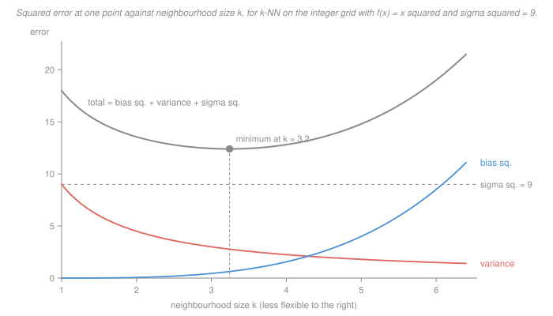

# Statistical Learning Theory · Lesson 1.2: The bias–variance decomposition

> ⏱ ~15 min · Module 1: The learning problem · Builds on: [1.1 (loss, risk, ERM)](01-01-what-is-learning-loss-risk-and-erm.md) · Unlocks: [1.3 (train/validation/test)](01-03-overfitting-and-train-validation-test.md), [1.4 (no free lunch)](01-04-no-free-lunch-and-inductive-bias.md)

## Why this matters

Lesson 1.1 left you with a gap: you can compute empirical risk, and you care about population risk. This lesson opens the gap for squared loss and finds **three terms** inside it — and only two of them are yours to move.

This course owns that result as a theorem. Its sibling [`machine-learning` 1.2](../../machine-learning/lessons/01-02-generalization-and-the-bias-variance-tradeoff.md) states the decomposition and spends its fifteen minutes using it as a diagnostic; it cites the proof to here. So the proof is the job, and it is worth doing carefully, because the two cross terms that vanish do so for **two different reasons**, and knowing which is which is what lets you spot the case where one of them does *not* vanish.

The payoff is that every flexibility knob you will meet — $\lambda$ in ridge ([2.3](02-03-ridge-regression-and-shrinkage.md)), the depth of a tree, the bandwidth in [6.4](06-04-density-estimation.md), and $k$ below — turns the same two dials in opposite directions.

## The idea

Fix one test input $x_0$. Now imagine re-running your entire pipeline many times, each time on a **fresh training set** drawn from the same world. You get a cloud of predictions at $x_0$. Two things can be wrong with the cloud:

- it can be **centred in the wrong place** — that is **bias**, the error your *method* makes on average, the price of insisting the world looks a certain way when it does not;
- it can be **wide** — that is **variance**, how far the answer moves when you swap one training set for another, the price of a method flexible enough to chase whatever noise it was handed.

A third thing is wrong with the world rather than with you: even a perfect prediction of $f(x_0)$ misses the observed $y$, because $y$ carries fresh noise. That is the **irreducible error** $\sigma^2$, and nothing you do touches it.

The part everyone loses: **bias and variance are properties of the procedure, not of the model sitting in front of you.** They are defined by averaging over training sets you never drew. You cannot look at one fit and read off its variance — which is exactly why [1.3](01-03-overfitting-and-train-validation-test.md) has to hold data out.

**The vehicle: $k$-nearest neighbours.** Fix an odd integer $k$. To predict at a point $x_0$, find the $k$ training inputs nearest to $x_0$ and average their labels. That is the entire method — no fitting, no coefficients, and $k$ is the only knob. (See the card's [k-nearest neighbours](../reference.md#k-nearest-neighbours) entry.)

Which makes it the cleanest possible laboratory. Turning $k$ up averages more labels, so the noise cancels harder — variance down. But the extra labels come from points further away, where $f$ is a worse stand-in for $f(x_0)$ — bias up. The decomposition is what turns "harder" and "worse" into two numbers you can add.

## The formal version

**Setup.** Data comes from $y = f(x) + \varepsilon$ where $f$ is the unknown truth, $\mathbb E[\varepsilon] = 0$, $\operatorname{Var}(\varepsilon) = \sigma^2$, and the noises are independent across observations. A training set $S$ is drawn; a procedure turns it into a predictor $\hat f = \hat f_S$. Fix $x_0$ and let

$$y_0 = f(x_0) + \varepsilon_0, \qquad \varepsilon_0 \ \text{independent of}\ S,$$

be a **fresh** observation at $x_0$. All expectations below are over the draw of $S$ *and* over $\varepsilon_0$.

**Theorem ([bias–variance decomposition](../reference.md#bias-variance-decomposition)).**

$$\mathbb E\bigl[(y_0 - \hat f(x_0))^2\bigr] \;=\; \underbrace{\bigl(\mathbb E[\hat f(x_0)] - f(x_0)\bigr)^2}_{\text{bias}^2} \;+\; \underbrace{\operatorname{Var}\bigl(\hat f(x_0)\bigr)}_{\text{variance}} \;+\; \underbrace{\sigma^2}_{\text{irreducible}}.$$

*In words:* your expected squared error at a point is how far your method aims off-centre, plus how much it wobbles, plus the noise you were never going to predict.

*Why the proof works, before the proof.* Both errors you are stacking — "off-centre" and "wobbly" — are measured from the same reference point, the average prediction $\hat\mu := \mathbb E[\hat f(x_0)]$. So you insert that reference point by adding and subtracting it, and the two halves come apart cleanly because each cross term is a product with something whose expectation is zero.

*Proof.* **Step 1 — peel off the fresh noise.** Write

$$y_0 - \hat f(x_0) \;=\; \varepsilon_0 \;+\; \bigl(f(x_0) - \hat f(x_0)\bigr).$$

Square and take expectations:

$$\mathbb E\bigl[(y_0 - \hat f(x_0))^2\bigr] = \mathbb E[\varepsilon_0^2] + 2\,\mathbb E\bigl[\varepsilon_0\,(f(x_0) - \hat f(x_0))\bigr] + \mathbb E\bigl[(f(x_0) - \hat f(x_0))^2\bigr].$$

The first term is $\operatorname{Var}(\varepsilon_0) = \sigma^2$ because $\mathbb E[\varepsilon_0] = 0$ ([`prob-stat-refresher` 2.1](../../prob-stat-refresher/lessons/02-01-expectation-variance-moments.md)). **The cross term vanishes because $\varepsilon_0$ is independent of $S$**, hence of $\hat f(x_0)$, so the expectation factorises into $\mathbb E[\varepsilon_0]$ times something finite, and $\mathbb E[\varepsilon_0]=0$. Remember this reason; it is the one that can fail.

**Step 2 — split what is left at the mean prediction.** With $\hat\mu = \mathbb E[\hat f(x_0)]$,

$$f(x_0) - \hat f(x_0) \;=\; \bigl(f(x_0) - \hat\mu\bigr) \;+\; \bigl(\hat\mu - \hat f(x_0)\bigr).$$

Square and take expectations. The first bracket is a *constant* — it involves no randomness at all — so it contributes $(\hat\mu - f(x_0))^2$, the squared bias. The second contributes $\mathbb E[(\hat f(x_0)-\hat\mu)^2] = \operatorname{Var}(\hat f(x_0))$, by definition. **The cross term vanishes because $\mathbb E[\hat\mu - \hat f(x_0)] = 0$** — not by independence, but by the definition of $\hat\mu$ as the mean.

Adding Steps 1 and 2 gives the theorem. $\blacksquare$

**Two cross terms, two reasons.** The first died from *independence of the fresh noise*; the second from *the definition of the mean*. The second reason can never fail. The first can, and Problem 1(c) is exactly the case where it does.

**Corollary: $k$-NN on a grid.** Take the training inputs to be the integer grid, held fixed, with labels $y_j = f(j) + \varepsilon_j$. For odd $k = 2m+1$ the $k$ nearest grid points to a grid point $x_0$ are $x_0-m,\dots,x_0+m$, so

$$\hat f(x_0) \;=\; \frac1k\sum_{j=-m}^{m} y_{x_0+j}.$$

**Variance.** The $k$ labels are independent, each with variance $\sigma^2$, so the variance of their sum is $k\sigma^2$; dividing by $k$ divides the variance by $k^2$. Hence

$$\operatorname{Var}\bigl(\hat f(x_0)\bigr) = \frac{1}{k^2}\cdot k\sigma^2 = \frac{\sigma^2}{k}.$$

**Bias.** Expectation is linear and every $\mathbb E[\varepsilon_j] = 0$, so the noise disappears entirely and

$$\text{bias} \;=\; \frac1k\sum_{j=-m}^{m} f(x_0+j) \;-\; f(x_0).$$

Note what is *not* there: no $\sigma^2$. Bias is a statement about first moments only, and $\sigma^2$ is a second moment.

**The identity for $f(x) = x^2$.** Expand $(x_0+j)^2 = x_0^2 + 2x_0 j + j^2$ and sum over the symmetric window. The middle sum dies, $\sum_{j=-m}^{m} j = 0$; the last is $\sum_{j=-m}^{m} j^2 = \tfrac{1}{3}m(m+1)(2m+1)$. Dividing by $k = 2m+1$:

$$\frac{1}{2m+1}\sum_{j=-m}^{m}(x_0+j)^2 \;=\; x_0^2 + \frac{m(m+1)}{3},$$

so the bias is

$$\text{bias} \;=\; \frac{m(m+1)}{3} \;=\; \frac{k^2-1}{12},$$

**the same at every $x_0$.** That is not a coincidence: $x^2$ has constant curvature, so a symmetric window overshoots by the same amount wherever you put it.

## Picture

The curves are drawn continuously in $k$ so the shapes are legible; only odd integer $k$ is actually realisable. Two features are worth naming. The grey U never touches the axis — it sits on the dashed [irreducible-error](../reference.md#irreducible-error) floor, which is the whole content of "no model does better than $\sigma^2$." And the minimum is *not* at either end: the leftmost point is unbiased and the rightmost is nearly noiseless, and both are bad.

## Worked examples

**Example 1 (mechanical): the trade-off as a table.** Take $f(x) = x^2$ on the integer grid with $\sigma^2 = 9$. Bias is $(k^2-1)/12$ and variance is $9/k$, so every entry is arithmetic:

| $k$ | bias | bias$^2$ | variance | reducible | total |
|---|---|---|---|---|---|
| 1 | $0$ | $0$ | $9$ | $9$ | $18$ |
| **3** | $2/3$ | $4/9 \approx 0.444$ | $3$ | $\mathbf{31/9 \approx 3.444}$ | $112/9 \approx 12.444$ |
| 5 | $2$ | $4$ | $9/5 = 1.8$ | $29/5 = 5.8$ | $74/5 = 14.8$ |
| 7 | $4$ | $16$ | $9/7 \approx 1.286$ | $121/7 \approx 17.286$ | $184/7 \approx 26.286$ |
| 9 | $20/3$ | $400/9 \approx 44.444$ | $1$ | $409/9 \approx 45.444$ | $490/9 \approx 54.444$ |

The winner is $k = 3$. Read the first row carefully: **$k = 1$ is exactly unbiased and still nearly three times worse** (reducible error 9 against 3.444) than a biased competitor. Read the last: $k = 9$ has cut the variance to a ninth of $k=1$'s and paid forty-four units of squared bias for it. The bias term grows like $k^4$ once squared while variance falls like $1/k$, which is why the U is so lopsided.

**Example 2 (why you'd care): the decomposition hands you a convergence rate.** Same target on the interval from 0 to 10, but now with $n$ equally spaced points, spacing $h = 10/n$, and $\sigma^2 = 1$. The identical argument with the grid rescaled gives bias $h^2(k^2-1)/12$ and variance $1/k$, so the reducible error at a point is

$$\Bigl(\frac{h^2(k^2-1)}{12}\Bigr)^{2} + \frac{\sigma^2}{k}.$$

Minimising over odd $k$ exactly:

| $n$ | $h$ | best $k$ | reducible error |
|---|---|---|---|
| 1,000 | 0.01 | 81 | 0.01533 |
| 10,000 | 0.001 | 515 | 0.002430 |
| 100,000 | 0.0001 | 3,245 | 0.0003852 |

Both right-hand columns move by a factor of $6.31$ per tenfold increase in $n$, and $6.31 = 10^{4/5}$. The balancing calculation says why: for large $k$ the bias is about $h^2k^2/12$, so you are minimising $h^4k^4/144 + \sigma^2/k$; setting the derivative to zero gives $h^4 k^5 = 36\sigma^2$, hence

$$k^* = (36\sigma^2)^{1/5}\,h^{-4/5}, \qquad \text{reducible error} = \frac{5\sigma^2}{4k^*} \;\propto\; n^{-4/5}.$$

Two things to take. First, **you must not hold $k$ fixed as data arrives** — the right response to more data is a *larger* neighbourhood, because the extra points are close enough to cost little bias and there are more of them to average. Second, $n^{-4/5}$ is slower than the $1/n$ a correctly specified parametric model gets ([2.1](02-01-linear-regression-as-learning.md) makes that precise). That gap is the standing price of assuming almost nothing about $f$, and [6.4](06-04-density-estimation.md) shows it becomes catastrophic as the dimension rises.

## Watch out

- **You might think** you can look at your fitted model and say whether it is high-bias or high-variance — **but actually** both quantities are averages over training sets you never drew, so nothing in the single fit in front of you determines either. This is why the honest measurement in [1.3](01-03-overfitting-and-train-validation-test.md) needs held-out data, and why [`machine-learning` 4.1](../../machine-learning/lessons/04-01-model-selection-and-cross-validation.md) has to resample.
- **You might think** $k = 1$'s zero training error is a fact about its accuracy — **but actually** it is a fact about which noise you are measuring against. Step 1's cross term vanished *only* because $\varepsilon_0$ was independent of the training set. At a training point the test noise **is** one of the training noises, the cross term survives with a negative sign, and for $k$-NN the arithmetic comes out exactly $2\sigma^2/k$ too small: $$\mathbb E\bigl[(y_{x_0} - \hat f(x_0))^2\bigr] = \text{bias}^2 + \sigma^2\tfrac{k-1}{k},$$ which at $k=1$ is exactly $0$. Zero training error is a theorem about self-prediction, not evidence of anything.
- **You might think** this is how error decomposes in general — **but actually** it is squared loss and nothing else. The step that made it work was $(a+b)^2 = a^2 + 2ab + b^2$; 0-1 loss has no such additive split, and the loose "bias/variance" talk you will hear about classifiers is an analogy, not this theorem. The honest general-purpose split is 1.1's approximation-plus-estimation error, which costs no assumption about the loss.

## One-liner

> Expected squared error at a point is how far your method aims off-centre, plus how much it wobbles, plus noise nobody can predict — and because the first two move in opposite directions on every flexibility knob, the best model is almost never the unbiased one.

## Problems

**P1 (🟢)** A procedure returns, at a fixed $x_0$, one of the four predictions $8, 11, 12, 13$, each with probability $1/4$ over the draw of the training set. The truth is $f(x_0) = 10$ and the fresh test noise has $\sigma^2 = 4$.

(a) Compute bias$^2$, variance, and the three-term sum.
(b) Compute $\mathbb E[(y_0 - \hat f(x_0))^2]$ directly from the definition and check the two agree.
(c) Of the two cross terms in the proof, which one would survive if the "test" observation at $x_0$ were the *training* label at $x_0$? Name the step and say which direction the surviving term pushes the error.

**P2 (🟡)** $k$-NN on the integer grid, $k = 2m+1$, labels $y_j = f(j)+\varepsilon_j$.

(a) Derive $\operatorname{Var}(\hat f(x_0)) = \sigma^2/k$, saying explicitly where you use "independent" and where you use "variance $\sigma^2$ each."
(b) Explain in one sentence, from the definitions, why $\sigma^2$ does not appear in the bias term at all.
(c) With $f(x) = x^2$ and $k = 5$, give the bias at $x_0 = 0$ and at $x_0 = 100$, and say why they are equal.

**P3 (🔴)** "Choose an unbiased estimator" as a design rule.

(a) Exhibit an estimator of $f(x_0)$ with exactly **zero variance** and bias you can make as large as you like.
(b) Let $Z$ be unbiased for a scalar $\theta$ with $\operatorname{Var}(Z) = v$, and consider the shrunk estimator $cZ$ for $c \in [0,1]$. Compute its MSE, minimise over $c$, and evaluate at $\theta = 3$, $v = 3$. Then find every $c$ that strictly beats the unbiased choice.
(c) Say precisely what (a) and (b) together show about the rule, and name the lesson in this course that cashes it in.

Solutions

**P1**

(a) $\mathbb E[\hat f(x_0)] = (8+11+12+13)/4 = 44/4 = 11$, so the bias is $11 - 10 = 1$ and bias$^2 = 1$. The variance is

$$\tfrac14\bigl[(8-11)^2 + (11-11)^2 + (12-11)^2 + (13-11)^2\bigr] = \tfrac14(9+0+1+4) = \tfrac72.$$

Three-term sum: $1 + \tfrac72 + 4 = \tfrac{17}{2} = 8.5$.

(b) $y_0 = 10 + \varepsilon_0$ with $\varepsilon_0$ independent of the prediction, so

$$\mathbb E[(y_0-\hat f)^2] = \mathbb E[(10-\hat f)^2] + 2\,\mathbb E[\varepsilon_0]\,\mathbb E[10-\hat f] + \mathbb E[\varepsilon_0^2].$$

Now $\mathbb E[(10-\hat f)^2] = \tfrac14(4+1+4+9) = \tfrac92$, the middle term is $0$, and the last is $4$. Total $\tfrac92 + 4 = \tfrac{17}{2}$. Agrees. ✓

(c) The **first** cross term, $\mathbb E[\varepsilon_0(f(x_0) - \hat f(x_0))]$, from **Step 1**. Its vanishing needed $\varepsilon_0 \perp S$; if the test label is a training label, that same noise is inside $\hat f(x_0)$ and the expectation no longer factorises. It survives as $-2\operatorname{Cov}(\varepsilon_0, \hat f(x_0))$, which is **negative** — the predictor has partly chased $\varepsilon_0$, so it looks better than it is. For $k$-NN the covariance is exactly $\sigma^2/k$, giving a training-point MSE of $\text{bias}^2 + \sigma^2(k-1)/k$, which is $2\sigma^2/k$ *below* the test MSE $\text{bias}^2 + \sigma^2(k+1)/k$. At $k=1$ both bias and the whole expression are zero, which is the zero-training-error phenomenon in one line.

**P2**

(a) $\hat f(x_0) = \frac1k\sum_{j=-m}^{m} y_{x_0+j}$. The $f$-values are constants and contribute no variance, so only the $\varepsilon$'s matter. **Independence** is what lets the variance of the sum be the sum of the variances (pairwise uncorrelatedness would in fact suffice — independence is more than you need). **Variance $\sigma^2$ each** is what makes that sum $k\sigma^2$. Finally $\operatorname{Var}(aX) = a^2\operatorname{Var}(X)$ with $a = 1/k$ gives $\operatorname{Var}(\hat f(x_0)) = k\sigma^2/k^2 = \sigma^2/k$.

(b) Bias is $\mathbb E[\hat f(x_0)] - f(x_0)$, a statement about **first** moments; linearity sends each $\mathbb E[\varepsilon_j]$ to $0$, and $\sigma^2$ is a *second* moment that the calculation never reaches.

(c) $k = 5$ means $m = 2$, so the bias is $m(m+1)/3 = 2$ at **both** points. Direct check at $x_0 = 100$:

$$\tfrac15(98^2+99^2+100^2+101^2+102^2) - 100^2 = \tfrac{50010}{5} - 10000 = 10002 - 10000 = 2. \ \checkmark$$

They are equal because expanding $(x_0+j)^2$ leaves $x_0^2 + 2x_0 j + j^2$; the $2x_0 j$ terms cancel over the symmetric window, and the surviving $\frac1k\sum j^2$ contains no $x_0$. Geometrically, $x^2$ has constant second derivative, so the symmetric average overshoots the true value by the same amount everywhere.

**P3**

(a) Take $\hat f \equiv c$ for a fixed constant $c$, ignoring the data entirely. It is the same number for every training set, so $\operatorname{Var} = 0$; the bias is $c - f(x_0)$, unbounded in $c$; the MSE is $(c-f(x_0))^2 + \sigma^2$. This is the rigid extreme of the trade-off, and it shows zero variance buys you nothing on its own.

(b) $\mathbb E[cZ] = c\theta$, so

$$\mathrm{MSE}(c) = \operatorname{Var}(cZ) + (c\theta - \theta)^2 = c^2 v + (1-c)^2\theta^2.$$

Differentiate: $2cv - 2(1-c)\theta^2 = 0 \Rightarrow c(v+\theta^2) = \theta^2$, so

$$c^* = \frac{\theta^2}{\theta^2+v}, \qquad \mathrm{MSE}(c^*) = \frac{v\,\theta^2}{v+\theta^2}.$$

(The second derivative is $2(v+\theta^2) > 0$, so it is a minimum.) At $\theta = 3$, $v = 3$: $c^* = 9/12 = 3/4$ and $\mathrm{MSE}(c^*) = 27/12 = 9/4 = 2.25$, against $\mathrm{MSE}(1) = v = 3$. A 25 percent cut for a deliberate bias of $-3/4$.

Every $c$ that beats the unbiased choice: solve $c^2\cdot 3 + (1-c)^2\cdot 9 < 3$, i.e. $12c^2 - 18c + 6 < 0$, i.e. $2c^2-3c+1 < 0$, i.e. $(2c-1)(c-1) < 0$. So **every $c$ strictly between $1/2$ and $1$** wins. That matters: $c^*$ depends on the unknown $\theta$, but the winning interval is wide, so you do not need to know $\theta$ to profit.

(c) Unbiasedness is neither necessary nor sufficient for low MSE. (a) shows one term of the sum can be driven to zero while the total is arbitrarily bad, so optimising a single term is not a criterion. (b) shows the reverse trade is not merely possible but *always available* when $v > 0$: a bias of the right sign and a modest size strictly lowers the total, and the set of profitable choices is an interval, not a knife-edge. "Unbiased" optimises one of three terms and ignores another it is directly trading against.

[Lesson 2.3](02-03-ridge-regression-and-shrinkage.md) cashes this in exactly: ridge regression *is* this shrinkage, with the optimal penalty at the same ratio of noise to signal that produced $c^*$ here, and the theorem there is that some strictly positive penalty always beats ordinary least squares.

## Connections

- **Backward:** [1.1](01-01-what-is-learning-loss-risk-and-erm.md) split excess risk into approximation plus estimation error. Bias$^2$ is the pointwise, squared-loss face of the first and variance of the second — but the analogy is a guide, not an identity: 1.1's split is over hypothesis classes and is loss-agnostic, while this one is over training draws and is squared-loss-only. Integrating the pointwise identity over $x_0$ turns it back into a statement about risk.
- **Forward:** [1.3](01-03-overfitting-and-train-validation-test.md) asks how you *measure* these when you only ever draw one training set. [1.4](01-04-no-free-lunch-and-inductive-bias.md) shows restricting $\mathcal H$ is a variance-reduction move and that no free lunch is the bill, payable in bias. [2.3](02-03-ridge-regression-and-shrinkage.md) makes the trade deliberately and computes the ledger exactly. [5.2](05-02-bagging-and-random-forests.md) is a variance-only attack and [5.3](05-03-boosting.md) a bias-only one — that is the cleanest way to tell the two ensembles apart. [6.4](06-04-density-estimation.md) reruns Example 2's rate calculation with bandwidth in place of $k$ and finds the curse of dimensionality inside it, and [5.5](05-05-why-does-deep-learning-generalize.md) exhibits models that ought to sit at the far right of the U and do not.
- **Sideways:** [`machine-learning` 1.2](../../machine-learning/lessons/01-02-generalization-and-the-bias-variance-tradeoff.md) states this theorem and cites this proof, then uses it as a working diagnostic across every method in that course — read it for the practice, this for the guarantee. And the mean prediction $\hat\mu$ is a conditional expectation given $x_0$; the reason Step 2's cross term vanishes is precisely the orthogonality that makes conditional expectation an $L^2$ projection, which [`probability-theory` 5.1](../../probability-theory/lessons/05-01-conditional-expectation.md) develops properly.
