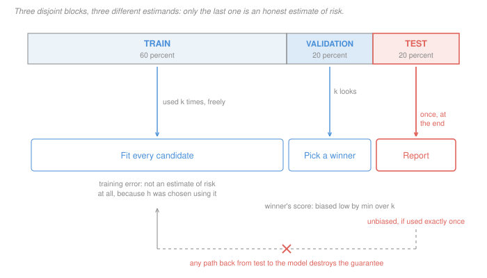

# Statistical Learning Theory · Lesson 1.3: Overfitting, and train/validation/test

> ⏱ ~15 min · Module 1: The learning problem · Builds on: [1.1 (loss, risk, ERM)](01-01-what-is-learning-loss-risk-and-erm.md), [1.2 (bias–variance)](01-02-the-bias-variance-decomposition.md) · Unlocks: [1.4 (no free lunch)](01-04-no-free-lunch-and-inductive-bias.md), [2.1 (the optimism of in-sample error)](02-01-linear-regression-as-learning.md)

## Why this matters

The quantity you actually care about — the [population risk](../reference.md#population-risk) $R(h)$ — is an expectation over a distribution you will never observe. You cannot compute it, ever. Every number anyone has ever reported about a model's out-of-sample performance is a sample average standing in for it.

So the interesting question is not "how do I split my data?" — that is a procedure, and a five-line one. The question is **what does the number on the right-hand side of the split estimate, and under exactly what conditions?** [Lesson 1.1](01-01-what-is-learning-loss-risk-and-erm.md) showed that training error is not an estimate of risk at all once you have used it to choose $h$. This lesson shows that held-out data repairs that — precisely, provably, and only once.

The reason this is a *theory* lesson and not a workflow lesson: the repair rests on a one-line proof, and everything that goes wrong in practice — leakage, tuning on the test set, reusing a benchmark for five years — is a violation of one specific hypothesis of that one-line proof. Knowing which hypothesis fails tells you what you can still honestly claim.

## The idea

Held-out data is a **measuring instrument, and looking at it consumes it.**

Think of a held-out point as a fresh exam question. If you write the question, seal it, pick a candidate on other evidence, and only then open it — the score is an honest, if noisy, reading of that candidate's ability. If instead you open the question, try all twelve candidates on it, and hire the one who did best, the winning score is no longer a reading of ability. It is a reading of *the maximum of twelve noisy readings*, and the maximum of noisy readings is systematically flattering.

That is the whole lesson, and it has two halves:

- **Freshness buys unbiasedness.** Nothing about how $h$ was built matters — not the model class, not the optimiser, not how badly you overfit the training set. All that is required is that the evaluation data was drawn from $\mathcal D$ and played no part in choosing $h$.
- **Selection spends freshness.** The moment you pick the best of $k$ candidates by their held-out scores, the winner's score is biased downward, by an amount you can compute. That is why there is a *third* block of data, and why it is used exactly once.

And one caveat that sits underneath both: unbiased is not the same as precise. An honest estimate built on 100 points is honest and nearly useless.

## The formal version

Partition the data into three disjoint sets, all drawn i.i.d. from $\mathcal D$: a **training** set $T$, a **validation** set $V$ with $|V| = m$, and a **test** set $W$. For any hypothesis $h$, the [held-out estimate](../reference.md#held-out-validation) is the empirical risk on $V$:

$$\hat R_V(h) \;=\; \frac{1}{m}\sum_{(x,y)\in V} \ell\bigl(h(x), y\bigr).$$

**Proposition 1 (unbiasedness).** If $h$ is a function of $T$ alone — or of anything independent of $V$ — then $\mathbb E\bigl[\hat R_V(h)\bigr] = R(h)$.

*In words: a held-out average is an honest estimate of the risk of the one model you fixed before you looked.*

*Proof.* Condition on $T$. Given $T$, the hypothesis $h$ is a **fixed** function, so for each held-out point $(x_i,y_i)$, drawn from $\mathcal D$ independently of $T$,

$$\mathbb E\bigl[\ell(h(x_i),y_i) \mid T\bigr] \;=\; R(h).$$

By linearity of expectation ([prob-stat-refresher 2.1](../../prob-stat-refresher/lessons/02-01-expectation-variance-moments.md)) the average of $m$ such terms also has conditional mean $R(h)$, and the tower property gives the unconditional claim. $\blacksquare$

The load-bearing word is **fixed**. It is the single word that fails for training error, where $h = \hat h$ was chosen by minimising the very average being reported.

**Proposition 2 (precision).** For 0-1 loss, the $m$ held-out losses are i.i.d. Bernoulli with mean $R(h)$, so $m\hat R_V(h) \sim \mathrm{Bin}(m, R(h))$ and the [standard error](../reference.md#validation-standard-error) is

$$\operatorname{se}\bigl(\hat R_V(h)\bigr) \;=\; \sqrt{\frac{R(h)\bigl(1 - R(h)\bigr)}{m}}.$$

*In words: the honest number is honest on average, and wobbles by about this much.* At $R(h) = 0.1$:

| $m$ | 100 | 400 | 900 | 3600 |
|---|---|---|---|---|
| se | 0.030 | 0.015 | **0.010** | **0.005** |

Precision costs quadratically: to halve the standard error you need four times the data, and the 95 percent interval is roughly $\pm 2\,\mathrm{se}$ (by the CLT, [prob-stat-refresher 3.3](../../prob-stat-refresher/lessons/03-03-central-limit-theorem.md)). A held-out set of 100 points cannot tell 10 percent error from 16 percent.

**Proposition 3 (selection destroys unbiasedness).** Fix $k$ hypotheses $h_1,\dots,h_k$ before looking at $V$, and let $\hat h = \arg\min_j \hat R_V(h_j)$. Each individual $\hat R_V(h_j)$ is unbiased, yet

$$\mathbb E\Bigl[\min_{j}\hat R_V(h_j)\Bigr] \;\le\; \min_{j}\mathbb E\bigl[\hat R_V(h_j)\bigr] \;=\; \min_j R(h_j),$$

with strict inequality as soon as the estimates have any spread at all. *In words: the winner's validation score is biased low, and it is biased low even when every candidate is exactly as good as every other.* The inequality is immediate — the minimum of the averages is at most the average of the minima, and $\min$ is concave — and it is **exactly 1.1's ERM failure**, with $V$ in the role $T$ played there. Choosing on validation data is empirical risk minimisation over a class of size $k$.

How large is the damage? Each loss lies in $[0,1]$, so each $\hat R_V(h_j) - R(h_j)$ is sub-Gaussian with parameter $1/(2\sqrt m)$ (Hoeffding), and the maximal inequality for $k$ sub-Gaussians gives

$$\mathbb E\bigl[\text{optimism}\bigr] \;\le\; \sqrt{\frac{\ln k}{2m}}.$$

Two readings. The bias **shrinks like $1/\sqrt m$** — a bigger validation set helps. And it **grows only like $\sqrt{\ln k}$** — you may compare a great many candidates cheaply, which is why validation-based model selection works at all. But it never reaches zero, so the winner's own score can never be the number you report. Hence:

| set | what it is allowed to touch | what its average estimates |
|---|---|---|
| train $T$ | fitting, any number of times | nothing — $h$ was chosen to minimise it |
| validation $V$ | comparing $k$ candidates | the winner's risk, biased low by up to $\sqrt{\ln k/(2m)}$ |
| test $W$ | one evaluation, at the very end | $R(\hat h)$, unbiased — while it stays sealed |

**Ceded.** *How* you build the validation estimate — $k$-fold cross-validation, its variance, the one-standard-error rule — is [`machine-learning` 4.1](../../machine-learning/lessons/04-01-model-selection-and-cross-validation.md); learning curves and diagnosis are [4.3](../../machine-learning/lessons/04-03-diagnosing-models-in-practice.md). This lesson is about the estimand those procedures target.

## Picture

Read it as three different **estimands** rather than three piles of rows. The train block's average is not an estimate of anything, because $\hat h$ was selected to make it small. The validation block's average is an estimate, but of the minimum of $k$ noisy quantities rather than of the winner's risk. Only the test block's average is unbiased for $R(\hat h)$ — and it is unbiased only because of the dashed arrow that is crossed out.

That crossed arrow is the entire discipline. Any information path from the test set back to the model — retuning a threshold, dropping a feature, "just checking whether the preprocessing was right" — makes $\hat h$ a function of $W$, and Proposition 1's hypothesis fails.

## Worked examples

**Example 1 (mechanical): what a held-out number is worth.** You fixed one model on the training set and evaluated it on $m = 400$ held-out points; it misclassified 72 of them.

$$\hat R_V(h) = \frac{72}{400} = 0.18, \qquad \operatorname{se} = \sqrt{\frac{0.18 \times 0.82}{400}} = 0.0192.$$

The 95 percent interval is $0.18 \pm 1.96(0.0192)$, i.e. $[0.142,\ 0.218]$. So the honest statement is "somewhere between 14 and 22 percent" — you cannot distinguish this model from one at 16 percent, or from one at 21 percent.

Want a standard error of 0.01? Solve $R(1-R)/m = 0.01^2$ with $R \approx 0.18$: $m = 1476$. Want 0.005? $m = 5904$. **The last decimal place is the expensive one**, and this is why held-out sets in practice are large or the reported differences are not real.

**Example 2 (why you'd care): selection bias with no learning in the room.** You have $k$ candidate models. Suppose — this is the worst case for your intuition and the best case for seeing the effect — that **all $k$ have exactly the same true risk, $R(h_j) = 0.15$.** There is nothing to learn; every choice is equally good. Validate on $m = 1000$ points, so $\operatorname{se} = 0.0113$, and pick the winner. Computing $\mathbb E[\min_j \hat R_V(h_j)]$ exactly from the binomial order statistics:

| $k$ | 1 | 2 | 5 | 20 | 100 |
|---|---|---|---|---|---|
| winner's mean validation error | 0.1500 | 0.1436 | 0.1370 | 0.1292 | 0.1224 |
| optimism | 0 | 0.0064 | 0.0130 | **0.0208** | 0.0276 |
| in standard errors | 0 | 0.56 | 1.15 | 1.84 | 2.45 |
| bound $\sqrt{\ln k/(2m)}$ | — | 0.019 | 0.028 | 0.039 | 0.048 |

Compare 20 models and the winner reports 12.9 percent error while its true risk is 15.0 percent. That two-point gap is **entirely selection** — no model in the room is better than any other. It is also larger than the $\pm 0.022$ confidence interval you would innocently quote around the winner's score, so the interval does not cover the truth.

Notice the shape as well as the size: going from 4 candidates to 64 — sixteen times as many — barely doubles the optimism. That logarithmic growth is what makes validation usable, and the residual bias is what makes a test set necessary.

## Watch out

- **You might think** that because a held-out estimate is unbiased it is trustworthy — **but actually** unbiasedness says only that it is right *on average over resamples of the validation set*. Yours is one draw. With $m = 100$ the standard error at $R = 0.1$ is 0.030, so "unbiased" coexists happily with "off by 6 points." Bias and variance are separate complaints ([1.2](01-02-the-bias-variance-decomposition.md)), and held-out evaluation only ever fixes the first.
- **You might think** $k$-fold cross-validation solves the selection problem — **but actually** it solves a different one. Averaging over folds reduces the *variance* of each candidate's estimate ([`machine-learning` 4.1](../../machine-learning/lessons/04-01-model-selection-and-cross-validation.md)), which shrinks the spread and therefore shrinks the optimism; but a minimum over $k$ noisy numbers is still a minimum over $k$ noisy numbers, and Proposition 3's inequality is untouched. The structural fix is a set you never selected on — an outer test set, or nested cross-validation.
- **You might think** the split just has to be random — **but actually** it has to be random *at the level of the dependence in the data*. Proposition 1 needs the validation points to be independent draws from $\mathcal D$. Duplicated rows, several scans of the same patient, consecutive days of a time series, or a scaler fitted on all the data before splitting all violate that, and each one silently reintroduces the very correlation between $h$ and $V$ that the proof forbids. Leakage is not sloppiness; it is a failed hypothesis in a theorem.

## One-liner

> A held-out set is an honest instrument for exactly one question asked before you looked, with a standard error of $\sqrt{R(1-R)/m}$ — and every look you take after that is another draw whose minimum you should not report.

## Problems

**P1 (🟢)** You evaluate a single pre-specified classifier on a held-out set of $m = 500$ points and it misclassifies 125 of them.

(a) Give $\hat R_V(h)$, its standard error, and an approximate 95 percent interval.
(b) How many held-out points would you need for a standard error of 0.01? Of 0.005?
(c) In one sentence, say why the answer to (b) grows the way it does.

**P2 (🟡)** You have $k$ candidate models whose true risks happen to be **exactly equal**, $R(h_j) = 0.20$ for every $j$, and a validation set of $m = 250$ points. You pick the model with the lowest validation error.

(a) Without computing anything, argue that the expected validation error of the winner is strictly below 0.20, and say why this is the same phenomenon as 1.1's ERM optimism.
(b) Estimate $\mathbb E[\min_j \hat R_V(h_j)]$ for $k = 2, 4, 16, 64$ by simulation (draw $k$ independent $\mathrm{Bin}(250, 0.2)/250$ values, take the minimum, average over many replicates), and tabulate the optimism in units of the standard error.
(c) State the rule of thumb your table implies about how optimism scales with $k$, and one practical consequence for reading a leaderboard of validation scores.

**P3 (🔴)** A colleague reports a test error of 0.11 on $m = 2000$ test points and adds, cheerfully, that they "only glanced at the test set twice to sanity-check things" before the final run — once to check the preprocessing, once after fixing a bug.

(a) Formalise what those glances cost. Model the situation as $k = 3$ evaluations of hypotheses whose selection may depend on all previous test scores, and write down the uniform bound that still holds, using Hoeffding plus a union bound over the $k$ evaluations at confidence $1-\delta$.
(b) Evaluate the deviation term at $\delta = 0.05$ for $k = 1$ and $k = 3$, and give the honest upper bound on $R(\hat h)$ in each case.
(c) What number can they still honestly report, and what claim have they lost?
(d) How much extra test data would restore the $k = 1$ precision?

Solutions

**P1** (a) $\hat R_V(h) = 125/500 = 0.25$. Standard error:

$$\operatorname{se} = \sqrt{\frac{0.25 \times 0.75}{500}} = \sqrt{0.000375} = 0.01936.$$

The 95 percent interval is $0.25 \pm 1.96(0.01936) = 0.25 \pm 0.0380$, i.e. $[0.212,\ 0.288]$.

(b) Solve $R(1-R)/m = \mathrm{se}^2$ with $R = 0.25$, so $0.1875/m = \mathrm{se}^2$:

$$m = \frac{0.1875}{0.01^2} = 1875, \qquad m = \frac{0.1875}{0.005^2} = 7500.$$

(c) The standard error falls like $1/\sqrt m$, so halving it costs a factor of **four** in data — precision in the last decimal place is bought quadratically. (Note the interval in (a) is nearly 8 points wide: a 500-point held-out set cannot separate a 22 percent model from a 28 percent one.)

**P2** (a) Every $\hat R_V(h_j)$ is unbiased for 0.20, but they are not all equal to 0.20 — each wobbles with standard error $\sqrt{0.2 \times 0.8/250} = 0.0253$. Taking the minimum of $k$ quantities that scatter around a common mean necessarily lands below that mean: $\mathbb E[\min_j Z_j] \le \min_j \mathbb E[Z_j]$, strictly whenever the $Z_j$ are not degenerate. This is exactly [1.1](01-01-what-is-learning-loss-risk-and-erm.md)'s point that $\hat R_S(\hat h)$ is not unbiased for $R(\hat h)$: selecting on a sample and then reporting that sample's score is the same operation here, with $V$ playing the role of the training set and $k$ playing the role of $|\mathcal H|$.

(b) Simulation with $10^5$ replicates reproduces these to about $\pm 0.0005$; the exact values (from $\mathbb E[\min] = \frac1m\sum_{t\ge1}\Pr(X \ge t)^k$ with $X \sim \mathrm{Bin}(250, 0.2)$) are:

| $k$ | 2 | 4 | 16 | 64 |
|---|---|---|---|---|
| $\mathbb E[\min_j \hat R_V]$ | 0.1857 | 0.1742 | 0.1564 | 0.1428 |
| optimism | 0.0143 | 0.0258 | 0.0436 | 0.0572 |
| optimism / se | 0.56 | 1.02 | 1.73 | 2.26 |
| bound $\sqrt{\ln k/(2m)}$ | 0.037 | 0.053 | 0.074 | 0.091 |

(The bound holds in every row and is loose by a factor of roughly 1.6 — it is a worst-case sub-Gaussian bound, not a prediction.)

(c) **Optimism grows logarithmically in $k$, linearly in the standard error.** Concretely: going from 4 candidates to 64 — sixteen times as many — moves the optimism from 0.0258 to 0.0572, only a factor of 2.2. The practical consequence: on a leaderboard of many models with a shared validation set, **the gap between first and second place is not evidence of anything unless it exceeds the standard error.** Here, with 64 identical models, the winner beats the truth by 2.3 standard errors while being no better than the model in last place. Ranking is a decision; a leaderboard score is not an estimate of risk.

**P3** (a) Let $h_1, h_2, h_3$ be the hypotheses evaluated on the test set, in order. Each individual $\hat R_W(h_j)$ satisfies Hoeffding's inequality,

$$\Pr\Bigl(\bigl|\hat R_W(h_j) - R(h_j)\bigr| > \epsilon\Bigr) \;\le\; 2e^{-2m\epsilon^2},$$

and a union bound over the $k$ evaluations makes the statement hold *simultaneously* for all of them, which is what is needed because the later hypotheses were chosen using earlier test scores. Setting the total failure probability to $\delta$ and solving:

$$R(h_j) \;\le\; \hat R_W(h_j) + \sqrt{\frac{\ln(2k/\delta)}{2m}} \quad \text{for all } j, \text{ with probability } 1-\delta.$$

This is [3.2](03-02-finite-classes-and-uniform-convergence.md)'s finite-class argument, applied to a "class" of size $k$ manufactured by the colleague's own glances.

(b) At $\delta = 0.05$, $m = 2000$:

$$k = 1:\ \epsilon = \sqrt{\tfrac{\ln 40}{4000}} = 0.0304, \qquad k = 3:\ \epsilon = \sqrt{\tfrac{\ln 120}{4000}} = 0.0346.$$

So the honest 95 percent upper bounds on $R(\hat h)$ are $0.11 + 0.0304 = 0.1404$ with a sealed test set, and $0.11 + 0.0346 = 0.1446$ with three looks.

(c) They can still honestly report **"test error at most 0.145 with 95 percent confidence"** — the union bound is not a disaster here, because it costs only $\ln 3$ inside a square root, and 0.0042 of extra slack is small next to the 0.030 the finite test set costs anyway. What they have lost is the claim that **0.11 is an unbiased estimate of $R(\hat h)$**. It is not: their final model is a function of the test set, so Proposition 1 does not apply, and the point estimate is optimistic by an unknown amount. Two honest sentences replace one dishonest one.

The caveat worth saying out loud: this analysis is only valid because $k = 3$ is a number they can name. It is the *counting* that saves them. A colleague who says "I looked at it a few times over a couple of months" has an unbounded $k$ and can report nothing at all from that set.

(d) To recover $k=1$ precision at $k=3$ you need $\epsilon$ back at 0.0304, so $m$ must grow by the ratio of the logarithms:

$$m' = 2000 \times \frac{\ln(6/0.05)}{\ln(2/0.05)} = 2000 \times 1.298 \approx 2596,$$

about 600 extra test points, a 30 percent increase. Cheap — if you have the data and are willing to seal it again.

## Flashback

**From Lesson 1.1 (What is learning? Loss, risk, and ERM):** A binary domain $\mathcal X = \{A, B\}$ with $\mathcal Y = \{0,1\}$ and joint distribution

$$\Pr(A,1) = 0.48,\quad \Pr(A,0) = 0.12,\quad \Pr(B,1) = 0.12,\quad \Pr(B,0) = 0.28.$$

Two hypotheses: $h_1$ predicts 1 everywhere; $h_2$ predicts 1 on $A$ and 0 on $B$. Loss is 0-1. Your sample $S$ has $n = 10$ points: 4 of type $(A,1)$, 2 of type $(A,0)$, 1 of type $(B,1)$, 3 of type $(B,0)$.

(a) Compute $R(h_1)$ and $R(h_2)$. (b) Compute $\hat R_S(h_1)$ and $\hat R_S(h_2)$ and name the ERM choice. (c) Three numbers are now on the table — $\hat R_S(h_1)$, $\hat R_S(h_2)$, and $\hat R_S(\hat h)$. Say which are unbiased estimates of what, and which is not.

Solution

(a) $h_1$ errs exactly on the points with $y = 0$: $R(h_1) = 0.12 + 0.28 = \mathbf{0.40}$. $h_2$ errs on $(A,0)$ and $(B,1)$: $R(h_2) = 0.12 + 0.12 = \mathbf{0.24}$.

(b) $h_1$ errs on the 2 points of type $(A,0)$ and the 3 of type $(B,0)$, so $\hat R_S(h_1) = 5/10 = 0.50$. $h_2$ errs on the 2 of type $(A,0)$ and the 1 of type $(B,1)$, so $\hat R_S(h_2) = 3/10 = 0.30$. **ERM picks $h_2$**, which is indeed the risk minimiser — and in fact the Bayes classifier here, since $\eta(A) = 0.48/0.60 = 0.8 > 1/2$ and $\eta(B) = 0.12/0.40 = 0.3 < 1/2$.

(c) **$\hat R_S(h_1)$ is unbiased for $R(h_1) = 0.40$, and $\hat R_S(h_2)$ is unbiased for $R(h_2) = 0.24$** — each hypothesis was fixed before the sample was drawn, so Proposition 1 applies to both.

**$\hat R_S(\hat h) = 0.30$ is unbiased for nothing.** It is the *minimum* of the two, and $\hat h$ is a function of $S$. Averaging exactly over all $n=10$ samples from this distribution:

$$\mathbb E\bigl[\min\bigl(\hat R_S(h_1), \hat R_S(h_2)\bigr)\bigr] = 0.2188 \;<\; 0.24 = \min_j R(h_j),$$

while the true risk of the selected hypothesis averages $\mathbb E[R(\hat h)] = 0.2736 > 0.24$, since ERM sometimes picks $h_1$ by bad luck. The reported number is pushed *down* and the thing it claims to describe is pushed *up* — the gap opens from both ends, which is why the estimate of a selected model must come from data that had no say in the selection.

## Connections

- **Backward:** this is the constructive answer to [1.1](01-01-what-is-learning-loss-risk-and-erm.md)'s central complaint that $\hat R_S(\hat h)$ is biased for $R(\hat h)$ — hold out data, and the bias is gone for exactly one query. Proposition 2's standard error is the *variance* half of [1.2](01-02-the-bias-variance-decomposition.md)'s decomposition applied to the estimate rather than to the predictor.
- **Forward:** Proposition 3 is Module 3 in miniature — the winner's optimism over $k$ candidates is a finite-class uniform-convergence problem, made rigorous in [3.2](03-02-finite-classes-and-uniform-convergence.md) with Hoeffding plus a union bound, and generalised to infinite $\mathcal H$ in [3.4](03-04-vc-bounds-and-sample-complexity.md) and [3.5](03-05-rademacher-complexity.md). [Lesson 2.1](02-01-linear-regression-as-learning.md) computes the training-error optimism *exactly* for least squares, where it is $2p\sigma^2/n$, and [1.4](01-04-no-free-lunch-and-inductive-bias.md) explains why no procedure escapes the need for held-out evidence.
- **Sideways:** the mechanics of building the validation estimate — $k$-fold, nested CV, the one-standard-error rule — are [`machine-learning` 4.1](../../machine-learning/lessons/04-01-model-selection-and-cross-validation.md), and the metrics you would compute on the held-out set instead of 0-1 error are [4.2](../../machine-learning/lessons/04-02-classification-metrics.md). The union-bound correction in P3 is the prediction-side twin of the multiple-comparisons problem in [`econometrics`](../../econometrics/syllabus.md) — same inequality, but there it protects a $p$-value about a true parameter rather than an estimate of out-of-sample risk.
