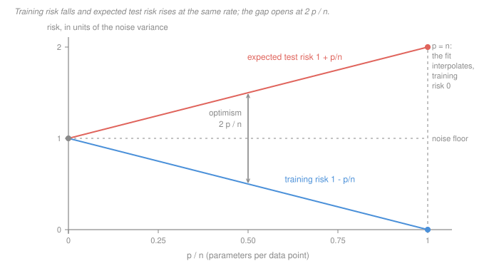

# Statistical Learning Theory · Lesson 2.1: Linear regression as learning

> ⏱ ~15 min · Module 2: Linear methods · Builds on: [1.1 (loss, risk, ERM)](01-01-what-is-learning-loss-risk-and-erm.md), [1.3 (train/validation/test)](01-03-overfitting-and-train-validation-test.md) · Unlocks: 2.3 (ridge and shrinkage)

## Why this matters

Least squares is the one model where you can compute the generalization gap *exactly*. Everywhere else in this course the gap is bounded — Module 3 spends five lessons proving inequalities. Here it is an identity, in closed form, with no constants to hide behind:

$$\mathbb E[\hat R_{\text{out}}] - \mathbb E[\hat R_{\text{in}}] \;=\; \frac{2p\sigma^2}{n}.$$

Read it and you have the whole of overfitting in one expression. Training error is not a noisy estimate of test error that happens to come out low; it is **biased low by a known amount that grows with every parameter you add**. That is why adding features always improves the fit you can see, why it eventually destroys the fit you cannot, and why every model-selection criterion in statistics — Mallows' $C_p$, AIC, adjusted $R^2$ — is this same correction wearing a different hat.

The mechanics of the fit itself are [`machine-learning` 1.3](../../machine-learning/lessons/01-03-linear-regression-and-least-squares.md): the normal equations, the projection picture, $R^2$, the $O(np^2)$ cost. Assume all of it. This lesson is about what the fit costs you in risk.

## The idea

Here is the whole argument in words, and it is worth having before any algebra.

You fit $p$ free parameters by minimizing error **on the sample in front of you**. The sample contains signal and noise. The fit cannot tell them apart, so it spends its freedom on both: each parameter lets the fit chase roughly one unit of noise variance and pull the predictions toward it.

That costs you twice.

- **On the training data**, the noise the fit absorbed is no longer in the residuals — it has been fitted away. So training error comes out **too low by about $p\sigma^2/n$**.
- **On fresh data**, that same absorbed noise is still in the predictions, and it is now *wrong* noise: it was drawn from the training sample, and the new observations have their own, independent. So test error comes out **too high by about $p\sigma^2/n$**.

Same quantity, once subtracted and once added. The two errors move apart at twice the rate either one moves, which is why the gap is $2p\sigma^2/n$ and not $p\sigma^2/n$. Everything below is that sentence made exact.

One consequence to keep: **none of this required your features to be bad.** The model can be perfectly correct, every coefficient real, and the optimism is unchanged. It is the price of *estimating* $p$ numbers from the same data you then score on.

## The formal version

**Least squares is [ERM](../reference.md#empirical-risk-minimization) with squared loss.** Take the hypothesis class of linear predictors and the squared loss from [1.1](01-01-what-is-learning-loss-risk-and-erm.md):

$$\mathcal H = \{\,h_b(x) = b^\top x \;:\; b \in \mathbb R^p\,\}, \qquad \ell(h(x), y) = (y - h(x))^2 .$$

The empirical risk of $h_b$ on a sample $S = \{(x_i, y_i)\}_{i=1}^n$ is

$$\hat R_S(h_b) = \frac1n \sum_{i=1}^n (y_i - b^\top x_i)^2 = \frac1n \lVert y - Xb\rVert^2 ,$$

so the ERM rule $\hat\beta = \arg\min_b \hat R_S(h_b)$ *is* ordinary least squares. **In words:** least squares is not a separate idea from the framework of Module 1 — it is Module 1 with one particular class and one particular loss, and the closed form is a lucky accident of that choice.

**Setup for the theorem.** Fix the design $X \in \mathbb R^{n \times p}$ of rank $p \le n$ ($p$ counts the intercept column). Assume a well-specified model,

$$y = X\beta + \varepsilon, \qquad \mathbb E[\varepsilon] = 0, \qquad \operatorname{Cov}(\varepsilon) = \sigma^2 I_n .$$

Write $H = X(X^\top X)^{-1}X^\top$ for the [hat matrix](../reference.md#hat-matrix), the orthogonal projection onto the column space of $X$. From [`linalg-refresher` 4.2](../../linalg-refresher/lessons/04-02-projection-least-squares.md) we take three facts and prove none of them: $H$ is symmetric, $H^2 = H$, and $HX = X$. The one that carries the whole lesson is

$$\operatorname{tr}(H) = \operatorname{rank}(H) = p .$$

Define the two risks — training error, and the error at the **same design points with fresh noise**, $y' = X\beta + \varepsilon'$ with $\varepsilon'$ independent of $\varepsilon$:

$$\hat R_{\text{in}} = \frac1n\lVert y - X\hat\beta\rVert^2, \qquad \hat R_{\text{out}} = \frac1n\,\mathbb E_{y'}\lVert y' - X\hat\beta\rVert^2 .$$

> **Theorem (the optimism identity).** Under the setup above,
> $$\mathbb E[\hat R_{\text{in}}] = \sigma^2\Bigl(1 - \frac pn\Bigr), \qquad \mathbb E[\hat R_{\text{out}}] = \sigma^2\Bigl(1 + \frac pn\Bigr),$$
> and therefore the [optimism of the training error](../reference.md#optimism-of-the-training-error) is exactly $2p\sigma^2/n$.

**In words:** training error sits below the noise floor by one unit of variance per parameter per observation, expected test error sits above it by the same, and the whole difference is bookkeeping on $\operatorname{tr}(H)$.

**What makes the proof work:** both risks are quadratic forms in the noise, and the expectation of a quadratic form is a trace. One lemma does all the work.

*Lemma.* For any fixed $A \in \mathbb R^{n\times n}$, $\mathbb E[\varepsilon^\top A \varepsilon] = \sigma^2\operatorname{tr}(A)$.
*Proof.* Expand and push the expectation inside:
$$\mathbb E\Bigl[\sum_{i,j} A_{ij}\varepsilon_i\varepsilon_j\Bigr] = \sum_{i,j}A_{ij}\,\mathbb E[\varepsilon_i\varepsilon_j] = \sigma^2\sum_i A_{ii},$$
because $\mathbb E[\varepsilon_i\varepsilon_j]$ is $\sigma^2$ when $i=j$ and $0$ otherwise ([`prob-stat-refresher` 2.1](../../prob-stat-refresher/lessons/02-01-expectation-variance-moments.md)). Only the diagonal survives. $\blacksquare$

*Proof of the theorem.* **Training.** Since $HX = X$, the signal passes through the residual maker untouched:

$$y - X\hat\beta = (I - H)y = (I-H)(X\beta + \varepsilon) = (I-H)\varepsilon .$$

$I - H$ is symmetric and idempotent, so $\lVert(I-H)\varepsilon\rVert^2 = \varepsilon^\top(I-H)\varepsilon$, and the lemma gives

$$\mathbb E\lVert y - X\hat\beta\rVert^2 = \sigma^2\operatorname{tr}(I-H) = \sigma^2(n - p).$$

Divide by $n$.

**Test.** With $\hat y = Hy = X\beta + H\varepsilon$,

$$y' - \hat y = (X\beta + \varepsilon') - (X\beta + H\varepsilon) = \varepsilon' - H\varepsilon .$$

The two noise vectors are independent and mean zero, so the cross term vanishes and

$$\mathbb E\lVert \varepsilon' - H\varepsilon\rVert^2 = n\sigma^2 + \mathbb E[\varepsilon^\top H\varepsilon] = n\sigma^2 + \sigma^2\operatorname{tr}(H) = \sigma^2(n+p).$$

Divide by $n$. Subtracting gives $2p\sigma^2/n$. $\blacksquare$

**The same $p$ twice, with opposite signs.** Notice the proof never used a different fact for the two halves — it used $\operatorname{tr}(H) = p$ both times. Training subtracts it because the fit removed that noise from the residuals; test adds it because the fit carries that noise into the predictions.

**Three corollaries worth naming.**

1. **The optimism is twice the variance of the fit.** $\operatorname{Var}(\hat y_i) = \sigma^2 H_{ii}$, so the average fitted-value variance is $\frac1n\sum_i \operatorname{Var}(\hat y_i) = p\sigma^2/n$. The optimism is exactly $2\times$ that — the variance term of [1.2](01-02-the-bias-variance-decomposition.md)'s decomposition, counted once on each side of the ledger.
2. **Mallows' $C_p$.** Since the bias is known, correct for it: $\hat R_{\text{in}} + 2p\hat\sigma^2/n$ is an unbiased estimate of $\mathbb E[\hat R_{\text{out}}]$. AIC is the same correction for log-likelihood, and adjusted $R^2$ is the same correction for $R^2$. All three are this theorem.
3. **Why $p > n$ breaks everything.** The derivation assumed $\operatorname{rank}(X) = p \le n$. Past that, $X^\top X$ is singular, $\hat\beta$ is not unique, the columns span all of $\mathbb R^n$ so $\hat y = y$ and $\hat R_{\text{in}} = 0$ *exactly* ([`machine-learning` 1.3](../../machine-learning/lessons/01-03-linear-regression-and-least-squares.md) works this out). The formula $\sigma^2(1-p/n)$ would go negative, which is the algebra telling you its hypothesis has failed. Restoring a unique solution is what the penalty in [2.3](02-03-ridge-regression-and-shrinkage.md) and [2.4](02-04-lasso-and-the-geometry-of-sparsity.md) is for; explaining why such fits nonetheless work is [5.5](05-05-why-does-deep-learning-generalize.md).

**Gauss–Markov, in one line and with a caveat.** Among all estimators linear in $y$ and unbiased for $\beta$, OLS has the smallest variance — it is BLUE. The caveat matters more than the theorem: *unbiasedness is a constraint we imposed, not a goal we chose.* Nothing in the risk $\mathbb E\lVert y' - X\hat\beta\rVert^2$ rewards being unbiased. Lesson [2.3](02-03-ridge-regression-and-shrinkage.md) deliberately gives up unbiasedness and gets lower risk for it, which is legal precisely because Gauss–Markov never claimed otherwise. (Unbiasedness *is* the goal when the coefficient is the object of interest rather than the prediction — that is [`econometrics`](../../econometrics/syllabus.md)'s question, not ours.)

## Picture

Both risks are drawn in units of $\sigma^2$, so the noise floor sits at height $1$ — that is the risk of the *true* predictor $X\beta$, which nobody beats. At $p = 0$ there is nothing to estimate and both lines meet the floor. Every parameter you add pushes the blue line down and the red line up by the same $\sigma^2/n$.

The picture makes two things visible that the formula states but does not dramatize. First, **the lines are straight and they never turn around** — there is no bump, no threshold, no regime where an extra parameter is free. Second, at $p = n$ the training line hits zero: a perfect fit, and expected test risk of $2\sigma^2$, twice the noise floor. The dashed vertical line is the wall the derivation dies at.

## Worked examples

**Example 1 (mechanical): reading the identity off the numbers.** All three rows are Monte Carlo checked against the theory over 200,000 draws with a fixed Gaussian design; simulation and theory agree to four decimals.

| $n$ | $p$ | $\sigma^2$ | $\mathbb E[\hat R_{\text{in}}]$ | $\mathbb E[\hat R_{\text{out}}]$ | optimism | ratio |
|---|---|---|---|---|---|---|
| 100 | 10 | 4 | $3.6$ | $4.4$ | $0.8$ | $1.22$ |
| 100 | 40 | 4 | $2.4$ | $5.6$ | $3.2$ | $2.33$ |
| 60 | 50 | 9 | $1.5$ | $16.5$ | $15.0$ | $11.0$ |

Read the last row slowly. With 60 observations and 50 parameters, the training MSE is $1.5$ against a noise variance of $9$ — the fit looks six times better than the data allows, and it is a *correct* model. Its expected test MSE is $16.5$. **A model can be well specified, unbiased, and still be eleven times worse than it looks.** Nothing here is a modelling mistake; it is the arithmetic of $p/n = 5/6$.

**Example 2 (why you'd care): what a feature has to be worth.** The identity turns "should I include this variable?" into a number.

Take an orthogonal design with columns scaled so $\lVert x_j\rVert^2 = n$, and compare model $A$ (omits column $j$, $p$ parameters) with model $B$ (includes it, $p+1$). Omitting a real signal adds its squared size to the risk, so

$$\mathbb E[\hat R^A_{\text{out}}] = \beta_j^2 + \sigma^2\Bigl(1+\frac pn\Bigr), \qquad \mathbb E[\hat R^B_{\text{out}}] = \sigma^2\Bigl(1+\frac{p+1}{n}\Bigr),$$

and the same computation on the training side gives $\mathbb E[\hat R^A_{\text{in}}] = \beta_j^2 + \sigma^2(1-p/n)$. Subtracting:

$$\text{training error falls by } \ \beta_j^2 + \frac{\sigma^2}{n}, \qquad\qquad \text{test error falls by } \ \beta_j^2 - \frac{\sigma^2}{n}.$$

The two differ by $2\sigma^2/n$ — the optimism identity again, now per feature. And the second expression is a decision rule: **include the feature iff $\beta_j^2 > \sigma^2/n$.** The first expression says training error falls *whatever* $\beta_j$ is, including zero.

At $n = 200$ and $\sigma^2 = 1$ the threshold is $\beta_j^2 > 0.005$, so $\lvert\beta_j\rvert > 0.0707$:

| $\beta_j$ | training error falls by | test error falls by | verdict |
|---|---|---|---|
| $0.20$ | $0.045$ | $+0.035$ | include |
| $0.07$ | $0.0099$ | $-0.0001$ | reject, barely |
| $0$ | $0.005$ | $-0.005$ | reject |

(Simulation over 200,000 draws matches every entry to four decimals — the $\beta_j = 0.07$ row really does cost you one ten-thousandth.)

Two things fall out. The middle row is a feature with a **genuinely nonzero coefficient that you should still leave out**, because its signal does not clear its estimation cost — the first hint that "true model" and "best predictor" are different objects. And $C_p$ gets this right by construction: subtracting the $2p\sigma^2/n$ penalty turns the training drop $\beta_j^2 + \sigma^2/n$ into $\beta_j^2 - \sigma^2/n$, which is the test drop exactly.

## Watch out

- **You might think** $\sigma^2(1+p/n)$ is the error you will see on genuinely new inputs — **but actually** it is the error at the *same* design points $X$ with fresh noise. For a new random $x$ under a Gaussian design the exact figure is $\sigma^2\bigl(1 + \frac{p}{n-p-1}\bigr)$, because you now pay for estimating where the new point sits as well. The two agree to first order and diverge badly when $p/n$ is large: at $n=100$, $p=40$ the honest number is $1.678\sigma^2$ against $1.400\sigma^2$ (simulated: $1.682$). The direction and the mechanism are right; the constant is itself optimistic.
- **You might think** optimism is a symptom of bad or irrelevant features — **but actually** the theorem assumed a perfectly well-specified model where every coefficient is real, and the optimism is $2p\sigma^2/n$ regardless. Useless features are not a different phenomenon; they are the special case $\beta_j = 0$, where you pay the estimation cost and buy nothing.
- **You might think** the straight lines continue past $p = n$ — **but actually** the derivation needs $\operatorname{rank}(X) = p$, and beyond the wall $\sigma^2(1-p/n)$ is negative, which is impossible for a mean of squares. Training error is pinned at $0$ and $\hat\beta$ is not even unique. Anything you want to say about that regime needs new machinery, not an extrapolated line.

## One-liner

> Every parameter you fit absorbs about one unit of noise variance, which is subtracted from the error you can see and added to the error you cannot — so training error is short by $p\sigma^2/n$, test error is long by $p\sigma^2/n$, and the gap you are blind to is exactly $2p\sigma^2/n$.

## Problems

**P1 (🟢)** A well-specified linear model with $\sigma^2 = 4$ is fitted on $n = 100$ observations.

(a) Give $\mathbb E[\hat R_{\text{in}}]$, $\mathbb E[\hat R_{\text{out}}]$ and the optimism for $p = 10$, and again for $p = 40$.
(b) In each case give the ratio $\mathbb E[\hat R_{\text{out}}] / \mathbb E[\hat R_{\text{in}}]$ — the factor by which the model is worse than it looks.
(c) Quadrupling $p$ from 10 to 40 changed the training error by how much, and the test error by how much? Say in one sentence which of the two numbers a practitioner watching only the fit would notice.

**P2 (🟡)** Prove $\mathbb E[\hat R_{\text{in}}] = \sigma^2(1 - p/n)$.

State clearly where you use each of the three projection facts from [`linalg-refresher` 4.2](../../linalg-refresher/lessons/04-02-projection-least-squares.md) ($H$ symmetric, idempotent, $HX = X$), and where you use $\operatorname{tr}(H) = p$. Then answer: which step fails if the model is *misspecified*, i.e. $\mathbb E[y] \notin \operatorname{col}(X)$ — and is the resulting training error larger or smaller than $\sigma^2(1-p/n)$?

**P3 (🔴)** A colleague has a model with $n = 200$ observations, $p = 10$ parameters and training $R^2 = 0.30$. They append 50 columns of independent random noise, refit, and report that training $R^2$ rose. They conclude the larger model is better.

(a) Predict the new expected training $R^2$. (Use $\mathbb E[\mathrm{SSE}] = \sigma^2(n-p)$ and treat the response, hence $\mathrm{SST}$, as fixed.)
(b) Give the expected test risk before and after, in units of $\sigma^2$, and the percentage increase.
(c) State the one-line correction that would have stopped them, and say what it does to the reported number.

Solutions

**P1** (a) With $\sigma^2 = 4$, $n = 100$:

| $p$ | $\mathbb E[\hat R_{\text{in}}] = 4(1-p/n)$ | $\mathbb E[\hat R_{\text{out}}] = 4(1+p/n)$ | optimism $2p\sigma^2/n$ |
|---|---|---|---|
| 10 | $4(0.9) = 3.6$ | $4(1.1) = 4.4$ | $2(10)(4)/100 = 0.8$ |
| 40 | $4(0.6) = 2.4$ | $4(1.4) = 5.6$ | $2(40)(4)/100 = 3.2$ |

(b) $4.4/3.6 = 11/9 \approx 1.222$ and $5.6/2.4 = 7/3 \approx 2.333$.

(c) Training error fell by $3.6 - 2.4 = 1.2$; test error rose by $5.6 - 4.4 = 1.2$. Equal and opposite, which is the identity's signature. A practitioner watching only the fit sees a **33 percent improvement** and has no way to see the equally large deterioration — the two numbers are the same size and only one of them is observable. That asymmetry, not the size of the effect, is what makes training error dangerous rather than merely inaccurate.

**P2** Write the residual and use $HX = X$ to kill the signal:

$$y - X\hat\beta = (I-H)y = (I-H)(X\beta + \varepsilon) = (I-H)X\beta + (I-H)\varepsilon = (I-H)\varepsilon,$$

since $(I-H)X = X - HX = X - X = 0$. **This is where $HX = X$ is used**, and it is the step that makes the answer free of $\beta$ entirely.

Next, turn the squared norm into a quadratic form:
$$\lVert(I-H)\varepsilon\rVert^2 = \varepsilon^\top (I-H)^\top(I-H)\varepsilon = \varepsilon^\top(I-H)\varepsilon,$$
using **symmetry** to drop the transpose and **idempotence** ($(I-H)^2 = I - 2H + H^2 = I-H$) to collapse the product.

Now the lemma, since the noise is uncorrelated with variance $\sigma^2$:
$$\mathbb E[\varepsilon^\top A\varepsilon] = \sum_{i,j}A_{ij}\,\mathbb E[\varepsilon_i\varepsilon_j] = \sigma^2\sum_i A_{ii} = \sigma^2\operatorname{tr}(A).$$
With $A = I - H$ and $\operatorname{tr}(H) = p$:

$$\mathbb E\lVert y - X\hat\beta\rVert^2 = \sigma^2\operatorname{tr}(I-H) = \sigma^2(n-p) \;\;\Longrightarrow\;\; \mathbb E[\hat R_{\text{in}}] = \sigma^2\Bigl(1-\frac pn\Bigr). \;\blacksquare$$

**Misspecification.** The step that fails is the first one. If $\mu = \mathbb E[y] \notin \operatorname{col}(X)$ then $(I-H)\mu \ne 0$, and

$$\mathbb E\lVert y - X\hat\beta\rVert^2 = \lVert (I-H)\mu\rVert^2 + \sigma^2(n-p),$$

the cross term vanishing because $\mathbb E[\varepsilon] = 0$. So the training error is **larger** by $\frac1n\lVert(I-H)\mu\rVert^2 \ge 0$ — the squared length of the part of the signal the column space cannot reach, which is exactly the squared bias of [1.2](01-02-the-bias-variance-decomposition.md). Note what does *not* change: the $-p\sigma^2/n$ optimism term is untouched. Bias and optimism are separate additive effects, which is why a badly biased model can still have wildly optimistic training error.

**P3** (a) Adding $q = 50$ columns takes $p = 10$ to $p' = 60$, and $\mathbb E[\mathrm{SSE}]$ falls from $\sigma^2(n-p) = 190\sigma^2$ to $\sigma^2(n-p') = 140\sigma^2$. With $\mathrm{SST}$ fixed:

$$\mathbb E[R^2_{\text{new}}] \;=\; 1 - \frac{n-p-q}{n-p}\,(1 - R^2_{\text{old}}) \;=\; 1 - \frac{140}{190}(0.70) \;=\; \frac{46}{95} \;\approx\; 0.4842 .$$

So $R^2$ climbs from $0.30$ to about $0.48$ — a rise of $q(1-R^2_{\text{old}})/(n-p) = 35/190 \approx 0.184$, obtained from **columns known to contain no information whatsoever**. The colleague's evidence is not weak evidence; it is a quantity that was guaranteed in advance to rise.

(b) Before: $\mathbb E[\hat R_{\text{out}}] = \sigma^2(1 + 10/200) = 1.05\sigma^2$. After: $\sigma^2(1 + 60/200) = 1.30\sigma^2$. The rise is $2q\sigma^2/n = 0.25\sigma^2$, an increase of $0.25/1.05 \approx 23.8$ percent in expected test MSE. **Training $R^2$ rose by 18 points and expected test error rose by 24 percent, from the same act.**

(c) Use adjusted $R^2$ — divide each sum of squares by its degrees of freedom, $1 - \frac{\mathrm{SSE}/(n-p)}{\mathrm{SST}/(n-1)}$ — or equivalently report $C_p = \hat R_{\text{in}} + 2p\hat\sigma^2/n$. Both are the optimism identity applied as a correction, and both are constructed so that a pure-noise column changes the reported number by zero *in expectation*: $\mathbb E[\mathrm{SSE}]/(n-p)$ is $\sigma^2$ for every $p$. Under the correction the reported adjusted $R^2$ stays flat at roughly its old value instead of rising to $0.48$, and the 50 columns stop looking like an improvement. (The honest alternative is a held-out set, [1.3](01-03-overfitting-and-train-validation-test.md) and [`machine-learning` 4.1](../../machine-learning/lessons/04-01-model-selection-and-cross-validation.md), which needs no knowledge of $\sigma^2$ or $p$ at all — and is what you must use once the "model" includes choices $p$ does not count.)

## Flashback

**From Lesson 1.3 (Overfitting, and train/validation/test):** You hold out $m = 400$ points and measure 0-1 loss for a classifier fixed before you looked at them; the observed error rate is $0.20$.

(a) Give the standard error of that estimate, and the $m$ you would need to halve it.
(b) You have $n = 200$ points total and eight candidate models. Say which of training error, validation error and test error you would report, and for what purpose — and name the one number among the three that is *not* an unbiased estimate of anything you care about.

Solution

(a) For 0-1 loss on $m$ independent held-out points, the error count is binomial and the estimate has standard error $\sqrt{R(1-R)/m}$. At $R = 0.20$, $m = 400$:

$$\sqrt{\tfrac{0.2 \times 0.8}{400}} = \sqrt{0.0004} = 0.02 .$$

So the true risk is roughly $0.20 \pm 0.04$ at two standard errors — a range from $0.16$ to $0.24$. Halving the standard error to $0.01$ requires $m = 0.16/0.0001 = 1600$: **four times the data for twice the precision**, the $\sqrt{m}$ tax that makes small validation sets nearly uninformative.

(b) With $n = 200$ split three ways, no split is comfortable, and that is the honest starting point.

- **Training error** — report it only as a *diagnostic*, never as performance. It is biased low, and by 2.1 you now know the size of the bias: $2p\sigma^2/n$ for a linear fit, and unknown but positive in general. Its one legitimate use is the comparison with validation error, whose *gap* tells you whether you are overfitting.
- **Validation error** — this is your **model-selection** instrument, and the only one of the three you may look at eight times. For any single one of the eight candidates it is unbiased for that model's risk. But the *winner's* validation score is not unbiased for the winner's risk: you took a minimum over eight noisy estimates, which is the order-statistic effect of [1.1](01-01-what-is-learning-loss-risk-and-erm.md) in miniature. Use it to rank, not to report.
- **Test error** — the number you **report**, computed once, after the choice among the eight is final. It is unbiased for the chosen model's risk precisely because the choice was made without it.

**The one that is not unbiased for anything you care about: the winner's validation error.** Training error at least has a clean interpretation (it is an unbiased estimate of risk for the model you would have gotten had you not fitted the parameters — i.e. of nothing useful, honestly declared). The winner's validation score is the trap, because it looks like a held-out number and therefore looks trustworthy, while carrying a selection bias that grows with the number of candidates.

## Connections

- **Backward:** this is [1.1](01-01-what-is-learning-loss-risk-and-erm.md)'s central claim — that $\hat R_S(\hat h)$ is biased for $R(\hat h)$ because $\hat h$ was chosen using $S$ — computed exactly for the one class where exact computation is possible. The optimism $2p\sigma^2/n$ is twice the average $\operatorname{Var}(\hat y_i)$, so it is [1.2](01-02-the-bias-variance-decomposition.md)'s variance term appearing on both sides of the ledger; P2's misspecified case adds [1.2](01-02-the-bias-variance-decomposition.md)'s squared bias as a separate, independent term. Every projection fact is [`linalg-refresher` 4.2](../../linalg-refresher/lessons/04-02-projection-least-squares.md) and every fitting mechanic is [`machine-learning` 1.3](../../machine-learning/lessons/01-03-linear-regression-and-least-squares.md).
- **Forward:** [2.3](02-03-ridge-regression-and-shrinkage.md) keeps this accounting and replaces the parameter count $p$ by the *effective* degrees of freedom $\operatorname{tr}(H_\lambda)$, which is the same trace with a penalty in it and is not an integer — and it gives up the unbiasedness Gauss–Markov protects, on purpose. [2.6](02-06-gradient-descent-the-workhorse.md) shows that stopping gradient descent early is a third way to spend fewer effective parameters. Module 3 does what this lesson cannot: for a class with no parameters to count — thresholds, half-planes, trees — [3.3](03-03-shattering-and-the-vc-dimension.md) and [3.4](03-04-vc-bounds-and-sample-complexity.md) build a capacity measure that plays the role $p$ plays here, at the cost of inequalities instead of identities. And the wall at $p = n$ is where [5.5](05-05-why-does-deep-learning-generalize.md) starts.
- **Sideways:** [`econometrics`](../../econometrics/syllabus.md) fits the identical $X$ and $y$ and asks the opposite question. There, unbiasedness of $\hat\beta$ *is* the objective, because the coefficient is the estimand; here it is an incidental property of a predictor, and Example 2's middle row — a real coefficient you should still omit — is the clean case where the two courses give contradictory advice and are both right. The variance-versus-bias trade you make when dropping that feature is the same shape as the shrinkage a Bayesian prior imposes in [2.5](02-05-regularization-as-a-bayesian-prior.md).
