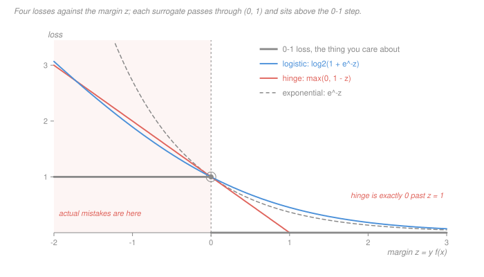

# Statistical Learning Theory · Lesson 2.2: Logistic regression and classification

> ⏱ ~15 min · Module 2: Linear methods · Builds on: [1.1 (loss, risk, ERM)](01-01-what-is-learning-loss-risk-and-erm.md), [2.1 (linear regression as learning)](02-01-linear-regression-as-learning.md) · Unlocks: [2.3 (ridge)](02-03-ridge-regression-and-shrinkage.md), [4.4 (the SVM as regularized risk)](04-04-support-vector-machines.md)

## Why this matters

In classification the loss you actually care about is the number of mistakes. It is a step function — flat everywhere, non-convex, with a derivative of zero wherever it has one at all — and minimizing it over linear classifiers is NP-hard, even to approximate.

So nobody minimizes it. Logistic regression, the SVM, AdaBoost, a neural net trained with cross-entropy: every one of them minimizes a *different* loss, chosen to be convex, and then hopes the answer transfers. That hope has a name and a theorem, and this lesson is about both.

The payoff is a fact that explains most of the folklore about these methods: **two surrogates that both upper-bound the 0-1 loss can compute genuinely different things.** Logistic loss hands you back the conditional probability. Hinge loss hands you back only the verdict. That is why you can threshold a logistic score for asymmetric costs and why you cannot honestly do the same to an SVM score.

## The idea

Fix labels $y \in \{-1, +1\}$ and let a classifier be the sign of a real-valued score $f(x)$. Define the **margin**

$$z \ =\ y\, f(x).$$

It is positive exactly when the sign is right, and its size says how comfortably. So the 0-1 loss is a function of the margin alone: $\ell_{01}(z) = \mathbf 1[z \le 0]$.

Now the trick. Replace that step by a convex function $\varphi(z)$ sitting **above** it. Two things follow immediately:

- **You can optimize it.** $\varphi(y_i w^\top x_i)$ is a convex function composed with a linear map, so the empirical risk is convex in $w$ ([`convex-optimization` 1.3](../../convex-optimization/lessons/01-03-convex-functions-epigraph.md)): no local minima, and gradient descent finds the global one.
- **Progress on it is progress on what you want.** The bound holds at every point, so $\hat R_{01}(w) \le \hat R_\varphi(w)$ at every $w$: driving the surrogate risk down pushes the mistake rate down with it.

That is the entire argument for surrogate losses, and it is only half an argument. Being an upper bound guarantees the surrogate is not *lying* about the mistake rate; it does not guarantee that the $f$ minimizing the surrogate is anywhere near the $f$ minimizing mistakes. To settle that you have to ask a sharper question:

> If I had infinite data and could pick any function at all, what would the surrogate's minimizer be?

That object is the **population minimizer**, and it is the whole content of this lesson. It differs from surrogate to surrogate, and the differences are exactly the practical differences between the methods.

## The formal version

**The logistic model.** Write $\eta(x) = \Pr(y = 1 \mid x)$, the conditional probability the [Bayes-optimal classifier](../reference.md#bayes-optimal-classifier) thresholds at $1/2$. Logistic regression assumes the **log-odds are affine**:

$$\log\frac{\Pr(y = 1 \mid x)}{\Pr(y = -1 \mid x)} \ =\ w^\top x \qquad\Longleftrightarrow\qquad \Pr(y=1\mid x) \ =\ \sigma(w^\top x),$$

with the [sigmoid](../reference.md#the-sigmoid-and-log-odds) $\sigma(u) = 1/(1+e^{-u})$. *In words: the model is linear in the log-odds, not in the probability.*

The negative log-likelihood of one example ([`prob-stat-refresher` 4.1](../../prob-stat-refresher/lessons/04-01-estimation-and-mle.md)) collapses, because $\sigma(-u) = 1 - \sigma(u)$, into a function of the margin alone:

$$-\log \Pr(y \mid x) \ =\ \log\bigl(1 + e^{-y\,w^\top x}\bigr).$$

So **maximum likelihood for the logistic model is exactly ERM with the logistic loss.** The gradient $X^\top(p - y)$, the odds-ratio reading of a fitted coefficient, and a numeric fitting trace are [`machine-learning` 1.5](../../machine-learning/lessons/01-05-logistic-regression-and-classification.md)'s; take them as read.

**Four margin losses.** Normalized so each passes through $(0,1)$ and therefore upper-bounds the step:

| loss | $\varphi(z)$ | used by |
|---|---|---|
| 0-1 | $\mathbf 1[z \le 0]$ | nobody (NP-hard) |
| [logistic](../reference.md#logistic-loss) | $\log_2(1 + e^{-z})$ | logistic regression, cross-entropy nets |
| [hinge](../reference.md#hinge-loss) | $\max(0,\, 1-z)$ | the SVM ([4.4](04-04-support-vector-machines.md)) |
| exponential | $e^{-z}$ | AdaBoost ([5.3](05-03-boosting.md)) |

The base-2 logarithm is not decoration. At $z = 0$ the natural-log version equals $\ln 2 \approx 0.693 < 1$, so it fails to upper-bound the step; dividing by $\ln 2$ fixes it and changes no minimizer.

**Population minimizers.** For a margin loss, $R_\varphi(f) = \mathbb E\bigl[\varphi(y f(x))\bigr]$. Condition on $x$, write $\eta = \eta(x)$, and the whole problem becomes one-dimensional: choose the real number $f$ minimizing

$$C_\varphi(\eta, f) \ =\ \eta\,\varphi(f) \ +\ (1-\eta)\,\varphi(-f).$$

Differentiate (or, for the hinge, read off the slopes of a piecewise-linear function) and you get:

| $\varphi$ | minimizer $f^*(x)$ | minimum of $C_\varphi$ |
|---|---|---|
| 0-1 | $\operatorname{sign}(2\eta - 1)$ | $\min(\eta, 1-\eta)$ — the Bayes risk |
| logistic | $\log\dfrac{\eta}{1-\eta}$ | $H_2(\eta)$ bits |
| exponential | $\tfrac12\log\dfrac{\eta}{1-\eta}$ | $2\sqrt{\eta(1-\eta)}$ |
| hinge | $\operatorname{sign}(2\eta - 1)$ | $2\min(\eta, 1-\eta)$ |

*In words: logistic and exponential loss recover the full conditional probability; hinge recovers only which side of a half it is on.* Read the logistic row twice — $f^* = \log\frac{\eta}{1-\eta}$ means $\eta = \sigma(f^*)$, so **the sigmoid of a logistic score is an estimate of $\eta(x)$ and not merely a number between 0 and 1**. That is what "calibrated" means, and it is a property of the loss, not of the software.

The logistic row also has a pretty reading: with the base-2 normalization the smallest achievable conditional risk is the binary entropy $H_2(\eta)$, so the smallest achievable logistic risk is the conditional entropy $H(y \mid x)$ in bits — the residual uncertainty in the label ([`information-theory` 1.1](../../information-theory/lessons/01-01-entropy-uncertainty-surprise.md)). Logistic regression is not "fitting a curve"; it is spending bits.

**Theorem (classification-calibration).** A convex margin loss $\varphi$ is *classification-calibrated* if and only if it is differentiable at $0$ with $\varphi'(0) < 0$. For such a $\varphi$, $\operatorname{sign} f^*_\varphi(x) = \operatorname{sign}(2\eta(x)-1)$ wherever $\eta(x) \neq \tfrac12$, and any sequence of functions driving the $\varphi$-risk to its infimum over all measurable functions also drives the 0-1 risk to the Bayes risk. *In words: minimize a calibrated surrogate well enough, over a rich enough class, and you get the Bayes classifier — the substitution is licensed.* All three surrogates above qualify — for logistic, hinge and exponential in turn, $\varphi'(0)$ is $-1/(2\ln 2)$, $-1$ and $-1$. The 0-1 loss itself is not convex and is not covered.

**Separable data has no MLE.** Suppose some $w_0$ satisfies $y_i\, w_0^\top x_i > 0$ for every training point. Then along the ray $w = t\,w_0$, every margin grows without bound, every logistic loss term decreases strictly toward $0$, and so the empirical risk decreases strictly toward $0$ as $t \to \infty$. The infimum is $0$ and is **not attained**: the objective is convex and bounded below but not coercive, so there is no minimizer and $\lVert\hat w\rVert \to \infty$. ([`machine-learning` 1.5](../../machine-learning/lessons/01-05-logistic-regression-and-classification.md) watches this happen numerically.) Add any penalty $\tfrac\lambda2\lVert w\rVert^2$ and the objective becomes coercive and strictly convex, so a unique minimizer exists — which is [2.3](02-03-ridge-regression-and-shrinkage.md)'s penalty doing a job nobody advertises. As $\lambda \to 0^+$ the direction of that solution converges to the maximum-margin direction of [4.3](04-03-maximum-margin-classifiers.md).

## Picture

Three things to read off. The surrogates all touch the step at $z = 0$, which is what makes the upper bound tight where it matters. To the left, in the shaded mistake region, they grow — linearly for hinge and logistic, exponentially for $e^{-z}$, which is why AdaBoost is the one that a mislabelled point can wreck. To the right, hinge hits exactly zero at $z = 1$ and stays there, while logistic never does: a comfortably classified point exerts **no** force on an SVM and a small but nonzero one on logistic regression.

Note also that no surrogate dominates another. At $z = 0.5$ the hinge loss is $0.5$ and the exponential is $0.607$; at $z = 2$ the hinge is $0$ and the logistic is $0.183$. "Upper-bounds the 0-1 loss" is a much weaker relation than a ranking.

## Worked examples

**Example 1 — what each loss knows.** Take a single $x$ where the truth is $\eta(x) = 0.9$. The four rows of the table give:

| $\varphi$ | $f^*$ | $\min C_\varphi$ |
|---|---|---|
| 0-1 | $+1$ | $0.100$ |
| logistic | $\log 9 = 2.197$ | $H_2(0.9) = 0.469$ bits |
| exponential | $\tfrac12\log 9 = 1.099$ | $2\sqrt{0.09} = 0.600$ |
| hinge | $+1$ | $0.200$ |

Every surrogate minimum sits above the Bayes risk $0.100$, as it must. But the *scores* differ in kind, not just in size. Push the logistic score back through the sigmoid: $\sigma(2.197) = 0.9$, exactly $\eta$. Push the exponential score through: $\sigma(2 \times 1.099) = 0.9$, also exactly $\eta$ — the factor of $\tfrac12$ is the whole reason boosting scores are half log-odds. Push the hinge score through: $\sigma(1) = 0.731$, a number with no relationship to $0.9$ whatsoever. Change $\eta$ to $0.99$ and the hinge minimizer is still $+1$.

**Example 2 — why calibration is worth paying for.** A fraud model, where missing a fraud costs 20 times what a false alarm costs. The decision is not "is $\eta > 1/2$" — it is minimize expected cost. Predicting $+1$ costs $(1-\eta)\cdot 1$; predicting $-1$ costs $\eta \cdot 20$. So flag the transaction when

$$(1-\eta) \ <\ 20\,\eta \qquad\Longleftrightarrow\qquad \eta \ >\ \tfrac{1}{21} \ \approx\ 0.0476,$$

which on the logistic score is the cutoff $\log(1/20) = -2.996$: threshold the raw score at $-2.996$ instead of at $0$ and you are done, with no refitting. The cost ratio entered the decision and never entered the fit.

Now try it with an SVM. Its population minimizer is $\operatorname{sign}(2\eta-1)$ — the quantity you need to threshold is not in the output, at any sample size, because the loss discarded it. What people do instead is fit a sigmoid to the SVM scores on held-out data (Platt scaling), which is a second, separate estimation problem with its own error, not a recovered probability. Metrics that depend on a chosen operating point — precision, recall, ROC — are [`machine-learning` 4.2](../../machine-learning/lessons/04-02-classification-metrics.md)'s subject; this lesson says which models are entitled to move the point.

## Watch out

- **You might think a calibrated surrogate means "surrogate ERM = 0-1 ERM". It does not.** Calibration is a statement about the minimizer over *all measurable* $f$ with *infinite* data. Inside a restricted class $\mathcal H$ the surrogate minimizer can have strictly worse training error than the 0-1 minimizer in the same class — P3 builds a five-point dataset where it does. The theorem licenses the substitution asymptotically over a rich class; it does not license it example by example.
- **You might think any convex upper bound will do.** The perceptron loss $\max(0, -z)$ is convex, sits above the step for $z \neq 0$, and is useless: $f \equiv 0$ minimizes it for every distribution. It fails the theorem's condition — it is not differentiable at $0$ — and that failure is not a technicality, it is the whole difference between a loss that pushes and a loss that shrugs. The hinge's shift to $\max(0, 1-z)$ is exactly what fixes it.
- **You might think a probability is any number in $(0,1)$ that a model emits.** A softmax or a sigmoid output is calibrated only when the loss it was trained under has $\eta$ as its population minimizer. Cross-entropy does; hinge does not; and a deep net trained with cross-entropy still needs the class to be rich enough and the optimization to have converged before the guarantee bites.

## One-liner

> You cannot minimize the loss you care about, so you minimize a convex one sitting above it — and what comes back is whatever that surrogate's population minimizer encodes: logistic returns the probability, hinge returns only the verdict.

## Problems

**P1 (🟢)** Evaluate all four margin losses — 0-1, logistic $\log_2(1+e^{-z})$, hinge, exponential — at the margins $z = -1,\ 0,\ 0.5,\ 2$, and confirm each surrogate upper-bounds the 0-1 loss at all four. Then say what goes wrong at $z=0$ if you use $\ln(1+e^{-z})$ instead.

**P2 (🟡)** Show the logistic loss is convex in $w$ by computing $\varphi''$ for $\varphi(z) = \ln(1+e^{-z})$ and arguing the composition with $z = y\,w^\top x$. Then show that squared loss applied to the *probability*, $L(w) = \bigl(y - \sigma(w^\top x)\bigr)^2$ with $y \in \{0,1\}$, is **not** convex: take the scalar case $x = 1$, $y = 1$, compute $L''(w)$ in terms of $p = \sigma(w)$, and find where it turns negative.

**P3 (🔴)** Fix the score class to $f_t(x) = x - t$ for $t \in \mathbb R$ — one parameter, so the scale is pinned and the decision boundary is $t$ itself. Take the dataset: three points at $x = 0$ labelled $-1$, one point at $x = 1$ labelled $+1$, one point at $x = 3$ labelled $+1$. Find the hinge-loss minimizer exactly and the logistic-loss minimizer numerically, show the two boundaries differ, and say which score you would put through a sigmoid and why. Bonus: what is the *0-1* minimizing $t$, and what does the comparison say about the first Watch-out bullet?

Solutions

**P1** With $\ell_{01}(z) = \mathbf 1[z \le 0]$:

| $z$ | 0-1 | logistic | hinge | exponential |
|---|---|---|---|---|
| $-1$ | $1$ | $1.8946$ | $2$ | $2.71828$ |
| $0$ | $1$ | $1$ | $1$ | $1$ |
| $0.5$ | $0$ | $0.6839$ | $0.5$ | $0.60653$ |
| $2$ | $0$ | $0.1831$ | $0$ | $0.13534$ |

Every surrogate entry is $\ge$ the 0-1 entry in its row, so the bound holds at all four margins. The tight row is $z = 0$, where all three surrogates equal exactly $1$ — that is what the normalization was for.

With the natural log, the $z=0$ entry becomes $\ln 2 = 0.6931 < 1$, so the surrogate drops *below* the 0-1 loss at the decision boundary and is no longer an upper bound. (It is still convex, still calibrated, and still gives the same minimizer — the failure is purely in the bounding claim, which is what you use when you argue that small surrogate risk implies small error rate.)

Two more things worth noticing: at $z=0.5$ the hinge ($0.5$) is *below* the exponential ($0.607$), and at $z=2$ the hinge ($0$) is below the logistic ($0.183$). The surrogates are not ordered among themselves.

**P2** *Logistic.* With $\varphi(z) = \ln(1+e^{-z})$,

$$\varphi'(z) = \frac{-e^{-z}}{1+e^{-z}} = -\sigma(-z) = \sigma(z) - 1, \qquad \varphi''(z) = \sigma(z)\,\sigma(-z) > 0,$$

so $\varphi$ is strictly convex on $\mathbb R$ (numerically $\varphi''(0) = 0.25$ and $\varphi''(\pm 3) = 0.04518$, matching the formula). Now $z = y\,w^\top x$ is an affine function of $w$, and convexity is preserved under composition with an affine map, so $w \mapsto \varphi(y\,w^\top x)$ is convex; a sum of convex functions is convex, hence the empirical logistic risk is convex in $w$. Explicitly, its Hessian is $\sum_i \sigma(z_i)\sigma(-z_i)\,x_i x_i^\top \succeq 0$, using $y_i^2 = 1$.

*Squared loss on the sigmoid.* With $x=1$, $y=1$: $L(w) = (1 - \sigma(w))^2 = \sigma(-w)^2$. Using $\frac{d}{dw}\sigma(-w) = -\sigma(w)\sigma(-w)$ and writing $p = \sigma(w)$,

$$L'(w) = -2\,p\,(1-p)^2, \qquad L''(w) = 2\,p\,(1-p)^2\,(3p - 1).$$

So $L'' < 0$ exactly when $p < 1/3$, i.e. $w < \ln\tfrac12 = -0.6931$. Check numerically: $L''(-2) = -0.11881$, $L''(-1) = -0.05553$, $L''(0) = +0.125$. A direct midpoint test confirms it: $L(-4) = 0.96435$, $L(-1) = 0.53445$, their average is $0.74940$, but $L(-2.5) = 0.85404 > 0.74940$ — the chord lies below the function, so $L$ is not convex.

The moral: the non-convexity comes from squashing *then* squaring. Logistic loss squashes and takes a log, and the log exactly undoes the sigmoid's saturation — which is the same reason the flat far-left tail of $L$ above, where a badly wrong prediction produces almost no gradient, is a training pathology logistic loss does not have.

**P3** Write $t$ for the boundary. Margins: the three negatives at $x=0$ have $z = -(0 - t) = t$; the positive at $x=1$ has $z = 1-t$; the positive at $x=3$ has $z = 3-t$.

*Hinge.* $H(t) = 3\max(0, 1-t) + \max(0, t) + \max(0, t-2)$. This is piecewise linear with slope $-3 + 1 = -2$ on $(0,1)$ and slope $+1$ on $(1,2)$, so it has a unique minimum at the kink:

$$t_{\text{hinge}} = 1, \qquad H(1) = 1.$$

(Check: $H(0.9) = 1.2$, $H(1) = 1.0$, $H(1.1) = 1.1$.)

*Logistic.* The objective and its derivative are

$$L(t) = 3\ln(1+e^{-t}) + \ln(1+e^{-(1-t)}) + \ln(1+e^{-(3-t)}), \qquad L'(t) = -3\,\sigma(-t) + \sigma(t-1) + \sigma(t-3).$$

$L'(1) = -0.1876 < 0$ and $L'(1.5) = +0.2576 > 0$; bisection gives $t_{\text{logistic}} = 1.20304$ with $L = 1.74096$ (against $L(1) = 1.75986$). So the two boundaries differ: $1$ versus $1.203$.

*Which to sigmoid.* The logistic one, and for a reason that is a theorem rather than a preference: its population minimizer is the log-odds, so $\sigma(f(x))$ estimates $\eta(x)$. Here that gives $\sigma(-1.203) = 0.231$ at $x=0$, $\sigma(-0.203) = 0.449$ at $x=1$, $\sigma(1.797) = 0.858$ at $x=3$ — an honest attempt at $\eta$ under a deliberately misspecified model (the slope was pinned at 1, so it cannot reach the empirical frequencies $0, 1, 1$). The hinge number $t=1$ is a boundary and nothing more; $\sigma(x-1)$ would be a number, not an estimate of anything.

*Bonus.* Any $t \in (0,1)$ classifies all five points correctly — 0-1 training error is zero there. Both surrogate minimizers sit at or above $1$, where the positive at $x=1$ is on the boundary or misclassified, so **both make a mistake the 0-1 minimizer avoids.** Neither loss is broken; they are buying margin on the three points at $x=0$ with an error at $x=1$, which is the trade the surrogate encodes and 0-1 loss does not. This is Watch-out bullet one in five points: calibration is a statement about the unrestricted population minimizer, and inside a one-parameter class it buys you nothing about the training error.

## Flashback

**From Lesson 1.4 (No free lunch and inductive bias):** A domain has 8 points. A learner $A$ is shown the labels of 4 of them, is consistent with what it saw, and must output a hypothesis on all 8; risk is 0-1 loss under the uniform distribution on the domain. Averaging over all $2^4$ ways the unseen half could have been labelled, what is $A$'s expected risk? Then: name the inductive bias that a linear-logistic class encodes, and one real problem where it is badly wrong.

Solution

Condition on the 4 seen labels; the $2^4 = 16$ completions of the unseen half are equally likely and $A$'s output is already fixed. For each unseen point, $A$'s guess disagrees with the true label in exactly half of the 16 completions, so its expected error rate on the unseen half is exactly $1/2$ — the same for *every* learner, which is the whole point. Being consistent, $A$ is right on the seen half, so

$$\mathbb E[\text{risk}] \ =\ \tfrac12 \cdot \tfrac48 \ +\ 0 \cdot \tfrac48 \ =\ \tfrac14.$$

That $1/4$ is the no-free-lunch bound, and no amount of cleverness in $A$ moves it, because $A$'s guess never appears in the calculation.

*The inductive bias.* A linear-logistic class assumes the **log-odds of the label are an affine function of the features**. Concretely that means: monotone in every feature (so the evidence for class $+1$ can never reverse direction as a feature grows), no interactions (the effect of one feature does not depend on another's value), and a single connected decision boundary that is a hyperplane.

Badly wrong, in one line each: parity or XOR, where each feature alone is completely uninformative and only the interaction carries signal; and clinical risk as a function of blood pressure or sodium, which is U-shaped — both extremes are dangerous — so no monotone log-odds can fit it. In both cases the fix is to change the class (add an interaction term, add a quadratic feature, go kernel in [4.1](04-01-feature-maps-and-the-kernel-trick.md)), which is to say: change the assumption. NFL says you must have one; it does not say which.

## Connections

- **Backward.** This is [1.1](01-01-what-is-learning-loss-risk-and-erm.md)'s ERM template with the loss chosen for tractability rather than for fidelity, and the gap that opens up is a second one alongside the estimation error of Module 3. [2.1](02-01-linear-regression-as-learning.md) had no such gap: squared loss is both what you optimize and what you care about, which is a luxury classification never gets. [1.4](01-04-no-free-lunch-and-inductive-bias.md) supplies the honest reading of the linear log-odds assumption as an inductive bias.
- **Forward.** [2.3](02-03-ridge-regression-and-shrinkage.md) explains why a penalty makes the separable-data MLE exist; [4.3](04-03-maximum-margin-classifiers.md) shows what direction the penalized solution runs toward as $\lambda \to 0$; [4.4](04-04-support-vector-machines.md) reads the SVM as ERM with the hinge and an $\ell_2$ penalty and proves the hinge's population minimizer is the bare sign; [5.3](05-03-boosting.md) does the same for the exponential loss and its half log-odds. All three are this lesson's table, cashed in.
- **Sideways.** The minimum achievable logistic risk is the conditional entropy $H(y \mid x)$ in bits, so "cross-entropy loss" is not a metaphor — training a classifier is coding the labels, and the irreducible term is [`information-theory` 1.1](../../information-theory/lessons/01-01-entropy-uncertainty-surprise.md)'s uncertainty, exactly parallel to the irreducible $\sigma^2$ in the regression decomposition. And the cost-ratio threshold of Example 2 is the same expected-loss-minimizing decision rule that runs Bayesian decision theory throughout the [`econometrics`](../../econometrics/syllabus.md) and micro literatures: get a probability, weight it by consequences, act.
