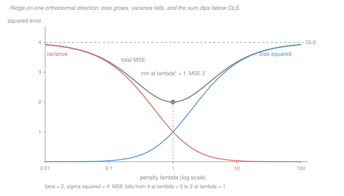

# Statistical Learning Theory · Lesson 2.3: Ridge regression and shrinkage

> ⏱ ~15 min · Module 2: Linear methods · Builds on: [2.1 (linear regression as learning)](02-01-linear-regression-as-learning.md), [1.2 (the bias–variance decomposition)](01-02-the-bias-variance-decomposition.md) · Unlocks: 2.4 (lasso), 2.5 (regularization as a prior)

## Why this matters

[Lesson 2.1](02-01-linear-regression-as-learning.md) left you with a hard accounting rule: every parameter you add costs $2p\sigma^2/n$ in optimism, whether or not it earns anything. That rule treats a parameter as an all-or-nothing object — it is in the model or it is not.

Ridge regression breaks that. A coefficient can be *partly* in the model, and the honest count of how many parameters you are really spending stops being an integer. This lesson makes that count precise — it is the **effective degrees of freedom** $\mathrm{df}(\lambda)$ — and shows it slots into 2.1's formula exactly where $p$ used to sit.

Then the theorem that should unsettle you. OLS is the best *unbiased* linear estimator, and it is nonetheless **never** the best estimator by mean squared error: some positive penalty always beats it, for every true $\beta$ and every $\sigma^2 > 0$. Unbiasedness is not a goal. It is a constraint, and it costs you something you can compute.

## The idea

Ridge adds a quadratic tax on the coefficient vector, and the tax is felt unevenly.

Least squares spends **one full degree of freedom on every direction of the design**, however little the data says about that direction. If one direction of your feature space is barely present in the data — a near-collinear combination of columns — OLS still estimates its coefficient at full confidence, and inherits a huge variance for the privilege.

Ridge charges by how well the data pins a direction down. Directions the data speaks loudly about are fit almost exactly; directions it barely resolves are pulled hard toward zero. Nothing is deleted, everything is discounted, and the discount is steepest where the evidence is thinnest.

That gives the two questions this lesson answers:

1. **How many parameters is a ridge fit actually using?** Somewhere between $p$ and $0$, and generally not a whole number. The answer is a trace, and it has a real operational meaning — it is exactly what governs how optimistic your training error is.
2. **Does the trade ever pay?** Yes. Always. And you can see why in one derivative.

## The formal version

**Setup.** $X$ is $n \times p$ with centred, standardised columns; $y = X\beta + \varepsilon$ with $\mathbb E[\varepsilon] = 0$ and $\operatorname{Var}(\varepsilon) = \sigma^2 I_n$. (Notation warning: $\sigma^2$ without a subscript is always the noise variance; $\sigma_i$ with a subscript is always the $i$-th singular value of $X$. They are unrelated, and the clash is universal in this literature.) The [ridge estimator](../reference.md#ridge-estimator) minimises

$$\lVert y - X\beta\rVert^2 + \lambda\lVert\beta\rVert^2 \quad\Longrightarrow\quad \hat\beta_\lambda = (X^\top X + \lambda I)^{-1}X^\top y.$$

Two facts are **[`machine-learning` 1.4](../../machine-learning/lessons/01-04-regularization-ridge-and-lasso.md)'s**, stated once here and not re-derived: that closed form, and its SVD reading — with $X = UDV^\top$ the fit shrinks the $i$-th singular direction by the factor $\sigma_i^2/(\sigma_i^2+\lambda)$, where $\sigma_i$ is the $i$-th singular value ([`linalg-refresher` 5.2](../../linalg-refresher/lessons/05-02-svd.md)). Go read the shrinkage picture there. Everything below is what that lesson does not do.

### The count: effective degrees of freedom

Ridge is a **linear smoother**: $\hat y = H_\lambda y$ with the [hat matrix](../reference.md#hat-matrix) $H_\lambda = X(X^\top X + \lambda I)^{-1}X^\top$. Define

$$\mathrm{df}(\lambda) \ =\ \operatorname{tr}(H_\lambda) \ =\ \sum_{i=1}^{p}\frac{\sigma_i^2}{\sigma_i^2+\lambda}.$$

*In words:* add up the shrinkage factors. Each lies in $(0,1]$, so the total slides from $p$ at $\lambda = 0$ down to $0$ as $\lambda \to \infty$.

**Proof of the identity.** Substitute the SVD. Since $X^\top X = VD^2V^\top$ and $V$ is orthogonal,

$$H_\lambda = UDV^\top V(D^2+\lambda I)^{-1}V^\top VDU^\top = U\,D(D^2+\lambda I)^{-1}D\,U^\top,$$

and the middle factor is the diagonal matrix with entries $\sigma_i^2/(\sigma_i^2+\lambda)$. Using $\operatorname{tr}(UAU^\top) = \operatorname{tr}(AU^\top U) = \operatorname{tr}(A)$ because $U^\top U = I_p$, the trace is the sum of those entries. $\blacksquare$

At $\lambda = 0$ this is the OLS projection, whose trace is its rank $p$ — so the definition agrees with the ordinary parameter count where the ordinary count exists.

### Why "degrees of freedom" is the right name

Because $\mathrm{df}(\lambda)$ is what appears in 2.1's optimism formula. Here is the general statement, which holds for **any** linear smoother $H$ — ridge or otherwise.

> **Theorem (optimism of a linear smoother).** Let $\hat y = Hy$ with $y = \mu + \varepsilon$, and let $y' = \mu + \varepsilon'$ be a fresh independent draw at the same design points. Then
> $$\mathbb E[\hat R_{\text{out}}] - \mathbb E[\hat R_{\text{in}}] \ =\ \frac{2\sigma^2\operatorname{tr}(H)}{n}.$$

*In words:* your training error understates your test error by exactly two noise variances per effective parameter, per data point.

**Proof.** Expand both risks. Cross terms vanish because $\varepsilon$ has mean zero and $\varepsilon'$ is independent of $\varepsilon$:

$$n\,\mathbb E[\hat R_{\text{in}}] = \lVert (I-H)\mu\rVert^2 + \sigma^2\operatorname{tr}\bigl((I-H)^\top(I-H)\bigr),$$
$$n\,\mathbb E[\hat R_{\text{out}}] = \lVert (I-H)\mu\rVert^2 + n\sigma^2 + \sigma^2\operatorname{tr}(H^\top H).$$

Since $\operatorname{tr}((I-H)^\top(I-H)) = n - 2\operatorname{tr}(H) + \operatorname{tr}(H^\top H)$, subtracting cancels the model-bias term *and* the $\operatorname{tr}(H^\top H)$ term, leaving $2\sigma^2\operatorname{tr}(H)$. $\blacksquare$

Two things to notice. The bias term $\lVert (I-H)\mu\rVert^2$ dropped out, so **the gap is correct even when your model is wrong**. And putting $H = $ the OLS projection recovers 2.1's $2p\sigma^2/n$ exactly. So $\mathrm{df}(\lambda)$ is not an analogy for a parameter count — it is the same quantity in the same formula.

### The ledger, exactly

Take an orthonormal design, $X^\top X = I_p$, so the coordinates decouple and one of them tells the whole story. Write $z = X^\top y$ for the OLS coefficient; $z_j$ has mean $\beta_j$ and variance $\sigma^2$. Ridge gives $\hat\beta_j = z_j/(1+\lambda)$, hence

$$\operatorname{bias}^2 = \Bigl(\frac{\lambda}{1+\lambda}\Bigr)^{2}\beta_j^2, \qquad \operatorname{Var} = \frac{\sigma^2}{(1+\lambda)^2}, \qquad \mathrm{MSE}(\lambda) = \frac{\lambda^2\beta_j^2 + \sigma^2}{(1+\lambda)^2}.$$

Differentiate. Writing $b = \beta_j$, the quotient rule gives

$$\frac{d}{d\lambda}\mathrm{MSE}(\lambda) = \frac{2(\lambda b^2 - \sigma^2)}{(1+\lambda)^3},$$

which is negative for $\lambda < \sigma^2/b^2$ and positive after. So the unique minimiser is

$$\lambda^* = \frac{\sigma^2}{\beta_j^2}, \qquad \mathrm{MSE}(\lambda^*) = \frac{\sigma^2\beta_j^2}{\sigma^2+\beta_j^2} \ <\ \sigma^2 = \mathrm{MSE}(0).$$

*In words:* the best penalty is the **noise-to-signal ratio**. Noisy data or small coefficients mean shrink hard; a loud signal means barely shrink. [Lesson 2.5](02-05-regularization-as-a-bayesian-prior.md) reads this same ratio as prior variance over noise variance, and it is not a coincidence.

### The theorem worth remembering

> **Theorem.** For any true $\beta_j$ and any $\sigma^2 > 0$, there is a $\lambda > 0$ with strictly smaller MSE than OLS.

**Proof.** Evaluate the derivative at zero: $\mathrm{MSE}'(0) = -2\sigma^2 < 0$. A function strictly decreasing at $\lambda = 0$ is strictly smaller just to the right of it. $\blacksquare$

That is a one-line proof of a genuinely strange fact: the minimum-variance unbiased estimator is *inadmissible* under squared error. Note what it does and does not say — it says a good $\lambda$ exists for each $\beta$, not that one fixed $\lambda$ beats OLS for every $\beta$ at once. (In $p \ge 3$ dimensions even that stronger statement is true, which is the James–Stein phenomenon; we do not need it here.)

## Picture

Bias$^2$ starts at zero and climbs to $\beta_j^2$; variance starts at $\sigma^2$ and falls to zero; the sum has to dip, because at $\lambda = 0$ the falling term is falling faster than the rising term is rising. That is the whole theorem, drawn.

## Worked examples

**Example 1 (mechanical): counting the freedom.** A design with singular values $\sigma = (3,\ 2,\ 1,\ 0.5)$, so $\sigma_i^2 = (9,\ 4,\ 1,\ 0.25)$.

| $\lambda$ | shrinkage factors $\sigma_i^2/(\sigma_i^2+\lambda)$ | $\mathrm{df}(\lambda)$ |
|---|---|---|
| $0$ | $1,\ 1,\ 1,\ 1$ | $4$ |
| $1$ | $\tfrac{9}{10},\ \tfrac{4}{5},\ \tfrac12,\ \tfrac15$ | $\tfrac{12}{5} = 2.4$ |
| $10$ | $\tfrac{9}{19},\ \tfrac27,\ \tfrac1{11},\ \tfrac1{41}$ | $\approx 0.875$ |

At $\lambda = 1$ a four-column design is spending 2.4 parameters' worth of freedom. The strong direction keeps 90 percent of its OLS freedom; the weak one keeps a fifth. Nothing was dropped — the rank of $H_\lambda$ is still 4 at every finite $\lambda$ — but the weak direction is nearly switched off.

The payoff is immediate. With $n = 100$ and noise variance $2$, the optimism theorem gives an OLS gap of $2(4)(2)/100 = 0.16$ and a ridge gap at $\lambda = 1$ of $2(2.4)(2)/100 = 0.096$. Same data, same columns, 40 percent less self-deception.

**Example 2 (why you'd care): how much the trade is worth.** One orthonormal direction, two signal strengths, same noise variance $\sigma^2 = 4$.

| $\beta_j$ | $\lambda^* = \sigma^2/\beta_j^2$ | $\mathrm{MSE}(0)$ | $\mathrm{MSE}(\lambda^*)$ | bias$^2$, Var at $\lambda^*$ |
|---|---|---|---|---|
| $2$ | $1$ | $4$ | $2$ | $1,\ 1$ |
| $1$ | $4$ | $4$ | $0.8$ | $0.64,\ 0.16$ |

A factor of two in the first row, a factor of five in the second — from an estimator that is *wrong on average* in both. The weaker the coefficient relative to the noise, the more shrinkage buys, which is exactly why ridge is the standard move when $p$ is large and most coefficients are small.

One trap visible in that table: the first row splits its error 50/50 between bias$^2$ and variance, and the second does not. The even split is an accident of $\beta_j^2 = \sigma^2$, not a property of the optimum. At the optimum bias$^2$ equals $\sigma^4/\beta_j^2$ times the common factor, and variance equals $\sigma^2$ times it — equal only when $\beta_j^2 = \sigma^2$.

## Watch out

- **You might think $\mathrm{df}(\lambda)$ counts surviving parameters, but actually nothing is removed.** $H_\lambda$ has rank $p$ for every finite $\lambda$; all $p$ coefficients are non-zero with probability one. $\mathrm{df}$ is a shrinkage-weighted count of directions, is generally irrational, and is the right notion precisely because it is the thing that appears in the optimism formula. Zeroing coefficients is [2.4](02-04-lasso-and-the-geometry-of-sparsity.md)'s job, and it needs a non-differentiable penalty to do it ([`convex-optimization` 5.1](../../convex-optimization/lessons/05-01-least-squares-lasso.md)).
- **You might think $\lambda^* = \sigma^2/\beta_j^2$ is a recipe, but it is an oracle.** It depends on the very $\beta$ you are trying to estimate. It tells you the *shape* of the answer — shrink in proportion to the noise-to-signal ratio — and nothing about the number. In practice you cross-validate ([`machine-learning` 4.1](../../machine-learning/lessons/04-01-model-selection-and-cross-validation.md)), and the value you land on is an estimate with its own variance.
- **You might think the theorem contradicts Gauss–Markov, but it changes the field of play.** Gauss–Markov says OLS has the smallest variance among **linear unbiased** estimators. Ridge is biased, so it was never in that competition, and MSE is not variance — it is variance plus bias$^2$. The theorem's real content is that the unbiasedness constraint is *binding*: dropping it strictly improves the objective you actually care about.
- **The penalty is not scale-free.** $\lVert\beta\rVert^2$ mixes coefficients measured in different units, so ridge on unstandardised columns penalises whichever feature happens to have small numbers. Standardise first — the argument is in [`machine-learning` 1.4](../../machine-learning/lessons/01-04-regularization-ridge-and-lasso.md).

## One-liner

> Ridge buys variance with bias at a rate the data sets, and the first unit is always free — which is why unbiasedness is a constraint, not a goal.

## Problems

**P1 (🟢)** A design matrix has singular values $\sigma = (5,\ 2,\ 0.5)$.

(a) Compute $\mathrm{df}(\lambda)$ at $\lambda = 0$, $\lambda = 1$ and $\lambda = 25$, giving the first two exactly.
(b) At $\lambda = 1$, which direction has lost the most freedom, and why is that the right direction to punish?
(c) State in one sentence what $\mathrm{df}$ counts and why it need not be an integer.

**P2 (🟡)** One orthonormal direction, true coefficient $\beta$, noise variance $\sigma^2$.

(a) Derive $\lambda^* = \sigma^2/\beta^2$ from $\mathrm{MSE}(\lambda) = (\lambda^2\beta^2+\sigma^2)/(1+\lambda)^2$, and show the minimiser is unique.
(b) Evaluate $\lambda^*$ and the MSE improvement over OLS for $(\beta,\sigma^2) = (3,\ 1)$ and for $(\beta,\sigma^2) = (0.5,\ 1)$.
(c) The two cases differ by a factor of 36 in $\beta^2$. Say what that does to the value of shrinking, in one sentence.

**P3 (🔴)** Prove that for every $\beta_j$ and every $\sigma^2 > 0$ there exists $\lambda > 0$ with $\mathrm{MSE}(\lambda) < \mathrm{MSE}(0)$. Then explain why this does not contradict the Gauss–Markov theorem stated in [2.1](02-01-linear-regression-as-learning.md), being precise about which class of estimators Gauss–Markov quantifies over and which loss each result is optimising.

Solutions

**P1** (a) $\sigma_i^2 = (25,\ 4,\ 0.25)$.

- $\lambda = 0$: every factor is 1, so $\mathrm{df}(0) = 3$.
- $\lambda = 1$: factors $\tfrac{25}{26},\ \tfrac45,\ \tfrac15$. Sum: $\tfrac{25}{26} + \tfrac{4}{5} + \tfrac{1}{5} = \tfrac{25}{26} + 1 = \tfrac{51}{26} \approx 1.962$.
- $\lambda = 25$: factors $\tfrac{25}{50} = \tfrac12$, $\tfrac{4}{29}$, $\tfrac{0.25}{25.25} = \tfrac{1}{101}$. Sum $= 0.5 + 0.1379 + 0.0099 \approx 0.648$ (exactly $\tfrac{3795}{5858}$).

(b) The third, with $\sigma_3^2 = 0.25$: it keeps only $1/5$ of its freedom while the first keeps $25/26$. That is the right direction to punish because it is the direction the data resolves worst — its OLS coefficient has variance proportional to $1/\sigma_3^2 = 4$, sixteen times the leading direction's. Shrinkage is cheapest in bias exactly where it is most valuable in variance.

(c) It counts the shrinkage factors — the fraction of a full parameter's worth of freedom the fit retains in each singular direction — summed over directions; since each factor is a continuous function of $\lambda$ taking values throughout $(0,1)$, the sum is generally not an integer.

**P2** (a) Write $N(\lambda) = \lambda^2\beta^2 + \sigma^2$ and $D(\lambda) = (1+\lambda)^2$. Then

$$N'D - ND' = 2\lambda\beta^2(1+\lambda)^2 - 2(1+\lambda)(\lambda^2\beta^2+\sigma^2) = 2(1+\lambda)\bigl(\lambda\beta^2 - \sigma^2\bigr),$$

after cancelling $\lambda^2\beta^2$ inside the bracket. Dividing by $D^2 = (1+\lambda)^4$,

$$\mathrm{MSE}'(\lambda) = \frac{2(\lambda\beta^2-\sigma^2)}{(1+\lambda)^3}.$$

For $\lambda \ge 0$ the denominator is positive, so the sign is the sign of $\lambda\beta^2 - \sigma^2$: strictly negative for $\lambda < \sigma^2/\beta^2$, strictly positive for $\lambda > \sigma^2/\beta^2$. A single sign change from negative to positive gives a unique global minimum at $\lambda^* = \sigma^2/\beta^2$.

Substituting: $\mathrm{MSE}(\lambda^*) = \sigma^2\beta^2/(\sigma^2+\beta^2)$. (Check: with $\lambda^* = \sigma^2/\beta^2$, $1+\lambda^* = (\beta^2+\sigma^2)/\beta^2$, and the numerator is $\sigma^4/\beta^2 + \sigma^2 = \sigma^2(\sigma^2+\beta^2)/\beta^2$; dividing gives the claim.)

(b) With $\beta = 3$, $\sigma^2 = 1$: $\lambda^* = 1/9$, $\mathrm{MSE}(0) = 1$, $\mathrm{MSE}(\lambda^*) = (1)(9)/(1+9) = 0.9$ — a 10 percent improvement.

With $\beta = 0.5$, $\sigma^2 = 1$: $\lambda^* = 4$, $\mathrm{MSE}(0) = 1$, $\mathrm{MSE}(\lambda^*) = (1)(0.25)/(1.25) = 0.2$ — an 80 percent improvement.

(c) The improvement ratio is $\mathrm{MSE}(\lambda^*)/\mathrm{MSE}(0) = \beta^2/(\sigma^2+\beta^2)$, so shrinking is nearly worthless when the signal dominates the noise and nearly total when it does not — a weak coefficient is mostly noise, and setting noise toward zero costs almost nothing in bias.

**P3** From P2(a), $\mathrm{MSE}'(\lambda) = 2(\lambda\beta_j^2 - \sigma^2)/(1+\lambda)^3$, so $\mathrm{MSE}'(0) = -2\sigma^2 < 0$ whenever $\sigma^2 > 0$. $\mathrm{MSE}$ is differentiable on $[0,\infty)$, so a strictly negative derivative at 0 means there is $\delta > 0$ with $\mathrm{MSE}(\lambda) < \mathrm{MSE}(0)$ for all $\lambda \in (0,\delta)$. (Explicitly, any $\lambda \in (0,\ \sigma^2/\beta_j^2)$ works, since $\mathrm{MSE}'$ is negative on that whole interval.) Note the derivative at zero does not involve $\beta_j$ at all — the first unit of shrinkage always pays, however large the true coefficient.

**No contradiction.** Two separate mismatches:

1. **The class.** Gauss–Markov quantifies over *linear unbiased* estimators. $\mathbb E[\hat\beta_\lambda] = \beta/(1+\lambda) \ne \beta$ for $\lambda > 0$, so ridge is not a member. An optimality result over a class says nothing about estimators outside it.
2. **The loss.** Gauss–Markov minimises **variance**. The theorem above minimises **MSE** $=$ variance $+$ bias$^2$. Within the unbiased class the two objectives coincide, which is why the results look comparable — but outside it they come apart, and MSE is the one that matches what a prediction problem actually costs you.

The honest summary: Gauss–Markov is a statement about the best estimator subject to a constraint, and this lesson shows the constraint is binding. Unbiasedness is worth $\sigma^2 - \sigma^2\beta_j^2/(\sigma^2+\beta_j^2) = \sigma^4/(\sigma^2+\beta_j^2)$ in excess MSE. If your goal is inference about a true parameter that price may be worth paying — that is [`econometrics`](../../econometrics/syllabus.md)'s setting, not this course's. If your goal is prediction, it is not.

## Flashback

**From Lesson 2.1 (Linear regression as learning):** A well-specified linear model with $n = 250$, $p = 10$, $\sigma^2 = 9$, fit by OLS.

(a) Give $\mathbb E[\hat R_{\text{in}}]$, $\mathbb E[\hat R_{\text{out}}]$ and the gap between them.
(b) You now refit the same design by ridge and find $\mathrm{df}(\lambda) = 2.4$. Does the $2p\sigma^2/n$ formula still apply, and if not, what replaces $p$? Give the new gap.
(c) Do the two *individual* formulas $\sigma^2(1 \mp p/n)$ survive the switch to ridge?

Solution

(a) With $p/n = 10/250 = 0.04$,

$$\mathbb E[\hat R_{\text{in}}] = \sigma^2\bigl(1 - \tfrac pn\bigr) = 8.64, \qquad \mathbb E[\hat R_{\text{out}}] = \sigma^2\bigl(1 + \tfrac pn\bigr) = 9.36.$$

The gap is $2p\sigma^2/n = 2(10)(9)/250 = 0.72$.

(b) The *structure* survives with $p$ replaced by $\mathrm{df}(\lambda) = \operatorname{tr}(H_\lambda)$ — that is precisely the content of this lesson's optimism theorem, which was proved for an arbitrary linear smoother and reduces to 2.1's version when $H$ is a projection. The gap becomes

$$\frac{2\sigma^2\,\mathrm{df}(\lambda)}{n} = \frac{2(9)(2.4)}{250} = 0.1728,$$

roughly a quarter of the OLS optimism. Less freedom spent, less self-deception in the training error.

(c) **No** — and this is the part worth getting right. The individual formulas relied on the fit being an unbiased projection, so that $\lVert (I - H)\mu\rVert^2 = 0$. Ridge is biased, so both risks pick up the same extra term $\lVert (I-H_\lambda)\mu\rVert^2/n$ and neither equals $\sigma^2(1 \mp \mathrm{df}/n)$. The *difference* is what is robust: the bias term is identical in both and cancels, which is why the optimism theorem needs no assumption that the model is correct.

## Connections

- **Backward:** this is [1.2](01-02-the-bias-variance-decomposition.md)'s [decomposition](../reference.md#bias-variance-decomposition) with a knob attached — $\lambda$ moves you along the bias–variance curve, and $\lambda^*$ is its minimum in closed form. It is also [2.1](02-01-linear-regression-as-learning.md)'s optimism identity with the integer $p$ replaced by the real number [$\mathrm{df}(\lambda)$](../reference.md#effective-degrees-of-freedom).
- **Forward:** [2.4](02-04-lasso-and-the-geometry-of-sparsity.md) swaps the penalty for one that actually zeroes coefficients, and pays for it with a non-differentiable objective. [2.5](02-05-regularization-as-a-bayesian-prior.md) reads $\lambda^* = \sigma^2/\beta^2$ as a prior-to-noise variance ratio, which is the same number arrived at from the opposite direction. [2.6](02-06-gradient-descent-the-workhorse.md) shows that stopping gradient descent early shrinks the same singular directions, so "train longer" and "lower $\lambda$" are one knob wearing two hats. [5.5](05-05-why-does-deep-learning-generalize.md) needs $\mathrm{df}$ badly, because when $p > n$ the parameter count stops meaning anything at all.
- **Sideways:** [`econometrics`](../../econometrics/syllabus.md) uses the same estimator and dislikes it, because there the estimand is a causal parameter and a biased coefficient is a wrong answer rather than a cheap one. Same algebra, opposite verdict — the difference is entirely in what you are trying to learn.
