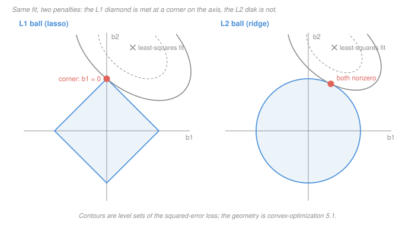

# Statistical Learning Theory · Lesson 2.4: Lasso and the geometry of sparsity

> ⏱ ~15 min · Module 2: Linear methods · Builds on: [2.3 (ridge and shrinkage)](02-03-ridge-regression-and-shrinkage.md), [2.1 (linear regression as learning)](02-01-linear-regression-as-learning.md) · Unlocks: 2.5 (the Laplace prior), 2.6 (why plain gradient descent stalls on this objective)

## Why this matters

Ridge hands you 500 small nonzero numbers. Lasso hands you eight numbers and a **list of names** — and the list is what people act on. It goes in the slide, the paper, the feature store. It is also the part of the output with no guarantee attached.

So this lesson is not about how the zeros appear. That geometry belongs to [`convex-optimization` 5.1](../../convex-optimization/lessons/05-01-least-squares-lasso.md), and the closed form belongs to [`machine-learning` 1.4](../../machine-learning/lessons/01-04-regularization-ridge-and-lasso.md); both are one link away and neither is re-derived here. What is left over is the statistics, and it is three questions:

- **What did you assume** when you asked for a sparse answer, and what happens if the assumption is false?
- **How do you check** that a claimed lasso fit is actually the optimum? (There is a certificate. It takes a minute by hand.)
- **How much should you trust the list of names?** Less than you think, and there is a sharp reason why.

## The idea

Start with the sentence that reframes everything:

> The lasso does not *discover* that most coefficients are zero. It **assumes** it, and hands the assumption back to you wearing your data's clothes.

That is not a criticism — every learner has an inductive bias ([1.4](01-04-no-free-lunch-and-inductive-bias.md)), and "few things matter" is an unusually good one for wide data. But it means the zeros are a **modelling decision you made**, not a finding, and they inherit exactly as much authority as the decision did.

The second idea is the one worth carrying out of the lesson: at the lasso optimum, **every variable is in tension with the penalty, and you can measure the tension**. Correlate each column with the leftover residual. Variables in the model sit exactly at the tension limit $\lambda$ — pushed no further because the penalty pushes back just as hard. Variables left out sit strictly below it: they had something to offer, but not $\lambda$'s worth. That is a complete, checkable description of the optimum, and it costs one matrix–vector product.

The third idea follows from the second. Suppose two columns are nearly identical. Then they correlate with the residual almost equally, so whichever one crosses $\lambda$ *first* wins — and "first" is decided by a gap that noise can flip. One variable enters the model and the other is reported as irrelevant, on the strength of a coin flip.

## The formal version

**The estimator.** With design matrix $X \in \mathbb R^{n\times p}$ (columns $x_1,\dots,x_p$, standardised) and response $y \in \mathbb R^n$:

$$\hat\beta(\lambda) \;=\; \arg\min_{\beta \in \mathbb R^p}\ \tfrac12\lVert y - X\beta\rVert_2^2 \;+\; \lambda\lVert\beta\rVert_1 .$$

The objective is convex but **not differentiable** at any point where a coordinate is zero, so "set the gradient to zero" is unavailable. The replacement is the subgradient condition — the [KKT conditions](../../convex-optimization/lessons/03-03-kkt-conditions.md) for a nonsmooth convex problem — and because the problem is convex it is **sufficient**, not merely necessary.

**The certificate.** Write $r = y - X\hat\beta$ for the residual. Then $\hat\beta$ is optimal **if and only if**, for every $j$,

$$x_j^\top r = \lambda\,\operatorname{sign}(\hat\beta_j) \ \ \text{when } \hat\beta_j \neq 0, \qquad \bigl|x_j^\top r\bigr| \le \lambda \ \ \text{when } \hat\beta_j = 0.$$

*In words:* every variable **in** the model is correlated with what is left over by exactly $\lambda$, with the sign of its coefficient; every variable **out** of the model is correlated by at most $\lambda$. Call these the [lasso KKT conditions](../reference.md#lasso-kkt-conditions). This is a genuine **optimality certificate**: hand it a claimed answer and it says yes or no, and when it says no it tells you which variable is wrong.

**Soft thresholding, in one line.** When $X^\top X = I$, the certificate solves in closed form to [soft thresholding](../reference.md#soft-thresholding) of the OLS coefficients $z_j = x_j^\top y$:

$$\hat\beta_j = \operatorname{sign}(z_j)\bigl(|z_j| - \lambda\bigr)_+ .$$

Derivation, geometry and the ridge comparison: [`machine-learning` 1.4](../../machine-learning/lessons/01-04-regularization-ridge-and-lasso.md).

**What sparsity buys, stated.** The reason to want this is a rate. Under a sparse truth with $s$ nonzero coefficients and a well-behaved design, the lasso's excess risk scales like

$$\frac{s\log p}{n} \qquad\text{rather than}\qquad \frac{p}{n},$$

which is 2.1's optimism term. *In words:* you pay for the coefficients you actually use, plus a logarithm for the privilege of not knowing in advance which ones they are. That $\log p$ is cheap — the same "complexity is paid in bits" phenomenon [3.2](03-02-finite-classes-and-uniform-convergence.md) proves for finite classes. **Stated, not proved here.** And it is conditional on $s \ll p$: if the truth is dense, $s = p$ and you have bought nothing while giving up unbiasedness.

**Why selection is fragile.** Take two unit-norm columns with $\rho = x_1^\top x_2 \in (0,1)$, and $c_j = x_j^\top y$ with $0 < c_1 < c_2$. Ask when the one-variable answer $\hat\beta = (0,\ c_2 - \lambda)$ is optimal. The residual is $r = y - (c_2-\lambda)x_2$, so $x_2^\top r = \lambda$ automatically, and the certificate reduces to the single inequality $x_1^\top r \le \lambda$, i.e.

$$c_1 - \rho\,(c_2 - \lambda) \le \lambda \qquad\Longleftrightarrow\qquad c_1 - \rho c_2 \le \lambda(1-\rho).$$

Read the right-hand side. The room you have to distinguish the two variables is proportional to $1-\rho$. As $\rho \to 1$ that room vanishes, and the selected variable is decided by the sign of $c_2 - c_1$ — a difference that noise controls.

**The irrepresentable condition** is the general form of that inequality. With $S$ the true support, selection consistency requires

$$\bigl\lVert X_{S^c}^\top X_S\,(X_S^\top X_S)^{-1}\operatorname{sign}(\beta_S)\bigr\rVert_\infty < 1 .$$

*In words:* no irrelevant column may be well enough reproduced by the relevant ones to impersonate them. It is a condition on the **design**, not on the sample size — no amount of extra data rescues you if it fails — and it is not checkable in practice, because it refers to the support you are trying to find. Call it the [irrepresentable condition](../reference.md#irrepresentable-condition).

**The elastic net** is the standard repair: penalise with

$$\alpha\lVert\beta\rVert_1 + (1-\alpha)\lVert\beta\rVert_2^2 .$$

The $\ell_2$ term is strictly convex, which makes the objective strictly convex and therefore the solution **unique** and continuous in the data; and it produces the **grouping effect** — correlated columns receive similar coefficients instead of one taking everything. See [elastic net](../reference.md#elastic-net). You trade a sharper story ("these eight") for a truer one ("this group of eight-ish").

## Picture

Same data, same contours, two constraint sets. The diamond's corners lie **on the axes**, so the growing ellipse meets it at a point with a coordinate exactly zero; the disk is smooth, so its contact point is generically off both axes. The full argument — why corners are hit, and what happens in higher dimensions where the diamond has faces of every dimension — is [`convex-optimization` 5.1](../../convex-optimization/lessons/05-01-least-squares-lasso.md).

The statistical translation is what the picture does *not* say: nothing here makes the corner the **right** answer. It makes it the answer *you asked for* by choosing that constraint set.

## Worked examples

**Example 1 (mechanical): verifying a certificate.** Four observations, three unit-norm columns:

$$x_1 = \tfrac12(1,1,1,1),\quad x_2 = \tfrac12(1,1,-1,-1),\quad x_3 = \tfrac12(1,1,1,-1),$$

so $x_1^\top x_2 = 0$ and $x_1^\top x_3 = x_2^\top x_3 = 1/2$ — not orthogonal, so soft thresholding does not apply and you must use the certificate. Take $y = (4,3,4,-1)$ and $\lambda = 1$. Claim: $\hat\beta = (2,\,0,\,4)$.

Fitted values: $X\hat\beta = 2x_1 + 4x_3 = (3,3,3,-1)$, so the residual is $r = (1,0,1,0)$. Now three dot products:

| $j$ | $\hat\beta_j$ | $x_j^\top r$ | required | verdict |
|---|---|---|---|---|
| 1 | $+2$ | $\tfrac12(1+0+1+0) = 1$ | $= \lambda\cdot(+1) = 1$ | ✓ |
| 2 | $0$ | $\tfrac12(1+0-1-0) = 0$ | $\lvert\cdot\rvert \le 1$ | ✓ (strictly inside) |
| 3 | $+4$ | $\tfrac12(1+0+1-0) = 1$ | $= \lambda\cdot(+1) = 1$ | ✓ |

All three hold, the problem is convex, so $(2,0,4)$ **is** the lasso solution — no solver, no iteration, and no need to trust anyone's code. (Confirmed against coordinate descent.) Note $x_2^\top r = 0$ *strictly* below $\lambda$: variable 2 is not marginally excluded, it is comfortably excluded, and small changes to $y$ will not bring it in.

**Example 2 (why you'd care): what happens when sparsity is false.** Orthonormal design, $p = 10$, and a truth that is maximally un-sparse — every coefficient equal, $\beta_j = 0.5$, with noise $\sigma = 0.4$ so that $z_j \sim \mathcal N(0.5,\,0.16)$. Run the lasso at $\lambda = 0.5$.

Each coordinate survives the threshold with probability

$$\Pr\bigl(|z_j| > 0.5\bigr) = 0.50621,$$

so on average **5.06 of the 10 features are "selected."** Not one of them differs from the others in truth. The list of names is a pure readout of the noise draw, and it will be a different list next week.

And the fit is worse, not just less honest. Per-coordinate mean squared error:

| estimator | MSE per coefficient |
|---|---|
| OLS (no penalty) | $0.16000$ |
| lasso, $\lambda = 0.5$ | $0.17142$ |
| lasso, best possible $\lambda \approx 0.19$ | $0.13526$ |
| ridge at $\lambda^{*} = \sigma^2/\beta^2 = 0.64$ | $0.09756$ |

Ridge — which 2.3 showed always beats OLS for some $\lambda > 0$ — cuts the error by 39 percent. The lasso at the tuning that produces a nice short model is *worse than doing nothing*, and even at its own optimal $\lambda$ it gives back most of ridge's gain. **The penalty is not a free hedge; it is a bet on the shape of the truth, and this is what losing looks like.**

## Watch out

- **You might think** $\lambda$ means the same thing everywhere — **but actually** it depends on the leading constant. With $\tfrac12\lVert y-X\beta\rVert^2$ as here, the orthonormal threshold is $\lambda$; [`machine-learning` 1.4](../../machine-learning/lessons/01-04-regularization-ridge-and-lasso.md) writes the loss without the $\tfrac12$ and gets a threshold of $\lambda/2$. Same estimator, same path, relabelled axis. Check the convention before comparing two people's $\lambda$ values, and never compare them across software.
- **You might think** a nonzero lasso coefficient is evidence the variable matters — **but actually** it is not evidence of anything on its own. There is no test here, no p-value, and no standard error; the estimator is biased by construction, and the fragility above means the *identity* of the survivors is unstable under correlation. Reporting "the lasso selected these eight" as a finding, rather than as a decision you made at a chosen $\lambda$, is the single most common abuse of the method. Inference after selection is [`econometrics`](../../econometrics/syllabus.md)'s problem and it is genuinely hard.
- **You might think** standardising the columns is housekeeping — **but actually** the $\ell_1$ penalty is not scale-invariant, so it is part of the estimator's definition. Doubling a column halves its coefficient and quarters what the penalty charges for it, which changes the active set. (The scale discussion is `machine-learning` 1.4's; the point here is only that an unstandardised lasso is a *different estimator*, not a sloppy one.)

## One-liner

> The lasso's zeros are an assumption you made, not a discovery you made — the certificate tells you the answer is optimal, and nothing tells you the list of names is stable.

## Problems

**P1 (🟢)** Orthonormal design, OLS coefficients $z = (2.1,\ -1.3,\ 0.6,\ -0.4)$, penalty $\lambda = 0.8$ in the $\tfrac12$-convention above. (a) Give the lasso solution and its active set. (b) Give the ridge solution at the same $\lambda$ (the orthonormal ridge estimator is $z_j/(1+\lambda)$) and say what structural difference between the two answers you would report to a colleague. (c) One coefficient is small but nonzero at $\lambda = 0.8$; give the smallest $\lambda$ at which the active set becomes empty.

**P2 (🟡)** *Judge the answer.* Same design as Example 1 — $x_1 = \tfrac12(1,1,1,1)$, $x_2 = \tfrac12(1,1,-1,-1)$, $x_3 = \tfrac12(1,1,1,-1)$ — but now $y = (2,3,6,-1)$, still with $\lambda = 1$. A colleague reports $\hat\beta = (2,\ 0,\ 4)$. Check the certificate. If it fails, say **which** condition fails, and use the sign of the offending dot product to predict the sign of that coefficient in the true solution. Then state what the failure means about the reported objective value.

**P3 (🔴)** Let $x_1 = \tfrac15(3,4,0)$ and $x_2 = \tfrac15(4,3,0)$, both unit norm. (a) Compute $\rho = x_1^\top x_2$. (b) For $y_\varepsilon = (1+\varepsilon,\ 1-\varepsilon,\ 0)$ compute $c_1$ and $c_2$ as functions of $\varepsilon$, and use the two-column inequality from the formal section to give the interval of $\lambda$ for which the lasso solution is one-sparse in the *larger*-correlation variable. (c) Take $\varepsilon = 0.05$ and $\lambda = 1$: give $\hat\beta$, then give it for $\varepsilon = -0.05$, and state the size of the data perturbation that flipped the answer. (d) Say what the elastic net does to this instance and why, and state the value of the irrepresentable-condition margin here.

Solutions

**P1** (a) Soft threshold at $\lambda = 0.8$: subtract $0.8$ from each magnitude and clamp at zero.

$$\hat\beta^{\text{lasso}} = (1.3,\ -0.5,\ 0,\ 0),$$

since $|0.6| < 0.8$ and $|-0.4| < 0.8$. Active set $\{1,2\}$.

(b) Ridge divides every coefficient by $1+\lambda = 1.8$:

$$\hat\beta^{\text{ridge}} = (1.1667,\ -0.7222,\ 0.3333,\ -0.2222).$$

The structural difference: **ridge changes every number and deletes none; lasso deletes two and leaves the survivors biased toward zero by exactly $0.8$.** Ridge answers "how big is each effect, shrunk"; lasso answers "which ones are in." Note also the shape of the shrinkage: ridge removes a constant *fraction* of every coefficient (so the large one loses $0.933$ and the small one loses $0.267$), while lasso removes a constant *amount* from every survivor. Different profile, not just a different dial setting.

(c) The active set is empty once $\lambda \ge \max_j |z_j| = 2.1$. So $\lambda = 2.1$ is the smallest such value (at exactly $2.1$ the first coefficient is zero too). This is the top of the regularization path.

**P2** Fitted values are unchanged from Example 1, $X\hat\beta = 2x_1 + 4x_3 = (3,3,3,-1)$, so now

$$r = y - X\hat\beta = (2,3,6,-1) - (3,3,3,-1) = (-1,\ 0,\ 3,\ 0).$$

| $j$ | $\hat\beta_j$ | $x_j^\top r$ | required | verdict |
|---|---|---|---|---|
| 1 | $+2$ | $\tfrac12(-1+0+3+0) = 1$ | $= +1$ | ✓ |
| 2 | $0$ | $\tfrac12(-1+0-3-0) = -2$ | $\lvert\cdot\rvert \le 1$ | ✗ |
| 3 | $+4$ | $\tfrac12(-1+0+3-0) = 1$ | $= +1$ | ✓ |

The **inactive** condition fails at $j = 2$: $|x_2^\top r| = 2 > \lambda = 1$. Variable 2 is correlated with the leftover residual by twice what the penalty charges, so moving $\hat\beta_2$ off zero strictly decreases the objective. It should be in the model, and the sign of $x_2^\top r$ is negative, so it enters with $\hat\beta_2 < 0$.

(True solution, by coordinate descent: $\hat\beta = (1.5,\ -1.5,\ 5)$ — negative second coefficient, as predicted, and its certificate checks out with all three dot products at $\pm 1$.)

What the failure means about the reported objective: the claim is not merely suboptimal in some abstract sense, it is **strictly worse by a computable amount**. Objective at the claim: $\tfrac12\lVert r\rVert^2 + \lambda\lVert\hat\beta\rVert_1 = \tfrac12(10) + 6 = 11$. At the true solution: $10.25$. A failed certificate always means a strictly better point exists, because the problem is convex and the conditions are sufficient — there are no false alarms.

**P3** (a) $\rho = \tfrac1{25}(3\cdot4 + 4\cdot3 + 0) = \tfrac{24}{25} = 0.96$. Both columns are unit norm ($9+16 = 25$).

(b) The two correlations are

$$c_1 = x_1^\top y_\varepsilon = \tfrac15\bigl(3(1+\varepsilon) + 4(1-\varepsilon)\bigr) = \frac{7-\varepsilon}{5}, \qquad c_2 = \tfrac15\bigl(4(1+\varepsilon)+3(1-\varepsilon)\bigr) = \frac{7+\varepsilon}{5},$$

so for $\varepsilon > 0$ the larger is $c_2$. The inequality $c_1 - \rho c_2 \le \lambda(1-\rho)$ gives

$$\lambda \ \ge\ \frac{c_1 - \rho c_2}{1-\rho} = 1.4 - 9.8\,\varepsilon,$$

and the coefficient $c_2 - \lambda$ must stay positive, so $\lambda < c_2 = 1.4 + 0.2\varepsilon$. Hence

$$\lambda \in [\,1.4 - 9.8\varepsilon,\ \ 1.4 + 0.2\varepsilon\,).$$

The window has width $10\varepsilon$ — it is proportional to the gap between the two correlations and *inflated by the factor* $1/(1-\rho) = 25$. This is the fragility, quantified: the closer the columns, the wider the range of $\lambda$ over which a vanishing signal difference decides the whole answer.

(c) At $\varepsilon = 0.05$: $c_1 = 1.39$, $c_2 = 1.41$, window $[0.91,\ 1.41)$, and $\lambda = 1$ lies inside, so

$$\hat\beta = (0,\ c_2 - \lambda) = (0,\ 0.41).$$

At $\varepsilon = -0.05$ everything mirrors: $\hat\beta = (0.41,\ 0)$. The data moved from $(1.05, 0.95, 0)$ to $(0.95, 1.05, 0)$ — a perturbation of norm $\lVert(0.1,-0.1,0)\rVert = 0.141$ against a response of norm $1.41$, i.e. **10 percent** — and the report flipped from "variable 2 matters, variable 1 does not" to exactly the reverse. Shrinking $\varepsilon$ shrinks the perturbation without limit: at $\varepsilon = 0.01$ the flip happens at $\lambda = 1.352$ with a perturbation of norm $0.028$, and $\hat\beta$ flips between $(0,0.05)$ and $(0.05,0)$. The active set is a discontinuous function of the data, and no amount of care in tuning $\lambda$ repairs that.

(d) The elastic net adds $\tfrac{\lambda_2}{2}\lVert\beta\rVert_2^2$, which makes the objective **strictly** convex, so the solution is unique and *continuous* in $y$ — a small data change can no longer produce a discontinuous jump in the active set. Concretely, at $\lambda_1 = 1$, $\lambda_2 = 0.5$ and $y = (1.05, 0.95, 0)$:

$$\hat\beta^{\text{EN}} = (0.1441,\ 0.1811),$$

with the mirrored data giving $(0.1811,\ 0.1441)$. Both variables are retained with near-equal coefficients — the grouping effect — and the flip degrades from a categorical swap to a smooth exchange of about $0.037$ in each coordinate.

The irrepresentable margin: here $S = \{1\}$, $S^c = \{2\}$, and the quantity is $|x_2^\top x_1 (x_1^\top x_1)^{-1}\operatorname{sign}(\beta_1)| = \rho = 0.96 < 1$. The condition **holds** — and the instance still behaves this badly, because $0.96 < 1$ is an asymptotic statement whose margin, $1 - \rho = 0.04$, is what the finite-sample signal has to beat. A condition that is satisfied with no room to spare is a condition that buys you nothing at the $n$ you have.

## Flashback

**From Lesson 2.2 (Logistic regression and classification):** Evaluate the four losses at margins $z = -0.5$, $z = 0$ and $z = 1.5$: the 0-1 loss $\mathbf 1[z \le 0]$, logistic $\log_2(1+e^{-z})$, hinge $\max(0, 1-z)$ and exponential $e^{-z}$. Confirm each surrogate upper-bounds 0-1 loss at all three points. Then: the lasso penalty $|\beta|$ is not differentiable at zero. Say what that non-differentiability **costs** and what it **buys**.

Solution

| $z$ | 0-1 | logistic | hinge | exponential |
|---|---|---|---|---|
| $-0.5$ | $1$ | $1.4053$ | $1.5$ | $1.6487$ |
| $0$ | $1$ | $1$ | $1$ | $1$ |
| $+1.5$ | $0$ | $0.2906$ | $0$ | $0.2231$ |

Every surrogate is at or above the 0-1 value at all three margins. At $z = 0$ all four agree at exactly $1$ — that is the normalisation 2.2 uses, and it is what makes "upper bound" a fair comparison rather than an artefact of scaling. At $z = 1.5$ the hinge is already exactly zero (it is flat past $z = 1$) while logistic and exponential are positive: they never stop rewarding extra margin.

**The kink at zero: cost.** The objective is no longer differentiable, so the gradient is not defined at exactly the points the answer lives on. Plain gradient descent does not converge to a sparse point — it oscillates about zero and returns tiny nonzero values instead of exact zeros. You need a method that respects the kink: coordinate descent with the soft threshold, a proximal/ISTA step, or LARS. (This is the setup for [2.6](02-06-gradient-descent-the-workhorse.md).)

**Buys.** Exactness. The kink is *precisely* why zeros occur. A differentiable penalty $P$ has $P'(0) = 0$, so at $\beta_j = 0$ the penalty exerts no force and any nonzero correlation with the residual pushes the coefficient off zero — a differentiable penalty can shrink arbitrarily close to zero but generically never reaches it. The absolute value has a *jump* in slope at zero, from $-\lambda$ to $+\lambda$, so it exerts a fixed force $\lambda$ in whichever direction opposes movement. That constant force is exactly the $|x_j^\top r| \le \lambda$ half of the certificate. Same trade as the hinge's flat region above: a non-smooth loss buys an exact structural property (sparsity there, support vectors here) and costs you differentiability.

## Connections

- **Backward:** the same regularized-ERM template as [2.3](02-03-ridge-regression-and-shrinkage.md) with $\lVert\beta\rVert_1$ in place of $\lVert\beta\rVert_2^2$ — and 2.3's ledger is what Example 2 cashes in when the sparsity bet loses. The optimism formula of [2.1](02-01-linear-regression-as-learning.md) is the $p/n$ that $s\log(p)/n$ is trying to beat.
- **Forward:** [2.5](02-05-regularization-as-a-bayesian-prior.md) re-reads this penalty as a Laplace prior and shows the sense in which "lasso is Bayesian variable selection" is false; [2.6](02-06-gradient-descent-the-workhorse.md) picks up why the kink defeats plain gradient descent. The $\log p$ price of not knowing which variables matter is the same bits-of-description-length accounting that [3.2](03-02-finite-classes-and-uniform-convergence.md) makes precise.
- **Sideways:** the corner geometry is [`convex-optimization` 5.1](../../convex-optimization/lessons/05-01-least-squares-lasso.md) and the certificate is its [KKT conditions](../../convex-optimization/lessons/03-03-kkt-conditions.md) specialised to a nonsmooth objective; the soft threshold and the computation are [`machine-learning` 1.4](../../machine-learning/lessons/01-04-regularization-ridge-and-lasso.md). The question "is this coefficient real?" is [`econometrics`](../../econometrics/syllabus.md)'s, and the honest answer is that selecting with the lasso and then testing on the same data invalidates the test — the flat region of the hinge in [4.4](04-04-support-vector-machines.md) is the same non-smoothness trick producing a different structural zero.
