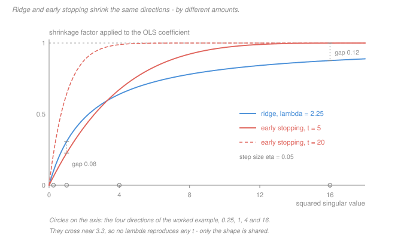

# Statistical Learning Theory · Lesson 2.6: Gradient descent, the workhorse

> ⏱ ~15 min · Module 2: Linear methods · Builds on: [2.1 (linear regression as learning)](02-01-linear-regression-as-learning.md), [2.3 (ridge regression and shrinkage)](02-03-ridge-regression-and-shrinkage.md) · Unlocks: [3.2 (finite classes and uniform convergence)](03-02-finite-classes-and-uniform-convergence.md)

## Why this matters

Everything after Module 2 is fitted by walking downhill. But *downhill on what?* You never have the function you care about — the population risk $R(w)$ — so you walk downhill on a sample-built stand-in and hope. This lesson is about what that hope is worth.

Two things are ceded up front and used freely below. **How to run gradient descent** — picking $\eta$, spotting divergence, mini-batching in practice — is [`machine-learning` 1.6](../../machine-learning/lessons/01-06-gradient-descent-for-learning.md). **How fast it converges** — the $O(1/t)$ and linear rates, smoothness and strong convexity — is [`convex-optimization` 4.1](../../convex-optimization/lessons/04-01-first-order-methods.md). Neither asks the question this course owns: **the gradient is a random quantity computed from data, so what is it an estimate of, and what does it cost to compute it badly?**

The answer reframes SGD, and it hands you a regularizer you did not know you were using.

## The idea

Three sentences, and the rest of the lesson makes them precise.

**One.** The empirical-risk gradient is an *unbiased estimate* of the population-risk gradient. That is the licence for the whole enterprise: you optimise $\hat R_S$ because its slope points, on average, the way $R$'s slope points.

**Two.** So is a single-example gradient, and so is a mini-batch of any size. **SGD is not a cheap approximation to "real" gradient descent** — full-batch and single-example gradients are equally unbiased estimates of the same population gradient. The batch size buys *variance*, not *correctness*. Full-batch GD is just the mini-batch method with the noise turned down and the price turned up.

**Three.** None of that saves you, because you are descending the wrong function. Both methods converge toward a minimiser of $\hat R_S$, and what you wanted was a minimiser of $R$. More compute closes the first gap and does nothing to the second. That second gap is Module 3's entire subject.

And a bonus you get whether you want it or not: **stopping the descent early shrinks your coefficients**, in a way that looks a lot like [ridge](../reference.md#ridge-regression) and is not the same function as ridge.

## The formal version

**Setup.** Data $(x,y)\sim\mathcal D$, sample $S=\{(x_i,y_i)\}_{i=1}^n$ drawn i.i.d., weights $w\in\mathbb R^p$, loss $\ell(h_w(x),y)$ differentiable in $w$. Write $R(w)=\mathbb E_{\mathcal D}[\ell(h_w(x),y)]$ and $\hat R_S(w)$ for its [empirical counterpart](../reference.md#empirical-risk).

**Theorem (the gradient is unbiased).** Fix any $w$ chosen *before* $S$ is drawn. Then

$$\mathbb E_S\bigl[\nabla \hat R_S(w)\bigr] = \frac1n\sum_{i=1}^n \mathbb E\bigl[\nabla_w \ell(h_w(x_i),y_i)\bigr] = \nabla R(w).$$

*In words:* averaging the per-example gradients over your sample is an unbiased guess at the gradient of the risk you cannot see.

*Proof.* Differentiation and the sum commute, each term has the same distribution, and expectation is linear — one line, on the exchange of $\nabla$ and $\mathbb E$ that [`prob-stat-refresher` 02-01](../../prob-stat-refresher/lessons/02-01-expectation-variance-moments.md) sets up. $\blacksquare$

**Corollary (batch size buys variance).** Let $B$ be $b$ examples drawn i.i.d. from $\mathcal D$ and $\hat g_B(w)$ their average gradient. Then $\mathbb E[\hat g_B(w)]=\nabla R(w)$ for every $b$, and

$$\operatorname{Cov}\bigl(\hat g_B(w)\bigr) = \frac{1}{b}\,\Sigma(w), \qquad \Sigma(w) := \operatorname{Cov}\bigl(\nabla_w\ell(h_w(x),y)\bigr).$$

*In words:* $b=1$ and $b=n$ point the same way on average; the big batch just wobbles $\sqrt{b}$ times less. This is the covariance-of-an-average fact from [`prob-stat-refresher` 03-01](../../prob-stat-refresher/lessons/03-01-joint-distributions-covariance.md).

**The two errors.** Let $\hat w$ be the ERM solution and $w_T$ the iterate you actually stop at. The identity is exact:

$$R(w_T) = \underbrace{\hat R_S(\hat w)}_{\text{ERM's training error}} + \underbrace{\bigl[\hat R_S(w_T)-\hat R_S(\hat w)\bigr]}_{\text{optimisation error}} + \underbrace{\bigl[R(w_T)-\hat R_S(w_T)\bigr]}_{\text{generalisation gap}}.$$

*In words:* what you get on new data is what you got on old data, plus how badly you solved the optimisation, plus how much the old data lied. **Compute buys down only the middle term.** [`convex-optimization` 4.1](../../convex-optimization/lessons/04-01-first-order-methods.md) owns that one; Module 3 owns the right-hand one.

**Early stopping shrinks.** Take least squares, $\tfrac12\lVert y-Xw\rVert^2$, gradient descent from $w_0=0$ with step $\eta$. Write $X=U\Sigma V^\top$ ([`linalg-refresher` 5.2](../../linalg-refresher/lessons/05-02-svd.md)), let $\alpha_t = V^\top w_t$ be the iterate in the SVD basis, and $z=U^\top y$. The update decouples completely:

$$\alpha_{t+1,i} = (1-\eta\sigma_i^2)\,\alpha_{t,i} + \eta\sigma_i z_i.$$

Its fixed point is the OLS coefficient $\alpha^{\mathrm{ols}}_i = z_i/\sigma_i$, and subtracting it turns the recursion into a plain geometric one. With $\alpha_0=0$:

$$\alpha_{t,i} = \alpha^{\mathrm{ols}}_i\Bigl[1-(1-\eta\sigma_i^2)^t\Bigr], \qquad\text{against ridge's}\qquad \alpha^{\mathrm{ridge}}_i = \alpha^{\mathrm{ols}}_i\,\frac{\sigma_i^2}{\sigma_i^2+\lambda}.$$

*In words:* both methods take the OLS answer and multiply each SVD direction by a number in $(0,1)$ — a [shrinkage factor](../reference.md#early-stopping-shrinkage). Both factors increase in $\sigma_i^2$, so both leave the well-determined directions nearly alone and crush the badly-determined ones. **They are the same kind of object. They are not the same function**, and no $\lambda$ reproduces a $t$.

The claim that *is* true, and it is the useful one: $t\mapsto 1-(1-\eta\sigma^2)^t$ increases in $t$ while $\lambda\mapsto \sigma^2/(\sigma^2+\lambda)$ decreases in $\lambda$, so **more steps behaves like less regularization**, monotonically. In the small-$\sigma^2$ limit the correspondence even has a number: $1-(1-\eta\sigma^2)^t \approx t\eta\sigma^2$ and $\sigma^2/(\sigma^2+\lambda)\approx \sigma^2/\lambda$, matching when

$$\lambda \approx \frac{1}{\eta t}.$$

"Train longer" and "lower $\lambda$" are one knob wearing two hats.

## Picture

Read it twice. **The shared shape** is the real content: every curve is near zero on the small directions and near one on the large ones, which is what "shrinkage" means. **The visible separation** is the honesty: at $\sigma^2=1$ ridge shrinks *less* than five steps of descent, at $\sigma^2=16$ it shrinks *more*, and the curves cross near $3.3$. A single $\lambda$ cannot bend into a single $t$.

Note also the dashed $t=20$ curve sitting above $t=5$ everywhere — that is "more steps, less regularization" as a picture.

## Worked examples

**Example 1 (mechanical): the mini-batch gradient, enumerated.** Predict a constant $w$ under loss $\tfrac12(w-y)^2$, so the per-example gradient is $w-y_i$. Take four points, $y=(2,4,6,12)$, and evaluate at $w=0$.

Per-example gradients: $-2,\,-4,\,-6,\,-12$. Full-batch gradient: $-6$.

All six batches of size two and their averages:

| batch | $(2,4)$ | $(2,6)$ | $(2,12)$ | $(4,6)$ | $(4,12)$ | $(6,12)$ |
|---|---|---|---|---|---|---|
| gradient | $-3$ | $-4$ | $-7$ | $-5$ | $-8$ | $-9$ |

Their average is $-36/6 = -6$: **exactly the full-batch gradient.** Unbiasedness is not asymptotic — it is an identity on this six-element list.

The variances. The single-example gradient has variance $\tfrac14(16+4+0+36) = 14$. Drawing the batch **with replacement** gives variance $14/2 = 7$, which is the corollary's $\Sigma/b$ on the nose. Drawing it **without replacement**, as the six batches above do, gives $28/6 = 14/3 \approx 4.67$ — smaller by the finite-population factor $(n-b)/(n-1) = 2/3$.

So $\Sigma/b$ is exact for i.i.d. draws and mildly pessimistic for the shuffle-and-slice scheme everyone actually uses. Either way the message holds: to halve a gradient's standard deviation you must **quadruple** the batch, which is why $b$ hits diminishing returns fast.

**Example 2 (why you'd care): early stopping is a shrinkage you did not ask for.** Design with squared singular values $\sigma_i^2 = 16,\,4,\,1,\,0.25$; gradient descent from zero at $\eta = 0.05$, stopped at $t=5$. Compare against the ridge fit whose shrinkage profile is the closest possible match (least squares over $\lambda$, giving $\lambda = 2.252$).

| $\sigma_i^2$ | early stopping, $t=5$ | ridge, $\lambda=2.25$ | $\lambda$ matching **this** direction |
|---|---|---|---|
| $16$ | $0.9997$ | $0.8766$ | $0.0051$ |
| $4$ | $0.6723$ | $0.6398$ | $1.9495$ |
| $1$ | $0.2262$ | $0.3075$ | $3.4205$ |
| $0.25$ | $0.0610$ | $0.0999$ | $3.8513$ |

The best matched $\lambda$ leaves a sum of squared differences of $2.4\times 10^{-2}$ — small, and not zero. The fourth column is the sharper statement: to reproduce $t=5$ you would need $\lambda = 0.0051$ on the leading direction and $\lambda = 3.42$ on the third, a factor of **670** apart. One $\lambda$ cannot do both jobs.

What the comparison licenses you to say: your five-step fit is *regularized*, at roughly the strength of a $\lambda$ near $1/(\eta t) = 4$, and it did not appear in your objective anywhere. What it does not license: calling early stopping "ridge with $\lambda = 1/(\eta t)$."

## Watch out

- **You might think** unbiasedness survives into the run of gradient descent — **but actually** the theorem requires $w$ fixed *before* $S$ is drawn, and $w_t$ for $t\ge 1$ is a function of $S$. Multi-epoch SGD draws its mini-batches from a frozen $S$, so conditional on $w_t$ it is unbiased for $\nabla\hat R_S(w_t)$ — the **empirical** gradient — not for $\nabla R(w_t)$. Only *one-pass* SGD on fresh examples has $\mathbb E[\hat g\mid w_t]=\nabla R(w_t)$, and it is the only version that is genuinely descending the population risk.
- **You might think** $\operatorname{Cov} = \Sigma/b$ is a fact about mini-batching — **but actually** it is a fact about i.i.d. sampling. Shuffle-and-slice samples without replacement and does better by $(n-b)/(n-1)$; Example 1 shows $14/3$ where the formula predicts $7$. Harmless, but do not quote $\Sigma/b$ as an equality when the batches are a partition.
- **You might think** early stopping and ridge coincide — **but actually** they only share a shape, and the picture shows the curves crossing. The defensible claims are: both are monotone shrinkage in $\sigma_i^2$; more steps means less shrinkage; and $\lambda\approx 1/(\eta t)$ holds in the $\sigma^2\to 0$ limit and nowhere exactly. This distinction matters again in [5.5](05-05-why-does-deep-learning-generalize.md), where "implicit regularization" is exactly this phenomenon with the analogy taken further than it can bear.

## One-liner

> The gradient you descend is a statistic, not a fact: it is unbiased for the population gradient at any weight you fixed in advance, the batch size buys variance rather than correctness, and every step you take or decline to take is a shrinkage decision you are making whether or not you wrote it into the objective.

## Problems

**P1 (🟢)** Fix $w$ before drawing data. Let $B=\{(x_j,y_j)\}_{j=1}^b$ be i.i.d. from $\mathcal D$ and let $\hat g_B(w)$ be the average of their per-example gradients.

(a) Prove $\mathbb E[\hat g_B(w)] = \nabla R(w)$, naming the property of expectation used at each step.
(b) Give $\operatorname{Cov}(\hat g_B(w))$ in terms of $b$ and $\Sigma(w)$, and state the independence assumption it needs.
(c) By what factor must $b$ grow to halve the standard deviation of each gradient coordinate? State the practical consequence in one sentence.

**P2 (🟡)** Gradient descent from $w_0=0$ on $\tfrac12\lVert y-Xw\rVert^2$ with $\eta = 0.1$, on a design whose squared singular values are $9,\,4,\,1$.

(a) Check the step size is admissible, then give the shrinkage factor on each direction at $t=1,\,5,\,50$. Report $t=1$ exactly.
(b) For $t=1$, find the ridge $\lambda$ that would reproduce the factor on each of the three directions *separately*. What do the three numbers show?
(c) Say what happens to those implied $\lambda$ values as $t$ grows, and state the one claim relating $t$ and $\lambda$ that is actually true.

**P3 (🔴)** A colleague runs SGD until the training loss has plateaued to six decimal places, reports that number, and concludes the model is good.

(a) Name the two distinct error terms they have conflated, using the identity from **The formal version**.
(b) Say which one more compute can reduce and which it cannot, and why.
(c) They propose to fix it by switching to full-batch gradient descent, "so the gradient is exact." Say what is right and what is wrong in that sentence, in terms of what each gradient is an estimate of.

Solutions

**P1**

(a) By definition and then by **linearity of expectation**,

$$\hat g_B(w) = \frac1b\sum_{j=1}^b \nabla_w\ell(h_w(x_j),y_j), \qquad \mathbb E\bigl[\hat g_B(w)\bigr] = \frac1b\sum_{j=1}^b \mathbb E\bigl[\nabla_w\ell(h_w(x_j),y_j)\bigr].$$

Each $(x_j,y_j)$ is drawn from $\mathcal D$, so all $b$ terms are **identically distributed** and each equals $\mathbb E_{\mathcal D}[\nabla_w\ell(h_w(x),y)]$. Because $w$ was fixed before the draw, $\nabla_w$ and $\mathbb E_{\mathcal D}$ **commute** (the weights are not random), and that expectation is $\nabla R(w)$. Averaging $b$ copies of $\nabla R(w)$ gives $\nabla R(w)$. $\blacksquare$

Note where each hypothesis was spent: identical distribution gave the common value, and *independence was not used at all* — unbiasedness holds for any identically distributed batch, correlated or not.

(b) The covariance of an average of independent terms:

$$\operatorname{Cov}\bigl(\hat g_B(w)\bigr) = \frac{1}{b^2}\sum_{j=1}^b \operatorname{Cov}\bigl(\nabla_w\ell_j\bigr) = \frac{1}{b}\Sigma(w).$$

Here independence **is** required: it is what kills the $b(b-1)$ cross-covariance terms. Without it the middle equality fails.

(c) Each coordinate has standard deviation $\sqrt{\Sigma_{kk}/b}$, which scales as $b^{-1/2}$, so halving it requires **four times** the batch. Practical consequence: past a modest batch size you are paying linearly in compute for a square-root reduction in gradient noise, which is why enormous batches are rarely worth it.

**P2**

(a) Admissible: gradient descent on this quadratic converges iff $|1-\eta\sigma_i^2|<1$ for every $i$, i.e. $\eta < 2/\sigma_{\max}^2 = 2/9 \approx 0.222$. With $\eta=0.1$ we have $\eta\sigma_i^2 = 0.9,\,0.4,\,0.1$, all in $(0,1)$. ✓

Factors $1-(1-\eta\sigma_i^2)^t$:

| $\sigma_i^2$ | $t=1$ | $t=5$ | $t=50$ |
|---|---|---|---|
| $9$ | $9/10 = 0.9$ | $1-0.1^5 = 0.99999$ | $1-10^{-50} \approx 1$ |
| $4$ | $2/5 = 0.4$ | $1-0.6^5 = 0.92224$ | $1 - 8.1\times10^{-12} \approx 1$ |
| $1$ | $1/10 = 0.1$ | $1-0.9^5 = 0.40951$ | $1-0.9^{50} = 0.994846$ |

At $t=1$ the factor is exactly $\eta\sigma_i^2$, since one step from zero moves each direction by $\eta\sigma_i z_i$, which is $\eta\sigma_i^2$ times the OLS value $z_i/\sigma_i$.

(b) Invert $\sigma^2/(\sigma^2+\lambda) = f$ to get $\lambda = \sigma^2(1-f)/f$:

- $\sigma^2 = 9$, $f=0.9$: $\lambda = 9\cdot\frac{0.1}{0.9} = \mathbf{1}$
- $\sigma^2 = 4$, $f=0.4$: $\lambda = 4\cdot\frac{0.6}{0.4} = \mathbf{6}$
- $\sigma^2 = 1$, $f=0.1$: $\lambda = 1\cdot\frac{0.9}{0.1} = \mathbf{9}$

Three directions, three completely different $\lambda$ — spanning a factor of nine. **No single ridge penalty reproduces one step of gradient descent.** The two shrinkage profiles are different functions of $\sigma^2$; matching them at one direction guarantees a mismatch at the others. (Only a design with a single distinct singular value could be matched exactly, and then trivially.)

(c) They all shrink toward zero. On $\sigma^2=1$: $\lambda = 9$ at $t=1$, $0.59049/0.40951 = 1.442$ at $t=5$, and $0.005154/0.994846 = 0.00518$ at $t=50$. The same happens on every direction.

The true claim: $1-(1-\eta\sigma^2)^t$ is **increasing in $t$** and $\sigma^2/(\sigma^2+\lambda)$ is **decreasing in $\lambda$**, so more steps always corresponds to weaker shrinkage — the two knobs run in opposite directions and are monotonically related. The false claim is any exact identity between them; the only quantitative version is the small-$\sigma^2$ approximation $\lambda\approx 1/(\eta t)$, which here reads $10,\,2,\,0.2$ against the $\sigma^2=1$ values $9,\,1.44,\,0.0052$ — the right order, not the right number.

**P3**

(a) In the identity

$$R(w_T) = \hat R_S(\hat w) + \bigl[\hat R_S(w_T)-\hat R_S(\hat w)\bigr] + \bigl[R(w_T)-\hat R_S(w_T)\bigr],$$

the plateaued number is $\hat R_S(w_T)$, which is the first two terms. Reporting it as evidence "the model is good" conflates the **optimisation error** — how far $w_T$ is from the ERM solution on this sample — with the **generalisation gap**, how far $\hat R_S(w_T)$ is from $R(w_T)$. A plateau is evidence about the first only.

(b) More compute reduces the **optimisation error**: it is the distance to $\hat R_S$'s minimiser, and running longer closes it (at the rate [`convex-optimization` 4.1](../../convex-optimization/lessons/04-01-first-order-methods.md) gives). It cannot touch the **generalisation gap**, because that gap is a property of the *sample*, not of the search. No amount of descending $\hat R_S$ tells you anything about $R-\hat R_S$; you need a theorem about the hypothesis class, which is [3.2](03-02-finite-classes-and-uniform-convergence.md) and [3.4](03-04-vc-bounds-and-sample-complexity.md), or a held-out set, which is [1.3](01-03-overfitting-and-train-validation-test.md). Worse, driving the optimisation error to exactly zero tends to *enlarge* the gap, since $\hat R_S(\hat w)$ is itself biased downward ([1.1](01-01-what-is-learning-loss-risk-and-erm.md)).

(c) **Right:** the full-batch gradient has lower variance — zero, conditional on $S$ — so it really is a better estimate of $\nabla\hat R_S(w)$. **Wrong:** "exact" names the wrong target. The full-batch gradient is exact for $\hat R_S$ and is still only an unbiased, noisy estimate of $\nabla R$; the noise moved from the batch draw into the sample draw and did not go away. Switching to full-batch reduces a term that was not the problem, and by removing the mini-batch noise it may even reach a sharper minimiser of the wrong function.

## Flashback

**From Lesson 2.4 (Lasso and the geometry of sparsity):** the KKT conditions give a certificate you can check on any *claimed* lasso solution. For

$$\min_\beta \ \tfrac12\lVert y-X\beta\rVert^2 + \lambda\lVert\beta\rVert_1$$

with residual $r = y - X\hat\beta$, the [lasso KKT conditions](../reference.md#lasso-kkt-conditions) say every active coordinate needs $x_j^\top r = \lambda\operatorname{sign}(\hat\beta_j)$ and every zero coordinate needs $|x_j^\top r|\le\lambda$. (Note the $\tfrac12$ convention, as in 2.4.)

Take $x_1 = (1,0,1)^\top$, $x_2 = (0,1,1)^\top$ and $y = (3,0,4)^\top$.

(a) At $\lambda = 3$ a colleague claims $\hat\beta = (2,\,0)$. Verify or refute.
(b) At $\lambda = 1$ they claim $\hat\beta = (3,\,\tfrac12)$. Verify or refute.
(c) Gradient descent is this lesson's workhorse, yet it cannot be run on the lasso objective as written. Say why, and give the one-line fix.

Solution

(a) **Verified.** $r = y - 2x_1 = (3,0,4)-(2,0,2) = (1,0,2)$. Then $x_1^\top r = 1+2 = 3$ and $x_2^\top r = 0+2 = 2$.

- $\hat\beta_1 = 2 > 0$, so we need $x_1^\top r = \lambda = 3$. ✓
- $\hat\beta_2 = 0$, so we need $|x_2^\top r| = 2 \le 3$. ✓

Both conditions hold, so $(2,0)$ is a lasso minimiser at $\lambda=3$. (Objective value $8.5$; a numerical minimiser agrees.)

(b) **Refuted.** The residual is

$$r = (3,0,4) - 3x_1 - \tfrac12 x_2 = \bigl(0,\ -\tfrac12,\ \tfrac12\bigr),$$

giving $x_1^\top r = 0 + \tfrac12 = \tfrac12$ and $x_2^\top r = 0$. But $\hat\beta_1 = 3 > 0$ demands $x_1^\top r = \lambda = 1$, and $\tfrac12 \ne 1$. The certificate fails, so this is not the solution — no search required.

(The true solution at $\lambda=1$ is $(3,0)$: there $r = (0,0,1)$, $x_1^\top r = 1 = \lambda$ ✓ and $|x_2^\top r| = 1 \le \lambda$ **with equality**, meaning $\beta_2$ is exactly on the point of entering the active set. Objective $3.5$ against the claim's $3.75$.)

(c) **Why not.** $\lVert\beta\rVert_1$ is not differentiable at any $\beta_j = 0$, so $\nabla$ does not exist there — and this is not a measure-zero technicality you can ignore, because **the whole point of the lasso is that the solution lives on exactly that non-differentiable set**. A subgradient step at zero picks some element of $[-\lambda,\lambda]$, steps off zero, and the iterates then wander around zero without ever landing on it, so you lose the sparsity you paid for.

**The fix, one line:** proximal gradient descent (ISTA) — take a plain gradient step on the smooth half $\tfrac12\lVert y-X\beta\rVert^2$, then apply the [soft threshold](../reference.md#soft-thresholding) from 2.4, which is exactly the proximal operator of $\lambda\lVert\cdot\rVert_1$. The threshold sets small coordinates to *exactly* zero at every iteration, so sparsity is produced rather than approached. See [`convex-optimization` 4.1](../../convex-optimization/lessons/04-01-first-order-methods.md) and [5.1](../../convex-optimization/lessons/05-01-least-squares-lasso.md).

## Connections

- **Backward:** the ridge shrinkage factor $\sigma_i^2/(\sigma_i^2+\lambda)$ is [2.3's](02-03-ridge-regression-and-shrinkage.md), and the reason $\hat R_S(\hat w)$ is a biased floor rather than a report card is [1.1's](01-01-what-is-learning-loss-risk-and-erm.md). [2.1](02-01-linear-regression-as-learning.md) gave the one case where you can skip descent entirely; from [2.2](02-02-logistic-regression-and-classification.md) onward you cannot.
- **Forward:** the generalisation-gap term is left dangling here on purpose — [3.2](03-02-finite-classes-and-uniform-convergence.md) turns it into a theorem with Hoeffding and a union bound, and [3.4](03-04-vc-bounds-and-sample-complexity.md) makes it a sample-size statement. [5.5](05-05-why-does-deep-learning-generalize.md) argues that the early-stopping effect derived here is one face of the "implicit regularization" that keeps overparameterized networks from being as bad as [3.4's](03-04-vc-bounds-and-sample-complexity.md) bound says they should be.
- **Sideways:** the rates are [`convex-optimization` 4.1](../../convex-optimization/lessons/04-01-first-order-methods.md) and the practice is [`machine-learning` 1.6](../../machine-learning/lessons/01-06-gradient-descent-for-learning.md) — this lesson is the statistical layer between them. The "unbiased but high-variance estimate of a thing you cannot compute" pattern is the same one behind stochastic approximation in [`reinforcement-learning`](../../reinforcement-learning/syllabus.md), where the reward signal plays the role of the sampled gradient; and the trade of bias for variance by stopping a procedure early is [2.3's](02-03-ridge-regression-and-shrinkage.md) trade in a different currency.
