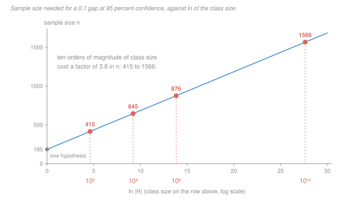

# Statistical Learning Theory · Lesson 3.2: Finite classes and uniform convergence

> ⏱ ~15 min · Module 3: Statistical learning theory · Builds on: [3.1 (the PAC framework)](03-01-the-pac-framework.md), [1.1 (risk and ERM)](01-01-what-is-learning-loss-risk-and-erm.md) · Unlocks: [3.3 (shattering and the VC dimension)](03-03-shattering-and-the-vc-dimension.md)

## Why this matters

[Lesson 1.1](01-01-what-is-learning-loss-risk-and-erm.md) left a bill unpaid. The [empirical risk](../reference.md#empirical-risk) $\hat R_S(h)$ is an unbiased estimate of the true risk $R(h)$ **for any hypothesis you fix before looking at the sample** — and ERM does precisely the opposite, choosing $\hat h$ *because* it scored well on $S$. That is why 1.1's toy class of $M$ hypotheses, every one of them worthless with true risk exactly $1/2$, still produced a best-observed training error of $0.31$ at $M = 10^4$. The selection alone did it.

This lesson pays the bill in the easiest case: $\mathcal H$ finite. It is the course's first real theorem, and it is [PAC](../reference.md#pac-learnability) learnability delivered rather than defined.

More importantly it is a **proof shape you will reuse four more times**. Three moves — concentrate, union, invert — and every later bound in this course (VC in [3.4](03-04-vc-bounds-and-sample-complexity.md), Rademacher in [3.5](03-05-rademacher-complexity.md), the margin bound in [4.3](04-03-maximum-margin-classifiers.md)) is this same skeleton with the middle move swapped for something cleverer. Learn the skeleton here and the rest of the module is variations.

## The idea

A fund manager backtests 1,000 strategies and reports the best one's return. Each individual backtest is an honest, unbiased estimate of that strategy's true return. **The winner's backtest is not** — the maximum of 1,000 noisy estimates is inflated by the noise, and the more strategies you try, the more inflated it gets. ERM has exactly this shape, with "return" replaced by "training error" and the max replaced by a min.

You have two ways out.

1. Work out the distribution of the *winner's* error. This is hard: it depends on how the hypotheses' errors correlate with one another, which depends on $\mathcal D$, which you don't know.
2. Prove something so strong that it no longer matters which one won:

> **every** $h \in \mathcal H$ has its empirical risk within $\epsilon$ of its true risk, *simultaneously, on this one sample.*

That second statement is **[uniform convergence](../reference.md#uniform-convergence)**, and it is a bargain. It says nothing about the selection rule, so it holds no matter how adversarially you pick $\hat h$ — including picking it after seeing $S$, which is the only thing that was ever wrong.

What does "all of them at once" cost? The [union bound](../reference.md#union-bound): the chance that at least one of $M$ bad events happens is at most the sum of their chances. So $M$ hypotheses cost a factor of $M$ in failure probability — and here is the whole lesson in one line:

> **Failure probability falls exponentially in $n$, but the union bound's price is only linear in $M$. So you pay for class size in $\ln M$.**

An exponential absorbing a linear factor is what turns a hopeless-looking count into a cheap one. Ten thousand times more hypotheses costs about twice the data.

## The formal version

Fix a hypothesis class $\mathcal H$ with $|\mathcal H| = M < \infty$, a loss $\ell$ taking values in the interval from 0 to 1, and $S = ((x_1,y_1),\dots,(x_n,y_n))$ drawn i.i.d. from $\mathcal D$. Write $Z_i(h) = \ell(h(x_i), y_i)$, so that

$$\hat R_S(h) = \frac1n\sum_{i=1}^n Z_i(h), \qquad R(h) = \mathbb E_{\mathcal D}\bigl[Z_1(h)\bigr].$$

**Definition (uniform convergence).** $S$ is **$\epsilon$-representative** for $\mathcal H$ if

$$\bigl|\hat R_S(h) - R(h)\bigr| \le \epsilon \quad \text{for every } h \in \mathcal H.$$

*In words:* on this sample, training error is an honest report card for the entire class at once — not just for one hypothesis chosen in advance.

### Move 1 — concentrate (Hoeffding)

**[Hoeffding's inequality](../reference.md#hoeffdings-inequality).** If $U_1,\dots,U_n$ are independent with $a \le U_i \le b$ and mean $\mu$, then

$$\Pr\Bigl(\bigl|\tfrac1n\textstyle\sum_i U_i - \mu\bigr| > \epsilon\Bigr) \;\le\; 2\exp\!\left(\frac{-2n\epsilon^2}{(b-a)^2}\right).$$

*In words:* an average of bounded independent things sits near its mean, and the chance of missing by $\epsilon$ dies **exponentially** in $n$. This is the [law of large numbers](../../prob-stat-refresher/lessons/03-02-sums-and-law-of-large-numbers.md) with a rate attached; the technique — bound a tail using a moment — is [probability-theory 2.5](../../probability-theory/lessons/02-05-lp-spaces-inequalities.md), and Hoeffding is the sharp version for bounded variables.

For one **fixed** $h$, the $Z_i(h)$ are i.i.d. and live in the interval from 0 to 1, so $b - a = 1$:

$$\Pr\bigl(|\hat R_S(h) - R(h)| > \epsilon\bigr) \;\le\; 2e^{-2n\epsilon^2}.$$

The word *fixed* is doing all the work. Fix $h$ first, then draw $S$; that is what makes the $Z_i(h)$ independent of the choice of $h$.

### Move 2 — union

Let $B_h$ be the event that $h$ is the one that fails: $|\hat R_S(h) - R(h)| > \epsilon$. Each $\Pr(B_h) \le 2e^{-2n\epsilon^2}$, and the sample is not $\epsilon$-representative exactly when some $B_h$ occurs. So

$$\Pr\Bigl(\bigcup_{h \in \mathcal H} B_h\Bigr) \;\le\; \sum_{h \in \mathcal H} \Pr(B_h) \;\le\; 2\,|\mathcal H|\,e^{-2n\epsilon^2}.$$

No independence is needed here — the union bound holds for arbitrarily dependent events, which is exactly why it is safe and exactly why it is loose (P3).

### Move 3 — invert

Set the right-hand side to $\delta$ and solve for $n$. From $2Me^{-2n\epsilon^2} = \delta$ we get $2n\epsilon^2 = \ln(2M/\delta)$, so:

**Theorem (uniform convergence for finite classes).** For any $\epsilon, \delta \in (0,1)$, if

$$n \;\ge\; \frac{1}{2\epsilon^2}\,\ln\frac{2|\mathcal H|}{\delta}$$

then with probability at least $1-\delta$ over the draw of $S$, the sample is $\epsilon$-representative for $\mathcal H$. Equivalently, solving the same equation for $\epsilon$ instead: with probability at least $1-\delta$, **every** $h \in \mathcal H$ satisfies

$$R(h) \;\le\; \hat R_S(h) + \sqrt{\frac{\ln|\mathcal H| + \ln(2/\delta)}{2n}}.$$

*In words:* true risk is training error plus a penalty you can compute before seeing any data. The penalty grows with class size and shrinks like $1/\sqrt n$.

### The payoff: ERM is agnostically PAC

Let $h^{\star} = \arg\min_{h\in\mathcal H} R(h)$ be the best hypothesis in the class, and $\hat h$ the ERM output. On an $\epsilon$-representative sample:

$$R(\hat h) \;\le\; \hat R_S(\hat h) + \epsilon \;\le\; \hat R_S(h^{\star}) + \epsilon \;\le\; R(h^{\star}) + 2\epsilon.$$

Three steps: uniform convergence at $\hat h$; then $\hat h$ minimises $\hat R_S$ so it beats $h^{\star}$ empirically; then uniform convergence again, at $h^{\star}$. **Notice that the statement is used at two different hypotheses, one of which is random.** That is precisely why "for all $h$" was worth the union bound — a guarantee about $\hat h$ alone could not have supplied the third step.

### The headline: complexity is paid in bits

$\ln|\mathcal H|$ is the **description length** of the class. If every hypothesis can be named in $b$ bits then $|\mathcal H| \le 2^b$ and $\ln|\mathcal H| \le b\ln 2$, so each extra bit of model description costs you a fixed $\ln 2 / (2\epsilon^2)$ samples — about 35 samples per bit at $\epsilon = 0.1$. This is the minimum-description-length reading the syllabus notes point at; [information-theory 1.1](../../information-theory/lessons/01-01-entropy-uncertainty-surprise.md) is where description length as a measure of content comes from.

## Picture

At $\epsilon = 0.1$ and $\delta = 0.05$, the bound reads $n \ge 50\,\ln(2|\mathcal H|/0.05)$. A single hypothesis needs 185 samples — that is the pure cost of estimating one number to within $0.1$ at 95 percent confidence, and it is the intercept. Everything above it is the price of choice:

| $\lvert\mathcal H\rvert$ | $\ln\lvert\mathcal H\rvert$ | $n$ |
|---|---|---|
| $1$ | $0$ | 185 |
| $10^2$ | 4.61 | 415 |
| $10^4$ | 9.21 | 645 |
| $10^6$ | 13.82 | 876 |
| $10^{12}$ | 27.63 | 1566 |

Going from a hundred hypotheses to a *trillion* — ten orders of magnitude — multiplies the required sample size by 3.8. That flatness is the entire content of the theorem, and it is why "I searched a huge model space" is not, by itself, a reason to distrust a result.

## Worked examples

**Example 1 (mechanical): conjunctions over Boolean features.** Let $\mathcal X = \{0,1\}^{10}$ — ten yes/no features — and let $\mathcal H$ be the **conjunctions of literals**: rules like "$x_2$ and not-$x_7$ and $x_9$". Each of the 10 variables appears plain, negated, or not at all, so

$$|\mathcal H| = 3^{10} = 59{,}049, \qquad \ln|\mathcal H| = 10\ln 3 = 10.99.$$

At $\epsilon = 0.1$, $\delta = 0.05$:

$$n \;\ge\; \frac{1}{2(0.1)^2}\bigl(10.99 + \ln 40\bigr) = 50 \times 14.675 = 733.8,$$

so $n = 734$ suffices. Check it against the other form of the theorem: at $n = 734$ the penalty is $\sqrt{14.675/1468} = 0.09998$ — the same $\epsilon$, as it must be, since the two displays are one equation solved for different unknowns.

Read the answer: **fifty-nine thousand candidate rules, and 734 labelled examples buy you a guarantee covering all of them at once.** Tightening to $\epsilon = 0.05$ costs a factor of four, giving $n = 2{,}936$ — worth noticing now, because that quadratic in $1/\epsilon$ is the expensive knob (P1).

**Example 2 (why you'd care): the bound is loose, and the looseness is informative.** [Lesson 3.1](03-01-the-pac-framework.md) analysed thresholds $\mathcal H = \{\mathbf 1[x \ge a] : a \in \mathbb R\}$ directly and got $n \ge \frac1\epsilon\ln\frac1\delta$, which at $\epsilon = 0.1$, $\delta = 0.05$ is **30 samples**.

Now do it with this lesson's machinery. Thresholds are an infinite class, so first make it finite: on a real computer $a$ is a 64-bit double, giving $|\mathcal H| \le 2^{64}$ and $\ln|\mathcal H| = 64\ln 2 = 44.36$. Then

$$n \;\ge\; 50\,(44.36 + 3.69) = 2402.5 \;\Rightarrow\; n = 2403.$$

**Eighty times worse.** Where did the factor of 80 go? It splits cleanly in two:

- **A factor of 5 is honest.** 3.1's bound is *realizable* — it assumes some threshold has zero risk, so the failure event is one-sided and the rate is $1/\epsilon$. This lesson's bound is *agnostic*: it makes no such assumption, and pays $1/(2\epsilon^2)$. At $\epsilon = 0.1$ that is $50$ against $10$. You bought something real with it.
- **A factor of 16 is waste**, and it is the union bound's. On $n$ sample points, the $2^{64}$ thresholds produce at most $n+1$ **distinct labellings** — every threshold falling between the same two adjacent sample points has an identical empirical risk. At $n = 30$ that is 31 genuinely different behaviours. The union bound counted $2^{64}$ separate failure events when there were at most 31 distinct ones, and charged $\ln 2^{64} = 44.36$ where $\ln 31 = 3.43$ would have done.

That is the crack the rest of the module widens. A class can be infinite — thresholds are — and still have only $n+1$ behaviours on any $n$ points. **Capacity is about distinct behaviours, not about count.** Naming that quantity is [Lesson 3.3](03-03-shattering-and-the-vc-dimension.md).

## Watch out

- **You might think** the theorem says ERM's risk is small — **but actually** it says ERM's risk is close to $R(h^{\star})$, the best *in the class*. If every hypothesis in $\mathcal H$ is terrible, the bound is satisfied and your model is useless. This is 1.1's split showing up again: uniform convergence controls the **estimation error** only, and says nothing about **approximation error**. Enlarging $\mathcal H$ shrinks the first term and grows $\ln|\mathcal H|$ in the second — the bias–variance tradeoff of [1.2](01-02-the-bias-variance-decomposition.md) wearing a theorist's coat.
- **You might think** $\mathcal H$ is whatever you finally fitted — **but actually** it is everything you *could* have selected using $S$. Try eight architectures, keep the winner, and the honest $|\mathcal H|$ is eight times bigger; tune a threshold over a grid of 100 values on the same data and it is a hundred times bigger. Fixing $\mathcal H$ before drawing $S$ is a hypothesis of the theorem, not etiquette. (Conversely, the extra cost of that peeking is only $\ln 8 = 2.08$ or $\ln 100 = 4.61$ — cheap, but not free, and not zero.)
- **You might think** "finite class" means "cheap" — **but actually** finite can be astronomically expensive, because the bound charges $\ln|\mathcal H|$, not $|\mathcal H|$, and logarithms of doubly-exponential things are still exponential. All Boolean functions on $d$ bits form a class of size $2^{2^d}$, so $\ln|\mathcal H| = 2^d \ln 2$. At $d = 10$ that is 709.8 and the bound needs $n \ge 35{,}674$; at $d = 20$ it needs $n \ge 36.3$ **million**. The class is finite the whole time. It is also, correctly, unlearnable in practice — this is the no-free-lunch class of [1.4](01-04-no-free-lunch-and-inductive-bias.md), and the theorem agrees with it.

*(One hypothesis worth stating out loud: Hoeffding needs the loss to be **bounded**. It applies to 0-1 loss automatically. It does not apply to squared loss on unbounded targets without an extra boundedness or tail assumption — plugging an unbounded loss into this bound is a real error, not a technicality.)*

## One-liner

> Prove the training error honest for *every* hypothesis at once and it is honest for the one ERM picked — and since the union bound's price is linear in the class size while the failure probability decays exponentially in $n$, that guarantee costs only $\ln|\mathcal H|$ samples.

## Problems

**P1 (🟢)** Take $|\mathcal H| = 2^{20}$ (about a million hypotheses), $\epsilon = 0.05$, $\delta = 0.1$.

(a) Compute the required $n$ from the sample-complexity bound.
(b) Recompute for each single change, keeping the other two fixed: $\delta \to 0.01$; $|\mathcal H| \to 2^{40}$ (the class *squared*); $\epsilon \to 0.025$.
(c) Rank the three inputs by how expensive each is to tighten, and say which one you should therefore never be shy about. Give the structural reason in each case, not just the number.

**P2 (🟡)** Prove the theorem from scratch: $n \ge \frac{1}{2\epsilon^2}\ln\frac{2|\mathcal H|}{\delta}$ implies $S$ is $\epsilon$-representative with probability at least $1-\delta$. In your write-up be explicit about:

(a) at the moment you apply Hoeffding, what is fixed and what is random, and where independence of the $Z_i$ is used;
(b) why the union bound is taken over *hypotheses* and not over sample points, and why it needs no independence;
(c) exactly which step fails when $|\mathcal H| = \infty$ — name the step, and say whether the failure is technical or genuine.

**P3 (🔴)** *The union bound is loose when hypotheses behave alike.* Let $\mathcal D$ be uniform on the interval from 0 to 1. Fix $h_0 = \mathbf 1[x < 1/2]$, and for $j = 1,\dots,M$ with $M = 1000$ let $h_j$ agree with $h_0$ everywhere except on the tiny interval $I_j$ of width $\gamma = 10^{-9}$ starting at $1/2 + (j-1)\gamma$, where it predicts 1 instead of 0. Take $\mathcal H = \{h_0,\dots,h_M\}$, and $n = 1000$, $\epsilon = 0.05$.

(a) Compute the union bound's guarantee on the failure probability, and say what is wrong with the number you get.
(b) Bound the probability that *any* sample point lands in $I_1 \cup \dots \cup I_M$. Conditional on no point landing there, how do the $M+1$ empirical risks compare?
(c) Use (b) to give a genuine bound on the failure probability, and compare it with (a).
(d) State in one sentence what this suggests capacity should really count — and what the smallest $M$ is at which the union bound goes vacuous here.

Solutions

**P1** (a) $\frac{1}{2(0.05)^2} = 200$, and $\ln\frac{2\cdot 2^{20}}{0.1} = \ln(20{,}971{,}520) = 16.8587$, so

$$n \;\ge\; 200 \times 16.8587 = 3371.7 \quad\Rightarrow\quad n = 3372.$$

(Sanity check by substitution: $2|\mathcal H|e^{-2n\epsilon^2}$ equals $0.0999$ at $n = 3372$ and $0.1004$ at $n = 3371$, so 3372 is exactly the first integer that works.)

(b) All three effects are visible directly in $n = \frac{1}{2\epsilon^2}(\ln|\mathcal H| + \ln(2/\delta))$:

| change | new $n$ | cost |
|---|---|---|
| $\delta: 0.1 \to 0.01$ | **3833** | $+461 = 200\ln 10$ |
| $|\mathcal H|: 2^{20} \to 2^{40}$ | **6145** | $+2773 = 200 \cdot 20\ln 2$ |
| $\epsilon: 0.05 \to 0.025$ | **13487** | $\times 4$, i.e. $+10{,}115$ |

(c) **Cheapest to tightest: $\delta$, then $|\mathcal H|$, then $\epsilon$.**

- $\delta$ enters as $\ln(1/\delta)$, so a *tenfold* gain in confidence costs an additive $200\ln 10 \approx 461$ samples — 14 percent more data for ten times less risk of an unlucky sample. **You should essentially never economise on $\delta$**; asking for 99 percent instead of 90 percent confidence is nearly free. (This is 3.1's observation about the $\delta$ quantifier, now with a price tag.)
- $|\mathcal H|$ enters as $\ln|\mathcal H|$, so *squaring* the class doubles that term but only adds 82 percent to $n$ here, because the $\ln(2/\delta)$ part does not move.
- $\epsilon$ enters as $1/\epsilon^2$, so halving it **quadruples** $n$ — the only knob with polynomial rather than logarithmic cost, and the one that decides your budget. Note that it is quadratic only in the agnostic setting; the realizable bound of 3.1 is $1/\epsilon$, which is the factor-of-5 gap Example 2 unpacked.

**P2** Fix $\epsilon,\delta$ and suppose $n \ge \frac{1}{2\epsilon^2}\ln\frac{2M}{\delta}$ where $M = |\mathcal H|$.

*Step 1 (Hoeffding, one hypothesis).* Fix $h \in \mathcal H$ — chosen **before** $S$ is drawn, so the choice is a constant, not a function of the data. The variables $Z_i = \ell(h(x_i), y_i)$ are then a deterministic function of the $i$-th sample point alone; since the sample points are i.i.d., the $Z_i$ are i.i.d., and they lie in the interval from 0 to 1 by assumption. Their common mean is $\mathbb E[Z_1] = R(h)$ and their average is $\hat R_S(h)$. Hoeffding with $b - a = 1$ gives

$$\Pr\bigl(|\hat R_S(h) - R(h)| > \epsilon\bigr) \le 2e^{-2n\epsilon^2}.$$

*(a) What is fixed and what is random:* $h$, $R(h)$, $\epsilon$, $n$ are fixed; $S$ and therefore $\hat R_S(h)$ are random. Independence of the $Z_i$ is used to get the exponential rate — it is what Hoeffding assumes, and it is inherited from the i.i.d. sampling **only because $h$ was fixed first.** Had $h$ depended on $S$, the $Z_i$ would be coupled through that dependence and Hoeffding would not apply. This is the whole reason the lesson exists.

*Step 2 (union bound).* Let $B_h = \{|\hat R_S(h) - R(h)| > \epsilon\}$. The sample fails to be $\epsilon$-representative iff $\bigcup_{h}B_h$ occurs, and

$$\Pr\Bigl(\bigcup_h B_h\Bigr) \le \sum_h \Pr(B_h) \le M \cdot 2e^{-2n\epsilon^2}.$$

*(b)* The union is over hypotheses because the bad event is "*some hypothesis* is misjudged" — the sample points were already fully handled inside Hoeffding, which is a statement about all $n$ of them jointly. Unioning over sample points instead would double-count and prove nothing. And the union bound is just countable subadditivity of a measure,

$$\Pr(A \cup B) = \Pr(A) + \Pr(B) - \Pr(A\cap B) \le \Pr(A)+\Pr(B),$$

valid for *any* dependence. That robustness is why it is safe here — the events $B_h$ are heavily dependent (nearby hypotheses fail together) and we never needed to know how.

*Step 3 (invert).* The hypothesis on $n$ gives $2n\epsilon^2 \ge \ln\frac{2M}{\delta}$, hence $e^{-2n\epsilon^2} \le \frac{\delta}{2M}$, hence $2Me^{-2n\epsilon^2} \le \delta$. So $\Pr(\text{not }\epsilon\text{-representative}) \le \delta$, i.e. $S$ is $\epsilon$-representative with probability at least $1-\delta$. $\blacksquare$

*(c)* **Step 2 fails**, and only step 2. Step 1 is a statement about a single fixed $h$ and holds verbatim for a class of any cardinality; step 3 is arithmetic. The union bound over an infinite index set gives $\sum_{h}2e^{-2n\epsilon^2} = \infty$, which is true and worthless.

Is the failure technical or genuine? **Technical** — the *bound* breaks, not the conclusion. Thresholds are infinite and 3.1 proved them learnable with 30 samples. The union bound is throwing away the fact that infinitely many hypotheses can share a single behaviour on the sample, and repairing that is 3.3–3.4. (It is not *purely* technical, though: some infinite classes really are unlearnable, so no repair can make every infinite class come out fine. The repair must measure something, and that something is the growth function.)

**P3** (a) $2n\epsilon^2 = 2(1000)(0.0025) = 5$, so each single hypothesis fails with probability at most $2e^{-5} = 0.01348$. The class has $M + 1 = 1001$ members, so the union bound gives

$$\Pr(\text{failure}) \;\le\; 1001 \times 0.01348 = 13.49.$$

What is wrong: a probability cannot exceed 1. The bound is **vacuous** — it is true, and it tells you nothing at all.

(b) The bad region $I_1\cup\dots\cup I_M$ has total probability $M\gamma = 1000 \times 10^{-9} = 10^{-6}$ under the uniform distribution. By a union bound over the $n$ sample points (a legitimate use, since here the events really are nearly disjoint and few),

$$\Pr(\text{some } x_i \text{ lands in the bad region}) \;\le\; n M \gamma = 1000 \times 10^{-6} = 10^{-3}.$$

Conditional on no sample point landing there, every $h_j$ agrees with $h_0$ on **all $n$ sample points**, so all $M+1$ empirical risks are *literally the same number*: $\hat R_S(h_j) = \hat R_S(h_0)$ for every $j$. The true risks differ, but only by $\gamma = 10^{-9}$, since $R(h_j) = R(h_0) \pm \gamma$.

(c) On the good event,

$$\sup_{h\in\mathcal H}\bigl|\hat R_S(h) - R(h)\bigr| \;\le\; \bigl|\hat R_S(h_0) - R(h_0)\bigr| + \gamma.$$

So the class fails at level $\epsilon$ only if either the good event fails, or the *single* hypothesis $h_0$ misses by more than $\epsilon - \gamma$:

$$\Pr(\text{failure}) \;\le\; 10^{-3} + 2e^{-2n(\epsilon-\gamma)^2} \;\approx\; 0.001 + 0.01348 \;=\; 0.0145.$$

Compare: the union bound said "at most 13.49" (no information); the truth is **under 1.5 percent**, essentially the cost of a *single* hypothesis. The union bound charged for 1001 hypotheses when the sample can only ever see one of them.

(d) Capacity should count the number of **distinct behaviours the class can exhibit on $n$ points** — here that number is 1 with probability $1 - 10^{-3}$, not 1001 — which is exactly the growth function of [3.3](03-03-shattering-and-the-vc-dimension.md), and exactly the same diagnosis Example 2 made for thresholds.

The union bound goes vacuous as soon as $(M+1) \cdot 2e^{-5} \ge 1$, i.e. $M + 1 \ge e^5/2 = 74.2$, so at $M = 74$ (a class of 75 hypotheses). Seventy-five near-duplicates are enough to destroy the bound while changing the actual statistics of the problem by one part in $10^7$.

## Flashback

**From Lesson 2.6 (Gradient descent, the workhorse):** Run gradient descent on a least-squares objective from $w = 0$ with step size $\eta = 0.1$, on a design whose squared singular values are $\sigma_i^2 = 8,\ 2,\ 0.5$.

(a) Give the early-stopping shrinkage factor $1-(1-\eta\sigma_i^2)^t$ on each direction after $t = 3$ steps.
(b) Find the ridge $\lambda$ whose shrinkage $\sigma_i^2/(\sigma_i^2+\lambda)$ matches your $t=3$ factor **exactly** on the middle direction, and report what that same $\lambda$ does to the other two. Are the two profiles the same function?
(c) SGD minimises $\hat R_S$, not $R$. Name the theorem in this lesson that says something about $R$, and state its cost in one sentence.

Solution

(a) $1 - \eta\sigma_i^2 = 0.2,\ 0.8,\ 0.95$; cube each and subtract from 1:

$$\Bigl(1 - 0.2^3,\; 1 - 0.8^3,\; 1 - 0.95^3\Bigr) = \Bigl(\tfrac{124}{125},\ \tfrac{61}{125},\ \tfrac{1141}{8000}\Bigr) = (0.9920,\ 0.4880,\ 0.1426).$$

(b) Solve $\frac{2}{2+\lambda} = \frac{61}{125}$: this gives $2 + \lambda = 250/61$, so $\lambda = 128/61 = 2.0984$. That $\lambda$ produces

$$\Bigl(\tfrac{8}{8+128/61},\ \tfrac{61}{125},\ \tfrac{0.5}{0.5+128/61}\Bigr) = \Bigl(\tfrac{61}{77},\ \tfrac{61}{125},\ \tfrac{61}{317}\Bigr) = (0.7922,\ 0.4880,\ 0.1924).$$

**No — same shape, different function.** Both profiles increase monotonically in $\sigma_i^2$, both approach 1 on large directions and crush small ones, and both are controlled by a single knob. But matched at the middle they disagree at the ends: early stopping is *more* aggressive on the strong direction ($0.992$ against $0.792$) and *more* suppressive on the weak one ($0.143$ against $0.192$). The true claim from 2.6 is the monotone one — **more steps behaves like less regularization** — and it does not upgrade to "early stopping is ridge."

(c) The theorem is **uniform convergence over a finite class**: with probability at least $1-\delta$, every $h\in\mathcal H$ satisfies

$$R(h) \;\le\; \hat R_S(h) + \sqrt{\frac{\ln|\mathcal H| + \ln(2/\delta)}{2n}},$$

so it also holds for whichever $h$ your optimiser landed on.

The cost, in one sentence: you must fix a **finite** $\mathcal H$ before drawing the data and pay $\ln|\mathcal H|$ samples for it, and what you buy is only the *estimation* half of 2.6's two-part error — the optimisation error (SGD stopped short of the ERM minimiser) and the approximation error (nothing in $\mathcal H$ is any good) are both untouched, and more compute fixes only the first.

*A pleasant wrinkle worth noticing:* if you stop early, the hypotheses you could actually have output form a **smaller** set than $\mathcal H$ — so the honest $\ln|\mathcal H|$ is smaller than the one you paid for. Early stopping is regularization in the bound as well as in the optimiser, which is a thread [5.5](05-05-why-does-deep-learning-generalize.md) picks up.

## Connections

- **Backward:** this is the resolution of [1.1](01-01-what-is-learning-loss-risk-and-erm.md)'s selection bias — the $0.50 \to 0.31$ drop was $M$ hypotheses' worth of optimism, and $\ln M$ is the price of insuring against it. It also fills in the "how" behind [3.1](03-01-the-pac-framework.md)'s definition: agnostic PAC learnability, delivered for every finite class, with the $1/\epsilon^2$ rate 3.1 warned about. The concentration engine is [probability-theory 2.5](../../probability-theory/lessons/02-05-lp-spaces-inequalities.md) and [prob-stat-refresher 3.2](../../prob-stat-refresher/lessons/03-02-sums-and-law-of-large-numbers.md).
- **Forward:** every interesting class is infinite, and $\ln|\mathcal H| = \infty$ makes this bound vacuous — but Example 2 and P3 both located the leak in the same place, the union bound counting hypotheses rather than **behaviours on the sample**. [3.3](03-03-shattering-and-the-vc-dimension.md) defines the right count (the growth function and VC dimension), [3.4](03-04-vc-bounds-and-sample-complexity.md) puts it into this exact three-move skeleton in place of $\ln|\mathcal H|$, and [3.5](03-05-rademacher-complexity.md) makes it data-dependent. The margin bound of [4.3](04-03-maximum-margin-classifiers.md) is the same skeleton with capacity measured by $R^2/\gamma^2$.
- **Sideways:** the union bound over a family of hypotheses is structurally identical to the **multiple-comparisons** correction in [econometrics](../../econometrics/syllabus.md) — Bonferroni *is* this argument, and "I ran 40 regressions and one was significant" is the fund manager of The idea. The description-length reading, $\ln|\mathcal H| = b\ln 2$, connects capacity to coding via [information-theory 1.1](../../information-theory/lessons/01-01-entropy-uncertainty-surprise.md), and the Watch out on peeking is why [machine-learning 4.1](../../machine-learning/lessons/04-01-model-selection-and-cross-validation.md) insists a test set is used once.
