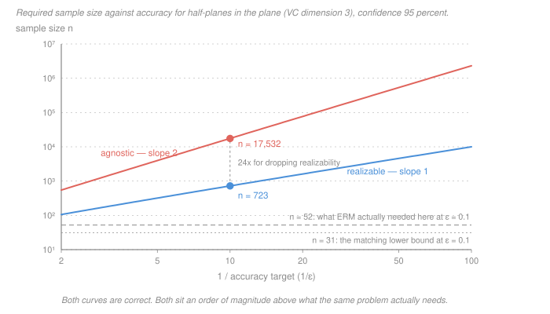

# Statistical Learning Theory · Lesson 3.4: VC bounds and sample complexity

> ⏱ ~15 min · Module 3: Statistical learning theory · Builds on: [3.2 (finite classes)](03-02-finite-classes-and-uniform-convergence.md), [3.3 (shattering and VC dimension)](03-03-shattering-and-the-vc-dimension.md) · Unlocks: [3.5 (Rademacher complexity)](03-05-rademacher-complexity.md)

## Why this matters

[Lesson 3.3](03-03-shattering-and-the-vc-dimension.md) handed you a number. Half-planes in the plane: 3. Affine separators in $\mathbb R^d$: $d+1$. A number is not a guarantee, and the number by itself is worth nothing — it is a combinatorial fact about a class of sets, with no probability anywhere in it.

This lesson turns it into a guarantee, and the result is the summit of the course:

> **A binary hypothesis class is PAC learnable if and only if its [VC dimension](../reference.md#vc-dimension) is finite — and when it is, plain ERM is a learner that achieves it.**

That is a biconditional. Not "finite VC dimension helps." One combinatorial quantity, computable by hand for the classes you care about, decides learnability outright, and once it is finite you do not need a clever algorithm — the obvious one works.

Then the second half of the lesson, which matters just as much: **the bounds this theorem gives you are enormously loose**, by one to two orders of magnitude on problems anyone would call easy. Being precise about *which* kind of looseness that is — and which conclusions survive it — is the difference between using this theory and misusing it.

## The idea

[Lesson 3.2](03-02-finite-classes-and-uniform-convergence.md)'s proof had exactly one weak joint. Hoeffding controls one fixed hypothesis; the union bound turns that into a statement about all of them at once; and the price is $\ln|\mathcal H|$. For an infinite class that price is infinite and the bound says nothing.

But look at what you are actually paying for. You are paying for the risk of *some* hypothesis in $\mathcal H$ looking accidentally good on your sample. Two hypotheses that agree on every one of your $n$ points cannot look differently good — as far as your data is concerned they are the *same hypothesis*. So the union bound should not run over $\mathcal H$; it should run over the distinguishable behaviours of $\mathcal H$ on $n$ points, and there are at most $\Pi_{\mathcal H}(n)$ of those — the [growth function](../reference.md#growth-function) from 3.3.

That is the whole idea, and Sauer–Shelah is what makes it pay. Above the VC dimension $d$ the growth function stops being exponential and turns polynomial, $\Pi_{\mathcal H}(n) \le (n+1)^d$, so the price becomes

$$\ln \Pi_{\mathcal H}(n) \ \le\ d\ln(n+1) \qquad\text{in place of}\qquad \ln|\mathcal H|.$$

A logarithm of a polynomial grows like $d \ln n$, and $d\ln n$ loses to Hoeffding's $e^{-2n\epsilon^2}$ for every fixed $\epsilon$ once $n$ is large enough. **An infinite class is affordable because on $n$ points it can only behave in polynomially many ways.**

One wrinkle stands in the way, and its fix is the one genuinely clever move in the proof. The quantity you want to control, $R(h)$, is a population average over the whole distribution — it does not live on your $n$ points at all, so "behaviours on $n$ points" does not obviously bound it. **Symmetrization** removes the difficulty by never mentioning the population: imagine drawing a second, *ghost* sample $S'$ of the same size, and compare $\hat R_S$ with $\hat R_{S'}$ instead of with $R$. If the class can make the two samples disagree, it can overfit; if it cannot, it cannot. Now everything happens on $2n$ concrete points, and the counting argument applies.

## The formal version

Throughout, $\mathcal H$ is a class of functions $\mathcal X \to \{0,1\}$, the loss is 0-1, $d = \mathrm{VCdim}(\mathcal H)$, and $\hat h$ is any ERM output.

**Theorem (the fundamental theorem of PAC learning).** For binary classification with 0-1 loss, the following are equivalent:

1. $\mathcal H$ has the [uniform convergence](../reference.md#uniform-convergence) property;
2. ERM is a successful agnostic PAC learner for $\mathcal H$;
3. $\mathcal H$ is agnostically PAC learnable;
4. $\mathcal H$ is [PAC learnable](../reference.md#pac-learnability) (realizable case);
5. $d < \infty$.

*In words: for binary classification there is only one obstacle to learning, and it is capacity. Rule out infinite VC dimension and everything else on the list comes free, including the fact that you may use the dumbest possible algorithm.*

Quantitatively, the sample complexity is pinned from both sides:

$$n_{\mathcal H}(\epsilon,\delta) \ =\ \Theta\!\left(\frac{d + \ln(1/\delta)}{\epsilon}\right) \ \ \text{(realizable)}, \qquad n_{\mathcal H}(\epsilon,\delta) \ =\ \Theta\!\left(\frac{d + \ln(1/\delta)}{\epsilon^2}\right) \ \ \text{(agnostic)}.$$

The $\Theta$ matters: these are matched by lower bounds, so no cleverer learner and no sharper analysis can do better than a constant factor in the *shape*.

**The two bounds you actually instantiate.** With probability at least $1-\delta$ over the draw of $S$:

$$\text{realizable: } \ n \ \ge\ \frac{4}{\epsilon}\Bigl(d\ln\frac{12}{\epsilon} + \ln\frac{2}{\delta}\Bigr), \qquad \text{agnostic: } \ n \ \ge\ \frac{8}{\epsilon^2}\Bigl(d\ln\frac{16e}{\epsilon} + \ln\frac{2}{\delta}\Bigr).$$

*In words: to be within $\epsilon$ of the best you could have done, with confidence $1-\delta$, this many points suffice.* "Realizable" assumes some $h \in \mathcal H$ has zero risk and asks for $R(\hat h) \le \epsilon$; "agnostic" assumes nothing and asks only for $R(\hat h) \le \min_{h}R(h) + \epsilon$ ([3.1](03-01-the-pac-framework.md)).

The same content, rearranged into a bound you can read off a fitted model:

$$R(h) \ \le\ \hat R_S(h) \ +\ \sqrt{\frac{8\bigl(d\ln\frac{2en}{d} + \ln\frac{4}{\delta}\bigr)}{n}} \qquad \text{for all } h \in \mathcal H \text{ simultaneously.}$$

*In words: training error plus a penalty that grows with capacity and shrinks like $1/\sqrt n$.* This is 3.2's bound with $d\ln(2en/d)$ where $\ln|\mathcal H|$ used to be — the two are the same statement wearing different capacity measures.

**Proof sketch — and it is a sketch, deliberately.** Four steps; the constants above come from tightening each one, and they are not sacred.

1. **Symmetrization.** For $n \ge 2/\epsilon^2$, the probability that some $h$ has $|R(h) - \hat R_S(h)| > \epsilon$ is at most twice the probability that some $h$ has $|\hat R_{S'}(h) - \hat R_S(h)| > \epsilon/2$, where $S'$ is a paired ghost sample. The population risk is gone; only $2n$ points remain.
2. **Finite footprint.** Conditioned on those $2n$ points, $\mathcal H$ has at most $\Pi_{\mathcal H}(2n)$ distinguishable behaviours. This is the step the union bound will run over.
3. **Random swap.** Given the $2n$ points as a set, which $n$ landed in $S$ is uniformly random. For one *fixed* behaviour, Hoeffding over that randomness gives failure probability $2e^{-n\epsilon^2/8}$.
4. **Union bound, then Sauer.** Multiply by $\Pi_{\mathcal H}(2n) \le (2n)^d + 1$, set the total to $\delta$, and solve for $n$. The polynomial loses to the exponential; that is the whole fight.

**The necessity direction** is the one people forget, and it is [1.4](01-04-no-free-lunch-and-inductive-bias.md) doing the work. If $d = \infty$ then for *every* $n$ there is a set of $2n$ points that $\mathcal H$ shatters — and on a shattered set, no-free-lunch applies verbatim: some distribution supported there makes any learner's expected error at least $1/4$ while some $h \in \mathcal H$ has zero risk. Markov's inequality then puts the error above $1/8$ with probability at least $\frac{1/4 - 1/8}{1 - 1/8} = \frac17$. No sample size helps, because the adversary picks the shattered set after seeing $n$. Infinite VC dimension does not mean "hard"; it means **not learnable**, at any $n$.

## Picture

On log-log axes a power law is a straight line and the exponent is the slope, so the picture is the theorem: the realizable bound has slope 1 in $1/\epsilon$, the agnostic bound slope 2. Dropping realizability tilts the line, and a tilt beats any constant eventually. The two flat lines near the bottom are what the same problem actually needs — hold that thought for one more section.

## Worked examples

### 1. Instantiating both bounds

Half-planes in $\mathbb R^2$ have $d = 3$ ([3.3](03-03-shattering-and-the-vc-dimension.md)). Take $\epsilon = 0.1$ and $\delta = 0.05$: I want 90 percent accuracy with 95 percent confidence.

Realizable, term by term: $\ln(12/0.1) = \ln 120 = 4.787$, and $\ln(2/0.05) = \ln 40 = 3.689$, so

$$n \ \ge\ \frac{4}{0.1}\bigl(3 \times 4.787 + 3.689\bigr) \ =\ 40 \times 18.05 \ =\ 722.1 \ \Rightarrow\ n \ge 723.$$

Agnostic: $\ln(16e/0.1) = 6.075$, so

$$n \ \ge\ 800\,(3 \times 6.075 + 3.689) \ =\ 17{,}531.5 \ \Rightarrow\ n \ge 17{,}532.$$

**Twenty-four times the data for the same accuracy, bought by nothing more than refusing to assume a perfect hypothesis exists.**

Two things worth noticing in the arithmetic. First, $\delta$ is nearly free: tightening confidence from 95 to 99.9 percent moves the realizable bound only from 723 to 879, because $\delta$ enters through $\ln(2/\delta)$. Second, $\epsilon$ is not: halving it to $0.05$ takes the realizable bound to 1,611 (a bit more than doubling, because of the $\ln(12/\epsilon)$) and the agnostic bound to 76,781 (a bit more than quadrupling).

### 2. The honest reckoning

Now put those numbers next to reality. Same class, same $\epsilon$, same $\delta$; the target is a fixed half-plane and the data are uniform on the unit square, which is about as benign as life gets.

| what it is | $n$ |
|---|---|
| realizable **lower** bound, $\frac{d-1}{32\epsilon} + \frac1\epsilon\ln\frac1\delta$ | 31 |
| direct simulation: smallest $n$ at which every consistent half-plane has risk below $0.1$ in 95 percent of draws | 52 |
| realizable VC **upper** bound | 723 |
| agnostic VC upper bound | 17,532 |

The truth for this problem is 52. The theorem promises 723. The bound is correct — 723 points certainly suffice — and it is off by a factor of 14. The provable lower bound is 31, so a factor of 23 sits between what is provable and what is proved.

It gets worse in the read-off form. At $d = 3$, the confidence band $\sqrt{8(d\ln\frac{2en}{d} + \ln\frac4\delta)/n}$ takes the values

| $n$ | $10^2$ | $10^3$ | $10^4$ | $10^5$ | $10^6$ |
|---|---|---|---|---|---|
| band | 1.264 | 0.464 | 0.164 | 0.057 | 0.020 |

At a thousand points, this theorem's honest statement about a *line in the plane* is "your true error is within 0.46 of your training error" — true, and useless. You need roughly $10^5$ points before the band is worth quoting.

**So where does the slack come from, and what survives it?** Four places, and they are not the same kind of thing:

- **Symmetrization** throws away a factor of 2 and half the accuracy budget.
- **The union bound over $\Pi_{\mathcal H}(2n)$ behaviours** assumes those behaviours fail independently. They are massively correlated — nearby half-planes err on nearly the same points — which is exactly [3.2's P3](03-02-finite-classes-and-uniform-convergence.md) complaint, now with a face.
- **Sauer's bound** is itself worst-case over point configurations.
- **The whole statement is distribution-free.** It must hold for the least favourable $\mathcal D$, and yours is not it.

The first three are slack *in the proof*, and a sharper proof would shave them. The fourth is slack **in the question you asked** — no proof can remove it, because the guarantee was demanded for every distribution ([3.1](03-01-the-pac-framework.md)). That is the one [3.5](03-05-rademacher-complexity.md) attacks, by measuring capacity on your actual sample instead of the worst imaginable one.

And here is what survives all of it. The bound is not a sample-size calculator; it is three other things, and each is immune to a constant factor:

1. an **existence proof** — finite VC dimension implies learnable, full stop;
2. a **ranking** — a class with $d = 3$ is cheaper than one with $d = 300$, and the ratio is roughly right even when the levels are not;
3. a **shape** — $n$ grows linearly in $d$, logarithmically in $1/\delta$, and quadratically in $1/\epsilon$ once you drop realizability.

Constants and logs cannot change any of those. What they do change is the sentence "my class has VC dimension 3, therefore I need 723 points," which is not a conclusion this theory supports. For an actual sample size, hold out data and measure ([1.3](01-03-overfitting-and-train-validation-test.md)).

## Watch out

- **You might think infinite VC dimension means "hard to learn" — actually it means not learnable at all.** The theorem is an equivalence, so the failure is total: for every $n$ there is a distribution defeating your learner. That is a much stronger and much stranger statement than "you need a lot of data," and it is why the necessity direction is worth carrying around.
- **You might think the agnostic $1/\epsilon^2$ is an artifact of a loose proof — actually it is the central limit theorem.** Estimating a risk to within $\pm\epsilon$ from $n$ samples needs $n \sim 1/\epsilon^2$ no matter how you do it ([`prob-stat-refresher` 03-03](../../prob-stat-refresher/lessons/03-03-central-limit-theorem.md)). The realizable $1/\epsilon$ is the anomaly, not the norm: there the ERM's training error is exactly zero, so you never estimate a risk — you only ask whether a bad hypothesis could have survived $n$ points, which is a multiplicative $(1-\epsilon)^n \le e^{-n\epsilon}$ question.
- **You might think a loose bound is a broken bound — actually looseness and vacuity are different failures.** A factor-of-14 bound still ranks classes correctly and still proves learnability. A bound of the form "$R \le \hat R + 2.35$" for a 0-1 loss proves nothing at all, because $R \le 1$ was free. Check which one you have before deciding whether the theory has told you anything.

## One-liner

> Finite VC dimension is exactly what makes learning possible, and the bound that proves it is a proof of possibility, not a budget.

## Problems

**P1 (🟢)** Affine separators in $\mathbb R^5$ (linear boundary with an intercept) have $d_{\mathrm{VC}} = 6$. Evaluate both sample-complexity bounds at $\epsilon = 0.05$, $\delta = 0.01$, and give the ratio. State in one sentence what assumption the smaller number is buying with.

**P2 (🟡)** Using the agnostic bound with the $d = 6$, $\epsilon = 0.05$, $\delta = 0.01$ instance of P1 as your baseline: (a) explain from the formula why $n$ is *sub*-linear in $d$ and *super*-quadratic in $1/\epsilon$ despite the headline "linear in $d$, quadratic in $1/\epsilon$"; (b) compute the cost of doubling $d_{\mathrm{VC}}$ to 12 and the cost of halving $\epsilon$ to 0.025, and say which is the more expensive ambition.

**P3 (🔴)** A network with $d_{\mathrm{VC}} = 10^6$ is trained on $n = 10^4$ examples and generalizes well ([`machine-learning` 4.4](../../machine-learning/lessons/04-04-a-taste-of-neural-networks.md) fits models of exactly this shape). (a) State what the agnostic VC bound requires at $\epsilon = 0.1$, $\delta = 0.05$, and evaluate the confidence band at $n = 10^4$ when $d \ge n$. (b) The bound is a correct theorem and the model demonstrably works, so no contradiction exists — name **three structurally distinct** escape routes, and say for each one which quantity in this lesson's argument it replaces or removes.

Solutions

**P1** Realizable, with $\ln(12/0.05) = \ln 240 = 5.481$ and $\ln(2/0.01) = \ln 200 = 5.298$:

$$n \ \ge\ \frac{4}{0.05}\bigl(6 \times 5.481 + 5.298\bigr) \ =\ 80 \times 38.18 \ =\ 3054.6 \ \Rightarrow\ n \ge 3055.$$

Agnostic, with $\ln(16e/0.05) = 6.768$:

$$n \ \ge\ \frac{8}{0.05^2}\bigl(6 \times 6.768 + 5.298\bigr) \ =\ 3200 \times 45.91 \ =\ 146{,}906.4 \ \Rightarrow\ n \ge 146{,}907.$$

The ratio is $48.1$. The smaller number buys with **realizability** — the assumption that some separator in the class has exactly zero risk. It is an assumption about the world, not about the algorithm, and it is usually false: any label noise at all kills it.

**P2** (a) The agnostic bound has two moving parts: the prefactor $8/\epsilon^2$, and the bracket $d\ln\frac{16e}{\epsilon} + \ln\frac2\delta$. Doubling $d$ doubles only the first term inside the bracket, leaving $\ln(2/\delta)$ untouched, so the total less than doubles — the confidence term is a fixed overhead that dilutes the scaling in $d$. Halving $\epsilon$ multiplies the $8/\epsilon^2$ prefactor by 4 *and* increases $\ln(16e/\epsilon)$ by $\ln 2$, so the total more than quadruples. "Linear in $d$, quadratic in $1/\epsilon$" is the asymptotic shape with the other parameters held fixed; at finite values the additive $\ln(2/\delta)$ pulls one below its exponent and the logarithm pushes the other above it.

(b) Baseline $146{,}907$.

- $d = 12$: $n \ge 3200(12 \times 6.768 + 5.298) = 276{,}859$ — a factor of $1.88$, just under the doubling you would have guessed.
- $\epsilon = 0.025$: $n \ge \frac{8}{0.000625}(6 \times 7.461 + 5.298) = 640{,}860$ — a factor of $4.36$, just over quadrupling.

**Halving $\epsilon$ is the more expensive ambition**, by more than a factor of two relative to doubling the capacity. Accuracy is the costly axis in the agnostic regime; capacity and confidence are both comparatively cheap. (In the realizable regime the two are nearly matched: $1.86$ against $2.22$.)

**P3** (a) The requirement is
$$n \ \ge\ \frac{8}{0.01}\bigl(10^6 \times 6.075 + 3.689\bigr) \ \approx\ 4.86 \times 10^9,$$
about 4.9 billion examples — five and a half orders of magnitude more than you have. Worse, when $d \ge n$ the class shatters the sample, so $\Pi_{\mathcal H}(n) = 2^n$ and the confidence band degenerates to
$$\sqrt{\frac{8(n\ln 2 + \ln(4/\delta))}{n}} \ \approx\ \sqrt{8\ln 2} \ =\ 2.355.$$
Since 0-1 risk never exceeds 1, the bound is **vacuous**, not merely loose: it is strictly weaker than the free statement $R \le 1$.

(b) Three distinct escapes, each removing a different ingredient:

1. **Replace the capacity measure with a data-dependent one.** The VC term is a worst case over all distributions; the empirical [Rademacher complexity](03-05-rademacher-complexity.md) is computed on *your* sample and can be far smaller. This removes the distribution-free slack — the fourth item in the honest reckoning, and the only one no sharper proof could have removed.
2. **Replace the class.** The guarantee applies to the class you actually search, not the architecture's full expressive range. Constraining norms or margins gives a capacity governed by $R^2/\gamma^2$ rather than by dimension ([4.3](04-03-maximum-margin-classifiers.md)), and the optimizer itself restricts the reachable set — gradient descent from a small initialization is implicitly a shrinkage ([2.6](02-06-gradient-descent-the-workhorse.md)). The effective $\mathcal H$ is much smaller than $d_{\mathrm{VC}} = 10^6$ suggests.
3. **Stop asking for uniform convergence.** Every bound here holds *simultaneously for all $h \in \mathcal H$*, which is far more than you need: you only ever deploy the one hypothesis the algorithm returned. Algorithm-dependent analyses — stability, PAC-Bayes, compression — bound that single output, and the fundamental theorem's equivalence does not apply to them, because for general (non-binary, non-ERM) settings uniform convergence stops being necessary.

The honest position is that (1) and (3) are partial and (2) is not yet quantitative for real networks — which is why [5.5](05-05-why-does-deep-learning-generalize.md) is a lesson and not a footnote.

## Flashback

**From Lesson 3.2 (Finite classes and uniform convergence):** $\mathcal H$ is the class of *monotone conjunctions* over 20 Boolean features — each hypothesis picks a subset $I \subseteq \{1,\dots,20\}$ and predicts $\bigwedge_{i \in I} x_i$. (a) Give $|\mathcal H|$ and the sample size the finite-class bound requires for uniform convergence at $\epsilon = 0.05$, $\delta = 0.01$. (b) This class also has $\mathrm{VCdim} = 20$. Compare the two capacity terms — $\ln|\mathcal H|$ against $d\ln\frac{16e}{\epsilon}$ — and say what the finite-class and VC bounds have in common structurally.

Solution

(a) One free binary choice per feature, so $|\mathcal H| = 2^{20} = 1{,}048{,}576$. The finite-class bound gives

$$n \ \ge\ \frac{1}{2\epsilon^2}\ln\frac{2|\mathcal H|}{\delta} \ =\ \frac{1}{2(0.05)^2}\ln\frac{2^{21}}{0.01} \ =\ 200 \times 19.161 \ =\ 3832.3 \ \Rightarrow\ n \ge 3833.$$

A class of a million hypotheses costs under four thousand points, because you pay in *bits*: $\ln|\mathcal H| = 20\ln 2 = 13.86$.

(b) $\ln|\mathcal H| = 13.86$ against $d\ln\frac{16e}{\epsilon} = 20 \times 6.768 = 135.4$ — the VC capacity term is **9.8 times larger** here. The VC route pays $\ln(16e/\epsilon)$ per unit of dimension where the counting route pays $\ln 2$, so when a class is genuinely finite and small, 3.2's bound is the sharper tool. (The two bounds also carry different constants and different conventions about whether $\epsilon$ measures uniform convergence or excess risk, so compare the capacity terms, not the final $n$'s.)

Structurally they are the same theorem:

$$n \ \gtrsim\ \frac{\text{capacity} + \ln(1/\delta)}{\epsilon^2},$$

with $\ln|\mathcal H| \to d\ln\frac{16e}{\epsilon}$ the only substitution. Both are distribution-free; both charge for confidence only logarithmically; both come from Hoeffding plus a union bound, the second one counting *behaviours on the sample* instead of hypotheses. And the substitution never over-counts: $d \le \log_2|\mathcal H|$ always, since shattering $d$ points requires $2^d$ distinct hypotheses. Here it is tight — the 20 vectors with a single zero coordinate are shattered.

## Connections

- **Backward:** this is [3.2](03-02-finite-classes-and-uniform-convergence.md)'s proof with $\ln|\mathcal H|$ replaced by $\ln\Pi_{\mathcal H}(2n)$ and Sauer–Shelah ([3.3](03-03-shattering-and-the-vc-dimension.md)) doing the collapse; the necessity half of the theorem is [1.4](01-04-no-free-lunch-and-inductive-bias.md)'s no-free-lunch argument applied to a shattered set, and the reason the bound must be stated over *all* $h$ at once is [1.1](01-01-what-is-learning-loss-risk-and-erm.md)'s observation that $\hat h$ is chosen after seeing $S$.
- **Forward:** [3.5](03-05-rademacher-complexity.md) attacks the distribution-free slack directly; [4.1](04-01-feature-maps-and-the-kernel-trick.md) makes the capacity worse on purpose by lifting to a high-dimensional feature space, and [4.3](04-03-maximum-margin-classifiers.md) rescues it by measuring capacity with the margin instead of the dimension; [5.5](05-05-why-does-deep-learning-generalize.md) is P3 taken seriously. Module 3's [boss problem](../syllabus.md) puts three different bounds on a single class side by side and asks what the spread means — this lesson gives you two of the three, and the honest reckoning above is the answer it is fishing for.
- **Sideways:** the "capacity plus confidence over accuracy squared" shape is the same trade-off econometrics makes when it charges you degrees of freedom for every regressor ([2.1](02-01-linear-regression-as-learning.md)'s optimism $2p\sigma^2/n$ is the parametric version of the same accounting), and the $1/\epsilon^2$ is the same central-limit rate that sets sample sizes in survey design and A/B testing — [1.3](01-03-overfitting-and-train-validation-test.md)'s validation standard error is that rate with the supremum over $\mathcal H$ removed, which is precisely why it is so much smaller.
