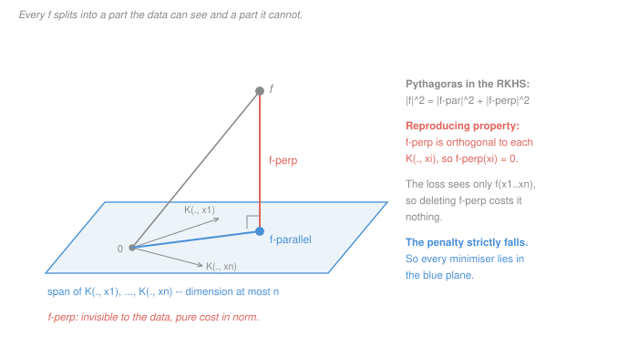

# Statistical Learning Theory · Lesson 4.2: RKHS and the representer theorem (a taste)

> ⏱ ~15 min · Module 4: Kernels and margins · Builds on: [4.1 (feature maps and the kernel trick)](04-01-feature-maps-and-the-kernel-trick.md), [2.3 (ridge and shrinkage)](02-03-ridge-regression-and-shrinkage.md) · Unlocks: [4.3](04-03-maximum-margin-classifiers.md), [4.4](04-04-support-vector-machines.md), and the licence for everything [`machine-learning` 2.4](../../machine-learning/lessons/02-04-the-kernel-trick.md) does computationally

## Why this matters

[4.1](04-01-feature-maps-and-the-kernel-trick.md) sold you a computational trick: never build the feature map $\phi$, just evaluate $K(x,z) = \langle \phi(x), \phi(z)\rangle$. The trick leaves an unpaid debt. For the RBF kernel the feature space is infinite-dimensional, so "minimize the penalized loss over all weight vectors in feature space" is a search over infinitely many directions. Nothing so far says that minimum exists, and nothing says a finite computer could write it down if it did.

The **representer theorem** settles the debt in one stroke: whatever the loss, every minimizer of a norm-penalized fit lies in the $n$-dimensional subspace spanned by your training points. An infinite-dimensional search collapses to $n$ numbers, one per example. The proof is Pythagoras and takes three lines.

It is also the most over-read theorem in kernel methods. It is a statement about the **form** of the answer, not about its quality — and boss problem 4(c) asks you exactly that. Getting clear on both halves is this lesson's whole job.

## The idea

**Move 1: make evaluation an inner product.** In a typical function space you cannot evaluate a function at a point at all. In $L^2$, elements are equivalence classes of functions that agree almost everywhere: change $f$ at the single point $x = 3$ and you get *the same element*, so "$f(3)$" is not even well defined. Worse, you can have $f_m \to f$ in norm while $f_m(3) \to 17$. Norm convergence tells you nothing pointwise.

A reproducing kernel Hilbert space is the well-behaved corner where that pathology is banned by construction. In an RKHS, "evaluate at $x$" is a continuous linear functional, so — by the Riesz representation theorem — there is a *specific function in the space* that performs the evaluation for you by inner product. Call it $K(\cdot,x)$. Then

$$f(x) = \langle f,\, K(\cdot,x)\rangle_K .$$

That single identity is the entire lesson. It says the point $x$ has a **measuring stick** living in the space, and reading off $f(x)$ means projecting $f$ onto that stick.

**Move 2: notice what the data can see.** Your loss only ever looks at $n$ numbers — the fitted values $f(x_1),\dots,f(x_n)$ — and by Move 1 each of those is an inner product with one of $n$ measuring sticks. So anything in $f$ that is orthogonal to all $n$ sticks is **invisible to the data**. It is not free, though: it still adds to $\lVert f\rVert_K$. Invisible to the fit, expensive in penalty — so a penalized optimum throws it away.

If that argument sounds familiar, it is [2.1](02-01-linear-regression-as-learning.md)'s: least squares works because the residual is orthogonal to the column space, and whatever lives outside that space cannot change the fit. The representer theorem is the same picture moved into a space of functions.

## The formal version

**Kernels.** A symmetric $K : \mathcal X\times\mathcal X\to\mathbb R$ is a [positive-definite kernel](../reference.md#positive-definite-kernel) if every [Gram matrix](../reference.md#gram-matrix) $\mathbf K_{ij} = K(x_i,x_j)$ it produces on a finite sample is positive semidefinite ([4.1](04-01-feature-maps-and-the-kernel-trick.md)).

**Definition ([RKHS](../reference.md#reproducing-kernel-hilbert-space)).** A Hilbert space $\mathcal H_K$ of real-valued functions on $\mathcal X$, with inner product $\langle\cdot,\cdot\rangle_K$, is the RKHS of $K$ when

1. $K(\cdot,x) \in \mathcal H_K$ for every $x \in \mathcal X$, and
2. (**reproducing property**) $f(x) = \langle f, K(\cdot,x)\rangle_K$ for every $f\in\mathcal H_K$ and every $x$.

*In words:* the kernel supplies, for each input point, a function whose job is to evaluate other functions there.

**Two immediate consequences.** Put $f = K(\cdot,x')$ into property 2:

$$\langle K(\cdot,x'),\, K(\cdot,x)\rangle_K = K(x',x).$$

So $K$ is literally the Gram of the feature map $\Phi(x) = K(\cdot,x)$ — the kernel of 4.1 and the space $\mathcal H_K$ are one object seen from two sides. And **Moore–Aronszajn** (stated, not proved — this is the taste): every positive-definite kernel has exactly one RKHS, built by taking finite sums $\sum_i c_i K(\cdot,x_i)$ and completing them. Positive definiteness is exactly what makes

$$\Bigl\lVert \sum_i c_i K(\cdot,x_i)\Bigr\rVert_K^2 = \sum_{i,j} c_i c_j K(x_i,x_j) \ge 0,$$

i.e. what makes the candidate inner product an inner product at all.

**The norm is a smoothness meter.** For any $f\in\mathcal H_K$, Cauchy–Schwarz on the difference of two measuring sticks gives

$$|f(x) - f(x')| \le \lVert f\rVert_K \sqrt{K(x,x) - 2K(x,x') + K(x',x')}.$$

*In words:* a small RKHS norm forbids fast wiggles — between points the kernel calls similar, $f$ cannot move much. For the Gaussian kernel $K(x,x') = e^{-(x-x')^2/2}$ and $\lVert f\rVert_K = 3$, two points at distance $0.5$ have $K = 0.8825$, so $|f(x)-f(x')| \le 3\sqrt{2(1-0.8825)} = 1.454$. *This* is why $\lambda\lVert f\rVert_K^2$ is a sensible penalty rather than an arbitrary one: it is a budget on roughness, exactly the role $\lambda\lVert\beta\rVert_2^2$ played in [2.3](02-03-ridge-regression-and-shrinkage.md).

**Theorem (representer).** Let $\mathcal H_K$ be the RKHS of $K$, let $S = \{(x_i,y_i)\}_{i=1}^n$, let $L:\mathbb R^{2n}\to\mathbb R\cup\{+\infty\}$ be **any** function of the labels and the fitted values, and let $\Omega:[0,\infty)\to\mathbb R$ be **strictly increasing**. Then any minimizer over $\mathcal H_K$ of

$$J(f) = L\bigl(y_1,\dots,y_n,\, f(x_1),\dots,f(x_n)\bigr) + \Omega\bigl(\lVert f\rVert_K\bigr)$$

has the form $f = \sum_{i=1}^n \alpha_i K(\cdot,x_i)$ for some $\alpha \in \mathbb R^n$.

*In words:* the answer is a weighted blend of one bump per training point, and the only unknowns are the $n$ weights.

*Proof.* Let $V = \operatorname{span}\{K(\cdot,x_1),\dots,K(\cdot,x_n)\}$, a finite-dimensional and therefore closed subspace, and split any $f\in\mathcal H_K$ as $f = f_\parallel + f_\perp$ with $f_\parallel \in V$ and $f_\perp \perp V$.

1. **The loss cannot see $f_\perp$.** By the reproducing property and $K(\cdot,x_i)\in V$,
   $$f(x_i) = \langle f_\parallel + f_\perp,\, K(\cdot,x_i)\rangle_K = f_\parallel(x_i) + 0 .$$
   All $n$ fitted values, hence $L$, are unchanged by deleting $f_\perp$.
2. **The penalty can.** Pythagoras gives $\lVert f\rVert_K^2 = \lVert f_\parallel\rVert_K^2 + \lVert f_\perp\rVert_K^2 \ge \lVert f_\parallel\rVert_K^2$, with equality only when $f_\perp = 0$. Since $\Omega$ is strictly increasing, $\Omega(\lVert f_\parallel\rVert_K) < \Omega(\lVert f\rVert_K)$ whenever $f_\perp \ne 0$.
3. Therefore $J(f_\parallel) \le J(f)$, strictly unless $f_\perp = 0$. A minimizer cannot admit a strict improvement, so it has $f_\perp = 0$, i.e. it lies in $V$. $\blacksquare$

**What the proof actually used.** Not convexity, not differentiability, not that the loss decomposes over examples — $L$ may be the 0-1 loss, a ranking loss, anything. The one hypothesis that carries weight is that **$L$ sees $f$ only through the values at the sample points**. Bolt on a term that reads $f$ somewhere else — at a test point, or through $f'(x_1)$ — and the span grows to include that point's stick too.

**The finite reduction.** Substitute $f = \sum_j \alpha_j K(\cdot,x_j)$ and everything becomes matrix arithmetic in $\alpha$:

$$f(x_i) = \sum_j \alpha_j K(x_i,x_j) = (\mathbf K\alpha)_i, \qquad \lVert f\rVert_K^2 = \alpha^\top \mathbf K \alpha .$$

For squared loss with $\Omega(t) = \lambda t^2$ this is $\lVert y - \mathbf K\alpha\rVert^2 + \lambda\,\alpha^\top\mathbf K\alpha$, whose stationary point is **kernel ridge regression**:

$$\alpha = (\mathbf K + \lambda I)^{-1} y .$$

One $n\times n$ solve, and you have optimized over an infinite-dimensional space of functions.

## Picture

The blue plane is $V$, everything the data can express: at most $n$ dimensions no matter how large the ambient space is. The grey vector $f$ is an arbitrary member of $\mathcal H_K$ — possibly living in an infinite-dimensional space, drawn here as one extra direction.

Read the theorem off the picture. Sliding $f$ down the coral segment to $f_\parallel$ changes no fitted value (step 1: the coral direction is orthogonal to every stick $K(\cdot,x_i)$, all of which lie in the plane), and shortens the vector (step 2: the right angle is what Pythagoras needs). Anything with a coral component is paying for altitude the data never sees.

## Worked examples

**Example 1 (mechanical): an RKHS you can hold in your hand.** Take the finite domain $\mathcal X = \{1,2,3\}$ and the kernel given by

$$\mathbf K = \begin{pmatrix} 2 & 1 & 0\\ 1 & 2 & 1\\ 0 & 1 & 2\end{pmatrix}, \qquad \text{eigenvalues } 0.586,\ 2,\ 3.414 > 0 .$$

A function on three points *is* a vector in $\mathbb R^3$, and the RKHS inner product is $\langle u,v\rangle_K = u^\top \mathbf K^{-1} v$, with

$$\mathbf K^{-1} = \tfrac14\begin{pmatrix} 3 & -2 & 1\\ -2 & 4 & -2\\ 1 & -2 & 3\end{pmatrix}.$$

The measuring stick for point 2 is the second column, $K(\cdot,2) = (1,2,1)^\top$. Check the reproducing property on $f = (3,1,2)^\top$: since $\mathbf K^{-1}(1,2,1)^\top = (0,1,0)^\top$,

$$\langle f, K(\cdot,2)\rangle_K = f^\top(0,1,0)^\top = 1 = f(2). \checkmark$$

Two more readings. First, $\lVert K(\cdot,2)\rVert_K^2 = K(2,2) = 2$ and $\langle K(\cdot,1),K(\cdot,3)\rangle_K = K(1,3) = 0$ — the sticks reproduce the kernel, and points 1 and 3 are *orthogonal* under this kernel, so nothing learned at 1 transfers to 3. Second, the norm really does measure roughness: the constant $(1,1,1)$ has $\lVert\cdot\rVert_K^2 = 1$, the smooth $(1,2,1)$ has $2$, and the alternating $(1,-1,1)$ has $5$. Same three points, five times the penalty for the wiggly one.

**Example 2 (why you'd care): infinite dimensions, a 3-by-3 solve.** Gaussian kernel $K(x,x') = e^{-(x-x')^2/2}$ — the feature space is infinite-dimensional, so the primal problem has infinitely many unknowns. Data $x = (-1,0,1)$, $y = (0,1,0)$. The Gram matrix uses $e^{-1/2} = 0.6065$ and $e^{-2} = 0.1353$:

$$\mathbf K = \begin{pmatrix} 1 & 0.6065 & 0.1353 \\ 0.6065 & 1 & 0.6065 \\ 0.1353 & 0.6065 & 1\end{pmatrix}.$$

At $\lambda = 0.1$, solving $(\mathbf K + 0.1 I)\alpha = y$ gives $\alpha = (-0.9734,\ 1.9825,\ -0.9734)$, fitted values $\mathbf K\alpha = (0.0973,\ 0.8017,\ 0.0973)$, and $\lVert f\rVert_K^2 = \alpha^\top\mathbf K\alpha = 1.400$. Off the sample, $\hat f(0.5) = 0.5745$ and $\hat f(2) = -0.3329$.

Two things to take from it. The fit does not interpolate — $0.8017$, not $1$ — because $\lambda$ buys smoothness with fit, exactly as in [2.3](02-03-ridge-regression-and-shrinkage.md). And raising $\lambda$ to $1$ shrinks the whole function toward zero: fitted values $(0.1716,\ 0.3959,\ 0.1716)$ and $\lVert f\rVert_K^2 = 0.180$, close to an eightfold drop in squared norm. The negative $\alpha$'s at the outer points are the kernel's way of building a peak: not "weight of neighbour $i$" but "coefficient on bump $i$", which is why reading $\alpha$ as importance is a mistake.

The headline: an optimization over an infinite-dimensional function space was answered by inverting a $3\times 3$ matrix, and the theorem is what licenses that.

## Watch out

- **You might think** the representer theorem justifies kernel methods, **but actually** it justifies only their *computability*. It says nothing about the risk $R(f)$ — it is equally true at $\lambda \to 0$, where you interpolate the noise and generalize terribly. The guarantee has to come from somewhere else entirely: margin and [Rademacher](../reference.md#rademacher-complexity) arguments ([3.5](03-05-rademacher-complexity.md), [4.3](04-03-maximum-margin-classifiers.md)).
- **You might think** it tells you which kernel to use, **but actually** it is proved *for a fixed $K$* and holds verbatim for every positive-definite kernel, good or absurd. Kernel choice is the inductive bias — the [1.4](01-04-no-free-lunch-and-inductive-bias.md) no-free-lunch problem in disguise — and it is settled empirically by model selection ([`machine-learning` 4.1](../../machine-learning/lessons/04-01-model-selection-and-cross-validation.md)), never by this theorem.
- **You might think** "finite-dimensional" means cheap, **but actually** the dimension is $n$, and the bill scales with your sample, not your features. The Gram matrix costs $O(n^2)$ memory — at $n = 10^5$ that is $10^{10}$ entries, 80 GB in double precision — and a direct solve is $O(n^3)$. Prediction needs $n$ kernel evaluations, because in general every $\alpha_i \ne 0$. The SVM's *sparse* $\alpha$ is a gift of the hinge loss, not of this theorem ([`machine-learning` 2.4](../../machine-learning/lessons/02-04-the-kernel-trick.md) has the cost table).

## One-liner

> In an RKHS, evaluating a function is taking an inner product — and that one fact means everything the data can see lives in the $n$-dimensional span of the training points, so a search over infinitely many functions is a search over $n$ numbers.

## Problems

**P1 (🟢)** Take $\mathcal X = \mathbb R^2$ with the linear kernel $K(x,z) = x^\top z$. Its RKHS is the set of linear functions $f_w(x) = w^\top x$, with $\langle f_w, f_v\rangle_K = w^\top v$ and $\lVert f_w\rVert_K = \lVert w\rVert_2$.

(a) Identify the function $K(\cdot,x)$ for $x = (2,5)$, and verify the reproducing property for $w = (3,-1)$ by computing both sides.
(b) Compute $\lVert f_w\rVert_K$.
(c) Write out what the representer theorem says here, and name the familiar fact about ridge and SVM weight vectors that it reduces to.

**P2 (🟡)** Reproduce the proof of the representer theorem in your own words, then answer two questions about it.

(a) Give the three steps, saying at each one which property of the RKHS you used.
(b) Point at the exact line where **strict** monotonicity of $\Omega$ is needed, and state precisely how the conclusion weakens if $\Omega$ is merely non-decreasing.

**P3 (🔴, optional)** Two extensions.

(a) Many kernel methods fit an unregularized offset: minimize over $f\in\mathcal H_K$ and $b\in\mathbb R$
$$J(f,b) = L\bigl(y_i,\, f(x_i) + b\bigr)_{i=1}^n + \Omega\bigl(\lVert f\rVert_K\bigr).$$
Show the theorem survives — any minimizer still has $f = \sum_i\alpha_i K(\cdot,x_i)$ — and say in one sentence why $b$ escaping the penalty does no damage.
(b) Show that with $\Omega \equiv 0$ the "every minimizer" claim genuinely fails. Use one training point $x_1 = 0$, the Gaussian kernel $K(x,x') = e^{-(x-x')^2/2}$, squared loss, and the function $g = K(\cdot,1) - e^{-1/2}K(\cdot,0)$. Then say what the failure means about an unpenalized kernel fit.

Solutions

**P1** (a) $K(\cdot,x)$ is the function $z \mapsto x^\top z$, i.e. $f_x$ with weight vector $x = (2,5)$. Left side: $f_w(x) = 3\cdot 2 + (-1)\cdot 5 = 1$. Right side: $\langle f_w, K(\cdot,x)\rangle_K = \langle f_w, f_x\rangle_K = w^\top x = 6 - 5 = 1$. Equal. ✓

(b) $\lVert f_w\rVert_K = \lVert(3,-1)\rVert_2 = \sqrt{10} \approx 3.162$.

(c) The theorem says the minimizer is $f = \sum_i\alpha_i K(\cdot,x_i)$, and since $K(\cdot,x_i) = f_{x_i}$ and the map $w\mapsto f_w$ is linear, that is the function $f_w$ with
$$w = \sum_{i=1}^n \alpha_i x_i .$$
The optimal weight vector is a linear combination of the training inputs. That is the familiar fact that ridge coefficients lie in the row space of the design matrix ([2.3](02-03-ridge-regression-and-shrinkage.md)) and that the SVM's $w$ is a combination of the training points ([4.4](04-04-support-vector-machines.md)) — visible here *before* anyone writes down a dual, because it is a property of the objective, not of the KKT conditions ([`machine-learning` 2.3](../../machine-learning/lessons/02-03-soft-margins-and-the-svm-dual.md)).

**P2** (a) Let $V = \operatorname{span}\{K(\cdot,x_i)\}_{i=1}^n$; it is finite-dimensional, hence closed, so every $f$ splits uniquely as $f = f_\parallel + f_\perp$ with $f_\parallel\in V$, $f_\perp\perp V$ (the projection theorem, [linalg-refresher 4.2](../../linalg-refresher/lessons/04-02-projection-least-squares.md)).

*Step 1 — the reproducing property.* $f(x_i) = \langle f, K(\cdot,x_i)\rangle_K$, and since $K(\cdot,x_i)\in V$ we have $\langle f_\perp, K(\cdot,x_i)\rangle_K = 0$, so $f(x_i) = f_\parallel(x_i)$ for every $i$. The loss term is identical for $f$ and $f_\parallel$.

*Step 2 — orthogonality, i.e. Pythagoras.* $\lVert f\rVert_K^2 = \lVert f_\parallel\rVert_K^2 + \lVert f_\perp\rVert_K^2$, so $\lVert f_\parallel\rVert_K \le \lVert f\rVert_K$ with equality iff $f_\perp = 0$.

*Step 3 — strict monotonicity.* $\Omega$ strictly increasing turns that into $\Omega(\lVert f_\parallel\rVert_K) < \Omega(\lVert f\rVert_K)$ when $f_\perp\ne 0$, so $J(f_\parallel) < J(f)$. A minimizer admits no strict improvement, so $f_\perp = 0$.

(b) Strictness is used only in step 3, converting the weak inequality $\lVert f_\parallel\rVert_K \le \lVert f\rVert_K$ of step 2 into a strict inequality on objectives. With $\Omega$ merely non-decreasing, step 3 gives only $J(f_\parallel) \le J(f)$. That is still enough to conclude that **some** minimizer lies in the span (project any minimizer; the projection is at least as good, hence also a minimizer), but not that **every** one does. The strong form — every minimizer has the finite expansion, so the finite problem loses nothing — needs strictness.

**P3** (a) Let $(f^\ast, b^\ast)$ minimize $J$. Then $f^\ast$ minimizes the single-variable problem $f \mapsto J(f, b^\ast)$. Define
$$\tilde L\bigl(y_1,\dots,y_n,\, v_1,\dots,v_n\bigr) = L\bigl(y_i,\, v_i + b^\ast\bigr)_{i=1}^n .$$
This is again a function of the labels and the $n$ fitted values only, so
$$J(f, b^\ast) = \tilde L\bigl(y_i,\, f(x_i)\bigr) + \Omega\bigl(\lVert f\rVert_K\bigr)$$
is exactly the objective in the theorem, with the same strictly increasing $\Omega$. Hence $f^\ast = \sum_i\alpha_i K(\cdot,x_i)$.

The reason $b$ does no damage: it is a constant, so it does not touch $\lVert f\rVert_K$, and it shifts every fitted value by the same amount — the orthogonal decomposition of $f$ and both steps of the proof are untouched by it. The same argument covers any finite set of unregularized extra functions added to $f$ (the semi-parametric version): the span they occupy is fixed and finite, so the $f$ part is still driven into the data's span.

(b) With $\Omega\equiv 0$ and squared loss, $J(f) = (y_1 - f(0))^2$. Set $f_\parallel = y_1 K(\cdot,0)$; since $K(0,0) = 1$, $f_\parallel(0) = y_1$ and $J(f_\parallel) = 0$, so $f_\parallel$ is a minimizer and lies in the span.

Now $g = K(\cdot,1) - e^{-1/2}K(\cdot,0)$ is Gram–Schmidt applied to $K(\cdot,1)$ against $K(\cdot,0)$, so
$$\langle g, K(\cdot,0)\rangle_K = K(1,0) - e^{-1/2}K(0,0) = 0,$$
i.e. $g \perp V$ and $g(0) = 0$. It is not the zero function:
$$\lVert g\rVert_K^2 = K(1,1) - K(0,1)^2 = 1 - e^{-1} = 0.6321,$$
and for instance $g(1) = 1 - e^{-1} = 0.632$ and $g(2) = 0.524$. Then $f_\parallel + g$ has the same fitted value $y_1$ at $x_1 = 0$, hence the same objective $0$, and it is a minimizer lying **outside** the span. So "every minimizer is in the span" is false without a strictly increasing penalty, while "some minimizer is in the span" survives — precisely the weakening of P2(b).

What it means: an unpenalized kernel fit is ill-posed. Infinitely many functions tie on the training data while differing wildly off it — here two of them agree at $x_1$ and differ by $0.52$ at $x = 2$ — and the data contains nothing that prefers one. The penalty is not a nuisance term; it is what picks a single answer, and it picks the flattest one. (The same non-uniqueness, in the overparameterized rather than kernel setting, is the puzzle of [5.5](05-05-why-does-deep-learning-generalize.md).)

## Flashback

**From Lesson 3.5 (Rademacher complexity):** two parts, the second one landing back on today's material.

(a) Let $S$ be four points and let $\mathcal F = \{f_1, f_2\}$ have value vectors $f_1 = (1,1,-1,-1)$ and $f_2 = (1,-1,-1,1)$ on them. Compute the empirical Rademacher complexity $\hat{\mathfrak R}_S(\mathcal F)$ exactly by enumerating all $2^4$ sign patterns, and compare it with Massart's bound $B\sqrt{2\ln|\mathcal F| / n}$ at $B = 1$.

(b) Now let $\mathcal F_B = \{f\in\mathcal H_K : \lVert f\rVert_K \le B\}$ be a ball in an RKHS. Using the reproducing property, prove
$$\hat{\mathfrak R}_S(\mathcal F_B) \le \frac{B}{n}\sqrt{\textstyle\sum_{i=1}^n K(x_i,x_i)},$$
and evaluate it for a Gaussian kernel with $B = 2$, $n = 100$. Say in one sentence why a smaller norm budget is a smaller class.

Solution

(a) Write $a(\sigma) = \sigma^\top f_1$ and $b(\sigma) = \sigma^\top f_2$; we need $\mathbb E_\sigma[\max(a,b)]/4$. The two vectors are orthogonal ($f_1^\top f_2 = 1 - 1 + 1 - 1 = 0$), so the pair $(a,b)$ takes these values over the 16 patterns:

| $(a,b)$ | count | $\max(a,b)/4$ |
|---|---|---|
| $(4,0)$, $(0,4)$ | 1 each | $1$ |
| $(2,2)$, $(2,-2)$, $(-2,2)$ | 2 each | $1/2$ |
| $(0,0)$ | 4 | $0$ |
| $(-4,0)$, $(0,-4)$ | 1 each | $0$ |
| $(-2,-2)$ | 2 | $-1/2$ |

Total count $2 + 6 + 6 + 2 = 16$. ✓ So

$$\hat{\mathfrak R}_S(\mathcal F) = \frac{2(1) + 6(1/2) + 6(0) + 2(-1/2)}{16} = \frac{4}{16} = \frac14 .$$

Massart's bound gives $\sqrt{2\ln 2/4} = 0.589$, more than twice the truth — correct but loose, as a worst-case bound over all classes of size 2 must be.

(b) Every $f$ in the ball satisfies, by the reproducing property and then Cauchy–Schwarz,

$$\frac1n\sum_i \sigma_i f(x_i) = \frac1n\Bigl\langle f, \sum_i \sigma_i K(\cdot,x_i)\Bigr\rangle_K \le \frac{B}{n}\Bigl\lVert \sum_i \sigma_i K(\cdot,x_i)\Bigr\rVert_K ,$$

and the supremum over the ball attains this. Taking $\mathbb E_\sigma$ and pushing it inside the square root (Jensen, since $\sqrt{\cdot}$ is concave):

$$\hat{\mathfrak R}_S(\mathcal F_B) \le \frac{B}{n}\sqrt{\mathbb E_\sigma\Bigl\lVert\sum_i\sigma_i K(\cdot,x_i)\Bigr\rVert_K^2} = \frac{B}{n}\sqrt{\sum_{i,j}\mathbb E[\sigma_i\sigma_j]K(x_i,x_j)} = \frac{B}{n}\sqrt{\sum_i K(x_i,x_i)},$$

because $\mathbb E[\sigma_i\sigma_j] = 0$ for $i\ne j$ and $1$ for $i = j$ — every cross term dies. The quantity under the root is the trace of the Gram matrix. For a Gaussian kernel $K(x,x) = 1$, so the trace is $n$ and the bound is $B/\sqrt n$: at $B = 2$, $n = 100$, it is $0.200$; at $n = 10^4$ it is $0.020$.

Why smaller norm means smaller class: the norm bounds how fast $f$ can move between kernel-similar points (the Cauchy–Schwarz inequality in *The formal version*), so a small-$B$ ball simply cannot chase an arbitrary sign pattern — it would have to swing between neighbouring points to do so. This is the capacity story the dimension count could not tell: the RBF feature space is infinite-dimensional, so every VC-style bound from [3.4](03-04-vc-bounds-and-sample-complexity.md) is vacuous, while $B/\sqrt n$ is perfectly finite. Norm, not dimension, is the right meter — which is the same lesson the margin teaches in [4.3](04-03-maximum-margin-classifiers.md).

## Connections

- **Backward:** this is [2.1](02-01-linear-regression-as-learning.md)'s orthogonality argument in a function space — residual orthogonal to the column space becomes $f_\perp$ orthogonal to the data's span — and the projection theorem it rests on is [linalg-refresher 4.1](../../linalg-refresher/lessons/04-01-inner-products-orthogonality.md) and [4.2](../../linalg-refresher/lessons/04-02-projection-least-squares.md). Kernel ridge is [2.3](02-03-ridge-regression-and-shrinkage.md) with $\lVert\beta\rVert_2$ replaced by $\lVert f\rVert_K$; read through [2.5](02-05-regularization-as-a-bayesian-prior.md), the RKHS norm is a prior that says "the world is smooth in the metric my kernel defines."
- **Forward:** the SVM of [4.4](04-04-support-vector-machines.md) is exactly this objective with $L$ the hinge loss and $\Omega(t) = \lambda t^2$, so its solution is a combination of training points before any dual is written; the *sparsity* of that combination is the hinge's doing. The norm-as-capacity thread continues in [4.3](04-03-maximum-margin-classifiers.md), and boss problem 4(c) asks you to state the theorem's computational payoff and its silence on kernel choice.
- **Sideways:** [`machine-learning` 2.4](../../machine-learning/lessons/02-04-the-kernel-trick.md) runs kernel methods computationally and cites this lesson for why the implied feature space is well defined and why the finite expansion is legitimate; the cost table lives there and is not repeated here. The same "evaluation is an inner product" object reappears in Gaussian-process regression, where $\mathbf K$ is a covariance function and $(\mathbf K+\lambda I)^{-1}y$ is a posterior mean.
