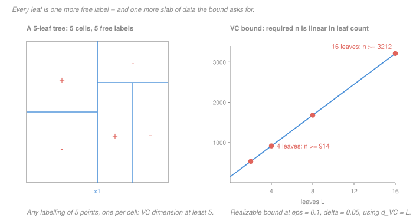

# Statistical Learning Theory · Lesson 5.1: Decision trees

> ⏱ ~15 min · Module 5: Nonlinear and modern models · Builds on: [1.1 (loss, risk, ERM)](01-01-what-is-learning-loss-risk-and-erm.md), [3.3 (VC dimension)](03-03-shattering-and-the-vc-dimension.md), [3.4 (VC bounds)](03-04-vc-bounds-and-sample-complexity.md) · Unlocks: 5.2 (bagging), 5.3 (boosting)

## Why this matters

A tree is the model people reach for when they want the model to *explain itself*. It is also the place where this course has to make its most uncomfortable admission.

Everything in Module 3 is a theorem about two objects: a hypothesis class $\mathcal H$, fixed before the data arrive, and the **empirical risk minimizer** over it. Trees break the second object. Finding the empirical risk minimizing tree is NP-hard, so the tree you actually fit is the output of a greedy heuristic that makes no claim to minimize anything globally. **The theory bounds a tree nobody computes.** Getting precise about what survives that gap — and what does not — is the whole lesson, and it is the most valuable thing this module has to say.

*Ceded to the sibling:* growing, the split search, the impurity arithmetic, and the pruning mechanics all belong to [`machine-learning` 2.5](../../machine-learning/lessons/02-05-decision-trees.md), which does them as full worked traces. One line each, for reference: at a node with class fractions $p_k$, [Gini impurity](../reference.md#gini-impurity) is $1 - \sum_k p_k^2$ and entropy is $-\sum_k p_k\log_2 p_k$ (the [`information-theory` 1.1](../../information-theory/lessons/01-01-entropy-uncertainty-surprise.md) quantity), and greedy growing picks the split maximizing the weighted drop in whichever one you chose. **No split search is run here.** We treat the tree as a hypothesis class and ask what it costs.

## The idea

Strip a tree of its algorithm and it is a very simple object: a partition of the input space into axis-aligned boxes, with one free label per box. That is the entire model.

So its capacity is easy to read off. **One leaf, one free label.** If your $L$ leaves can be arranged to isolate $L$ chosen points, then all $2^L$ labellings of those points are available to you — the class shatters them. Capacity grows one bit per leaf, essentially linearly.

Now run that observation to its conclusion. Grow a tree to purity and you get one leaf per training point: $L = n$, and a class whose [VC dimension](../reference.md#vc-dimension) is at least $n$ on a sample of size $n$. Module 3's bounds do not merely get loose there; they become *unsatisfiable* — no sample size makes them hold. "Trees overfit" is not folklore, it is the VC bound refusing to say anything at all.

The second half is the honest part. The theory's guarantee is attached to the ERM tree; greedy hands you a different tree. There is a name for the difference and it belongs in 1.1's ledger as a third term:

> **excess risk = approximation error + estimation error + optimization error.**

Approximation error is the class being too poor; estimation error is finite data; **optimization error is your algorithm failing to find the best member of a class that contained it all along.** For linear regression and ridge that term is zero — the problem is convex and the solver reaches the minimizer ([`convex-optimization` 4.1](../../convex-optimization/lessons/04-01-first-order-methods.md)). For a tree it is a real, unbounded quantity, and no amount of data shrinks it.

## The formal version

**The class.** Fix $d$ features and a leaf budget $L$. Let $\mathcal T_L$ be the set of binary classifiers realized by trees with at most $L$ leaves whose internal nodes test a single coordinate against a threshold, $\mathbf 1[x_j \le t]$, and whose leaves carry free labels in $\{-1,+1\}$.

**Proposition (lower bound).** $d_{\mathrm{VC}}(\mathcal T_L) \ge L$ for every $d \ge 1$.

*In words:* a tree with $L$ leaves can produce every one of the $2^L$ labellings of some $L$-point set, so it has at least $L$ bits of capacity.

*Proof.* Take $L$ points with distinct first coordinates $t_1 < \cdots < t_L$. Build a chain of $L-1$ internal nodes testing $x_1 \le \tfrac{t_i + t_{i+1}}{2}$; the resulting $L$ leaves each contain exactly one point. The leaf labels are free and independent, so all $2^L$ labellings are realized. $\blacksquare$

**Proposition (upper bound, by counting).** On any fixed $n$ points, the number of labellings $\mathcal T_L$ can produce is at most

$$C_{L-1}\cdot (dn)^{L-1}\cdot 2^{L} \;\le\; 8^{L}(dn)^{L-1},$$

where $C_{L-1}$ is the number of tree shapes with $L$ leaves (a Catalan number, at most $4^{L-1}$), $(dn)^{L-1}$ counts the feature-and-threshold choices at the $L-1$ internal nodes, and $2^L$ counts the leaf labels. Shattering demands $2^n$ labellings, so shattering is impossible once

$$n \;>\; 3L + (L-1)\log_2(dn).$$

*In words:* capacity is linear in the leaf count up to a logarithmic factor — the leaf count is the honest complexity parameter. At $L = 8$, $d = 10$ this gives $8 \le d_{\mathrm{VC}}(\mathcal T_8) \le 93$.

**The consequence.** Use [3.4](03-04-vc-bounds-and-sample-complexity.md)'s realizable [sample-complexity bound](../reference.md#vc-sample-complexity),

$$n \;\ge\; \frac{4}{\epsilon}\Bigl(d_{\mathrm{VC}}\ln\frac{12}{\epsilon} + \ln\frac{2}{\delta}\Bigr),$$

on a tree grown to purity, where $L = n$ and therefore $d_{\mathrm{VC}} \ge n$. The requirement becomes $n \ge \frac{4n}{\epsilon}\ln\frac{12}{\epsilon} + \frac4\epsilon\ln\frac2\delta$, which needs

$$\frac{4}{\epsilon}\ln\frac{12}{\epsilon} \;<\; 1 .$$

That quantity is decreasing in $\epsilon$ and equals $4\ln 12 \approx 9.94$ at $\epsilon = 1$. **No $\epsilon \in (0,1]$ and no $\delta$ satisfy it.** The bound is not weak here; it has no solution.

**Greedy is not ERM.** Constructing the empirical-risk-minimizing tree of a given size is NP-hard, so every tree you have ever fitted came from a heuristic. Write $\hat T$ for what the heuristic returns, $T_{\mathrm{ERM}}$ for the true minimizer over $\mathcal T_L$, and $T^\star$ for the best-in-class by *population* risk. Then

$$R(\hat T) - R(T^\star) = \underbrace{\bigl[R(\hat T) - \hat R(\hat T)\bigr]}_{\text{estimation}} + \underbrace{\bigl[\hat R(\hat T) - \hat R(T_{\mathrm{ERM}})\bigr]}_{\text{optimization} \;\ge\; 0} + \underbrace{\bigl[\hat R(T_{\mathrm{ERM}}) - R(T^\star)\bigr]}_{\le\; 0 \text{ in expectation}} .$$

For ERM the middle bracket is exactly zero — that is the *only* property of ERM the proofs in [3.2](03-02-finite-classes-and-uniform-convergence.md) and 3.4 ever use. For greedy it is non-negative and uncontrolled.

**What survives, precisely.** Uniform convergence is a statement about a supremum over the whole class:

$$\Pr\Bigl[\sup_{T\in\mathcal T_L}\bigl|R(T) - \hat R(T)\bigr| > \epsilon\Bigr] \le \delta .$$

Nothing in it mentions how $T$ was chosen. So the guarantee "**your tree's test error is close to its training error**" applies to the greedy tree exactly as it applies to the ERM tree. What does *not* survive is the excess-risk guarantee "**your tree is nearly as good as the best tree in the class**" — that step needs $\hat R(\hat T) \le \hat R(T_{\mathrm{ERM}})$, which greedy does not deliver. Uniform convergence yes; optimality no.

**Pruning is regularized ERM.** [Cost-complexity pruning](../reference.md#cost-complexity-pruning) minimizes

$$R_\alpha(T) = \hat R(T) + \alpha\lvert T\rvert ,$$

with $\lvert T\rvert$ the leaf count. This is 1.1's penalized objective with a capacity term, exactly as $\lambda\lVert\beta\rVert^2$ is in [2.3](02-03-ridge-regression-and-shrinkage.md) — and the two propositions above are what license it: $\lvert T\rvert$ is a legitimate proxy for capacity because $d_{\mathrm{VC}}$ really is linear in it, up to a log. Sweeping $\alpha$ walks a nested family $\mathcal T_1 \subset \mathcal T_2 \subset \cdots$ and pays for the level you stop at, which is structural risk minimization in miniature.

## Picture

The left panel is the whole hypothesis class in one image: cuts make cells, and each cell is a coin you get to set independently. Five cells, five bits, $d_{\mathrm{VC}} \ge 5$.

The right panel is the price. Feeding $d_{\mathrm{VC}} = L$ into the realizable bound at $\epsilon = 0.1$, $\delta = 0.05$ gives $n \ge 40\bigl(L\ln 120 + \ln 40\bigr)$ — about **191 extra training points per leaf**, plus a fixed 148. Two leaves ask for 531 points; four ask for 914; eight for 1,680; sixteen for 3,212. The line is straight, and it never bends down.

## Worked examples

**Example 1 (mechanical): how many leaves does capacity cost?** Take the three points $x = 1, 2, 3$ on a line. A tree with thresholds $1.5$ and $2.5$ has three leaves, each holding one point, so all $2^3 = 8$ labellings are available and $\mathcal T_3$ shatters them: $d_{\mathrm{VC}}(\mathcal T_3) \ge 3$. The same construction scales: **$L$ leaves buy you $L$ shattered points, in any dimension, using one feature.**

Now price it. A depth-3 tree has at most $8$ leaves, so $d_{\mathrm{VC}} \ge 8$, and at $\epsilon = 0.1$, $\delta = 0.05$ the realizable bound wants

$$n \;\ge\; 40\bigl(8\ln 120 + \ln 40\bigr) = 40(38.30 + 3.69) = 1679.6,$$

so $n \ge 1680$. A depth-3 tree is a *small* model — three questions — and the certificate already asks for well over a thousand labelled examples in the noiseless case.

**Example 2 (why you'd care): the optimization error, in numbers.** Here is a dataset with three binary features and $n = 8$ rows, written with multiplicities:

| $x_1$ | $x_2$ | $x_3$ | rows | $y$ |
|---|---|---|---|---|
| 0 | 0 | 0 | 1 | $-$ |
| 0 | 0 | 1 | 1 | $+$ |
| 0 | 1 | 0 | 1 | $-$ |
| 1 | 0 | 0 | 2 | $+$ |
| 1 | 1 | 0 | 1 | $+$ |
| 1 | 1 | 1 | 2 | $-$ |

The label is exactly $y = x_1 \oplus x_3$ on every row; $x_2$ is a decoy. The design is deliberately unbalanced, so — unlike textbook XOR, where every single-feature gain is exactly $0$ ([`machine-learning` 2.5](../../machine-learning/lessons/02-05-decision-trees.md) owns that arithmetic) — **no split here is a tie.** The root Gini gains are

$$\Delta(x_1) = \tfrac{1}{30}, \qquad \Delta(x_2) = \tfrac18, \qquad \Delta(x_3) = \tfrac1{30}.$$

Greedy strictly prefers $x_2$, the one feature that carries no information about $y$ at all. It ranks the two features that jointly solve the problem *last*. After that root, both children are $(3,1)$ and $(1,3)$, and one can check that **no single further split makes either child pure**: the best available second split leaves one error on each side, whichever feature it picks. Greedy's four-leaf tree therefore has training error $2/8 = 25\%$.

The best four-leaf tree splits on $x_1$ at the root and on $x_3$ in *both* children, giving four pure leaves and training error $0$.

So on the same class $\mathcal T_4$, on the same eight rows: $\hat R(T_{\mathrm{ERM}}) = 0$ and $\hat R(\hat T) = 1/4$. **The optimization error is $1/4$, and it is not a tie-breaking accident** — every preference above is strict, so jittering the data does not rescue greedy. Module 3 still promises that the greedy tree's test error tracks its $25\%$ training error. It promises nothing about the $25$ percentage points you left on the table.

## Watch out

- **You might think** a bound proved for the ERM tree cannot be used on the tree you actually fitted — **but actually** half of it can. Uniform convergence is a supremum over the class and is blind to selection, so $R(\hat T) \le \hat R(\hat T) + \text{capacity term}$ holds for whatever you return. It is the *comparison to the best tree in the class* that dies. Keep those two guarantees apart; conflating them is how people conclude either far too much or far too little from Module 3.
- **You might think** impurity gain being non-negative means a split can never hurt — **but actually** $\Delta \ge 0$ is a statement about *training* impurity only (it follows from concavity plus Jensen; the sibling proves it). Every split that lowers training impurity also adds a leaf, and each leaf is 191 more points the bound asks for. Falling training error is precisely what the capacity term charges you for.
- **You might think** choosing the depth by cross-validation leaves the bound intact — **but actually** you have then fitted the union $\bigcup_{k\le K}\mathcal T_{2^k}$, not one fixed class. Honest accounting takes the capacity of the union, or pays a [union-bound](03-02-finite-classes-and-uniform-convergence.md) price of order $\ln K$ for the selection. Depth chosen after seeing the data is a hypothesis chosen after seeing the data.

## One-liner

> A tree's capacity is its leaf count, and the tree greedy hands you is not the tree the theory optimizes — uniform convergence still says your test error tracks your training error, but nothing says you found the best tree in the class.

## Problems

**P1 (🟢)** (a) How many leaves does a binary tree need in order to shatter $k$ points? Justify in one sentence. (b) A depth-3 tree has at most 8 leaves. Using $d_{\mathrm{VC}} = 8$, evaluate [3.4](03-04-vc-bounds-and-sample-complexity.md)'s realizable bound at $\epsilon = 0.05$ and $\delta = 0.05$. (c) In one sentence, say what that number is and is not promising.

**P2 (🟡)** (a) Exhibit a labelling of the four points of $\{0,1\}^2$ that a depth-2 tree realizes and no depth-1 tree (a stump) can, and prove the impossibility. (b) A stump on $d$ **binary** features tests one feature and labels its two leaves freely. Show that its VC dimension is $\lfloor\log_2(2d+2)\rfloor$, and say what that means for using stumps as the base learner in [5.3](05-03-boosting.md).

**P3 (🔴)** Using the dataset of Example 2, verify that greedy returns a strictly worse tree than the optimal tree *of the same size*: compute the three root Gini gains, confirm greedy's four-leaf training error and the optimum's, and then state precisely which of Module 3's guarantees still applies to the tree greedy returned and which does not.

Solutions

**P1** (a) **$k$ leaves.** With $k$ points having distinct values in some coordinate, $k-1$ thresholds placed between consecutive values give $k$ leaves holding one point each; the leaf labels are then free and independent, so all $2^k$ labellings are realized. Fewer than $k$ leaves cannot work in general: some leaf then holds two points and is forced to label them alike, so the labelling separating those two is unreachable by *that* tree — and the counting proposition confirms the whole class of $L$-leaf trees also runs out at $O(L\log dL)$ points.

(b) $\frac{4}{\epsilon} = 80$, $\ln\frac{12}{0.05} = \ln 240 = 5.4806$, $\ln\frac{2}{0.05} = \ln 40 = 3.6889$:

$$n \ge 80\bigl(8 \times 5.4806 + 3.6889\bigr) = 80(43.845 + 3.689) = 3802.7,$$

so $n \ge 3803$.

(c) It is a **sufficiency** statement in the realizable case: 3,803 examples guarantee $\epsilon = 0.05$ accuracy with 95 percent confidence, for *every* distribution and however the ERM tree is chosen. It is not a necessity statement — depth-3 trees are routinely fitted well on a few hundred rows — and it is not a statement about the tree greedy returns.

**P2** (a) Take $y = x_1 \oplus x_2$: label $(0,0)$ and $(1,1)$ as $-$, and $(0,1)$ and $(1,0)$ as $+$. A depth-2 tree splits on $x_1$ at the root and on $x_2$ in each child, giving four pure leaves.

No stump realizes it. A stump is one of three kinds. If it tests $x_1$, it gives the same label to $(0,0)$ and $(0,1)$, which the labelling separates. If it tests $x_2$, it gives the same label to $(0,0)$ and $(1,0)$, which the labelling also separates. If it is constant, it fails because the labelling is not constant. $\blacksquare$

(b) *Upper bound.* Counting the class: choose a feature ($d$ ways) and one of the two non-constant leaf assignments, plus the two constant trees, so $\lvert\mathcal H\rvert = 2d + 2$. Shattering $k$ points requires $2^k$ distinct labellings and hence $2^k \le \lvert\mathcal H\rvert$, giving $d_{\mathrm{VC}} \le \log_2(2d+2)$.

*Matching construction.* A set of $k$ points admits $2^k$ labellings: two constant ones and $2^k - 2$ non-constant ones, which pair up under complementation into $2^{k-1}-1$ classes. Choose the $k$ points so that the $d$ feature columns realize all of those splits — possible exactly when $d \ge 2^{k-1}-1$, i.e. when $2^k \le 2d+2$. Each such feature contributes both members of its complementary pair, and the two constant trees supply the rest, so all $2^k$ labellings appear. The two conditions coincide, so

$$d_{\mathrm{VC}}(\text{stumps on } d \text{ binary features}) = \lfloor\log_2(2d+2)\rfloor .$$

(Check: $d = 1,\dots,7$ gives $2, 2, 3, 3, 3, 3, 4$, and brute force over point sets agrees.)

*Consequence.* Capacity is **logarithmic in $d$** — you can hand a stump ten thousand features and its VC dimension is still 14. That is exactly the property boosting wants: a base learner too weak to overfit on its own, so that the capacity of the ensemble is controlled by the number of rounds rather than by the base class.

**P3** *Root gains.* The parent is 4 positive and 4 negative, so $I = 1 - \frac14 - \frac14 = \frac12$.

- $x_2$: children are $(3,1)$ and $(1,3)$, four rows each, both with $I = 1 - \frac9{16} - \frac1{16} = \frac38$. Weighted impurity $\frac38$, so $\Delta = \frac12 - \frac38 = \frac18$.
- $x_1$: children are $(1,2)$ on 3 rows, $I = \frac49$, and $(3,2)$ on 5 rows, $I = \frac{12}{25}$. Weighted impurity and gain:

$$\frac38\cdot\frac49 + \frac58\cdot\frac{12}{25} = \frac16 + \frac3{10} = \frac7{15}, \qquad \Delta = \frac12 - \frac7{15} = \frac1{30}.$$

- $x_3$: children are $(3,2)$ on 5 rows and $(1,2)$ on 3 rows — the same multiset of children as $x_1$ — so $\Delta = \frac1{30}$ likewise.

Greedy strictly prefers $x_2$ at $\frac18 > \frac1{30}$.

*Greedy's tree.* The $x_2 = 0$ child holds $(0,0,0)^-$, $(0,0,1)^+$ and $(1,0,0)^+$ twice. Splitting it on $x_1$ gives $\{-, +\}$ and a pure pair: 1 error. Splitting it on $x_3$ gives $\{-, +, +\}$ and a pure singleton: 1 error. Either way, **1 error**. By the mirror argument the $x_2 = 1$ child also leaves 1 error whichever feature it uses. Greedy's four-leaf tree has 2 errors out of 8, so $\hat R(\hat T) = 1/4$.

*The optimum.* Root on $x_1$, split both children on $x_3$. Since $y = x_1 \oplus x_3$ exactly, all four leaves are pure and $\hat R(T_{\mathrm{ERM}}) = 0$. Both trees have four leaves, so the comparison is within one class, $\mathcal T_4$.

*What still holds.* Uniform convergence over $\mathcal T_4$ is a bound on $\sup_{T\in\mathcal T_4}\lvert R(T)-\hat R(T)\rvert$ and says nothing about how $T$ was selected, so it applies verbatim to the greedy tree: its population risk is within the capacity term of its own $25\%$ training error. *What fails* is the excess-risk guarantee $R(\hat T) \le \inf_{T\in\mathcal T_4} R(T) + 2\epsilon$, whose proof passes through $\hat R(\hat T) \le \hat R(T_{\mathrm{ERM}})$ — false here by a full $1/4$. The optimization error is real, and more data does not shrink it.

## Flashback

**From Lesson 4.3 (Maximum-margin classifiers):** Take the separable set with $+1$ at $(0,3)$ and $(2,3)$, and $-1$ at $(0,-1)$ and $(2,-1)$. (a) Give the geometric margin $\gamma$, the radius $R = \max_i\lVert x_i\rVert$, and the capacity ratio $R^2/\gamma^2$; compare it with $d$. (b) A tree has no margin at all. Name the quantity that plays the capacity role for a tree instead, and say whether it is scale-invariant.

Solution

(a) The two classes are horizontal segments at $y = 3$ and $y = -1$. Their convex hulls are those segments, at distance $4$, so the maximum-margin separator is $y = 1$ and

$$\gamma = \tfrac{4}{2} = 2 .$$

All four points are at distance $\sqrt{0^2+3^2}=3$, $\sqrt{2^2+3^2}=\sqrt{13}$, $1$, or $\sqrt 5$ from the origin, so $R = \sqrt{13}$ and $R^2 = 13$. Hence

$$\frac{R^2}{\gamma^2} = \frac{13}{4} = 3.25 \qquad\text{against}\qquad d = 2 .$$

Here the margin bound is *worse* than simply counting dimensions — which is 4.3's point that the margin route only wins when $d$ is large or infinite.

(b) **The leaf count** (equivalently $d_{\mathrm{VC}}$, which this lesson shows is linear in it). And it is scale-invariant, far more strongly than $R^2/\gamma^2$ is: a split is a threshold on a single coordinate, so rescaling — indeed applying any strictly increasing transformation to any feature separately — maps trees to trees with the same leaf count and the same partition of the sample. This is the precise reason trees need no feature standardization, while margin methods need $R^2/\gamma^2$ rather than $\gamma$ alone to get scale-invariance at all.

## Connections

- **Backward:** the penalized objective $R_\alpha(T) = \hat R(T) + \alpha\lvert T\rvert$ is [1.1](01-01-what-is-learning-loss-risk-and-erm.md)'s regularized ERM with leaf count as the capacity term, the same shape as ridge's $\lambda\lVert\beta\rVert^2$ in [2.3](02-03-ridge-regression-and-shrinkage.md) — and the capacity propositions here are what justify using $\lvert T\rvert$ as the meter.
- **Forward:** a class this rich is *unstable* — with many trees at near-identical empirical risk, small changes in $S$ flip the argmin, and a flipped root rewrites the entire subtree below it, so the "explanation" a tree offers is itself a high-variance statistic. [5.2](05-02-bagging-and-random-forests.md) turns that instability into an asset by averaging it away; [5.3](05-03-boosting.md) goes the other direction and builds from stumps, whose capacity P2 shows is only logarithmic in $d$.
- **Sideways:** the optimization-error term is where this course and [`convex-optimization`](../../convex-optimization/syllabus.md) meet. For a convex empirical risk, [4.1](../../convex-optimization/lessons/04-01-first-order-methods.md)'s convergence rates drive that term to zero, which is exactly what licenses treating ridge or logistic regression as genuine ERM and applying Module 3 unchanged. For trees — and, in [5.4](05-04-neural-networks-and-backpropagation.md), for networks — that licence has never been granted, and the honest reading of every generalization bound in this course is: it bounds what you compute only through the uniform-convergence half.
