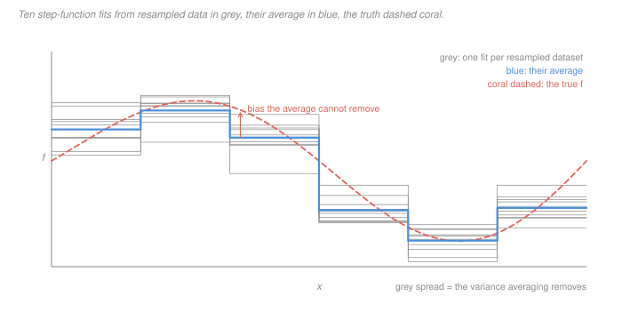

# Statistical Learning Theory · Lesson 5.2: Bagging and random forests

> ⏱ ~15 min · Module 5: Nonlinear and modern models · Builds on: [5.1 (decision trees)](05-01-decision-trees.md), [1.2 (the bias–variance decomposition)](01-02-the-bias-variance-decomposition.md) · Unlocks: [5.3 (boosting)](05-03-boosting.md), boss problem 5

## Why this matters

[`machine-learning` 2.6](../../machine-learning/lessons/02-06-bagging-and-random-forests.md) already built the forest and did the accounting. Averaging $B$ identically distributed trees with pairwise correlation $\rho$ gives variance

$$\operatorname{Var}\bigl(\hat f_{\mathrm{bag}}(x)\bigr) \;=\; \rho\,\sigma^2 \;+\; \frac{1-\rho}{B}\,\sigma^2 ,$$

the [correlation floor](../reference.md#correlation-floor); the out-of-bag estimate comes from the same lesson. Both are taken as given here and neither is re-derived.

That formula answers "how far can a forest go?" It does not answer the two questions a theory course has to ask. **Why is averaging a legitimate thing to do at all** — what quantity is the forest estimating? And **when does it fail** — because a method that always helped would be free, and nothing is free.

The answer to both is one substitution. There is an object you would obviously want, you cannot compute it, and bagging swaps in a bootstrap stand-in. Every property of bagging — that it kills variance, that it cannot touch bias, that it transforms trees and does nothing for a stump, that the floor exists — is a consequence of that single step. Make the substitution explicit and the whole method becomes predictable rather than empirical.

## The idea

Imagine an absurdly generous data supply: you can draw a fresh training set from $\mathcal D$ whenever you like. Fit your learner on each one, and average the predictions. Call that limit the **ideal aggregate** $\bar f$.

Two things are true of $\bar f$ and both are one line of algebra.

**It is never worse.** For squared loss, the expected error of a *random* fit splits into the error of the average fit plus the spread around it. The spread is a non-negative quantity you are simply deleting. So the ideal aggregate wins by exactly the variance — no more, and no less.

**It is not smarter.** The average of many fits sits exactly where the fits sit *on average*, which is where the single fit sat on average. If your learner is systematically off, the whole crowd is systematically off in the same direction, and averaging a crowd of wrong answers gives a wrong answer with less jitter. Averaging is a variance instrument, full stop.

You cannot compute $\bar f$: it needs fresh datasets and you have one. So do the standard thing — replace $\mathcal D$, which you don't know, by $\hat{\mathcal D}_n$, the empirical distribution of the sample you have, and draw your "fresh" datasets from *that*. Drawing $n$ points from $\hat{\mathcal D}_n$ is drawing $n$ points from your data with replacement, which is the [bootstrap](../reference.md#bootstrap). That is the entire content of bagging:

> **Bagging is the bootstrap plug-in estimate of the ideal aggregate.**

Read the method that way and its behaviour stops being surprising. Bagging helps in proportion to the variance it has to delete, so it transforms unstable learners (a deep tree, whose root split flips when one row changes — [5.1](05-01-decision-trees.md)) and does essentially nothing for stable ones. It cannot repair bias, because the ideal object it is chasing has the same bias. And the plug-in is not exact: two bootstrap samples overlap in about 63 percent of their distinct rows, so the fits they produce are correlated rather than independent — which is where $\rho$, and therefore the floor, comes from.

## The formal version

Write $S \sim \mathcal D^n$ for the training sample, $\hat f_S$ for the fitted predictor, and fix a test point $x$ throughout. Define the **ideal aggregate**

$$\bar f(x) \;=\; \mathbb E_{S\sim\mathcal D^n}\bigl[\hat f_S(x)\bigr].$$

*In words:* the prediction you would make at $x$ if you could average over every training set the world might have handed you. Note $\bar f$ is a deterministic function — the randomness in $S$ has been integrated out.

**Theorem (the aggregation identity).** For any fixed $x$ and any fixed target value $y$,

$$\mathbb E_S\bigl[(y-\hat f_S(x))^2\bigr] \;=\; \bigl(y-\bar f(x)\bigr)^2 \;+\; \operatorname{Var}_S\bigl(\hat f_S(x)\bigr).$$

*In words:* a random fit's expected squared error is the ideal aggregate's error plus the spread of the fits around it. Since the variance is non-negative, **the ideal aggregate is never worse, and is better by exactly the variance.**

*Proof.* Add and subtract $\bar f(x)$ inside the square and expand:

$$\mathbb E_S\bigl[(y-\bar f) + (\bar f - \hat f_S)\bigr]^2 = (y-\bar f)^2 + 2(y-\bar f)\,\mathbb E_S[\bar f - \hat f_S] + \mathbb E_S[(\hat f_S - \bar f)^2].$$

The cross term vanishes because $\mathbb E_S[\hat f_S] = \bar f$ by definition, and the last term is the variance. $\blacksquare$

This is [Jensen's inequality](../reference.md#useful-inequalities) for the convex map $u \mapsto (y-u)^2$, with the gap named. Convexity is doing real work, and Example 2 shows what happens when you remove it.

**Proposition (averaging cannot touch bias).** With $f$ the target, the bias of the aggregate equals the bias of the base learner:

$$\bar f(x) - f(x) \;=\; \mathbb E_S[\hat f_S(x)] - f(x).$$

*Proof.* $\bar f$ is deterministic, so $\mathbb E[\bar f] = \bar f = \mathbb E_S[\hat f_S]$; subtract $f(x)$. $\blacksquare$

One line, and it is the most consequential line in the lesson. In the [bias–variance decomposition](../reference.md#bias-variance-decomposition) of [1.2](01-02-the-bias-variance-decomposition.md), aggregation deletes the middle term and leaves the other two exactly where they were.

**Stability, made precise.** Say $\hat f$ is *unstable* if replacing one point of $S$ changes $\hat f_S(x)$ a lot. The [Efron–Stein inequality](../reference.md#stability) makes the link to the quantity bagging deletes: writing $S^{(i)}$ for $S$ with its $i$-th point replaced by an independent copy,

$$\operatorname{Var}_S\bigl(\hat f_S(x)\bigr) \;\le\; \tfrac12\sum_{i=1}^{n}\mathbb E\bigl[(\hat f_S(x) - \hat f_{S^{(i)}}(x))^2\bigr].$$

Stated, not proved. *In words:* variance is bounded by how much one swapped data point can move the prediction. Combined with the theorem, that gives the governing principle: **bagging's payoff is bounded by the learner's instability.** A learner nothing can perturb has nothing to gain.

**What bagging actually computes.** With $\hat{\mathcal D}_n$ the empirical distribution of $S$ and $S_1^*,\dots,S_B^*$ drawn i.i.d. from $\hat{\mathcal D}_n^{\,n}$,

$$\hat f_{\mathrm{bag}}(x) \;=\; \frac1B\sum_{b=1}^{B}\hat f_{S_b^*}(x) \;\xrightarrow[B\to\infty]{}\; \mathbb E_{S^*\mid S}\bigl[\hat f_{S^*}(x)\bigr].$$

Two gaps separate this from $\bar f$, and they behave differently. The **Monte Carlo gap** (finite $B$) vanishes as you add trees — it is the $(1-\rho)\sigma^2/B$ term. The **plug-in gap** ($\hat{\mathcal D}_n$ instead of $\mathcal D$) does not: bootstrap resamples share most of their rows, so the fits stay correlated no matter how many you draw, and what survives is $\rho\sigma^2$. Feature subsampling — the "random" in random forest — is an attack on that second gap, injecting randomness the data cannot supply. See [`machine-learning` 2.6](../../machine-learning/lessons/02-06-bagging-and-random-forests.md) for the accounting and the cost.

## Picture

The grey spread is the variance: ten fits, one per resampled dataset, disagreeing by a lot at every $x$. The blue average collapses that spread almost entirely — that is the theorem's second term being deleted.

Now look at the coral curve. The blue staircase does not converge to it. Averaging removed the disagreement *between* fits and left untouched the thing they all had in common: a step function cannot follow a curve inside a bin. That residual gap is the bias, it is the same before and after averaging, and no number of resamples will close it. **The variance is the grey; the bias is the coral gap; bagging is a machine for one of them.**

## Worked examples

**Example 1 (mechanical): the identity on three datasets.** Suppose only three training sets are possible, each with probability $1/3$, and at the test point $x$ they produce predictions $2$, $5$ and $8$. The true value there is $y = 4$.

Direct computation of the expected squared error of a random fit:

$$\tfrac13\bigl[(4-2)^2 + (4-5)^2 + (4-8)^2\bigr] = \tfrac{4+1+16}{3} = 7.$$

Now via the theorem. The aggregate is $\bar f = (2+5+8)/3 = 5$, so its error is $(4-5)^2 = 1$, and the variance of the fits about $5$ is $(9+0+9)/3 = 6$. Total $1 + 6 = 7$. ✓

Read the split: of the seven units of error, **six are variance and one is bias**, so the ideal aggregate cuts the error by a factor of seven. And it is still wrong by $1$ — the three learners average to $5$, not to $4$, and nothing in the averaging notices. Bagging would approximate $\bar f = 5$ by resampling the one dataset you actually got; how close it gets is the plug-in gap.

**Example 2 (why you'd care): with a non-convex loss, aggregation can make things worse.** The theorem is Jensen's inequality, so it holds because squared loss is convex in the prediction. Classification by majority vote has no such protection.

Fix a test point $x$ whose true label is $+1$, and suppose each bootstrap-fitted classifier gets it right with probability $p$, independently. The vote of $B$ classifiers is right with probability $\Pr(\mathrm{Bin}(B,p) > B/2)$:

| $B$ | $p = 0.6$ (a point the learner tends to get right) | $p = 0.4$ (a point it tends to get wrong) |
|---|---|---|
| 1 | 0.600 | 0.400 |
| 5 | 0.683 | 0.317 |
| 25 | 0.846 | 0.154 |
| 101 | 0.979 | 0.021 |

Voting is a **polarizer**, not an improver. Wherever the base learner is better than a coin it is driven toward certainty of being right; wherever it is worse than a coin it is driven toward certainty of being **wrong** — error at that point rises from $0.60$ to $0.98$. Bagging a classifier helps overall precisely when the set of points where $p > 1/2$ carries most of the mass, which is a real assumption about the learner and not a theorem.

Under squared loss no such reversal is possible, at any point, for any learner: convexity forbids it. That contrast is the practical payoff of knowing *which* inequality the method rests on.

## Watch out

- **You might think** bagging is a cure for overfitting — **but actually** it is a variance instrument only. Bagging a depth-1 stump gives you a slightly smoother depth-1 stump: still hopeless on data with interactions, because its error is bias, and the Proposition says the bias is unchanged. This is exactly why bagged trees are grown deep and unpruned, and it is why [boosting (5.3)](05-03-boosting.md), which attacks the other term, needs a *weak* base learner where bagging needs a strong one.
- **You might think** $\hat f_{\mathrm{bag}} \to \bar f$ as $B \to \infty$ — **but actually** it converges to the *bootstrap* aggregate, $\mathbb E_{S^*\mid S}[\hat f_{S^*}]$, which is a function of your one dataset. The Monte Carlo gap closes; the plug-in gap does not. The surviving distance between them is what the $\rho\sigma^2$ floor measures, so "more trees" and "better trees" are answers to different questions.
- **You might think** the identity says averaging always helps — **but actually** it says averaging helps *under squared loss*, where the gap it opens is a variance and variances are non-negative. Example 2 supplies the counterexample for 0-1 loss with voting.
- **You might think** $\rho$ is high because the trees share rows — **but actually** row overlap is only half of it. The bigger driver is that the greedy split search keeps finding the *same dominant feature* at the root of every resampled tree ([`machine-learning` 2.5](../../machine-learning/lessons/02-05-decision-trees.md)). That is why the fix is to hide features from each split rather than to resample harder.

## One-liner

> Bagging is the bootstrap plug-in for the average over fresh datasets — so it deletes exactly the variance, leaves the bias exactly where it was, and pays for the substitution with a correlation floor.

## Problems

**P1 (🟢)** Prove that $\mathbb E[\bar f(x)] = \mathbb E_S[\hat f_S(x)]$, and hence that the aggregate has the same bias as the base learner. Then state what that implies for bagging a depth-1 decision stump on data whose true structure is an interaction between two features, and name which term of [1.2](01-02-the-bias-variance-decomposition.md)'s decomposition is doing the damage.

**P2 (🟡)** Derive the aggregation identity

$$\mathbb E_S\bigl[(y-\hat f_S(x))^2\bigr] = \bigl(y-\bar f(x)\bigr)^2 + \operatorname{Var}_S\bigl(\hat f_S(x)\bigr),$$

being explicit about why the cross term vanishes. Then answer, in one sentence each: what quantity is bagging estimating, and what does it substitute for what in order to estimate it?

**P3 (🔴)** Bagging a [$k$-nearest-neighbour](../reference.md#k-nearest-neighbours) regressor with large $k$ is known to be nearly pointless.

(a) Give the stability argument: describe what a bootstrap resample does to the set of $k$ nearest neighbours of a fixed test point, and why the effect on the prediction shrinks as $k$ grows. Combine it with the variance $\sigma^2/k$ from [1.2](01-02-the-bias-variance-decomposition.md) to say what is left for bagging to remove.

(b) Now take $k = 1$ and let $B \to \infty$. Argue that the bootstrap-aggregated 1-NN predictor is a *weighted* average of the training labels, with weight $w_j$ on the $j$-th nearest neighbour equal to the probability that the $j$-th neighbour is the closest one present in the resample. Model row inclusion as independent with probability $p = 1 - e^{-1}$, give $w_j$ in closed form, and compute the resulting variance as a multiple of $\sigma^2$. Interpret the answer as an "effective $k$".

(c) Say in one sentence what the bagged 1-NN predictor pays for that variance reduction.

Solutions

**P1** By definition $\bar f(x) = \mathbb E_S[\hat f_S(x)]$ is a number, not a random variable — the expectation over $S$ has already been taken. The expectation of a constant is itself, so $\mathbb E[\bar f(x)] = \bar f(x) = \mathbb E_S[\hat f_S(x)]$. Subtracting the target $f(x)$ from both sides gives equal biases:

$$\bar f(x) - f(x) = \mathbb E_S[\hat f_S(x)] - f(x).$$

**Implication.** A depth-1 stump splits on one feature and predicts a constant on each side. On a pure interaction — say $y = +1$ when the two features agree in sign and $-1$ when they disagree — every single-feature split leaves both children balanced, so *every* stump the learner can produce is useless, and so is their average. Bagging deletes the disagreement between stumps, and there was never any useful signal in that disagreement. The damage is in the **bias** term (equivalently, the approximation error of [1.1](01-01-what-is-learning-loss-risk-and-erm.md)'s decomposition: the class does not contain a good function), and the Proposition says averaging leaves it untouched. Fixing it needs a richer base learner or a method that attacks bias — [5.3](05-03-boosting.md).

**P2** Insert $\bar f(x)$ and expand the square:

$$\mathbb E_S\bigl[(y - \hat f_S)^2\bigr] = \mathbb E_S\bigl[\bigl((y-\bar f) + (\bar f - \hat f_S)\bigr)^2\bigr]$$
$$= (y-\bar f)^2 + 2(y-\bar f)\,\mathbb E_S[\bar f - \hat f_S] + \mathbb E_S\bigl[(\hat f_S - \bar f)^2\bigr].$$

The first term is deterministic and comes straight out of the expectation. The cross term carries the factor $\mathbb E_S[\bar f - \hat f_S] = \bar f - \mathbb E_S[\hat f_S] = 0$, which is the *definition* of $\bar f$ — this is the only place the definition is used, and it is why the identity holds for the mean and for no other centring. The last term is $\operatorname{Var}_S(\hat f_S(x))$ because $\bar f$ is that variable's mean.

*What bagging estimates:* the ideal aggregate $\bar f(x) = \mathbb E_{S\sim\mathcal D^n}[\hat f_S(x)]$, the average prediction over fresh training sets drawn from the true distribution.

*What it substitutes:* the empirical distribution $\hat{\mathcal D}_n$ in place of the unknown $\mathcal D$ (so "a fresh dataset" becomes "a draw of $n$ rows with replacement"), plus a $B$-term Monte Carlo average in place of the exact expectation over resamples.

**P3** (a) A bootstrap resample deletes about 37 percent of the distinct rows and duplicates others. For a fixed test point, the $k$ nearest *present* neighbours therefore differ from the original $k$ by roughly a $1/e$ fraction of their members, and the prediction changes by the average label difference over that fraction. As $k$ grows the swapped-in points are, by construction, only slightly farther away than the ones they replace, and each contributes weight $1/k$, so the change in the prediction shrinks like $1/\sqrt k$ in standard deviation: $k$-NN with large $k$ is a **stable** learner. Efron–Stein then caps the variance available to delete — consistently with the direct computation $\operatorname{Var} = \sigma^2/k$, which is already small. Bagging can only shave a fraction of an already-small number, while the bias, which for large $k$ dominates, is untouched by the Proposition. Hence: nearly pointless.

(b) With $B \to \infty$, the bagged prediction is $\mathbb E_{S^*\mid S}[\hat f_{S^*}(x)]$. The 1-NN rule on a resample returns $y_{(j)}$, the label of the $j$-th nearest neighbour, exactly when neighbours $1,\dots,j-1$ are all absent and neighbour $j$ is present. So the limit is $\sum_j w_j y_{(j)}$ with $w_j$ that probability — a linear smoother, not a 1-NN rule. Under the independent-inclusion model with $p = 1 - (1-1/n)^n \to 1 - e^{-1} = 0.6321$ and $q = 1-p = 0.3679$:

$$w_j = p\,q^{\,j-1}, \qquad j = 1, 2, 3, \dots$$

a geometric profile summing to $1$, whose first five values are

$$w_1,\dots,w_5 \;=\; 0.6321,\ 0.2325,\ 0.0855,\ 0.0315,\ 0.0116 .$$

With independent noise of variance $\sigma^2$ on each label,

$$\operatorname{Var} = \sigma^2\sum_{j\ge1} w_j^2 = \sigma^2\,\frac{p^2}{1-q^2} = 0.462\,\sigma^2 .$$

So bagging cuts 1-NN's variance by more than half. The **effective $k$** is $1/\sum_j w_j^2 = 2.16$: bagged 1-NN behaves like a $k$-NN rule with about $2.2$ neighbours. (A Monte Carlo over multinomial bootstrap draws at $n = 200$ gives $0.46$, confirming the independent-inclusion approximation; the same computation at $k = 3, 9, 25$ gives variance ratios $0.68$, $0.82$ and $0.89$ — the benefit dying steadily as the learner becomes stable, exactly as part (a) predicts.)

(c) It pays in **bias**: the weights reach past the nearest neighbour to the second, third and beyond, so the predictor averages labels from points farther from $x$ than 1-NN ever used. That is the same trade as raising $k$ — which is the honest way to describe what bagging did here, and the reason it is not a substitute for choosing $k$.

## Flashback

**From Lesson 4.4 (support vector machines):** Two soft-margin SVM fits, in the averaged regularized-risk convention. Fit **A** uses $n = 400$ and $C = 0.5$; fit **B** uses $n = 100$ and $C = 2.0$.

(a) Give $\lambda$ for each. They come out equal — so is there any sense in which one of the two fits is more heavily controlled than the other? Name the quantity that separates them.

(b) An SVM's solution is determined by a handful of support vectors — delete a non-support vector and the boundary does not move at all. Does that make an SVM stable or unstable in this lesson's sense, and what does your answer predict about bagging one?

Solution

(a) With $\lambda = 1/(Cn)$: fit A gives $1/(0.5 \times 400) = \mathbf{0.005}$ and fit B gives $1/(2.0 \times 100) = \mathbf{0.005}$. Equal penalty weights, and in the *objective* the two problems are scaled identically.

They are not equally controlled, though, and the quantity that separates them is $\lambda n = 1/C$: fit A has $\lambda n = 2$, fit B has $\lambda n = 0.5$ — a factor of four. That product, not $\lambda$ alone, is what governs how much one data point can move the answer, which is precisely part (b)'s subject. Same $\lambda$, four times the resistance to a single row.

(b) The support-vector fact cuts *against* stability if you read it carelessly: a solution that depends on four points sounds like a solution one point can wreck, and indeed deleting a support vector does move the boundary. But the quantity that matters is how much. The objective is the empirical hinge risk plus $\tfrac{\lambda}{2}\lVert w\rVert^2$, which is $\lambda$-strongly convex in $w$; changing one of $n$ points perturbs the objective by $O(1/n)$, and a strongly convex objective's minimizer moves by at most $O(1/(\lambda n))$. So a regularized SVM is stable, with the stability constant set by the same $\lambda n = 1/C$ from part (a) — and it degrades exactly as $C$ grows and the margin hardens.

The prediction: bagging an SVM at a sensible $C$ buys very little, because the Efron–Stein bound on the available variance is $O(1/(\lambda n)^2)$ and there is almost nothing to delete. Push $C$ up toward the hard-margin limit and the same SVM becomes genuinely unstable — the boundary is then pinned by whichever few points happen to be closest — and bagging starts to pay. Regularization and bagging are two ways to spend the same budget, which is why forests use the unregularized, unstable base learner and SVMs do not need an ensemble.

## Connections

- **Backward:** the identity is [1.2](01-02-the-bias-variance-decomposition.md)'s decomposition read as an instruction — it names a term and this lesson deletes it — and the instability being exploited is [5.1](05-01-decision-trees.md)'s greedy root split, the same fragility that made a tree's "explanation" untrustworthy. The bootstrap itself rests on the law of large numbers making $\hat{\mathcal D}_n$ a good stand-in for $\mathcal D$ ([`prob-stat-refresher` 3.2](../../prob-stat-refresher/lessons/03-02-sums-and-law-of-large-numbers.md)).
- **Forward:** [5.3](05-03-boosting.md) attacks the other term, and the contrast is structural rather than stylistic — averaging cannot move bias, so anything that does must build the predictor sequentially rather than in parallel. Boss problem 5(b) asks you to justify each method's target term from its defining equation, and 5(c) turns on the fact that averaging is noise-tolerant (a mislabelled point is one vote among $B$) while stagewise reweighting is not.
- **Sideways:** the mechanics, the out-of-bag estimate and the $\rho$ accounting are [`machine-learning` 2.6](../../machine-learning/lessons/02-06-bagging-and-random-forests.md), which this lesson takes as given; see also the [scope table](../syllabus.md) for the split. The plug-in move — "you want an expectation under $\mathcal D$, so take it under $\hat{\mathcal D}_n$ instead" — is the bootstrap in its general form, and it is the same step econometrics uses for standard errors when no closed-form sampling distribution exists.
