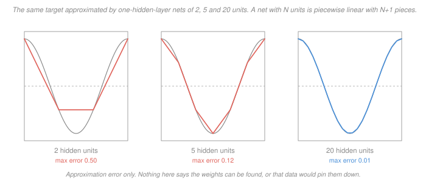

# Statistical Learning Theory · Lesson 5.4: Neural networks and backpropagation

> ⏱ ~15 min · Module 5: Nonlinear and modern models · Builds on: [1.1](01-01-what-is-learning-loss-risk-and-erm.md) (the excess-risk decomposition), [3.4](03-04-vc-bounds-and-sample-complexity.md) (VC sample complexity), [4.1](04-01-feature-maps-and-the-kernel-trick.md) (feature maps) · Unlocks: [5.5](05-05-why-does-deep-learning-generalize.md), boss problem 5

## Why this matters

A neural network is usually introduced as a *procedure*: here is a forward pass, here is a backward pass, here is a training loop. [`machine-learning` 4.4](../../machine-learning/lessons/04-04-a-taste-of-neural-networks.md) does exactly that, as an all-integer hand trace on a 2–2–1 net, and [`deep-learning`](../../deep-learning/syllabus.md) does the architecture and the training dynamics. **All of that is ceded. Nothing below runs a backward pass or touches a single weight update.**

This course has to ask a different question, because a network is also a **hypothesis class** — a set $\mathcal H$ that you drop into [1.1's](01-01-what-is-learning-loss-risk-and-erm.md) framework like any other. Once you do, three questions become askable and two of them have unsettling answers:

1. **How big is the class?** Big enough to contain any continuous function, and that is a theorem.
2. **What does that theorem promise?** Much less than its name suggests, and the gap is where boss problem 5 lives.
3. **What does capacity theory say?** That you need more data than exists. [5.5](05-05-why-does-deep-learning-generalize.md) is the confrontation with that; this lesson is the honest setup for it.

## The idea

Strip the marketing off and a network is one move repeated: **apply an affine map, bend the result, repeat.** The bending is a fixed scalar function $\phi$ — the **activation** — applied coordinatewise; the usual choice is the [ReLU](../reference.md#relu) $\phi(u) = \max(0, u)$.

The bending is not decoration. If $\phi$ is the identity, the composition of affine maps is an affine map, so a hundred layers collapse to one and the class you get is exactly the linear class of [2.1](02-01-linear-regression-as-learning.md). **The nonlinearity is the entire source of expressive power** — that is worth saying once, plainly, because it means every question about what depth buys is a question about how nonlinearities compose.

What do the two knobs buy?

- **Width** buys pieces *additively*. A one-hidden-layer ReLU net on one input with $N$ units is a piecewise-linear function with at most $N$ kinks — one per unit. Doubling the width doubles the kinks.
- **Depth** buys pieces *multiplicatively*. Composing $L$ layers can fold the input repeatedly, and the number of linear pieces can grow like $2^L$. Example 2 exhibits a network where it does exactly that.

There is a second difference from [4.1's](04-01-feature-maps-and-the-kernel-trick.md) kernels worth naming. A kernel gives you a feature map you **choose in advance**; a hidden layer is a feature map that is **fitted from the same loss the model is scored on** ([`machine-learning` 2.4](../../machine-learning/lessons/02-04-the-kernel-trick.md) does the kernel side computationally). That is the appeal, and it is also why the class is enormous.

## The formal version

**Definition (the class).** Fix a depth $L$, widths $d_0, d_1, \dots, d_L$ with $d_0 = d$, and an activation $\phi$ applied coordinatewise. A network is

$$h(x) \;=\; W^{(L)}\phi\Bigl(W^{(L-1)}\phi\bigl(\cdots \phi(W^{(1)}x + b^{(1)})\cdots\bigr) + b^{(L-1)}\Bigr) + b^{(L)},$$

and $\mathcal H_{W,L}$ is the set of all such $h$ as the $W^{(\ell)}, b^{(\ell)}$ range over the reals. Write $W$ for the total number of scalar parameters.

*In words:* the class is indexed by the weights, and "training" is [ERM](../reference.md#empirical-risk-minimization) over that index set.

**Lemma (collapse).** If $\phi$ is the identity, $\mathcal H_{W,L}$ equals the class of affine maps $x \mapsto Ax + c$, for every $L$.

*Proof.* One layer of composition already does it:

$$W^{(2)}\bigl(W^{(1)}x + b^{(1)}\bigr) + b^{(2)} = \bigl(W^{(2)}W^{(1)}\bigr)x + \bigl(W^{(2)}b^{(1)} + b^{(2)}\bigr),$$

which is affine; now induct on $L$. $\blacksquare$

**Theorem ([universal approximation](../reference.md#universal-approximation)).** Let $\phi$ be continuous and *not* a polynomial, let $K \subset \mathbb R^d$ be compact, let $f : K \to \mathbb R$ be continuous, and let $\epsilon > 0$. Then there are an integer $N$ and parameters $a_j \in \mathbb R$, $w_j \in \mathbb R^d$, $b_j \in \mathbb R$ with

$$\sup_{x \in K}\;\Bigl|\, f(x) - \sum_{j=1}^{N} a_j\,\phi(w_j^\top x + b_j)\,\Bigr| \;<\; \epsilon.$$

*In words:* one hidden layer, made wide enough, gets uniformly close to any continuous function on any bounded region. The class is **dense** in the continuous functions on $K$.

### What it does not say

The theorem is a statement about the *closure of a set*, and nothing else. Three things it is silent about — and each one lands on a different term of [1.1's](01-01-what-is-learning-loss-risk-and-erm.md) [excess-risk decomposition](../reference.md#excess-risk-decomposition), which is what makes them genuinely distinct rather than three phrasings of one complaint:

| the silence | what it costs | which term |
|---|---|---|
| **no bound on $N$** — the width is produced by the proof, not controlled by it, and known lower bounds for Lipschitz targets on the unit cube scale like $\epsilon^{-d}$ | the network you can *afford* may be far from dense | **approximation error** |
| **existence, not reachability** — nothing says gradient descent, or any algorithm, finds those weights | you can be inside a class containing a perfect $h$ and never reach it | **optimization error** |
| **nothing about data** — the theorem knows about $f$, not about a sample from $\mathcal D$ | a class that can fit anything can fit noise | **estimation error** |

Which of the three actually bites is a judgement about the problem in front of you, not a fact about the theorem — that is boss problem 5's question, and this lesson deliberately leaves it open.

**Capacity.** For ReLU networks with $W$ parameters and $L$ layers, the [VC dimension](../reference.md#vc-dimension) is known to satisfy

$$\mathrm{VCdim}(\mathcal H_{W,L}) \;=\; O\bigl(W L \log W\bigr),$$

with a matching lower bound of order $W L \log(W/L)$ — so this is the truth about these classes, not a loose upper bound waiting to be improved. Example 1 instantiates it, and the instantiation is brutal.

**What backprop is** — one paragraph, no arithmetic. Backpropagation is **reverse-mode automatic differentiation** applied to the computation graph of the loss. Run forward once, keeping every intermediate value; then walk the same graph backwards, and each node's sensitivity is a local derivative times the sensitivities already computed downstream. The fact that matters is the *cost*: all $W$ partial derivatives come out in time proportional to **one** forward pass, independent of $W$. Finite differences would need one forward pass per parameter — a factor of $W$ worse, which at $W = 10^6$ is the difference between a training run and a geological era. That cost asymmetry, not the chain rule itself, is what made deep learning practical. The chain rule was available to Leibniz. For the mechanics on paper, see [`machine-learning` 4.4](../../machine-learning/lessons/04-04-a-taste-of-neural-networks.md); for how it is organized at scale, [`deep-learning`](../../deep-learning/syllabus.md).

## Picture

Left to right the maximum error falls $0.50 \to 0.12 \to 0.01$, and it keeps falling: that is universal approximation happening in front of you. Read what the picture contains and what it does not. It contains a sequence of classes whose best member gets closer to the target. It contains **no** claim that gradient descent lands on that best member, and **no** data at all — no sample, no noise, no risk. It is a picture of one of the three terms.

## Worked examples

**Example 1 (mechanical): the capacity bound, instantiated.** Take a modest network by modern standards: $W = 10^6$ parameters, $L = 10$ layers. Then

$$\mathrm{VCdim} \;\approx\; W L \log_2 W \;=\; 10^6 \cdot 10 \cdot 19.93 \;\approx\; 2.0\times 10^8 .$$

Feed that into [3.4's](03-04-vc-bounds-and-sample-complexity.md) agnostic bound at $\epsilon = 0.1$, $\delta = 0.05$:

$$n \;\ge\; \frac{8}{\epsilon^{2}}\Bigl(d_{\mathrm{VC}}\ln\frac{16e}{\epsilon} + \ln\frac{2}{\delta}\Bigr) \;\approx\; 9.7 \times 10^{11}.$$

Nearly a trillion labelled examples. A dataset of $n = 6\times10^4$ — MNIST-sized — is short by a factor of about $1.6\times 10^7$. Even the realizable bound, which drops the $1/\epsilon^2$, asks for $3.8\times 10^{10}$.

Two disciplined readings, and they are not the same:

- **What is true:** the bound is *sufficient*, not necessary. It says "this many samples guarantee $\epsilon$"; it never says fewer cannot work. A vacuous bound is an absence of a guarantee, not a prediction of failure.
- **What is nonetheless embarrassing:** networks of this size demonstrably generalize from $6\times10^4$ samples. So uniform convergence over $\mathcal H_{W,L}$ is not the mechanism, and something else is doing the work. Naming that something is [5.5](05-05-why-does-deep-learning-generalize.md)'s job.

**Example 2 (why you'd care): depth is not a convenience.** Let $\phi$ be the ReLU and consider the two-unit map

$$h(x) \;=\; 2\phi(x) - 4\phi(x - \tfrac12),$$

which on $[0,1]$ is the tent: it rises from $0$ to $1$ on the left half and falls back on the right, and maps $[0,1]$ into itself. So it can be composed with itself. Stacking $L$ copies gives a network of depth $L$ and **width 2**, and the composite $h^{\circ L}$ is the sawtooth with $2^L$ linear pieces, slopes alternating $\pm 2^L$, and vertices alternating $0, 1, 0, 1, \dots$ at the points $k/2^L$. (Verified exactly in rational arithmetic for $L$ up to 10.)

At $L = 10$ that is $1024$ pieces from **61 parameters**.

Now ask a one-hidden-layer net to reproduce the same function. It is piecewise linear with at most one kink per unit, and the sawtooth has $2^{10} - 1 = 1023$ kinks, so it needs at least $1023$ units — **3070 parameters**, fifty times as many, to express a function that ten thin layers write down exactly.

This is the first row of the table above with a number attached. Universal approximation is true of the one-hidden-layer class and it told you nothing about *this*: the width it silently requires can be exponential in the depth you declined to use. Depth is not a convenience; it is a different budget.

## Watch out

- **You might think** universal approximation means "neural networks can learn anything." **Actually** it means the class is dense — a statement about $\inf_{h \in \mathcal H} R(h)$, one of three terms. Learning also requires finding the good $h$ (optimization) and having the data to certify it (estimation). Density is the cheapest of the three to obtain and the least useful to have.
- **You might think** an astronomically large VC dimension proves the network will overfit. **Actually** the VC bound is one-directional: it gives a sample size that *suffices*. Failing to certify generalization is not the same as predicting its absence, and pretending otherwise gets [5.5's](05-05-why-does-deep-learning-generalize.md) puzzle backwards before it is even stated.
- **You might think** backpropagation is the learning algorithm. **Actually** it is a derivative calculator. The learning algorithm is gradient descent ([2.6](02-06-gradient-descent-the-workhorse.md)), and everything 2.6 said about descending an *empirical* gradient — unbiased for the population gradient, but pointed at the wrong function — applies here unchanged and unimproved.

## One-liner

> Universal approximation says the target is in the closure of the class; it says nothing about how wide, how findable, or how well-sampled — and those three silences are exactly approximation, optimization, and estimation error.

## Problems

**P1 (🟢)** (a) Let $\phi$ be the identity and let a network have two hidden layers. Show its output is an affine function of $x$, and say in one sentence what this implies about the *hypothesis class* of a deep linear network. (b) Count the parameters (weights and biases) of a fully connected $20 \to 64 \to 64 \to 1$ network.

**P2 (🟡)** For the network of P1(b), take $\mathrm{VCdim} \approx W L \log_2 W$ with $L = 3$ and estimate it. Then instantiate [3.4's](03-04-vc-bounds-and-sample-complexity.md) agnostic bound at $\epsilon = 0.1$, $\delta = 0.05$ and compare with a realistic $n = 10^4$. State the conclusion carefully: say exactly what the comparison does and does not license you to claim, and name one thing about your instantiation that is not rigorous.

**P3 (🔴)** The three silences of universal approximation land on three different terms of the excess-risk decomposition. Three teams report a failure:

- **A** trains a 3-unit network to full convergence on ten million samples and is stuck at 12 percent error; a 300-unit network reaches 2 percent.
- **B** trains a network with $10^6$ parameters on 500 samples, reaches zero training error, and measures 30 percent test error.
- **C** trains a network wide enough that a near-perfect weight setting provably exists, and from one random seed plateaus at a loss three times what a second seed reaches.

(a) Attribute each failure to one silence and one error term. (b) Team A's fix was "more units." Explain why applying that fix to team B makes things worse, and name the quantity that grows. (c) Conclude in one sentence why the three cannot be fixed independently.

Solutions

**P1** (a) With $\phi = \mathrm{id}$ the output is
$$W^{(3)}\bigl(W^{(2)}(W^{(1)}x + b^{(1)}) + b^{(2)}\bigr) + b^{(3)} = Ax + c$$
where $A = W^{(3)}W^{(2)}W^{(1)}$ and
$$c = W^{(3)}W^{(2)}b^{(1)} + W^{(3)}b^{(2)} + b^{(3)},$$
so the output is affine in $x$. Implication: the *class* is exactly the affine class, unchanged by depth. Depth changed the parameterization (and hence what gradient descent does), but not the set of functions available, so no capacity and no expressive power was bought. Note the converse trap: the class is the same, the optimization landscape is not.

(b) Layer by layer: $20\cdot64 + 64 = 1344$; $64\cdot64 + 64 = 4160$; $64\cdot1 + 1 = 65$. Total
$$W = 1344 + 4160 + 65 = 5569 .$$

**P2** $\log_2 5569 = 12.44$, so
$$\mathrm{VCdim} \approx 5569 \cdot 3 \cdot 12.44 \approx 2.08\times10^5 .$$
With $\ln(16e/0.1) = 6.075$ and $\ln(2/0.05) = 3.689$,
$$n \ \ge\ \frac{8}{0.01}\bigl(2.08\times10^5 \cdot 6.075 + 3.689\bigr) \approx 1.0\times10^9 .$$
Against $n = 10^4$ the bound is short by a factor of about $10^5$.

Careful conclusion. **Licensed:** at $n = 10^4$ this class carries *no* uniform-convergence guarantee at $\epsilon = 0.1$; if the fitted network does generalize, the reason is not this theorem. **Not licensed:** any claim that it will fail. The bound is sufficient, not necessary, and the whole of [5.5](05-05-why-does-deep-learning-generalize.md) is about classes that generalize while this bound is vacuous.

Not rigorous: $O(WL\log W)$ hides a constant, and I set it to 1; also the base of the logarithm is absorbed into that constant, so writing $\log_2$ is a choice. The conclusion survives because the gap is five orders of magnitude and no constant of moderate size closes it — but the number $1.0\times10^9$ should be read as an order of magnitude, not a value.

**P3** (a)
- **A**: no bound on the width — the affordable class was too small. **Approximation error**, and the fix (more units) directly attacks it, which is why it worked.
- **B**: nothing about data — the class fits the 500 points perfectly and the fit means nothing. **Estimation error**, the gap between $\hat R_S(\hat h)$ and $R(\hat h)$ that [1.1](01-01-what-is-learning-loss-risk-and-erm.md) warned about and Module 3 exists to control.
- **C**: existence, not reachability — a good $h$ is in the class and gradient descent did not reach it from that initialization. **Optimization error**.

(b) More units enlarges $\mathcal H$. Team B's problem is that $\mathcal H$ is *already* far too rich for $n = 500$: it interpolates, so training error is uninformative. Enlarging it raises the capacity term — $\mathrm{VCdim} \approx WL\log W$ grows, and with it the uniform-convergence gap in [3.4's](03-04-vc-bounds-and-sample-complexity.md) bound — while leaving the (already zero) training error alone. The quantity that grows is the estimation error; team B needs data, a penalty, or a smaller class, not units.

(c) The knob that shrinks the approximation term is the same knob that inflates the estimation term, so the three silences trade against one another rather than closing one at a time — which is precisely why "make it bigger" is a strategy and not a theorem, and why the empirical success of very large networks is a genuine puzzle rather than a corollary.

## Flashback

**From Lesson 5.2 (bagging and random forests):** A base learner's prediction at a fixed point $x_0$ varies over training sets with mean $3$ and variance $4$; the true value is $f(x_0) = 2$. Ignore label noise.

(a) Give the expected squared error
$$\mathbb E_S\bigl[(f(x_0) - \hat f_S(x_0))^2\bigr]$$
and the error of the ideal aggregate $\bar f(x_0) = \mathbb E_S[\hat f_S(x_0)]$.

(b) Now let the base learner be a neural network, and instead of resampling the data, retrain from different random initializations on the *same* data and average. Does 5.2's argument still predict a gain? Answer with 5.2's stability criterion, and say which of the two numbers in (a) averaging can and cannot move.

Solution

(a) The identity from [5.2](05-02-bagging-and-random-forests.md): squared error splits into the squared gap of the aggregate plus the spread.
$$\mathbb E_S\bigl[(f - \hat f_S)^2\bigr] = (f - \bar f)^2 + \operatorname{Var}_S(\hat f_S) = (2-3)^2 + 4 = 1 + 4 = 5 .$$
The ideal aggregate makes the second term vanish, leaving $(f - \bar f)^2 = 1$. Averaging is worth $4$ out of $5$ here — and not a unit more.

(b) Yes. 5.2's criterion is **instability**: averaging pays in proportion to how much $\hat f_S$ moves. Networks are about as unstable as a fitted model gets — a different seed follows a different trajectory to a different set of weights and a visibly different function — so the variance term is large and averaging removes most of it. (This is why deep ensembles work, and why they work without any bootstrap.)

What it cannot move is the $1$. Averaging leaves the mean untouched, $\mathbb E[\bar f] = \mathbb E[\hat f_S]$, so bias is invariant; if every member shares an architecture whose best achievable function sits away from $f$, every member is wrong in the same direction and the average is wrong there too. One caveat in 5.2's direction: seed-averaging is not bootstrap-averaging, and because all members see the *same* data their errors stay positively correlated — the correlation floor of [`machine-learning` 2.6](../../machine-learning/lessons/02-06-bagging-and-random-forests.md) applies with correlation coming from shared data rather than shared points, so the realized gain is below the ideal $4$.

## Connections

- **Backward:** the class is dropped straight into [1.1's](01-01-what-is-learning-loss-risk-and-erm.md) [excess-risk decomposition](../reference.md#excess-risk-decomposition), and the three silences of universal approximation are exactly its three terms; [3.4's](03-04-vc-bounds-and-sample-complexity.md) bound is what goes vacuous. A hidden layer is [4.1's](04-01-feature-maps-and-the-kernel-trick.md) feature map, fitted rather than chosen.
- **Forward:** [5.5](05-05-why-does-deep-learning-generalize.md) takes the vacuous bound of Example 1 as its starting problem, and boss problem 5 asks which of the three silences bites in practice. [`deep-learning`](../../deep-learning/syllabus.md) takes over the architecture and the training dynamics; [`machine-learning` 4.4](../../machine-learning/lessons/04-04-a-taste-of-neural-networks.md) has the forward and backward pass on paper.
- **Sideways:** reverse-mode differentiation is the **adjoint method** — the same object physics uses to differentiate an objective through a dynamical constraint, where the backward sensitivities are the Lagrange multipliers on the state equations. Backpropagation through layers and the adjoint equation of optimal control are one algorithm written in two notations, which is why "cost of the gradient equals cost of the function" is a fact about constrained differentiation, not about neural networks.
