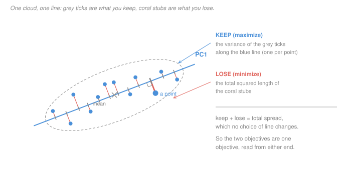

# Statistical Learning Theory · Lesson 6.1: Principal component analysis

> ⏱ ~15 min · Module 6: Unsupervised learning · Builds on: [2.1 (linear regression as learning)](02-01-linear-regression-as-learning.md), [`linalg-refresher` 5.1 (spectral theorem)](../../linalg-refresher/lessons/05-01-spectral-theorem-quadratic-forms.md) · Unlocks: [6.2](06-02-clustering-and-k-means.md), [6.3](06-03-mixture-models-and-em.md)

## Why this matters

PCA is one line of library code that always returns *something*, and [`machine-learning` 3.2](../../machine-learning/lessons/03-02-principal-component-analysis.md) shows you how that line runs — the eigendecomposition, the SVD route, the cost. This lesson asks the only question that makes the output trustworthy: **in what sense is the returned subspace the right one?**

The answer is unusually strong. PCA is not a heuristic that happens to work; it is the exact minimizer of a precisely stated objective, and it is the exact minimizer of a *second* objective that looks nothing like the first. The number everyone quotes — "PC1 explains 81 percent of the variance" — is the optimal value of that objective, so "19 percent lost" is not this method's error but a **lower bound on what any linear code of that size must lose**. That is the difference between a diagnostic and a guarantee.

And once you know the objective, you know the assumptions, because they are written into it. Every lesson in this module runs that same play: name the objective, prove what optimizes it, then read off what it cannot see.

## The idea

You want to describe each data point with $k$ numbers instead of $p$. Fix a line (or a $k$-dimensional plane) through the middle of the cloud, and replace each point by its shadow on that plane. Two ways to say what makes a good choice:

- **Keep the most.** The shadows should be spread out. If every point casts the same shadow, the $k$ numbers you kept say nothing.
- **Lose the least.** Each point should sit close to its own shadow. The gap is what you threw away.

These sound like different requests, and people often argue about which one PCA "really" does. They are the same request. For each point, the shadow and the gap are the two legs of a right triangle whose hypotenuse is the point itself, so

$$\lVert x\rVert^2 = \underbrace{\lVert \text{shadow}\rVert^2}_{\text{kept}} + \underbrace{\lVert \text{gap}\rVert^2}_{\text{lost}},$$

and the left side does not mention the plane at all. **Your data has a fixed total, and every choice of plane just splits it.** Maximizing one half is minimizing the other, exactly — not approximately, not usually.

That settles *what* to optimize. Then a second, separate question: which plane wins? For one direction it is the Rayleigh quotient and the answer is the top eigenvector. For $k$ directions it turns out to be a two-line linear-programming argument, and the answer is the top $k$ eigenvectors — which is not obvious, because "greedily take the best direction, then the best one perpendicular to it" is a procedure, not a proof that the resulting $k$-plane beats every other $k$-plane.

## The formal version

**Setup.** Data $x_1,\dots,x_n \in \mathbb R^p$, already centred so that $\frac1n\sum_i x_i = 0$, collected as the rows of $\tilde X \in \mathbb R^{n\times p}$. The [covariance matrix](../reference.md#covariance-matrix) is

$$S = \frac1n \sum_{i=1}^n x_i x_i^\top = \frac1n \tilde X^\top \tilde X,$$

symmetric and positive semidefinite, with eigenvalues $\lambda_1 \ge \dots \ge \lambda_p \ge 0$ and orthonormal eigenvectors $v_1,\dots,v_p$. (The $1/(n-1)$ convention multiplies every eigenvalue by the same constant and changes no argmax; it only changes what "per point" means in the error.)

**The code.** Pick a $k$-dimensional subspace $V$ with orthonormal basis $U \in \mathbb R^{p\times k}$. Encode $z_i = U^\top x_i \in \mathbb R^k$, decode $\hat x_i = U z_i = UU^\top x_i$. Two choices are already baked in and both are forced, not stylistic:

- *Why the orthogonal projection?* If you allow **any** decoder into $V$, the best point of $V$ to represent $x$ is its orthogonal projection — that is the projection theorem ([`linalg-refresher` 4.2](../../linalg-refresher/lessons/04-02-projection-least-squares.md)), the same fact that made least squares a projection in [2.1](02-01-linear-regression-as-learning.md).
- *Why centred?* If you allow an affine offset $\hat x = \mu + Uz$, the optimal $\mu$ is the sample mean. Centring first is not tidying; it is having already solved that part.

**Theorem 1 (the two objectives are one).** For every $k$-dimensional subspace with orthonormal basis $U$,

$$\underbrace{\frac1n\sum_i \lVert x_i - UU^\top x_i\rVert^2}_{\text{mean squared reconstruction error}} \;=\; \operatorname{tr}(S) \;-\; \underbrace{\operatorname{tr}(U^\top S U)}_{\text{variance of the scores}}.$$

*In words:* what you lose equals a constant minus what you keep, so the subspace that keeps the most is the subspace that loses the least — the same subspace, not merely a similar one.

*Proof.* The residual $x - UU^\top x$ is orthogonal to $V$ and $UU^\top x$ lies in $V$, so Pythagoras gives, for each point,

$$\lVert x_i\rVert^2 = \lVert UU^\top x_i\rVert^2 + \lVert x_i - UU^\top x_i\rVert^2 .$$

Average over $i$. The left side averages to $\frac1n\sum_i x_i^\top x_i = \operatorname{tr}(S)$, which does not depend on $U$. For the first term on the right, $U$ has orthonormal columns, so $\lVert UU^\top x\rVert^2 = \lVert U^\top x\rVert^2$, and

$$\frac1n\sum_i \lVert U^\top x_i\rVert^2 = \frac1n\sum_i \operatorname{tr}(U^\top x_i x_i^\top U) = \operatorname{tr}(U^\top S U).$$

Rearranging gives the identity. $\blacksquare$

**Theorem 2 (which subspace).** Over all matrices $U$ with orthonormal columns,

$$\max_{U^\top U = I_k} \operatorname{tr}(U^\top S U) \;=\; \lambda_1 + \dots + \lambda_k,$$

attained by $U = [v_1\ \cdots\ v_k]$.

*In words:* the best $k$-plane is spanned by the top $k$ eigenvectors, and the variance it keeps is the sum of their eigenvalues.

*Proof.* Write $S = W\Lambda W^\top$ with $W$ orthogonal, and set $B = W^\top U \in \mathbb R^{p\times k}$. Then $B^\top B = U^\top W W^\top U = I_k$, so $B$ has orthonormal columns, and

$$\operatorname{tr}(U^\top S U) = \operatorname{tr}(B^\top \Lambda B) = \sum_{j=1}^p \lambda_j c_j, \qquad c_j := \sum_{l=1}^k B_{jl}^2 .$$

Now read the constraints on the vector $c$. Since $B$ has orthonormal columns, $BB^\top$ is the orthogonal projector onto the column space of $B$, so its diagonal entries satisfy $0 \le c_j \le 1$; and

$$\sum_j c_j = \operatorname{tr}(BB^\top) = \operatorname{tr}(B^\top B) = \operatorname{tr}(I_k) = k .$$

So the problem has become: maximize the linear function $\sum_j \lambda_j c_j$ over $c \in [0,1]^p$ with $\sum_j c_j = k$. Spend your budget of $k$ units of weight on the $k$ largest $\lambda_j$ — the value is $\lambda_1+\dots+\lambda_k$, and $U = [v_1\ \cdots\ v_k]$ achieves it ($c_j = 1$ for $j \le k$, else $0$). $\blacksquare$

For $k=1$ this is the [Rayleigh quotient](../reference.md#rayleigh-quotient) statement $\max_{\lVert u\rVert = 1} u^\top S u = \lambda_1$ ([`linalg-refresher` 5.1](../../linalg-refresher/lessons/05-01-spectral-theorem-quadratic-forms.md)). Note what the general argument settles that greedy stacking does not: no $k$-plane anywhere beats the eigen-$k$-plane. Note also the fine print — the maximizing **subspace** is unique exactly when $\lambda_k > \lambda_{k+1}$, though the maximum **value** always is.

**[Explained variance](../reference.md#explained-variance), and why it is a real quantity.** Combining the two theorems, the best rank-$k$ code keeps $\sum_{j\le k}\lambda_j$ and loses

$$\frac1n\sum_i \lVert x_i - \hat x_i\rVert^2 \;=\; \sum_{j>k} \lambda_j ,$$

so the familiar fraction $(\lambda_1+\dots+\lambda_k)/\operatorname{tr}(S)$ is the **optimal value of a minimization**, not a summary statistic. "We kept 90 percent" means: no linear code of this size could have kept more.

**[Eckart–Young](../reference.md#eckart-young-theorem), stated.** Let $\tilde X = U\Sigma W^\top$ be the SVD, with singular values $\sigma_1\ge\dots\ge\sigma_p \ge 0$. For **every** matrix $A$ with $\operatorname{rank}(A)\le k$,

$$\lVert \tilde X - A\rVert_F^2 \;\ge\; \sum_{j>k}\sigma_j^2, \qquad \lVert \tilde X - A\rVert_2 \;\ge\; \sigma_{k+1},$$

with equality for the truncated SVD $\tilde X_k$ in both norms. Since $\sigma_j^2 = n\lambda_j$, the Frobenius error is again the discarded eigenvalues. The strength is in the feasible set: it ranges over *all* low-rank matrices, a far larger class than "project the rows onto a subspace", and the same truncation still wins. PCA's answer survives a genuine enlargement of its competition.

**One line on probabilistic PCA.** Take the latent-variable model with $z \sim \mathcal N(0, I_k)$ and

$$x = Wz + \mu + \varepsilon, \qquad \varepsilon \sim \mathcal N(0,\sigma^2 I_p).$$

The maximum-likelihood $W$ spans the top-$k$ eigen-subspace, and as $\sigma^2 \to 0$ the posterior mean of $z$ given $x$ becomes exactly the projection coordinates. **PCA is the zero-noise limit of a Gaussian latent-variable model** — which is why [6.3](06-03-mixture-models-and-em.md) can fit the same shape of object with EM once the latent variable becomes discrete.

**What the objective commits you to.** Read the assumptions straight off it. The code is *linear* (a subspace), so curved structure is invisible by construction. The loss is *squared error*, so only second moments matter and a heavy tail counts more than any amount of shape. And the criterion is *variance in your units*, so the claim "big variance means important" is smuggled in twice: variance is not discrimination — [`machine-learning` 3.2](../../machine-learning/lessons/03-02-principal-component-analysis.md) constructs the dataset where PC1 carries exactly zero information about the label, and shows what a unit conversion does to the answer. Both failures are the objective working correctly on a question you did not mean to ask.

## Picture

Read it left to right and you are maximizing the spread of the grey ticks. Read it point by point and you are minimizing the coral. Theorem 1 says the two readings share an answer because the ink is conserved: lengthen the ticks' spread and the stubs must shorten by the same total.

## Worked examples

**Example 1 (mechanical): what the theorem buys over a good guess.** Take

$$S = \begin{pmatrix} 4 & 3 \\ 3 & 12\end{pmatrix}, \qquad \operatorname{tr} S = 16,\quad \det S = 48 - 9 = 39 .$$

From $\lambda^2 - 16\lambda + 39 = 0$: $\lambda_1 = 13$, $\lambda_2 = 3$ (they sum to 16 and multiply to 39 ✓). The top eigenvector solves $(S - 13I)v = 0$, whose first row is $-9x + 3y = 0$, so $y = 3x$ and

$$v_1 = \frac{(1,3)}{\sqrt{10}}, \qquad v_2 = \frac{(-3,1)}{\sqrt{10}}$$

(check: $S(1,3)^\top = (13,39)^\top = 13(1,3)^\top$ ✓). PC1 keeps $13$ of the total $16$ — **81.25 percent** — and the rank-1 reconstruction error is exactly $\lambda_2 = 3$ per point.

Now the comparison that shows what Theorem 2 is worth. Suppose instead of rotating you just kept the better of the two original features. Keeping feature 1 keeps $e_1^\top S e_1 = 4$ (25 percent); keeping feature 2 keeps $12$ (75 percent). So the rotation buys you 81.25 against 75 — a modest gain, and the useful part is not the gain but the *certainty*: 81.25 percent is the ceiling. There is no clever line anywhere in the plane that keeps more, and the worst possible line still keeps $\lambda_2 = 3$. Every direction's score is pinned between the two eigenvalues, and you know both.

**Example 2 (why you'd care): the theorem is tight and the answer is useless.** Take $m \ge 3$ points equally spaced on the unit circle in $\mathbb R^2$. Their mean is the origin, and

$$S = \frac1m\sum_i x_ix_i^\top = \begin{pmatrix} 1/2 & 0 \\ 0 & 1/2 \end{pmatrix}$$

for every such $m$ — the sum of $\cos^2$ over equally spaced angles is $m/2$, and the cross terms cancel. So $\lambda_1 = \lambda_2 = 1/2$: every direction is equally principal, the maximizing subspace is not unique, and the best one-dimensional code keeps exactly half of the mean squared length $\operatorname{tr}S = 1$. PCA reports **50 percent explained** and, correctly, that there is nothing to compress.

But this data is one-dimensional. One number — the angle — reconstructs every point exactly, with zero error. The theorem is not wrong and the 50 percent is not a bug: it is the exact optimum *over linear codes*, and no linear code can do better. What the number cannot tell you is that you were asking within the wrong class. This is the honest shape of a guarantee: it is sharp inside its hypothesis and silent outside it, and reading "50 percent unexplained" as "half the structure is noise" is the reader's error, not the theorem's.

## Watch out

- **You might think the argmax is what PCA returns — but actually only the optimal value is always well defined.** Eigenvectors are determined up to sign, and when eigenvalues tie (Example 2) the "principal directions" can be rotated arbitrarily within the tied block. The subspace is unique only when $\lambda_k > \lambda_{k+1}$, and the flipped signs you see across two runs of the same code are not a bug. Never interpret an individual loading vector without checking the gap it sits on.
- **You might think centring is preprocessing — but actually it is part of the theorem.** Theorem 1 is about subspaces through the origin. Take four points at $(10,10) + t(1,-1)/\sqrt2$ for $t \in \{-3,-1,1,3\}$: they lie exactly on a line, so centred PCA reports $\lambda = (5,0)$, top direction $(1,-1)/\sqrt2$, and **zero** rank-1 error. Skip the centring and you get the second-moment matrix

  $$M = \frac1n\sum_i x_ix_i^\top = \begin{pmatrix} 102.5 & 97.5 \\ 97.5 & 102.5\end{pmatrix}, \qquad \text{eigenvalues } 200 \text{ and } 5,$$

  whose top eigenvector is $(1,1)/\sqrt2$ — the direction of the *mean*, exactly perpendicular to the spread — reporting a confident 97.6 percent explained for the one direction in which the data does not vary at all.
- **You might think "explained variance" measures information — but actually it measures squared length in your units.** It is an exact answer to "how much of $\operatorname{tr}(S)$ can a $k$-dimensional linear code retain", and $\operatorname{tr}(S)$ changes when you change units, contains no labels, and does not know a circle from a disc. The guarantee is real; its scope is narrow. P3 pins down which invariances survive.

## One-liner

> PCA is not a way of finding directions — it is the exact answer to "lose the least with $k$ linear numbers", which is a promise about squared error in your units and about nothing else.

## Problems

**P1 (🟢)** A centred dataset has covariance matrix

$$S = \begin{pmatrix} 10 & 3 \\ 3 & 2 \end{pmatrix}.$$

(a) Give both eigenvalues (trace and determinant are enough).
(b) Give PC1 as a unit vector and its explained-variance fraction.
(c) Give the exact mean squared reconstruction error per point if you keep only PC1.
(d) In one sentence, say what Theorems 1–2 let you claim about the number in (c) that you could not claim if PCA were only a rule of thumb.

**P2 (🟡)** Prove that maximizing projected variance and minimizing squared reconstruction error are the same problem.

(a) For a $k$-dimensional subspace with orthonormal basis $U$, prove kept $+$ lost $= \operatorname{tr}(S)$, and conclude the two problems have the same argmax. State where you used centring and where you used orthonormality.
(b) Show the objective depends only on the subspace, not the basis: if $R$ is a $k\times k$ orthogonal matrix, then $\operatorname{tr}((UR)^\top S (UR)) = \operatorname{tr}(U^\top S U)$.
(c) In one sentence, say why (a) makes "explained variance" an optimal value rather than a diagnostic.

**P3 (🔴)** PCA is invariant under rotating the coordinates but not under rescaling them.

(a) Let $Q$ be orthogonal and replace every $x_i$ by $Qx_i$. Prove the eigenvalues of the covariance matrix are unchanged, the optimal subspace becomes $Q$ applied to the old one, and every reconstruction error is unchanged.
(b) Let $D = \operatorname{diag}(d_1,\dots,d_p)$ instead. Give a two-dimensional instance where the optimal direction moves to the direction *perpendicular* to the old one. (The full units story is [`machine-learning` 3.2](../../machine-learning/lessons/03-02-principal-component-analysis.md)'s; you only need the instance.)
(c) Which of the two invariances do you actually want, and what does standardising each coordinate to unit variance commit you to? Say what it buys and what it destroys.

Solutions

**P1** (a) $\operatorname{tr}S = 12$ and $\det S = 20 - 9 = 11$, so $\lambda^2 - 12\lambda + 11 = 0$ and $\lambda_1 = 11$, $\lambda_2 = 1$ (sum 12, product 11 ✓).

(b) First row of $(S - 11I)v = 0$ is $-x + 3y = 0$, so $x = 3y$ and $v_1 = (3,1)/\sqrt{10}$. Direct check: $S(3,1)^\top = (33,11)^\top = 11\,(3,1)^\top$ ✓, and $S(-1,3)^\top = (-1,3)^\top$ so $v_2 = (-1,3)/\sqrt{10}$ with $\lambda_2 = 1$ ✓. Explained fraction $11/12 \approx 91.67$ percent.

(c) By Theorem 1 the error is the discarded eigenvalue: exactly $\lambda_2 = 1$ per point (in whichever convention formed $S$). Consistency check: $11 + 1 = 12 = \operatorname{tr}S$.

(d) That $1$ is not this method's error but the **minimum** over every one-dimensional linear code — and by Eckart–Young over every rank-1 map whatsoever — so the 8.33 percent lost is a lower bound on what any compression of this size must lose, not an artifact of the algorithm.

**P2** (a) Write $P = UU^\top$, the orthogonal projector onto $V = \operatorname{col}(U)$. For each point, $Px_i \in V$ and $x_i - Px_i \perp V$, so the two are orthogonal and Pythagoras gives $\lVert x_i\rVert^2 = \lVert Px_i\rVert^2 + \lVert x_i - Px_i\rVert^2$. Average over $i$:

$$\frac1n\sum_i \lVert x_i\rVert^2 = \frac1n\sum_i \lVert Px_i\rVert^2 + \frac1n\sum_i\lVert x_i - Px_i\rVert^2 .$$

Orthonormality enters twice: it makes $P$ a projector ($P^2 = P = P^\top$, using $U^\top U = I_k$), and it gives $\lVert Px\rVert^2 = x^\top UU^\top UU^\top x = \lVert U^\top x\rVert^2$. Then

$$\frac1n\sum_i \lVert U^\top x_i\rVert^2 = \operatorname{tr}\Bigl(U^\top\bigl(\tfrac1n\sum_i x_ix_i^\top\bigr)U\Bigr) = \operatorname{tr}(U^\top S U),$$

and $\frac1n\sum_i\lVert x_i\rVert^2 = \operatorname{tr}(S)$. Centring enters here: $\frac1n\sum_i x_ix_i^\top$ is the covariance matrix only because the mean is zero, and $\operatorname{tr}(S)$ is then the total variance rather than the total variance plus $\lVert\bar x\rVert^2$. So lost $= \operatorname{tr}(S) - $ kept with $\operatorname{tr}(S)$ constant across all choices of $U$; a maximizer of the second term is therefore a minimizer of the first, and conversely. The two problems have identical argmax sets, not merely similar ones.

(b) $(UR)^\top(UR) = R^\top U^\top U R = R^\top R = I_k$, so $UR$ is a valid basis of the same subspace, and by cyclicity of the trace

$$\operatorname{tr}(R^\top U^\top S U R) = \operatorname{tr}(U^\top S U R R^\top) = \operatorname{tr}(U^\top S U).$$

So the objective is a function of $V$ alone — which is what licenses talking about "the best subspace" rather than "the best basis", and is why the sign and ordering ambiguities of the eigenvectors do not affect the answer.

(c) Because the two objectives sum to a constant, the maximum of one *is* the minimum of the other: the reported fraction is the optimal value of a well-posed minimization over all $k$-dimensional subspaces, so it certifies that no competitor does better, rather than describing what this particular procedure happened to achieve.

**P3** (a) Rotating preserves centring: $\frac1n\sum_i Qx_i = Q\bar x = 0$. The new covariance matrix is

$$S' = \frac1n\sum_i (Qx_i)(Qx_i)^\top = Q\Bigl(\frac1n\sum_i x_ix_i^\top\Bigr)Q^\top = QSQ^\top .$$

If $Sv = \lambda v$ then $S'(Qv) = QSQ^\top Qv = QSv = \lambda\, Qv$, so the eigenvalues are identical and the eigenvectors are rotated by $Q$; since $Q$ preserves orthonormality, the top-$k$ subspace of $S'$ is $QV$. For the errors, $P_{QV} = QP_VQ^\top$, so

$$\lVert Qx_i - P_{QV}Qx_i\rVert = \lVert Q(x_i - P_Vx_i)\rVert = \lVert x_i - P_Vx_i\rVert,$$

using that $Q$ is an isometry. Every residual has the same length, and the total error $\sum_{j>k}\lambda_j$ is unchanged. PCA therefore commutes with rotation: it is a statement about the shape of the cloud, not about the frame you wrote it in.

(b) Take $S = \operatorname{diag}(4,9)$: PC1 is $e_2$, explaining $9/13 \approx 69.2$ percent. Now rescale the first coordinate by $d_1 = 2$ (and $d_2 = 1$), giving $S' = DSD = \operatorname{diag}(16,9)$: PC1 is $e_1$, explaining $16/25 = 64$ percent. The optimal direction has moved to the direction perpendicular to the old one, on identical measurements. Note this is not the failure of an invariance you could patch: $D$ applied to the old answer would still be $e_2$, so $D$ and "take the top eigenvector" simply do not commute.

(c) **Which you want depends on whether a rotation is a real symmetry of your measurement.** When the coordinates share a unit and mixing them is meaningful — positions in space, pixel intensities, asset returns in one currency — rotation invariance is exactly the property you want, and PCA is answering a physical question about the cloud. When the coordinates are in incomparable units (kilograms and kilometres and dollars), the numerical variances are artifacts of unit choice, the objective is optimizing a quantity with no meaning, and you want scale invariance instead.

**You cannot have both.** Standardising — dividing each coordinate by its standard deviation, i.e. running PCA on the correlation matrix — buys exact invariance to per-coordinate rescaling, and destroys rotation invariance, because the rescaling map $D$ is defined coordinate by coordinate and so depends on the frame the data happened to be recorded in.

**What it commits you to** is a prior: that a one-standard-deviation move in any feature is worth the same as in any other, so every column is equally important before you look. That is a modelling assumption, not neutral hygiene. It has teeth in both directions — it promotes a near-constant noise column to full weight, and (compare (b)) it turns uncorrelated data into the correlation matrix $I$, where all eigenvalues tie and PCA has nothing to say. The right posture is not "always standardise" but "you are choosing units either way; choose them on purpose".

## Flashback

**From Lesson 5.4 (Neural networks and backpropagation):** A one-hidden-layer network takes 20 inputs, has 50 hidden units and a single output, with a bias on every non-input unit.

(a) How many parameters does it have?

(b) Now build a **linear autoencoder** on centred data in $\mathbb R^p$: $\hat x = W_2W_1x$ with $W_1 \in \mathbb R^{k\times p}$, $W_2 \in \mathbb R^{p\times k}$, identity activations, no biases, trained to minimize mean squared reconstruction error. Give its parameter count at $p = 100$, $k = 10$, and compare it with an unrestricted linear map. Then say what the network computes at its optimum, why, and what the training does **not** determine.

Solution

(a) Input-to-hidden: $20\times 50$ weights plus 50 biases $= (20+1)\cdot 50 = 1050$. Hidden-to-output: $50$ weights plus one bias $= 51$. Total $\mathbf{1101}$.

(b) **Count:** $pk + kp = 2pk = 2000$, against $p^2 = 10{,}000$ for an unrestricted linear map — a five-fold reduction bought entirely by the rank constraint.

**What it computes.** With identity activations the composition collapses to a single linear map $A = W_2W_1$, which is 5.4's observation that depth without nonlinearity buys nothing; and $\operatorname{rank}(A) \le k$ because the signal passes through a $k$-dimensional bottleneck. So training minimizes

$$\frac1n\sum_i \lVert x_i - Ax_i\rVert^2 = \frac1n\bigl\lVert \tilde X - \tilde X A^\top\bigr\rVert_F^2$$

over matrices $A$ of rank at most $k$. Every $\tilde XA^\top$ has rank at most $k$, so Eckart–Young bounds the objective below by $\frac1n\sum_{j>k}\sigma_j^2 = \sum_{j>k}\lambda_j$ — and the bound is attained, because $A = V_kV_k^\top$ (the PCA projector) gives $\tilde X A^\top = \tilde X V_kV_k^\top = \tilde X_k$, the truncated SVD. **So the trained linear autoencoder is PCA**: same subspace, same minimal error $\sum_{j>k}\lambda_j$, and when $\lambda_k > \lambda_{k+1}$ the optimal $A$ is exactly the projector. (Verified numerically: an alternating least-squares fit of $W_1,W_2$ on a 6-dimensional dataset with $k=3$ lands on mean squared error $0.24930$, matching $\sum_{j>3}\lambda_j = 0.24930$, with $W_2W_1$ equal to the PCA projector to within $4\times10^{-15}$.)

**What it does not determine.** The factorization. For any invertible $M \in \mathbb R^{k\times k}$, the pair $(W_2M,\, M^{-1}W_1)$ gives the identical map $A$ and identical loss, so the hidden units need not be the eigenvectors, need not be orthogonal, and carry no ordering — only $\operatorname{col}(W_2)$ is pinned down. That is the same non-uniqueness as this lesson's first Watch-out, arriving by a different road: the *subspace* is the object with a theorem attached, and the basis is not. Stacking more linear layers changes nothing either, since the composite is still a rank-$\le k$ linear map — which is precisely why the nonlinearity is the entire source of a network's expressive power.

## Connections

- **Backward:** Theorem 1 is the orthogonality identity of [`linalg-refresher` 4.1](../../linalg-refresher/lessons/04-01-inner-products-orthogonality.md) applied once per data point, and it is the same "residual is orthogonal to the fit" that made least squares a projection in [2.1](02-01-linear-regression-as-learning.md). Theorem 2 rests on the spectral theorem ([`linalg-refresher` 5.1](../../linalg-refresher/lessons/05-01-spectral-theorem-quadratic-forms.md)), and Eckart–Young is a statement about the SVD ([`linalg-refresher` 5.2](../../linalg-refresher/lessons/05-02-svd.md)). The eigen/SVD computation itself, its cost, and the units demonstration are [`machine-learning` 3.2](../../machine-learning/lessons/03-02-principal-component-analysis.md).
- **Forward:** [6.2](06-02-clustering-and-k-means.md) runs this lesson's play again — its objective is also a variance decomposition, and reading off what it assumes is again the whole lesson. Probabilistic PCA is the doorway to [6.3](06-03-mixture-models-and-em.md), where the latent variable turns discrete and EM replaces the eigendecomposition. Replacing the inner product by a kernel from [4.1](04-01-feature-maps-and-the-kernel-trick.md) turns Theorem 2 into kernel PCA with no change to the algebra — which is one answer to Example 2's circle.
- **Sideways:** the same theorem is the principal axes of an inertia tensor in mechanics, the normal modes of a coupled oscillator, and the factor models of finance; Eckart–Young is the guarantee behind low-rank approximation wherever it appears, from image compression to recommender systems. And the pattern — *a sharp optimum inside a hypothesis you chose, silent outside it* — is [1.4](01-04-no-free-lunch-and-inductive-bias.md)'s lesson in unsupervised clothing.
