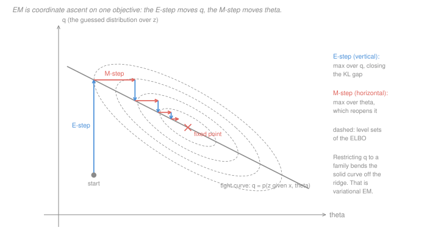

# Statistical Learning Theory · Lesson 6.3: Mixture models and EM

> ⏱ ~15 min · Module 6: Unsupervised learning · Builds on: [6.2](06-02-clustering-and-k-means.md) (the k-means objective), [`machine-learning` 3.5–3.6](../../machine-learning/lessons/03-06-the-em-algorithm.md) (the E- and M-steps, and the monotonicity proof) · Unlocks: [6.4](06-04-density-estimation.md), boss problem 6

## Why this matters

EM is usually taught as a trick for mixtures. It is not a trick and it is not about mixtures. It is **coordinate ascent on a single objective in two blocks**, and once you see it that way three things fall out at once: why the E-step has a closed form and the M-step does not, why the whole construction survives — in a weakened form — when the E-step becomes impossible (that weakened form is variational inference, which runs most of modern Bayesian machine learning), and why the parameters EM returns cannot be interpreted the way you want to interpret them.

[`machine-learning` 3.6](../../machine-learning/lessons/03-06-the-em-algorithm.md) owns the procedure. This lesson asks the two questions it does not: **what is EM optimizing, in general**, and **what does the answer fail to promise**. The second has a theorem in it, and it is the one that bites in practice.

## The idea

You have observed data $x$, unobserved latent variables $z$, and parameters $\theta$. You want the maximum-likelihood $\theta$ for

$$\log p(x \mid \theta) \;=\; \log \sum_z p(x, z \mid \theta),$$

and the sum inside the logarithm makes the derivative refuse to separate. That is the entire difficulty, and it is the same difficulty in a [Gaussian mixture](../reference.md#gaussian-mixture-model), a hidden Markov model, a topic model, and a survey with missing responses.

The move is one you have seen in optimization: **when a function of $\theta$ is hard, add variables until it becomes easy, in such a way that maximizing out the new variables gives you back the old problem.** The new variable here is a whole distribution $q(z)$ — your current guess about the missing data. It buys you a function $\mathcal L(q,\theta)$ of two blocks with two properties:

- **maximizing $\mathcal L$ over $q$ at fixed $\theta$ hands back $\log p(x\mid\theta)$ exactly** — so nothing was lost by enlarging the problem;
- **each block is easy on its own.** The $q$-block has a closed-form answer. The $\theta$-block is a weighted complete-data likelihood, with the logarithm now *outside* the sum.

So you alternate. That alternation is EM: "E-step" and "M-step" are names for "block one" and "block two", and the letters obscure the fact that both steps climb the *same* hill in different directions — the whole content of the picture below.

## The formal version

**Setup.** Latent-variable model $p(x,z\mid\theta)$, observed $x$, latent $z$ (discrete here; replace sums with integrals otherwise). Let $q$ be any distribution over $z$ that is positive wherever the posterior $p(z\mid x,\theta)$ is. Define the **[evidence lower bound](../reference.md#evidence-lower-bound)**

$$\mathcal L(q,\theta) \;=\; \mathbb E_{q}\bigl[\log p(x,z\mid\theta)\bigr] + H(q), \qquad H(q) = -\textstyle\sum_z q(z)\log q(z).$$

**The decomposition.** For every $q$ and every $\theta$,

$$\log p(x\mid\theta) \;=\; \mathcal L(q,\theta) \;+\; \mathrm{KL}\bigl(q \,\|\, p(z\mid x,\theta)\bigr).$$

*In words:* the log-likelihood splits exactly into a computable part and a penalty for guessing the missing data wrongly. (Two lines, proved in [`machine-learning` 3.6](../../machine-learning/lessons/03-06-the-em-algorithm.md); the [KL divergence](../reference.md#kl-divergence) is non-negative by Jensen — [`information-theory` 1.4](../../information-theory/lessons/01-04-relative-entropy-kl-jensen.md).)

**Proposition (the E-step is a maximization with a closed form).** For fixed $\theta$,

$$\arg\max_{q}\ \mathcal L(q,\theta) \;=\; p(z\mid x,\theta), \qquad \max_{q}\ \mathcal L(q,\theta) \;=\; \log p(x\mid\theta).$$

*Proof.* In the decomposition, $\log p(x\mid\theta)$ does not involve $q$. So maximizing $\mathcal L$ over $q$ is the same as minimizing the KL term, which is $\ge 0$ with equality **iff** $q$ is the posterior. $\blacksquare$

That one line is why the E-step is a posterior computation rather than an optimization you have to run. It is the only place the special structure of EM lives.

**EM, stated as an optimization.** From $\theta^0$, alternate:

$$q^{t+1} = \arg\max_{q}\ \mathcal L(q, \theta^{t}), \qquad \theta^{t+1} = \arg\max_{\theta}\ \mathcal L(q^{t+1}, \theta).$$

*In words:* block coordinate ascent on $\mathcal L$, $q$ then $\theta$, forever. The second maximization drops $H(q)$ (no $\theta$ in it) and so maximizes the expected complete-data log-likelihood — that is the M-step of [`machine-learning` 3.6](../../machine-learning/lessons/03-06-the-em-algorithm.md).

Three consequences follow from the framing alone, and each is a real generalization:

1. **Monotone ascent** — $\log p(x\mid\theta^{t+1}) \ge \log p(x\mid\theta^t)$ — is a *corollary*: the bound is tight after the E-step and can only rise in the M-step. Proved in [`machine-learning` 3.6](../../machine-learning/lessons/03-06-the-em-algorithm.md); we take it as given.
2. **Generalized EM.** The argument never needed the M-step to *maximize*; any $\theta^{t+1}$ that does not decrease $\mathcal L$ works. One gradient step on the $\theta$-block is legal.
3. **Variational EM.** If the posterior is intractable, restrict $q$ to a tractable family $\mathcal Q$ (say, one that factorizes across latent variables). The identity still holds, so $\mathcal L$ is still a lower bound — but the E-step now returns the **KL projection** of the posterior onto $\mathcal Q$, and the KL term no longer reaches zero. You are still doing coordinate ascent, and $\mathcal L(q^t,\theta^t)$ still increases monotonically. What dies is the corollary: because the residual gap can *shrink* between iterations, $\log p(x\mid\theta^t)$ itself may go **down**. Monotonicity in the bound, not in the likelihood.

Point 3 is why this framing is worth having. Nothing about EM was special; what was special was that one particular family — all distributions over $z$ — makes the bound tight.

**What EM does not guarantee.** Three failures, all real:

- **Not a global maximum.** $\mathcal L$ is not jointly concave; coordinate ascent finds a stationary point of the hill it started on ([`machine-learning` 3.6](../../machine-learning/lessons/03-06-the-em-algorithm.md)).
- **Not a bounded objective.** With free covariances the mixture likelihood has supremum $+\infty$, attained by collapsing a component onto a single point; monotone ascent then climbs *into* the degeneracy ([`machine-learning` 3.5](../../machine-learning/lessons/03-05-gaussian-mixture-models.md) constructs it).
- **Not identifiable.** This one is a theorem about the model, not about the algorithm, so no restart policy and no optimizer can fix it.

**Theorem ([label switching](../reference.md#label-switching)).** Let

$$p(x\mid\theta) = \sum_{k=1}^{K}\pi_k\, f(x\mid\phi_k), \qquad \theta = \bigl((\pi_1,\phi_1),\dots,(\pi_K,\phi_K)\bigr),$$

and for a permutation $\sigma$ of $\{1,\dots,K\}$ let $\theta^\sigma$ be $\theta$ with its $K$ pairs permuted by $\sigma$. Then $p(x\mid\theta^\sigma) = p(x\mid\theta)$ for every $x$, hence the likelihood of every dataset is unchanged.

*Proof.* $\sigma$ is a bijection of a finite index set and addition is commutative, so re-indexing by $j=\sigma(k)$ gives

$$\sum_{k=1}^{K}\pi_{\sigma(k)} f(x\mid\phi_{\sigma(k)}) \;=\; \sum_{j=1}^{K}\pi_{j} f(x\mid\phi_{j}).$$

The likelihood is a product of such terms over the sample, so it is unchanged too. $\blacksquare$

**Corollary.** If the $K$ pairs are distinct, the $K!$ permuted parameters are $K!$ *distinct* points of parameter space with *identical* likelihood. Every maximum therefore comes in an orbit of $K!$ maxima. (If some components coincide the orbit shrinks: with multiplicities $m_1,\dots,m_r$ it has size $K!/\prod_j m_j!$.)

*In words:* the model cannot tell "component 1" from "component 2", because nothing in it ever names them. Consequences:

- **You cannot average parameters across EM restarts.** Restart A's $\mu_1$ and restart B's $\mu_1$ may be the same component under two names; averaging them produces a mean that no run ever proposed.
- **A confidence or credible interval for $\mu_2$ is meaningless** without a labelling convention — in the Bayesian version the posterior is exactly $K!$-symmetric, so every component's marginal mean is the same number.
- **The fix is a convention, not a computation:** impose an identifiability constraint that picks one point per orbit, e.g. order components by the first coordinate of the mean or by mixing weight. It is arbitrary, and it is unstable when two components are genuinely close. The honest alternative is to report only **relabelling-invariant** quantities — the fitted density, the predictive distribution, the induced partition — all of which are identified.

**Mixtures as density estimators.** Step back from clustering: a $K$-component mixture is a *parametric* density model whose capacity you set by choosing $K$ — the complexity dial of [1.3](01-03-overfitting-and-train-validation-test.md), and a flexible one, since finite Gaussian mixtures approximate any reasonable density arbitrarily well as $K$ grows (a standard approximation theorem, not proved here). So what happens at the extreme? Take $K = n$, one component per data point, equal weights $1/n$ and a common width $h$: that *is* the kernel density estimator of [6.4](06-04-density-estimation.md). Fitting $h$ by maximum likelihood drives $h \to 0$ and the likelihood to infinity — the same degeneracy again — which is why bandwidth needs a different criterion, and that is 6.4's subject.

## Picture

One surface, $\mathcal L(q,\theta)$, drawn over its two blocks: $\theta$ across, $q$ up; the dashed ellipses are its level sets (a schematic quadratic, so the staircase drawn really is this surface's coordinate ascent). Every **E-step is vertical** — it moves $q$ only — and it lands on the solid grey curve, the locus $q = p(z\mid x,\theta)$ where the bound is tight and $\mathcal L$ equals $\log p(x\mid\theta)$. Every **M-step is horizontal**: it moves $\theta$ only, and in doing so it steps *off* the tight curve, which is exactly the KL gap reopening. The staircase shrinks toward a fixed point where neither block can improve.

Two things to read off. The fixed point is where the two block-optima cross — a stationary point of $\mathcal L$, with nothing in the geometry promising it is the highest one. And restricting $q$ to a family $\mathcal Q$ bends the solid curve off the true ridge: the staircase still climbs, but to a fixed point of a lower curve. That is variational EM in one picture.

## Worked examples

**Example 1 (mechanical): the E-step really is a maximization.** A single observation $x$, a binary latent, $\pi = (0.6,\ 0.4)$, and likelihoods $p(x\mid z{=}1) = 0.5$, $p(x\mid z{=}2) = 0.25$. Then the joint is $p(x,z) = (0.3,\ 0.1)$, so

$$p(x) = 0.4, \qquad p(z\mid x) = (0.75,\ 0.25), \qquad \log p(x) = -0.916291 .$$

Now evaluate both sides of the decomposition at four choices of $q$, with $\mathcal L(q) = \sum_z q(z)\log\bigl(p(x,z)/q(z)\bigr)$:

| $q$ | $\mathcal L(q,\theta)$ | $\mathrm{KL}(q\,\Vert\,p(z\mid x))$ | sum |
|---|---|---|---|
| $(0.75,\ 0.25)$ — the posterior | $-0.916291$ | $0$ | $-0.916291$ |
| $(0.9,\ 0.1)$ | $-0.988751$ | $0.072460$ | $-0.916291$ |
| $(0.5,\ 0.5)$ | $-1.060132$ | $0.143841$ | $-0.916291$ |
| $(0.25,\ 0.75)$ | $-1.465597$ | $0.549306$ | $-0.916291$ |

The last column is constant — it must be; the identity is an identity — and the middle column is the price of a wrong guess. The bound is largest exactly at the posterior, where its value is $\log p(x)$. **The E-step is not a separate kind of operation; it is the second column being maximized.**

**Example 2 (why you'd care): the gap that will not close.** Now two binary latents $z_1, z_2$, and a joint that couples them. For the observed $x$, let

$$p(x,z_1,z_2) = 0.45 \ \text{ at } (0,0) \text{ and } (1,1), \qquad 0 \text{ otherwise}.$$

So $p(x) = 0.9$ and the posterior is $(0.5,\ 0,\ 0,\ 0.5)$: the two latents are perfectly correlated, though neither alone is determined.

Run a **mean-field** E-step — restrict $q(z_1,z_2) = q_1(z_1)q_2(z_2)$, the standard tractable family. Any product with both factors non-degenerate puts positive mass on $(0,1)$, where $p = 0$, sending $\mathcal L$ to $-\infty$. So the best factorized $q$ is a point mass at one of the two modes, and

$$\mathcal L^* = \log 0.45 = -0.798508, \qquad \log p(x) - \mathcal L^* = \log 2 = 0.693147 .$$

The gap is exactly one nat, and it is a gap the E-step *cannot* close: the true posterior is correlated and no product distribution is. Mean-field breaks the tie, picks a mode, and reports a confidence in $z_1$ that the model does not have. Nor is this an artifact of the zeros: soften them to $p = 0.05$ on the two disagreeing cells (keeping $p(x) = 0.9$) and the optimal mean-field $q$ has both factors $\mathrm{Bernoulli}(2/3)$ — plus its mirror image at $1/3$, symmetry broken again — with a residual gap of exactly $\tfrac23\log 2 = 0.462098$.

**What survives.** Coordinate ascent still raises $\mathcal L$ every sweep. But $\log p(x\mid\theta) = \mathcal L + \mathrm{KL}$ with a KL term that is now a moving, positive quantity — so the likelihood you actually care about carries no guarantee. Every reported ELBO is this: a lower bound whose slack you cannot measure.

## Watch out

- **You might think** the E-step "fills in the missing labels", **but actually** it returns a whole distribution, and the difference is the entire lesson. Replacing $q$ by the hard assignment $\arg\max_z p(z\mid x,\theta)$ is a *different algorithm* — it no longer maximizes $\mathcal L$ over $q$, so the bound is no longer tight and the monotonicity corollary no longer applies to $\log p(x\mid\theta)$. That hard version is k-means; the limit is derived in [`machine-learning` 3.6](../../machine-learning/lessons/03-06-the-em-algorithm.md) and used in [6.2](06-02-clustering-and-k-means.md).
- **You might think** a high ELBO means a good model fit, **but actually** $\mathcal L = \log p(x\mid\theta) - \mathrm{KL}$ confounds two things: a low ELBO can mean a bad model *or* a bad variational family, and the decomposition never tells you which. Comparing ELBOs across different families $\mathcal Q$ compares nothing.
- **You might think** label switching is a defect of the optimizer that more restarts will average away, **but actually** more restarts make it worse: each one lands in a different member of the $K!$-orbit, and averaging across them mixes components that were never the same component. The invariance is a property of the likelihood function itself.

## One-liner

> EM is not a mixture trick — it is coordinate ascent on one objective in two blocks, and every one of its famous failures (no global optimum, no bounded optimum, no labelled optimum) is a property of that objective rather than of the ascent.

## Problems

**P1 (🟢)** A single observation with a binary latent: $\pi = (1/4,\ 3/4)$ and likelihoods $p(x\mid z{=}1) = 0.8$, $p(x\mid z{=}2) = 0.4$. (a) Compute $p(x)$ and the posterior $p(z\mid x)$. (b) With $q = (1/2,\ 1/2)$, compute $\mathcal L(q,\theta)$ and $\mathrm{KL}(q\,\|\,p(z\mid x))$ separately and verify they sum to $\log p(x)$. (c) Without further computation, state the value of $\max_q \mathcal L(q,\theta)$ and where it is attained.

**P2 (🟡)** Prove that a $K$-component mixture likelihood is invariant under permuting the components. Then: (a) how many parameter vectors share the likelihood of a fitted 4-component model with distinct components, and of a 6-component one? (b) A colleague fits $K = 4$ and finds two components with identical parameters; how many distinct points are in that orbit now? (c) Name a labelling convention that restores identifiability, and one situation in which it is unreliable.

**P3 (🔴, optional)** You fit a latent-variable model whose posterior $p(z\mid x,\theta)$ is intractable, so you restrict $q$ to a family $\mathcal Q$ that does not contain it. Answer precisely: (a) which term of the decomposition stops vanishing, and what the E-step now computes; (b) what quantity the resulting algorithm ascends monotonically; (c) whether $\log p(x\mid\theta^t)$ is still non-decreasing in $t$ — with a reason, not a guess.

Solutions

**P1** (a) The joint is $p(x,z) = (0.25 \times 0.8,\ 0.75 \times 0.4) = (0.2,\ 0.3)$, so $p(x) = 0.5$ and the posterior is $(0.4,\ 0.6) = (2/5,\ 3/5)$. Note the *smaller* prior component wins more responsibility here, because its likelihood is twice as large.

(b) With $q = (1/2, 1/2)$:

$$\mathcal L = \tfrac12\log\tfrac{0.2}{0.5} + \tfrac12\log\tfrac{0.3}{0.5} = \tfrac12\log(0.4 \times 0.6) = \tfrac12\log 0.24 = -0.713558,$$

$$\mathrm{KL} = \tfrac12\log\tfrac{0.5}{0.4} + \tfrac12\log\tfrac{0.5}{0.6} = \tfrac12\log\tfrac{25}{24} = 0.020411 .$$

Their sum is

$$\tfrac12\log\bigl(0.24 \times \tfrac{25}{24}\bigr) = \tfrac12\log 0.25 = \log 0.5 = -0.693147,$$

which is $\log p(x)$ exactly. (The exactness is the point: the identity is not an approximation.)

(c) By the Proposition, $\max_q \mathcal L = \log p(x) = -\log 2 = -0.693147$, attained at $q = (0.4,\ 0.6)$, the posterior. Nothing further needs computing — that is what the Proposition is for.

**P2** *Invariance.* Write $\theta = ((\pi_1,\phi_1),\dots,(\pi_K,\phi_K))$ and let $\sigma$ be a permutation, $\theta^\sigma$ the parameter with the pairs permuted. Then

$$p(x\mid\theta^\sigma) = \sum_{k=1}^K \pi_{\sigma(k)} f(x\mid\phi_{\sigma(k)}) = \sum_{j=1}^K \pi_j f(x\mid\phi_j) = p(x\mid\theta),$$

since $\sigma$ is a bijection of $\{1,\dots,K\}$ and the sum is over a finite set (re-index by $j = \sigma(k)$). The dataset likelihood $\prod_i p(x_i\mid\theta)$ is a product of unchanged factors, so it is unchanged. Note what the proof used: only that the components enter through a *sum over an unordered index*. Nothing about Gaussians.

(a) With distinct components, distinct permutations give distinct parameter vectors: $4! = 24$ and $6! = 720$. Every local or global maximum is really an orbit of that many.

(b) With two of the four components identical, permutations that swap those two leave $\theta$ literally unchanged, so the orbit has $4!/2! = 12$ distinct points.

(c) A convention: order components by the first coordinate of the mean (or by mixing weight), which selects exactly one point from each orbit. It is unreliable when two components are close in the ordering key — the fitted order can then flip between restarts or between bootstrap samples for reasons that carry no information, reintroducing exactly the problem the convention was meant to remove. It also does nothing about multimodality that is *not* label switching. Safest: report relabelling-invariant quantities (the fitted density, the predictive, the partition).

**P3** (a) The KL term, $\mathrm{KL}(q\,\|\,p(z\mid x,\theta))$, stops vanishing, because the minimizer of that term over all distributions is the posterior and the posterior is not in $\mathcal Q$. The E-step now computes $\arg\min_{q\in\mathcal Q}\mathrm{KL}(q\,\|\,p(z\mid x,\theta))$ — the KL projection of the posterior onto $\mathcal Q$ — which is the same thing as $\arg\max_{q\in\mathcal Q}\mathcal L(q,\theta)$, since the two differ by a $q$-free constant.

(b) The ELBO $\mathcal L(q,\theta)$. Both blocks maximize it over their own variable, so it cannot decrease at either half-step; that argument never used tightness.

(c) **No.** Write $\log p(x\mid\theta^t) = \mathcal L(q^t,\theta^t) + \mathrm{KL}^t$. The first term rises, but $\mathrm{KL}^t$ is now a positive quantity free to move, and if it falls by more than $\mathcal L$ rises, the log-likelihood falls. In exact EM this cannot happen because $\mathrm{KL}^t = 0$ at every E-step, so the equation reads $\log p = \mathcal L$ and monotonicity in one is monotonicity in the other — the guarantee came from tightness, not from ascent. Practical reading: a rising ELBO trace is not evidence that the likelihood is rising, and the slack is exactly the quantity you cannot compute (if you could, you would not need the bound).

## Flashback

**From Lesson 6.1 (Principal component analysis):** Take the sample covariance matrix

$$S = \begin{pmatrix} 6 & 2 \\ 2 & 3\end{pmatrix}.$$

(a) Solve the variational problem $\max_{\lVert v\rVert = 1} v^\top S v$: give the value, the maximizing direction, the fraction of total variance it explains, and the exact squared reconstruction error of the best rank-1 approximation. (b) Evaluate the Rayleigh quotient at $u = (1,1)/\sqrt2$ and confirm it is smaller. (c) Probabilistic PCA is a Gaussian latent-variable model fitted by EM. Name the latent variable and say what its E-step computes.

Solution

(a) $\operatorname{tr} S = 9$ and $\det S = 18 - 4 = 14$, so the eigenvalues solve $\lambda^2 - 9\lambda + 14 = 0$: $\lambda = 7$ and $\lambda = 2$. The Rayleigh quotient of a symmetric matrix is maximized at $\lambda_{\max} = 7$, attained at the top eigenvector ([`linalg-refresher` 5.1](../../linalg-refresher/lessons/05-01-spectral-theorem-quadratic-forms.md)). Solving $(S - 7I)v = 0$ gives $-v_1 + 2v_2 = 0$, so $v = (2,1)/\sqrt5$. Explained fraction $7/9 = 0.7778$; the rank-1 reconstruction error is the discarded eigenvalue, exactly $2$ (and $7 + 2 = 9$ = total variance, which is the whole "what you keep plus what you lose is constant" argument).

(b) $u^\top S u = \tfrac12(6 + 2 + 2 + 3) = 13/2 = 6.5 < 7$. A direction $22.5$ degrees off the top PC already loses variance — and by $6.5 = 7\cos^2\alpha + 2\sin^2\alpha$ you can recover the angle it corresponds to.

(c) The latent variable is the **low-dimensional code** $z_i \in \mathbb R^k$, with prior $z_i \sim \mathcal N(0, I_k)$ and $x_i \mid z_i \sim \mathcal N(Wz_i + \mu,\ \sigma^2 I)$. The E-step computes the posterior $p(z_i \mid x_i, W, \sigma^2)$, which is Gaussian with mean $M^{-1}W^\top(x_i - \mu)$ and covariance $\sigma^2 M^{-1}$, where $M = W^\top W + \sigma^2 I$. As $\sigma^2 \to 0$ that posterior collapses onto the orthogonal projection of $x_i$ into the span of $W$ — classical PCA, which is the zero-noise limit 6.1 named. Note that $W$ is identified only up to a rotation, $W \mapsto WR$: the same non-identifiability story as label switching, in continuous form.

## Connections

- **Backward.** [6.2](06-02-clustering-and-k-means.md) argued that the k-means *objective* assumes spherical, similarly sized clusters. A mixture with free covariances is the objective that drops that assumption, at the price of an unbounded likelihood; and the hard-assignment limit that connects the two is derived in [`machine-learning` 3.6](../../machine-learning/lessons/03-06-the-em-algorithm.md). The same "the algorithm you run is a heuristic for an optimum you never reach" pattern from [5.1](05-01-decision-trees.md) and 6.2 recurs here in its sharpest form.
- **Forward.** [6.4](06-04-density-estimation.md) takes the $K = n$ limit seriously: kernel density estimation is a mixture with one component per data point, and the maximum-likelihood degeneracy of this lesson is exactly why the bandwidth cannot be chosen by likelihood. Boss problem 6 uses the label-switching theorem directly.
- **Sideways.** The lift-and-alternate move — enlarge a hard problem with auxiliary variables so that each block becomes easy, then alternate — is the same move as the Lagrangian dual in [4.4](04-04-support-vector-machines.md) and [`convex-optimization` 3.1](../../convex-optimization/lessons/03-01-lagrangian-dual-function.md): both replace one intractable maximization with a saddle-point problem in two blocks, and in both cases what you must check afterwards is whether the auxiliary problem's optimum recovers the original one. Here it does exactly when the bound is tight; in variational inference it does not, and the gap is the KL term.
